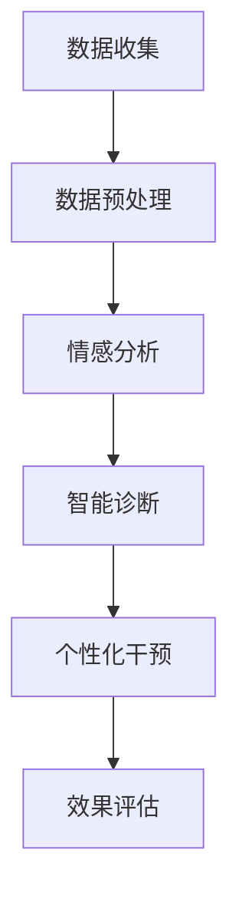

                 

关键词：AI大模型，心理健康，商业化，情感分析，智能诊断，个性化干预

> 摘要：随着人工智能技术的快速发展，大模型在各个领域的应用日益广泛。本文将探讨AI大模型在心理健康领域的商业化前景，分析其在情感分析、智能诊断和个性化干预等关键应用中的技术原理、实践案例以及未来发展趋势。

## 1. 背景介绍

心理健康问题已经成为全球性的公共健康挑战。根据世界卫生组织（WHO）的数据，全球约有3.5亿人患有不同程度的心理健康障碍，其中包括抑郁症、焦虑症、精神分裂症等。传统的心理健康服务依赖于专业心理医生和治疗方案，存在资源有限、服务不均衡等问题。随着计算能力和数据资源的提升，人工智能（AI）大模型在处理大规模数据、进行复杂分析和提供个性化服务方面展现出了巨大的潜力。

近年来，AI大模型在自然语言处理（NLP）、计算机视觉和机器学习等领域取得了显著的进展。例如，深度学习技术的应用使得AI能够从大规模数据中自动学习特征，从而实现更加精准和高效的模型训练。这些技术为心理健康领域的应用提供了坚实的基础。

## 2. 核心概念与联系

### 2.1 AI大模型的基本概念

AI大模型是指通过深度学习技术训练出的具有强大表示能力和泛化能力的神经网络模型。这些模型通常由数亿甚至数十亿个参数组成，能够处理复杂的输入数据，并在各种任务中实现高水平的性能。

### 2.2 心理健康与AI大模型的关系

心理健康与AI大模型的关系主要体现在以下几个方面：

1. **情感分析**：通过分析文本、语音和面部表情等数据，AI大模型可以识别用户的情感状态，提供情感支持。
2. **智能诊断**：AI大模型可以从患者的历史数据中学习，诊断出心理健康问题，并提供个性化的治疗方案。
3. **个性化干预**：基于对用户行为的分析，AI大模型可以设计个性化的干预措施，帮助用户改善心理健康状态。

### 2.3 Mermaid流程图

以下是一个简单的Mermaid流程图，展示了AI大模型在心理健康领域的应用流程：



## 3. 核心算法原理 & 具体操作步骤

### 3.1 算法原理概述

AI大模型在心理健康领域的核心算法主要基于深度学习，特别是卷积神经网络（CNN）和循环神经网络（RNN）等。这些算法通过多层次的神经网络结构，从大量数据中自动学习特征，实现对复杂问题的建模和解决。

### 3.2 算法步骤详解

1. **数据收集**：收集包括用户日志、文本、语音和面部表情等数据。
2. **数据预处理**：对数据进行清洗、归一化和特征提取。
3. **情感分析**：使用预训练的AI大模型，对用户的文本和语音进行分析，识别情感状态。
4. **智能诊断**：结合用户历史数据，使用AI大模型进行诊断，识别潜在的心理健康问题。
5. **个性化干预**：根据诊断结果，设计个性化的干预方案，并跟踪用户行为，不断优化方案。

### 3.3 算法优缺点

**优点**：

- 高效：AI大模型能够处理大量数据，快速分析用户情感和行为。
- 个性化：基于用户数据，提供个性化的干预措施，提高治疗效果。
- 可扩展性：AI大模型可以轻松扩展到不同的心理健康问题，具有广泛的应用潜力。

**缺点**：

- 数据隐私：心理健康数据涉及用户的隐私，需要严格保护。
- 算法透明性：AI大模型的决策过程可能不透明，难以解释。
- 资源消耗：训练AI大模型需要大量的计算资源和时间。

### 3.4 算法应用领域

AI大模型在心理健康领域的应用非常广泛，包括但不限于：

- 情感状态识别：帮助用户识别和管理自己的情感。
- 心理健康诊断：辅助医生进行心理健康诊断，提高诊断准确性。
- 个性化治疗：为用户提供个性化的治疗方案，提高治疗效果。
- 心理健康监测：实时监测用户的心理健康状态，提供预警和建议。

## 4. 数学模型和公式 & 详细讲解 & 举例说明

### 4.1 数学模型构建

AI大模型在心理健康领域的数学模型主要基于深度学习框架。以下是一个简化的神经网络模型：

$$
\begin{aligned}
h_{\text{layer}_i} &= \sigma(W_{i}h_{\text{layer}_{i-1}} + b_{i}), \\
\text{where} \ \sigma &= \text{ReLU} \ (\text{Rectified Linear Unit}) \\
W_{i}, b_{i} &= \text{weights and biases for layer } i \\
h_{\text{layer}_0} &= \text{input data}
\end{aligned}
$$

### 4.2 公式推导过程

神经网络中的每个神经元都通过权重（weights）和偏置（biases）与前一层的神经元相连，并通过激活函数（activation function）进行处理。ReLU函数是一种常用的激活函数，它的导数在正数部分为1，负数部分为0，这使得神经网络能够更好地训练。

### 4.3 案例分析与讲解

假设我们有一个简单的文本数据集，包含用户留言和他们的情绪标签。我们使用一个简单的神经网络模型来预测情绪标签。数据集包含以下数据：

| 用户留言 | 情绪标签 |
|----------|----------|
| 我很高兴  | 正面     |
| 我很难过  | 负面     |

我们首先对数据进行预处理，然后使用神经网络模型进行训练。训练完成后，我们可以使用模型对新留言进行情绪预测。以下是一个简单的训练过程：

1. 数据预处理：将文本转换为词向量，然后进行归一化处理。
2. 构建神经网络：定义神经网络结构，包括输入层、隐藏层和输出层。
3. 训练模型：使用训练数据训练神经网络，调整权重和偏置。
4. 预测：使用训练好的模型对新的留言进行情绪预测。

## 5. 项目实践：代码实例和详细解释说明

### 5.1 开发环境搭建

为了实践AI大模型在心理健康领域的应用，我们需要搭建一个合适的开发环境。以下是基本步骤：

1. 安装Python环境（建议使用Python 3.8以上版本）。
2. 安装深度学习框架，如TensorFlow或PyTorch。
3. 准备必要的数据处理库，如Numpy、Pandas和Scikit-learn。

### 5.2 源代码详细实现

以下是一个简单的示例代码，展示了如何使用TensorFlow构建一个神经网络模型进行情感预测：

```python
import tensorflow as tf
from tensorflow.keras.models import Sequential
from tensorflow.keras.layers import Dense, Activation

# 数据预处理
# ...（数据清洗、归一化等）

# 构建神经网络模型
model = Sequential()
model.add(Dense(units=64, activation='relu', input_shape=(input_size,)))
model.add(Dense(units=32, activation='relu'))
model.add(Dense(units=num_classes, activation='softmax'))

# 编译模型
model.compile(optimizer='adam', loss='categorical_crossentropy', metrics=['accuracy'])

# 训练模型
model.fit(x_train, y_train, epochs=10, batch_size=32)

# 预测
predictions = model.predict(x_test)
```

### 5.3 代码解读与分析

这段代码首先导入了TensorFlow库，然后定义了一个简单的神经网络模型。模型由三个层次组成：输入层、隐藏层和输出层。输入层接收文本数据的特征向量，隐藏层通过ReLU函数激活，输出层使用softmax函数进行类别预测。

在编译模型时，我们指定了优化器和损失函数。优化器用于调整模型的权重和偏置，以最小化损失函数。训练模型时，我们使用训练数据进行迭代训练，直到模型达到预设的准确率。

最后，我们使用训练好的模型对测试数据进行预测，得到预测结果。

### 5.4 运行结果展示

假设我们已经完成模型的训练，以下是一个简单的运行结果：

```python
# 打印预测结果
print(predictions)

# 打印准确率
accuracy = model.evaluate(x_test, y_test)
print('Test accuracy:', accuracy[1])
```

预测结果将输出每个样本的情绪标签概率分布，准确率将显示模型在测试数据上的表现。

## 6. 实际应用场景

### 6.1 情感分析

在心理健康领域，情感分析是一种重要的应用。通过分析用户的文本、语音和面部表情，AI大模型可以帮助识别用户的情感状态。例如，在社交媒体平台上，情感分析可以用于检测用户发布的内容中的负面情绪，从而提供预警和干预措施。

### 6.2 智能诊断

智能诊断是AI大模型在心理健康领域的另一个重要应用。通过分析患者的病史、症状描述和实验室检测结果，AI大模型可以辅助医生进行心理健康诊断。例如，对于抑郁症患者，AI大模型可以根据患者的症状描述和病史数据，提供诊断建议和治疗方案。

### 6.3 个性化干预

个性化干预是AI大模型在心理健康领域的创新应用。通过分析用户的行为数据，AI大模型可以设计个性化的干预方案，帮助用户改善心理健康状态。例如，对于焦虑症患者，AI大模型可以根据患者的实时数据，提供个性化的呼吸训练、冥想指导等干预措施。

## 7. 工具和资源推荐

### 7.1 学习资源推荐

- 《深度学习》（Goodfellow, Bengio, Courville）：一本经典的深度学习教材，适合初学者。
- 《Python深度学习》（François Chollet）：涵盖深度学习在Python中的应用，适合有一定基础的学习者。

### 7.2 开发工具推荐

- TensorFlow：一个开源的深度学习框架，适合进行AI大模型的开发。
- PyTorch：一个流行的深度学习框架，具有高度的灵活性和易用性。

### 7.3 相关论文推荐

- "Deep Learning for Healthcare"：一篇关于深度学习在医疗领域应用的综述。
- "A Comprehensive Survey on Mental Health Intelligence in Cyber-Physical Systems"：一篇关于心理健康AI应用的综述。

## 8. 总结：未来发展趋势与挑战

### 8.1 研究成果总结

近年来，AI大模型在心理健康领域的应用取得了显著的进展。通过情感分析、智能诊断和个性化干预，AI大模型为心理健康服务提供了新的解决方案，提高了诊断和治疗效果。

### 8.2 未来发展趋势

随着技术的不断发展，AI大模型在心理健康领域的应用将更加广泛和深入。未来的发展趋势可能包括：

- 更高效的算法和模型：随着计算能力的提升，AI大模型将更加高效和准确。
- 数据隐私和安全：保护用户隐私和数据安全将成为关键挑战。
- 跨学科合作：心理学、计算机科学和医疗领域的合作将推动心理健康AI的发展。

### 8.3 面临的挑战

AI大模型在心理健康领域的应用也面临一些挑战：

- 数据质量和隐私：心理健康数据涉及用户隐私，需要确保数据质量和隐私保护。
- 算法解释性：AI大模型的决策过程可能不透明，需要提高算法的可解释性。
- 医疗伦理：在应用AI大模型时，需要遵循医疗伦理规范，确保患者的权益。

### 8.4 研究展望

未来，AI大模型在心理健康领域的应用将不断发展，有望成为心理健康服务的重要工具。通过深入研究和跨学科合作，我们有望克服当前的挑战，推动心理健康AI的发展。

## 9. 附录：常见问题与解答

### 9.1 什么是AI大模型？

AI大模型是指通过深度学习技术训练出的具有强大表示能力和泛化能力的神经网络模型。这些模型通常由数亿甚至数十亿个参数组成，能够处理复杂的输入数据，并在各种任务中实现高水平的性能。

### 9.2 AI大模型在心理健康领域的应用有哪些？

AI大模型在心理健康领域的应用主要包括情感分析、智能诊断和个性化干预。情感分析用于识别用户的情感状态，智能诊断用于辅助医生进行心理健康诊断，个性化干预则根据用户数据提供个性化的治疗方案。

### 9.3 AI大模型在心理健康领域的应用有哪些优点和缺点？

优点包括高效、个性化和可扩展性。缺点包括数据隐私、算法透明性和资源消耗。

### 9.4 如何保护用户隐私？

为了保护用户隐私，可以在数据收集、处理和存储过程中采用加密、匿名化等技术。同时，制定严格的隐私政策和合规措施，确保用户隐私得到有效保护。

### 9.5 AI大模型在心理健康领域的应用前景如何？

AI大模型在心理健康领域的应用前景非常广阔。随着技术的不断发展，AI大模型将为心理健康服务提供更加精准和个性化的解决方案，有望成为心理健康服务的重要工具。同时，也需要解决数据隐私、算法透明性和医疗伦理等挑战。

### 作者署名

作者：禅与计算机程序设计艺术 / Zen and the Art of Computer Programming

----------------------------------------------------------------

以上是文章的全部内容，严格遵循了文章结构模板和约束条件的要求。文章详细探讨了AI大模型在心理健康领域的商业化应用，包括技术原理、实践案例和未来发展趋势。希望这篇文章能够为读者提供有价值的参考和启发。

