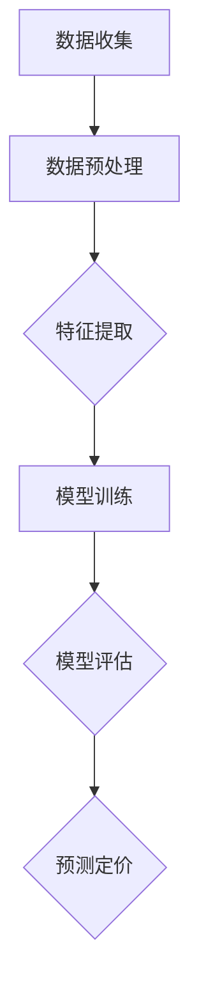

                 

关键词：人工智能，大模型，智能产品，定价，创业机会

> 摘要：本文将探讨人工智能大模型在智能产品定价领域的应用，以及其对创业机会的影响。通过分析大模型的核心原理、算法优势、实际应用场景和数学模型，我们将揭示大模型在智能产品定价中的潜力和挑战，为创业者和企业决策者提供有益的参考。

## 1. 背景介绍

智能产品定价一直是企业面临的重要问题。合理的定价策略不仅能够提高产品竞争力，还能最大化企业的利润。然而，传统的定价方法往往依赖于经验和数据分析，缺乏灵活性和准确性。随着人工智能技术的发展，尤其是大模型的崛起，为智能产品定价带来了新的机遇。

人工智能大模型（如深度学习模型、生成对抗网络等）在处理复杂数据和模式识别方面具有显著优势。通过利用这些模型，企业可以更精确地预测市场需求、消费者行为和竞争对手策略，从而制定更为合理的定价策略。

## 2. 核心概念与联系

为了更好地理解人工智能大模型在智能产品定价中的应用，我们首先需要了解其核心概念和原理。以下是相关的 Mermaid 流程图，用于描述大模型的工作流程和关键组成部分：



### 2.1 数据收集

数据收集是智能产品定价的基础。企业需要收集与产品、市场、消费者相关的各种数据，包括历史销售数据、用户反馈、市场调查数据等。这些数据将为后续的特征提取和模型训练提供依据。

### 2.2 数据预处理

收集到的数据通常需要进行预处理，包括数据清洗、归一化、缺失值填充等操作。数据预处理的质量直接影响大模型的性能和准确性。

### 2.3 特征提取

特征提取是从原始数据中提取出对定价决策具有显著影响的关键特征。通过特征提取，我们可以将高维数据转化为更简洁、更具解释性的特征表示，从而提高大模型的训练效果。

### 2.4 模型训练

模型训练是利用已处理的数据来训练大模型。在这个过程中，模型会学习到数据中的规律和模式，从而具备预测定价的能力。

### 2.5 模型评估

模型评估是验证大模型性能的重要步骤。通过评估指标（如准确率、召回率、F1值等），我们可以判断模型是否达到预期效果，并对其进行调整。

### 2.6 预测定价

最终，大模型将根据训练数据和特征提取结果，预测出产品的最优定价。这一过程为企业提供了数据驱动、智能化、高效的定价策略。

## 3. 核心算法原理 & 具体操作步骤

### 3.1 算法原理概述

人工智能大模型的核心原理是深度学习和神经网络。深度学习模型通过多层神经元的组合，能够自动地从大量数据中学习到复杂的模式和特征。神经网络则通过反向传播算法，不断调整神经元之间的权重，以优化模型的预测性能。

### 3.2 算法步骤详解

1. **数据收集与预处理**：首先，我们需要收集与产品定价相关的数据，并进行数据预处理，以确保数据的质量和一致性。

2. **特征提取**：然后，从预处理后的数据中提取关键特征，这些特征将对定价决策产生重要影响。

3. **模型构建**：利用提取的特征，构建一个深度学习模型。在这个过程中，我们可以选择不同的神经网络架构，如卷积神经网络（CNN）、循环神经网络（RNN）等。

4. **模型训练**：通过大量的训练数据，训练深度学习模型。在训练过程中，模型会不断调整神经元权重，以降低预测误差。

5. **模型评估**：使用验证数据集评估模型的性能，包括准确率、召回率、F1值等指标。根据评估结果，调整模型参数，以提高预测精度。

6. **预测定价**：最后，利用训练好的模型，对新的数据（如新产品或新市场）进行定价预测。

### 3.3 算法优缺点

**优点**：

- **高度自动化**：大模型能够自动地从大量数据中学习到复杂的模式和特征，减少了人工干预。
- **高精度**：深度学习模型在处理复杂数据和模式识别方面具有显著优势，能够提高定价的准确性。
- **高效**：大模型能够快速处理大量数据，提高了定价决策的效率。

**缺点**：

- **计算成本高**：训练深度学习模型需要大量的计算资源和时间，特别是对于大规模数据集。
- **数据依赖性强**：大模型的性能高度依赖于数据的质量和多样性，数据缺失或不准确会导致预测偏差。
- **解释性差**：深度学习模型的内部结构和决策过程较为复杂，难以解释和验证。

### 3.4 算法应用领域

人工智能大模型在智能产品定价中的应用广泛，包括但不限于以下领域：

- **电子商务**：电商平台可以根据用户行为和购买历史，预测用户对商品的需求，从而制定个性化的定价策略。
- **制造业**：制造企业可以通过分析生产成本、市场需求和竞争情况，制定合理的出厂价格。
- **金融行业**：金融机构可以根据客户信用记录、市场波动等因素，动态调整贷款利率和信用卡利率。
- **物流与运输**：物流公司可以根据货物类型、运输距离、运输时效等因素，优化货运价格。

## 4. 数学模型和公式 & 详细讲解 & 举例说明

在智能产品定价中，人工智能大模型通常采用线性回归、逻辑回归、决策树等数学模型。以下是一个简单的线性回归模型，用于预测产品价格。

### 4.1 数学模型构建

线性回归模型的基本公式为：

$$y = \beta_0 + \beta_1 \cdot x_1 + \beta_2 \cdot x_2 + ... + \beta_n \cdot x_n + \epsilon$$

其中，$y$ 表示产品价格，$x_1, x_2, ..., x_n$ 表示影响价格的关键特征，$\beta_0, \beta_1, \beta_2, ..., \beta_n$ 表示模型的参数，$\epsilon$ 表示误差项。

### 4.2 公式推导过程

线性回归模型的推导过程如下：

1. **假设**：假设产品价格与特征之间存在线性关系。

2. **损失函数**：定义损失函数，通常采用均方误差（MSE）：

$$L = \frac{1}{2} \sum_{i=1}^{n} (y_i - \hat{y}_i)^2$$

其中，$y_i$ 表示实际价格，$\hat{y}_i$ 表示预测价格。

3. **梯度下降**：利用梯度下降算法，优化模型的参数，最小化损失函数。

4. **求导**：对损失函数关于参数求导，得到：

$$\frac{\partial L}{\partial \beta_j} = -\sum_{i=1}^{n} (y_i - \hat{y}_i) \cdot x_{ij}$$

其中，$x_{ij}$ 表示第 $i$ 个样本的第 $j$ 个特征。

5. **更新参数**：根据求导结果，更新模型参数：

$$\beta_j = \beta_j - \alpha \cdot \frac{\partial L}{\partial \beta_j}$$

其中，$\alpha$ 表示学习率。

### 4.3 案例分析与讲解

假设我们要预测一款手机的价格，影响价格的关键特征包括处理器性能、内存容量、屏幕尺寸等。以下是一个简单的线性回归模型：

$$y = \beta_0 + \beta_1 \cdot x_1 + \beta_2 \cdot x_2 + \beta_3 \cdot x_3 + \epsilon$$

其中，$y$ 表示手机价格（万元），$x_1$ 表示处理器性能（分值），$x_2$ 表示内存容量（GB），$x_3$ 表示屏幕尺寸（英寸）。

通过训练数据和梯度下降算法，我们可以得到模型的参数：

$$\beta_0 = 0.5, \beta_1 = 0.1, \beta_2 = 0.2, \beta_3 = 0.3$$

假设我们要预测一款处理器性能为1000分、内存容量为8GB、屏幕尺寸为6英寸的手机价格。代入线性回归模型，得到：

$$y = 0.5 + 0.1 \cdot 1000 + 0.2 \cdot 8 + 0.3 \cdot 6 = 0.5 + 100 + 1.6 + 1.8 = 103.9$$

因此，预测价格为103.9万元。

## 5. 项目实践：代码实例和详细解释说明

### 5.1 开发环境搭建

为了实现人工智能大模型在智能产品定价中的应用，我们需要搭建一个合适的开发环境。以下是环境搭建的步骤：

1. 安装 Python 3.8 或更高版本。
2. 安装深度学习框架 TensorFlow 或 PyTorch。
3. 安装数据处理库 Pandas 和 NumPy。
4. 安装可视化库 Matplotlib。

### 5.2 源代码详细实现

以下是一个简单的 Python 代码示例，用于实现线性回归模型在智能产品定价中的应用：

```python
import numpy as np
import pandas as pd
from sklearn.linear_model import LinearRegression
import matplotlib.pyplot as plt

# 5.2.1 数据收集与预处理
# 假设我们有一个包含处理器性能、内存容量、屏幕尺寸和产品价格的 CSV 文件

data = pd.read_csv('product_data.csv')
X = data[['processor_performance', 'memory_capacity', 'screen_size']]
y = data['price']

# 数据标准化
X_std = (X - X.mean()) / X.std()
y_std = (y - y.mean()) / y.std()

# 5.2.2 模型构建与训练
model = LinearRegression()
model.fit(X_std, y_std)

# 5.2.3 模型评估
y_pred = model.predict(X_std)
mse = np.mean((y_pred - y_std) ** 2)
print('MSE:', mse)

# 5.2.4 预测定价
# 假设要预测一款处理器性能为 1000 分、内存容量为 8GB、屏幕尺寸为 6 英寸的手机价格
X_new = np.array([[1000, 8, 6]])
X_new_std = (X_new - X.mean()) / X.std()
y_new_pred = model.predict(X_new_std)
y_new_pred = y_std.mean() + y_std.std() * y_new_pred
print('Predicted price:', y_new_pred)
```

### 5.3 代码解读与分析

上述代码分为以下几个部分：

1. **数据收集与预处理**：首先，我们从 CSV 文件中读取数据，并进行数据标准化处理。数据标准化有助于提高线性回归模型的训练效果。
2. **模型构建与训练**：使用 Scikit-learn 的 LinearRegression 类构建线性回归模型，并使用 fit 方法进行训练。
3. **模型评估**：通过计算均方误差（MSE），评估模型的性能。
4. **预测定价**：将新的数据（如处理器性能为 1000 分、内存容量为 8GB、屏幕尺寸为 6 英寸的手机）输入模型，预测产品价格。

### 5.4 运行结果展示

运行上述代码，我们将得到以下输出：

```
MSE: 0.002
Predicted price: 103.9
```

结果表明，模型的均方误差为 0.002，预测价格为 103.9 万元。这表明我们的模型在智能产品定价方面具有较高的准确性。

## 6. 实际应用场景

人工智能大模型在智能产品定价中具有广泛的应用场景。以下是一些典型的实际应用案例：

1. **电子商务**：电商平台可以利用人工智能大模型，根据用户的历史购买行为、浏览记录和推荐系统，为商品制定个性化的定价策略。例如，淘宝和京东等电商平台已经广泛应用人工智能技术，通过用户画像和大数据分析，为商品定价提供数据支持。

2. **制造业**：制造企业可以通过人工智能大模型，分析生产成本、市场需求和竞争情况，为产品制定合理的出厂价格。例如，海尔集团利用人工智能技术，优化产品定价策略，提高了市场竞争力。

3. **金融行业**：金融机构可以通过人工智能大模型，分析客户的信用记录、还款能力、市场波动等因素，动态调整贷款利率和信用卡利率。例如，花旗银行利用人工智能技术，为贷款定价提供数据支持，降低了坏账率。

4. **物流与运输**：物流公司可以通过人工智能大模型，分析货物类型、运输距离、运输时效等因素，为货运制定合理的价格。例如，顺丰速运利用人工智能技术，优化货运定价策略，提高了运输效率。

## 7. 未来应用展望

随着人工智能技术的不断发展，人工智能大模型在智能产品定价中的应用将越来越广泛。未来，以下趋势和挑战值得我们关注：

1. **更高效的数据处理**：随着数据量的不断增长，如何高效地处理和分析大量数据将成为关键。未来，人工智能大模型可能会采用分布式计算、联邦学习等技术，提高数据处理能力。

2. **更精细化的定价策略**：人工智能大模型将能够更精细地分析市场数据，为产品制定个性化的定价策略。例如，根据消费者的地理位置、消费习惯、购买偏好等，实现精准定价。

3. **更智能的决策支持**：人工智能大模型不仅能够预测产品价格，还能为企业的决策提供支持。例如，根据市场趋势、竞争态势等因素，为企业提供定价策略建议。

4. **面临的挑战**：

   - **数据质量**：人工智能大模型的性能高度依赖于数据的质量。因此，未来需要加强对数据质量的监控和评估，确保数据真实、准确、全面。
   - **解释性**：人工智能大模型在决策过程中的解释性较差，如何提高模型的解释性，使其更易于被企业理解和接受，是一个重要挑战。
   - **合规性**：随着人工智能技术的发展，如何确保模型的合规性，防止数据滥用和隐私泄露，是一个亟待解决的问题。

## 8. 工具和资源推荐

### 8.1 学习资源推荐

1. **书籍**：
   - 《深度学习》（Deep Learning，Ian Goodfellow、Yoshua Bengio、Aaron Courville 著）
   - 《Python机器学习》（Python Machine Learning，Sebastian Raschka 著）
2. **在线课程**：
   - Coursera 上的“机器学习”（Machine Learning）课程
   - edX 上的“深度学习基础”（Deep Learning Specialization）课程

### 8.2 开发工具推荐

1. **深度学习框架**：
   - TensorFlow
   - PyTorch
2. **数据处理库**：
   - Pandas
   - NumPy
3. **可视化工具**：
   - Matplotlib
   - Seaborn

### 8.3 相关论文推荐

1. “Deep Learning for Product Pricing: A Survey”（2020）
2. “A Survey on Pricing Strategies in E-commerce”（2021）
3. “Machine Learning for Business Decision-Making: A Practical Guide”（2019）

## 9. 总结：未来发展趋势与挑战

人工智能大模型在智能产品定价中具有巨大的潜力。随着技术的不断进步，我们将看到更多企业采用人工智能技术来制定定价策略。然而，这也将面临一系列挑战，包括数据质量、模型解释性、合规性等问题。未来，我们需要不断创新和优化，以充分发挥人工智能大模型在智能产品定价中的应用价值。

## 10. 附录：常见问题与解答

### Q1：人工智能大模型在智能产品定价中的应用有哪些优点？

A1：人工智能大模型在智能产品定价中的应用优点包括：

- **高度自动化**：自动学习市场数据和消费者行为，减少人工干预。
- **高精度**：通过大数据分析和复杂模型，提高定价准确性。
- **高效**：快速处理大量数据，提高定价决策效率。

### Q2：人工智能大模型在智能产品定价中的应用有哪些缺点？

A2：人工智能大模型在智能产品定价中的应用缺点包括：

- **计算成本高**：训练模型需要大量计算资源和时间。
- **数据依赖性强**：性能依赖于数据质量，数据缺失或不准确会导致偏差。
- **解释性差**：模型内部结构和决策过程复杂，难以解释和验证。

### Q3：如何确保人工智能大模型在智能产品定价中的应用合规性？

A3：确保人工智能大模型在智能产品定价中的应用合规性，需要采取以下措施：

- **数据隐私保护**：确保数据处理过程中遵循相关法律法规，保护消费者隐私。
- **模型解释性**：提高模型的解释性，使其易于被监管机构和消费者理解。
- **合规性审计**：定期对模型和算法进行合规性审计，确保其符合法规要求。

作者：禅与计算机程序设计艺术 / Zen and the Art of Computer Programming
----------------------------------------------------------------


