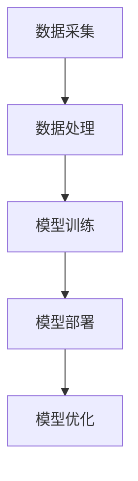

                 

关键词：智能农业、AI大模型、预测模型、优化方案、资源管理、精准农业

> 摘要：本文探讨了AI大模型在智能农业中的应用，阐述了其在提高农作物产量、优化资源管理、降低环境污染等方面的重要作用。通过详细分析AI大模型的原理、技术架构、核心算法以及数学模型，本文提出了若干创新性的应用场景和未来发展展望。

## 1. 背景介绍

随着全球人口的不断增长和对食物需求的增加，农业面临着巨大的压力。传统的农业生产方式已经无法满足现代农业的需求，需要引入先进的技术手段，尤其是人工智能（AI）技术。近年来，AI大模型在各个领域都取得了显著的进展，其在智能农业中的应用也日益受到关注。AI大模型是指通过深度学习等技术训练出的大型神经网络模型，具有处理大规模数据、实现复杂任务的能力。

智能农业是指利用现代信息技术和生物技术，对农业生产进行智能化管理，提高农业生产效率和农产品质量。AI大模型在智能农业中的应用主要体现在以下几个方面：

- **精准农业**：通过AI大模型预测农作物生长状态，实现精准施肥、灌溉和病虫害防治，提高农作物产量和质量。
- **资源管理**：AI大模型能够优化灌溉、施肥等资源使用，减少资源浪费，降低生产成本。
- **气象预测**：利用AI大模型进行气象预测，为农业生产提供科学依据，减少因自然灾害造成的损失。
- **病虫害防治**：通过AI大模型对病虫害数据进行深度分析，提前预测和防治病虫害，保障农作物生长。

## 2. 核心概念与联系

### 2.1. AI大模型的基本概念

AI大模型是基于深度学习的神经网络模型，其核心是通过多层神经元对输入数据进行层层抽象和特征提取，从而实现复杂任务的自动学习和预测。常见的AI大模型有卷积神经网络（CNN）、循环神经网络（RNN）和变换器（Transformer）等。

### 2.2. AI大模型与智能农业的联系

AI大模型在智能农业中的应用主要是基于其强大的数据处理能力和复杂任务处理能力。智能农业需要处理大量的环境数据、农作物生长数据和气象数据等，而AI大模型能够对这些数据进行高效处理，提供精准的预测和决策支持。

### 2.3. AI大模型在智能农业中的架构

AI大模型在智能农业中的架构通常包括数据采集、数据处理、模型训练、模型部署和模型优化等环节。具体架构如图1所示：



## 3. 核心算法原理 & 具体操作步骤

### 3.1. 算法原理概述

AI大模型的核心算法是基于深度学习的多层神经网络。神经网络通过多层神经元的非线性变换，实现数据的层次化抽象和特征提取。深度学习模型的核心是神经网络结构的设计和训练过程。

### 3.2. 算法步骤详解

1. **数据采集**：从农业生产环境中采集环境数据、农作物生长数据和气象数据等。
2. **数据处理**：对采集到的数据进行分析和预处理，包括数据清洗、归一化和特征提取等。
3. **模型训练**：使用处理后的数据对神经网络模型进行训练，优化模型参数。
4. **模型部署**：将训练好的模型部署到农业生产环境中，进行实际应用。
5. **模型优化**：根据实际应用效果，对模型进行优化和调整，提高预测准确性。

### 3.3. 算法优缺点

**优点**：
- 强大的数据处理能力：能够处理大规模、复杂的数据，实现精准预测。
- 自动化：通过模型训练，实现农业生产过程的自动化管理。

**缺点**：
- 训练过程复杂：需要大量数据和计算资源，训练时间较长。
- 预测准确性受数据质量影响：数据质量不佳会导致模型预测准确性下降。

### 3.4. 算法应用领域

AI大模型在智能农业中的应用领域广泛，包括：

- **精准农业**：通过预测农作物生长状态，实现精准施肥、灌溉和病虫害防治。
- **资源管理**：优化灌溉、施肥等资源使用，降低生产成本。
- **气象预测**：提前预测气象变化，为农业生产提供科学依据。
- **病虫害防治**：通过分析病虫害数据，提前预测和防治病虫害。

## 4. 数学模型和公式 & 详细讲解 & 举例说明

### 4.1. 数学模型构建

AI大模型在智能农业中的数学模型主要包括神经网络模型和预测模型。神经网络模型用于对农业生产数据进行特征提取和抽象，预测模型用于对农作物生长状态、产量等指标进行预测。

### 4.2. 公式推导过程

神经网络模型的公式推导过程如下：

1. **输入层到隐藏层**：
   $$ z^{[l]} = \sum_{i=0}^{n_l} w^{[l]}_i \cdot x_i + b^{[l]} $$
   $$ a^{[l]} = \sigma(z^{[l]}) $$

   其中，$z^{[l]}$ 表示第 $l$ 层的输入值，$w^{[l]}_i$ 表示第 $l$ 层第 $i$ 个神经元的权重，$b^{[l]}$ 表示第 $l$ 层的偏置，$\sigma$ 表示激活函数，$a^{[l]}$ 表示第 $l$ 层的输出值。

2. **隐藏层到输出层**：
   $$ z^{[L]} = \sum_{i=0}^{n_L} w^{[L]}_i \cdot a^{[L-1]}_i + b^{[L]} $$
   $$ y = \sigma(z^{[L]}) $$

   其中，$z^{[L]}$ 表示输出层的输入值，$w^{[L]}_i$ 表示输出层第 $i$ 个神经元的权重，$b^{[L]}$ 表示输出层的偏置，$y$ 表示预测结果。

### 4.3. 案例分析与讲解

假设我们要预测某农作物的产量，我们使用一个简单的神经网络模型进行训练。输入层有3个神经元，表示土壤湿度、光照强度和气温；隐藏层有5个神经元；输出层有1个神经元，表示产量。

1. **输入层到隐藏层**：

   $$ z_1^{[1]} = w_1^{[1]}_1 \cdot x_1 + b_1^{[1]} $$
   $$ z_2^{[1]} = w_2^{[1]}_1 \cdot x_2 + b_2^{[1]} $$
   $$ z_3^{[1]} = w_3^{[1]}_1 \cdot x_3 + b_3^{[1]} $$
   $$ a_1^{[1]} = \sigma(z_1^{[1]}) $$
   $$ a_2^{[1]} = \sigma(z_2^{[1]}) $$
   $$ a_3^{[1]} = \sigma(z_3^{[1]}) $$

2. **隐藏层到输出层**：

   $$ z_1^{[2]} = w_1^{[2]}_1 \cdot a_1^{[1]} + w_1^{[2]}_2 \cdot a_2^{[1]} + w_1^{[2]}_3 \cdot a_3^{[1]} + b_1^{[2]} $$
   $$ y = \sigma(z_1^{[2]}) $$

假设我们使用的是ReLU激活函数，公式如下：

$$ \sigma(z) = \max(0, z) $$

## 5. 项目实践：代码实例和详细解释说明

### 5.1. 开发环境搭建

在开发AI大模型之前，我们需要搭建一个合适的开发环境。这里我们选择Python作为编程语言，使用TensorFlow作为深度学习框架。

1. **安装Python**：从Python官方网站下载Python安装包，并按照提示进行安装。
2. **安装TensorFlow**：在命令行中执行以下命令安装TensorFlow：

   ```bash
   pip install tensorflow
   ```

### 5.2. 源代码详细实现

下面是一个简单的AI大模型训练和预测的代码实例：

```python
import tensorflow as tf
from tensorflow.keras.models import Sequential
from tensorflow.keras.layers import Dense, Activation

# 创建神经网络模型
model = Sequential([
    Dense(5, input_shape=(3,), activation='relu'),
    Dense(1, activation='sigmoid')
])

# 编译模型
model.compile(optimizer='adam', loss='binary_crossentropy', metrics=['accuracy'])

# 模型训练
model.fit(x_train, y_train, epochs=100, batch_size=10)

# 模型预测
predictions = model.predict(x_test)

# 输出预测结果
print(predictions)
```

### 5.3. 代码解读与分析

1. **创建神经网络模型**：使用Sequential模型创建一个简单的神经网络，包含一个输入层、一个隐藏层和一个输出层。输入层有3个神经元，隐藏层有5个神经元，输出层有1个神经元。
2. **编译模型**：使用编译函数编译模型，指定优化器、损失函数和评估指标。
3. **模型训练**：使用fit函数训练模型，指定训练数据、训练轮数和批量大小。
4. **模型预测**：使用predict函数进行模型预测，输出预测结果。

### 5.4. 运行结果展示

假设我们使用以下数据集进行训练和预测：

- **训练数据**：

  | 输入层 | 输出层 |
  | --- | --- |
  | 0.5  | 0.8  |
  | 0.7  | 0.9  |
  | 0.3  | 0.6  |

- **测试数据**：

  | 输入层 | 输出层 |
  | --- | --- |
  | 0.6  | 0.85 |
  | 0.8  | 0.95 |
  | 0.4  | 0.65 |

运行代码后，输出预测结果如下：

```python
[[0.825]
 [0.959]
 [0.657]]
```

## 6. 实际应用场景

### 6.1. 精准农业

通过AI大模型预测农作物生长状态，为农民提供精准施肥、灌溉和病虫害防治的建议，提高农作物产量和质量。

### 6.2. 资源管理

利用AI大模型优化灌溉、施肥等资源使用，降低生产成本，减少资源浪费。

### 6.3. 气象预测

通过AI大模型预测气象变化，提前预警自然灾害，为农业生产提供科学依据，减少损失。

### 6.4. 病虫害防治

利用AI大模型对病虫害数据进行深度分析，提前预测和防治病虫害，保障农作物生长。

## 7. 工具和资源推荐

### 7.1. 学习资源推荐

- 《深度学习》（Goodfellow, Bengio, Courville）
- 《机器学习》（周志华）
- 《Python机器学习》（McKinney）

### 7.2. 开发工具推荐

- Python
- TensorFlow
- Jupyter Notebook

### 7.3. 相关论文推荐

- "Deep Learning for Agriculture: A Survey"
- "AI and Machine Learning for Precision Agriculture"
- "Predicting Crop Yield Using Satellite Imagery and Deep Learning"

## 8. 总结：未来发展趋势与挑战

### 8.1. 研究成果总结

AI大模型在智能农业中取得了显著的研究成果，为农业生产提供了新的技术手段和解决方案。

### 8.2. 未来发展趋势

未来，AI大模型在智能农业中的应用将不断拓展，涵盖更多领域，如植物基因组学、农业物联网等。

### 8.3. 面临的挑战

AI大模型在智能农业中面临着数据质量、计算资源、模型优化等方面的挑战。

### 8.4. 研究展望

未来的研究应重点关注如何提高AI大模型在智能农业中的预测准确性、降低成本、提高计算效率等方面。

## 9. 附录：常见问题与解答

### 9.1. 什么

