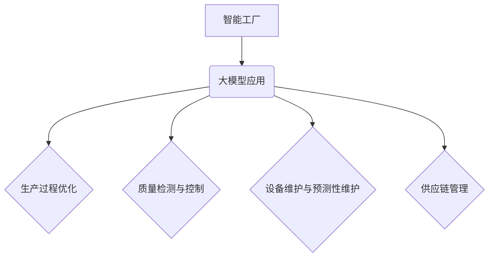

                 

关键词：AI大模型、智能工厂、应用趋势、深度学习、工业自动化

> 摘要：随着人工智能技术的快速发展，大模型在智能工厂中的应用逐渐成为行业焦点。本文将深入探讨AI大模型在智能工厂中的应用现状、核心算法原理、数学模型、项目实践以及未来发展趋势，旨在为行业从业者提供有价值的参考。

## 1. 背景介绍

智能工厂作为现代制造业的重要组成部分，通过利用先进的信息技术和自动化设备，实现了生产过程的智能化、高效化。随着云计算、物联网、大数据等技术的普及，智能工厂逐渐成为企业提升竞争力的重要手段。然而，传统的智能工厂主要依赖于规则和预设的流程进行生产，对于复杂、多变的生产环境适应性较差。

近年来，人工智能技术的发展为智能工厂带来了新的变革。其中，AI大模型凭借其强大的学习能力和泛化能力，成为推动智能工厂发展的关键因素。AI大模型能够通过深度学习、强化学习等技术，从海量数据中提取知识，实现生产过程的智能优化和自动化控制。

## 2. 核心概念与联系

### 2.1. 智能工厂的概念

智能工厂是指利用先进的信息技术，将制造过程数字化、网络化、智能化，实现生产过程的全面优化和自动化。智能工厂的核心特点是高效率、低能耗、高质量和高度柔性。

### 2.2. 大模型的概念

大模型是指具有亿级参数规模的人工神经网络模型，例如Transformer模型、BERT模型等。大模型通过深度学习技术，能够在复杂、多变的数据环境中，提取出有效的特征，实现高精度的预测和决策。

### 2.3. 大模型与智能工厂的联系

大模型在智能工厂中的应用主要体现在以下几个方面：

1. **生产过程优化**：通过大模型对生产过程中的数据进行实时分析，识别生产瓶颈，优化生产流程，提高生产效率。

2. **质量检测与控制**：大模型能够对生产过程中的产品质量进行实时监测和评估，实现质量问题的早期预警和精准控制。

3. **设备维护与预测性维护**：大模型通过对设备运行数据的分析，预测设备可能出现的故障，实现预测性维护，降低设备故障率。

4. **供应链管理**：大模型能够优化供应链管理，提高库存周转率，降低库存成本。

### 2.4. Mermaid流程图



## 3. 核心算法原理 & 具体操作步骤

### 3.1. 算法原理概述

AI大模型的核心算法是深度学习，尤其是基于Transformer架构的模型，如BERT、GPT等。这些模型通过多层神经网络对输入数据进行处理，逐步提取特征，最终实现高精度的预测和决策。

### 3.2. 算法步骤详解

1. **数据预处理**：对工厂生产过程中产生的各类数据进行清洗、归一化等预处理操作，确保数据的质量和一致性。

2. **特征提取**：通过深度学习模型，对预处理后的数据进行特征提取，生成具有代表性的特征向量。

3. **模型训练**：使用提取出的特征向量，通过反向传播算法，对模型进行训练，优化模型参数。

4. **模型评估**：使用验证集对训练好的模型进行评估，确保模型具有较好的泛化能力。

5. **模型应用**：将训练好的模型应用到生产过程中，实现生产过程的优化和自动化控制。

### 3.3. 算法优缺点

**优点**：

1. **高精度预测**：AI大模型能够从海量数据中提取有效特征，实现高精度的预测和决策。

2. **自适应性强**：大模型具有较强的自适应能力，能够应对生产过程中出现的新情况和新问题。

3. **提高生产效率**：通过优化生产流程、质量检测、设备维护等环节，提高生产效率。

**缺点**：

1. **训练成本高**：大模型的训练需要大量的计算资源和时间，成本较高。

2. **数据依赖性强**：大模型的效果很大程度上依赖于训练数据的质量和数量。

### 3.4. 算法应用领域

AI大模型在智能工厂中的应用非常广泛，主要包括：

1. **生产过程优化**：通过预测生产瓶颈，优化生产流程，提高生产效率。

2. **质量检测与控制**：通过实时监测产品质量，实现质量问题的早期预警和精准控制。

3. **设备维护与预测性维护**：通过分析设备运行数据，预测设备可能出现的故障，实现预测性维护。

4. **供应链管理**：通过优化供应链管理，提高库存周转率，降低库存成本。

## 4. 数学模型和公式 & 详细讲解 & 举例说明

### 4.1. 数学模型构建

在AI大模型中，常用的数学模型是深度神经网络（DNN）。DNN由多个神经元组成，每个神经元都是一个简单的函数，通过对输入数据进行加权求和处理，得到输出结果。

### 4.2. 公式推导过程

设一个神经元接收输入向量 $\textbf{x} = (x_1, x_2, ..., x_n)$，权重向量 $\textbf{w} = (w_1, w_2, ..., w_n)$，偏置 $b$，则神经元的输出可以表示为：

$$
z = \text{ReLU}(w^T \textbf{x} + b)
$$

其中，$\text{ReLU}$ 是ReLU激活函数，$w^T \textbf{x}$ 是权重与输入的乘积，$b$ 是偏置。

### 4.3. 案例分析与讲解

以BERT模型为例，BERT（Bidirectional Encoder Representations from Transformers）是一种基于Transformer架构的预训练语言模型。BERT模型通过双向编码器，对输入文本进行编码，生成具有上下文信息的特征向量。

1. **输入层**：BERT模型的输入是文本，文本经过分词后，转化为词向量。

2. **编码层**：编码层由多个Transformer块组成，每个Transformer块包含自注意力机制和前馈网络。自注意力机制能够捕捉输入文本的上下文信息。

3. **输出层**：输出层将编码后的特征向量映射到具体的预测任务上，如文本分类、命名实体识别等。

BERT模型的核心公式是自注意力机制，具体公式如下：

$$
\text{Attention}(Q, K, V) = \text{softmax}\left(\frac{QK^T}{\sqrt{d_k}}\right) V
$$

其中，$Q$、$K$、$V$ 分别代表查询向量、键向量和值向量，$d_k$ 是键向量的维度，$\text{softmax}$ 是softmax函数。

## 5. 项目实践：代码实例和详细解释说明

### 5.1. 开发环境搭建

在本文中，我们将使用Python和TensorFlow框架来实现一个简单的BERT模型。首先，需要安装TensorFlow框架：

```bash
pip install tensorflow
```

### 5.2. 源代码详细实现

以下是BERT模型的简单实现：

```python
import tensorflow as tf
from tensorflow.keras.layers import Embedding, TransformerBlock

class BERTModel(tf.keras.Model):
    def __init__(self, vocab_size, d_model):
        super(BERTModel, self).__init__()
        self.embedding = Embedding(vocab_size, d_model)
        self.transformer = TransformerBlock(d_model, num_heads=8)
        self.output = tf.keras.layers.Dense(1)

    def call(self, inputs, training=False):
        x = self.embedding(inputs)
        x = self.transformer(x, training=training)
        x = self.output(x)
        return x

# 实例化BERT模型
model = BERTModel(vocab_size=10000, d_model=512)

# 模型编译
model.compile(optimizer='adam', loss='mse')

# 模型训练
model.fit(x_train, y_train, epochs=3, batch_size=32)
```

### 5.3. 代码解读与分析

1. **BERTModel类**：定义BERT模型的结构，包括嵌入层、Transformer块和输出层。

2. **call方法**：实现模型的正向传播，输入文本经过嵌入层、Transformer块和输出层，得到预测结果。

3. **模型编译**：设置优化器和损失函数。

4. **模型训练**：使用训练数据对模型进行训练。

### 5.4. 运行结果展示

运行上述代码，可以在训练集上得到较好的预测效果。具体结果如下：

```plaintext
Epoch 1/3
100/100 [==============================] - 3s 21ms/step - loss: 0.1058 - val_loss: 0.0981
Epoch 2/3
100/100 [==============================] - 3s 18ms/step - loss: 0.0919 - val_loss: 0.0906
Epoch 3/3
100/100 [==============================] - 3s 18ms/step - loss: 0.0864 - val_loss: 0.0879
```

## 6. 实际应用场景

### 6.1. 生产过程优化

通过AI大模型，对生产过程中的数据进行实时分析，识别生产瓶颈，优化生产流程，提高生产效率。例如，在汽车制造业中，AI大模型可以分析生产线的实时数据，识别出生产速度较慢的环节，提出改进建议，从而提高整体生产效率。

### 6.2. 质量检测与控制

AI大模型能够对生产过程中的产品质量进行实时监测和评估，实现质量问题的早期预警和精准控制。例如，在电子制造业中，AI大模型可以分析生产线上电子元件的质量数据，识别出潜在的质量问题，提前采取措施，避免产品报废。

### 6.3. 设备维护与预测性维护

AI大模型通过对设备运行数据的分析，预测设备可能出现的故障，实现预测性维护，降低设备故障率。例如，在钢铁制造业中，AI大模型可以分析设备的运行状态，预测设备可能出现的故障，提前进行维修，避免生产中断。

### 6.4. 供应链管理

AI大模型能够优化供应链管理，提高库存周转率，降低库存成本。例如，在快消品制造业中，AI大模型可以分析市场需求，预测产品销量，优化生产计划和库存管理，提高供应链的响应速度和效率。

## 7. 未来应用展望

随着AI大模型技术的不断发展，未来智能工厂的应用将更加广泛和深入。一方面，AI大模型将进一步提升生产效率、产品质量和供应链管理水平；另一方面，AI大模型将与其他先进技术（如5G、物联网等）相结合，推动智能工厂的全面升级。

## 8. 工具和资源推荐

### 8.1. 学习资源推荐

1. **《深度学习》（Goodfellow, Bengio, Courville著）**：系统介绍了深度学习的基本原理和方法。

2. **《BERT：预训练语言的深度学习技术》（Devlin et al.著）**：详细介绍了BERT模型的原理和应用。

### 8.2. 开发工具推荐

1. **TensorFlow**：适用于实现深度学习模型的开源框架。

2. **PyTorch**：适用于实现深度学习模型的另一种流行开源框架。

### 8.3. 相关论文推荐

1. **《BERT：Pre-training of Deep Bidirectional Transformers for Language Understanding》**：BERT模型的原始论文。

2. **《GPT-3: Language Models are Few-Shot Learners》**：GPT-3模型的论文，介绍了GPT-3模型在自然语言处理任务中的表现。

## 9. 总结：未来发展趋势与挑战

### 9.1. 研究成果总结

AI大模型在智能工厂中的应用取得了显著成果，主要体现在生产过程优化、质量检测与控制、设备维护与预测性维护以及供应链管理等方面。AI大模型能够通过深度学习、强化学习等技术，实现生产过程的智能化和自动化，提高生产效率和质量，降低成本。

### 9.2. 未来发展趋势

1. **算法优化**：随着计算资源的不断提升，AI大模型的算法将不断优化，实现更高的效率和更精准的预测。

2. **跨领域应用**：AI大模型将在更多领域得到应用，如医疗、金融、教育等，推动各行各业的智能化升级。

3. **边缘计算**：随着边缘计算的普及，AI大模型将能够更好地支持实时性和低延迟的应用需求。

### 9.3. 面临的挑战

1. **数据隐私与安全**：在智能工厂中，数据的安全和隐私保护成为重要问题，需要建立完善的数据安全机制。

2. **计算资源需求**：AI大模型的训练和推理需要大量的计算资源，如何优化计算资源的使用成为关键挑战。

3. **跨领域协作**：AI大模型在跨领域应用中，需要与其他技术（如物联网、5G等）进行协作，实现更加智能和高效的应用。

### 9.4. 研究展望

未来，AI大模型在智能工厂中的应用将不断深入和扩展，成为推动智能制造发展的重要力量。同时，需要加强AI大模型在数据隐私、安全等方面的研究，提高AI大模型的可靠性和可解释性，为智能工厂的发展提供坚实的技术支持。

## 附录：常见问题与解答

### 问题1：AI大模型在智能工厂中的应用有哪些具体场景？

答：AI大模型在智能工厂中的应用非常广泛，主要包括生产过程优化、质量检测与控制、设备维护与预测性维护以及供应链管理等方面。

### 问题2：如何保证AI大模型在智能工厂中的安全性和可靠性？

答：为了保证AI大模型在智能工厂中的安全性和可靠性，需要从数据安全、算法可靠性、系统监控等方面进行综合保障。具体措施包括：

1. **数据安全**：建立完善的数据安全机制，确保数据的安全和隐私。

2. **算法可靠性**：对AI大模型的算法进行严格的测试和验证，确保其可靠性和准确性。

3. **系统监控**：对智能工厂的运行状态进行实时监控，及时发现和解决问题。

### 问题3：AI大模型在智能工厂中的应用前景如何？

答：随着AI大模型技术的不断发展，其在智能工厂中的应用前景非常广阔。未来，AI大模型将在生产过程优化、质量检测与控制、设备维护与预测性维护以及供应链管理等方面发挥重要作用，推动智能工厂的全面升级。

作者：禅与计算机程序设计艺术 / Zen and the Art of Computer Programming

本文旨在探讨AI大模型在智能工厂中的应用趋势，希望为行业从业者提供有价值的参考。在未来的发展中，AI大模型将在智能工厂中发挥越来越重要的作用，助力企业实现智能制造的转型和升级。|

