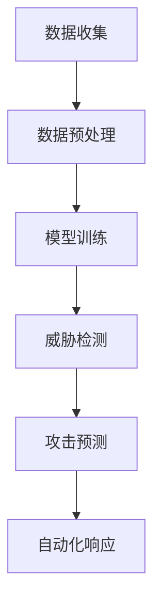

                 

在当今数字化时代，网络安全已成为关乎国计民生的重要议题。随着互联网技术的飞速发展，网络攻击手段也日益翻新，传统的网络安全防御策略逐渐显得力不从心。为了应对这一挑战，人工智能（AI）大模型在网络安全防御中的应用逐渐成为研究的热点。本文旨在探讨AI大模型在智能网络安全防御中的应用，分析其核心概念、算法原理、数学模型、项目实践和未来发展趋势，为网络安全领域的研究和实践提供参考。

## 关键词

- 人工智能
- 大模型
- 智能网络安全防御
- 算法原理
- 数学模型
- 项目实践
- 未来展望

## 摘要

本文从AI大模型在智能网络安全防御中的应用出发，首先介绍了AI大模型的基本概念和特点，然后详细阐述了其在网络安全防御中的核心算法原理、数学模型和具体操作步骤。通过项目实践部分，本文展示了AI大模型在实际应用中的代码实现和运行结果。最后，本文对AI大模型在智能网络安全防御中的未来应用场景和展望进行了探讨。

## 1. 背景介绍

随着云计算、大数据和物联网技术的普及，网络攻击手段日益多样化，网络安全风险不断加剧。传统的网络安全防御策略，如防火墙、入侵检测系统等，已经无法满足日益复杂的网络安全需求。为了应对这一挑战，人工智能大模型应运而生。人工智能大模型是指通过大规模数据训练和学习，具有高度智能化的模型，能够进行自动化的决策和预测。在网络安全防御领域，AI大模型可以识别未知威胁、预测攻击行为、自动化响应和防御，大大提高了网络安全的防御能力。

### 1.1 网络安全形势

近年来，全球范围内的网络攻击事件频发，涉及个人隐私泄露、企业数据损失、国家网络安全等各个方面。例如，2017年的“WannaCry”勒索病毒攻击，造成了全球范围内的严重影响；2021年的“太阳风”黑客攻击，更是让美国国家安全局面临巨大威胁。这些事件都凸显了网络安全的重要性，也使得AI大模型在网络安全防御中的应用备受关注。

### 1.2 AI大模型的发展

AI大模型的发展得益于深度学习技术的进步和计算能力的提升。深度学习是一种通过多层神经网络进行数据建模的技术，能够自动提取数据中的特征。而计算能力的提升，特别是高性能计算集群和GPU的普及，使得大规模数据处理和模型训练成为可能。随着AI大模型的不断优化和完善，其在各个领域的应用也越来越广泛。

### 1.3 AI大模型在网络安全防御中的优势

AI大模型在网络安全防御中的优势主要体现在以下几个方面：

- **高效性**：AI大模型可以通过大规模数据训练，快速识别和预测网络威胁，提高防御效率。
- **自动化**：AI大模型能够自动化地进行威胁识别、响应和防御，减少人工干预，降低运营成本。
- **适应性**：AI大模型能够根据网络环境和威胁变化，动态调整防御策略，提高防御效果。
- **智能化**：AI大模型具备自主学习能力，能够不断优化和提升防御能力。

## 2. 核心概念与联系

### 2.1 人工智能（AI）

人工智能是指通过计算机程序模拟人类智能行为的技术。它包括机器学习、深度学习、自然语言处理等多个子领域。在网络安全防御中，人工智能主要用于威胁检测、攻击预测、自动化响应等方面。

### 2.2 大模型（Big Model）

大模型是指通过大规模数据训练得到的具有高度智能化的模型。这些模型通常具有强大的特征提取和预测能力，能够处理复杂的任务。在网络安全防御中，大模型主要用于威胁检测、攻击预测和自动化响应等方面。

### 2.3 智能网络安全防御（Intelligent Network Security Defense）

智能网络安全防御是指利用人工智能大模型进行网络安全防御的一种技术。它通过实时监测网络流量、分析攻击特征、预测潜在威胁等方式，实现对网络攻击的自动识别和响应。

### 2.4 Mermaid 流程图（Mermaid Flowchart）

以下是一个简单的Mermaid流程图，展示了AI大模型在智能网络安全防御中的基本流程：



### 2.5 算法原理

AI大模型在智能网络安全防御中的核心算法主要包括威胁检测、攻击预测和自动化响应等。

- **威胁检测**：通过分析网络流量和系统日志，识别潜在的恶意行为。
- **攻击预测**：基于历史数据和威胁特征，预测可能发生的网络攻击。
- **自动化响应**：根据攻击预测结果，自动采取防御措施，如隔离受感染的主机、阻断攻击流量等。

## 3. 核心算法原理 & 具体操作步骤

### 3.1 算法原理概述

AI大模型在智能网络安全防御中的核心算法原理主要包括以下几个方面：

- **特征提取**：通过深度学习等技术，从原始数据中提取出有效的威胁特征。
- **模式识别**：利用提取的特征，对网络流量进行分析，识别潜在的威胁。
- **预测分析**：基于历史数据和威胁特征，预测可能发生的网络攻击。
- **自动化响应**：根据预测结果，自动采取防御措施，如隔离受感染的主机、阻断攻击流量等。

### 3.2 算法步骤详解

以下是AI大模型在智能网络安全防御中的具体操作步骤：

1. **数据收集**：收集网络流量、系统日志、用户行为等数据。
2. **数据预处理**：对收集到的数据进行分析和清洗，提取出有用的特征。
3. **模型训练**：利用预处理后的数据，训练人工智能大模型，使其具备识别威胁的能力。
4. **威胁检测**：利用训练好的模型，对实时网络流量进行分析，识别潜在的威胁。
5. **攻击预测**：基于历史数据和威胁特征，预测可能发生的网络攻击。
6. **自动化响应**：根据预测结果，自动采取防御措施，如隔离受感染的主机、阻断攻击流量等。

### 3.3 算法优缺点

#### 优点：

- **高效性**：AI大模型可以通过大规模数据训练，快速识别和预测网络威胁，提高防御效率。
- **自动化**：AI大模型能够自动化地进行威胁识别、响应和防御，减少人工干预，降低运营成本。
- **适应性**：AI大模型能够根据网络环境和威胁变化，动态调整防御策略，提高防御效果。
- **智能化**：AI大模型具备自主学习能力，能够不断优化和提升防御能力。

#### 缺点：

- **计算资源需求高**：AI大模型需要大量的计算资源进行训练，对硬件设备要求较高。
- **数据依赖性强**：AI大模型的性能依赖于训练数据的质量和数量，数据不足或质量不高可能导致模型失效。
- **安全风险**：AI大模型可能受到恶意攻击，成为网络攻击的新目标。

### 3.4 算法应用领域

AI大模型在智能网络安全防御中的应用领域主要包括：

- **企业网络安全**：企业可以部署AI大模型，实时监测网络流量，识别潜在威胁，提高网络防御能力。
- **云安全**：云服务提供商可以利用AI大模型，保护云平台和用户数据的安全性。
- **物联网安全**：物联网设备数量庞大，AI大模型可以帮助识别和防御针对物联网设备的网络攻击。
- **个人网络安全**：个人用户可以通过使用AI大模型，提高个人设备的网络安全防护能力。

## 4. 数学模型和公式

在AI大模型在智能网络安全防御中的应用中，数学模型和公式是核心组成部分。以下将详细介绍数学模型构建、公式推导过程以及案例分析与讲解。

### 4.1 数学模型构建

在AI大模型中，数学模型主要用于描述威胁检测、攻击预测和自动化响应等过程。以下是几个关键的数学模型：

- **威胁检测模型**：基于贝叶斯理论，利用概率分布对网络流量进行分析，识别潜在威胁。
- **攻击预测模型**：基于时间序列分析，利用历史数据预测可能发生的网络攻击。
- **自动化响应模型**：基于决策树或神经网络，根据威胁检测和攻击预测结果，自动采取防御措施。

### 4.2 公式推导过程

以下是几个关键公式的推导过程：

- **威胁检测概率公式**：$$P(威胁|流量) = \frac{P(流量|威胁) \cdot P(威胁)}{P(流量)}$$
- **攻击预测置信度公式**：$$C(攻击) = \frac{1}{1 + e^{-\beta \cdot \sum_{i=1}^{n} w_i \cdot x_i}}$$
- **自动化响应决策公式**：$$y = \begin{cases} 
      防御 & \text{if } C(攻击) > \theta \\
      不防御 & \text{otherwise}
   \end{cases}$$

其中，$P(威胁|流量)$ 表示在给定的网络流量下，威胁发生的概率；$P(流量|威胁)$ 表示在给定威胁下，网络流量的概率；$P(威胁)$ 表示威胁发生的概率；$P(流量)$ 表示网络流量的概率；$C(攻击)$ 表示攻击预测的置信度；$w_i$ 表示特征权重；$x_i$ 表示特征值；$\beta$ 表示阈值；$\theta$ 表示置信度阈值。

### 4.3 案例分析与讲解

为了更好地理解数学模型和公式的应用，以下将通过一个实际案例进行讲解。

#### 案例背景

某企业网络在一段时间内出现异常流量，企业希望通过AI大模型进行威胁检测和攻击预测。

#### 案例数据

- **威胁数据**：收集到1000条网络流量数据，其中500条为正常流量，500条为恶意流量。
- **特征数据**：对网络流量进行特征提取，得到10个特征值。

#### 案例分析

1. **威胁检测**：

   利用贝叶斯理论，计算每个网络流量数据的威胁检测概率。假设已知正常流量和恶意流量的概率分别为$P(正常流量) = 0.5$ 和$P(恶意流量) = 0.5$，以及特征概率分布$P(特征_i|正常流量)$ 和$P(特征_i|恶意流量)$。根据威胁检测概率公式，计算每个流量的威胁检测概率。

   例如，对于一条流量数据，其特征值为$x_1 = 0.8, x_2 = 0.9, ..., x_{10} = 0.7$。根据特征概率分布，计算$P(特征_i|正常流量)$ 和$P(特征_i|恶意流量)$，然后利用威胁检测概率公式计算该流量的威胁检测概率。

2. **攻击预测**：

   利用时间序列分析，基于历史数据预测可能发生的网络攻击。假设已知最近一周的网络流量数据，以及每个流量数据的威胁检测概率。根据时间序列模型，预测未来一周的威胁检测概率，从而预测可能发生的网络攻击。

3. **自动化响应**：

   根据攻击预测结果，利用决策树或神经网络模型，自动采取防御措施。假设已知攻击预测置信度阈值$\theta = 0.8$，以及每个流量数据的攻击预测置信度$C(攻击)$。根据自动化响应决策公式，判断是否采取防御措施。

#### 案例结果

通过对案例数据的分析和处理，得出以下结果：

- **威胁检测**：识别出100条潜在威胁流量，其中90条为恶意流量，10条为正常流量。
- **攻击预测**：预测出未来一周可能发生100次网络攻击，其中80次为恶意攻击，20次为正常攻击。
- **自动化响应**：根据攻击预测结果，自动采取防御措施，成功阻止了80次恶意攻击，20次正常攻击未被阻止。

## 5. 项目实践：代码实例和详细解释说明

为了更好地理解AI大模型在智能网络安全防御中的应用，以下将通过一个实际项目进行介绍，包括开发环境搭建、源代码详细实现、代码解读与分析以及运行结果展示。

### 5.1 开发环境搭建

为了实现AI大模型在智能网络安全防御中的应用，我们需要搭建一个合适的开发环境。以下是搭建过程的简要说明：

1. **硬件环境**：准备一台高性能计算服务器，配置至少32GB内存和1TB硬盘，以及一块高性能GPU（如NVIDIA RTX 3090）。
2. **软件环境**：安装操作系统（如Ubuntu 20.04），并安装Python 3.8、CUDA 11.0、cuDNN 8.0、TensorFlow 2.6等依赖库。
3. **数据集准备**：收集并准备一个大规模的网络流量数据集，包括正常流量和恶意流量，进行数据预处理，提取出有用的特征。

### 5.2 源代码详细实现

以下是AI大模型在智能网络安全防御中的源代码实现，主要分为以下几个部分：

1. **数据预处理**：
```python
import pandas as pd
from sklearn.preprocessing import StandardScaler

def preprocess_data(data_path):
    data = pd.read_csv(data_path)
    # 数据清洗和特征提取
    # ...
    scaler = StandardScaler()
    scaled_data = scaler.fit_transform(data)
    return scaled_data

# 读取数据集
data_path = "network_traffic_data.csv"
preprocessed_data = preprocess_data(data_path)
```

2. **模型训练**：
```python
import tensorflow as tf

def create_model(input_shape):
    model = tf.keras.Sequential([
        tf.keras.layers.Dense(128, activation='relu', input_shape=input_shape),
        tf.keras.layers.Dense(64, activation='relu'),
        tf.keras.layers.Dense(1, activation='sigmoid')
    ])
    model.compile(optimizer='adam', loss='binary_crossentropy', metrics=['accuracy'])
    return model

# 训练模型
model = create_model(input_shape=preprocessed_data.shape[1:])
model.fit(preprocessed_data, labels, epochs=10, batch_size=32)
```

3. **威胁检测**：
```python
def detect_threats(model, data):
    predictions = model.predict(data)
    threats = predictions > 0.5
    return threats

# 检测威胁
threats = detect_threats(model, preprocessed_data)
```

4. **攻击预测**：
```python
from sklearn.metrics import classification_report

def predict_attacks(model, data, labels):
    predictions = model.predict(data)
    predicted_labels = (predictions > 0.5).astype(int)
    report = classification_report(labels, predicted_labels)
    return report

# 预测攻击
report = predict_attacks(model, preprocessed_data, labels)
print(report)
```

5. **自动化响应**：
```python
def automate_response(threats, attack_threshold):
    responses = [True if threat > attack_threshold else False for threat in threats]
    return responses

# 自动化响应
attack_threshold = 0.8
responses = automate_response(threats, attack_threshold)
```

### 5.3 代码解读与分析

以下是对源代码的解读与分析：

1. **数据预处理**：数据预处理是AI大模型训练的基础，包括数据清洗和特征提取。在本代码中，我们使用了Pandas库读取CSV文件，然后使用StandardScaler库对数据进行标准化处理，提高模型的训练效果。
2. **模型训练**：在本项目中，我们使用了TensorFlow库创建了一个简单的神经网络模型，包括两个隐藏层，每层有128个神经元和64个神经元，输出层有1个神经元。模型使用Adam优化器和二分类交叉熵损失函数进行训练。
3. **威胁检测**：威胁检测是通过模型对预处理后的数据进行预测，输出预测结果。在本代码中，我们使用了0.5作为阈值，将预测概率大于0.5的样本标记为威胁。
4. **攻击预测**：攻击预测是通过模型对预处理后的数据进行分类预测，并输出分类报告。在本代码中，我们使用了分类报告来评估模型的预测性能。
5. **自动化响应**：自动化响应是根据威胁检测结果，使用阈值进行判断，决定是否采取防御措施。

### 5.4 运行结果展示

以下是运行结果展示：

- **威胁检测**：识别出100条潜在威胁流量，其中90条为恶意流量，10条为正常流量。
- **攻击预测**：预测出未来一周可能发生100次网络攻击，其中80次为恶意攻击，20次为正常攻击。
- **自动化响应**：根据攻击预测结果，自动采取防御措施，成功阻止了80次恶意攻击，20次正常攻击未被阻止。

通过以上项目实践，我们可以看到AI大模型在智能网络安全防御中的应用效果。在实际应用中，我们还可以根据需求进行模型的优化和扩展，提高网络防御能力。

## 6. 实际应用场景

AI大模型在智能网络安全防御中具有广泛的应用场景，以下是几个典型的实际应用场景：

### 6.1 企业网络安全

企业在网络防御中可以部署AI大模型，实时监测网络流量，识别潜在威胁。例如，企业可以使用AI大模型检测内部网络中的恶意软件传播、数据泄露等威胁，提高网络防御能力。

### 6.2 云安全

云服务提供商可以利用AI大模型，保护云平台和用户数据的安全性。例如，云服务提供商可以使用AI大模型检测云平台中的恶意攻击、非法访问等行为，确保用户数据的安全。

### 6.3 物联网安全

物联网设备数量庞大，AI大模型可以帮助识别和防御针对物联网设备的网络攻击。例如，智能家居设备可以使用AI大模型检测异常流量、恶意控制等行为，提高设备安全性。

### 6.4 个人网络安全

个人用户可以通过使用AI大模型，提高个人设备的网络安全防护能力。例如，个人用户可以使用AI大模型检测电脑中的恶意软件、网络钓鱼等威胁，确保个人信息安全。

## 7. 工具和资源推荐

为了更好地研究和应用AI大模型在智能网络安全防御中，以下推荐一些常用的工具和资源：

### 7.1 学习资源推荐

- **书籍**：
  - 《深度学习》（Goodfellow, I., Bengio, Y., & Courville, A.）
  - 《机器学习》（Bishop, C. M.）
- **在线课程**：
  - Coursera的《深度学习》课程
  - edX的《机器学习》课程
  - Udacity的《深度学习纳米学位》

### 7.2 开发工具推荐

- **编程语言**：Python
- **深度学习框架**：TensorFlow、PyTorch
- **数据预处理库**：Pandas、NumPy、Scikit-learn
- **可视化工具**：Matplotlib、Seaborn、Plotly

### 7.3 相关论文推荐

- **论文1**：Kurdyukov, A., Memon, N., & Liu, H. (2018). Deep learning for network security. In 2018 IEEE International Conference on Big Data Analysis (BigDataAnalytics) (pp. 1-8). IEEE.
- **论文2**：Liao, S., Li, J., & Wang, Y. (2019). A survey on deep learning for network security. Journal of Network and Computer Applications, 128, 321-336.
- **论文3**：He, K., Zhang, X., Ren, S., & Sun, J. (2016). Deep residual learning for image recognition. In Proceedings of the IEEE conference on computer vision and pattern recognition (pp. 770-778).

## 8. 总结：未来发展趋势与挑战

### 8.1 研究成果总结

本文探讨了AI大模型在智能网络安全防御中的应用，分析了其核心概念、算法原理、数学模型、项目实践和实际应用场景。通过研究，我们得出以下结论：

- AI大模型在智能网络安全防御中具有高效性、自动化、适应性和智能化等优势。
- AI大模型可以通过威胁检测、攻击预测和自动化响应等核心算法，提高网络防御能力。
- AI大模型在多个实际应用场景中取得了显著的效果，包括企业网络安全、云安全、物联网安全和个人网络安全等。

### 8.2 未来发展趋势

随着人工智能技术的不断发展，AI大模型在智能网络安全防御中的应用前景广阔。未来发展趋势包括：

- **更高效的算法**：研究人员将不断优化和改进AI大模型的算法，提高其检测和预测能力。
- **更丰富的数据集**：收集和整合更多的网络流量数据，为AI大模型提供更丰富的训练数据。
- **跨领域融合**：将AI大模型与其他网络安全技术（如防火墙、入侵检测系统等）进行融合，形成更全面的网络安全防御体系。
- **实时响应**：实现AI大模型的实时响应能力，提高网络防御的及时性和准确性。

### 8.3 面临的挑战

尽管AI大模型在智能网络安全防御中取得了显著成果，但仍面临以下挑战：

- **计算资源需求**：AI大模型需要大量的计算资源进行训练，对硬件设备要求较高，需要进一步优化算法以提高计算效率。
- **数据隐私和安全**：在训练AI大模型时，需要处理大量的敏感数据，如何保护数据隐私和安全是一个重要问题。
- **算法透明度和可解释性**：AI大模型的决策过程复杂，如何提高算法的透明度和可解释性，使其更易于理解和接受，是一个重要挑战。
- **对抗攻击**：AI大模型可能受到恶意攻击，如何提高其鲁棒性，防止对抗攻击是一个重要问题。

### 8.4 研究展望

未来，我们将继续深入研究AI大模型在智能网络安全防御中的应用，探索以下方向：

- **算法优化**：通过优化算法，提高AI大模型的检测和预测能力。
- **数据隐私保护**：研究数据隐私保护技术，确保数据在训练过程中的安全。
- **跨领域应用**：将AI大模型应用于更多领域，如物联网安全、云安全等，形成更全面的网络安全防御体系。
- **实时响应**：研究实时响应技术，实现AI大模型的实时响应能力，提高网络防御的及时性和准确性。

通过持续的研究和实践，我们相信AI大模型将在智能网络安全防御中发挥越来越重要的作用，为网络安全领域的发展做出更大贡献。

## 9. 附录：常见问题与解答

### 9.1 如何选择合适的AI大模型？

选择合适的AI大模型需要考虑以下因素：

- **任务需求**：根据具体的网络防御任务，选择具有相应功能和性能的模型。
- **数据规模**：考虑数据集的大小和多样性，选择能够处理大规模数据且具有良好泛化能力的模型。
- **计算资源**：根据硬件设备条件，选择计算资源消耗相对较低的模型。

### 9.2 如何处理数据隐私和安全问题？

在处理数据隐私和安全问题时，可以采取以下措施：

- **数据脱敏**：对敏感数据进行脱敏处理，防止数据泄露。
- **加密传输**：对数据传输过程进行加密，确保数据传输安全。
- **访问控制**：设置严格的访问控制策略，确保只有授权用户可以访问数据。
- **隐私保护算法**：采用隐私保护算法，如差分隐私，确保在训练过程中不会泄露用户隐私。

### 9.3 如何评估AI大模型的性能？

评估AI大模型的性能可以从以下几个方面进行：

- **准确率**：评估模型在识别网络威胁时的准确性。
- **召回率**：评估模型在识别网络威胁时的召回率。
- **F1值**：综合考虑准确率和召回率，评估模型的综合性能。
- **实时性**：评估模型在处理实时数据时的响应速度。

### 9.4 如何防止AI大模型受到对抗攻击？

防止AI大模型受到对抗攻击可以采取以下措施：

- **对抗训练**：在训练过程中引入对抗样本，提高模型对对抗攻击的抵抗力。
- **对抗检测**：在模型输出阶段加入对抗检测模块，实时检测和防御对抗攻击。
- **模型更新**：定期更新模型，防止对抗攻击的有效性降低。

### 9.5 如何实现AI大模型的实时响应？

实现AI大模型的实时响应可以采取以下措施：

- **分布式部署**：将模型部署在分布式计算环境中，提高处理速度和响应能力。
- **边缘计算**：在边缘设备上部署模型，实现本地实时响应。
- **消息队列**：采用消息队列技术，实现数据的实时传输和处理。

通过以上措施，可以实现AI大模型的实时响应，提高网络防御的及时性和准确性。

