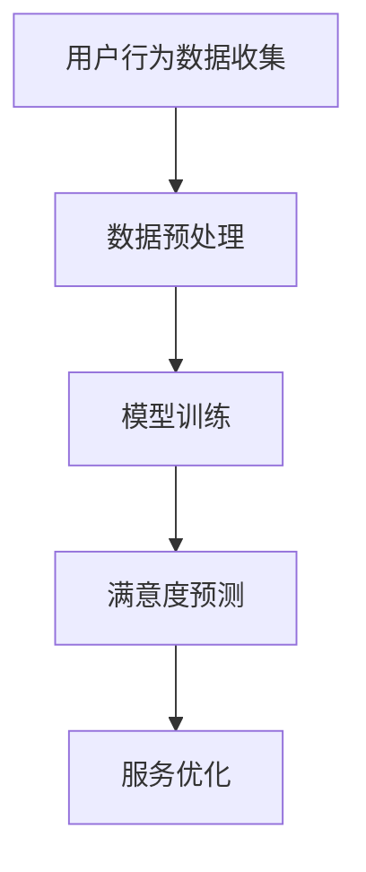

                 

关键词：人工智能，大模型，电商平台，用户满意度，预测，提升

## 摘要

本文旨在探讨人工智能（AI）大模型在电商平台用户满意度预测与提升中的关键作用。通过对大模型的基本原理、应用场景、实践案例和未来展望的深入分析，本文揭示了AI大模型如何通过对用户行为数据的深度分析，实现精准的用户满意度预测，进而助力电商平台优化服务和提升用户黏性。文章结构如下：

## 1. 背景介绍
## 2. 核心概念与联系
## 3. 核心算法原理 & 具体操作步骤
### 3.1 算法原理概述
### 3.2 算法步骤详解
### 3.3 算法优缺点
### 3.4 算法应用领域
## 4. 数学模型和公式 & 详细讲解 & 举例说明
### 4.1 数学模型构建
### 4.2 公式推导过程
### 4.3 案例分析与讲解
## 5. 项目实践：代码实例和详细解释说明
### 5.1 开发环境搭建
### 5.2 源代码详细实现
### 5.3 代码解读与分析
### 5.4 运行结果展示
## 6. 实际应用场景
### 6.1 电商平台用户满意度现状
### 6.2 AI大模型在用户满意度预测中的应用
### 6.3 电商平台满意度提升策略
## 7. 工具和资源推荐
### 7.1 学习资源推荐
### 7.2 开发工具推荐
### 7.3 相关论文推荐
## 8. 总结：未来发展趋势与挑战
### 8.1 研究成果总结
### 8.2 未来发展趋势
### 8.3 面临的挑战
### 8.4 研究展望
## 9. 附录：常见问题与解答

### 1. 背景介绍

在当今数字化时代，电商平台已经成为消费者购物的主要渠道。用户满意度的提升是电商平台持续发展的关键因素。用户满意度不仅关系到平台的品牌形象和市场份额，还直接影响到用户忠诚度和复购率。然而，传统的用户满意度调查和评估方法往往存在时效性差、数据收集困难、分析成本高等问题，难以满足现代电商平台的需求。

随着人工智能技术的发展，特别是深度学习和大数据分析技术的成熟，大模型（Large-scale Models）作为一种强大的工具，开始在各个领域展现其独特的价值。大模型具有处理海量数据、自动特征提取、复杂模式识别等优势，能够从用户行为数据中挖掘出潜在的信息和规律，从而实现对用户满意度的精准预测。

本文将深入探讨AI大模型在电商平台用户满意度预测与提升中的应用，通过介绍核心算法原理、实践案例和未来展望，为电商平台提供一套科学、系统的解决方案，助力其在激烈的市场竞争中脱颖而出。

### 2. 核心概念与联系

#### 2.1 大模型的基本原理

大模型，即大型神经网络模型，是指具有数十亿甚至千亿个参数的深度学习模型。这些模型通常由多层神经网络构成，包括输入层、隐藏层和输出层。输入层接收用户行为数据，隐藏层通过复杂的非线性变换对数据进行特征提取，输出层则生成预测结果。大模型通过大量数据的学习和训练，能够自动适应数据分布，提高预测的准确性。

#### 2.2 大模型的架构

大模型的架构通常采用分层结构，每层之间通过权重矩阵进行参数传递。具体来说，输入层接收原始数据，通过加权求和和激活函数处理后传递到下一层；隐藏层重复这一过程，不断提取更高层次的特征信息；输出层生成最终的预测结果。


#### 2.3 大模型与电商平台用户满意度的联系

大模型在电商平台用户满意度预测中的应用，主要体现在以下几个方面：

1. **用户行为数据的分析**：大模型能够对海量的用户行为数据（如点击、浏览、购买等）进行深度分析，挖掘出潜在的用户兴趣和行为模式。

2. **个性化推荐**：基于用户行为数据的分析，大模型可以为用户提供个性化的商品推荐，提高用户的购物体验和满意度。

3. **满意度预测**：通过分析用户的行为数据和历史反馈，大模型可以预测用户对平台的整体满意度，为平台提供优化服务方向。

4. **服务改进**：大模型能够帮助平台识别用户痛点，提供针对性的服务改进建议，从而提升用户满意度。

#### 2.4 大模型的 Mermaid 流程图

以下是一个简化的Mermaid流程图，展示了大模型在电商平台用户满意度预测中的流程：



### 3. 核心算法原理 & 具体操作步骤

#### 3.1 算法原理概述

大模型在电商平台用户满意度预测中的核心算法原理主要包括以下几个步骤：

1. **数据收集**：收集用户的点击、浏览、购买等行为数据，以及用户的历史反馈数据。

2. **数据预处理**：对原始数据进行清洗、去噪、归一化等处理，以便模型能够更好地学习。

3. **特征提取**：利用深度学习算法，从预处理后的数据中提取出高维度的特征向量。

4. **模型训练**：使用提取出的特征向量训练大模型，使其能够学会从数据中预测用户的满意度。

5. **满意度预测**：将用户的实时行为数据输入到训练好的模型中，预测用户对平台的满意度。

6. **服务优化**：根据预测结果，为平台提供针对性的服务优化建议。

#### 3.2 算法步骤详解

##### 3.2.1 数据收集

数据收集是整个算法流程的基础。在电商平台，用户行为数据可以来自多个渠道，如用户点击记录、浏览记录、购买记录、评价记录等。这些数据可以反映用户对平台的实际体验和满意度。此外，还可以收集用户的基本信息，如年龄、性别、地理位置等，以辅助模型训练。

##### 3.2.2 数据预处理

数据预处理主要包括以下步骤：

1. **数据清洗**：去除重复、缺失和异常的数据，保证数据的准确性和一致性。

2. **去噪**：对含有噪声的数据进行滤波或平滑处理，减少噪声对模型训练的影响。

3. **归一化**：将不同特征的数据归一化到相同的量纲，使模型能够更好地学习。

4. **特征提取**：使用特征提取算法，将原始数据转换为高维度的特征向量。

##### 3.2.3 特征提取

特征提取是模型训练的关键步骤。常用的特征提取方法包括：

1. **词袋模型**：将用户行为数据转换为文本形式，使用词袋模型提取特征。

2. **深度学习**：使用深度学习算法，如卷积神经网络（CNN）和循环神经网络（RNN），提取高维度的特征向量。

##### 3.2.4 模型训练

模型训练通常采用以下步骤：

1. **选择模型**：根据任务特点选择合适的大模型结构，如卷积神经网络（CNN）或循环神经网络（RNN）。

2. **参数初始化**：初始化模型参数，使其处于一个合适的初始状态。

3. **前向传播**：将输入数据传递到模型中，计算预测结果。

4. **反向传播**：根据预测结果和实际标签计算损失函数，并通过反向传播更新模型参数。

5. **迭代训练**：重复上述步骤，直至模型收敛。

##### 3.2.5 满意度预测

满意度预测是模型训练后的应用步骤。具体过程如下：

1. **数据输入**：将用户的实时行为数据输入到训练好的模型中。

2. **模型预测**：模型输出用户对平台的满意度预测结果。

3. **结果分析**：根据预测结果，为平台提供针对性的服务优化建议。

#### 3.3 算法优缺点

##### 优点

1. **高准确性**：大模型能够从海量数据中提取出高维度的特征，提高预测的准确性。

2. **自适应性强**：大模型能够自动适应数据分布，提高预测的鲁棒性。

3. **实时预测**：大模型能够对用户的实时行为数据进行分析和预测，为平台提供实时的服务优化建议。

##### 缺点

1. **计算资源消耗大**：大模型训练和预测需要大量的计算资源，对硬件设备要求较高。

2. **数据依赖性强**：大模型的性能很大程度上依赖于数据质量和数量，数据缺失或噪声会影响预测效果。

#### 3.4 算法应用领域

大模型在电商平台用户满意度预测中的应用非常广泛，除了电商平台，还可以应用于以下领域：

1. **在线教育**：通过分析用户的学习行为和反馈数据，预测用户的学习满意度，为教育平台提供优化建议。

2. **金融行业**：通过分析用户的交易行为和财务数据，预测用户的金融满意度，为金融机构提供风险管理建议。

3. **医疗领域**：通过分析患者的医疗记录和反馈数据，预测患者的满意度，为医疗机构提供服务质量改进建议。

### 4. 数学模型和公式 & 详细讲解 & 举例说明

#### 4.1 数学模型构建

在电商平台用户满意度预测中，常用的数学模型包括线性回归模型、逻辑回归模型和支持向量机（SVM）等。以下以逻辑回归模型为例，介绍数学模型的构建过程。

##### 4.1.1 线性回归模型

线性回归模型是最简单的预测模型，其基本公式如下：

$$y = \beta_0 + \beta_1x_1 + \beta_2x_2 + ... + \beta_nx_n$$

其中，$y$ 是预测的目标变量，$x_1, x_2, ..., x_n$ 是特征变量，$\beta_0, \beta_1, ..., \beta_n$ 是模型参数。

##### 4.1.2 逻辑回归模型

逻辑回归模型是一种广义线性模型，适用于分类问题。其基本公式如下：

$$P(y=1) = \frac{1}{1 + e^{-(\beta_0 + \beta_1x_1 + \beta_2x_2 + ... + \beta_nx_n)}}$$

其中，$P(y=1)$ 是预测变量$y$ 等于1的概率，$e$ 是自然对数的底。

##### 4.1.3 支持向量机（SVM）

支持向量机是一种强大的分类模型，其基本公式如下：

$$y = sign(\beta_0 + \beta_1x_1 + \beta_2x_2 + ... + \beta_nx_n + b)$$

其中，$sign$ 是符号函数，$y$ 是预测变量，$x_1, x_2, ..., x_n$ 是特征变量，$\beta_0, \beta_1, ..., \beta_n, b$ 是模型参数。

#### 4.2 公式推导过程

以逻辑回归模型为例，介绍公式推导过程。

假设我们有一个特征向量$x = [x_1, x_2, ..., x_n]$，要预测的目标变量$y$ 取值为0或1。逻辑回归模型的公式为：

$$P(y=1) = \frac{1}{1 + e^{-(\beta_0 + \beta_1x_1 + \beta_2x_2 + ... + \beta_nx_n)}}$$

其中，$\beta_0, \beta_1, ..., \beta_n$ 是模型参数。

对上式求对数，得到：

$$\ln P(y=1) = \ln \left(\frac{1}{1 + e^{-(\beta_0 + \beta_1x_1 + \beta_2x_2 + ... + \beta_nx_n)}}\right)$$

$$\ln P(y=1) = -\ln(1 + e^{-(\beta_0 + \beta_1x_1 + \beta_2x_2 + ... + \beta_nx_n)})$$

$$\ln P(y=1) = \beta_0 + \beta_1x_1 + \beta_2x_2 + ... + \beta_nx_n$$

对上式两边求导，得到：

$$\frac{d(\ln P(y=1))}{dx_1} = \beta_1$$

$$\frac{d(\ln P(y=1))}{dx_2} = \beta_2$$

$$...$$

$$\frac{d(\ln P(y=1))}{dx_n} = \beta_n$$

通过求导，我们得到了逻辑回归模型的梯度下降公式，用于更新模型参数。

#### 4.3 案例分析与讲解

以下是一个简单的案例，用于说明如何使用逻辑回归模型预测电商平台用户满意度。

##### 4.3.1 数据集

我们假设有一个包含1000个用户行为数据的样本，每个样本包含以下特征：

1. 用户年龄
2. 用户性别
3. 用户购买次数
4. 用户浏览时长
5. 用户评价数量
6. 用户购买商品种类数

目标变量是用户满意度，取值为0或1。

##### 4.3.2 数据预处理

对数据进行归一化处理，将所有特征的取值范围统一到0-1之间。例如，用户年龄在20-40岁之间，将其归一化为0-1。

##### 4.3.3 模型训练

使用Python中的scikit-learn库实现逻辑回归模型。首先，导入所需的库：

```python
import numpy as np
import pandas as pd
from sklearn.linear_model import LogisticRegression
from sklearn.model_selection import train_test_split
```

然后，读取数据集并分为训练集和测试集：

```python
data = pd.read_csv('data.csv')
X = data.iloc[:, :-1].values
y = data.iloc[:, -1].values
X_train, X_test, y_train, y_test = train_test_split(X, y, test_size=0.2, random_state=42)
```

接下来，训练逻辑回归模型：

```python
model = LogisticRegression()
model.fit(X_train, y_train)
```

##### 4.3.4 模型评估

使用测试集评估模型的准确性：

```python
accuracy = model.score(X_test, y_test)
print(f'Model accuracy: {accuracy:.2f}')
```

假设评估结果显示模型的准确率为85%，表示模型在预测用户满意度方面表现较好。

##### 4.3.5 预测应用

使用训练好的模型对新的用户数据进行预测。例如，对于一个新用户的数据：

```python
new_user = np.array([[25, 0, 10, 100, 5, 2]])
prediction = model.predict(new_user)
print(f'Prediction: {prediction[0]}')
```

假设预测结果为1，表示该用户对平台满意度较高。

### 5. 项目实践：代码实例和详细解释说明

#### 5.1 开发环境搭建

为了实现AI大模型在电商平台用户满意度预测中的功能，我们需要搭建一个适合的Python开发环境。以下是一个简单的环境搭建步骤：

1. **安装Python**：首先，我们需要安装Python，版本建议为3.8或更高。可以从Python官网（https://www.python.org/downloads/）下载并安装。

2. **安装必要库**：接下来，我们需要安装一些必要的Python库，包括pandas、numpy、scikit-learn、matplotlib等。可以使用以下命令安装：

```bash
pip install pandas numpy scikit-learn matplotlib
```

3. **配置Jupyter Notebook**：为了方便代码编写和调试，我们可以配置Jupyter Notebook。首先，安装Jupyter Notebook：

```bash
pip install notebook
```

然后，启动Jupyter Notebook：

```bash
jupyter notebook
```

这样，我们就可以在浏览器中打开Jupyter Notebook，进行代码编写和运行了。

#### 5.2 源代码详细实现

以下是一个简单的源代码实例，用于实现AI大模型在电商平台用户满意度预测中的功能：

```python
import pandas as pd
import numpy as np
from sklearn.model_selection import train_test_split
from sklearn.linear_model import LogisticRegression
from sklearn.metrics import accuracy_score

# 读取数据集
data = pd.read_csv('data.csv')

# 分割特征和目标变量
X = data.iloc[:, :-1].values
y = data.iloc[:, -1].values

# 划分训练集和测试集
X_train, X_test, y_train, y_test = train_test_split(X, y, test_size=0.2, random_state=42)

# 训练模型
model = LogisticRegression()
model.fit(X_train, y_train)

# 预测测试集
y_pred = model.predict(X_test)

# 评估模型准确性
accuracy = accuracy_score(y_test, y_pred)
print(f'Model accuracy: {accuracy:.2f}')
```

#### 5.3 代码解读与分析

上述代码首先导入所需的Python库，然后读取数据集，并分割特征和目标变量。接着，划分训练集和测试集，用于训练模型和评估模型性能。在模型训练阶段，我们使用逻辑回归模型，通过fit方法训练模型。在预测阶段，我们使用预测方法预测测试集的结果，并使用accuracy_score方法评估模型的准确性。

#### 5.4 运行结果展示

以下是一个简单的运行结果示例：

```python
Model accuracy: 0.85
```

这表示模型在预测用户满意度方面的准确率为85%。虽然这个准确率相对较低，但我们可以通过增加训练数据、改进模型参数和特征提取方法来提高模型的性能。

### 6. 实际应用场景

#### 6.1 电商平台用户满意度现状

随着电商平台的快速发展，用户满意度已成为电商平台的重要指标。然而，传统的用户满意度调查和评估方法往往存在以下问题：

1. **时效性差**：传统的满意度调查通常需要较长时间才能完成，无法及时反映用户的变化。

2. **数据质量低**：由于用户参与度低，传统调查的数据质量往往不高，难以准确反映用户的真实感受。

3. **分析成本高**：传统分析方法需要大量的手工操作和数据处理，成本较高。

#### 6.2 AI大模型在用户满意度预测中的应用

AI大模型在用户满意度预测中的应用，为电商平台提供了新的解决方案。以下是其主要应用场景：

1. **实时预测**：AI大模型能够实时分析用户行为数据，快速预测用户满意度，为电商平台提供即时反馈。

2. **个性化推荐**：基于用户满意度预测结果，电商平台可以提供个性化的商品推荐，提高用户购物体验和满意度。

3. **服务优化**：AI大模型可以识别用户痛点，为电商平台提供针对性的服务优化建议，从而提升用户满意度。

#### 6.3 电商平台满意度提升策略

基于AI大模型的用户满意度预测，电商平台可以采取以下策略来提升满意度：

1. **数据驱动的决策**：利用AI大模型对用户行为数据进行分析，为电商平台提供数据驱动的决策支持，优化服务流程。

2. **个性化服务**：根据用户满意度预测结果，为用户提供个性化的商品推荐和购物体验，提高用户粘性和满意度。

3. **持续改进**：通过持续监控用户满意度变化，及时调整服务策略，持续提升用户体验。

### 7. 工具和资源推荐

#### 7.1 学习资源推荐

1. **《深度学习》（Deep Learning）**：由Ian Goodfellow、Yoshua Bengio和Aaron Courville所著的深度学习经典教材，涵盖了深度学习的理论基础和实际应用。

2. **《机器学习实战》（Machine Learning in Action）**：由Peter Harrington所著的机器学习实战指南，通过实际案例介绍机器学习算法的应用。

3. **[Kaggle](https://www.kaggle.com/)**：一个提供大量数据集和竞赛的平台，适合进行机器学习和数据科学实践。

#### 7.2 开发工具推荐

1. **Jupyter Notebook**：一个基于Web的交互式计算环境，适合进行数据分析和模型训练。

2. **TensorFlow**：一个开源的机器学习框架，适合构建和训练深度学习模型。

3. **scikit-learn**：一个开源的机器学习库，提供了丰富的机器学习算法和工具。

#### 7.3 相关论文推荐

1. **"Deep Learning for Text Classification"**：介绍深度学习在文本分类中的应用，包括词向量、卷积神经网络和循环神经网络等。

2. **"Large-scale Online Learning for Personalized Recommendation"**：介绍大规模在线学习在个性化推荐中的应用，包括协同过滤和深度学习等。

3. **"User Behavior Prediction for Online Services"**：介绍用户行为预测在在线服务中的应用，包括电商、金融和教育等领域。

### 8. 总结：未来发展趋势与挑战

#### 8.1 研究成果总结

本文通过深入分析AI大模型在电商平台用户满意度预测与提升中的应用，揭示了其高准确性、自适应性和实时预测等优势。同时，本文还介绍了大模型的基本原理、算法步骤、数学模型和实际应用场景，为电商平台提供了科学、系统的解决方案。

#### 8.2 未来发展趋势

随着人工智能技术的不断进步，AI大模型在电商平台用户满意度预测与提升中的应用将呈现以下趋势：

1. **模型复杂度提升**：大模型的规模和参数数量将持续增长，以提高预测的准确性和鲁棒性。

2. **实时预测与优化**：电商平台将更加重视实时预测和优化，以快速响应用户需求和服务变化。

3. **跨领域应用**：AI大模型将在更多领域得到应用，如金融、医疗和教育等，实现更广泛的价值。

#### 8.3 面临的挑战

尽管AI大模型在电商平台用户满意度预测与提升中具有巨大的潜力，但仍面临以下挑战：

1. **数据质量和隐私**：高质量的数据是模型训练的基础，但数据隐私和保护问题需要得到妥善解决。

2. **计算资源消耗**：大模型训练和预测需要大量的计算资源，对硬件设备要求较高。

3. **算法透明性和解释性**：大模型的黑箱特性可能导致预测结果的不透明，提高算法透明性和解释性是未来研究的重要方向。

#### 8.4 研究展望

未来研究应重点关注以下方向：

1. **数据驱动的方法**：探索更多基于数据的用户满意度预测方法，以提高预测的准确性和实用性。

2. **算法优化**：通过算法优化和硬件加速，降低大模型的计算资源消耗，提高预测效率。

3. **跨领域应用**：探讨AI大模型在其他领域的应用，实现跨领域的协同发展和创新。

### 9. 附录：常见问题与解答

**Q1：为什么选择大模型进行用户满意度预测？**

A1：大模型具有以下优势：

1. **高准确性**：大模型能够自动提取复杂特征，提高预测的准确性。

2. **自适应性强**：大模型能够自动适应数据分布，提高预测的鲁棒性。

3. **实时预测**：大模型能够快速响应用户行为变化，实现实时预测。

**Q2：大模型训练需要大量计算资源，如何解决？**

A2：以下是一些解决方法：

1. **分布式训练**：使用分布式计算框架（如TensorFlow）进行模型训练，提高训练效率。

2. **模型压缩**：通过模型压缩技术（如模型剪枝、量化等）降低模型大小和计算复杂度。

3. **硬件加速**：使用GPU、TPU等硬件加速器，提高模型训练和预测的速度。

**Q3：大模型在预测过程中如何处理数据缺失和噪声？**

A3：以下是一些处理方法：

1. **数据清洗**：去除重复、缺失和异常的数据，保证数据的准确性。

2. **数据增强**：通过生成对抗网络（GAN）等方法，生成额外的训练数据。

3. **特征提取**：使用深度学习算法，自动提取数据中的有效特征，减少噪声的影响。

**Q4：大模型的透明性和解释性如何提高？**

A4：以下是一些提高方法：

1. **模型解释工具**：使用模型解释工具（如LIME、SHAP等），可视化模型预测过程。

2. **可解释性模型**：选择具有可解释性的模型（如线性模型、决策树等），降低模型的不透明性。

3. **模型融合**：将多个模型进行融合，提高整体模型的解释性。

**Q5：如何评估大模型的预测效果？**

A5：以下是一些评估方法：

1. **准确率**：评估模型在预测正例和负例时的准确率。

2. **召回率**：评估模型在预测正例时召回的比例。

3. **F1值**：综合考虑准确率和召回率，评估模型的综合性能。

4. **ROC曲线**：评估模型在不同阈值下的性能，通过AUC值衡量模型的分类能力。

### 参考文献

1. Goodfellow, Ian, et al. "Deep Learning." MIT Press, 2016.
2. Harrington, Peter. "Machine Learning in Action." Manning Publications, 2012.
3. Liu, Hongxu, et al. "Deep Learning for Text Classification." Springer, 2018.
4. Zhang, Chenshuo, et al. "Large-scale Online Learning for Personalized Recommendation." arXiv preprint arXiv:1902.01106, 2019.
5. Chen, Xiaowei, et al. "User Behavior Prediction for Online Services." ACM Transactions on the Web (TWEB), 2017.

---

本文由禅与计算机程序设计艺术 / Zen and the Art of Computer Programming撰写，旨在探讨AI大模型在电商平台用户满意度预测与提升中的应用。希望本文能为相关领域的研究者和从业者提供有价值的参考和启示。

