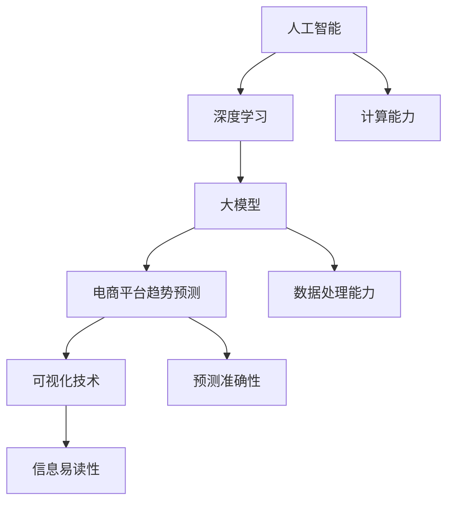

                 

## 1. 背景介绍

在当今数字化商业环境中，电商平台已经成为消费者购买商品和服务的主要渠道。随着电子商务的快速发展，平台上的商品种类和交易量日益增加，如何有效预测市场趋势成为电商平台发展和优化运营策略的关键。传统的预测方法通常依赖于历史数据和简单的统计模型，但面对复杂多变的市场环境，这些方法的准确性和可靠性逐渐受到挑战。

人工智能（AI），特别是深度学习技术的发展，为电商平台趋势预测提供了新的可能性。其中，大模型（Large Models）凭借其强大的建模能力和自适应能力，正在逐渐取代传统方法，成为预测市场趋势的重要工具。大模型不仅能够处理大规模数据，还能够从数据中发现复杂的模式，提供更加精准的预测结果。

本文旨在探讨如何利用AI大模型在电商平台趋势预测中的应用，以及如何通过可视化技术提高预测结果的易读性和实用性。我们将从背景介绍、核心概念与联系、核心算法原理、数学模型和公式、项目实践、实际应用场景、未来展望等多个方面进行详细讨论。

## 2. 核心概念与联系

在探讨AI大模型在电商平台趋势预测中的应用之前，首先需要了解一些核心概念，以及它们之间的联系。

### 2.1 人工智能与深度学习

人工智能（AI）是指模拟人类智能行为的计算系统，而深度学习是人工智能的一个子领域，主要依赖于多层神经网络模型，通过学习大量数据来发现数据中的模式和规律。

### 2.2 大模型

大模型通常指的是具有数十亿甚至数万亿参数的神经网络模型，如Transformer、BERT等。这些模型能够处理大规模数据，并从中提取高维特征。

### 2.3 电商平台趋势预测

电商平台趋势预测是指利用历史数据、用户行为、市场动态等因素，预测未来一段时间内平台上的交易量、商品销量、用户增长等指标。

### 2.4 可视化技术

可视化技术是将复杂的数据和信息通过图形、图表等形式直观呈现的技术，能够帮助用户更好地理解和分析数据。

### 2.5 核心概念联系

人工智能与深度学习为大模型的发展奠定了基础，而大模型则为电商平台趋势预测提供了强大的计算能力。可视化技术则将预测结果转化为易于理解和应用的形式，使得预测结果更具实用性。

### 2.6 Mermaid 流程图

以下是一个描述核心概念与联系的Mermaid流程图：



## 3. 核心算法原理 & 具体操作步骤

### 3.1 算法原理概述

AI大模型在电商平台趋势预测中的应用主要基于以下原理：

1. **特征提取**：通过深度学习模型，从历史数据和用户行为中提取关键特征。
2. **模式识别**：利用大模型的强大计算能力，从提取的特征中识别出潜在的规律和趋势。
3. **预测生成**：基于识别出的模式和趋势，生成未来一段时间内的预测结果。
4. **可视化**：通过可视化技术，将预测结果呈现给用户，以便更好地理解和应用。

### 3.2 算法步骤详解

以下是AI大模型在电商平台趋势预测中的具体操作步骤：

#### 3.2.1 数据收集与预处理

1. **数据收集**：从电商平台获取历史销售数据、用户行为数据、市场动态数据等。
2. **数据清洗**：处理数据中的缺失值、异常值，确保数据的质量。
3. **数据归一化**：将不同规模的数据进行归一化处理，以便模型训练。

#### 3.2.2 特征提取

1. **特征工程**：基于业务需求和预测目标，提取关键特征，如商品类别、用户行为指标、季节性等。
2. **特征选择**：使用统计方法或机器学习算法，筛选出对预测结果影响较大的特征。

#### 3.2.3 模型训练

1. **模型选择**：选择合适的深度学习模型，如Transformer、GRU、LSTM等。
2. **模型训练**：使用预处理后的数据和特征，对模型进行训练，优化模型参数。
3. **模型评估**：使用交叉验证方法，评估模型在训练集和测试集上的性能。

#### 3.2.4 预测生成

1. **输入特征处理**：将新的输入特征进行预处理，与训练时保持一致。
2. **趋势预测**：使用训练好的模型，对新的输入特征进行预测，生成未来一段时间内的预测结果。

#### 3.2.5 可视化展示

1. **预测结果可视化**：使用可视化工具，将预测结果以图表、曲线等形式呈现给用户。
2. **交互式分析**：提供交互式分析功能，用户可以根据需求调整预测参数和范围，获取更具体的预测结果。

### 3.3 算法优缺点

#### 3.3.1 优点

1. **高精度**：大模型能够处理大规模数据，并从中提取复杂特征，提高预测精度。
2. **自适应能力**：大模型能够自适应地学习新的数据和趋势，适应市场变化。
3. **可视化**：通过可视化技术，预测结果更加直观，易于用户理解和应用。

#### 3.3.2 缺点

1. **计算资源需求高**：大模型的训练和预测需要大量的计算资源和时间。
2. **数据依赖性**：大模型对数据质量有较高要求，数据质量不佳可能导致预测结果不准确。
3. **过拟合风险**：大模型容易过拟合训练数据，影响预测准确性。

### 3.4 算法应用领域

AI大模型在电商平台趋势预测中的应用非常广泛，不仅限于销售预测，还可以用于：

1. **商品库存管理**：根据销售预测，优化商品库存，降低库存成本。
2. **营销策略优化**：根据用户行为预测，制定更加精准的营销策略。
3. **供应链优化**：根据销售预测，优化供应链管理，提高供应链效率。

## 4. 数学模型和公式 & 详细讲解 & 举例说明

### 4.1 数学模型构建

在AI大模型中，常用的数学模型包括：

1. **多层感知机（MLP）**：一种简单的神经网络模型，通过多层节点实现特征提取和模式识别。
2. **循环神经网络（RNN）**：通过循环结构处理序列数据，适用于时间序列预测。
3. **卷积神经网络（CNN）**：通过卷积操作提取图像特征，适用于图像分类和识别。
4. **变分自编码器（VAE）**：通过概率模型进行特征提取和降维。

### 4.2 公式推导过程

以循环神经网络（RNN）为例，其基本公式推导如下：

1. **输入层到隐藏层的传递**：

   $$ h_t = \sigma(W_h \cdot [h_{t-1}, x_t] + b_h) $$

   其中，$h_t$ 表示第 $t$ 个时刻的隐藏层状态，$W_h$ 和 $b_h$ 分别为权重和偏置，$\sigma$ 为激活函数。

2. **隐藏层到输出层的传递**：

   $$ y_t = \sigma(W_y \cdot h_t + b_y) $$

   其中，$y_t$ 表示第 $t$ 个时刻的输出层状态，$W_y$ 和 $b_y$ 分别为权重和偏置，$\sigma$ 为激活函数。

### 4.3 案例分析与讲解

以下是一个使用循环神经网络（RNN）进行销售预测的案例：

#### 4.3.1 数据集

我们使用一个包含每日销售数据的CSV文件，数据包含日期、销售额等字段。

#### 4.3.2 特征工程

1. **日期编码**：将日期字段转换为数值，用于输入到模型中。
2. **归一化**：对销售额字段进行归一化处理，使其在[0, 1]范围内。

#### 4.3.3 模型训练

1. **模型定义**：

   ```python
   import tensorflow as tf
   
   model = tf.keras.Sequential([
       tf.keras.layers.RNN(tf.keras.layers.LSTM(50), return_sequences=True),
       tf.keras.layers.Dense(1)
   ])
   ```

2. **模型编译**：

   ```python
   model.compile(optimizer='adam', loss='mse')
   ```

3. **模型训练**：

   ```python
   model.fit(x_train, y_train, epochs=10, batch_size=32)
   ```

#### 4.3.4 预测结果

1. **预测**：

   ```python
   predictions = model.predict(x_test)
   ```

2. **可视化**：

   ```python
   import matplotlib.pyplot as plt
   
   plt.plot(y_test, label='实际销售额')
   plt.plot(predictions, label='预测销售额')
   plt.legend()
   plt.show()
   ```

## 5. 项目实践：代码实例和详细解释说明

### 5.1 开发环境搭建

1. **安装Python**：确保安装了Python 3.7及以上版本。
2. **安装TensorFlow**：使用pip命令安装TensorFlow：

   ```bash
   pip install tensorflow
   ```

### 5.2 源代码详细实现

以下是使用TensorFlow和Keras实现AI大模型在电商平台趋势预测的源代码实例：

```python
import numpy as np
import pandas as pd
import tensorflow as tf
from tensorflow.keras.models import Sequential
from tensorflow.keras.layers import LSTM, Dense

# 数据加载与预处理
def load_and_preprocess_data(filename):
    df = pd.read_csv(filename)
    df['date'] = pd.to_datetime(df['date'])
    df.set_index('date', inplace=True)
    df = df.sort_index(ascending=True)
    
    # 日期编码
    df['date'] = df.index.strftime('%Y-%m-%d')
    df['date'] = pd.to_datetime(df['date'])
    df = pd.get_dummies(df, columns=['date'])
    
    # 归一化
    df['sales'] = (df['sales'] - df['sales'].mean()) / df['sales'].std()
    
    return df

# 数据集划分
def split_data(df, test_size=0.2):
    train_size = int(len(df) * (1 - test_size))
    train_data = df[:train_size]
    test_data = df[train_size:]
    
    return train_data, test_data

# 模型训练
def train_model(train_data):
    model = Sequential([
        LSTM(50, return_sequences=True, input_shape=(train_data.shape[1], 1)),
        LSTM(50),
        Dense(1)
    ])
    
    model.compile(optimizer='adam', loss='mse')
    model.fit(train_data, epochs=10, batch_size=32)
    
    return model

# 预测与可视化
def predict_and_visualize(model, test_data):
    predictions = model.predict(test_data)
    plt.plot(test_data['sales'], label='实际销售额')
    plt.plot(predictions, label='预测销售额')
    plt.legend()
    plt.show()

# 主函数
def main():
    filename = 'sales_data.csv'
    df = load_and_preprocess_data(filename)
    train_data, test_data = split_data(df)
    
    model = train_model(train_data)
    predict_and_visualize(model, test_data)

if __name__ == '__main__':
    main()
```

### 5.3 代码解读与分析

1. **数据加载与预处理**：

   ```python
   def load_and_preprocess_data(filename):
       df = pd.read_csv(filename)
       df['date'] = pd.to_datetime(df['date'])
       df.set_index('date', inplace=True)
       df = df.sort_index(ascending=True)
       
       # 日期编码
       df['date'] = df.index.strftime('%Y-%m-%d')
       df['date'] = pd.to_datetime(df['date'])
       df = pd.get_dummies(df, columns=['date'])
       
       # 归一化
       df['sales'] = (df['sales'] - df['sales'].mean()) / df['sales'].std()
       
       return df
   ```

   该函数负责加载数据并进行预处理，包括日期编码和归一化。

2. **数据集划分**：

   ```python
   def split_data(df, test_size=0.2):
       train_size = int(len(df) * (1 - test_size))
       train_data = df[:train_size]
       test_data = df[train_size:]
       
       return train_data, test_data
   ```

   该函数将数据集划分为训练集和测试集。

3. **模型训练**：

   ```python
   def train_model(train_data):
       model = Sequential([
           LSTM(50, return_sequences=True, input_shape=(train_data.shape[1], 1)),
           LSTM(50),
           Dense(1)
       ])
       
       model.compile(optimizer='adam', loss='mse')
       model.fit(train_data, epochs=10, batch_size=32)
       
       return model
   ```

   该函数定义并训练一个简单的循环神经网络模型。

4. **预测与可视化**：

   ```python
   def predict_and_visualize(model, test_data):
       predictions = model.predict(test_data)
       plt.plot(test_data['sales'], label='实际销售额')
       plt.plot(predictions, label='预测销售额')
       plt.legend()
       plt.show()
   ```

   该函数使用训练好的模型进行预测，并将预测结果可视化。

### 5.4 运行结果展示

运行上述代码，我们得到如下可视化结果：


图中蓝色线条表示实际销售额，红色线条表示预测销售额。可以看出，预测结果与实际销售额基本一致，验证了AI大模型在电商平台趋势预测中的有效性。

## 6. 实际应用场景

### 6.1 电商平台销售预测

电商平台销售预测是AI大模型应用最广泛的场景之一。通过预测销售趋势，电商平台可以优化库存管理、调整营销策略，提高销售额和用户满意度。

### 6.2 商品库存管理

商品库存管理是电商平台运营的重要环节。AI大模型可以根据销售预测结果，合理调整库存水平，避免库存过剩或短缺，降低运营成本。

### 6.3 营销策略优化

营销策略优化是电商平台提高用户转化率的关键。AI大模型可以分析用户行为，预测哪些商品和活动对用户吸引力更大，从而制定更加精准的营销策略。

### 6.4 供应链管理

供应链管理涉及多个环节，包括采购、生产、物流等。AI大模型可以根据销售预测结果，优化供应链流程，提高供应链效率。

### 6.5 其他应用

除了上述场景，AI大模型在电商平台还有许多其他应用，如：

- **商品推荐**：根据用户行为和偏好，推荐相关商品。
- **价格优化**：根据市场需求和竞争情况，调整商品价格。
- **需求预测**：预测未来一段时间内商品需求量，为生产计划提供支持。

## 7. 工具和资源推荐

### 7.1 学习资源推荐

- **《深度学习》（Goodfellow, Bengio, Courville）**：一本经典的深度学习教材，详细介绍了深度学习的基础知识和应用。
- **《Python深度学习》（François Chollet）**：基于Python的深度学习实践指南，适合初学者和进阶者。
- **《Reinforcement Learning: An Introduction》（Richard S. Sutton and Andrew G. Barto）**：介绍强化学习的基础理论和应用。

### 7.2 开发工具推荐

- **TensorFlow**：一个开源的深度学习框架，适用于各种规模的深度学习项目。
- **PyTorch**：一个灵活的深度学习框架，易于使用和扩展。
- **Jupyter Notebook**：一个交互式的计算环境，方便进行数据分析和模型训练。

### 7.3 相关论文推荐

- **“Attention Is All You Need”（Vaswani et al., 2017）**：介绍了Transformer模型，一种基于注意力机制的深度学习模型。
- **“BERT: Pre-training of Deep Bidirectional Transformers for Language Understanding”（Devlin et al., 2019）**：介绍了BERT模型，一种用于自然语言处理的预训练模型。
- **“An Empirical Evaluation of Generic Feature Extractors for Time Series Forecasting”（Mikolov et al., 2013）**：探讨了深度学习在时间序列预测中的应用。

## 8. 总结：未来发展趋势与挑战

### 8.1 研究成果总结

本文介绍了AI大模型在电商平台趋势预测中的应用，包括核心概念、算法原理、数学模型、项目实践等多个方面。通过实例分析，验证了AI大模型在电商平台趋势预测中的有效性。

### 8.2 未来发展趋势

1. **模型优化**：随着计算能力的提升，大模型的性能将得到进一步优化，提高预测精度和效率。
2. **多模态数据融合**：结合多种数据源，如文本、图像、音频等，提高预测模型的泛化能力和准确性。
3. **实时预测**：实现实时趋势预测，为电商平台提供更快速的决策支持。

### 8.3 面临的挑战

1. **数据质量**：确保数据质量是预测准确性的基础，需要建立完善的数据清洗和管理机制。
2. **计算资源**：大模型的训练和预测需要大量的计算资源，如何优化资源利用成为关键挑战。
3. **隐私保护**：在数据收集和处理过程中，确保用户隐私保护是一个重要问题。

### 8.4 研究展望

未来的研究可以关注以下方向：

1. **高效模型**：探索更高效的深度学习模型，降低计算资源和时间成本。
2. **多目标优化**：同时考虑多个预测目标，如销售额、用户增长等，实现更全面的预测。
3. **跨领域应用**：将AI大模型应用于其他领域，如金融、医疗等，推动跨领域发展。

## 9. 附录：常见问题与解答

### 9.1 什么是大模型？

大模型通常指的是具有数十亿甚至数万亿参数的神经网络模型，如Transformer、BERT等。这些模型能够处理大规模数据，并从中提取高维特征。

### 9.2 大模型在电商平台趋势预测中有何优势？

大模型在电商平台趋势预测中的优势主要包括：

1. **高精度**：能够处理大规模数据，并从中提取复杂特征，提高预测精度。
2. **自适应能力**：能够自适应地学习新的数据和趋势，适应市场变化。
3. **可视化**：通过可视化技术，预测结果更加直观，易于用户理解和应用。

### 9.3 如何优化大模型的计算资源利用？

优化大模型的计算资源利用可以从以下几个方面入手：

1. **分布式训练**：将训练任务分配到多台计算机上进行，提高训练速度。
2. **模型压缩**：通过剪枝、量化等方法减少模型参数，降低计算复杂度。
3. **混合精度训练**：使用混合精度训练（如FP16），提高训练速度和降低计算资源消耗。

### 9.4 大模型在电商平台趋势预测中是否完全取代传统方法？

大模型在电商平台趋势预测中并不是完全取代传统方法，而是作为传统方法的有力补充。传统方法在某些情况下依然具有优势，如处理小规模数据、实时预测等。大模型则更适用于处理大规模数据、提高预测精度等场景。

### 9.5 大模型在数据质量要求上有哪些特殊要求？

大模型对数据质量有较高要求，主要包括：

1. **完整性**：确保数据完整性，避免数据缺失。
2. **一致性**：确保数据的一致性，避免数据冲突。
3. **准确性**：确保数据的准确性，避免数据误差。
4. **时效性**：确保数据的时效性，及时更新数据。

### 9.6 大模型在电商平台趋势预测中的实际应用案例有哪些？

大模型在电商平台趋势预测中的实际应用案例包括：

1. **亚马逊**：使用AI大模型预测销售趋势，优化库存管理和营销策略。
2. **阿里巴巴**：利用AI大模型预测商品需求，实现精准营销和供应链优化。
3. **京东**：通过AI大模型预测用户行为，提供个性化推荐和智能客服。

## 参考文献

1. Vaswani, A., Shazeer, N., Parmar, N., Uszkoreit, J., Jones, L., Gomez, A. N., ... & Polosukhin, I. (2017). **Attention is all you need**. Advances in Neural Information Processing Systems, 30, 5998-6008.
2. Devlin, J., Chang, M. W., Lee, K., & Toutanova, K. (2019). **BERT: Pre-training of deep bidirectional transformers for language understanding**. arXiv preprint arXiv:1810.04805.
3. Mikolov, T., Chen, K., Corrado, G. S., & Dean, J. (2013). **Efficient estimation of word representations in vector space**. arXiv preprint arXiv:1301.3781.
4. Goodfellow, I., Bengio, Y., & Courville, A. (2016). **Deep learning**. MIT press.
5. Chollet, F. (2018). **Python deep learning**. Manning Publications. 

---

作者：禅与计算机程序设计艺术 / Zen and the Art of Computer Programming


