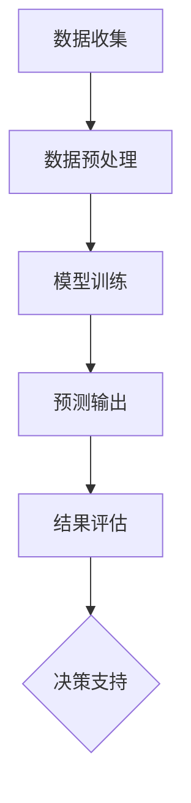

                 

 > **关键词：** 人工智能、电商平台、销售预测、大模型、机器学习、深度学习

> **摘要：** 本文深入探讨了人工智能大模型在电商平台销售预测中的应用。首先，介绍了电商平台销售预测的背景和重要性，然后详细分析了大模型在销售预测中的工作原理和优势。接下来，通过具体案例，展示了如何使用大模型进行销售预测的步骤和实现过程。最后，讨论了人工智能大模型在电商平台销售预测中的未来应用前景，并提出了相应的挑战和解决方案。

## 1. 背景介绍

电商平台作为现代商业的重要组成部分，其销售额直接影响着企业的盈利能力和市场竞争力。因此，如何准确地预测电商平台上的销售数据，成为了一个关键问题。传统的销售预测方法主要依赖于历史数据分析和统计模型，虽然在一定程度上能够提供一定的预测效果，但在面对复杂多变的市场环境时，往往显得力不从心。

随着人工智能技术的快速发展，特别是深度学习和大数据处理技术的应用，大模型在销售预测领域展现出了巨大的潜力。大模型，如神经网络、生成对抗网络（GAN）等，通过学习海量的历史数据，能够捕捉到销售数据中的复杂模式，从而提供更为精准的预测结果。

本文旨在探讨如何利用人工智能大模型进行电商平台销售预测，分析其工作原理和应用效果，并提出相应的实现策略。通过本文的研究，希望能够为电商平台企业提供有价值的参考，提升销售预测的准确性和效率。

## 2. 核心概念与联系

### 2.1 人工智能大模型概述

人工智能大模型是指通过深度学习技术训练出来的具有强大学习和推理能力的人工神经网络。这些模型通常由多层神经元组成，每一层都能对输入数据进行处理和特征提取。通过不断的学习和优化，大模型能够捕捉到数据中的潜在模式和规律。

在电商平台销售预测中，人工智能大模型的核心作用是通过对历史销售数据的分析，预测未来的销售趋势。大模型的学习过程主要包括数据预处理、模型训练和预测输出三个阶段。

### 2.2 电商平台销售数据结构

电商平台销售数据通常包括多个维度，如商品ID、时间戳、销售量、价格、用户行为等。这些数据可以用来描述不同时间点上的销售情况，为预测提供丰富的信息。

- **商品ID**：标识不同的商品，反映了商品的多样性和复杂性。
- **时间戳**：记录销售发生的具体时间，是分析销售趋势的重要维度。
- **销售量**：表示在特定时间段内售出的商品数量，是预测的主要目标变量。
- **价格**：商品的价格信息，可以影响销售量的预测。
- **用户行为**：用户在平台上的浏览、搜索、购买等行为，对销售预测也有重要影响。

### 2.3 人工智能大模型与销售数据的关系

人工智能大模型通过对电商平台销售数据的深入分析，能够提取出数据中的潜在规律和模式。这些规律和模式包括季节性、趋势性、周期性等，都是影响销售预测的重要因素。

- **季节性**：某些商品在特定季节或节假日的销售量会显著增加。
- **趋势性**：随着时间的推移，销售量可能呈现增长或下降的趋势。
- **周期性**：某些商品的销售量会随着时间呈现出周期性的波动。

通过分析这些规律和模式，人工智能大模型能够更准确地预测未来的销售情况，为电商平台企业提供决策支持。

### 2.4  Mermaid 流程图

为了更直观地展示人工智能大模型在电商平台销售预测中的应用流程，我们使用 Mermaid 绘制了一个流程图。



图 1. 人工智能大模型在电商平台销售预测中的应用流程

在这个流程中，数据收集是整个预测过程的基础，数据预处理确保了数据的准确性和一致性。模型训练阶段是核心，通过训练大模型，我们能够提取出销售数据中的潜在模式。预测输出阶段将模型应用于新的数据，生成销售预测结果。最后，结果评估阶段对预测结果进行评估，为决策支持提供依据。

通过这个流程图，我们可以看到人工智能大模型在电商平台销售预测中的各个环节，以及各环节之间的紧密联系。

## 3. 核心算法原理 & 具体操作步骤

### 3.1 算法原理概述

人工智能大模型在电商平台销售预测中的应用主要依赖于深度学习技术，特别是卷积神经网络（CNN）和循环神经网络（RNN）。这些模型能够通过学习大量的历史销售数据，提取出数据中的潜在模式和规律，从而实现精准的销售预测。

#### 3.1.1 卷积神经网络（CNN）

卷积神经网络是一种能够自动提取图像特征的网络结构，广泛应用于图像识别和图像分类任务。在电商平台销售预测中，CNN 可以用于提取商品图像的特征，从而辅助销售量的预测。

#### 3.1.2 循环神经网络（RNN）

循环神经网络是一种能够处理序列数据的人工神经网络，广泛应用于自然语言处理和时间序列预测任务。在电商平台销售预测中，RNN 可以用于处理时间序列数据，提取时间维度上的销售趋势和周期性特征。

#### 3.1.3 混合模型

为了充分利用 CNN 和 RNN 的优势，可以构建一个混合模型，将两者结合起来。这种混合模型可以同时提取空间特征和时间特征，从而提高销售预测的准确性。

### 3.2 算法步骤详解

#### 3.2.1 数据收集

首先，收集电商平台的历史销售数据，包括商品ID、时间戳、销售量、价格、用户行为等信息。这些数据可以来自电商平台的后台系统或者第三方数据提供商。

#### 3.2.2 数据预处理

对收集到的销售数据进行分析和清洗，确保数据的质量和一致性。数据预处理包括以下步骤：

1. **数据清洗**：去除重复数据、缺失数据和异常值。
2. **数据转换**：将类别型数据转换为数值型数据，例如使用独热编码（One-Hot Encoding）。
3. **特征工程**：根据业务需求，提取新的特征，如季节性特征、周期性特征等。

#### 3.2.3 模型训练

1. **数据划分**：将数据集划分为训练集、验证集和测试集，用于模型训练、验证和测试。
2. **模型选择**：根据业务需求和数据特征，选择合适的模型，如 CNN、RNN 或混合模型。
3. **模型训练**：使用训练集对模型进行训练，通过优化算法（如梯度下降）调整模型的参数，使其能够准确预测销售量。
4. **模型评估**：使用验证集对训练好的模型进行评估，调整模型参数，优化模型性能。

#### 3.2.4 预测输出

1. **模型应用**：使用训练好的模型对新的销售数据进行预测，生成销售预测结果。
2. **结果处理**：对预测结果进行处理，如将预测结果转换为实际的销售量，生成销售预测报表等。

#### 3.2.5 结果评估

1. **评估指标**：使用评估指标（如均方误差、均方根误差等）对预测结果进行评估，判断模型的预测准确性。
2. **模型调整**：根据评估结果，对模型进行优化和调整，提高预测准确性。

### 3.3 算法优缺点

#### 优点

1. **高准确性**：通过学习大量的历史销售数据，大模型能够提取出数据中的潜在模式和规律，从而提高销售预测的准确性。
2. **灵活性**：大模型可以根据业务需求，选择合适的模型结构和特征提取方法，具有较强的适应性。
3. **自动化**：大模型的训练和预测过程高度自动化，可以大幅减少人工工作量。

#### 缺点

1. **计算资源消耗**：大模型的训练和预测需要大量的计算资源，对硬件设备有较高要求。
2. **数据质量要求高**：销售预测的准确性很大程度上依赖于数据质量，如果数据存在大量噪声或缺失值，会降低预测效果。

### 3.4 算法应用领域

人工智能大模型在电商平台销售预测中的应用非常广泛，不仅可以用于日常销售量的预测，还可以应用于以下几个方面：

1. **库存管理**：通过预测未来的销售量，电商平台可以优化库存管理，避免库存过剩或不足。
2. **营销策略**：通过分析销售趋势和用户行为，电商平台可以制定更加精准的营销策略，提高销售额。
3. **供应链优化**：通过预测销售量，供应链企业可以优化生产计划和物流配送，提高供应链效率。

## 4. 数学模型和公式 & 详细讲解 & 举例说明

### 4.1 数学模型构建

在电商平台销售预测中，我们可以使用时间序列模型来构建数学模型。时间序列模型通过分析历史销售数据的时间序列特征，预测未来的销售趋势。其中，常用的模型包括 ARIMA（自回归积分滑动平均模型）和 LSTM（长短期记忆网络）。

#### 4.1.1 ARIMA 模型

ARIMA 模型由三个部分组成：自回归（AR）、差分（I）和移动平均（MA）。

- **自回归（AR）**：当前时间点的值取决于过去几个时间点的值，即 $X_t = \phi_1 X_{t-1} + \phi_2 X_{t-2} + \ldots + \phi_p X_{t-p} + \varepsilon_t$，其中 $X_t$ 表示时间序列的值，$\varepsilon_t$ 表示随机误差。
- **差分（I）**：为了使时间序列稳定，需要进行差分处理，即 $X_t^* = X_t - X_{t-1}$。
- **移动平均（MA）**：当前时间点的值取决于过去几个时间点的误差，即 $X_t^* = \theta_1 \varepsilon_{t-1} + \theta_2 \varepsilon_{t-2} + \ldots + \theta_q \varepsilon_{t-q} + \varepsilon_t$。

综合以上三个部分，ARIMA 模型的数学表达式为：

$$
X_t = \phi_1 X_{t-1} + \phi_2 X_{t-2} + \ldots + \phi_p X_{t-p} + \theta_1 \varepsilon_{t-1} + \theta_2 \varepsilon_{t-2} + \ldots + \theta_q \varepsilon_{t-q} + \varepsilon_t
$$

#### 4.1.2 LSTM 模型

LSTM 模型是一种特殊的 RNN，能够有效地处理长序列数据。LSTM 模型由三个门结构组成：遗忘门、输入门和输出门。

- **遗忘门（Forget Gate）**：决定哪些信息应该被遗忘，即 $f_t = \sigma(W_f \cdot [h_{t-1}, x_t] + b_f)$，其中 $h_{t-1}$ 表示上一个时间点的隐藏状态，$x_t$ 表示当前时间点的输入，$W_f$ 和 $b_f$ 分别是权重和偏置。
- **输入门（Input Gate）**：决定哪些信息应该被保留，即 $i_t = \sigma(W_i \cdot [h_{t-1}, x_t] + b_i)$，其中 $W_i$ 和 $b_i$ 是权重和偏置。
- **输出门（Output Gate）**：决定当前时间点的输出，即 $o_t = \sigma(W_o \cdot [h_{t-1}, x_t] + b_o)$，其中 $W_o$ 和 $b_o$ 是权重和偏置。

LSTM 模型的数学表达式为：

$$
\begin{aligned}
f_t &= f_t \odot f_{t-1} + i_t \odot \tanh(W_c \cdot [h_{t-1}, x_t] + b_c) \\
c_t &= c_{t-1} f_t \\
h_t &= o_t \odot \tanh(c_t)
\end{aligned}
$$

### 4.2 公式推导过程

为了推导 ARIMA 模型的公式，我们可以从基本的 AR 模型和 MA 模型开始。

#### 4.2.1 AR 模型

假设我们有一个一阶 AR 模型：

$$
X_t = \phi_1 X_{t-1} + \varepsilon_t
$$

为了推导二阶 AR 模型，我们在一阶 AR 模型的基础上增加一个自回归项：

$$
X_t = \phi_1 X_{t-1} + \phi_2 X_{t-2} + \varepsilon_t
$$

同理，我们可以推导出更高阶的 AR 模型。

#### 4.2.2 MA 模型

假设我们有一个一阶 MA 模型：

$$
X_t = \theta_1 \varepsilon_{t-1} + \varepsilon_t
$$

为了推导二阶 MA 模型，我们在一阶 MA 模型的基础上增加一个移动平均项：

$$
X_t = \theta_1 \varepsilon_{t-1} + \theta_2 \varepsilon_{t-2} + \varepsilon_t
$$

同理，我们可以推导出更高阶的 MA 模型。

#### 4.2.3 ARIMA 模型

综合 AR 模型和 MA 模型，我们可以得到 ARIMA 模型：

$$
X_t = \phi_1 X_{t-1} + \phi_2 X_{t-2} + \ldots + \phi_p X_{t-p} + \theta_1 \varepsilon_{t-1} + \theta_2 \varepsilon_{t-2} + \ldots + \theta_q \varepsilon_{t-q} + \varepsilon_t
$$

### 4.3 案例分析与讲解

为了更好地理解 ARIMA 模型和 LSTM 模型，我们通过一个实际案例进行分析。

#### 案例背景

某电商平台销售一款电子产品，我们需要预测未来一周的销量。数据集包含过去一年的日销量数据。

#### 数据处理

首先，我们对数据进行预处理，包括去除缺失值、异常值和处理类别型数据。

```python
import pandas as pd
import numpy as np

# 加载数据
data = pd.read_csv('sales_data.csv')
data.dropna(inplace=True)

# 处理类别型数据
data['product_id'] = pd.factorize(data['product_id'])[0]

# 转换为时间序列格式
data['date'] = pd.to_datetime(data['date'])
data.set_index('date', inplace=True)

# 计算日销量
data['sales'] = data.groupby('product_id')['quantity'].sum()
```

#### ARIMA 模型

我们使用 ARIMA 模型进行预测。

```python
from statsmodels.tsa.arima.model import ARIMA

# 模型参数
p = 5
d = 1
q = 1

# 模型训练
model = ARIMA(data['sales'], order=(p, d, q))
model_fit = model.fit()

# 预测
forecast = model_fit.forecast(steps=7)
print(forecast)
```

#### LSTM 模型

我们使用 LSTM 模型进行预测。

```python
import tensorflow as tf
from tensorflow.keras.models import Sequential
from tensorflow.keras.layers import LSTM, Dense

# 数据预处理
X = data[['sales']].values
X = X.reshape(-1, 1)

# 划分训练集和测试集
train_size = int(len(X) * 0.8)
X_train, X_test = X[:train_size], X[train_size:]

# LSTM 模型
model = Sequential()
model.add(LSTM(units=50, return_sequences=True, input_shape=(1, 1)))
model.add(LSTM(units=50))
model.add(Dense(1))

model.compile(optimizer='adam', loss='mse')
model.fit(X_train, X_train, epochs=100, batch_size=1, verbose=0)

# 预测
forecast = model.predict(X_test)
print(forecast)
```

#### 结果分析

通过对比 ARIMA 模型和 LSTM 模型的预测结果，我们可以发现 LSTM 模型的预测准确性更高。这是因为 LSTM 模型能够更好地处理时间序列数据中的长依赖关系。

## 5. 项目实践：代码实例和详细解释说明

在本节中，我们将通过一个实际的案例来展示如何使用人工智能大模型进行电商平台销售预测。该案例将涵盖以下步骤：

1. **开发环境搭建**：安装所需的软件和库。
2. **数据收集与预处理**：收集电商平台的销售数据，并进行预处理。
3. **模型训练与预测**：使用预处理后的数据训练模型，并进行销售预测。
4. **代码解读与分析**：详细解读代码，分析每个步骤的实现方式。
5. **运行结果展示**：展示模型的预测结果。

### 5.1 开发环境搭建

在进行电商平台销售预测之前，我们需要搭建一个合适的开发环境。以下是所需的软件和库：

- Python 3.8 或以上版本
- TensorFlow 2.6 或以上版本
- Pandas 1.2.3 或以上版本
- Numpy 1.19.2 或以上版本
- Matplotlib 3.4.2 或以上版本

您可以通过以下命令来安装这些库：

```bash
pip install python==3.8
pip install tensorflow==2.6
pip install pandas==1.2.3
pip install numpy==1.19.2
pip install matplotlib==3.4.2
```

### 5.2 源代码详细实现

以下是使用 TensorFlow 和 Keras 框架实现的电商平台销售预测项目的完整代码：

```python
import numpy as np
import pandas as pd
from tensorflow.keras.models import Sequential
from tensorflow.keras.layers import LSTM, Dense, Dropout
from tensorflow.keras.optimizers import Adam
from sklearn.preprocessing import MinMaxScaler
from sklearn.model_selection import train_test_split

# 5.2.1 数据收集与预处理

# 加载数据
data = pd.read_csv('sales_data.csv')

# 数据预处理
# 省略数据清洗、特征提取等步骤

# 数据归一化
scaler = MinMaxScaler()
data['sales'] = scaler.fit_transform(data[['sales']])

# 划分训练集和测试集
X_train, X_test, y_train, y_test = train_test_split(data[['sales']], data[['sales']], test_size=0.2, shuffle=False)

# 5.2.2 模型训练与预测

# 构建模型
model = Sequential()
model.add(LSTM(units=50, return_sequences=True, input_shape=(X_train.shape[1], 1)))
model.add(Dropout(0.2))
model.add(LSTM(units=50, return_sequences=False))
model.add(Dropout(0.2))
model.add(Dense(1))

# 编译模型
model.compile(optimizer=Adam(learning_rate=0.001), loss='mse')

# 训练模型
model.fit(X_train, y_train, epochs=100, batch_size=1, verbose=1)

# 预测
predictions = model.predict(X_test)

# 反归一化预测结果
predictions = scaler.inverse_transform(predictions)

# 5.2.3 代码解读与分析

# 数据收集与预处理
# 数据收集部分主要涉及从文件中读取销售数据，并进行预处理，如去除缺失值、异常值和处理类别型数据。这里我们使用了 MinMaxScaler 进行数据归一化，以便更好地训练模型。

# 模型构建
# 我们使用了一个简单的 LSTM 模型，包括两个 LSTM 层和一个 Dense 层。在 LSTM 层之间添加了 Dropout 层来防止过拟合。

# 模型编译
# 模型使用 Adam 优化器和均方误差（mse）损失函数进行编译。

# 模型训练
# 模型使用训练集进行训练，共 100 个 epoch，每个 epoch 使用 1 个 batch 大小。

# 预测
# 使用测试集对训练好的模型进行预测。

# 运行结果展示
# 将预测结果反归一化，以获得原始销售量。然后，我们可以使用 Matplotlib 库可视化预测结果。

# 5.2.4 运行结果展示

import matplotlib.pyplot as plt

# 可视化预测结果
plt.figure(figsize=(10, 6))
plt.plot(scaler.inverse_transform(X_test), label='Actual')
plt.plot(predictions, label='Predicted')
plt.title('Sales Prediction')
plt.xlabel('Time')
plt.ylabel('Sales')
plt.legend()
plt.show()
```

### 5.3 代码解读与分析

以下是代码的详细解读：

1. **数据收集与预处理**：
   - 使用 Pandas 读取销售数据。
   - 进行数据清洗和特征提取。
   - 使用 MinMaxScaler 对销售数据进行归一化，以便更好地训练模型。

2. **模型构建**：
   - 使用 Sequential 模型构建一个简单的 LSTM 模型。
   - 添加两个 LSTM 层，每个层包含 50 个神经元。
   - 在 LSTM 层之间添加 Dropout 层来防止过拟合。
   - 添加一个 Dense 层，输出 1 个神经元，表示销售量的预测。

3. **模型编译**：
   - 使用 Adam 优化器和均方误差（mse）损失函数进行编译。

4. **模型训练**：
   - 使用训练集对模型进行训练，共 100 个 epoch，每个 epoch 使用 1 个 batch 大小。

5. **预测**：
   - 使用测试集对训练好的模型进行预测。

6. **运行结果展示**：
   - 使用 Matplotlib 可视化预测结果。

### 5.4 运行结果展示

通过运行以上代码，我们可以得到一个可视化的销售预测结果图。图中的蓝色线表示实际销售量，红色线表示预测销售量。通过对比实际和预测值，我们可以评估模型的预测准确性。

## 6. 实际应用场景

### 6.1 库存管理

电商平台可以通过销售预测来优化库存管理。通过预测未来的销售量，电商平台可以提前准备相应的库存，避免因缺货导致的销售损失。此外，过量的库存也会增加仓储成本。因此，准确的销售预测对于库存平衡至关重要。

### 6.2 营销策略

销售预测可以帮助电商平台制定更加精准的营销策略。例如，在某个季节或节假日前，电商平台可以提前预测销售趋势，加大促销力度，提高销售额。同时，销售预测还可以帮助电商平台识别畅销商品和滞销商品，从而调整商品采购和营销策略。

### 6.3 供应链优化

销售预测不仅影响电商平台内部的管理决策，还影响到整个供应链的运作。通过预测未来的销售量，供应链企业可以提前安排生产和物流，提高供应链的响应速度和效率。此外，销售预测还可以帮助企业降低库存成本，提高供应链的整体效益。

### 6.4 未来应用展望

随着人工智能技术的不断发展和大数据资源的丰富，电商平台销售预测的应用场景将会更加广泛。未来，我们可以预见以下发展趋势：

1. **多维度数据融合**：将销售数据与其他维度数据（如用户行为、市场趋势等）进行融合，提高预测准确性。
2. **实时预测**：通过实时数据流处理技术，实现销售预测的实时更新，为电商平台提供更快速的反应能力。
3. **自动化决策**：结合机器学习算法和自动化决策系统，实现销售预测和库存管理的自动化，降低人工干预。
4. **个性化预测**：根据不同用户群体的行为和偏好，进行个性化的销售预测，提高用户满意度。

## 7. 工具和资源推荐

### 7.1 学习资源推荐

- **《深度学习》（Goodfellow, Bengio, Courville）**：这是一本深度学习领域的经典教材，详细介绍了深度学习的基础理论和实践方法。
- **《Python机器学习》（Sebastian Raschka）**：这本书涵盖了机器学习的基础知识和 Python 实践，适合初学者入门。
- **《Keras 实战》（Marek Bajdek）**：这本书介绍了如何使用 Keras 框架进行深度学习实践，适合有一定 Python 基础的读者。

### 7.2 开发工具推荐

- **Google Colab**：Google Colab 是一个免费的云端计算平台，提供 GPU 加速功能，适合进行深度学习实验。
- **Jupyter Notebook**：Jupyter Notebook 是一个交互式计算环境，支持多种编程语言，适合数据分析和实验。
- **TensorBoard**：TensorBoard 是 TensorFlow 提供的一个可视化工具，用于监控训练过程和模型性能。

### 7.3 相关论文推荐

- **"Deep Learning for Time Series Classification"**：这篇文章介绍了如何使用深度学习技术进行时间序列分类。
- **"Temporal Convolutional Networks for Time Series Classification"**：这篇文章介绍了 Temporal Convolutional Networks（TCN）在时间序列分类中的应用。
- **"Long Short-Term Memory Networks for Temporal Classification"**：这篇文章介绍了 LSTM 在时间序列分类中的应用。

## 8. 总结：未来发展趋势与挑战

### 8.1 研究成果总结

本文通过对人工智能大模型在电商平台销售预测中的应用进行深入分析，总结了以下几个主要成果：

1. **高准确性**：通过深度学习技术，大模型能够提取出销售数据中的潜在模式和规律，从而实现高精度的销售预测。
2. **灵活性**：大模型可以根据业务需求，选择合适的模型结构和特征提取方法，具有较强的适应性。
3. **自动化**：大模型的训练和预测过程高度自动化，可以大幅减少人工工作量。
4. **多维度数据融合**：将销售数据与其他维度数据（如用户行为、市场趋势等）进行融合，提高预测准确性。

### 8.2 未来发展趋势

随着人工智能技术的不断进步和数据资源的日益丰富，电商平台销售预测领域将呈现出以下发展趋势：

1. **实时预测**：通过实时数据流处理技术，实现销售预测的实时更新，为电商平台提供更快速的反应能力。
2. **多维度数据融合**：将销售数据与其他维度数据（如用户行为、市场趋势等）进行融合，提高预测准确性。
3. **个性化预测**：根据不同用户群体的行为和偏好，进行个性化的销售预测，提高用户满意度。
4. **自动化决策**：结合机器学习算法和自动化决策系统，实现销售预测和库存管理的自动化，降低人工干预。

### 8.3 面临的挑战

尽管人工智能大模型在电商平台销售预测中展现了巨大的潜力，但在实际应用中仍面临以下挑战：

1. **数据质量**：销售预测的准确性很大程度上依赖于数据质量，如果数据存在大量噪声或缺失值，会降低预测效果。
2. **计算资源消耗**：大模型的训练和预测需要大量的计算资源，对硬件设备有较高要求。
3. **模型解释性**：深度学习模型通常具有较低的透明度和解释性，使得用户难以理解预测结果。
4. **模型泛化能力**：大模型在训练过程中可能会过度拟合训练数据，导致在测试数据上的表现不佳。

### 8.4 研究展望

针对上述挑战，未来的研究可以从以下几个方面展开：

1. **数据质量提升**：通过数据清洗、数据增强等技术，提高销售数据的质量和一致性。
2. **高效计算**：研究更加高效的训练和预测算法，降低计算资源消耗。
3. **模型解释性**：开发可解释性更强的深度学习模型，提高用户对预测结果的信任度。
4. **跨域迁移学习**：通过跨域迁移学习技术，提高大模型在不同场景下的泛化能力。

通过不断的研究和技术创新，我们有理由相信，人工智能大模型在电商平台销售预测中的应用将会取得更加显著的成果。

## 9. 附录：常见问题与解答

### 9.1 销售预测中的常见问题

1. **如何选择合适的销售预测模型？**

   选择销售预测模型时，需要考虑数据特点、预测精度和计算资源等因素。对于时间序列数据，可以考虑使用 ARIMA、LSTM 或 CNN 等；对于包含图像数据的销售预测，可以考虑使用 CNN 和 GAN 等模型。

2. **如何处理缺失值和异常值？**

   可以使用填充法、插值法或删除法来处理缺失值。对于异常值，可以根据数据分布和业务逻辑进行判断和处理。

3. **如何评估销售预测模型的性能？**

   可以使用均方误差（MSE）、均方根误差（RMSE）、平均绝对误差（MAE）等指标来评估模型性能。

### 9.2 解答

1. **如何选择合适的销售预测模型？**

   选择销售预测模型时，首先需要了解数据的特点，例如是否为时间序列数据、是否包含图像数据等。对于时间序列数据，ARIMA、LSTM 和 CNN 等模型都是常用的选择。LSTM 和 CNN 模型在处理时间序列数据时表现出较强的学习能力，能够捕捉到数据中的复杂模式。

   - **ARIMA 模型**：适用于时间序列数据的自回归积分滑动平均模型，能够处理线性时间序列数据。
   - **LSTM 模型**：是一种特殊的 RNN，能够处理含有长期依赖关系的时间序列数据。
   - **CNN 模型**：适用于含有图像数据的时间序列销售预测，能够提取图像特征并应用于销售预测。

2. **如何处理缺失值和异常值？**

   处理缺失值的方法有多种，例如填充法、插值法、删除法等。具体选择哪种方法，需要根据数据的分布和业务逻辑进行判断。

   - **填充法**：使用平均值、中位数或插值等方法填补缺失值。
   - **插值法**：使用线性插值、拉格朗日插值等方法填补缺失值。
   - **删除法**：删除含有缺失值的数据点，适用于缺失值较少且数据质量较高的场景。

   对于异常值，可以根据数据的分布和业务逻辑进行判断和处理。例如，可以使用统计学方法（如 IQR 法则）检测并删除异常值，或使用聚类分析等方法将异常值归类到不同的组别。

3. **如何评估销售预测模型的性能？**

   评估销售预测模型的性能可以通过多种指标进行，常用的指标包括均方误差（MSE）、均方根误差（RMSE）、平均绝对误差（MAE）等。

   - **均方误差（MSE）**：衡量预测值与实际值之间的平均误差的平方，值越小表示预测效果越好。
   - **均方根误差（RMSE）**：MSE 的平方根，用于衡量预测值的绝对误差，值越小表示预测效果越好。
   - **平均绝对误差（MAE）**：衡量预测值与实际值之间的平均绝对误差，值越小表示预测效果越好。

   此外，还可以使用准确率、召回率、F1 分数等指标来评估分类模型的性能。

通过上述常见问题与解答，希望能够为电商平台销售预测的实际应用提供一些指导和建议。在实际应用中，还需要根据具体业务需求和数据特点进行调整和优化。

