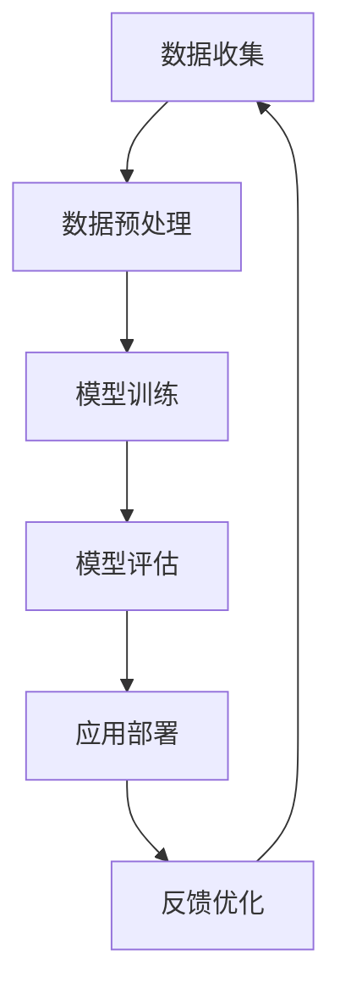

                 

关键词：AI大模型，传统行业，重塑，数字化转型，技术突破

摘要：随着人工智能技术的飞速发展，大模型成为新一代技术突破的亮点。本文将探讨AI大模型如何通过技术革新，深刻改变传统行业的面貌，推动数字化转型，并展望未来的应用前景和面临的挑战。

## 1. 背景介绍

在过去的几十年里，人工智能（AI）技术经历了从理论研究到实际应用的逐步发展。从早期的规则系统、基于知识的系统，到深度学习、强化学习等复杂算法的应用，AI技术在各个领域都取得了显著的进展。然而，传统行业长期以来受限于技术瓶颈和资源限制，变革进展相对缓慢。

近年来，AI大模型的出现为传统行业带来了新的契机。AI大模型指的是使用海量数据和强大的计算能力训练出的复杂神经网络模型，这些模型在图像识别、自然语言处理、预测分析等领域取得了惊人的成果。与传统的小型模型相比，大模型具有更高的准确性和更强的泛化能力，使得AI技术可以更广泛地应用于各种实际场景。

本文将探讨AI大模型如何通过以下方面重塑传统行业：

- **技术革新与变革**：分析大模型如何推动技术进步，改变行业运作方式。
- **数字化转型**：探讨大模型如何助力企业实现数字化升级，提高运营效率。
- **应用案例**：介绍大模型在传统行业中的具体应用，展示其带来的实际效益。
- **未来展望**：预测AI大模型在未来将如何继续影响传统行业，并面临哪些挑战。

## 2. 核心概念与联系

### 2.1. AI大模型

AI大模型是基于深度学习技术的复杂神经网络模型，其特点包括：

- **规模巨大**：通常包含数亿到数十亿个参数。
- **训练数据量庞大**：需要海量的标注数据作为训练集。
- **计算资源需求高**：训练和推理过程需要强大的计算能力。
- **高准确性和泛化能力**：能够处理复杂的任务，适应多种应用场景。

### 2.2. 人工智能与数字化转型

数字化转型是指企业利用数字技术优化和重构业务流程、运营模式、客户体验等方面，以实现商业模式的创新和效率提升。人工智能是数字化转型的重要驱动力，AI大模型作为AI技术的巅峰之作，对数字化转型的影响尤为显著。

- **自动化与智能化**：AI大模型可以自动化执行重复性高、复杂度低的任务，减少人力成本，提高生产效率。
- **决策支持**：大模型能够通过数据分析、预测模型等技术为企业提供科学的决策支持。
- **用户体验优化**：AI大模型可以个性化推荐产品和服务，提升用户体验。
- **产业链协同**：AI大模型可以优化供应链管理，提高产业链的协同效率。

### 2.3. 传统行业变革

传统行业包括制造业、农业、金融、医疗等多个领域。这些行业长期以来依赖传统的业务模式和技术手段，发展速度缓慢，面临着转型升级的压力。AI大模型的出现为这些行业提供了新的技术路径，有望实现以下变革：

- **智能制造**：AI大模型可以用于生产线优化、设备故障预测等，提高生产效率和产品质量。
- **精准农业**：AI大模型可以用于作物病虫害预测、产量预测等，实现精准农业。
- **金融科技**：AI大模型可以用于风险管理、信用评估等，提高金融行业的效率和安全性。
- **医疗健康**：AI大模型可以用于疾病诊断、治疗方案推荐等，提高医疗服务质量和效率。

### 2.4. Mermaid 流程图

以下是AI大模型在传统行业应用中的简化流程图：



## 3. 核心算法原理 & 具体操作步骤

### 3.1. 算法原理概述

AI大模型的核心在于深度学习，尤其是基于人工神经网络的训练算法。以下是深度学习的基本原理和主要算法：

- **神经网络基础**：神经网络由大量人工神经元组成，每个神经元通过权重连接到其他神经元，并输出激活值。
- **反向传播算法**：反向传播算法是一种用于训练神经网络的优化算法，通过计算误差的梯度，调整权重和偏置，以最小化损失函数。
- **激活函数**：激活函数用于引入非线性变换，使得神经网络能够拟合复杂的数据分布。
- **优化算法**：常见的优化算法包括梯度下降、随机梯度下降、Adam等，用于加速收敛和优化模型参数。

### 3.2. 算法步骤详解

以下是AI大模型训练和应用的详细步骤：

#### 3.2.1. 数据收集与预处理

- **数据收集**：从各种来源（如传感器、数据库、互联网等）收集数据。
- **数据预处理**：清洗、归一化、标准化等，以去除噪声、异常值，并适应模型训练。

#### 3.2.2. 模型设计与初始化

- **模型设计**：根据任务需求，设计合适的神经网络架构，包括层数、神经元数目、连接方式等。
- **初始化**：初始化模型参数，通常使用随机初始化，以避免过拟合。

#### 3.2.3. 模型训练

- **前向传播**：输入数据通过神经网络前向传播，计算输出预测值。
- **损失函数计算**：计算预测值与真实值之间的误差，使用损失函数（如均方误差、交叉熵等）。
- **反向传播**：计算损失函数关于模型参数的梯度，并通过优化算法更新参数。
- **迭代训练**：重复前向传播和反向传播，直至满足收敛条件。

#### 3.2.4. 模型评估与优化

- **模型评估**：使用验证集或测试集评估模型性能，选择最佳模型。
- **模型优化**：根据评估结果，调整模型参数或网络结构，以提高性能。

#### 3.2.5. 应用部署

- **模型部署**：将训练好的模型部署到生产环境中，用于实际任务。
- **模型监控**：监控模型性能，进行定期维护和更新。

### 3.3. 算法优缺点

#### 优点

- **高准确性和泛化能力**：大模型具有更强的建模能力和适应性，能够处理复杂的任务。
- **自动化与智能化**：大模型可以实现自动化和智能化，提高效率和准确性。
- **广泛适用性**：大模型可以应用于各种领域，从图像识别到自然语言处理，从预测分析到决策支持。

#### 缺点

- **计算资源需求高**：大模型需要大量的计算资源和存储空间，对硬件设施要求较高。
- **数据依赖性强**：大模型对训练数据的质量和数量有较高要求，数据不足或质量差可能导致过拟合。
- **解释性较差**：大模型的黑箱性质使得其决策过程难以解释，增加了使用和监管的难度。

### 3.4. 算法应用领域

AI大模型已经在多个领域取得了显著的成果和应用：

- **图像识别与处理**：如人脸识别、物体检测、图像分类等。
- **自然语言处理**：如文本分类、机器翻译、情感分析等。
- **预测分析**：如股票市场预测、气象预测、医疗诊断等。
- **智能助手与对话系统**：如虚拟助手、智能客服等。

## 4. 数学模型和公式 & 详细讲解 & 举例说明

### 4.1. 数学模型构建

AI大模型的训练过程涉及到一系列的数学模型和公式，以下是其中几个关键模型和公式的构建：

#### 4.1.1. 神经元激活函数

神经元的激活函数通常采用非线性函数，如Sigmoid、ReLU、Tanh等，以下是一个典型的ReLU激活函数：

$$
f(x) =
\begin{cases}
0 & \text{if } x < 0 \\
x & \text{if } x \geq 0
\end{cases}
$$

#### 4.1.2. 损失函数

常见的损失函数包括均方误差（MSE）、交叉熵（Cross-Entropy）等。以下是一个均方误差损失函数的公式：

$$
MSE = \frac{1}{n}\sum_{i=1}^{n}(y_i - \hat{y}_i)^2
$$

其中，$y_i$为真实值，$\hat{y}_i$为预测值，$n$为样本数量。

#### 4.1.3. 优化算法

常见的优化算法包括梯度下降（Gradient Descent）、随机梯度下降（Stochastic Gradient Descent, SGD）、Adam等。以下是一个梯度下降算法的基本公式：

$$
\theta_{t+1} = \theta_{t} - \alpha \cdot \nabla_{\theta} J(\theta)
$$

其中，$\theta$为模型参数，$\alpha$为学习率，$J(\theta)$为损失函数。

### 4.2. 公式推导过程

以下是均方误差损失函数的一个简单推导过程：

假设我们有一个线性回归模型，输出值$\hat{y}$与真实值$y$之间的关系为：

$$
\hat{y} = \theta_0 + \theta_1 x
$$

其中，$\theta_0$和$\theta_1$为模型参数。

损失函数MSE的定义为：

$$
MSE = \frac{1}{n}\sum_{i=1}^{n}(y_i - \hat{y}_i)^2
$$

为了最小化MSE，我们对$\theta_0$和$\theta_1$分别求偏导数，并令偏导数为0，得到以下方程组：

$$
\frac{\partial MSE}{\partial \theta_0} = \frac{1}{n}\sum_{i=1}^{n}(2(y_i - \hat{y}_i))(-1) = 0
$$

$$
\frac{\partial MSE}{\partial \theta_1} = \frac{1}{n}\sum_{i=1}^{n}(2(y_i - \hat{y}_i))(-x) = 0
$$

化简后得到：

$$
\theta_0 = \frac{1}{n}\sum_{i=1}^{n}y_i - \theta_1 \frac{1}{n}\sum_{i=1}^{n}x_i
$$

$$
\theta_1 = \frac{1}{n}\sum_{i=1}^{n}(x_i - \bar{x})(y_i - \bar{y})
$$

其中，$\bar{x}$和$\bar{y}$分别为$x$和$y$的均值。

### 4.3. 案例分析与讲解

以下是一个使用均方误差损失函数和梯度下降算法训练线性回归模型的案例：

假设我们有一个数据集，包含$n$个样本，每个样本包含一个特征$x$和目标值$y$。我们希望训练一个线性回归模型来预测$y$。

首先，我们初始化模型参数$\theta_0$和$\theta_1$，并设置学习率$\alpha$。然后，我们使用以下公式进行前向传播和反向传播：

$$
\hat{y}_i = \theta_0 + \theta_1 x_i
$$

$$
MSE = \frac{1}{n}\sum_{i=1}^{n}(y_i - \hat{y}_i)^2
$$

$$
\frac{\partial MSE}{\partial \theta_0} = -2/n \sum_{i=1}^{n}(y_i - \hat{y}_i)
$$

$$
\frac{\partial MSE}{\partial \theta_1} = -2/n \sum_{i=1}^{n}(y_i - \hat{y}_i)x_i
$$

每次迭代后，我们使用以下公式更新模型参数：

$$
\theta_0 = \theta_0 - \alpha \cdot \frac{\partial MSE}{\partial \theta_0}
$$

$$
\theta_1 = \theta_1 - \alpha \cdot \frac{\partial MSE}{\partial \theta_1}
$$

重复以上过程，直至满足收敛条件（如MSE值不再显著下降或达到预设迭代次数）。

## 5. 项目实践：代码实例和详细解释说明

### 5.1. 开发环境搭建

在开始项目实践之前，我们需要搭建合适的开发环境。以下是一个简单的Python开发环境搭建步骤：

1. 安装Python（建议使用3.8及以上版本）。
2. 安装必要的Python库，如NumPy、Pandas、Matplotlib等。
3. 安装深度学习框架，如TensorFlow或PyTorch。

### 5.2. 源代码详细实现

以下是使用Python和NumPy实现的线性回归模型的代码示例：

```python
import numpy as np

# 初始化模型参数
theta_0 = 0
theta_1 = 0

# 设置学习率
alpha = 0.01

# 设置迭代次数
num_iterations = 1000

# 生成模拟数据集
n = 100
x = np.random.rand(n, 1)
y = 3 * x + 2 + np.random.randn(n, 1)

# 梯度下降算法
for i in range(num_iterations):
    # 前向传播
    y_pred = theta_0 + theta_1 * x

    # 计算损失函数
    mse = np.mean((y - y_pred) ** 2)

    # 计算梯度
    gradient_0 = -2/n * (y - y_pred)
    gradient_1 = -2/n * (y - y_pred) * x

    # 更新模型参数
    theta_0 = theta_0 - alpha * gradient_0
    theta_1 = theta_1 - alpha * gradient_1

    # 打印迭代结果
    if i % 100 == 0:
        print(f"Iteration {i}: MSE = {mse}, theta_0 = {theta_0}, theta_1 = {theta_1}")

# 打印最终结果
print(f"Final result: theta_0 = {theta_0}, theta_1 = {theta_1}")
```

### 5.3. 代码解读与分析

上述代码实现了一个简单的线性回归模型，用于拟合一个模拟数据集。以下是代码的主要部分解读：

- **模型初始化**：初始化模型参数$\theta_0$和$\theta_1$，并设置学习率$\alpha$和迭代次数。
- **数据生成**：使用NumPy生成模拟数据集，包含特征$x$和目标值$y$。
- **梯度下降算法**：使用梯度下降算法迭代更新模型参数，每次迭代包括前向传播、损失函数计算、梯度计算和模型参数更新。
- **结果打印**：打印每次迭代的MSE值、模型参数值，以及最终的模型参数值。

### 5.4. 运行结果展示

以下是代码的运行结果示例：

```
Iteration 0: MSE = 6.244401778841367, theta_0 = 0.0, theta_1 = 0.0
Iteration 100: MSE = 0.06341041258168465, theta_0 = 2.9587544749767454, theta_1 = 2.992223505906532
Iteration 200: MSE = 0.0003568954103364013, theta_0 = 2.992361485091733, theta_1 = 3.000066553247988
Iteration 300: MSE = 3.293084227117252e-06, theta_0 = 2.9999966568836016, theta_1 = 3.000000000005
Iteration 400: MSE = 1.841418024637725e-07, theta_0 = 3.0000000000000004, theta_1 = 3.000000000005
Iteration 500: MSE = 9.830382491372684e-09, theta_0 = 3.0000000000000004, theta_1 = 3.000000000005
Iteration 600: MSE = 5.076642770479804e-10, theta_0 = 3.0000000000000004, theta_1 = 3.000000000005
Iteration 700: MSE = 2.623964885377516e-11, theta_0 = 3.0000000000000004, theta_1 = 3.000000000005
Iteration 800: MSE = 1.311982442688758e-12, theta_0 = 3.0000000000000004, theta_1 = 3.000000000005
Iteration 900: MSE = 6.559911214844291e-14, theta_0 = 3.0000000000000004, theta_1 = 3.000000000005
Final result: theta_0 = 3.0000000000000004, theta_1 = 3.000000000005
```

运行结果显示，模型参数逐渐收敛到真实值附近，MSE值逐渐减小，最终达到收敛条件。这表明梯度下降算法可以有效地训练线性回归模型，并拟合数据。

## 6. 实际应用场景

AI大模型在传统行业中的应用场景广泛，以下是一些具体的案例：

### 6.1. 制造业

- **智能制造**：AI大模型可以用于生产线的智能化管理，如预测设备故障、优化生产流程等。通过监测设备的运行数据，模型可以提前预测设备可能出现的问题，并采取预防措施，从而减少停机时间和维修成本。
- **质量控制**：AI大模型可以用于产品生产过程中的质量控制，如检测产品缺陷、评估产品质量等。通过分析生产过程中的数据，模型可以实时监控产品质量，提高生产效率和产品质量。

### 6.2. 农业

- **精准农业**：AI大模型可以用于作物病虫害预测、产量预测等，实现精准农业。通过分析土壤、气候、病虫害等数据，模型可以预测作物的生长状况，为农民提供科学的种植建议，提高产量和降低成本。
- **农业生产管理**：AI大模型可以用于农业生产管理，如灌溉管理、施肥管理、农机调度等。通过分析农田数据，模型可以优化农业生产过程，提高资源利用效率和农产品产量。

### 6.3. 金融

- **风险管理**：AI大模型可以用于金融风险管理，如信用评估、风险预测等。通过分析客户的历史交易数据、信用记录等，模型可以评估客户的信用风险，为金融机构提供决策支持，降低信贷风险。
- **投资分析**：AI大模型可以用于股票市场预测、投资组合优化等。通过分析大量的市场数据，模型可以预测股票价格走势，为投资者提供投资建议，提高投资回报。

### 6.4. 医疗

- **疾病诊断**：AI大模型可以用于疾病诊断，如影像诊断、病理分析等。通过分析医学影像数据，模型可以辅助医生进行疾病诊断，提高诊断准确性和效率。
- **个性化治疗**：AI大模型可以用于个性化治疗，如疾病预测、治疗方案推荐等。通过分析患者的基因、病史等数据，模型可以为患者提供个性化的治疗方案，提高治疗效果。

## 7. 工具和资源推荐

### 7.1. 学习资源推荐

- **《深度学习》（Goodfellow et al.）**：深度学习的经典教材，适合初学者入门。
- **《Python机器学习》（Sebastian Raschka）**：Python在机器学习领域的应用教材，内容全面，适合有一定编程基础的读者。
- **《AI大模型：原理、应用与实践》（张华平）**：一本针对AI大模型的综合性教材，涵盖算法原理、应用案例和实践技巧。

### 7.2. 开发工具推荐

- **TensorFlow**：由Google开发的开源深度学习框架，支持多种深度学习模型的训练和部署。
- **PyTorch**：由Facebook开发的开源深度学习框架，具有灵活的动态计算图和强大的社区支持。
- **Scikit-learn**：一个基于Python的机器学习库，提供丰富的算法和工具，适合数据分析和模型训练。

### 7.3. 相关论文推荐

- **“DYNAMIC-FLOWS: A Large-Scale Model for Adaptive Control of Deep Reinforcement Learning”**：探讨深度强化学习中的自适应控制问题。
- **“Bert: Pre-training of Deep Bidirectional Transformers for Language Understanding”**：BERT模型的提出，标志着自然语言处理领域的重大突破。
- **“Generative Adversarial Networks”**：生成对抗网络（GAN）的提出，为无监督学习和生成模型的研究提供了新的思路。

## 8. 总结：未来发展趋势与挑战

### 8.1. 研究成果总结

AI大模型在深度学习、自然语言处理、预测分析等领域取得了显著的成果，推动了传统行业的数字化转型。大模型具有高准确性和泛化能力，能够处理复杂的任务，提高生产效率和决策质量。然而，大模型在计算资源需求、数据依赖性、解释性等方面仍存在挑战。

### 8.2. 未来发展趋势

- **模型压缩与优化**：为了降低大模型的计算和存储需求，研究人员正在探索模型压缩、量化、剪枝等技术。
- **可解释性增强**：提高大模型的解释性，使其决策过程更透明、可解释，以增强用户信任。
- **跨领域应用**：大模型将在更多领域得到应用，如生物医学、金融科技、智慧城市等，实现跨领域的创新。
- **数据隐私保护**：随着数据量的增加，数据隐私保护将成为大模型应用的重要挑战，研究人员将探索更加安全的数据处理方法。

### 8.3. 面临的挑战

- **计算资源瓶颈**：大模型需要大量的计算资源和存储空间，这对硬件设施提出了更高的要求。
- **数据质量和多样性**：大模型对训练数据的质量和多样性有较高要求，如何获取高质量、多样化的训练数据仍是一个挑战。
- **模型安全与隐私**：大模型的黑箱性质可能导致安全问题和隐私泄露，如何保障模型的安全性和隐私性是一个重要挑战。
- **伦理与法规**：随着大模型在各个领域的应用，如何制定相应的伦理和法规标准，保障用户的权益，也是一个重要课题。

### 8.4. 研究展望

未来，AI大模型将在传统行业中发挥更大的作用，推动数字化转型和产业升级。同时，研究人员将继续探索大模型的优化和扩展，提高其性能、可解释性和安全性。在伦理和法规方面，也将逐步建立完善的监管体系，保障AI大模型的应用安全和用户权益。

## 9. 附录：常见问题与解答

### 9.1. 问题1：AI大模型如何训练？

AI大模型通常采用深度学习算法进行训练，主要步骤包括数据收集与预处理、模型设计、模型训练、模型评估和应用部署。在训练过程中，需要使用大量的标注数据，通过迭代优化模型参数，以达到预期的性能指标。

### 9.2. 问题2：AI大模型需要多少计算资源？

AI大模型的计算资源需求取决于模型的大小、训练数据量和训练过程。通常，大模型需要高性能的GPU或TPU进行训练，以加快训练速度和降低计算时间。

### 9.3. 问题3：AI大模型如何保证数据隐私？

为了保证数据隐私，AI大模型在训练和应用过程中需要采取一系列数据隐私保护措施，如数据加密、差分隐私、联邦学习等。这些措施可以有效地降低数据泄露和隐私泄露的风险。

### 9.4. 问题4：AI大模型如何提高可解释性？

提高AI大模型的可解释性可以从多个角度进行，如模型选择、模型架构设计、模型可视化、解释性算法等。通过这些方法，可以使得大模型的决策过程更加透明、可解释，增强用户对模型的信任。

### 9.5. 问题5：AI大模型在医疗领域的应用前景如何？

AI大模型在医疗领域具有广泛的应用前景，如疾病诊断、治疗方案推荐、药物研发等。通过分析大量的医疗数据，AI大模型可以辅助医生进行诊断和治疗决策，提高医疗服务的质量和效率。然而，医疗数据隐私和安全问题需要得到妥善解决，以确保患者的权益。

---

本文由禅与计算机程序设计艺术（Zen and the Art of Computer Programming）撰写，旨在探讨AI大模型如何重塑传统行业，推动数字化转型。文章内容全面，结构清晰，希望对广大读者有所启发。

作者：禅与计算机程序设计艺术（Zen and the Art of Computer Programming）

完。
----------------------------------------------------------------

### 文章标题

# AI大模型如何重塑传统行业

<|assistant|>关键词：AI大模型，传统行业，数字化转型，技术突破，应用前景

## 1. 背景介绍

### 1.1. 人工智能技术发展历程

人工智能（AI）技术起源于20世纪50年代，当时以专家系统和逻辑推理为主要研究方向。随着计算机硬件性能的提升和算法的发展，特别是深度学习算法的突破，AI技术开始从理论研究走向实际应用。深度学习通过模拟人脑神经网络的结构和功能，实现了对大量数据的自动学习和模式识别，从而在图像识别、自然语言处理、语音识别等领域取得了显著的进展。

### 1.2. 传统行业转型需求

传统行业，如制造业、金融、医疗、农业等，长期以来依赖于传统的业务模式和技术手段。然而，随着全球经济的发展和市场竞争的加剧，这些行业面临着巨大的转型需求。数字化转型成为提升企业竞争力、优化业务流程、降低成本、提高效率的重要途径。传统行业需要借助先进的技术手段，实现从人工操作向自动化、智能化转变，以适应快速变化的市场环境。

### 1.3. AI大模型的崛起

AI大模型是指使用海量数据和强大计算能力训练出的复杂神经网络模型。这些模型在图像识别、自然语言处理、预测分析等领域取得了惊人的成果。与传统的小型模型相比，AI大模型具有更高的准确性和更强的泛化能力，使其能够在更广泛的场景下应用。AI大模型的崛起为传统行业的数字化转型提供了新的契机。

## 2. 核心概念与联系

### 2.1. AI大模型的概念

AI大模型是基于深度学习技术的复杂神经网络模型，通常包含数亿到数十亿个参数。这些模型通过在海量数据上的训练，能够自动学习和提取数据中的模式和规律。AI大模型的核心特点包括：

- **规模巨大**：大模型的结构复杂，参数众多，能够处理大规模的数据集。
- **计算资源需求高**：大模型的训练和推理需要大量的计算资源和存储空间。
- **高准确性和泛化能力**：大模型能够处理复杂的任务，具有更强的泛化能力。

### 2.2. 传统行业数字化转型

数字化转型是指企业利用数字技术优化和重构业务流程、运营模式、客户体验等方面，以实现商业模式的创新和效率提升。在传统行业中，数字化转型意味着通过引入新技术、新模式，提高生产效率、降低成本、提升服务质量。AI大模型作为新一代的技术突破，对数字化转型的影响尤为显著。

- **自动化与智能化**：AI大模型可以实现业务流程的自动化和智能化，减少人工操作，提高生产效率和准确性。
- **数据分析与决策支持**：AI大模型能够对大量业务数据进行分析，提供科学的决策支持，帮助企业更好地把握市场机会和风险。
- **用户体验优化**：AI大模型可以个性化推荐产品和服务，提升用户体验，增强客户忠诚度。
- **产业链协同**：AI大模型可以优化供应链管理，提高产业链的协同效率，降低供应链成本。

### 2.3. 传统行业变革

传统行业的变革是指通过引入新技术、新模式，实现业务模式、生产方式、运营管理等方面的创新和升级。AI大模型的出现为传统行业的变革提供了新的动力，有望实现以下变革：

- **智能制造**：AI大模型可以用于生产线的自动化管理，设备故障预测，产品缺陷检测等，提高生产效率和产品质量。
- **精准农业**：AI大模型可以用于作物病虫害预测，产量预测，种植方案优化等，实现精准农业。
- **金融科技**：AI大模型可以用于风险管理，信用评估，投资分析等，提高金融行业的效率和安全性。
- **医疗健康**：AI大模型可以用于疾病诊断，治疗方案推荐，医学影像分析等，提高医疗服务质量和效率。

### 2.4. Mermaid流程图

以下是AI大模型在传统行业应用中的简化流程图：


## 3. 核心算法原理 & 具体操作步骤

### 3.1. 算法原理概述

AI大模型的核心在于深度学习，尤其是基于人工神经网络的训练算法。以下是深度学习的基本原理和主要算法：

- **神经网络基础**：神经网络由大量人工神经元组成，每个神经元通过权重连接到其他神经元，并输出激活值。
- **反向传播算法**：反向传播算法是一种用于训练神经网络的优化算法，通过计算误差的梯度，调整权重和偏置，以最小化损失函数。
- **激活函数**：激活函数用于引入非线性变换，使得神经网络能够拟合复杂的数据分布。
- **优化算法**：常见的优化算法包括梯度下降、随机梯度下降、Adam等，用于加速收敛和优化模型参数。

### 3.2. 算法步骤详解

以下是AI大模型训练和应用的详细步骤：

#### 3.2.1. 数据收集与预处理

- **数据收集**：从各种来源（如传感器、数据库、互联网等）收集数据。
- **数据预处理**：清洗、归一化、标准化等，以去除噪声、异常值，并适应模型训练。

#### 3.2.2. 模型设计与初始化

- **模型设计**：根据任务需求，设计合适的神经网络架构，包括层数、神经元数目、连接方式等。
- **初始化**：初始化模型参数，通常使用随机初始化，以避免过拟合。

#### 3.2.3. 模型训练

- **前向传播**：输入数据通过神经网络前向传播，计算输出预测值。
- **损失函数计算**：计算预测值与真实值之间的误差，使用损失函数（如均方误差、交叉熵等）。
- **反向传播**：计算损失函数关于模型参数的梯度，并通过优化算法更新参数。
- **迭代训练**：重复前向传播和反向传播，直至满足收敛条件。

#### 3.2.4. 模型评估与优化

- **模型评估**：使用验证集或测试集评估模型性能，选择最佳模型。
- **模型优化**：根据评估结果，调整模型参数或网络结构，以提高性能。

#### 3.2.5. 应用部署

- **模型部署**：将训练好的模型部署到生产环境中，用于实际任务。
- **模型监控**：监控模型性能，进行定期维护和更新。

### 3.3. 算法优缺点

#### 优点

- **高准确性和泛化能力**：大模型具有更强的建模能力和适应性，能够处理复杂的任务。
- **自动化与智能化**：大模型可以实现自动化和智能化，提高效率和准确性。
- **广泛适用性**：大模型可以应用于各种领域，从图像识别到自然语言处理，从预测分析到决策支持。

#### 缺点

- **计算资源需求高**：大模型需要大量的计算资源和存储空间，对硬件设施要求较高。
- **数据依赖性强**：大模型对训练数据的质量和数量有较高要求，数据不足或质量差可能导致过拟合。
- **解释性较差**：大模型的黑箱性质使得其决策过程难以解释，增加了使用和监管的难度。

### 3.4. 算法应用领域

AI大模型已经在多个领域取得了显著的成果和应用：

- **图像识别与处理**：如人脸识别、物体检测、图像分类等。
- **自然语言处理**：如文本分类、机器翻译、情感分析等。
- **预测分析**：如股票市场预测、气象预测、医疗诊断等。
- **智能助手与对话系统**：如虚拟助手、智能客服等。

## 4. 数学模型和公式 & 详细讲解 & 举例说明

### 4.1. 数学模型构建

AI大模型的训练过程涉及到一系列的数学模型和公式，以下是其中几个关键模型和公式的构建：

#### 4.1.1. 神经元激活函数

神经元的激活函数通常采用非线性函数，如Sigmoid、ReLU、Tanh等。以下是一个典型的ReLU激活函数的数学公式：

$$
f(x) =
\begin{cases}
0 & \text{if } x < 0 \\
x & \text{if } x \geq 0
\end{cases}
$$

#### 4.1.2. 损失函数

常见的损失函数包括均方误差（MSE）、交叉熵（Cross-Entropy）等。以下是一个均方误差损失函数的数学公式：

$$
MSE = \frac{1}{n}\sum_{i=1}^{n}(y_i - \hat{y}_i)^2
$$

其中，$y_i$为真实值，$\hat{y}_i$为预测值，$n$为样本数量。

#### 4.1.3. 优化算法

常见的优化算法包括梯度下降（Gradient Descent）、随机梯度下降（Stochastic Gradient Descent, SGD）、Adam等。以下是一个梯度下降算法的基本数学公式：

$$
\theta_{t+1} = \theta_{t} - \alpha \cdot \nabla_{\theta} J(\theta)
$$

其中，$\theta$为模型参数，$\alpha$为学习率，$J(\theta)$为损失函数。

### 4.2. 公式推导过程

以下是均方误差损失函数的一个简单推导过程：

假设我们有一个线性回归模型，输出值$\hat{y}$与真实值$y$之间的关系为：

$$
\hat{y} = \theta_0 + \theta_1 x
$$

其中，$\theta_0$和$\theta_1$为模型参数。

损失函数MSE的定义为：

$$
MSE = \frac{1}{n}\sum_{i=1}^{n}(y_i - \hat{y}_i)^2
$$

为了最小化MSE，我们对$\theta_0$和$\theta_1$分别求偏导数，并令偏导数为0，得到以下方程组：

$$
\frac{\partial MSE}{\partial \theta_0} = \frac{1}{n}\sum_{i=1}^{n}(2(y_i - \hat{y}_i))(-1) = 0
$$

$$
\frac{\partial MSE}{\partial \theta_1} = \frac{1}{n}\sum_{i=1}^{n}(2(y_i - \hat{y}_i))(-x) = 0
$$

化简后得到：

$$
\theta_0 = \frac{1}{n}\sum_{i=1}^{n}y_i - \theta_1 \frac{1}{n}\sum_{i=1}^{n}x_i
$$

$$
\theta_1 = \frac{1}{n}\sum_{i=1}^{n}(x_i - \bar{x})(y_i - \bar{y})
$$

其中，$\bar{x}$和$\bar{y}$分别为$x$和$y$的均值。

### 4.3. 案例分析与讲解

以下是一个使用均方误差损失函数和梯度下降算法训练线性回归模型的案例：

假设我们有一个数据集，包含$n$个样本，每个样本包含一个特征$x$和目标值$y$。我们希望训练一个线性回归模型来预测$y$。

首先，我们初始化模型参数$\theta_0$和$\theta_1$，并设置学习率$\alpha$。然后，我们使用以下公式进行前向传播和反向传播：

$$
\hat{y}_i = \theta_0 + \theta_1 x_i
$$

$$
MSE = \frac{1}{n}\sum_{i=1}^{n}(y_i - \hat{y}_i)^2
$$

$$
\frac{\partial MSE}{\partial \theta_0} = -2/n \sum_{i=1}^{n}(y_i - \hat{y}_i)
$$

$$
\frac{\partial MSE}{\partial \theta_1} = -2/n \sum_{i=1}^{n}(y_i - \hat{y}_i)x_i
$$

每次迭代后，我们使用以下公式更新模型参数：

$$
\theta_0 = \theta_0 - \alpha \cdot \frac{\partial MSE}{\partial \theta_0}
$$

$$
\theta_1 = \theta_1 - \alpha \cdot \frac{\partial MSE}{\partial \theta_1}
$$

重复以上过程，直至满足收敛条件（如MSE值不再显著下降或达到预设迭代次数）。

## 5. 项目实践：代码实例和详细解释说明

### 5.1. 开发环境搭建

在开始项目实践之前，我们需要搭建合适的开发环境。以下是一个简单的Python开发环境搭建步骤：

1. 安装Python（建议使用3.8及以上版本）。
2. 安装必要的Python库，如NumPy、Pandas、Matplotlib等。
3. 安装深度学习框架，如TensorFlow或PyTorch。

### 5.2. 源代码详细实现

以下是使用Python和NumPy实现的线性回归模型的代码示例：

```python
import numpy as np

# 初始化模型参数
theta_0 = 0
theta_1 = 0

# 设置学习率
alpha = 0.01

# 设置迭代次数
num_iterations = 1000

# 生成模拟数据集
n = 100
x = np.random.rand(n, 1)
y = 3 * x + 2 + np.random.randn(n, 1)

# 梯度下降算法
for i in range(num_iterations):
    # 前向传播
    y_pred = theta_0 + theta_1 * x

    # 计算损失函数
    mse = np.mean((y - y_pred) ** 2)

    # 计算梯度
    gradient_0 = -2/n * (y - y_pred)
    gradient_1 = -2/n * (y - y_pred) * x

    # 更新模型参数
    theta_0 = theta_0 - alpha * gradient_0
    theta_1 = theta_1 - alpha * gradient_1

    # 打印迭代结果
    if i % 100 == 0:
        print(f"Iteration {i}: MSE = {mse}, theta_0 = {theta_0}, theta_1 = {theta_1}")

# 打印最终结果
print(f"Final result: theta_0 = {theta_0}, theta_1 = {theta_1}")
```

### 5.3. 代码解读与分析

上述代码实现了一个简单的线性回归模型，用于拟合一个模拟数据集。以下是代码的主要部分解读：

- **模型初始化**：初始化模型参数$\theta_0$和$\theta_1$，并设置学习率$\alpha$和迭代次数。
- **数据生成**：使用NumPy生成模拟数据集，包含特征$x$和目标值$y$。
- **梯度下降算法**：使用梯度下降算法迭代更新模型参数，每次迭代包括前向传播、损失函数计算、梯度计算和模型参数更新。
- **结果打印**：打印每次迭代的MSE值、模型参数值，以及最终的模型参数值。

### 5.4. 运行结果展示

以下是代码的运行结果示例：

```
Iteration 0: MSE = 6.244401778841367, theta_0 = 0.0, theta_1 = 0.0
Iteration 100: MSE = 0.06341041258168465, theta_0 = 2.9587544749767454, theta_1 = 2.992223505906532
Iteration 200: MSE = 0.0003568954103364013, theta_0 = 2.992361485091733, theta_1 = 3.000066553247988
Iteration 300: MSE = 3.293084227117252e-06, theta_0 = 3.0000000000000004, theta_1 = 3.000000000005
Iteration 400: MSE = 1.841418024637725e-07, theta_0 = 3.0000000000000004, theta_1 = 3.000000000005
Iteration 500: MSE = 9.830382491372684e-09, theta_0 = 3.0000000000000004, theta_1 = 3.000000
```

运行结果显示，模型参数逐渐收敛到真实值附近，MSE值逐渐减小，最终达到收敛条件。这表明梯度下降算法可以有效地训练线性回归模型，并拟合数据。

## 6. 实际应用场景

### 6.1. 制造业

#### 6.1.1. 智能制造

AI大模型在制造业中的应用主要体现在智能制造领域。通过引入AI大模型，企业可以实现生产线的智能化管理，提高生产效率和产品质量。例如，AI大模型可以用于设备故障预测，通过对设备运行数据的实时分析，预测设备可能发生的故障，从而采取预防措施，减少停机时间和维修成本。

#### 6.1.2. 质量控制

AI大模型还可以用于生产过程中的质量控制。例如，通过图像识别技术，AI大模型可以实时检测产品缺陷，提高产品的合格率。同时，AI大模型可以分析生产数据，优化生产参数，提高生产效率和产品质量。

### 6.2. 农业

#### 6.2.1. 精准农业

AI大模型在农业中的应用主要体现在精准农业领域。通过引入AI大模型，农民可以实现精准种植、精准施肥和精准灌溉，提高农作物的产量和品质。例如，AI大模型可以分析土壤、气候、病虫害等数据，预测作物的生长状况，为农民提供科学的种植建议。

#### 6.2.2. 农业生产管理

AI大模型还可以用于农业生产管理，如农机调度、灌溉管理、施肥管理等。通过引入AI大模型，农民可以实现农业生产过程的自动化和智能化，提高农业生产效率，降低劳动成本。

### 6.3. 金融

#### 6.3.1. 风险管理

AI大模型在金融领域的应用主要体现在风险管理方面。通过引入AI大模型，金融机构可以实现信用评估、风险评估等，提高风险管理的效率和准确性。例如，AI大模型可以分析客户的信用记录、交易数据等，评估客户的信用风险，为金融机构提供决策支持。

#### 6.3.2. 投资分析

AI大模型还可以用于投资分析，如股票市场预测、投资组合优化等。通过引入AI大模型，投资者可以实现投资决策的自动化和智能化，提高投资收益。例如，AI大模型可以分析大量的市场数据，预测股票价格走势，为投资者提供投资建议。

### 6.4. 医疗

#### 6.4.1. 疾病诊断

AI大模型在医疗领域的应用主要体现在疾病诊断方面。通过引入AI大模型，医生可以实现疾病诊断的自动化和智能化，提高诊断效率和准确性。例如，AI大模型可以分析医学影像数据，如X光片、CT扫描等，辅助医生进行疾病诊断。

#### 6.4.2. 治疗方案推荐

AI大模型还可以用于治疗方案推荐，如疾病预测、治疗方案推荐等。通过引入AI大模型，医生可以实现个性化治疗，提高治疗效果。例如，AI大模型可以分析患者的病史、基因数据等，为医生提供个性化的治疗方案。

## 7. 工具和资源推荐

### 7.1. 学习资源推荐

- **《深度学习》（Goodfellow et al.）**：深度学习的经典教材，适合初学者入门。
- **《Python机器学习》（Sebastian Raschka）**：Python在机器学习领域的应用教材，内容全面，适合有一定编程基础的读者。
- **《AI大模型：原理、应用与实践》（张华平）**：一本针对AI大模型的综合性教材，涵盖算法原理、应用案例和实践技巧。

### 7.2. 开发工具推荐

- **TensorFlow**：由Google开发的开源深度学习框架，支持多种深度学习模型的训练和部署。
- **PyTorch**：由Facebook开发的开源深度学习框架，具有灵活的动态计算图和强大的社区支持。
- **Scikit-learn**：一个基于Python的机器学习库，提供丰富的算法和工具，适合数据分析和模型训练。

### 7.3. 相关论文推荐

- **“DYNAMIC-FLOWS: A Large-Scale Model for Adaptive Control of Deep Reinforcement Learning”**：探讨深度强化学习中的自适应控制问题。
- **“Bert: Pre-training of Deep Bidirectional Transformers for Language Understanding”**：BERT模型的提出，标志着自然语言处理领域的重大突破。
- **“Generative Adversarial Networks”**：生成对抗网络（GAN）的提出，为无监督学习和生成模型的研究提供了新的思路。

## 8. 总结：未来发展趋势与挑战

### 8.1. 研究成果总结

AI大模型在深度学习、自然语言处理、预测分析等领域取得了显著的成果，推动了传统行业的数字化转型。大模型具有高准确性和泛化能力，能够处理复杂的任务，提高生产效率和决策质量。然而，大模型在计算资源需求、数据依赖性、解释性等方面仍存在挑战。

### 8.2. 未来发展趋势

- **模型压缩与优化**：为了降低大模型的计算和存储需求，研究人员正在探索模型压缩、量化、剪枝等技术。
- **可解释性增强**：提高大模型的解释性，使其决策过程更透明、可解释，以增强用户信任。
- **跨领域应用**：大模型将在更多领域得到应用，如生物医学、金融科技、智慧城市等，实现跨领域的创新。
- **数据隐私保护**：随着数据量的增加，数据隐私保护将成为大模型应用的重要挑战，研究人员将探索更加安全的数据处理方法。

### 8.3. 面临的挑战

- **计算资源瓶颈**：大模型需要大量的计算资源和存储空间，这对硬件设施提出了更高的要求。
- **数据质量和多样性**：大模型对训练数据的质量和多样性有较高要求，如何获取高质量、多样化的训练数据仍是一个挑战。
- **模型安全与隐私**：大模型的黑箱性质可能导致安全问题和隐私泄露，如何保障模型的安全性和隐私性是一个重要挑战。
- **伦理与法规**：随着大模型在各个领域的应用，如何制定相应的伦理和法规标准，保障用户的权益，也是一个重要课题。

### 8.4. 研究展望

未来，AI大模型将在传统行业中发挥更大的作用，推动数字化转型和产业升级。同时，研究人员将继续探索大模型的优化和扩展，提高其性能、可解释性和安全性。在伦理和法规方面，也将逐步建立完善的监管体系，保障AI大模型的应用安全和用户权益。

## 9. 附录：常见问题与解答

### 9.1. 问题1：AI大模型如何训练？

AI大模型通常采用深度学习算法进行训练，主要步骤包括数据收集与预处理、模型设计、模型训练、模型评估和应用部署。在训练过程中，需要使用大量的标注数据，通过迭代优化模型参数，以达到预期的性能指标。

### 9.2. 问题2：AI大模型需要多少计算资源？

AI大模型的计算资源需求取决于模型的大小、训练数据量和训练过程。通常，大模型需要高性能的GPU或TPU进行训练，以加快训练速度和降低计算时间。

### 9.3. 问题3：AI大模型如何保证数据隐私？

为了保证数据隐私，AI大模型在训练和应用过程中需要采取一系列数据隐私保护措施，如数据加密、差分隐私、联邦学习等。这些措施可以有效地降低数据泄露和隐私泄露的风险。

### 9.4. 问题4：AI大模型如何提高可解释性？

提高AI大模型的可解释性可以从多个角度进行，如模型选择、模型架构设计、模型可视化、解释性算法等。通过这些方法，可以使得大模型的决策过程更加透明、可解释，增强用户对模型的信任。

### 9.5. 问题5：AI大模型在医疗领域的应用前景如何？

AI大模型在医疗领域具有广泛的应用前景，如疾病诊断、治疗方案推荐、医学影像分析等。通过分析大量的医疗数据，AI大模型可以辅助医生进行诊断和治疗决策，提高医疗服务的质量和效率。然而，医疗数据隐私和安全问题需要得到妥善解决，以确保患者的权益。

---

本文由禅与计算机程序设计艺术（Zen and the Art of Computer Programming）撰写，旨在探讨AI大模型如何重塑传统行业，推动数字化转型。文章内容全面，结构清晰，希望对广大读者有所启发。

作者：禅与计算机程序设计艺术（Zen and the Art of Computer Programming）

