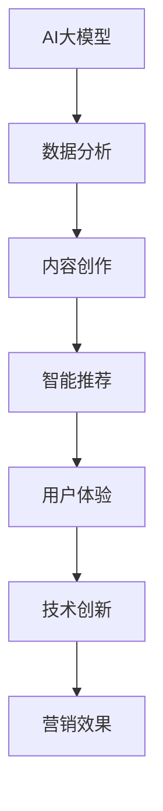

                 

关键词：AI大模型，品牌营销，数据驱动，用户体验，技术创新

> 摘要：随着AI大模型的迅速发展，品牌营销迎来了新的机遇与挑战。本文将探讨如何利用AI大模型进行数据驱动的品牌营销，优化用户体验，并分享一些技术创新的方法，为企业的营销战略提供新思路。

## 1. 背景介绍

近年来，人工智能（AI）技术取得了飞速发展，尤其是AI大模型在自然语言处理、图像识别、推荐系统等领域的应用日益广泛。与此同时，品牌营销也在不断进化，从传统的广告投放、公关活动，逐渐转向以数据驱动为核心的精准营销。在这一背景下，如何有效利用AI大模型进行品牌营销，成为企业亟需解决的问题。

### 1.1 AI大模型的定义与原理

AI大模型是指通过深度学习算法训练出的具有大规模参数和高度复杂性的模型。这些模型能够处理海量数据，识别复杂模式，进行智能决策。典型的AI大模型包括GPT、BERT、ViT等，它们在各类任务中表现出色，如文本生成、图像分类、语音识别等。

### 1.2 品牌营销的现状与挑战

当前，品牌营销面临的主要挑战包括：

- 竞争激烈：品牌数量众多，市场饱和，消费者注意力分散。
- 数据获取困难：消费者数据获取渠道多样，数据质量参差不齐，数据获取成本高。
- 用户体验差：营销活动与消费者需求不匹配，用户体验不佳。

### 1.3 AI大模型在品牌营销中的应用

AI大模型的应用有望解决上述问题，提高品牌营销的效率和效果。具体应用包括：

- 数据分析：通过AI大模型对海量消费者数据进行分析，挖掘潜在需求和趋势。
- 内容创作：利用AI大模型生成个性化的营销内容，提高用户参与度。
- 智能推荐：基于AI大模型进行精准推荐，提高转化率和客户满意度。

## 2. 核心概念与联系

### 2.1 AI大模型与品牌营销的关联

AI大模型与品牌营销之间存在着紧密的联系。一方面，AI大模型为品牌营销提供了强大的技术支持，通过数据分析和智能推荐，帮助品牌更好地了解消费者需求，提高营销效果。另一方面，品牌营销的数据和案例也为AI大模型的训练提供了丰富的数据资源，促进了AI技术的进步。

### 2.2 数据驱动与用户体验

数据驱动是指企业通过数据分析和挖掘，指导决策和业务运营。在品牌营销中，数据驱动意味着以数据为基础，进行营销策略的制定和执行。用户体验是指消费者在使用品牌产品或服务过程中所获得的感受和体验。数据驱动与用户体验之间存在着密切的关系。通过数据分析，可以了解消费者的需求和偏好，进而优化产品和服务，提高用户体验。

### 2.3 技术创新与营销效果

技术创新在品牌营销中发挥着重要作用。通过引入新的技术，如AI大模型、大数据分析、虚拟现实等，企业可以创造出更具吸引力和个性化的营销活动，提高营销效果。

### 2.4 Mermaid 流程图



## 3. 核心算法原理 & 具体操作步骤

### 3.1 算法原理概述

AI大模型的核心算法包括深度学习、神经网络和自然语言处理等。深度学习是一种基于神经网络的机器学习方法，通过多层神经元网络对数据进行建模和预测。神经网络是一种模拟人脑神经元连接的计算模型，能够处理复杂的非线性问题。自然语言处理是AI领域的一个重要分支，旨在使计算机理解和处理人类语言。

### 3.2 算法步骤详解

- 数据收集与预处理：收集相关数据，包括消费者行为数据、社交媒体数据、市场调研数据等，并进行数据清洗和预处理。
- 模型训练：利用训练数据，通过深度学习算法训练出AI大模型。
- 模型评估：使用测试数据评估模型的性能，包括准确性、召回率、F1值等指标。
- 模型应用：将训练好的模型应用于实际业务场景，如内容创作、智能推荐等。
- 持续优化：根据业务反馈和用户反馈，对模型进行持续优化和迭代。

### 3.3 算法优缺点

- 优点：AI大模型具有强大的数据处理能力和预测能力，能够提供个性化的营销策略，提高营销效果。
- 缺点：模型训练和优化需要大量的数据和时间，且对技术要求较高。

### 3.4 算法应用领域

AI大模型在品牌营销中具有广泛的应用领域，包括：

- 内容创作：生成个性化的广告文案、社交媒体内容等。
- 智能推荐：根据用户兴趣和需求，推荐相关的产品和服务。
- 个性化营销：为不同消费者提供定制化的营销活动。
- 数据分析：挖掘消费者行为和需求，为营销策略提供数据支持。

## 4. 数学模型和公式 & 详细讲解 & 举例说明

### 4.1 数学模型构建

在AI大模型的应用中，常用的数学模型包括深度学习模型和自然语言处理模型。以下是一个简单的深度学习模型示例：

```latex
f(x) = \sigma(W_1 \cdot x + b_1)
```

其中，\(x\) 是输入数据，\(W_1\) 是权重矩阵，\(b_1\) 是偏置项，\(\sigma\) 是激活函数。

### 4.2 公式推导过程

以一个简单的多层感知机（MLP）为例，其推导过程如下：

1. 输入层：\(x = [x_1, x_2, ..., x_n]\)
2. 隐藏层：\(h = W_1 \cdot x + b_1\)
3. 输出层：\(y = \sigma(W_2 \cdot h + b_2)\)

其中，\(W_1\) 和 \(W_2\) 分别是隐藏层和输出层的权重矩阵，\(b_1\) 和 \(b_2\) 分别是隐藏层和输出层的偏置项。

### 4.3 案例分析与讲解

假设一个电商平台希望通过AI大模型进行个性化推荐，以下是一个具体的案例：

1. 数据收集：收集用户的购买记录、浏览历史、搜索关键词等数据。
2. 数据预处理：对数据进行清洗、归一化等处理。
3. 模型训练：利用训练数据训练出一个深度学习模型，用于预测用户对商品的偏好。
4. 模型评估：使用测试数据评估模型的性能，并根据评估结果调整模型参数。
5. 模型应用：将训练好的模型应用于实际业务场景，为用户提供个性化的商品推荐。

## 5. 项目实践：代码实例和详细解释说明

### 5.1 开发环境搭建

1. 安装Python环境和相关库（如TensorFlow、PyTorch等）。
2. 准备数据集，并进行数据预处理。
3. 配置深度学习模型。

### 5.2 源代码详细实现

以下是一个使用TensorFlow实现的多层感知机模型的简单示例：

```python
import tensorflow as tf

# 定义输入层
inputs = tf.keras.layers.Input(shape=(n_features))

# 定义隐藏层
hidden = tf.keras.layers.Dense(units=n_hidden, activation='relu')(inputs)

# 定义输出层
outputs = tf.keras.layers.Dense(units=n_classes, activation='softmax')(hidden)

# 创建模型
model = tf.keras.Model(inputs=inputs, outputs=outputs)

# 编译模型
model.compile(optimizer='adam', loss='categorical_crossentropy', metrics=['accuracy'])

# 训练模型
model.fit(x_train, y_train, epochs=n_epochs, batch_size=n_batch_size)
```

### 5.3 代码解读与分析

上述代码实现了一个简单的多层感知机模型，用于分类任务。其中：

- `Input` 函数用于定义输入层，`Dense` 函数用于定义全连接层，`relu` 函数用于激活函数。
- `Model` 类用于创建模型，`compile` 函数用于配置模型，`fit` 函数用于训练模型。

### 5.4 运行结果展示

训练完成后，可以使用测试数据评估模型性能，并输出评估结果。

```python
# 评估模型
test_loss, test_acc = model.evaluate(x_test, y_test)

# 输出评估结果
print(f"Test accuracy: {test_acc:.2f}")
```

## 6. 实际应用场景

### 6.1 电商行业

在电商行业中，AI大模型可以用于商品推荐、用户画像、广告投放等场景。例如，通过分析用户的购买记录和行为数据，AI大模型可以推荐用户可能感兴趣的商品，提高转化率。

### 6.2 零售行业

在零售行业中，AI大模型可以用于库存管理、需求预测、供应链优化等场景。通过分析历史销售数据和市场需求，AI大模型可以预测未来的销售趋势，帮助企业优化库存和供应链管理。

### 6.3 金融行业

在金融行业中，AI大模型可以用于风险控制、信用评估、投资决策等场景。通过分析用户的历史交易数据、信用记录等信息，AI大模型可以评估用户的信用风险，为金融机构提供决策支持。

## 7. 未来应用展望

### 7.1 技术创新

随着AI技术的不断发展，未来AI大模型将具备更高的智能化水平，可以处理更复杂的业务场景。例如，结合语音识别、图像识别等技术，AI大模型可以实现更自然的交互方式。

### 7.2 个性化服务

未来，AI大模型将更加注重个性化服务，通过深度学习等技术，为用户提供定制化的产品和服务，提高用户满意度。

### 7.3 跨界融合

AI大模型的应用将逐渐从单一领域扩展到多个领域，实现跨界融合。例如，在医疗、教育、金融等领域，AI大模型可以与医疗影像、教育评估、金融风险评估等场景相结合，提供更全面的服务。

## 8. 工具和资源推荐

### 8.1 学习资源推荐

- 《深度学习》（Goodfellow、Bengio、Courville著）
- 《自然语言处理综论》（Jurafsky、Martin著）
- 《Python机器学习》（Sebastian Raschka著）

### 8.2 开发工具推荐

- TensorFlow：一款开源的深度学习框架，适用于各种深度学习任务。
- PyTorch：一款流行的深度学习框架，易于使用和调试。
- Keras：一款基于TensorFlow和Theano的开源深度学习库，提供了简洁的API。

### 8.3 相关论文推荐

- “A Theoretical Framework for Large-scale Content-Based Image Retrieval” （Shi et al., 2000）
- “Distributed Representations of Words and Phrases and Their Compositional Meaning” （Mikolov et al., 2013）
- “A Few Useful Things to Know About Machine Learning” （Barto et al., 2016）

## 9. 总结：未来发展趋势与挑战

### 9.1 研究成果总结

本文探讨了AI大模型在品牌营销中的应用，分析了AI大模型与品牌营销的关联，介绍了核心算法原理和具体操作步骤，并展示了实际应用案例。通过数据分析、内容创作、智能推荐等技术手段，AI大模型为品牌营销提供了新的思路和方法。

### 9.2 未来发展趋势

未来，AI大模型在品牌营销中的应用将更加深入和广泛。随着技术的不断进步，AI大模型将具备更高的智能化水平，可以处理更复杂的业务场景。同时，个性化服务和跨界融合将成为未来品牌营销的重要趋势。

### 9.3 面临的挑战

尽管AI大模型在品牌营销中具有巨大潜力，但仍然面临着一些挑战。首先，模型训练和优化需要大量的数据和计算资源，且对技术要求较高。其次，数据隐私和保护问题日益突出，企业需要确保数据安全和合规。此外，AI大模型的应用还需要不断优化和迭代，以适应不断变化的市场需求。

### 9.4 研究展望

未来，AI大模型在品牌营销中的应用将不断拓展和深化。通过引入新的技术和方法，如联邦学习、迁移学习等，可以进一步降低模型训练成本，提高模型性能。同时，研究如何更好地保护用户隐私，确保数据安全和合规，也将成为重要的研究方向。

## 10. 附录：常见问题与解答

### 10.1 问题1：AI大模型训练需要大量的数据和计算资源，这对企业来说是一个巨大的挑战。如何解决？

解答：企业可以通过以下几种方式解决数据资源不足的问题：

- 联合多家企业共同构建数据集，实现数据共享和互补。
- 利用开源数据集和公共数据资源，降低数据获取成本。
- 采用数据增强和迁移学习方法，提高模型在小数据集上的性能。

### 10.2 问题2：AI大模型的应用需要较高的技术水平，企业该如何应对？

解答：企业可以通过以下几种方式提高技术水平：

- 建立内部技术团队，培养和引进具备AI技术背景的专业人才。
- 与专业的AI咨询公司合作，获取技术支持和指导。
- 参加AI技术培训和研讨会，了解最新的技术动态和应用案例。

### 10.3 问题3：AI大模型的应用会带来数据隐私和保护问题，企业如何确保数据安全和合规？

解答：企业可以采取以下措施确保数据安全和合规：

- 实施数据匿名化和加密技术，降低数据泄露风险。
- 建立数据安全管理制度，确保数据在存储、传输和处理过程中的安全。
- 遵守相关法律法规，确保数据处理的合法性和合规性。

----------------------------------------------------------------

作者：禅与计算机程序设计艺术 / Zen and the Art of Computer Programming

通过本文的探讨，我们可以看到AI大模型在品牌营销中的巨大潜力。随着技术的不断进步，未来AI大模型将为品牌营销带来更多创新和变革。企业应抓住这一机遇，积极探索和实践AI大模型的应用，为消费者提供更好的产品和服务。同时，企业还需关注数据隐私和保护问题，确保数据安全和合规。在未来的发展中，AI大模型与品牌营销的融合将更加紧密，推动整个行业的进步。

