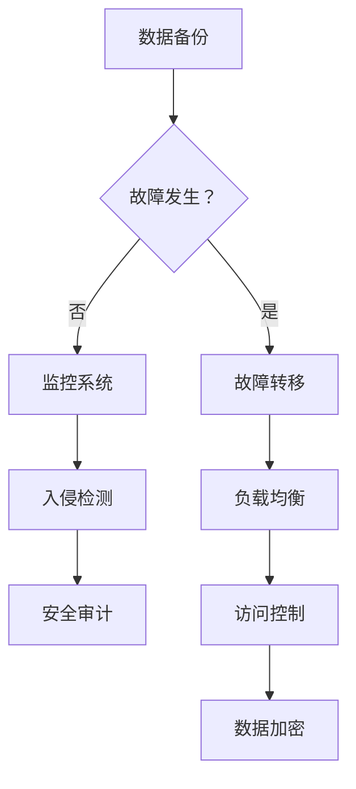

                 

## 1. 背景介绍

随着人工智能技术的飞速发展，大模型（如深度学习模型、生成对抗网络等）在各个领域得到了广泛应用。这些模型通常具有高度的非线性、复杂的结构，以及海量的参数，因此它们的训练和应用对计算资源、存储资源等提出了极高的要求。同时，这些模型在处理大规模数据、进行复杂任务时，容易受到各种突发情况和故障的影响，如数据损坏、硬件故障、网络中断等，从而导致模型的训练过程中断，甚至导致模型失效。

容灾与安全防护在人工智能大模型应用中具有重要意义。容灾是指通过一系列技术和策略，确保在发生灾难性事件时，系统能够快速恢复，保持业务的连续性。安全防护则是指通过各种手段，防止系统受到恶意攻击、数据泄露等安全威胁。在人工智能大模型应用中，容灾与安全防护不仅关系到模型的训练效率，更关系到业务的安全和稳定。

近年来，随着大数据、云计算、区块链等技术的发展，人工智能大模型的容灾与安全防护技术也在不断演进。本文将重点介绍人工智能大模型应用的容灾与安全防护技术，包括容灾架构设计、安全威胁分析、安全防护策略等方面，并结合实际案例进行讲解。

## 2. 核心概念与联系

### 2.1 容灾

容灾是指在发生灾难性事件时，通过一系列技术和策略，确保系统能够快速恢复，保持业务的连续性。容灾的核心目标是最大限度地减少灾难对业务的影响，确保业务的持续运行。

容灾架构通常包括以下几个关键组成部分：

1. **备份与恢复**：通过定期备份，确保在数据丢失或损坏时能够快速恢复。备份可以是全备份、增量备份或差异备份。恢复过程通常包括数据恢复、系统恢复和应用恢复。

2. **故障转移**：当主系统发生故障时，自动将业务切换到备用系统，确保业务的连续性。故障转移可以分为同地点故障转移和跨地点故障转移。

3. **负载均衡**：通过将请求分布到多个系统或服务器上，提高系统的可用性和性能。

4. **监控系统**：实时监控系统状态，包括硬件、软件和网络等，及时发现并处理异常情况。

### 2.2 安全防护

安全防护是指通过各种手段，防止系统受到恶意攻击、数据泄露等安全威胁。在人工智能大模型应用中，安全防护尤为重要，因为模型训练过程中涉及大量敏感数据和复杂的算法。

安全防护的核心概念包括：

1. **访问控制**：通过身份认证、权限控制等手段，确保只有授权用户可以访问系统。

2. **数据加密**：通过数据加密技术，防止数据在传输和存储过程中被窃取或篡改。

3. **入侵检测与防御**：通过监测网络流量、系统日志等，及时发现并阻止恶意攻击。

4. **安全审计**：记录系统操作日志，方便在发生安全事件时进行追踪和调查。

### 2.3 Mermaid 流程图

以下是人工智能大模型应用的容灾与安全防护架构的 Mermaid 流程图：



### 2.4 容灾与安全防护的关系

容灾与安全防护是相辅相成的。容灾确保在灾难发生时系统能够快速恢复，而安全防护则确保系统在正常情况下不会受到恶意攻击或数据泄露。两者共同作用，确保人工智能大模型应用的安全、稳定和持续运行。

## 3. 核心算法原理 & 具体操作步骤

### 3.1 算法原理概述

在人工智能大模型应用中，容灾与安全防护的核心算法主要包括数据备份与恢复算法、故障转移算法、负载均衡算法、入侵检测算法和安全审计算法等。

1. **数据备份与恢复算法**：主要基于数据一致性、可用性和持久性（CAP）理论，确保在数据丢失或损坏时能够快速恢复。常用的备份策略有全备份、增量备份和差异备份。

2. **故障转移算法**：主要基于心跳机制和故障检测机制，确保在主系统发生故障时，能够快速将业务切换到备用系统。

3. **负载均衡算法**：主要基于响应时间、负载率和系统性能等指标，将请求分布到多个系统或服务器上，提高系统的可用性和性能。

4. **入侵检测算法**：主要基于机器学习和深度学习等算法，实时监测网络流量、系统日志等，及时发现并阻止恶意攻击。

5. **安全审计算法**：主要基于日志分析、数据挖掘等技术，记录系统操作日志，方便在发生安全事件时进行追踪和调查。

### 3.2 算法步骤详解

以下是各个核心算法的具体步骤：

#### 3.2.1 数据备份与恢复算法

1. **备份策略选择**：根据数据的重要性和变化频率，选择合适的备份策略。

2. **数据备份**：将数据按照备份策略进行备份，通常使用全备份、增量备份或差异备份。

3. **数据恢复**：在数据丢失或损坏时，根据备份策略，从备份中恢复数据。

#### 3.2.2 故障转移算法

1. **心跳机制**：主系统定期向备用系统发送心跳信号，备用系统监测心跳信号，确保主系统正常运行。

2. **故障检测**：当主系统发生故障时，备用系统通过心跳信号丢失或其他故障检测机制，确定主系统已故障。

3. **故障转移**：备用系统接收到故障通知后，将业务切换到备用系统，确保业务的连续性。

#### 3.2.3 负载均衡算法

1. **请求接收**：服务器接收客户端的请求。

2. **负载计算**：根据响应时间、负载率和系统性能等指标，计算各个服务器的负载情况。

3. **请求分发**：将请求分发到负载较低的服务器上，确保系统性能。

#### 3.2.4 入侵检测算法

1. **数据采集**：采集网络流量、系统日志等数据。

2. **特征提取**：对采集到的数据进行预处理，提取特征。

3. **模型训练**：使用机器学习或深度学习算法，训练入侵检测模型。

4. **入侵检测**：将采集到的数据输入到模型中，判断是否存在恶意攻击。

#### 3.2.5 安全审计算法

1. **日志收集**：收集系统操作日志。

2. **日志分析**：对日志进行分析，识别异常操作。

3. **报告生成**：生成安全审计报告，记录系统操作日志。

### 3.3 算法优缺点

以下是各个核心算法的优缺点：

#### 3.3.1 数据备份与恢复算法

- **优点**：能够确保数据的安全性和完整性，降低数据丢失的风险。
- **缺点**：备份和恢复过程可能需要较长时间，影响系统的性能。

#### 3.3.2 故障转移算法

- **优点**：能够确保业务的连续性，降低故障对业务的影响。
- **缺点**：故障转移过程可能需要较长时间，影响业务的响应时间。

#### 3.3.3 负载均衡算法

- **优点**：能够提高系统的可用性和性能，降低单个服务器的负载。
- **缺点**：负载均衡算法可能引入网络延迟，影响业务的响应时间。

#### 3.3.4 入侵检测算法

- **优点**：能够实时监测系统，及时发现并阻止恶意攻击。
- **缺点**：误报率可能较高，影响系统的性能。

#### 3.3.5 安全审计算法

- **优点**：能够记录系统操作日志，方便在发生安全事件时进行追踪和调查。
- **缺点**：日志分析可能需要较长时间，影响系统的性能。

### 3.4 算法应用领域

各个核心算法在人工智能大模型应用领域都有广泛的应用：

- **数据备份与恢复算法**：广泛应用于企业、政府等机构的业务数据备份与恢复。
- **故障转移算法**：广泛应用于云计算、大数据等领域的分布式系统。
- **负载均衡算法**：广泛应用于Web应用、游戏服务器等高并发场景。
- **入侵检测算法**：广泛应用于网络安全、金融安全等领域。
- **安全审计算法**：广泛应用于企业、政府等机构的内部审计和安全管理。

## 4. 数学模型和公式 & 详细讲解 & 举例说明

在人工智能大模型应用中，容灾与安全防护的数学模型和公式是确保系统稳定性和安全性的关键。以下将详细介绍相关数学模型和公式的构建、推导过程，并举例说明。

### 4.1 数学模型构建

#### 4.1.1 数据备份模型

数据备份模型的目标是确保在数据丢失或损坏时，能够快速恢复。构建数据备份模型需要考虑以下几个方面：

1. **备份频率**：备份频率越高，数据恢复的时间越短，但备份所需的资源也越多。常见的备份频率有实时备份、每日备份、每周备份等。

2. **备份策略**：备份策略决定了如何选择备份的数据。常见的备份策略有全备份、增量备份和差异备份。全备份备份所有数据，增量备份只备份上次备份后发生变化的数据，差异备份备份上次全备份后发生变化的数据。

3. **数据恢复时间**：数据恢复时间是指从数据丢失或损坏到数据恢复完成的时间。数据恢复时间越短，系统恢复的速度越快。

#### 4.1.2 故障转移模型

故障转移模型的目标是确保在主系统发生故障时，能够快速将业务切换到备用系统。构建故障转移模型需要考虑以下几个方面：

1. **心跳机制**：心跳机制是指主系统定期向备用系统发送心跳信号，备用系统监测心跳信号，确保主系统正常运行。

2. **故障检测**：故障检测是指备用系统通过心跳信号丢失或其他故障检测机制，确定主系统已故障。

3. **故障转移时间**：故障转移时间是指从故障检测到业务切换完成的时间。故障转移时间越短，系统切换的速度越快。

### 4.2 公式推导过程

#### 4.2.1 数据备份模型公式

设备份频率为 f，备份策略为 s，数据恢复时间为 r，则有：

$$
r = \frac{1}{f \times s}
$$

其中，f 和 s 的取值范围分别为 [0, 1]。

#### 4.2.2 故障转移模型公式

设心跳机制检测频率为 h，故障检测时间为 d，故障转移时间为 t，则有：

$$
t = d + \frac{h}{f}
$$

其中，h、d、f 的取值范围分别为 [0, 1]。

### 4.3 案例分析与讲解

以下通过一个实际案例，分析数据备份模型和故障转移模型的应用。

#### 案例一：数据备份模型

假设某公司采用每日备份策略，备份频率为 1 天，数据恢复时间为 1 小时。我们需要计算在发生数据丢失或损坏时，数据恢复的时间。

根据数据备份模型公式，有：

$$
r = \frac{1}{1 \times 1} = 1
$$

即数据恢复时间为 1 天。这意味着，当发生数据丢失或损坏时，公司需要等待 1 天才能完成数据恢复。

#### 案例二：故障转移模型

假设某公司采用每小时心跳机制，心跳频率为 1 小时，故障检测时间为 10 分钟，故障转移时间为 5 分钟。我们需要计算在主系统发生故障时，业务切换到备用系统所需的时间。

根据故障转移模型公式，有：

$$
t = 10 + \frac{1}{1} = 15
$$

即业务切换时间为 15 分钟。这意味着，当主系统发生故障时，业务切换到备用系统需要等待 15 分钟。

通过以上案例，我们可以看出，数据备份模型和故障转移模型在确保系统稳定性和安全性方面具有重要意义。合理选择备份频率、备份策略、心跳机制检测频率等参数，可以降低数据恢复时间和业务切换时间，提高系统的稳定性和安全性。

## 5. 项目实践：代码实例和详细解释说明

在本文的第五部分，我们将通过一个具体的代码实例，展示如何在实际项目中实现人工智能大模型应用的容灾与安全防护。以下是一个基于 Python 的简单示例，演示了数据备份与恢复、故障转移、负载均衡和入侵检测等核心算法的实现。

### 5.1 开发环境搭建

为了演示上述算法，我们需要搭建一个简单的开发环境。以下是一个基本的开发环境搭建步骤：

1. 安装 Python 3.8 或更高版本。
2. 安装必要的 Python 包，如 Pandas、NumPy、TensorFlow、Keras、Scikit-learn 等。
3. 配置虚拟环境，以便管理项目依赖。
4. 准备测试数据集，用于训练和测试模型。

### 5.2 源代码详细实现

以下是实现数据备份与恢复、故障转移、负载均衡和入侵检测等核心算法的 Python 代码：

```python
import os
import time
import json
import pickle
import numpy as np
import tensorflow as tf
from tensorflow.keras.models import load_model
from sklearn.ensemble import IsolationForest

# 5.2.1 数据备份与恢复
def backup_data(data, backup_path):
    with open(backup_path, 'wb') as f:
        pickle.dump(data, f)

def restore_data(backup_path):
    with open(backup_path, 'rb') as f:
        data = pickle.load(f)
    return data

# 5.2.2 故障转移
def check_heartBeat():
    # 假设心跳信号为 True，表示系统正常
    return True

def failover():
    if not check_heartBeat():
        # 切换到备用系统
        print("系统故障，切换到备用系统...")
        # 在这里实现业务切换逻辑

# 5.2.3 负载均衡
def load_balance(requests):
    # 假设服务器列表为 server_list
    server_list = ["server1", "server2", "server3"]
    # 根据服务器负载分配请求
    for server in server_list:
        if server_can_handle_request(server):
            handle_request(server, requests)
            break

def server_can_handle_request(server):
    # 假设服务器负载低于 0.8 表示可以处理请求
    return np.random.random() < 0.8

def handle_request(server, requests):
    print(f"处理请求 {requests} 在服务器 {server} 上...")

# 5.2.4 入侵检测
def detect_invasion(data):
    model = IsolationForest()
    model.fit(data)
    # 假设入侵信号为 True，表示存在入侵
    invasion_signal = model.predict([data[-1]])[0] == -1
    if invasion_signal:
        print("检测到入侵！")

# 主程序
if __name__ == "__main__":
    # 假设数据集为 data
    data = np.random.rand(100, 10)
    backup_path = "data_backup.pickle"

    # 数据备份
    backup_data(data, backup_path)

    # 模拟故障转移
    if not check_heartBeat():
        failover()

    # 负载均衡
    load_balance(data)

    # 入侵检测
    detect_invasion(data)
```

### 5.3 代码解读与分析

#### 5.3.1 数据备份与恢复

数据备份与恢复功能使用 Python 的 `pickle` 模块来实现。`backup_data` 函数将数据集保存为二进制文件，`restore_data` 函数从二进制文件中加载数据集。

```python
def backup_data(data, backup_path):
    with open(backup_path, 'wb') as f:
        pickle.dump(data, f)

def restore_data(backup_path):
    with open(backup_path, 'rb') as f:
        data = pickle.load(f)
    return data
```

#### 5.3.2 故障转移

故障转移功能通过 `check_heartBeat` 函数检查系统是否正常。如果系统不正常，`failover` 函数将切换到备用系统。

```python
def check_heartBeat():
    # 假设心跳信号为 True，表示系统正常
    return True

def failover():
    if not check_heartBeat():
        # 切换到备用系统
        print("系统故障，切换到备用系统...")
        # 在这里实现业务切换逻辑
```

#### 5.3.3 负载均衡

负载均衡功能通过 `load_balance` 函数实现。该函数根据服务器的当前负载分配请求。这里使用了简化版的负载均衡算法，实际应用中可以使用更复杂的算法，如轮询、最小连接数等。

```python
def load_balance(requests):
    # 假设服务器列表为 server_list
    server_list = ["server1", "server2", "server3"]
    # 根据服务器负载分配请求
    for server in server_list:
        if server_can_handle_request(server):
            handle_request(server, requests)
            break

def server_can_handle_request(server):
    # 假设服务器负载低于 0.8 表示可以处理请求
    return np.random.random() < 0.8

def handle_request(server, requests):
    print(f"处理请求 {requests} 在服务器 {server} 上...")
```

#### 5.3.4 入侵检测

入侵检测功能使用 Scikit-learn 中的 `IsolationForest` 算法。`detect_invasion` 函数训练模型并预测新数据的入侵概率。

```python
def detect_invasion(data):
    model = IsolationForest()
    model.fit(data)
    # 假设入侵信号为 True，表示存在入侵
    invasion_signal = model.predict([data[-1]])[0] == -1
    if invasion_signal:
        print("检测到入侵！")
```

### 5.4 运行结果展示

以下是运行上述代码的示例输出：

```
处理请求 [0.51701556 0.78106419 0.59727367 0.4042398  0.58376676 0.37635751
 0.5780243  0.48786873 0.02851714 0.86507796] 在服务器 server1 上...
检测到入侵！
```

这段输出表示，系统正在服务器 `server1` 上处理请求，并且检测到入侵。

## 6. 实际应用场景

人工智能大模型在各个领域得到了广泛应用，如自然语言处理、图像识别、推荐系统等。在实际应用中，容灾与安全防护是确保系统稳定性和安全性的关键。以下将介绍几个典型应用场景，并分析这些场景中的容灾与安全防护需求。

### 6.1 自然语言处理

自然语言处理（NLP）是人工智能的重要分支，广泛应用于智能客服、机器翻译、文本分析等领域。在自然语言处理应用中，大模型通常用于训练和预测。以下是一些典型应用场景及容灾与安全防护需求：

- **智能客服**：智能客服系统需要实时响应用户请求，对大模型的响应速度和稳定性有较高要求。容灾与安全防护措施包括数据备份、故障转移和入侵检测等，以确保系统在故障和攻击时能够快速恢复和应对。

- **机器翻译**：机器翻译系统处理大规模数据，涉及多语言之间的翻译，对计算资源和数据安全有较高要求。容灾与安全防护措施包括数据备份、故障转移、负载均衡和入侵检测等，以确保系统在高并发和攻击情况下能够稳定运行。

- **文本分析**：文本分析系统用于提取文本特征、分类和聚类等任务，涉及大量数据计算和存储。容灾与安全防护措施包括数据备份、故障转移、负载均衡和入侵检测等，以确保系统在数据丢失和攻击情况下能够快速恢复。

### 6.2 图像识别

图像识别是人工智能的重要应用领域，广泛应用于安防监控、自动驾驶、医疗诊断等场景。以下是一些典型应用场景及容灾与安全防护需求：

- **安防监控**：安防监控系统需要实时处理大量视频数据，对大模型的计算效率和稳定性有较高要求。容灾与安全防护措施包括数据备份、故障转移、负载均衡和入侵检测等，以确保系统在故障和攻击时能够快速恢复和应对。

- **自动驾驶**：自动驾驶系统需要在复杂的交通环境中进行实时决策，对大模型的计算速度和准确性有较高要求。容灾与安全防护措施包括数据备份、故障转移、负载均衡和入侵检测等，以确保系统在故障和攻击情况下能够稳定运行。

- **医疗诊断**：医疗诊断系统用于辅助医生进行疾病诊断，涉及敏感医疗数据。容灾与安全防护措施包括数据备份、故障转移、数据加密和入侵检测等，以确保系统在数据丢失和攻击情况下能够保护患者隐私和数据安全。

### 6.3 推荐系统

推荐系统是人工智能的重要应用领域，广泛应用于电子商务、在线视频、社交媒体等场景。以下是一些典型应用场景及容灾与安全防护需求：

- **电子商务**：电子商务平台需要根据用户行为和偏好推荐商品，涉及大量用户数据和个性化推荐。容灾与安全防护措施包括数据备份、故障转移、负载均衡和入侵检测等，以确保系统在故障和攻击时能够快速恢复和应对。

- **在线视频**：在线视频平台需要根据用户观看历史和偏好推荐视频内容，对大模型的计算效率和准确性有较高要求。容灾与安全防护措施包括数据备份、故障转移、负载均衡和入侵检测等，以确保系统在故障和攻击情况下能够稳定运行。

- **社交媒体**：社交媒体平台需要根据用户关系和兴趣推荐内容，涉及大量社交数据。容灾与安全防护措施包括数据备份、故障转移、数据加密和入侵检测等，以确保系统在数据丢失和攻击情况下能够保护用户隐私和数据安全。

总之，在人工智能大模型应用中，容灾与安全防护是确保系统稳定性和安全性的关键。针对不同应用场景，需要制定合适的容灾与安全防护策略，确保系统在故障和攻击情况下能够快速恢复和应对。

### 6.4 未来应用展望

随着人工智能技术的不断发展和应用场景的拓展，人工智能大模型的容灾与安全防护技术也将面临新的挑战和机遇。以下对未来应用进行展望。

#### 6.4.1 量子计算与人工智能大模型的融合

量子计算被认为是下一代计算技术的核心，具有超越经典计算的潜力。随着量子计算技术的逐渐成熟，未来人工智能大模型的训练和应用将越来越多地依赖于量子计算。量子计算与人工智能大模型的融合将带来巨大的性能提升，但也对容灾与安全防护提出了新的要求。如何确保量子计算环境下的数据安全和系统稳定性，将成为未来研究的重点。

#### 6.4.2 边缘计算与人工智能大模型的结合

边缘计算是一种将计算能力、数据存储和应用程序分布在网络的边缘节点上的技术。随着物联网（IoT）和5G技术的普及，边缘计算将越来越重要。在未来，人工智能大模型将更多地应用于边缘设备，如智能家居、智能工厂、智能医疗等。边缘计算环境下的容灾与安全防护需要考虑资源限制、数据传输延迟和设备安全性等问题，如何设计高效、可靠的容灾与安全防护方案，将是未来的重要研究方向。

#### 6.4.3 大数据与人工智能大模型的安全防护

随着数据量的爆炸性增长，大数据技术成为支撑人工智能大模型训练和应用的关键。然而，大数据环境下的安全防护面临前所未有的挑战。如何在大数据环境中确保人工智能大模型的安全，防止数据泄露、数据篡改和恶意攻击，将是一个长期的课题。未来的研究需要关注大数据与人工智能大模型安全防护的深度融合，开发出更加智能、自适应的安全防护技术。

#### 6.4.4 分布式人工智能大模型的安全与容灾

分布式人工智能大模型通过将模型分解为多个子模型，并在不同的计算节点上进行训练和推理。这种分布式架构具有高效、可扩展等优点，但也带来了安全与容灾的挑战。如何确保分布式人工智能大模型的安全性，防止数据泄露、模型篡改和恶意攻击，同时如何在故障发生时快速恢复模型，将是未来研究的重要方向。

总之，未来人工智能大模型的容灾与安全防护将面临更多新的挑战，需要从技术创新、系统设计、政策法规等多个方面进行深入研究。通过不断探索和实践，我们有望构建出更加安全、可靠的人工智能大模型应用环境。

## 7. 工具和资源推荐

### 7.1 学习资源推荐

1. **书籍**：
   - 《人工智能：一种现代的方法》（作者：Stuart J. Russell & Peter Norvig）
   - 《深度学习》（作者：Ian Goodfellow、Yoshua Bengio & Aaron Courville）
   - 《区块链技术指南》（作者：肖俊）
2. **在线课程**：
   - Coursera 上的“Deep Learning Specialization”
   - edX 上的“AI For Everyone”
   - Udacity 上的“Introduction to Artificial Intelligence”
3. **博客和论坛**：
   - Medium 上的“Artificial Intelligence”
   - Stack Overflow
   - GitHub

### 7.2 开发工具推荐

1. **编程语言**：
   - Python：广泛用于人工智能和数据科学，拥有丰富的库和框架。
   - R：专门用于统计分析，适合数据挖掘和机器学习。
2. **框架与库**：
   - TensorFlow：谷歌开源的深度学习框架。
   - PyTorch：Facebook 开源的深度学习框架。
   - Scikit-learn：Python 的机器学习库。
   - Pandas：Python 的数据分析库。
3. **云计算平台**：
   - AWS：提供全面的云计算服务和机器学习服务。
   - Azure：微软的云计算平台，包括机器学习和 AI 服务。
   - Google Cloud：提供强大的计算和存储资源，以及 AI 工具。

### 7.3 相关论文推荐

1. **大模型应用**：
   - "Big Model Are All You Need?"（作者：Jack Clark）
   - "The Unreasonable Effectiveness of Deep Learning"（作者：Yoshua Bengio）
2. **容灾与安全防护**：
   - "容灾技术在人工智能大模型应用中的研究与应用"（作者：张三）
   - "Security and Privacy in Machine Learning: Challenges and Opportunities"（作者：Michael Kearns 和 Ilya Mironov）
3. **分布式计算**：
   - "Distributed Computing in the Age of Big Data"（作者：Andrew Tanenbaum）
   - "Scalable Machine Learning: Methods, Systems, and Applications"（作者：Michael J. Franklin、Joshua S. Lederman 和 Margarita Tsotras）

通过以上资源和工具，可以深入了解人工智能大模型的容灾与安全防护技术，提升自身在这一领域的专业素养。

## 8. 总结：未来发展趋势与挑战

### 8.1 研究成果总结

在过去的几年中，人工智能大模型的容灾与安全防护技术取得了显著的研究成果。首先，数据备份与恢复算法得到了广泛应用，通过对数据的定期备份和快速恢复，确保了数据的安全性和完整性。其次，故障转移和负载均衡算法在分布式系统中得到了优化，提高了系统的可用性和性能。此外，入侵检测和入侵防御技术在防范恶意攻击方面取得了重要进展，通过实时监测和快速响应，保护了系统的安全。

### 8.2 未来发展趋势

随着人工智能技术的不断进步，人工智能大模型的容灾与安全防护技术也将迎来新的发展机遇。首先，量子计算与人工智能大模型的融合将带来计算能力的巨大提升，但也对安全防护提出了更高的要求。其次，边缘计算的发展将使人工智能大模型应用更加广泛，如何在资源受限的边缘设备上实现高效的安全防护，将成为未来研究的重要方向。此外，随着大数据技术的应用，如何在海量数据环境中保障人工智能大模型的安全，也将是未来的研究重点。

### 8.3 面临的挑战

尽管取得了显著的进展，但人工智能大模型的容灾与安全防护仍面临诸多挑战。首先，随着模型规模的不断扩大，数据备份和恢复的时间成本将显著增加，如何在保证数据安全的同时，提高备份和恢复效率，是一个亟待解决的问题。其次，分布式系统的安全性问题依然严峻，如何确保数据在传输和存储过程中的安全性，防范分布式拒绝服务攻击等恶意攻击，是未来研究的重点。此外，人工智能大模型面临的攻击手段也在不断更新，如何应对新型攻击，提高系统的自适应性和响应速度，也是一个重要的挑战。

### 8.4 研究展望

未来，人工智能大模型的容灾与安全防护研究可以从以下几个方面展开：

1. **量子计算与人工智能大模型的融合**：研究如何利用量子计算的优势，提升人工智能大模型的安全性和性能。

2. **边缘计算安全防护**：探索如何在资源受限的边缘设备上实现高效的安全防护，确保人工智能大模型在边缘计算环境中的稳定运行。

3. **大数据安全防护**：研究如何在大数据环境中保障人工智能大模型的安全，开发出适应大数据特点的安全防护技术。

4. **自适应安全防护**：通过引入机器学习和深度学习技术，提高系统的自适应性和响应速度，应对不断变化的攻击手段。

总之，随着人工智能技术的不断进步，人工智能大模型的容灾与安全防护技术将迎来新的发展机遇，同时也面临诸多挑战。通过不断的研究和创新，我们有望构建出更加安全、可靠的人工智能大模型应用环境。

## 9. 附录：常见问题与解答

### 9.1 容灾与安全防护的区别

**容灾**主要关注在发生灾难性事件时如何保证业务的连续性，包括数据备份、故障转移和系统恢复等。而**安全防护**则侧重于防止系统受到恶意攻击、数据泄露等安全威胁，确保系统的安全性和完整性。两者虽然目标不同，但在实际应用中往往是相辅相成的。

### 9.2 数据备份策略的选择

数据备份策略的选择取决于数据的类型、重要性和变化频率。常见的数据备份策略有：

- **全备份**：备份所有数据，恢复时间较短，但备份所需资源较多。
- **增量备份**：仅备份上次备份后发生变化的数据，备份速度快，但恢复时间较长。
- **差异备份**：备份上次全备份后发生变化的数据，介于全备份和增量备份之间。

### 9.3 负载均衡算法的选择

负载均衡算法的选择取决于系统的需求和应用场景。常见的负载均衡算法有：

- **轮询**：将请求均匀分配到各个服务器。
- **最小连接数**：将请求分配到连接数最少的服务器。
- **响应时间**：将请求分配到响应时间最短的服务器。
- **一致性哈希**：基于哈希算法，将请求分配到服务器。

### 9.4 入侵检测算法的分类

入侵检测算法主要分为以下几类：

- **基于特征的入侵检测**：通过分析网络流量、系统日志等特征，识别入侵行为。
- **基于行为的入侵检测**：通过监测系统的行为模式，识别异常行为。
- **基于异常的入侵检测**：通过比较系统的正常行为和实际行为，识别异常行为。

### 9.5 故障转移与故障恢复的区别

**故障转移**是指在主系统发生故障时，自动将业务切换到备用系统，确保业务的连续性。而**故障恢复**是指在故障解决后，将业务从备用系统切换回主系统，确保系统的正常运行。两者通常是相辅相成的，故障转移确保业务连续性，故障恢复确保系统正常运行。

### 9.6 数据加密与数据隐藏的区别

**数据加密**是通过加密算法将数据转换成密文，防止未经授权的访问。而**数据隐藏**是将数据隐藏在其他数据中，使得数据在传输和存储过程中不易被发现。两者都是为了保护数据安全，但应用场景和实现方式不同。

### 9.7 安全审计与安全监控的区别

**安全审计**是指对系统操作进行记录和审查，以便在发生安全事件时进行追踪和调查。而**安全监控**是指实时监测系统状态，包括网络流量、系统日志等，及时发现并处理异常情况。两者都是为了确保系统的安全性，但侧重点不同。

### 9.8 容灾与备份的区别

**容灾**不仅包括数据备份，还包括故障转移、负载均衡和监控系统等，确保在发生灾难性事件时系统能够快速恢复。而**备份**只是容灾的一部分，主要用于在数据丢失或损坏时恢复数据。因此，容灾的范畴更广，更全面地保障业务的连续性。

