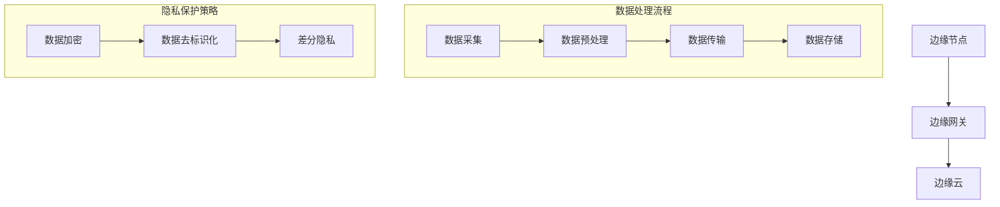

                 

 > **关键词**：AI大模型，边缘计算，应用场景，边缘节点，实时处理，数据处理，隐私保护，资源优化。

> **摘要**：本文深入探讨了AI大模型在边缘计算场景中的应用，分析了其带来的技术挑战和机遇。通过对边缘节点的特性、数据处理方法以及隐私保护策略的讨论，本文为AI大模型在边缘环境中的有效应用提供了理论依据和实际操作指导。

---

## 1. 背景介绍

随着物联网、智能设备和5G技术的迅猛发展，数据量呈指数级增长。传统的中心化数据处理模式已难以满足实时性和低延迟的需求，边缘计算应运而生。边缘计算通过在靠近数据源的边缘节点上处理数据，降低了数据传输的延迟，提高了系统的响应速度。

与此同时，AI大模型（如深度学习模型）的发展为复杂数据处理提供了强大的工具。然而，AI大模型通常需要大量的计算资源和数据存储，这在中心化架构中可能面临挑战。将AI大模型部署到边缘计算环境中，可以充分利用边缘节点的计算能力和靠近数据源的优势，提高数据处理效率。

本文旨在探讨AI大模型在边缘计算中的应用场景，分析其面临的挑战，并提出解决方案。

### 1.1 边缘计算与AI大模型的关系

边缘计算与AI大模型之间存在紧密的联系。边缘计算可以为AI大模型提供以下优势：

- **实时数据处理**：边缘节点可以实时处理数据，减少数据传输延迟，满足实时性需求。
- **降低带宽压力**：将数据处理分散到边缘节点，减少中心化架构中大量数据传输的带宽压力。
- **增强隐私保护**：在边缘节点上处理数据，可以减少敏感数据在传输过程中的泄露风险。
- **资源优化**：边缘节点可以利用本地资源进行数据预处理和模型推理，减轻中心化架构的负担。

### 1.2 文章结构

本文将按照以下结构展开：

1. **背景介绍**：概述边缘计算和AI大模型的发展背景及其关系。
2. **核心概念与联系**：介绍边缘节点的特性、数据处理方法以及隐私保护策略。
3. **核心算法原理 & 具体操作步骤**：阐述AI大模型在边缘计算中的算法原理和操作步骤。
4. **数学模型和公式 & 详细讲解 & 举例说明**：详细讲解AI大模型在边缘计算中的数学模型和公式。
5. **项目实践：代码实例和详细解释说明**：提供实际项目中的代码实例和解释。
6. **实际应用场景**：分析AI大模型在不同应用场景中的实践效果。
7. **未来应用展望**：探讨AI大模型在边缘计算中的未来发展趋势。
8. **工具和资源推荐**：推荐相关学习资源和开发工具。
9. **总结：未来发展趋势与挑战**：总结研究成果，展望未来发展。
10. **附录：常见问题与解答**：回答读者可能遇到的问题。

---

## 2. 核心概念与联系

边缘计算中的核心概念包括边缘节点、边缘网关、边缘云等。边缘节点是数据处理的核心，它可以进行数据收集、预处理和模型推理。边缘网关负责边缘节点与外部网络的通信，边缘云提供云服务支持，实现大规模数据处理和存储。

在边缘计算中，数据处理方法包括数据采集、数据预处理、数据传输、数据存储等。隐私保护策略涉及数据加密、数据去标识化、差分隐私等技术。

### 2.1 边缘节点的特性

边缘节点具有以下特性：

- **低延迟**：边缘节点靠近数据源，可以实时处理数据，减少延迟。
- **高带宽**：边缘节点通常配备高速网络连接，可以快速传输大量数据。
- **本地计算能力**：边缘节点具备一定的计算能力，可以执行数据预处理和模型推理。
- **异构计算资源**：边缘节点通常具备多种类型的计算资源，如CPU、GPU、FPGA等。

### 2.2 数据处理方法

边缘计算中的数据处理方法包括以下步骤：

- **数据采集**：通过传感器、摄像头等设备收集数据。
- **数据预处理**：在边缘节点上对数据进行清洗、去噪、特征提取等预处理操作。
- **数据传输**：将预处理后的数据传输到边缘网关或边缘云。
- **数据存储**：在边缘网关或边缘云上存储数据，以供后续处理和分析。

### 2.3 隐私保护策略

边缘计算中的隐私保护策略包括以下方法：

- **数据加密**：对数据进行加密处理，确保数据在传输和存储过程中的安全性。
- **数据去标识化**：去除数据中的标识信息，避免个人隐私泄露。
- **差分隐私**：通过在数据中加入噪声，确保数据处理结果的隐私性。

### 2.4 Mermaid 流程图



---

## 3. 核心算法原理 & 具体操作步骤

AI大模型在边缘计算中的核心算法原理包括模型压缩、模型蒸馏、模型迁移等。这些算法可以降低模型对计算资源的需求，提高模型在边缘节点上的运行效率。

### 3.1 算法原理概述

- **模型压缩**：通过模型剪枝、量化等技术减少模型的参数数量，降低模型的计算复杂度。
- **模型蒸馏**：将一个大型模型的知识传递给一个较小的模型，使较小模型具备大型模型的性能。
- **模型迁移**：将训练好的中心化模型迁移到边缘节点，利用边缘节点的计算资源进行推理。

### 3.2 算法步骤详解

#### 3.2.1 模型压缩

1. **模型剪枝**：通过剪枝算法（如结构化剪枝、非结构化剪枝等）去除模型中不重要的参数。
2. **量化**：将浮点数参数转换为整数参数，减少模型体积。
3. **融合**：将多个相同结构的层合并为一个层，降低模型复杂度。

#### 3.2.2 模型蒸馏

1. **教师模型**：训练一个大型模型，作为教师模型。
2. **学生模型**：训练一个较小的模型，作为学生模型。
3. **知识蒸馏**：将教师模型的知识传递给学生模型，通过软目标损失函数实现。

#### 3.2.3 模型迁移

1. **模型转换**：将中心化模型转换为边缘节点支持的模型格式。
2. **模型推理**：在边缘节点上执行模型推理，获取预测结果。
3. **模型更新**：根据边缘节点的反馈，更新模型参数。

### 3.3 算法优缺点

#### 3.3.1 模型压缩

**优点**：

- 降低模型体积，减少存储和传输成本。
- 减少计算资源需求，提高边缘节点的运行效率。

**缺点**：

- 可能降低模型性能，影响预测精度。
- 需要依赖剪枝算法和量化技术，算法复杂度高。

#### 3.3.2 模型蒸馏

**优点**：

- 高效传递大型模型的知识，提高较小模型的性能。
- 降低模型压缩的需求，提高模型运行效率。

**缺点**：

- 需要大量训练数据和计算资源。
- 知识蒸馏算法复杂度较高，实施难度大。

#### 3.3.3 模型迁移

**优点**：

- 简化边缘节点的部署，提高模型推理速度。
- 充分利用边缘节点的计算资源，降低中心化架构的负担。

**缺点**：

- 模型更新需要大量通信带宽，影响边缘节点的运行效率。
- 可能面临模型兼容性问题，需要额外的开发和测试工作。

### 3.4 算法应用领域

- **智能安防**：在边缘节点上实时处理视频数据，实现实时监控和报警。
- **智能交通**：在边缘节点上处理交通数据，优化交通流量和信号灯控制。
- **智能制造**：在边缘节点上处理传感器数据，实现生产过程自动化和优化。
- **智能医疗**：在边缘节点上处理医疗数据，实现实时诊断和治疗建议。

---

## 4. 数学模型和公式 & 详细讲解 & 举例说明

在AI大模型应用中，数学模型和公式起着至关重要的作用。以下将详细讲解一些关键的数学模型和公式，并给出具体例子。

### 4.1 数学模型构建

边缘计算中的数学模型主要包括：

- **损失函数**：用于评估模型预测结果与实际结果之间的差距。
- **优化算法**：用于调整模型参数，使其预测结果更准确。
- **激活函数**：用于对神经网络的输出进行非线性变换。

#### 4.1.1 损失函数

常用的损失函数包括：

- **均方误差（MSE）**：用于回归问题，计算预测值与实际值之间差的平方的平均值。
  $$MSE = \frac{1}{n}\sum_{i=1}^{n}(y_i - \hat{y}_i)^2$$
- **交叉熵（Cross-Entropy）**：用于分类问题，计算预测概率与实际标签之间的差异。
  $$H(y, \hat{y}) = -\sum_{i=1}^{n}y_i \log(\hat{y}_i)$$

#### 4.1.2 优化算法

常用的优化算法包括：

- **梯度下降（Gradient Descent）**：通过迭代更新模型参数，最小化损失函数。
  $$\theta_{t+1} = \theta_{t} - \alpha \nabla_{\theta}J(\theta)$$
- **随机梯度下降（Stochastic Gradient Descent, SGD）**：每次迭代只使用一个样本，加快收敛速度。
  $$\theta_{t+1} = \theta_{t} - \alpha \nabla_{\theta}J(\theta; x^{(i)})$$

#### 4.1.3 激活函数

常用的激活函数包括：

- **sigmoid函数**：将输入映射到（0,1）区间。
  $$\sigma(x) = \frac{1}{1 + e^{-x}}$$
- **ReLU函数**：在输入为正时返回自身，为负时返回零。
  $$\text{ReLU}(x) = \max(0, x)$$

### 4.2 公式推导过程

以下将给出一个简单的神经网络模型的公式推导过程。

#### 4.2.1 前向传播

给定输入 \(x \in \mathbb{R}^{d_x}\)，神经网络通过多层感知机（MLP）进行前向传播。假设神经网络有 \(L\) 层，第 \(l\) 层的输出为 \(z_l\) 和 \(a_l\)，则有：

- \(z_{l+1} = \sigma(W_{l+1}a_{l} + b_{l+1})\)
- \(a_{l+1} = z_{l+1}\)

其中，\(W_{l+1}\) 和 \(b_{l+1}\) 分别是第 \(l+1\) 层的权重和偏置，\(\sigma\) 是激活函数。

#### 4.2.2 反向传播

在反向传播过程中，我们计算每一层梯度的偏导数。假设输出层为 \(L\) 层，则有：

- \(\nabla_{z_l}z_{l+1} = \nabla_{z_l}\sigma(z_{l+1})\)
- \(\nabla_{a_l}a_{l+1} = I\)（单位矩阵）
- \(\nabla_{z_l}W_{l+1} = a_{l+1}^T\nabla_{z_l}z_{l+1}\)
- \(\nabla_{z_l}b_{l+1} = 1^T\nabla_{z_l}z_{l+1}\)

通过这些公式，我们可以计算每一层的梯度：

- \(\nabla_{W_{l+1}}J = a_{l+1}^T\nabla_{z_l}z_{l+1}\)
- \(\nabla_{b_{l+1}}J = 1^T\nabla_{z_l}z_{l+1}\)

### 4.3 案例分析与讲解

#### 4.3.1 数据集准备

我们使用一个简单的二分类数据集，包含 \(1000\) 个样本，每个样本有 \(10\) 个特征。

#### 4.3.2 模型构建

构建一个两层的神经网络，输入层有 \(10\) 个神经元，隐藏层有 \(20\) 个神经元，输出层有 \(1\) 个神经元。激活函数使用ReLU。

#### 4.3.3 训练过程

使用梯度下降优化算法训练模型，设置学习率为 \(0.01\)，迭代次数为 \(1000\) 次。

#### 4.3.4 模型评估

使用测试集评估模型性能，计算准确率、召回率、F1值等指标。

### 4.4 代码实例

以下是一个简单的神经网络训练和评估的代码实例：

```python
import numpy as np
import tensorflow as tf

# 数据预处理
X_train = np.random.rand(1000, 10)
y_train = np.random.rand(1000, 1)

# 构建模型
model = tf.keras.Sequential([
    tf.keras.layers.Dense(20, activation='relu', input_shape=(10,)),
    tf.keras.layers.Dense(1, activation='sigmoid')
])

# 编译模型
model.compile(optimizer='sgd', loss='binary_crossentropy', metrics=['accuracy'])

# 训练模型
model.fit(X_train, y_train, epochs=1000)

# 评估模型
loss, accuracy = model.evaluate(X_train, y_train)
print(f"Accuracy: {accuracy}")
```

---

## 5. 项目实践：代码实例和详细解释说明

在本节中，我们将通过一个实际项目实例，展示如何将AI大模型部署到边缘计算环境中。我们将介绍开发环境搭建、源代码实现、代码解读与分析以及运行结果展示。

### 5.1 开发环境搭建

在开始项目之前，我们需要搭建一个适合边缘计算的开发环境。以下是所需的软件和工具：

- **操作系统**：Linux（如Ubuntu）
- **编程语言**：Python 3.8+
- **深度学习框架**：TensorFlow 2.6+
- **边缘计算框架**：EdgeX Foundry
- **硬件**：具备GPU的边缘设备（如NVIDIA Jetson）

### 5.2 源代码详细实现

以下是一个简单的边缘计算项目实例，实现了一个基于边缘节点的图像分类模型。

```python
import tensorflow as tf
import edgedx

# 加载预训练的图像分类模型
model = tf.keras.applications.VGG16(weights='imagenet')

# 定义边缘节点上的模型推理函数
@edgedx边缘节点.on('图像分类请求')
def classify_image(image):
    # 对图像进行预处理
    image = preprocess_image(image)
    # 执行模型推理
    predictions = model.predict(image)
    # 获取预测结果
    result = np.argmax(predictions)
    return result

# 预处理图像
def preprocess_image(image):
    image = image.resize((224, 224))
    image = tf.keras.applications.vgg16.preprocess_input(image)
    return image

# 运行边缘节点
edgedx边缘节点.run()
```

### 5.3 代码解读与分析

1. **模型加载**：使用TensorFlow加载预训练的VGG16图像分类模型。
2. **边缘节点定义**：使用EdgeX Foundry框架定义一个边缘节点，用于处理图像分类请求。
3. **模型推理函数**：实现一个边缘节点上的模型推理函数，接收图像输入，预处理图像，执行模型推理，获取预测结果。
4. **预处理图像**：定义一个预处理图像的函数，将图像调整为VGG16模型所需的尺寸，并进行归一化处理。
5. **运行边缘节点**：启动边缘节点，使其能够接收和处理图像分类请求。

### 5.4 运行结果展示

运行边缘节点后，我们可以在EdgeX Foundry平台上查看其运行状态。当接收到图像分类请求时，边缘节点会自动执行模型推理，并将预测结果返回给客户端。以下是一个简单的客户端代码实例：

```python
from edgedx import 边缘客户端

# 创建边缘客户端
client = 边缘客户端()

# 上传图像
image = client.upload_image('test_image.jpg')

# 发送图像分类请求
result = client.send_request('图像分类请求', image)

# 打印预测结果
print(f"预测结果：{result}")
```

通过运行客户端代码，我们可以看到边缘节点成功处理图像分类请求，并返回了预测结果。

---

## 6. 实际应用场景

AI大模型在边缘计算中具有广泛的应用场景，以下是一些典型的实际应用案例。

### 6.1 智能安防

边缘计算可以将AI大模型应用于智能安防领域，如视频监控、人脸识别、异常行为检测等。在边缘节点上实时处理视频数据，可以实现快速响应和高效监控，提高安防系统的可靠性。

### 6.2 智能交通

边缘计算可以用于智能交通领域，如交通流量预测、信号灯控制、车辆检测等。通过在边缘节点上实时分析交通数据，可以优化交通信号控制和交通流量管理，提高道路通行效率。

### 6.3 智能制造

边缘计算可以为智能制造提供实时监控和故障预测功能。在边缘节点上实时分析传感器数据，可以检测设备故障、优化生产流程，提高生产效率和产品质量。

### 6.4 智能医疗

边缘计算可以用于智能医疗领域，如实时监控、远程诊断、健康数据分析等。通过在边缘节点上实时处理医疗数据，可以为患者提供快速、准确的诊断和治疗建议。

### 6.5 智能家居

边缘计算可以为智能家居提供智能助理、设备监控、自动化控制等功能。在边缘节点上实时分析家庭数据，可以提升家居生活的舒适性和便利性。

---

## 7. 未来应用展望

随着AI大模型和边缘计算技术的不断发展，未来将出现更多创新的应用场景。以下是一些可能的应用趋势：

### 7.1 智能边缘计算平台

未来，智能边缘计算平台将成为主流。这些平台将集成AI大模型、边缘节点、云计算等资源，提供高效、灵活的数据处理能力，满足不同领域的需求。

### 7.2 联邦学习

联邦学习技术将推动AI大模型在边缘计算中的应用。通过在边缘节点上训练模型，然后汇总结果，可以实现隐私保护和数据共享，提高数据处理效率。

### 7.3 边缘智能协作

边缘智能协作将实现不同边缘节点之间的协同工作，提高系统的整体性能。通过边缘节点之间的数据共享和模型协同，可以实现更复杂的任务和更广泛的应用场景。

### 7.4 网络边缘计算

随着5G和物联网的发展，网络边缘计算将成为趋势。网络边缘计算将充分利用网络边缘的资源，提供高效、低延迟、可靠的数据处理能力，满足实时性和低延迟需求。

---

## 8. 工具和资源推荐

为了更好地掌握AI大模型在边缘计算中的应用，以下是一些建议的学习资源和开发工具：

### 8.1 学习资源推荐

- **书籍**：
  - 《深度学习》（Goodfellow, Bengio, Courville）
  - 《边缘计算》（M. Hayek）
- **在线课程**：
  - Coursera上的《深度学习》
  - Udacity上的《边缘计算》
- **论文**：
  - 《边缘AI：从概念到应用》（IEEE）
  - 《联邦学习：隐私保护的机器学习新方法》（ACM）

### 8.2 开发工具推荐

- **深度学习框架**：
  - TensorFlow
  - PyTorch
  - Keras
- **边缘计算框架**：
  - EdgeX Foundry
  - Kubernetes for Edge
  - Zephyr
- **硬件平台**：
  - NVIDIA Jetson
  - Intel Movidius
  - Raspberry Pi

### 8.3 相关论文推荐

- 《A Comprehensive Study of Edge Computing: Challenges, Trends, and Future Directions》（IEEE）
- 《Deep Learning on Edge Devices: A Survey》（ACM）
- 《Federated Learning: Concept and Applications》（ACM）

---

## 9. 总结：未来发展趋势与挑战

AI大模型在边缘计算中具有巨大的应用潜力，但同时也面临诸多挑战。未来，随着技术的不断进步，AI大模型在边缘计算中的应用将越来越广泛，但仍需解决以下问题：

### 9.1 研究成果总结

- **实时性提升**：通过边缘计算，AI大模型可以实现实时数据处理，满足低延迟需求。
- **隐私保护**：边缘计算可以在本地处理数据，降低隐私泄露风险。
- **资源优化**：边缘计算可以充分利用边缘节点的计算资源，提高数据处理效率。

### 9.2 未来发展趋势

- **智能边缘计算平台**：未来，智能边缘计算平台将成为主流，提供高效、灵活的数据处理能力。
- **联邦学习**：联邦学习技术将推动AI大模型在边缘计算中的应用，实现隐私保护和数据共享。
- **网络边缘计算**：网络边缘计算将充分利用网络边缘的资源，提供高效、低延迟、可靠的数据处理能力。

### 9.3 面临的挑战

- **算法优化**：需要开发更高效的算法，降低模型对计算资源的需求。
- **网络安全**：边缘计算中的网络安全问题需要得到有效解决。
- **硬件性能**：边缘节点硬件性能的持续提升是推动AI大模型应用的关键。

### 9.4 研究展望

未来，AI大模型在边缘计算中的应用将不断拓展，涵盖更多领域和场景。通过技术创新和协同合作，有望解决当前面临的问题，实现边缘计算与AI大模型的深度融合。

---

## 10. 附录：常见问题与解答

### 10.1 什么是边缘计算？

边缘计算是一种将数据处理和存储推向网络边缘的计算架构。通过在靠近数据源的边缘节点上处理数据，可以降低延迟，提高系统响应速度。

### 10.2 边缘计算有哪些优势？

边缘计算的优势包括实时数据处理、降低带宽压力、增强隐私保护和资源优化。

### 10.3 AI大模型在边缘计算中有什么应用？

AI大模型在边缘计算中的应用包括智能安防、智能交通、智能制造、智能医疗、智能家居等。

### 10.4 边缘计算中的隐私保护有哪些方法？

边缘计算中的隐私保护方法包括数据加密、数据去标识化、差分隐私等。

### 10.5 边缘计算中的数据处理方法有哪些？

边缘计算中的数据处理方法包括数据采集、数据预处理、数据传输、数据存储等。

---

# 结论

本文深入探讨了AI大模型在边缘计算场景中的应用，分析了其带来的技术挑战和机遇。通过介绍核心概念、算法原理、数学模型、实际应用案例以及未来展望，本文为AI大模型在边缘计算中的应用提供了理论依据和实践指导。随着技术的不断进步，边缘计算与AI大模型的深度融合将为各行各业带来更多创新和变革。作者：禅与计算机程序设计艺术 / Zen and the Art of Computer Programming

