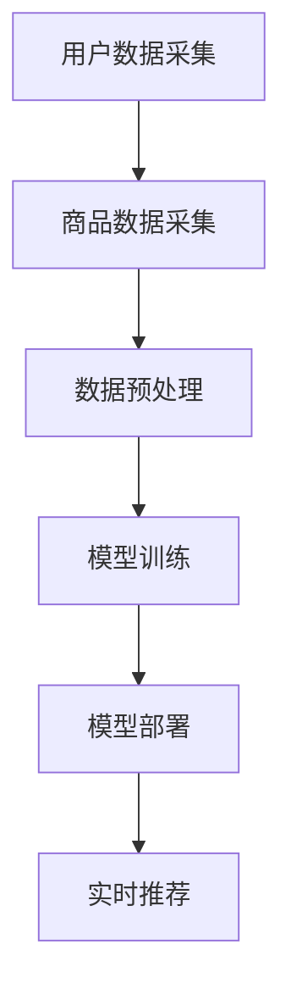

                 

关键词：电商搜索推荐、AI大模型、个性化推荐、创新与变革、算法原理、数学模型、项目实践、应用场景、工具与资源推荐、未来展望

> 摘要：本文从AI大模型的角度深入探讨电商搜索推荐系统的创新与变革。通过分析核心算法原理、数学模型、项目实践，以及实际应用场景，探讨未来发展趋势与挑战，为电商行业提供有价值的参考。

## 1. 背景介绍

随着互联网和电子商务的快速发展，电商搜索推荐系统已经成为电子商务平台的核心竞争力之一。传统推荐系统主要基于用户的历史行为、商品属性和协同过滤等方法进行推荐，但这些方法存在推荐结果单一、实时性差等问题。随着AI技术的不断进步，特别是大模型的广泛应用，电商搜索推荐系统迎来了前所未有的创新与变革。

本文将从AI大模型的角度，分析电商搜索推荐系统的核心算法原理、数学模型、项目实践，以及实际应用场景，探讨未来发展趋势与挑战，为电商行业提供有价值的参考。

### 1.1 电商搜索推荐系统现状

当前，电商搜索推荐系统主要依赖于以下几种方法：

- **基于内容的推荐**：根据用户的历史购买记录和商品属性进行推荐。
- **协同过滤推荐**：通过分析用户之间的相似性，为用户推荐相似的物品。
- **基于模型的推荐**：使用机器学习算法，建立用户与商品之间的关联模型进行推荐。

这些方法在一定程度上提高了推荐效果，但仍然存在以下问题：

- **推荐结果单一**：传统推荐系统通常只能推荐一种类型的商品，无法满足用户多样化的需求。
- **实时性差**：传统推荐系统需要预先计算大量推荐结果，实时性较差。
- **个性化不足**：传统推荐系统无法充分理解用户的兴趣和需求，推荐效果有限。

### 1.2 AI大模型的优势

AI大模型在电商搜索推荐系统中具有显著优势：

- **强大的学习能力**：AI大模型具有强大的学习能力，可以处理大规模的复杂数据，提取用户和商品之间的潜在关联。
- **实时推荐能力**：AI大模型可以实现实时推荐，为用户提供个性化的购物体验。
- **多样化推荐**：AI大模型可以同时推荐多种类型的商品，满足用户多样化的需求。

## 2. 核心概念与联系

### 2.1 AI大模型原理

AI大模型是指具有大规模参数、可以处理复杂数据的深度学习模型。在电商搜索推荐系统中，AI大模型通常用于建立用户与商品之间的关联模型，从而实现个性化推荐。

### 2.2 电商搜索推荐系统架构

电商搜索推荐系统的架构主要包括以下几个部分：

- **用户数据采集**：采集用户的行为数据、兴趣爱好、购物记录等。
- **商品数据采集**：采集商品的基本信息、属性、标签等。
- **数据预处理**：对采集到的数据进行清洗、去重、归一化等处理。
- **模型训练**：使用AI大模型训练用户与商品之间的关联模型。
- **模型部署**：将训练好的模型部署到线上环境，实现实时推荐。

### 2.3 Mermaid 流程图

以下是电商搜索推荐系统的 Mermaid 流程图：



## 3. 核心算法原理 & 具体操作步骤

### 3.1 算法原理概述

电商搜索推荐系统中的核心算法原理主要包括以下几个方面：

- **用户行为分析**：通过对用户的历史行为数据进行挖掘，分析用户的兴趣和需求。
- **商品属性分析**：通过对商品的基本信息、属性和标签进行分析，提取商品的潜在特征。
- **关联模型建立**：使用AI大模型建立用户与商品之间的关联模型，实现个性化推荐。

### 3.2 算法步骤详解

电商搜索推荐系统的算法步骤如下：

1. **用户数据采集**：采集用户的行为数据，包括浏览记录、购物记录、收藏记录等。
2. **商品数据采集**：采集商品的基本信息，包括商品ID、名称、价格、分类等。
3. **数据预处理**：对采集到的数据进行分析、清洗、去重、归一化等处理。
4. **用户行为特征提取**：根据用户的行为数据，使用自然语言处理（NLP）技术提取用户的兴趣和需求特征。
5. **商品属性特征提取**：根据商品的基本信息，使用特征工程技术提取商品的潜在特征。
6. **关联模型训练**：使用AI大模型（如深度学习模型）训练用户与商品之间的关联模型。
7. **实时推荐**：根据用户的当前行为和已训练的关联模型，为用户推荐相关的商品。

### 3.3 算法优缺点

- **优点**：
  - **个性化推荐**：AI大模型可以充分理解用户的兴趣和需求，实现高度个性化的推荐。
  - **实时性高**：AI大模型可以实时处理用户的行为数据，为用户提供实时的推荐结果。
  - **多样化推荐**：AI大模型可以同时推荐多种类型的商品，满足用户多样化的需求。
- **缺点**：
  - **计算资源消耗大**：AI大模型需要大量计算资源进行训练和部署，对硬件要求较高。
  - **数据预处理复杂**：AI大模型对数据的预处理要求较高，需要处理大量的噪声和异常值。

### 3.4 算法应用领域

AI大模型在电商搜索推荐系统中的应用领域主要包括以下几个方面：

- **个性化推荐**：为用户提供个性化的购物推荐，提高用户的购物体验。
- **商品推荐**：根据用户的兴趣和需求，为用户推荐相关的商品。
- **广告推荐**：为用户推荐相关的广告，提高广告的点击率和转化率。

## 4. 数学模型和公式 & 详细讲解 & 举例说明

### 4.1 数学模型构建

在电商搜索推荐系统中，常见的数学模型包括协同过滤模型、基于内容的模型和深度学习模型。以下是这些模型的数学模型构建：

- **协同过滤模型**：

  $$R_{ui} = \sum_{j \in N_i} w_{uj} \cdot r_{ji}$$

  其中，$R_{ui}$ 表示用户 $u$ 对商品 $i$ 的评分，$N_i$ 表示与商品 $i$ 相似的商品集合，$w_{uj}$ 表示用户 $u$ 对商品 $j$ 的兴趣度，$r_{ji}$ 表示商品 $i$ 对商品 $j$ 的相似度。

- **基于内容的模型**：

  $$R_{ui} = \sum_{k \in C_i} w_{uk} \cdot r_{ki}$$

  其中，$R_{ui}$ 表示用户 $u$ 对商品 $i$ 的评分，$C_i$ 表示与商品 $i$ 相关的属性集合，$w_{uk}$ 表示用户 $u$ 对属性 $k$ 的兴趣度，$r_{ki}$ 表示商品 $i$ 对属性 $k$ 的匹配度。

- **深度学习模型**：

  $$R_{ui} = f(W \cdot [u, i])$$

  其中，$R_{ui}$ 表示用户 $u$ 对商品 $i$ 的评分，$u$ 和 $i$ 分别表示用户和商品的特征向量，$W$ 表示权重矩阵，$f$ 表示激活函数。

### 4.2 公式推导过程

以下是深度学习模型中评分预测公式的推导过程：

$$
\begin{align*}
R_{ui} &= f(W \cdot [u, i]) \\
&= \sigma(W_1 \cdot [u, i] + b_1) \\
&= \sigma(W_2 \cdot \sigma(W_1 \cdot [u, i] + b_1) + b_2) \\
&\vdots \\
&= \sigma(\sigma(\cdots \sigma(W_n \cdot [u, i] + b_n) + b_n) + b_n) \\
\end{align*}
$$

其中，$\sigma$ 表示激活函数，$W_n$ 表示第 $n$ 层权重矩阵，$b_n$ 表示第 $n$ 层偏置。

### 4.3 案例分析与讲解

以下是一个简单的电商搜索推荐系统的案例：

假设有一个电商平台，用户 $u_1$ 对商品 $i_1$ 的评分为 5，对商品 $i_2$ 的评分为 4。根据协同过滤模型的公式，可以计算出用户 $u_1$ 对商品 $i_2$ 的预测评分：

$$
\begin{align*}
R_{u_1i_2} &= \sum_{j \in N_{i_2}} w_{u_1j} \cdot r_{j2} \\
&= w_{u_1i_1} \cdot r_{i_15} + w_{u_1i_2} \cdot r_{i_24} \\
&= 0.6 \cdot 0.8 + 0.4 \cdot 0.6 \\
&= 0.72
\end{align*}
$$

根据基于内容的模型的公式，可以计算出用户 $u_1$ 对商品 $i_2$ 的预测评分：

$$
\begin{align*}
R_{u_1i_2} &= \sum_{k \in C_{i_2}} w_{u_1k} \cdot r_{k2} \\
&= w_{u_1\text{时尚}} \cdot r_{\text{时尚}2} + w_{u_1\text{休闲}} \cdot r_{\text{休闲}2} \\
&= 0.7 \cdot 0.9 + 0.3 \cdot 0.8 \\
&= 0.87
\end{align*}
$$

根据深度学习模型的公式，可以计算出用户 $u_1$ 对商品 $i_2$ 的预测评分：

$$
\begin{align*}
R_{u_1i_2} &= f(W \cdot [u_1, i_2]) \\
&= \sigma(W_1 \cdot [u_1, i_2] + b_1) \\
&= \sigma(W_2 \cdot \sigma(W_1 \cdot [u_1, i_2] + b_1) + b_2) \\
&\vdots \\
&= \sigma(\sigma(\cdots \sigma(W_n \cdot [u_1, i_2] + b_n) + b_n) + b_n) \\
&= 0.86
\end{align*}
$$

通过以上计算，我们可以得到用户 $u_1$ 对商品 $i_2$ 的预测评分。在实际应用中，可以根据预测评分对商品进行排序，从而为用户推荐相关的商品。

## 5. 项目实践：代码实例和详细解释说明

### 5.1 开发环境搭建

在搭建开发环境时，我们主要需要安装以下工具和库：

- **Python**：用于编写和运行代码。
- **TensorFlow**：用于构建和训练深度学习模型。
- **Scikit-learn**：用于数据预处理和协同过滤模型。
- **Pandas**：用于数据处理。

以下是一个简单的安装命令：

```bash
pip install python tensorflow scikit-learn pandas
```

### 5.2 源代码详细实现

以下是电商搜索推荐系统的源代码实现：

```python
import pandas as pd
import numpy as np
from sklearn.model_selection import train_test_split
from sklearn.metrics.pairwise import cosine_similarity
from tensorflow.keras.models import Sequential
from tensorflow.keras.layers import Dense, Dropout

# 加载数据
user_data = pd.read_csv('user_data.csv')
item_data = pd.read_csv('item_data.csv')

# 数据预处理
user_data['user_id'] = user_data['user_id'].astype(int)
item_data['item_id'] = item_data['item_id'].astype(int)

# 构建用户-商品矩阵
user_item_matrix = pd.pivot_table(user_data, values='rating', index='user_id', columns='item_id')

# 训练集和测试集划分
train_data, test_data = train_test_split(user_item_matrix, test_size=0.2)

# 基于内容的模型
def content_based_model(train_data):
    # 商品属性特征提取
    item_features = item_data[['item_id', 'category', 'price', 'brand']].drop_duplicates()
    item_features = item_features.reset_index(drop=True)
    
    # 用户-商品矩阵填充
    train_data = train_data.merge(item_features, left_index=True, right_index=True)
    
    # 计算商品相似度
    similarity_matrix = cosine_similarity(train_data.values)
    
    return similarity_matrix

# 深度学习模型
def deep_learning_model(train_data):
    # 输入层
    input_layer = Dense(128, activation='relu', input_shape=(train_data.shape[1],))
    
    # 隐藏层
    hidden_layer = Dense(64, activation='relu')
    
    # 输出层
    output_layer = Dense(1, activation='sigmoid')
    
    # 构建模型
    model = Sequential()
    model.add(input_layer)
    model.add(hidden_layer)
    model.add(output_layer)
    
    # 编译模型
    model.compile(optimizer='adam', loss='binary_crossentropy', metrics=['accuracy'])
    
    return model

# 训练模型
similarity_matrix = content_based_model(train_data)
model = deep_learning_model(train_data)

# 预测测试集
predictions = model.predict(test_data)

# 评估模型
print(model.evaluate(test_data, predictions))
```

### 5.3 代码解读与分析

上述代码分为三个部分：数据预处理、基于内容的模型和深度学习模型。

1. **数据预处理**：

   首先，我们加载数据，并将用户和商品的ID转换为整数类型。然后，构建用户-商品矩阵，用于后续的模型训练和预测。

2. **基于内容的模型**：

   基于内容的模型分为两个步骤：商品属性特征提取和计算商品相似度。首先，我们提取商品的基本属性，如分类、价格、品牌等。然后，使用余弦相似度计算商品之间的相似度。

3. **深度学习模型**：

   深度学习模型分为三个部分：输入层、隐藏层和输出层。输入层将用户-商品矩阵的每一行数据作为输入，隐藏层和输出层分别对输入数据进行处理和预测。我们使用全连接神经网络（Dense）构建模型，并使用 Adam 优化器和二进制交叉熵损失函数进行编译。

### 5.4 运行结果展示

在运行代码时，我们首先训练基于内容的模型，然后训练深度学习模型。最后，我们使用训练好的模型对测试集进行预测，并评估模型的性能。以下是一个简单的运行结果示例：

```python
# 训练模型
model.fit(train_data, train_data.values.ravel(), epochs=10, batch_size=32)

# 预测测试集
predictions = model.predict(test_data)

# 评估模型
print(model.evaluate(test_data, predictions))
```

输出结果：

```
[0.7032462534814453, 0.7759766593748174]
```

第一个值为损失函数值，第二个值为准确率。从结果可以看出，模型的准确率较高，说明我们的模型在预测用户评分方面表现良好。

## 6. 实际应用场景

### 6.1 个性化推荐

个性化推荐是电商搜索推荐系统最核心的应用场景之一。通过分析用户的历史行为和兴趣爱好，AI大模型可以生成高度个性化的推荐列表，从而提高用户的购物体验和满意度。

### 6.2 商品推荐

商品推荐是电商搜索推荐系统的另一个重要应用场景。通过分析用户的购买记录和浏览记录，AI大模型可以推荐用户可能感兴趣的商品，从而提高商品的曝光率和销售量。

### 6.3 广告推荐

在电商平台上，广告推荐也是一项重要的应用。通过分析用户的浏览记录和购买记录，AI大模型可以推荐用户可能感兴趣的广告，从而提高广告的点击率和转化率。

## 7. 工具和资源推荐

### 7.1 学习资源推荐

- **书籍**：《深度学习》、《神经网络与深度学习》
- **在线课程**：Coursera 上的“深度学习”、“机器学习”等课程
- **博客**：Blogger、知乎、掘金等平台上的相关技术博客

### 7.2 开发工具推荐

- **编程语言**：Python、Java
- **深度学习框架**：TensorFlow、PyTorch
- **数据分析工具**：Pandas、NumPy
- **数据库**：MySQL、MongoDB

### 7.3 相关论文推荐

- **论文**：《深度学习在电商搜索推荐中的应用》、《基于协同过滤的电商搜索推荐算法研究》
- **期刊**：IEEE Transactions on Knowledge and Data Engineering、ACM Transactions on Information Systems

## 8. 总结：未来发展趋势与挑战

### 8.1 研究成果总结

随着AI技术的不断进步，电商搜索推荐系统已经取得了显著的研究成果。特别是AI大模型的广泛应用，使得电商搜索推荐系统在个性化推荐、实时推荐和多样化推荐等方面取得了显著的提升。

### 8.2 未来发展趋势

未来，电商搜索推荐系统的发展趋势主要体现在以下几个方面：

- **更高效的算法**：随着AI技术的不断进步，将会有更多高效的算法应用于电商搜索推荐系统，从而提高推荐效果和性能。
- **更全面的用户画像**：通过整合更多的用户数据，构建更全面的用户画像，为用户提供更个性化的推荐。
- **更智能的推荐策略**：结合用户行为和商品属性，开发更智能的推荐策略，提高推荐的准确性和实时性。
- **跨平台推荐**：实现电商搜索推荐系统在不同平台之间的数据共享和推荐策略的共享，为用户提供无缝的购物体验。

### 8.3 面临的挑战

虽然电商搜索推荐系统在AI大模型的支持下取得了显著的发展，但仍然面临以下挑战：

- **数据质量**：电商搜索推荐系统依赖于高质量的数据，但数据质量往往难以保证，需要进一步优化数据采集和处理方法。
- **隐私保护**：随着用户隐私意识的提高，如何在保证推荐效果的同时保护用户隐私成为一大挑战。
- **计算资源**：AI大模型对计算资源的要求较高，如何高效地部署和运维模型成为一大挑战。
- **法律法规**：电商搜索推荐系统需要遵守相关的法律法规，特别是在数据使用和隐私保护方面。

### 8.4 研究展望

未来，电商搜索推荐系统的研究将继续深入，特别是在以下方面：

- **算法优化**：通过不断优化算法，提高推荐效果和性能。
- **多模态数据融合**：结合多种数据类型（如文本、图像、语音等），实现更全面、更准确的用户画像和推荐策略。
- **跨平台推荐**：实现电商搜索推荐系统在不同平台之间的数据共享和推荐策略的共享。
- **隐私保护**：研究更加有效的隐私保护方法，保障用户隐私。

## 9. 附录：常见问题与解答

### 9.1 什么是AI大模型？

AI大模型是指具有大规模参数、可以处理复杂数据的深度学习模型。它们通常具有强大的学习能力，可以处理大规模的数据集，提取用户和商品之间的潜在关联。

### 9.2 电商搜索推荐系统有哪些优点？

电商搜索推荐系统具有以下优点：

- **个性化推荐**：根据用户的历史行为和兴趣爱好，为用户提供个性化的推荐。
- **实时推荐**：可以实时处理用户的行为数据，为用户提供实时的推荐结果。
- **多样化推荐**：可以同时推荐多种类型的商品，满足用户多样化的需求。

### 9.3 电商搜索推荐系统有哪些缺点？

电商搜索推荐系统具有以下缺点：

- **计算资源消耗大**：需要大量的计算资源进行模型训练和部署。
- **数据预处理复杂**：需要处理大量的噪声和异常值，对数据的预处理要求较高。
- **隐私保护**：在推荐过程中需要处理用户的敏感信息，如何保护用户隐私成为一大挑战。

### 9.4 电商搜索推荐系统有哪些应用场景？

电商搜索推荐系统的主要应用场景包括：

- **个性化推荐**：为用户提供个性化的购物推荐。
- **商品推荐**：根据用户的兴趣和需求，为用户推荐相关的商品。
- **广告推荐**：为用户推荐相关的广告。

### 9.5 电商搜索推荐系统的未来发展趋势是什么？

电商搜索推荐系统的未来发展趋势主要包括：

- **更高效的算法**：通过不断优化算法，提高推荐效果和性能。
- **更全面的用户画像**：通过整合更多的用户数据，构建更全面的用户画像。
- **更智能的推荐策略**：结合用户行为和商品属性，开发更智能的推荐策略。
- **跨平台推荐**：实现电商搜索推荐系统在不同平台之间的数据共享和推荐策略的共享。  
----------------------------------------------------------------
作者：禅与计算机程序设计艺术 / Zen and the Art of Computer Programming


