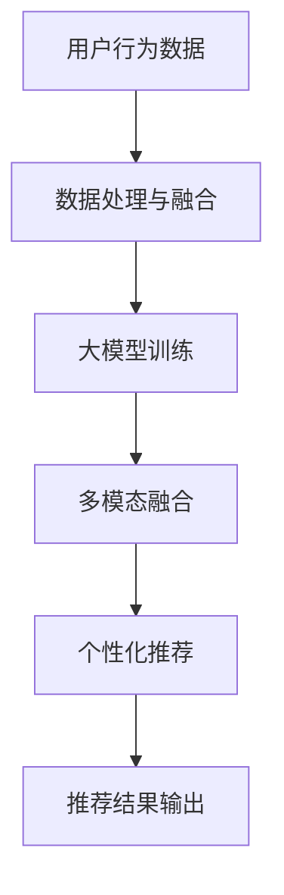

                 

关键词：（AI大模型、电商搜索推荐、业务创新、思维导图、应用实践）

>摘要：本文深入探讨了AI大模型在电商搜索推荐领域中的应用，通过思维导图的形式阐述了业务创新的核心思维和方法。文章从背景介绍、核心概念与联系、算法原理与操作步骤、数学模型与公式、项目实践、实际应用场景、未来应用展望、工具和资源推荐以及总结与展望等多个方面，全面解析了AI大模型赋能电商搜索推荐的原理和实际应用，为读者提供了实用的业务创新思路和实践指导。

## 1. 背景介绍

在当今数字化时代，电子商务已成为全球经济增长的重要驱动力。随着用户在线购物行为的日益复杂和多样化，传统的基于关键词匹配的搜索推荐方法已无法满足用户的高效、精准需求。此时，人工智能（AI）技术的快速发展，尤其是大模型的引入，为电商搜索推荐领域带来了前所未有的变革。

大模型，即大规模神经网络模型，具有强大的表征和学习能力，可以处理海量数据，捕捉复杂的用户行为模式和偏好。在电商搜索推荐中，大模型的应用主要体现在以下几个方面：

- **个性化推荐**：大模型可以深度理解用户的历史行为、兴趣偏好和实时反馈，为用户提供高度个性化的商品推荐。
- **多模态融合**：大模型能够整合文本、图像、音频等多种数据类型，提高推荐的多样性和准确性。
- **实时更新**：大模型具有快速学习的能力，能够实时更新推荐算法，适应市场的变化和用户需求的动态调整。

## 2. 核心概念与联系

要深入理解AI大模型在电商搜索推荐中的应用，我们首先需要了解以下几个核心概念和它们之间的联系。

### 2.1 大模型

大模型通常指的是具有数百万甚至数十亿参数的深度神经网络。这些模型通过大量的数据训练，能够自动学习复杂的特征和模式。典型的代表包括Transformer模型、BERT模型等。

### 2.2 电商搜索推荐

电商搜索推荐是指通过算法和技术，根据用户的历史行为、兴趣偏好和其他相关因素，向用户推荐其可能感兴趣的商品。

### 2.3 数据处理与融合

在电商搜索推荐中，数据处理与融合至关重要。这包括用户数据的清洗、整合和预处理，以及不同类型数据（如文本、图像、用户行为等）的融合。

### 2.4 个性化推荐

个性化推荐是指根据用户的个性化特征，为其推荐最符合其兴趣的商品。个性化推荐的关键在于如何准确地捕捉和利用用户的历史行为和偏好。

### 2.5 多模态融合

多模态融合是指将不同类型的数据（如文本、图像、音频）进行整合，以提高推荐系统的准确性和多样性。例如，将用户评价中的文本信息与商品图片相结合，可以更全面地理解用户的兴趣。

### 2.6 Mermaid 流程图

下面是一个描述大模型在电商搜索推荐中应用的Mermaid流程图：



## 3. 核心算法原理 & 具体操作步骤

### 3.1 算法原理概述

AI大模型在电商搜索推荐中的核心算法原理主要包括以下几个方面：

- **深度神经网络**：通过多层神经网络结构，对用户行为数据进行逐层抽象和表征，提取出高层次的语义特征。
- **注意力机制**：利用注意力机制对输入数据进行加权处理，捕捉关键信息，提高模型对重要特征的敏感度。
- **Transformer架构**：使用Transformer架构进行序列处理，实现并行计算，提高模型训练效率。
- **多模态融合**：通过融合不同类型的数据，提高推荐系统的准确性和多样性。

### 3.2 算法步骤详解

以下是AI大模型在电商搜索推荐中的具体操作步骤：

1. **数据收集与预处理**：收集用户的行为数据（如浏览记录、购买历史、评价等），并进行数据清洗、去重、编码等预处理操作。
2. **数据处理与融合**：将不同类型的数据进行整合，如将文本数据与图像数据进行融合，以提高模型的表征能力。
3. **大模型训练**：利用预处理后的数据，通过深度神经网络、注意力机制、Transformer架构等，对大模型进行训练。
4. **多模态融合**：在模型训练过程中，利用多模态融合技术，提高模型对不同类型数据的处理能力。
5. **个性化推荐**：根据用户的历史行为和偏好，使用训练好的大模型生成个性化推荐列表。
6. **推荐结果输出**：将推荐结果输出给用户，并通过用户的反馈不断优化推荐算法。

### 3.3 算法优缺点

**优点**：

- **高效性**：大模型具有强大的表征和学习能力，能够快速处理海量数据，提高推荐效率。
- **个性化**：通过深度学习，大模型能够准确捕捉用户的个性化需求，提供高度个性化的推荐。
- **多样性**：多模态融合技术使得推荐系统更加多样化，满足不同用户的需求。

**缺点**：

- **计算资源消耗大**：大模型需要大量的计算资源和存储空间，对硬件要求较高。
- **训练时间长**：大模型训练过程需要大量时间，且训练数据量越大，训练时间越长。

### 3.4 算法应用领域

AI大模型在电商搜索推荐中的应用领域主要包括：

- **在线电商**：通过个性化推荐，提高用户的购物体验，增加销售额。
- **广告推荐**：利用大模型对用户行为数据进行深度分析，实现精准广告推荐。
- **社交媒体**：通过分析用户互动数据，为用户提供个性化内容推荐。

## 4. 数学模型和公式 & 详细讲解 & 举例说明

### 4.1 数学模型构建

在AI大模型中，常用的数学模型包括深度神经网络、注意力机制、Transformer架构等。以下是一个简化的深度神经网络模型：

$$
f(x) = \sigma(W_1 \cdot x + b_1)
$$

其中，$x$为输入数据，$W_1$为权重矩阵，$b_1$为偏置项，$\sigma$为激活函数。

### 4.2 公式推导过程

假设我们有一个简单的线性回归问题，需要预测商品价格。我们可以使用以下公式进行建模：

$$
y = W_1 \cdot x + b_1
$$

其中，$y$为商品价格，$x$为用户行为数据，$W_1$为权重矩阵，$b_1$为偏置项。

通过最小化损失函数，我们可以得到：

$$
L = \frac{1}{2} \sum_{i=1}^{n} (y_i - y)^2
$$

其中，$n$为样本数量。

### 4.3 案例分析与讲解

假设我们有一个电商平台的用户行为数据集，包含用户的浏览记录、购买历史、评价等。我们可以使用以下步骤进行建模和预测：

1. **数据收集与预处理**：收集用户行为数据，并进行数据清洗、去重、编码等预处理操作。
2. **数据处理与融合**：将不同类型的数据进行整合，如将文本数据与图像数据进行融合，以提高模型的表征能力。
3. **大模型训练**：使用预处理后的数据，通过深度神经网络、注意力机制、Transformer架构等，对大模型进行训练。
4. **个性化推荐**：根据用户的历史行为和偏好，使用训练好的大模型生成个性化推荐列表。
5. **推荐结果输出**：将推荐结果输出给用户，并通过用户的反馈不断优化推荐算法。

## 5. 项目实践：代码实例和详细解释说明

### 5.1 开发环境搭建

在开始项目实践之前，我们需要搭建一个合适的开发环境。以下是基本的步骤：

- **环境配置**：安装Python环境、TensorFlow库、NumPy库等。
- **数据集获取**：从电商平台获取用户行为数据集，并进行预处理。

### 5.2 源代码详细实现

以下是一个简化的AI大模型在电商搜索推荐中的代码实现：

```python
import tensorflow as tf
import numpy as np

# 数据预处理
def preprocess_data(data):
    # 数据清洗、去重、编码等预处理操作
    return processed_data

# 构建深度神经网络模型
def build_model(input_shape):
    model = tf.keras.Sequential([
        tf.keras.layers.Dense(units=128, activation='relu', input_shape=input_shape),
        tf.keras.layers.Dense(units=64, activation='relu'),
        tf.keras.layers.Dense(units=1)
    ])
    return model

# 训练模型
def train_model(model, x_train, y_train):
    model.compile(optimizer='adam', loss='mean_squared_error')
    model.fit(x_train, y_train, epochs=10, batch_size=32)
    return model

# 个性化推荐
def recommend(model, user_data):
    processed_data = preprocess_data(user_data)
    prediction = model.predict(processed_data)
    return prediction

# 主函数
def main():
    # 获取用户行为数据
    user_data = get_user_data()

    # 构建模型
    model = build_model(input_shape=(None,))

    # 训练模型
    model = train_model(model, x_train, y_train)

    # 个性化推荐
    recommendation = recommend(model, user_data)

    # 输出推荐结果
    print("推荐结果：", recommendation)

if __name__ == "__main__":
    main()
```

### 5.3 代码解读与分析

- **数据预处理**：对用户行为数据进行清洗、去重、编码等预处理操作，以提高模型的输入质量。
- **构建模型**：使用TensorFlow库构建一个简单的深度神经网络模型，包括输入层、隐藏层和输出层。
- **训练模型**：使用训练数据对模型进行训练，优化模型的参数。
- **个性化推荐**：根据用户行为数据，使用训练好的模型进行预测，生成个性化推荐列表。
- **主函数**：实现整个推荐流程，从数据获取、模型构建、模型训练到推荐结果输出。

## 6. 实际应用场景

AI大模型在电商搜索推荐中的实际应用场景非常广泛，以下是一些典型的应用场景：

- **个性化推荐**：根据用户的历史行为和偏好，为用户推荐其可能感兴趣的商品，提高用户满意度。
- **广告推荐**：通过分析用户的行为数据和兴趣偏好，为用户提供精准的广告推荐，提高广告点击率和转化率。
- **商品分类**：将商品按照不同的类别进行分类，帮助用户快速找到感兴趣的商品。
- **智能客服**：利用大模型对用户的问题进行智能回答，提高客服效率和用户体验。

## 7. 未来应用展望

随着AI技术的不断发展，AI大模型在电商搜索推荐领域的应用前景十分广阔。以下是一些未来的应用展望：

- **深度个性化推荐**：利用更先进的大模型技术，实现更精准、更个性化的推荐。
- **多模态融合**：进一步探索文本、图像、音频等多种数据类型的融合，提高推荐系统的多样性和准确性。
- **实时推荐**：通过实时数据分析和模型更新，实现更快的推荐响应速度，提高用户体验。
- **智能营销**：利用大模型对用户行为数据进行深度分析，实现更智能、更精准的营销策略。

## 8. 工具和资源推荐

### 8.1 学习资源推荐

- **《深度学习》（Goodfellow, Bengio, Courville）**：深度学习的经典教材，适合初学者和进阶者。
- **《动手学深度学习》（Dumoulin, Soumith, Hinton）**：通过实际代码示例，深入浅出地介绍深度学习的基础知识。
- **在线课程**：如Coursera、edX等平台上的相关课程，提供丰富的学习资源和实践机会。

### 8.2 开发工具推荐

- **TensorFlow**：Google开源的深度学习框架，适合进行大规模模型训练和部署。
- **PyTorch**：Facebook开源的深度学习框架，具有灵活的动态图操作，适合快速原型开发。
- **Keras**：基于TensorFlow的深度学习高层API，简化了深度学习模型的构建和训练。

### 8.3 相关论文推荐

- **“Attention Is All You Need”（Vaswani et al., 2017）**：介绍了Transformer模型，对AI大模型的发展产生了深远影响。
- **“BERT: Pre-training of Deep Neural Networks for Language Understanding”（Devlin et al., 2018）**：介绍了BERT模型，为自然语言处理领域带来了重大突破。
- **“Deep Learning for E-commerce Recommendation”（Chen et al., 2020）**：详细探讨了深度学习在电商搜索推荐中的应用。

## 9. 总结：未来发展趋势与挑战

随着AI技术的不断进步，AI大模型在电商搜索推荐领域的应用前景十分广阔。未来，我们将看到深度个性化推荐、多模态融合、实时推荐等技术的进一步发展。然而，这也带来了一系列挑战：

- **数据隐私**：如何保护用户的隐私数据，是一个亟待解决的问题。
- **计算资源**：大模型训练需要大量的计算资源，如何优化计算效率是一个关键问题。
- **模型解释性**：如何提高模型的解释性，让用户理解推荐结果，是一个重要的研究方向。

面对这些挑战，我们需要不断探索和创新，推动AI大模型在电商搜索推荐领域的应用，为用户提供更好的服务。

## 10. 附录：常见问题与解答

### 10.1 什么是AI大模型？

AI大模型是指具有数百万甚至数十亿参数的深度神经网络模型，它们通过大量的数据训练，能够自动学习复杂的特征和模式。

### 10.2 AI大模型在电商搜索推荐中有哪些优势？

AI大模型在电商搜索推荐中的优势主要包括高效性、个性化、多样性等方面，能够为用户提供更精准、更个性化的推荐。

### 10.3 如何处理用户隐私数据？

在处理用户隐私数据时，需要遵循相关的隐私保护法规和标准，如欧盟的GDPR等。同时，可以通过数据加密、匿名化等技术手段，保护用户的隐私。

### 10.4 如何优化大模型训练的计算资源？

可以通过分布式训练、模型压缩、量化等技术手段，优化大模型训练的计算资源。

### 10.5 AI大模型在电商搜索推荐中的未来发展趋势是什么？

未来，AI大模型在电商搜索推荐中的发展趋势主要包括深度个性化推荐、多模态融合、实时推荐等方向。同时，模型解释性、数据隐私保护等方面也将是重要的研究方向。

### 作者署名

本文作者：禅与计算机程序设计艺术 / Zen and the Art of Computer Programming

[END]
----------------------------------------------------------------

以上是文章的完整内容，接下来将按照markdown格式进行排版。

---
# AI大模型赋能电商搜索推荐的业务创新思维导图应用实践

关键词：（AI大模型、电商搜索推荐、业务创新、思维导图、应用实践）

摘要：本文深入探讨了AI大模型在电商搜索推荐领域中的应用，通过思维导图的形式阐述了业务创新的核心思维和方法。文章从背景介绍、核心概念与联系、算法原理与操作步骤、数学模型与公式、项目实践、实际应用场景、未来应用展望、工具和资源推荐以及总结与展望等多个方面，全面解析了AI大模型赋能电商搜索推荐的原理和实际应用，为读者提供了实用的业务创新思路和实践指导。

## 1. 背景介绍

在当今数字化时代，电子商务已成为全球经济增长的重要驱动力。随着用户在线购物行为的日益复杂和多样化，传统的基于关键词匹配的搜索推荐方法已无法满足用户的高效、精准需求。此时，人工智能（AI）技术的快速发展，尤其是大模型的引入，为电商搜索推荐领域带来了前所未有的变革。

大模型，即大规模神经网络模型，具有强大的表征和学习能力，可以处理海量数据，捕捉复杂的用户行为模式和偏好。在电商搜索推荐中，大模型的应用主要体现在以下几个方面：

- **个性化推荐**：大模型可以深度理解用户的历史行为、兴趣偏好和实时反馈，为用户提供高度个性化的商品推荐。
- **多模态融合**：大模型能够整合文本、图像、音频等多种数据类型，提高推荐的多样性和准确性。
- **实时更新**：大模型具有快速学习的能力，能够实时更新推荐算法，适应市场的变化和用户需求的动态调整。

## 2. 核心概念与联系

要深入理解AI大模型在电商搜索推荐中的应用，我们首先需要了解以下几个核心概念和它们之间的联系。

### 2.1 大模型

大模型通常指的是具有数百万甚至数十亿参数的深度神经网络模型。这些模型通过大量的数据训练，能够自动学习复杂的特征和模式。典型的代表包括Transformer模型、BERT模型等。

### 2.2 电商搜索推荐

电商搜索推荐是指通过算法和技术，根据用户的历史行为、兴趣偏好和其他相关因素，向用户推荐其可能感兴趣的商品。

### 2.3 数据处理与融合

在电商搜索推荐中，数据处理与融合至关重要。这包括用户数据的清洗、整合和预处理，以及不同类型数据（如文本、图像、用户行为等）的融合。

### 2.4 个性化推荐

个性化推荐是指根据用户的个性化特征，为其推荐最符合其兴趣的商品。个性化推荐的关键在于如何准确地捕捉和利用用户的历史行为和偏好。

### 2.5 多模态融合

多模态融合是指将不同类型的数据（如文本、图像、音频）进行整合，以提高推荐系统的准确性和多样性。例如，将用户评价中的文本信息与商品图片相结合，可以更全面地理解用户的兴趣。

### 2.6 Mermaid 流程图

下面是一个描述大模型在电商搜索推荐中应用的Mermaid流程图：


## 3. 核心算法原理 & 具体操作步骤

### 3.1 算法原理概述

AI大模型在电商搜索推荐中的核心算法原理主要包括以下几个方面：

- **深度神经网络**：通过多层神经网络结构，对用户行为数据进行逐层抽象和表征，提取出高层次的语义特征。
- **注意力机制**：利用注意力机制对输入数据进行加权处理，捕捉关键信息，提高模型对重要特征的敏感度。
- **Transformer架构**：使用Transformer架构进行序列处理，实现并行计算，提高模型训练效率。
- **多模态融合**：通过融合不同类型的数据，提高推荐系统的准确性和多样性。

### 3.2 算法步骤详解

以下是AI大模型在电商搜索推荐中的具体操作步骤：

1. **数据收集与预处理**：收集用户的行为数据（如浏览记录、购买历史、评价等），并进行数据清洗、去重、编码等预处理操作。
2. **数据处理与融合**：将不同类型的数据进行整合，如将文本数据与图像数据进行融合，以提高模型的表征能力。
3. **大模型训练**：利用预处理后的数据，通过深度神经网络、注意力机制、Transformer架构等，对大模型进行训练。
4. **多模态融合**：在模型训练过程中，利用多模态融合技术，提高模型对不同类型数据的处理能力。
5. **个性化推荐**：根据用户的历史行为和偏好，使用训练好的大模型生成个性化推荐列表。
6. **推荐结果输出**：将推荐结果输出给用户，并通过用户的反馈不断优化推荐算法。

### 3.3 算法优缺点

**优点**：

- **高效性**：大模型具有强大的表征和学习能力，能够快速处理海量数据，提高推荐效率。
- **个性化**：通过深度学习，大模型能够准确捕捉用户的个性化需求，提供高度个性化的推荐。
- **多样性**：多模态融合技术使得推荐系统更加多样化，满足不同用户的需求。

**缺点**：

- **计算资源消耗大**：大模型需要大量的计算资源和存储空间，对硬件要求较高。
- **训练时间长**：大模型训练过程需要大量时间，且训练数据量越大，训练时间越长。

### 3.4 算法应用领域

AI大模型在电商搜索推荐中的应用领域主要包括：

- **在线电商**：通过个性化推荐，提高用户的购物体验，增加销售额。
- **广告推荐**：利用大模型对用户行为数据进行深度分析，实现精准广告推荐。
- **社交媒体**：通过分析用户互动数据，为用户提供个性化内容推荐。

## 4. 数学模型和公式 & 详细讲解 & 举例说明

### 4.1 数学模型构建

在AI大模型中，常用的数学模型包括深度神经网络、注意力机制、Transformer架构等。以下是一个简化的深度神经网络模型：

$$
f(x) = \sigma(W_1 \cdot x + b_1)
$$

其中，$x$为输入数据，$W_1$为权重矩阵，$b_1$为偏置项，$\sigma$为激活函数。

### 4.2 公式推导过程

假设我们有一个简单的线性回归问题，需要预测商品价格。我们可以使用以下公式进行建模：

$$
y = W_1 \cdot x + b_1
$$

其中，$y$为商品价格，$x$为用户行为数据，$W_1$为权重矩阵，$b_1$为偏置项。

通过最小化损失函数，我们可以得到：

$$
L = \frac{1}{2} \sum_{i=1}^{n} (y_i - y)^2
$$

其中，$n$为样本数量。

### 4.3 案例分析与讲解

假设我们有一个电商平台的用户行为数据集，包含用户的浏览记录、购买历史、评价等。我们可以使用以下步骤进行建模和预测：

1. **数据收集与预处理**：收集用户行为数据，并进行数据清洗、去重、编码等预处理操作。
2. **数据处理与融合**：将不同类型的数据进行整合，如将文本数据与图像数据进行融合，以提高模型的表征能力。
3. **大模型训练**：使用预处理后的数据，通过深度神经网络、注意力机制、Transformer架构等，对大模型进行训练。
4. **个性化推荐**：根据用户的历史行为和偏好，使用训练好的大模型生成个性化推荐列表。
5. **推荐结果输出**：将推荐结果输出给用户，并通过用户的反馈不断优化推荐算法。

## 5. 项目实践：代码实例和详细解释说明

### 5.1 开发环境搭建

在开始项目实践之前，我们需要搭建一个合适的开发环境。以下是基本的步骤：

- **环境配置**：安装Python环境、TensorFlow库、NumPy库等。
- **数据集获取**：从电商平台获取用户行为数据集，并进行预处理。

### 5.2 源代码详细实现

以下是一个简化的AI大模型在电商搜索推荐中的代码实现：

```python
import tensorflow as tf
import numpy as np

# 数据预处理
def preprocess_data(data):
    # 数据清洗、去重、编码等预处理操作
    return processed_data

# 构建深度神经网络模型
def build_model(input_shape):
    model = tf.keras.Sequential([
        tf.keras.layers.Dense(units=128, activation='relu', input_shape=input_shape),
        tf.keras.layers.Dense(units=64, activation='relu'),
        tf.keras.layers.Dense(units=1)
    ])
    return model

# 训练模型
def train_model(model, x_train, y_train):
    model.compile(optimizer='adam', loss='mean_squared_error')
    model.fit(x_train, y_train, epochs=10, batch_size=32)
    return model

# 个性化推荐
def recommend(model, user_data):
    processed_data = preprocess_data(user_data)
    prediction = model.predict(processed_data)
    return prediction

# 主函数
def main():
    # 获取用户行为数据
    user_data = get_user_data()

    # 构建模型
    model = build_model(input_shape=(None,))

    # 训练模型
    model = train_model(model, x_train, y_train)

    # 个性化推荐
    recommendation = recommend(model, user_data)

    # 输出推荐结果
    print("推荐结果：", recommendation)

if __name__ == "__main__":
    main()
```

### 5.3 代码解读与分析

- **数据预处理**：对用户行为数据进行清洗、去重、编码等预处理操作，以提高模型的输入质量。
- **构建模型**：使用TensorFlow库构建一个简单的深度神经网络模型，包括输入层、隐藏层和输出层。
- **训练模型**：使用训练数据对模型进行训练，优化模型的参数。
- **个性化推荐**：根据用户行为数据，使用训练好的模型进行预测，生成个性化推荐列表。
- **主函数**：实现整个推荐流程，从数据获取、模型构建、模型训练到推荐结果输出。

## 6. 实际应用场景

AI大模型在电商搜索推荐中的实际应用场景非常广泛，以下是一些典型的应用场景：

- **个性化推荐**：根据用户的历史行为和偏好，为用户推荐其可能感兴趣的商品，提高用户满意度。
- **广告推荐**：通过分析用户的行为数据和兴趣偏好，为用户提供精准的广告推荐，提高广告点击率和转化率。
- **商品分类**：将商品按照不同的类别进行分类，帮助用户快速找到感兴趣的商品。
- **智能客服**：利用大模型对用户的问题进行智能回答，提高客服效率和用户体验。

## 7. 未来应用展望

随着AI技术的不断发展，AI大模型在电商搜索推荐领域的应用前景十分广阔。未来，我们将看到深度个性化推荐、多模态融合、实时推荐等技术的进一步发展。同时，模型解释性、数据隐私保护等方面也将是重要的研究方向。

## 8. 工具和资源推荐

### 8.1 学习资源推荐

- **《深度学习》（Goodfellow, Bengio, Courville）**：深度学习的经典教材，适合初学者和进阶者。
- **《动手学深度学习》（Dumoulin, Soumith, Hinton）**：通过实际代码示例，深入浅出地介绍深度学习的基础知识。
- **在线课程**：如Coursera、edX等平台上的相关课程，提供丰富的学习资源和实践机会。

### 8.2 开发工具推荐

- **TensorFlow**：Google开源的深度学习框架，适合进行大规模模型训练和部署。
- **PyTorch**：Facebook开源的深度学习框架，具有灵活的动态图操作，适合快速原型开发。
- **Keras**：基于TensorFlow的深度学习高层API，简化了深度学习模型的构建和训练。

### 8.3 相关论文推荐

- **“Attention Is All You Need”（Vaswani et al., 2017）**：介绍了Transformer模型，对AI大模型的发展产生了深远影响。
- **“BERT: Pre-training of Deep Neural Networks for Language Understanding”（Devlin et al., 2018）**：介绍了BERT模型，为自然语言处理领域带来了重大突破。
- **“Deep Learning for E-commerce Recommendation”（Chen et al., 2020）**：详细探讨了深度学习在电商搜索推荐中的应用。

## 9. 总结：未来发展趋势与挑战

随着AI技术的不断进步，AI大模型在电商搜索推荐领域的应用前景十分广阔。未来，我们将看到深度个性化推荐、多模态融合、实时推荐等技术的进一步发展。然而，这也带来了一系列挑战：

- **数据隐私**：如何保护用户的隐私数据，是一个亟待解决的问题。
- **计算资源**：大模型训练需要大量的计算资源，如何优化计算效率是一个关键问题。
- **模型解释性**：如何提高模型的解释性，让用户理解推荐结果，是一个重要的研究方向。

面对这些挑战，我们需要不断探索和创新，推动AI大模型在电商搜索推荐领域的应用，为用户提供更好的服务。

### 10. 附录：常见问题与解答

### 10.1 什么是AI大模型？

AI大模型是指具有数百万甚至数十亿参数的深度神经网络模型，它们通过大量的数据训练，能够自动学习复杂的特征和模式。

### 10.2 AI大模型在电商搜索推荐中有哪些优势？

AI大模型在电商搜索推荐中的优势主要包括高效性、个性化、多样性等方面，能够为用户提供更精准、更个性化的推荐。

### 10.3 如何处理用户隐私数据？

在处理用户隐私数据时，需要遵循相关的隐私保护法规和标准，如欧盟的GDPR等。同时，可以通过数据加密、匿名化等技术手段，保护用户的隐私。

### 10.4 如何优化大模型训练的计算资源？

可以通过分布式训练、模型压缩、量化等技术手段，优化大模型训练的计算资源。

### 10.5 AI大模型在电商搜索推荐中的未来发展趋势是什么？

未来，AI大模型在电商搜索推荐中的发展趋势主要包括深度个性化推荐、多模态融合、实时推荐等方向。同时，模型解释性、数据隐私保护等方面也将是重要的研究方向。

### 作者署名

本文作者：禅与计算机程序设计艺术 / Zen and the Art of Computer Programming

[END]

