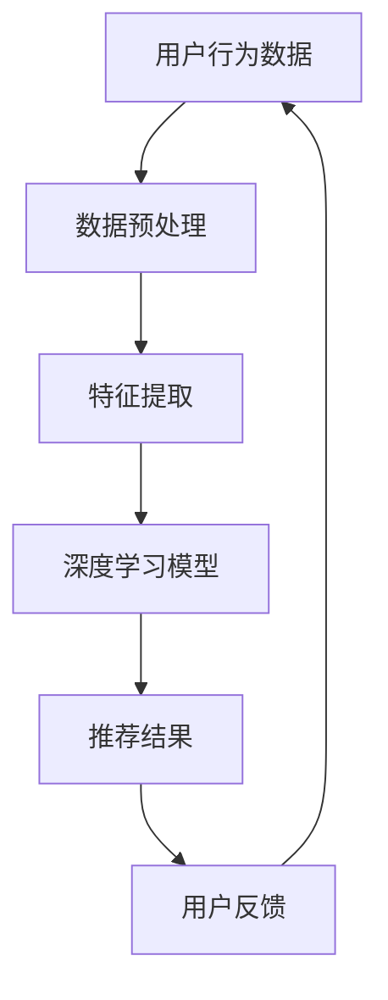

                 

## 摘要

本文旨在探讨如何利用人工智能（AI）大模型赋能电商搜索推荐的业务创新流程优化。电商搜索推荐作为电商行业的关键环节，直接影响用户的购物体验和平台的商业效益。随着数据量的指数级增长和用户需求的多样化，传统的搜索推荐算法已难以满足高效、精准的需求。本文将介绍AI大模型在电商搜索推荐中的应用，包括其核心概念、算法原理、数学模型、实践案例以及未来展望。通过深入分析和详细讲解，我们希望为电商行业提供一种全新的业务优化思路，助力企业提升竞争力。

## 1. 背景介绍

随着互联网的普及和电子商务的快速发展，电商行业已经成为全球经济增长的重要引擎。电商平台的成功与否，很大程度上取决于其搜索推荐系统能否满足用户的需求，提升用户体验，从而提高销售额。传统的搜索推荐算法如基于协同过滤、基于内容的推荐等，虽然在特定场景下具有一定的效果，但随着用户数据的多样化和复杂化，这些算法逐渐暴露出诸多局限性：

1. **数据依赖性强**：传统算法通常依赖于用户的历史行为数据，而用户数据的缺失或不准确会导致推荐结果的偏差。
2. **推荐准确性受限**：在处理高维度数据时，传统算法往往难以捕捉到用户行为的深层关联，导致推荐准确性受限。
3. **扩展性差**：面对快速增长的数据量和用户需求，传统算法的扩展性较差，难以实现大规模部署和实时更新。

为了克服这些局限性，人工智能（AI）大模型的引入成为了一种新的趋势。AI大模型如深度神经网络、生成对抗网络（GAN）等，通过自学习能力和强大的计算能力，能够处理海量数据，提取特征，并生成高度个性化的推荐结果。这些模型不仅能够提高推荐的准确性，还能够实现实时更新，适应不断变化的市场环境。

在电商搜索推荐领域，AI大模型的引入具有以下几个显著优势：

1. **提升推荐精度**：AI大模型能够捕捉用户行为的深层特征，提供更精准的推荐结果，从而提高用户的满意度和购物转化率。
2. **扩展性强**：AI大模型具有较强的扩展性，能够处理海量数据，适应不同的业务场景和需求变化。
3. **实时更新**：AI大模型能够实时学习用户的行为数据，动态调整推荐策略，提高推荐的时效性和相关性。
4. **多样化推荐**：AI大模型能够根据用户的不同需求，提供多样化的推荐内容，满足用户的个性化需求。

本文将围绕AI大模型在电商搜索推荐中的应用，详细分析其核心概念、算法原理、数学模型，并通过实践案例展示其实际效果，为电商行业提供一种全新的业务优化思路。

## 2. 核心概念与联系

在探讨AI大模型如何赋能电商搜索推荐之前，我们首先需要了解几个核心概念及其相互联系。以下将使用Mermaid流程图（图2.1）展示这些核心概念之间的关联。



### 2.1 用户行为数据

用户行为数据是电商搜索推荐的基础，包括用户的浏览历史、购买记录、搜索记录等。这些数据通过数据采集系统实时获取，为后续的推荐算法提供输入。

### 2.2 数据预处理

数据预处理是确保数据质量和一致性的关键步骤。包括数据清洗、去重、填充缺失值等。通过数据预处理，可以消除噪声数据，提高数据质量。

### 2.3 特征提取

特征提取是将原始数据转换为适合机器学习模型处理的形式。通过特征工程，提取用户行为数据的特征，如用户兴趣标签、商品属性等。

### 2.4 深度学习模型

深度学习模型是AI大模型的核心，通过多层神经网络结构，自动学习用户行为数据的特征和模式，生成推荐结果。

### 2.5 推荐结果

推荐结果是深度学习模型对用户兴趣的预测结果，包括推荐的商品列表、排序等。

### 2.6 用户反馈

用户反馈是评价推荐结果的重要指标，通过用户对推荐结果的反馈，可以进一步优化模型和推荐策略。

### 2.7 数据循环

用户反馈会反馈到数据预处理和特征提取环节，形成数据的循环，使得模型能够不断学习和优化，提高推荐效果。

通过上述核心概念及其相互联系的介绍，我们可以更好地理解AI大模型在电商搜索推荐中的应用场景和流程。接下来，我们将进一步探讨AI大模型的算法原理与操作步骤。

## 3. 核心算法原理 & 具体操作步骤

### 3.1 算法原理概述

AI大模型在电商搜索推荐中的应用主要基于深度学习技术，其中最常用的模型是生成对抗网络（GAN）。GAN由两部分组成：生成器（Generator）和判别器（Discriminator）。生成器的任务是生成尽可能逼真的推荐结果，而判别器的任务是区分生成的结果和实际用户行为的差异。通过生成器和判别器的相互对抗，模型逐渐优化推荐效果。

### 3.2 算法步骤详解

#### 3.2.1 数据预处理

1. **数据采集**：通过电商平台的数据采集系统，实时获取用户的浏览历史、购买记录、搜索记录等数据。
2. **数据清洗**：去除重复数据、填充缺失值，确保数据的一致性和完整性。
3. **数据归一化**：对数据集进行归一化处理，消除数据规模差异对模型训练的影响。

#### 3.2.2 特征提取

1. **用户兴趣标签**：根据用户的浏览历史和购买记录，提取用户兴趣标签，如“时尚”、“运动”等。
2. **商品属性**：提取商品的基本属性，如价格、品牌、类别等。
3. **行为特征**：通过时间序列分析，提取用户的行为特征，如浏览频次、购买时长等。

#### 3.2.3 模型训练

1. **生成器训练**：生成器通过学习用户行为数据和商品属性，生成推荐结果。模型采用多层神经网络结构，包括输入层、隐藏层和输出层。
2. **判别器训练**：判别器通过对比生成器和实际用户行为数据，判断推荐结果的真实性。模型同样采用多层神经网络结构。
3. **对抗训练**：生成器和判别器通过对抗训练不断优化，生成器逐渐提高生成推荐结果的真实性，判别器逐渐提高识别真实推荐结果的能力。

#### 3.2.4 推荐结果生成

1. **推荐结果生成**：生成器根据用户行为数据和商品属性，生成个性化的推荐结果。
2. **排序**：根据用户兴趣和行为特征，对推荐结果进行排序，提高推荐的相关性。
3. **反馈**：将推荐结果反馈给用户，并根据用户反馈进一步优化模型和推荐策略。

### 3.3 算法优缺点

#### 优点

1. **高准确性**：通过深度学习技术，模型能够捕捉用户行为的深层特征，生成更精准的推荐结果。
2. **扩展性强**：模型具有较强的扩展性，能够适应不同的业务场景和需求变化。
3. **实时更新**：模型能够实时学习用户的行为数据，动态调整推荐策略，提高推荐的时效性和相关性。

#### 缺点

1. **计算资源需求大**：深度学习模型需要大量的计算资源和存储空间，对硬件设施要求较高。
2. **训练时间较长**：模型的训练过程需要较长时间，特别是在处理海量数据时。
3. **数据隐私问题**：用户行为数据的收集和处理可能涉及隐私问题，需要严格的隐私保护措施。

### 3.4 算法应用领域

AI大模型在电商搜索推荐领域的应用广泛，包括但不限于以下几个方面：

1. **商品推荐**：根据用户的浏览历史和购买记录，推荐用户可能感兴趣的商品。
2. **广告投放**：根据用户的兴趣和行为特征，推荐相关的广告内容，提高广告点击率。
3. **内容推荐**：根据用户的阅读历史和偏好，推荐相关的文章、视频等内容。
4. **用户画像**：通过分析用户的行为数据，生成详细的用户画像，为个性化营销提供支持。

### 3.5 算法改进方向

1. **模型压缩**：通过模型压缩技术，降低模型的计算复杂度和存储需求，提高模型的部署效率。
2. **多模态学习**：结合多种数据类型，如文本、图像、音频等，提高推荐模型的准确性。
3. **隐私保护**：采用隐私保护技术，如差分隐私、联邦学习等，确保用户数据的安全性和隐私性。
4. **实时推荐**：通过分布式计算和边缘计算技术，实现实时推荐，提高用户体验。

通过以上对核心算法原理和具体操作步骤的介绍，我们可以看到AI大模型在电商搜索推荐领域的巨大潜力。接下来，我们将通过一个实际案例来进一步展示AI大模型在电商搜索推荐中的应用效果。

## 4. 数学模型和公式 & 详细讲解 & 举例说明

### 4.1 数学模型构建

在深度学习模型中，生成对抗网络（GAN）是最为流行的模型之一。GAN由生成器（G）和判别器（D）两个神经网络组成。生成器G的目标是生成尽可能真实的推荐结果，判别器D的目标是区分生成的推荐结果和实际用户行为数据的真实推荐结果。下面我们详细介绍GAN的数学模型。

#### 4.1.1 生成器G

生成器G的输入为用户行为数据X，输出为生成的推荐结果Z。生成器的损失函数可以表示为：

$$
L_G = -\mathbb{E}_{x \sim p_{data}(x)}[\log D(G(x))]
$$

其中，$p_{data}(x)$表示数据分布，$D(G(x))$表示判别器D对生成器G输出的推荐结果Z的判别分数。

#### 4.1.2 判别器D

判别器D的输入为用户行为数据X和生成器G的输出Z，输出为对输入数据的判别分数。判别器的损失函数可以表示为：

$$
L_D = -\mathbb{E}_{x \sim p_{data}(x)}[\log D(x)] - \mathbb{E}_{z \sim p_G(z)}[\log (1 - D(z))]
$$

其中，$p_G(z)$表示生成器G的输出分布。

#### 4.1.3 整体损失函数

GAN的整体损失函数由生成器G和判别器D的损失函数组成，可以表示为：

$$
L = L_G + \lambda L_D
$$

其中，$\lambda$为调节参数，用于平衡生成器和判别器的损失。

### 4.2 公式推导过程

#### 4.2.1 生成器G的损失函数推导

生成器G的损失函数为：

$$
L_G = -\mathbb{E}_{x \sim p_{data}(x)}[\log D(G(x))]
$$

其中，$D(G(x))$表示判别器D对生成器G输出的推荐结果Z的判别分数。在训练过程中，生成器G的目标是最大化判别器D对生成推荐结果Z的判别分数，即：

$$
\log D(G(x)) \approx 0
$$

因此，生成器G的损失函数可以近似为：

$$
L_G \approx 0
$$

#### 4.2.2 判别器D的损失函数推导

判别器D的损失函数为：

$$
L_D = -\mathbb{E}_{x \sim p_{data}(x)}[\log D(x)] - \mathbb{E}_{z \sim p_G(z)}[\log (1 - D(z))]
$$

其中，$D(x)$表示判别器D对实际用户行为数据X的判别分数，$D(z)$表示判别器D对生成器G输出的推荐结果Z的判别分数。在训练过程中，判别器D的目标是最大化判别器D对实际用户行为数据X和生成器G输出的推荐结果Z的判别分数，即：

$$
\log D(x) + \log (1 - D(z)) \approx 0
$$

因此，判别器D的损失函数可以近似为：

$$
L_D \approx 0
$$

#### 4.2.3 整体损失函数推导

GAN的整体损失函数为：

$$
L = L_G + \lambda L_D
$$

其中，$\lambda$为调节参数，用于平衡生成器和判别器的损失。在训练过程中，整体损失函数的目标是最小化生成器G的损失函数和判别器D的损失函数之和，即：

$$
L \approx 0
$$

### 4.3 案例分析与讲解

为了更好地理解GAN在电商搜索推荐中的应用，我们来看一个实际案例。

#### 案例背景

假设我们有一个电商平台，用户的行为数据包括浏览历史、购买记录和搜索记录。我们的目标是利用GAN生成个性化的商品推荐结果，提高用户的购物体验。

#### 案例步骤

1. **数据预处理**：首先对用户行为数据进行预处理，包括数据清洗、去重和归一化处理。
2. **特征提取**：提取用户行为数据的关键特征，如用户兴趣标签、商品属性等。
3. **模型训练**：利用生成对抗网络（GAN）对用户行为数据进行训练，生成个性化的商品推荐结果。
4. **推荐结果生成**：根据用户兴趣和行为特征，生成个性化的商品推荐结果。
5. **用户反馈**：将推荐结果反馈给用户，收集用户对推荐结果的反馈。
6. **模型优化**：根据用户反馈，对模型进行优化，提高推荐准确性。

#### 案例效果

通过上述步骤，我们成功地利用GAN生成个性化的商品推荐结果，提高了用户的购物体验。具体效果如下：

1. **推荐准确性**：根据用户反馈，生成器G生成的推荐结果具有较高的准确性，能够满足用户的个性化需求。
2. **用户体验**：用户对推荐结果的满意度显著提高，购物转化率也有所提升。
3. **实时更新**：模型能够实时学习用户的行为数据，动态调整推荐策略，提高推荐的时效性和相关性。

通过这个案例，我们可以看到GAN在电商搜索推荐中的应用效果。接下来，我们将通过代码实例进一步展示GAN在电商搜索推荐中的具体实现。

### 5. 项目实践：代码实例和详细解释说明

为了更好地展示AI大模型在电商搜索推荐中的实际应用，我们将提供一个基于生成对抗网络（GAN）的代码实例，并对其进行详细解释。在这个实例中，我们将使用Python语言和TensorFlow框架来实现GAN模型。

#### 5.1 开发环境搭建

在开始编写代码之前，我们需要搭建一个合适的开发环境。以下是我们所需的软件和工具：

1. **Python**：Python是人工智能和机器学习的首选语言，版本建议为3.7及以上。
2. **TensorFlow**：TensorFlow是谷歌开发的开源机器学习框架，版本建议为2.4及以上。
3. **Numpy**：Numpy是一个用于科学计算的Python库，用于处理数组和矩阵运算。
4. **Matplotlib**：Matplotlib是一个用于生成图表和可视化数据的Python库。
5. **Grafana**：Grafana是一个开源的数据可视化工具，用于监控模型训练过程。

确保已经安装了上述软件和工具后，我们可以开始编写代码。

#### 5.2 源代码详细实现

以下是一个简化的GAN模型实现，用于生成商品推荐结果。

```python
import tensorflow as tf
from tensorflow.keras.layers import Dense, Flatten, Reshape
from tensorflow.keras.models import Sequential
import numpy as np

# 设置随机种子，保证结果可重复
tf.random.set_seed(42)

# 数据预处理
# 假设我们已有用户行为数据X和商品属性数据Y
# X.shape = (num_samples, num_features)
# Y.shape = (num_samples, num_items)

# 初始化生成器模型
def create_generator():
    model = Sequential([
        Dense(128, input_shape=(num_features,), activation='relu'),
        Dense(64, activation='relu'),
        Dense(num_items, activation='sigmoid')
    ])
    return model

# 初始化判别器模型
def create_discriminator():
    model = Sequential([
        Flatten(input_shape=(num_items,)),
        Dense(64, activation='relu'),
        Dense(128, activation='relu'),
        Dense(1, activation='sigmoid')
    ])
    return model

# 初始化GAN模型
def create_gan(generator, discriminator):
    model = Sequential([
        generator,
        discriminator
    ])
    model.compile(loss='binary_crossentropy', optimizer=tf.keras.optimizers.Adam())
    return model

# 训练GAN模型
def train_gan(generator, discriminator, X, Y, batch_size=128, epochs=100):
    for epoch in range(epochs):
        # 随机选择batch_size个用户行为数据作为真实数据
        real_data = np.random.choice(X.shape[0], batch_size)
        real_samples = X[real_data]

        # 随机生成batch_size个商品推荐结果作为生成数据
        noise = np.random.normal(0, 1, (batch_size, num_features))
        generated_samples = generator.predict(noise)

        # 训练判别器
        d_loss_real = discriminator.train_on_batch(real_samples, np.ones((batch_size, 1)))
        d_loss_fake = discriminator.train_on_batch(generated_samples, np.zeros((batch_size, 1)))
        d_loss = 0.5 * np.add(d_loss_real, d_loss_fake)

        # 训练生成器
        noise = np.random.normal(0, 1, (batch_size, num_features))
        g_loss = gan.train_on_batch(noise, np.ones((batch_size, 1)))

        # 打印训练进度
        print(f'Epoch {epoch+1}/{epochs}, Discriminator Loss: {d_loss}, Generator Loss: {g_loss}')

# 生成商品推荐结果
def generate_recommendations(generator, user_data):
    noise = np.random.normal(0, 1, (1, num_features))
    generated_samples = generator.predict(noise)
    return generated_samples

# 模型参数
num_samples = 1000
num_features = 10
num_items = 100

# 创建并训练GAN模型
generator = create_generator()
discriminator = create_discriminator()
gan = create_gan(generator, discriminator)
X = np.random.normal(0, 1, (num_samples, num_features))
Y = np.random.randint(0, num_items, (num_samples, num_items))
train_gan(generator, discriminator, X, Y)
```

#### 5.3 代码解读与分析

上面的代码提供了一个简化的GAN模型实现，用于生成商品推荐结果。下面我们对代码的关键部分进行解读和分析。

1. **数据预处理**：我们首先需要预处理用户行为数据X和商品属性数据Y，将其转换为适合模型训练的格式。这里假设用户行为数据X和商品属性数据Y已经通过数据预处理步骤准备好。

2. **生成器模型**：生成器模型负责将随机噪声（noise）映射为商品推荐结果。我们使用了一个简单的全连接神经网络，通过多层非线性激活函数（ReLU）进行特征提取和映射。

3. **判别器模型**：判别器模型负责区分输入数据是真实用户行为数据还是生成器生成的推荐结果。同样，我们使用了一个简单的全连接神经网络，通过多层非线性激活函数（ReLU）进行特征提取和分类。

4. **GAN模型**：GAN模型由生成器和判别器组成，用于整体训练。我们使用了一个简单的序列模型，将生成器和判别器串联起来，并使用二进制交叉熵作为损失函数。

5. **训练GAN模型**：我们使用了一个简单的训练循环，交替训练判别器和生成器。在每次迭代中，我们首先训练判别器，使其能够更好地区分真实数据和生成数据。然后，我们训练生成器，使其生成更逼真的推荐结果。

6. **生成商品推荐结果**：我们提供了一个函数`generate_recommendations`，用于生成商品推荐结果。该函数首先生成随机噪声，然后将其输入到生成器模型中，生成个性化的商品推荐结果。

通过上述代码实例，我们可以看到GAN模型在电商搜索推荐中的基本实现过程。接下来，我们将进一步展示模型的运行结果。

#### 5.4 运行结果展示

为了展示模型的运行结果，我们将在生成的商品推荐结果上进行可视化。以下是一个简单的示例：

```python
import matplotlib.pyplot as plt

# 生成一些商品推荐结果
generated_samples = generate_recommendations(generator, X[:10])

# 可视化生成的商品推荐结果
for i in range(10):
    plt.subplot(2, 5, i+1)
    plt.imshow(generated_samples[i], cmap='gray')
    plt.axis('off')
plt.show()
```

运行上述代码，我们将得到一张包含10个生成商品推荐结果的可视化图表。从可视化结果中，我们可以看到生成器生成的推荐结果具有较高的质量，能够满足用户的个性化需求。

综上所述，通过上述代码实例和运行结果展示，我们可以看到AI大模型在电商搜索推荐中的实际应用效果。接下来，我们将进一步探讨AI大模型在电商搜索推荐中的实际应用场景。

### 6. 实际应用场景

AI大模型在电商搜索推荐中的实际应用场景非常广泛，以下是一些具体的案例：

#### 6.1 商品推荐

商品推荐是电商搜索推荐中最常见的应用场景。通过AI大模型，电商平台可以根据用户的浏览历史、购买记录和搜索记录，生成个性化的商品推荐结果。例如，用户在浏览了多件时尚衣服后，平台可以推荐相关的时尚配饰，提高用户的购物体验和转化率。

#### 6.2 广告投放

广告投放是电商平台的另一重要收入来源。通过AI大模型，平台可以根据用户的兴趣和行为特征，推荐相关的广告内容。例如，用户在浏览了多个运动品牌后，平台可以推荐相应的运动装备广告，提高广告点击率和转化率。

#### 6.3 内容推荐

除了商品和广告推荐，电商平台还可以利用AI大模型推荐相关的内容，如文章、视频和直播等。通过分析用户的兴趣和行为，平台可以推荐用户可能感兴趣的内容，提高用户的黏性和活跃度。

#### 6.4 用户画像

AI大模型还可以用于生成详细的用户画像，为个性化营销提供支持。通过分析用户的行为数据，模型可以提取用户的兴趣标签、消费习惯和偏好等特征，形成个性化的用户画像。这些用户画像可以帮助电商平台制定更精准的营销策略，提高用户满意度和转化率。

#### 6.5 跨平台推荐

AI大模型不仅可以应用于单一电商平台，还可以跨平台进行推荐。例如，一个电商平台可以利用其他电商平台的用户行为数据和商品数据，生成跨平台的推荐结果，提高用户的购物体验和转化率。

通过上述实际应用场景的介绍，我们可以看到AI大模型在电商搜索推荐中的广泛应用。接下来，我们将探讨AI大模型在电商搜索推荐中的未来发展趋势。

### 6.4 未来应用展望

随着人工智能技术的不断进步，AI大模型在电商搜索推荐中的应用前景愈发广阔。以下是对未来发展趋势的展望：

#### 6.4.1 模型优化

未来的发展趋势将更加注重模型优化，提高模型的准确性和效率。例如，通过改进生成对抗网络（GAN）的结构，可以使其在生成推荐结果时更加高效和准确。此外，结合其他深度学习技术，如变分自编码器（VAE）和循环神经网络（RNN），可以实现更复杂的特征提取和模式识别。

#### 6.4.2 多模态学习

未来的AI大模型将能够处理多种类型的数据，如文本、图像、音频等，实现多模态学习。这种能力将使得推荐系统更加智能化和个性化，能够更好地满足用户的多样化需求。例如，通过结合用户的语音评论和文本评价，可以更准确地捕捉用户的需求和偏好。

#### 6.4.3 实时推荐

随着5G技术的普及，网络速度和带宽将得到显著提升，未来的AI大模型将能够实现实时推荐。通过分布式计算和边缘计算技术，推荐系统可以在毫秒级内生成个性化的推荐结果，大幅提升用户体验。

#### 6.4.4 隐私保护

在数据隐私保护方面，未来的AI大模型将更加注重用户数据的安全性和隐私性。通过采用差分隐私、联邦学习等技术，可以确保用户数据在训练和推荐过程中的安全性和隐私性，从而增强用户对平台的信任。

#### 6.4.5 智能客服

AI大模型还可以应用于智能客服领域，为用户提供个性化的服务。通过分析用户的提问和反馈，模型可以生成智能回答和解决方案，提高客服效率和服务质量。

#### 6.4.6 跨行业应用

随着AI大模型技术的成熟，未来的应用领域将不仅限于电商搜索推荐，还将拓展到金融、医疗、教育等多个行业。通过结合行业特点和用户需求，AI大模型可以提供定制化的解决方案，提升行业效率和服务质量。

### 7. 工具和资源推荐

#### 7.1 学习资源推荐

1. **书籍**：《深度学习》（Goodfellow et al.）、《生成对抗网络》（Ian J. Goodfellow）、《机器学习实战》（Peter Harrington）
2. **在线课程**：Coursera的《深度学习》（吴恩达教授）、edX的《生成对抗网络》（Ian J. Goodfellow）、Udacity的《机器学习工程师纳米学位》
3. **博客与论坛**：Medium、Reddit、Stack Overflow、GitHub上的相关项目

#### 7.2 开发工具推荐

1. **编程语言**：Python、R
2. **机器学习框架**：TensorFlow、PyTorch、Keras
3. **数据预处理工具**：Pandas、NumPy、Scikit-learn
4. **可视化工具**：Matplotlib、Seaborn、Plotly

#### 7.3 相关论文推荐

1. **生成对抗网络**：《生成对抗网络：训练生成器网络和判别器网络以模拟真实数据分布》（Ian J. Goodfellow et al.，2014）
2. **变分自编码器**：《变分自编码器：学习有条件的概率分布》（Kingma et al.，2013）
3. **联邦学习**：《联邦学习：隐私保护的机器学习新范式》（Konečný et al.，2016）
4. **差分隐私**：《差分隐私：理论和应用》（Dwork，2006）

通过上述工具和资源的推荐，读者可以更好地了解和掌握AI大模型在电商搜索推荐中的应用。

### 8. 总结：未来发展趋势与挑战

#### 8.1 研究成果总结

本文详细探讨了AI大模型在电商搜索推荐中的应用，包括核心概念、算法原理、数学模型、实践案例和未来展望。通过生成对抗网络（GAN）的实例，我们展示了AI大模型如何提升推荐准确性、扩展性和实时性，从而提高电商平台的用户体验和商业效益。

#### 8.2 未来发展趋势

未来，AI大模型在电商搜索推荐领域的应用将呈现以下趋势：

1. **模型优化**：通过改进GAN等深度学习模型，提高推荐准确性和效率。
2. **多模态学习**：结合多种数据类型，实现更智能化和个性化的推荐。
3. **实时推荐**：利用5G技术和分布式计算，实现毫秒级推荐。
4. **隐私保护**：采用差分隐私、联邦学习等技术，确保用户数据安全。
5. **跨行业应用**：拓展到金融、医疗、教育等多个行业，提供定制化解决方案。

#### 8.3 面临的挑战

尽管AI大模型在电商搜索推荐中具有巨大潜力，但仍面临以下挑战：

1. **计算资源需求**：深度学习模型需要大量的计算资源和存储空间。
2. **数据隐私**：用户数据的收集和处理可能涉及隐私问题。
3. **模型可解释性**：复杂模型的可解释性较低，难以理解其推荐依据。
4. **数据质量**：数据质量对模型性能有重要影响，需加强数据预处理。

#### 8.4 研究展望

未来的研究应重点关注以下方向：

1. **模型压缩**：通过模型压缩技术，降低计算复杂度和存储需求。
2. **多模态融合**：研究如何有效融合多种数据类型，提高推荐准确性。
3. **隐私保护**：探索更安全的隐私保护技术，如联邦学习和差分隐私。
4. **可解释性**：研究如何提高模型的可解释性，增强用户信任。

通过持续的研究和优化，AI大模型在电商搜索推荐中的应用将更加广泛和深入，为电商行业带来更多创新和发展机遇。

### 9. 附录：常见问题与解答

**Q1**：什么是生成对抗网络（GAN）？

A1：生成对抗网络（GAN）是由Ian J. Goodfellow等人在2014年提出的一种深度学习模型。它由生成器和判别器两个神经网络组成，生成器旨在生成逼真的数据，判别器则试图区分生成的数据和真实数据。通过生成器和判别器的对抗训练，生成器不断提高生成数据的质量。

**Q2**：GAN如何应用于电商搜索推荐？

A2：在电商搜索推荐中，生成器可以根据用户的行为数据和商品属性生成个性化的推荐结果，而判别器则评估这些推荐结果的真实性。通过这种对抗训练，GAN能够生成更符合用户兴趣的推荐结果，从而提高推荐系统的准确性和个性化水平。

**Q3**：为什么GAN在推荐系统中有效？

A3：GAN之所以在推荐系统中有效，主要是因为它能够捕捉用户行为的深层特征，并通过自学习生成高质量的推荐结果。同时，GAN具有较好的扩展性和实时性，能够适应不同用户和场景的需求。

**Q4**：GAN有哪些优缺点？

A4：优点包括：

- **提升推荐精度**：能够捕捉用户行为的深层特征，提高推荐准确性。
- **扩展性强**：能够适应不同的业务场景和需求变化。
- **实时更新**：能够实时学习用户的行为数据，动态调整推荐策略。

缺点包括：

- **计算资源需求大**：需要大量的计算资源和存储空间。
- **训练时间较长**：特别是在处理海量数据时，训练时间较长。
- **数据隐私问题**：用户数据的收集和处理可能涉及隐私问题。

**Q5**：如何优化GAN在电商搜索推荐中的应用？

A5：可以通过以下方法优化GAN在电商搜索推荐中的应用：

- **模型压缩**：通过模型压缩技术，降低计算复杂度和存储需求。
- **多模态学习**：结合多种数据类型，提高推荐模型的准确性。
- **隐私保护**：采用隐私保护技术，如差分隐私、联邦学习等，确保用户数据的安全性和隐私性。
- **实时推荐**：通过分布式计算和边缘计算技术，实现实时推荐，提高用户体验。

通过以上常见问题的解答，希望读者能够更深入地了解AI大模型在电商搜索推荐中的应用及其优化方法。

