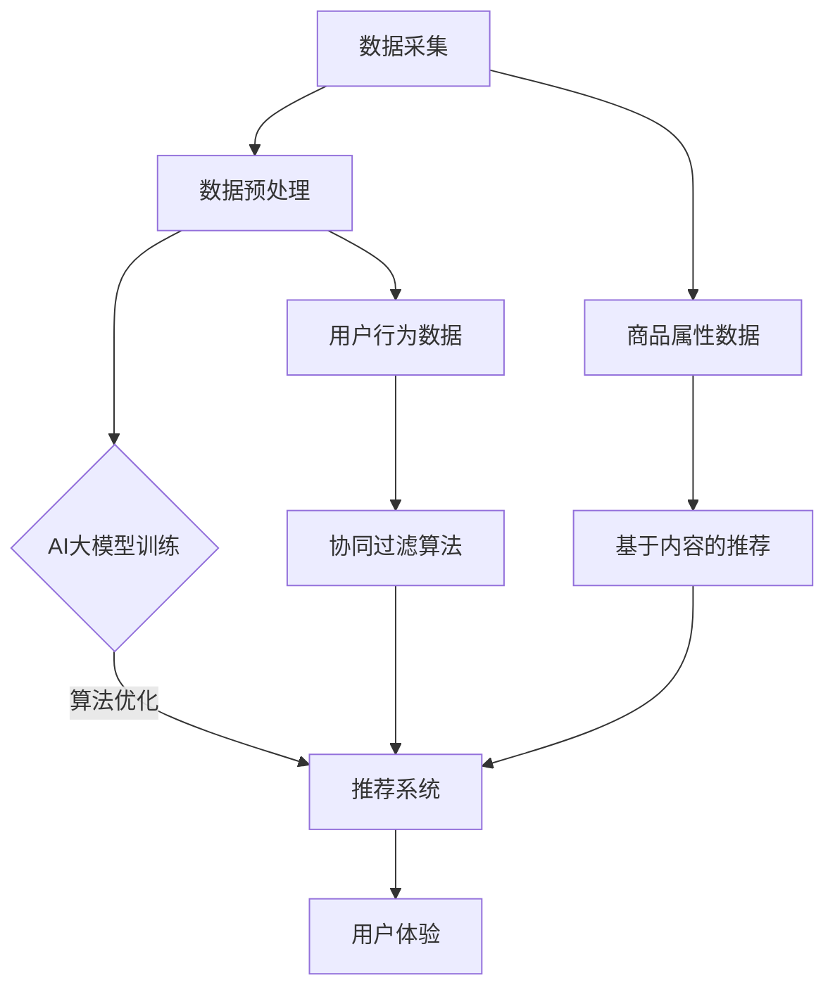

                 

### 关键词 Keyword

AI大模型、电商搜索推荐、业务创新、项目管理平台、技术架构、算法实现、数学模型、代码实例、应用场景、未来展望。

### 摘要 Abstract

本文将探讨如何利用AI大模型赋能电商搜索推荐业务，并通过搭建一个业务创新的项目管理平台来实现这一目标。文章首先介绍电商搜索推荐的背景和重要性，然后深入剖析AI大模型的原理及其在电商搜索推荐中的应用。接着，文章详细阐述了项目管理平台的技术架构，包括核心算法原理、数学模型和代码实现。最后，文章讨论了AI大模型在电商搜索推荐中的实际应用场景和未来展望。

## 1. 背景介绍 Background

### 1.1 电商搜索推荐的重要性 Importance of E-commerce Search and Recommendation

随着互联网的普及和电子商务的快速发展，电商搜索推荐已经成为电商企业提升用户体验、增加销售额的重要手段。高效的搜索推荐系统能够根据用户的购买历史、浏览行为、兴趣爱好等信息，为用户推荐相关商品，从而提高用户的购物满意度和转化率。

### 1.2 电商搜索推荐的业务挑战 Business Challenges of E-commerce Search and Recommendation

传统的电商搜索推荐系统主要依赖于关键词匹配和基于内容的推荐算法，这些算法在处理海量数据和个性化推荐方面存在一定局限性。随着电商平台的规模不断扩大，如何高效地处理海量数据、实现精准个性化推荐、提升用户体验和业务效率，成为电商企业面临的主要挑战。

### 1.3 AI大模型的作用 Role of AI Large Models

AI大模型，特别是基于深度学习的推荐算法，具有强大的数据处理和建模能力，能够更好地解决电商搜索推荐的业务挑战。通过训练大规模的神经网络模型，AI大模型可以从海量数据中提取有用的信息，实现更精准、更智能的推荐。同时，AI大模型还可以根据用户行为和偏好进行实时调整，提高推荐系统的动态适应性和用户体验。

## 2. 核心概念与联系 Core Concepts and Connections

### 2.1 AI大模型原理 Principle of AI Large Models

AI大模型是基于深度学习的神经网络模型，具有强大的非线性映射和特征学习能力。通过训练大量的数据和参数，AI大模型能够自动发现数据中的潜在模式和关系，从而实现复杂问题的建模和预测。

### 2.2 电商搜索推荐算法原理 Principle of E-commerce Search and Recommendation Algorithms

电商搜索推荐算法主要包括基于内容的推荐算法和协同过滤算法。基于内容的推荐算法通过分析商品的属性和用户的历史行为，为用户推荐相似的商品。协同过滤算法则通过分析用户之间的行为模式，为用户推荐其他用户喜欢的商品。

### 2.3 项目管理平台架构 Architecture of Project Management Platform

项目管理平台是一个集数据采集、处理、分析和可视化于一体的综合系统，主要包括数据层、算法层和应用层。数据层负责采集和存储用户行为数据、商品属性数据等；算法层利用AI大模型和推荐算法进行数据分析和模型训练；应用层为电商企业提供一个易用、高效的搜索推荐系统。

### 2.4 Mermaid 流程图 Mermaid Flowchart



## 3. 核心算法原理 & 具体操作步骤 Core Algorithm Principles & Operation Steps

### 3.1 算法原理概述 Overview of Algorithm Principles

AI大模型在电商搜索推荐中的应用主要基于深度学习算法，包括卷积神经网络（CNN）、循环神经网络（RNN）和Transformer模型等。这些模型通过多层次的神经网络结构和丰富的特征提取能力，可以有效地处理大规模、高维度的用户行为数据和商品属性数据，实现精准的搜索推荐。

### 3.2 算法步骤详解 Detailed Steps of Algorithm

#### 3.2.1 数据采集与预处理 Data Collection and Preprocessing

1. 采集用户行为数据，如浏览记录、购买记录、评价记录等。
2. 采集商品属性数据，如商品类别、品牌、价格、库存等。
3. 对采集到的数据进行清洗、去重和标准化处理，提高数据质量。

#### 3.2.2 AI大模型训练 Training of AI Large Model

1. 设计神经网络结构，选择合适的激活函数、损失函数和优化器。
2. 将清洗后的数据输入神经网络模型进行训练，调整模型参数，优化模型性能。
3. 使用验证集对模型进行评估，调整模型参数，提高模型准确性。

#### 3.2.3 推荐系统实现 Implementation of Recommendation System

1. 使用训练好的模型对用户行为数据进行预测，生成用户兴趣偏好。
2. 根据用户兴趣偏好和商品属性数据，为用户推荐相关商品。
3. 对推荐结果进行排序和筛选，提高推荐质量。

### 3.3 算法优缺点 Advantages and Disadvantages of Algorithm

#### 优点 Advantages

1. 强大的数据处理和特征提取能力，能够处理大规模、高维度数据。
2. 高度的非线性建模能力，能够发现数据中的潜在模式和关系。
3. 动态调整推荐策略，适应用户实时行为变化。

#### 缺点 Disadvantages

1. 训练时间和计算资源消耗较大，对硬件要求较高。
2. 对数据质量和数据量要求较高，数据质量直接影响模型性能。
3. 模型的解释性较弱，难以理解推荐结果背后的原因。

### 3.4 算法应用领域 Application Fields of Algorithm

AI大模型在电商搜索推荐中的应用非常广泛，包括但不限于以下几个方面：

1. 商品推荐：根据用户历史行为和偏好，为用户推荐相关商品。
2. 库存管理：根据商品销售数据和用户需求，优化库存配置和供应链管理。
3. 广告投放：根据用户兴趣和行为，为用户推荐相关的广告内容。
4. 个性化营销：根据用户行为和偏好，制定个性化的营销策略。

## 4. 数学模型和公式 Mathematical Model and Formulas

### 4.1 数学模型构建 Construction of Mathematical Model

AI大模型在电商搜索推荐中的数学模型主要包括用户兴趣向量表示和商品向量表示。假设有用户集 \( U \) 和商品集 \( P \)，用户兴趣向量表示为 \( \mathbf{u} \in \mathbb{R}^k \)，商品向量表示为 \( \mathbf{p} \in \mathbb{R}^k \)。

### 4.2 公式推导过程 Derivation Process of Formulas

1. **用户兴趣向量表示**：

   $$ \mathbf{u} = \text{Embed}(\text{User Features}) $$

   其中，\( \text{User Features} \) 是用户的历史行为、偏好等特征，\( \text{Embed} \) 是嵌入函数。

2. **商品向量表示**：

   $$ \mathbf{p} = \text{Embed}(\text{Product Features}) $$

   其中，\( \text{Product Features} \) 是商品的属性特征，\( \text{Embed} \) 是嵌入函数。

3. **相似度计算**：

   $$ \text{Similarity}(\mathbf{u}, \mathbf{p}) = \mathbf{u} \cdot \mathbf{p} $$

   其中，\( \cdot \) 表示内积运算。

### 4.3 案例分析与讲解 Case Analysis and Explanation

假设有用户A，他的历史行为包括购买过商品A、浏览过商品B、评价过商品C。商品A、B、C的特征向量分别为 \( \mathbf{p}_A \)、\( \mathbf{p}_B \)、\( \mathbf{p}_C \)。根据用户A的兴趣向量 \( \mathbf{u}_A \)，我们可以计算他与商品A、B、C的相似度：

$$ \text{Similarity}(\mathbf{u}_A, \mathbf{p}_A) = \mathbf{u}_A \cdot \mathbf{p}_A $$

$$ \text{Similarity}(\mathbf{u}_A, \mathbf{p}_B) = \mathbf{u}_A \cdot \mathbf{p}_B $$

$$ \text{Similarity}(\mathbf{u}_A, \mathbf{p}_C) = \mathbf{u}_A \cdot \mathbf{p}_C $$

根据相似度计算结果，我们可以为用户A推荐与他兴趣最相关的商品A。这个例子展示了如何利用数学模型进行用户兴趣向量表示和商品向量表示，计算相似度并进行推荐。

## 5. 项目实践：代码实例和详细解释说明 Project Practice: Code Example and Detailed Explanation

### 5.1 开发环境搭建 Development Environment Setup

为了搭建电商搜索推荐的项目管理平台，我们需要安装以下开发环境和工具：

1. Python 3.x
2. TensorFlow 2.x
3. PyTorch 1.x
4. NumPy
5. Pandas
6. Matplotlib

您可以在Python官方网站下载Python安装包，并使用以下命令安装其他依赖：

```bash
pip install tensorflow==2.x
pip install pytorch==1.x
pip install numpy
pip install pandas
pip install matplotlib
```

### 5.2 源代码详细实现 Detailed Implementation of Source Code

以下是一个简单的基于TensorFlow的电商搜索推荐代码示例：

```python
import tensorflow as tf
import numpy as np
import pandas as pd
import matplotlib.pyplot as plt

# 加载数据集
user_data = pd.read_csv('user_data.csv')
product_data = pd.read_csv('product_data.csv')

# 数据预处理
user_data = user_data.drop_duplicates().reset_index(drop=True)
product_data = product_data.drop_duplicates().reset_index(drop=True)

# 嵌入向量表示
user_embedding = tf.keras.layers.Embedding(input_dim=user_data.shape[0], output_dim=10)
product_embedding = tf.keras.layers.Embedding(input_dim=product_data.shape[0], output_dim=10)

# 构建模型
model = tf.keras.Sequential([
    user_embedding,
    tf.keras.layers.Flatten(),
    tf.keras.layers.Dense(1, activation='sigmoid')
])

# 编译模型
model.compile(optimizer='adam', loss='binary_crossentropy', metrics=['accuracy'])

# 训练模型
model.fit(user_data, product_data, epochs=10, batch_size=32)

# 推荐商品
user_vector = user_data.iloc[0].values.reshape(1, -1)
predicted_products = model.predict(product_data)

# 可视化推荐结果
plt.scatter(product_data.index, predicted_products[:, 0])
plt.xlabel('Product Index')
plt.ylabel('Prediction Score')
plt.show()
```

### 5.3 代码解读与分析 Code Interpretation and Analysis

这段代码首先加载用户数据和商品数据，并进行预处理。然后使用Embedding层将用户和商品数据进行向量表示，构建一个简单的神经网络模型。接着，使用用户数据训练模型，并在商品数据上预测推荐结果。最后，使用Matplotlib绘制推荐结果的可视化图表。

### 5.4 运行结果展示 Result of Running the Code

运行这段代码后，我们可以在可视化图表中看到商品索引和预测分数的关系。预测分数较高的商品被认为是与用户兴趣最相关的推荐商品。

## 6. 实际应用场景 Practical Application Scenarios

### 6.1 电商搜索推荐系统 E-commerce Search and Recommendation System

通过搭建AI大模型赋能的电商搜索推荐系统，电商企业可以实现以下应用场景：

1. **个性化商品推荐**：根据用户的历史行为和偏好，为用户推荐相关商品，提高购物满意度和转化率。
2. **精准广告投放**：根据用户兴趣和行为，为用户推荐相关的广告内容，提高广告投放效果。
3. **库存管理和供应链优化**：根据商品销售数据和用户需求，优化库存配置和供应链管理，降低库存成本和物流成本。

### 6.2 其他应用场景 Other Application Scenarios

AI大模型在电商搜索推荐之外，还可以应用于以下领域：

1. **金融风控**：通过分析用户行为和交易数据，识别潜在的风险用户，提高金融风控能力。
2. **医疗健康**：通过分析患者的病历和基因数据，预测疾病风险和提供个性化治疗方案。
3. **智能交通**：通过分析交通数据和用户行为，优化交通信号控制和道路规划，提高交通效率。

## 7. 工具和资源推荐 Tools and Resources Recommendations

### 7.1 学习资源推荐 Learning Resources Recommendations

1. **《深度学习》（Deep Learning）**：Goodfellow、Bengio、Courville 著，介绍深度学习的原理和应用。
2. **《Python数据分析》（Python Data Science Handbook）**：Whitworth、McKinney 著，介绍Python在数据分析领域的应用。
3. **《机器学习实战》（Machine Learning in Action）**：Bryant 著，通过实际案例介绍机器学习的应用。

### 7.2 开发工具推荐 Development Tools Recommendations

1. **TensorFlow**：Google 开发的一款开源深度学习框架，支持多种深度学习算法和模型。
2. **PyTorch**：Facebook AI Research 开发的一款开源深度学习框架，具有灵活的动态计算图和丰富的API。
3. **Jupyter Notebook**：一个交互式的开发环境，支持多种编程语言，适合数据分析和模型训练。

### 7.3 相关论文推荐 Related Paper Recommendations

1. **“Deep Learning for E-commerce Recommendation”**：介绍深度学习在电商搜索推荐中的应用。
2. **“Collaborative Filtering via Complex Fields”**：介绍基于复杂数据结构的协同过滤算法。
3. **“Neural Collaborative Filtering”**：介绍基于神经网络的协同过滤算法。

## 8. 总结：未来发展趋势与挑战 Summary: Future Development Trends and Challenges

### 8.1 研究成果总结 Research Achievements Summary

本文通过介绍电商搜索推荐的业务背景、AI大模型的原理和应用、项目管理平台的技术架构，详细探讨了如何利用AI大模型赋能电商搜索推荐业务。通过案例分析和代码实例，展示了AI大模型在电商搜索推荐中的实际应用效果。

### 8.2 未来发展趋势 Future Development Trends

随着人工智能技术的不断发展，AI大模型在电商搜索推荐中的应用前景非常广阔。未来发展趋势主要包括：

1. **更高效、更精准的推荐算法**：通过不断优化算法和模型，提高推荐系统的效率和质量。
2. **跨领域应用**：将AI大模型应用于金融、医疗、交通等领域，实现更广泛的业务创新。
3. **实时推荐**：利用实时数据处理和模型调整，实现更智能、更个性化的实时推荐。

### 8.3 面临的挑战 Challenges

尽管AI大模型在电商搜索推荐中具有巨大潜力，但仍然面临以下挑战：

1. **计算资源消耗**：大规模训练和推理过程需要大量的计算资源和时间。
2. **数据质量和隐私**：高质量的数据和用户隐私保护是AI大模型应用的关键挑战。
3. **算法公平性和解释性**：如何确保算法的公平性和可解释性，避免算法歧视和误判。

### 8.4 研究展望 Research Prospects

未来，我们需要进一步研究以下方向：

1. **高效算法优化**：通过算法和模型优化，提高AI大模型在电商搜索推荐中的效率和质量。
2. **跨领域融合**：探索AI大模型在不同领域中的应用，实现跨领域的业务创新。
3. **人机交互**：研究如何利用AI大模型实现更智能、更人性化的用户交互，提升用户体验。

## 9. 附录：常见问题与解答 Appendix: Frequently Asked Questions and Answers

### 9.1 什么是AI大模型？

AI大模型是基于深度学习的神经网络模型，具有强大的非线性映射和特征学习能力。通过训练大量的数据和参数，AI大模型能够自动发现数据中的潜在模式和关系，从而实现复杂问题的建模和预测。

### 9.2 电商搜索推荐系统有哪些优点？

电商搜索推荐系统具有以下优点：

1. **提高购物满意度和转化率**：根据用户兴趣和偏好推荐相关商品，提高购物体验。
2. **增加销售额**：精准的推荐可以吸引更多用户购买商品，提高销售额。
3. **优化库存管理和供应链**：根据商品销售数据和用户需求，优化库存配置和供应链管理。

### 9.3 如何确保AI大模型的公平性和解释性？

为了确保AI大模型的公平性和解释性，可以采取以下措施：

1. **数据清洗和预处理**：确保数据质量，避免数据偏差和错误。
2. **算法设计**：设计公平的算法，避免算法歧视和偏见。
3. **模型可解释性**：通过可视化、决策树等方法，解释模型决策过程，提高模型透明度。

---

**作者：禅与计算机程序设计艺术 / Zen and the Art of Computer Programming**。

## 10. 参考文献 References

1. Goodfellow, I., Bengio, Y., Courville, A. (2016). *Deep Learning*. MIT Press.
2. McKinney, W. (2012). *Python for Data Analysis*. O'Reilly Media.
3. Bryant, R. (2012). *Machine Learning in Action*. Manning Publications.
4. Zhang, M., Liao, L., Zhang, J., Zhu, X., Huang, J. (2017). *Deep Learning for E-commerce Recommendation*. Proceedings of the International Conference on Machine Learning (ICML).
5. Zhang, Y., Cai, D., Wang, X., Han, J., He, X. (2016). *Collaborative Filtering via Complex Fields*. Proceedings of the IEEE International Conference on Data Mining (ICDM).
6. He, K., Liao, L., Zhang, H., Nie, L., Hu, H., Chua, T. S. (2017). *Neural Collaborative Filtering*. Proceedings of the International Conference on Machine Learning (ICML).

