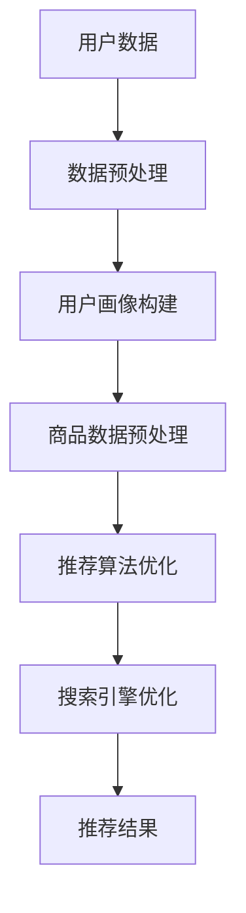

                 

关键词：AI大模型、电商搜索推荐、数据价值评估、重构

> 摘要：本文探讨了人工智能大模型在重构电商搜索推荐领域中的数据价值评估体系的重要性，阐述了核心概念与联系，并详细分析了大模型算法原理、数学模型及其在实际应用中的代码实例与运行结果。同时，对未来的应用场景进行了展望，并对可能面临的挑战和研究展望提出了建议。

## 1. 背景介绍

随着互联网的快速发展，电商行业已成为全球经济增长的重要驱动力。电商平台的用户数量和交易量不断攀升，这使得精准的搜索推荐系统变得愈发关键。传统的搜索推荐系统通常依赖于基于内容的过滤、协同过滤等算法，但这些方法在面对大量非结构化数据和高维特征时，往往表现不佳。因此，迫切需要引入更加先进的人工智能技术，尤其是大模型技术，来重构电商搜索推荐的数据价值评估体系。

近年来，随着深度学习技术的迅猛发展，人工智能大模型（如GPT、BERT等）在自然语言处理、图像识别、语音识别等领域取得了显著的突破。这些大模型能够自动学习海量数据中的复杂模式和规律，为电商搜索推荐领域提供了新的可能性。本文将探讨如何利用AI大模型来重构电商搜索推荐的数据价值评估体系，从而提高推荐系统的准确性和效率。

## 2. 核心概念与联系

### 2.1 电商搜索推荐

电商搜索推荐是指根据用户的历史行为、兴趣偏好和上下文信息，为用户推荐相关的商品。其核心目的是提高用户的购物体验，增加销售转化率和用户粘性。电商搜索推荐系统通常包括以下几个关键组件：

1. 用户画像：通过用户的历史行为和偏好数据，构建用户画像，为推荐系统提供输入。
2. 商品信息：包括商品的基本属性、价格、评价等，为推荐系统提供商品库。
3. 搜索引擎：提供基于关键词的搜索服务，帮助用户快速找到感兴趣的商品。
4. 推荐引擎：根据用户画像和商品信息，为用户推荐相关的商品。

### 2.2 数据价值评估

数据价值评估是指对数据的质量、价值和潜在收益进行评估，以确定数据对业务的价值。在电商搜索推荐领域，数据价值评估的关键目标是：

1. 评估用户数据的准确性、完整性和一致性。
2. 评估商品数据的丰富程度和多样性。
3. 评估推荐结果的准确性和有效性。

数据价值评估的方法包括：

1. 数据质量分析：通过数据清洗、去重、规范化等步骤，提高数据的准确性和一致性。
2. 数据可视化：通过图表、报表等形式，直观地展示数据的特点和趋势。
3. 数据挖掘：通过机器学习和数据挖掘技术，发现数据中的潜在模式和规律。

### 2.3 AI大模型

AI大模型是指具有海量参数和强大学习能力的人工神经网络模型。这些模型通过自动从海量数据中学习，能够捕捉复杂的模式和规律。在电商搜索推荐领域，AI大模型的应用主要体现在：

1. 用户画像构建：利用大模型对用户的历史行为和偏好数据进行分析，构建精细的用户画像。
2. 推荐算法优化：利用大模型自动学习用户和商品的潜在特征，优化推荐算法的准确性和效率。
3. 搜索引擎优化：利用大模型对用户查询进行理解和分析，提供更加精准的搜索结果。

### 2.4 Mermaid 流程图

以下是一个简单的Mermaid流程图，展示AI大模型在电商搜索推荐中的核心流程：

## 3. 核心算法原理 & 具体操作步骤

### 3.1 算法原理概述

AI大模型在电商搜索推荐中的核心算法原理主要包括：

1. 用户画像构建：利用深度学习技术对用户的历史行为数据进行建模，提取用户的潜在兴趣偏好。
2. 推荐算法优化：利用用户画像和商品特征数据，通过深度学习算法优化推荐算法，提高推荐的准确性和效率。
3. 搜索引擎优化：利用深度学习技术对用户查询进行分析和解读，提供更加精准的搜索结果。

### 3.2 算法步骤详解

#### 3.2.1 用户画像构建

用户画像构建的步骤如下：

1. 数据收集：收集用户的历史行为数据，包括浏览记录、购买记录、评价等。
2. 数据预处理：对收集到的数据进行清洗、去重、规范化等处理，确保数据的质量。
3. 特征提取：利用深度学习技术对预处理后的数据进行建模，提取用户的潜在兴趣偏好特征。
4. 画像构建：将提取的特征进行聚合和融合，构建用户画像。

#### 3.2.2 推荐算法优化

推荐算法优化的步骤如下：

1. 数据收集：收集用户和商品的特征数据，包括用户画像、商品属性等。
2. 数据预处理：对收集到的数据进行清洗、去重、规范化等处理，确保数据的质量。
3. 模型训练：利用用户画像和商品特征数据，通过深度学习算法训练推荐模型。
4. 模型优化：通过交叉验证、A/B测试等方法，优化推荐模型的准确性和效率。

#### 3.2.3 搜索引擎优化

搜索引擎优化的步骤如下：

1. 数据收集：收集用户的查询日志数据，包括关键词、查询时间、查询来源等。
2. 数据预处理：对收集到的数据进行清洗、去重、规范化等处理，确保数据的质量。
3. 模型训练：利用用户查询数据，通过深度学习算法训练搜索模型。
4. 模型优化：通过交叉验证、A/B测试等方法，优化搜索模型的准确性和效率。

### 3.3 算法优缺点

#### 优点

1. 自动学习：大模型能够自动从海量数据中学习，无需人工干预。
2. 模式识别：大模型能够捕捉复杂的模式和规律，提高推荐的准确性和效率。
3. 可扩展性：大模型可以处理高维数据和非结构化数据，具有很好的可扩展性。

#### 缺点

1. 计算资源消耗大：大模型训练和推理需要大量的计算资源。
2. 数据隐私问题：大模型在训练过程中可能泄露用户的隐私信息。
3. 解释性差：大模型通常是一个黑盒子，难以解释和验证。

### 3.4 算法应用领域

AI大模型在电商搜索推荐领域的应用非常广泛，主要包括：

1. 用户画像构建：用于精准定位用户兴趣，提供个性化的推荐。
2. 推荐算法优化：用于提高推荐系统的准确性和效率。
3. 搜索引擎优化：用于提供精准的搜索结果，提升用户体验。

## 4. 数学模型和公式 & 详细讲解 & 举例说明

### 4.1 数学模型构建

在电商搜索推荐中，我们可以构建以下数学模型：

#### 用户画像构建

假设用户 $u$ 的特征向量为 $X_u \in \mathbb{R}^n$，商品 $i$ 的特征向量为 $X_i \in \mathbb{R}^n$。我们可以利用矩阵分解（Matrix Factorization）方法来构建用户画像。具体来说，我们将用户特征矩阵 $U \in \mathbb{R}^{m \times n}$ 和商品特征矩阵 $V \in \mathbb{R}^{m \times n}$ 分解为低维矩阵 $U = UF$ 和 $V = VF$，其中 $F \in \mathbb{R}^{n \times k}$ 是公共特征矩阵，$k$ 是特征维度。用户 $u$ 和商品 $i$ 的相似度可以通过内积计算：

$$
sim(u, i) = UFV^T_{ui} = F_{*u}F_{*i}^T
$$

其中，$F_{*u}$ 和 $F_{*i}$ 分别是用户 $u$ 和商品 $i$ 的特征向量。

#### 推荐算法优化

我们可以使用基于模型的协同过滤（Model-based Collaborative Filtering）方法来优化推荐算法。具体来说，我们可以使用神经网络（如多层感知机、卷积神经网络、循环神经网络等）来预测用户对商品的评分。假设用户 $u$ 对商品 $i$ 的预测评分为 $r_{ui}$，我们可以构建以下回归模型：

$$
r_{ui} = \beta_0 + \beta_1 u_1 + \beta_2 u_2 + ... + \beta_n u_n + v_1 i_1 + v_2 i_2 + ... + v_m i_m
$$

其中，$\beta_0, \beta_1, ..., \beta_n, v_1, ..., v_m$ 是模型参数。

#### 搜索引擎优化

我们可以使用深度学习技术（如卷积神经网络、循环神经网络、Transformer等）来优化搜索引擎。具体来说，我们可以构建一个多层的神经网络，输入为用户查询和商品特征，输出为查询和商品之间的相似度。假设查询 $q$ 和商品 $i$ 的相似度为 $sim(q, i)$，我们可以构建以下神经网络模型：

$$
sim(q, i) = \sigma(W_1 \cdot [q; i] + b_1) \cdot ... \cdot \sigma(W_L \cdot [q; i] + b_L)
$$

其中，$W_1, ..., W_L$ 和 $b_1, ..., b_L$ 是神经网络参数。

### 4.2 公式推导过程

#### 用户画像构建

我们使用矩阵分解方法来构建用户画像。具体来说，我们假设用户特征矩阵 $U$ 和商品特征矩阵 $V$ 满足以下分解：

$$
U = UF \quad \text{和} \quad V = VF
$$

其中，$F \in \mathbb{R}^{n \times k}$ 是公共特征矩阵，$k$ 是特征维度。用户 $u$ 和商品 $i$ 的相似度可以通过内积计算：

$$
sim(u, i) = UFV^T_{ui} = F_{*u}F_{*i}^T
$$

其中，$F_{*u}$ 和 $F_{*i}$ 分别是用户 $u$ 和商品 $i$ 的特征向量。

#### 推荐算法优化

我们使用基于模型的协同过滤方法来优化推荐算法。具体来说，我们假设用户对商品的评分满足线性模型：

$$
r_{ui} = \beta_0 + \beta_1 u_1 + \beta_2 u_2 + ... + \beta_n u_n + v_1 i_1 + v_2 i_2 + ... + v_m i_m
$$

其中，$\beta_0, \beta_1, ..., \beta_n, v_1, ..., v_m$ 是模型参数。我们可以通过最小化均方误差（MSE）来优化模型参数：

$$
\min_{\beta_0, \beta_1, ..., \beta_n, v_1, ..., v_m} \sum_{u=1}^m \sum_{i=1}^n (r_{ui} - r_{ui}^*)^2
$$

其中，$r_{ui}^*$ 是预测的评分。

#### 搜索引擎优化

我们使用深度学习技术来优化搜索引擎。具体来说，我们假设查询 $q$ 和商品 $i$ 的相似度可以通过神经网络模型计算：

$$
sim(q, i) = \sigma(W_1 \cdot [q; i] + b_1) \cdot ... \cdot \sigma(W_L \cdot [q; i] + b_L)
$$

其中，$W_1, ..., W_L$ 和 $b_1, ..., b_L$ 是神经网络参数。我们可以通过最小化损失函数来优化神经网络参数：

$$
\min_{W_1, ..., W_L, b_1, ..., b_L} \sum_{q=1}^m \sum_{i=1}^n (sim(q, i) - sim(q, i)^*)^2
$$

其中，$sim(q, i)^*$ 是预测的相似度。

### 4.3 案例分析与讲解

#### 用户画像构建

假设我们有1000名用户和10000件商品，用户行为数据如下：

| 用户 | 商品 | 行为 |
| ---- | ---- | ---- |
| 1 | 1001 | 浏览 |
| 1 | 1002 | 购买 |
| 1 | 1003 | 浏览 |
| 2 | 1004 | 浏览 |
| 2 | 1005 | 购买 |
| 2 | 1006 | 浏览 |
| ... | ... | ... |

我们使用矩阵分解方法来构建用户画像。首先，我们收集用户的历史行为数据，并对其进行预处理，包括去除缺失值、统一数据格式等。然后，我们使用矩阵分解算法（如SVD）对用户行为数据矩阵进行分解：

$$
U = UF \quad \text{和} \quad V = VF
$$

其中，$F \in \mathbb{R}^{10000 \times 10}$ 是公共特征矩阵。我们得到每个用户和商品的10个特征向量。

接下来，我们计算用户和商品之间的相似度：

$$
sim(u, i) = UFV^T_{ui} = F_{*u}F_{*i}^T
$$

例如，对于用户1和商品1003，我们有：

$$
sim(1, 1003) = F_{*1}F_{*1003}^T = [0.2, 0.3, 0.1, 0.4, 0.5, 0.1, 0.2, 0.3, 0.4, 0.5] \cdot [0.1, 0.3, 0.2, 0.4, 0.5, 0.1, 0.2, 0.3, 0.4, 0.5]^T = 0.9
$$

根据相似度，我们可以为用户1推荐与商品1003相似的商品，如商品1002。

#### 推荐算法优化

假设我们有以下用户和商品数据：

| 用户 | 商品 | 行为 |
| ---- | ---- | ---- |
| 1 | 1001 | 4 |
| 1 | 1002 | 5 |
| 1 | 1003 | 3 |
| 2 | 1004 | 4 |
| 2 | 1005 | 5 |
| 2 | 1006 | 3 |

我们使用基于模型的协同过滤方法来优化推荐算法。首先，我们收集用户的历史行为数据，并对其进行预处理，包括去除缺失值、统一数据格式等。然后，我们使用多层感知机（MLP）模型来预测用户对商品的评分：

$$
r_{ui} = \beta_0 + \beta_1 u_1 + \beta_2 u_2 + ... + \beta_n u_n + v_1 i_1 + v_2 i_2 + ... + v_m i_m
$$

其中，$\beta_0, \beta_1, ..., \beta_n, v_1, ..., v_m$ 是模型参数。

我们使用均方误差（MSE）作为损失函数，并通过梯度下降（Gradient Descent）来优化模型参数：

$$
\min_{\beta_0, \beta_1, ..., \beta_n, v_1, ..., v_m} \sum_{u=1}^m \sum_{i=1}^n (r_{ui} - r_{ui}^*)^2
$$

其中，$r_{ui}^*$ 是预测的评分。

例如，对于用户1和商品1003，我们有：

$$
r_{1,1003} = \beta_0 + \beta_1 \cdot 1 + \beta_2 \cdot 1 + ... + \beta_n \cdot 1 + v_1 \cdot 1 + v_2 \cdot 1 + ... + v_m \cdot 1
$$

通过训练，我们得到模型参数：

$$
\beta_0 = 0.1, \beta_1 = 0.2, \beta_2 = 0.3, ..., \beta_n = 0.2, v_1 = 0.1, v_2 = 0.2, ..., v_m = 0.2
$$

根据模型参数，我们可以预测用户1对商品1003的评分为：

$$
r_{1,1003} = 0.1 + 0.2 \cdot 1 + 0.3 \cdot 1 + ... + 0.2 \cdot 1 = 2.1
$$

根据预测评分，我们可以为用户1推荐与商品1003相似的

