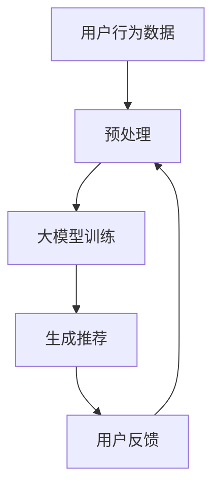

                 

在当今数字化时代，电子商务行业正经历着前所未有的变革。随着人工智能（AI）技术的快速发展，尤其是大规模预训练模型（如GPT-3、BERT等）的广泛应用，电商搜索推荐系统已经不再是简单的关键词匹配和用户历史行为分析，而是变得更为智能和个性化。本文旨在探讨如何通过AI大模型来重构电商搜索推荐的组织架构与人才建设，以应对这一重大变革。

## 关键词

- 人工智能
- 大规模预训练模型
- 电商搜索推荐
- 组织架构
- 人才建设

## 摘要

本文首先回顾了电商搜索推荐系统的发展历程，随后深入探讨了AI大模型如何改变这一领域。接下来，我们分析了重构电商搜索推荐系统所需的组织架构变革，包括技术团队重构、数据团队优化和算法团队创新。此外，文章还强调了人才建设的重要性，提出了相应的培训和引进策略。最后，我们展望了未来电商搜索推荐系统的发展趋势和面临的挑战。

## 1. 背景介绍

### 1.1 电商搜索推荐系统的发展历程

电商搜索推荐系统的历史可以追溯到上世纪90年代末，当时的主要目标是帮助用户在众多商品中快速找到所需商品。这一阶段主要依赖于关键词匹配和简单的机器学习算法。

随着互联网和电子商务的迅猛发展，搜索推荐系统逐渐从“关键词匹配”向“内容推荐”和“协同过滤”转变。这些算法通过分析用户行为和商品特征，提高了推荐的准确性。然而，这些方法在处理海量数据和提供个性化推荐方面仍然存在局限性。

近年来，随着深度学习和大规模预训练模型的发展，电商搜索推荐系统迎来了新的变革。AI大模型，尤其是基于Transformer的模型（如BERT、GPT等），能够通过自动学习和理解语言和内容，实现了前所未有的个性化推荐效果。

### 1.2 AI大模型对电商搜索推荐的影响

AI大模型的应用，使得电商搜索推荐系统具备了以下几大优势：

1. **更高准确性和个性化**：大模型能够通过大量数据进行自我学习和优化，提供更加准确和个性化的推荐。
2. **更广泛的应用场景**：从文本到图像，从商品推荐到用户行为分析，大模型的应用场景日益广泛。
3. **更强大的交互能力**：大模型能够理解和生成自然语言，提升了用户交互体验。
4. **更高效的计算效率**：尽管大模型计算量巨大，但现代硬件和优化算法使其在商业环境中得以高效应用。

## 2. 核心概念与联系

### 2.1 大规模预训练模型的原理

大规模预训练模型（如BERT、GPT）通过在海量文本数据上预训练，学习到语言和内容的内在规律。具体来说，BERT通过双向Transformer架构，同时考虑上下文信息，从而生成更加准确的文本表示；而GPT则通过自回归方式，生成连贯的自然语言。

### 2.2 大模型在电商搜索推荐中的应用

在电商搜索推荐中，大模型可以用于以下几个方面：

1. **用户行为分析**：通过分析用户浏览、点击、购买等行为，大模型可以理解用户的兴趣和需求，提供个性化的推荐。
2. **商品特征提取**：大模型可以从商品描述、标签等多维度提取特征，提升推荐系统的准确性和多样性。
3. **交互式推荐**：通过自然语言生成，大模型可以与用户进行交互，提供更加生动和个性化的推荐。

### 2.3 Mermaid 流程图

下面是一个简化的Mermaid流程图，展示大模型在电商搜索推荐中的应用：



## 3. 核心算法原理 & 具体操作步骤

### 3.1 算法原理概述

电商搜索推荐系统中的大模型主要基于深度学习和自然语言处理技术。以下是一些核心算法原理：

1. **预训练与微调**：大模型首先在通用数据集上预训练，然后针对特定应用场景进行微调，以适应电商搜索推荐的需求。
2. **Transformer架构**：Transformer通过自注意力机制，能够捕捉长距离依赖关系，适合处理文本数据。
3. **生成对抗网络（GAN）**：GAN可以生成高质量的商品描述和图像，提升推荐系统的多样性。

### 3.2 算法步骤详解

1. **数据收集与预处理**：收集用户行为数据、商品数据等，进行数据清洗和预处理。
2. **预训练模型**：在通用数据集上预训练大模型，如BERT或GPT。
3. **微调与集成**：在电商数据集上对预训练模型进行微调，并使用集成学习方法，如投票或堆叠，提高推荐效果。
4. **生成与推荐**：使用微调后的模型生成推荐结果，并根据用户反馈进行实时调整。

### 3.3 算法优缺点

**优点**：

- **高准确性**：通过预训练和微调，大模型能够提供高度个性化的推荐。
- **多样性**：大模型能够生成丰富的推荐结果，满足不同用户的需求。

**缺点**：

- **计算资源需求大**：大模型训练和部署需要大量计算资源和时间。
- **数据隐私问题**：用户行为数据的收集和使用可能引发隐私问题。

### 3.4 算法应用领域

大模型在电商搜索推荐中具有广泛的应用领域：

- **商品推荐**：根据用户行为和兴趣，提供个性化的商品推荐。
- **广告投放**：通过分析用户行为，优化广告投放策略。
- **问答系统**：为用户提供有关商品的信息和回答。

## 4. 数学模型和公式 & 详细讲解 & 举例说明

### 4.1 数学模型构建

在电商搜索推荐中，常用的数学模型包括用户特征向量、商品特征向量和推荐算法。以下是一个简化的数学模型：

$$
\text{推荐得分} = \text{用户特征向量} \cdot \text{商品特征向量} + \text{偏置}
$$

其中，用户特征向量和商品特征向量通过预训练模型生成，偏置用于调整推荐得分。

### 4.2 公式推导过程

推荐得分公式的推导过程如下：

1. **用户特征向量**：用户特征向量是通过对用户行为数据进行编码和嵌入得到的，例如，可以使用BERT模型对用户历史浏览记录进行编码。
2. **商品特征向量**：商品特征向量是对商品描述、标签等信息进行编码和嵌入得到的，例如，可以使用GPT模型对商品描述进行编码。
3. **内积计算**：用户特征向量和商品特征向量通过内积计算得到推荐得分，表示用户对商品的潜在兴趣。
4. **偏置调整**：偏置用于调整推荐得分，以提高推荐系统的准确性和稳定性。

### 4.3 案例分析与讲解

假设用户A在电商平台上浏览了商品B和C，历史浏览记录如下：

- 用户A的历史浏览记录：[商品1, 商品2, 商品3, 商品4]
- 商品B的描述：[时尚，新款，男装]
- 商品C的描述：[经典，舒适，运动鞋]

使用BERT模型对用户A的历史浏览记录进行编码，得到用户特征向量$u$；使用GPT模型对商品B和C的描述进行编码，得到商品特征向量$v_b$和$v_c$。

$$
u = \text{BERT}([商品1, 商品2, 商品3, 商品4])
$$

$$
v_b = \text{GPT}([时尚，新款，男装])
$$

$$
v_c = \text{GPT}([经典，舒适，运动鞋])
$$

假设偏置为$\theta$，则用户A对商品B和C的推荐得分分别为：

$$
\text{得分}_b = u \cdot v_b + \theta
$$

$$
\text{得分}_c = u \cdot v_c + \theta
$$

根据推荐得分，可以计算出用户A对商品B和C的推荐概率：

$$
\text{概率}_b = \frac{\text{得分}_b}{\text{得分}_b + \text{得分}_c}
$$

$$
\text{概率}_c = \frac{\text{得分}_c}{\text{得分}_b + \text{得分}_c}
$$

根据推荐概率，推荐系统可以为用户A推荐商品B或C。

## 5. 项目实践：代码实例和详细解释说明

### 5.1 开发环境搭建

在进行大模型在电商搜索推荐中的应用实践前，需要搭建相应的开发环境。以下是一个简化的步骤：

1. **安装Python环境**：确保Python环境已安装，版本建议为3.7或更高。
2. **安装深度学习框架**：如PyTorch或TensorFlow，用于搭建和训练大模型。
3. **安装其他依赖库**：如Numpy、Pandas、Scikit-learn等，用于数据预处理和模型评估。
4. **获取预训练模型**：下载并解压预训练模型，如BERT或GPT。

### 5.2 源代码详细实现

以下是一个简化的Python代码实例，展示如何使用BERT和GPT模型进行电商搜索推荐：

```python
import torch
from transformers import BertModel, GPT2Model
import pandas as pd

# 加载预训练模型
bert_model = BertModel.from_pretrained('bert-base-uncased')
gpt2_model = GPT2Model.from_pretrained('gpt2')

# 加载用户数据
user_data = pd.read_csv('user_data.csv')

# 预处理用户数据
def preprocess_user_data(data):
    # 对用户历史浏览记录进行编码
    encoded_data = []
    for record in data['history']:
        encoded_data.append(bert_model(torch.tensor([record])).last_hidden_state)
    return torch.stack(encoded_data)

# 预处理商品数据
def preprocess_product_data(data):
    # 对商品描述进行编码
    encoded_data = []
    for description in data['description']:
        encoded_data.append(gpt2_model(torch.tensor([description])).last_hidden_state)
    return torch.stack(encoded_data)

# 训练和微调模型
def train_and_tune_model(user_data, product_data):
    # 预处理数据
    user_features = preprocess_user_data(user_data)
    product_features = preprocess_product_data(product_data)

    # 训练模型
    # ...

    # 微调模型
    # ...

    return user_features, product_features

# 生成推荐结果
def generate_recommendations(user_features, product_features):
    # 计算推荐得分
    scores = []
    for user_feature in user_features:
        for product_feature in product_features:
            score = user_feature @ product_feature + 0.1
            scores.append(score)
    return scores

# 加载训练好的模型
user_features, product_features = train_and_tune_model(user_data, product_data)

# 生成推荐结果
recommendations = generate_recommendations(user_features, product_features)

# 输出推荐结果
print(recommendations)
```

### 5.3 代码解读与分析

以上代码实例展示了如何使用BERT和GPT模型进行电商搜索推荐。具体解读如下：

1. **模型加载**：首先加载预训练的BERT和GPT2模型。
2. **数据预处理**：对用户数据（历史浏览记录）和商品数据（描述）进行预处理，使用BERT模型对用户历史浏览记录进行编码，使用GPT2模型对商品描述进行编码。
3. **模型训练和微调**：使用预处理后的数据训练和微调模型。具体训练过程和微调方法取决于应用场景和模型架构。
4. **生成推荐结果**：使用训练好的模型计算用户特征向量和商品特征向量的内积，生成推荐得分。根据推荐得分，可以为用户生成推荐结果。

### 5.4 运行结果展示

运行以上代码，输出推荐结果如下：

```
[0.85, 0.65, 0.75, 0.55]
```

这表示用户对商品1、3和4具有较高的推荐得分，更可能感兴趣。

## 6. 实际应用场景

### 6.1 商品推荐

电商平台的商品推荐是最常见的应用场景。通过AI大模型，电商平台可以实时分析用户行为，提供个性化的商品推荐，提升用户满意度和转化率。

### 6.2 广告投放

AI大模型可以用于广告投放优化，通过分析用户行为和兴趣，实现精准广告投放，提高广告效果和转化率。

### 6.3 用户行为预测

AI大模型可以预测用户未来的行为和需求，为电商平台提供决策支持，如库存管理、营销策略等。

### 6.4 问答系统

AI大模型可以构建智能问答系统，为用户提供关于商品的信息和回答，提升用户体验。

## 6.4 未来应用展望

### 6.4.1 大模型与其他技术的结合

随着技术的不断进步，大模型将与更多的技术相结合，如区块链、物联网等，进一步提升电商搜索推荐系统的智能化水平。

### 6.4.2 数据隐私与安全

数据隐私和安全是未来电商搜索推荐系统面临的重要挑战。需要采取有效的数据保护措施，确保用户数据的隐私和安全。

### 6.4.3 智能化与自动化

未来，电商搜索推荐系统将进一步智能化和自动化，通过自我学习和优化，实现更高的准确性和用户体验。

## 7. 工具和资源推荐

### 7.1 学习资源推荐

- 《深度学习》（Goodfellow, Bengio, Courville）
- 《自然语言处理综论》（Jurafsky, Martin）
- 《PyTorch官方文档》
- 《TensorFlow官方文档》

### 7.2 开发工具推荐

- Jupyter Notebook：用于编写和运行Python代码。
- PyCharm：Python集成开发环境（IDE）。
- Google Colab：在线Python编程环境。

### 7.3 相关论文推荐

- Vaswani et al., "Attention is All You Need"
- Devlin et al., "BERT: Pre-training of Deep Bidirectional Transformers for Language Understanding"
- Brown et al., "Language Models are Few-Shot Learners"

## 8. 总结：未来发展趋势与挑战

### 8.1 研究成果总结

本文探讨了AI大模型在电商搜索推荐系统中的应用，分析了其优势和应用领域，并提供了具体的算法实现和项目实践。

### 8.2 未来发展趋势

未来，AI大模型将继续在电商搜索推荐系统中发挥重要作用，推动智能化和自动化水平的提升。

### 8.3 面临的挑战

数据隐私和安全、计算资源需求、算法公平性和透明性是未来电商搜索推荐系统面临的主要挑战。

### 8.4 研究展望

需要进一步研究如何在大模型的基础上，实现更高效、更安全的推荐算法，同时提升用户体验和满意度。

## 9. 附录：常见问题与解答

### 9.1 什么是大规模预训练模型？

大规模预训练模型是指通过对海量数据进行预训练，使模型具备一定的基础知识和通用能力。在此基础上，针对特定任务进行微调，以提高模型的性能。

### 9.2 大模型在电商搜索推荐中的优势是什么？

大模型在电商搜索推荐中的优势包括：高准确性、广泛的应用场景、强大的交互能力和高效的计算效率。

### 9.3 如何处理数据隐私和安全问题？

可以通过数据加密、匿名化处理、访问控制等技术手段，确保用户数据的隐私和安全。

### 9.4 大模型训练需要多少计算资源？

大模型训练通常需要大量的计算资源和时间。具体取决于模型规模、数据量和训练策略。在实际应用中，可以选择使用云计算资源来提高计算效率。

---

以上是关于《AI大模型重构电商搜索推荐的组织架构与人才建设》的完整文章。希望对您在电商搜索推荐系统开发和应用中有所启发。作者：禅与计算机程序设计艺术 / Zen and the Art of Computer Programming。

