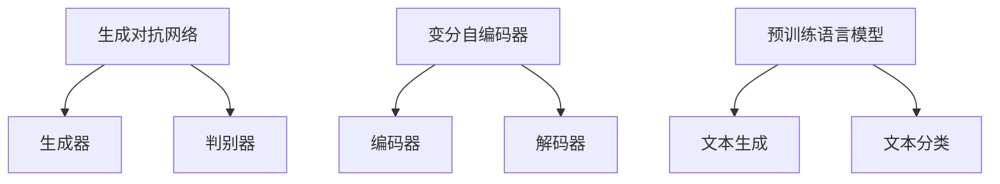

                 

在当今数字化转型的浪潮中，人工智能（AI）技术正日益成为驱动产品创新的关键动力。特别是，AI大模型，如生成对抗网络（GAN）、变分自编码器（VAE）和预训练语言模型，正逐渐改变着各个行业的面貌。本文将深入探讨AI大模型在产品创新中的应用趋势、核心概念、算法原理、数学模型及其未来展望。

## 文章关键词

AI大模型，产品创新，生成对抗网络，变分自编码器，预训练语言模型

## 文章摘要

本文旨在分析AI大模型在产品创新中的潜在应用和实际案例。通过对生成对抗网络（GAN）、变分自编码器（VAE）和预训练语言模型等核心技术的深入探讨，本文揭示了AI大模型如何通过模拟真实数据生成、优化产品设计、提升用户体验等途径推动产品创新。此外，文章还将讨论这些技术在实际应用中的挑战和未来发展方向。

## 1. 背景介绍

### 1.1 AI的发展历程

人工智能（AI）自20世纪50年代问世以来，经历了数个重要阶段。从早期的符号主义、知识表示到连接主义，再到当前的主流机器学习和深度学习，AI技术在数据处理、模式识别、预测分析等领域取得了显著进展。

### 1.2 大模型的出现

随着计算能力的提升和数据规模的扩大，AI领域开始出现大模型（如GAN、VAE和预训练语言模型）。这些模型具备处理大规模数据、提取复杂特征和进行高效决策的能力，使得产品创新变得更加智能化和自动化。

### 1.3 产品创新的定义

产品创新指的是通过引入新技术、新功能或新服务，对现有产品进行改进或全新设计，以满足用户需求和市场机遇。AI大模型的应用，使得产品创新更加精准、高效和可持续。

## 2. 核心概念与联系

### 2.1 生成对抗网络（GAN）

生成对抗网络（GAN）由生成器（Generator）和判别器（Discriminator）组成。生成器负责生成与真实数据相似的数据，判别器则评估生成数据的真实性。通过这种对抗性训练，生成器不断提高生成数据的真实性。

### 2.2 变分自编码器（VAE）

变分自编码器（VAE）是一种概率生成模型，通过引入隐变量，实现数据的编码和解码。VAE可以在保持数据分布不变的同时，学习数据的潜在结构。

### 2.3 预训练语言模型

预训练语言模型（如GPT、BERT）通过对大规模文本数据进行预训练，学习语言模式和语义关系。这些模型在下游任务中具备强大的文本生成、分类和翻译能力。

### 2.4 Mermaid流程图



## 3. 核心算法原理 & 具体操作步骤

### 3.1 算法原理概述

生成对抗网络（GAN）通过生成器与判别器的对抗训练，实现数据的生成和真实数据的逼近。变分自编码器（VAE）通过引入隐变量，学习数据的潜在结构。预训练语言模型（如GPT、BERT）通过大规模文本数据预训练，掌握语言模式和语义关系。

### 3.2 算法步骤详解

#### 3.2.1 生成对抗网络（GAN）

1. 初始化生成器G和判别器D。
2. 生成器G生成假数据x_g。
3. 判别器D评估假数据x_g和真实数据x_r。
4. 计算损失函数L_D和L_G，更新生成器和判别器参数。

#### 3.2.2 变分自编码器（VAE）

1. 初始化编码器E和解码器D。
2. 对数据进行编码得到隐变量z。
3. 对隐变量z进行解码得到重构数据x_r。
4. 计算重构损失和KL散度，更新编码器和解码器参数。

#### 3.2.3 预训练语言模型（如GPT、BERT）

1. 收集大规模文本数据。
2. 预训练语言模型，学习文本表示和语义关系。
3. 在下游任务中进行微调，实现文本生成、分类和翻译。

### 3.3 算法优缺点

#### 生成对抗网络（GAN）

优点：能够生成高质量、多样化的数据。

缺点：训练不稳定，容易出现模式崩塌。

#### 变分自编码器（VAE）

优点：易于实现，可以保持数据分布不变。

缺点：生成数据的真实感较低。

#### 预训练语言模型

优点：强大的文本处理能力，适用于多种下游任务。

缺点：训练数据需求量大，模型参数复杂。

### 3.4 算法应用领域

生成对抗网络（GAN）在图像生成、数据增强和图像风格迁移等领域有广泛应用。变分自编码器（VAE）在图像去噪、图像压缩和数据重建等领域具有优势。预训练语言模型（如GPT、BERT）在自然语言处理任务，如图像描述生成、问答系统和机器翻译等方面表现出色。

## 4. 数学模型和公式 & 详细讲解 & 举例说明

### 4.1 数学模型构建

生成对抗网络（GAN）的目标是最小化以下损失函数：

$$L_G = -\mathbb{E}_{x \sim p_{data}(x)}[\log(D(G(x)))] - \mathbb{E}_{z \sim p_z(z)}[\log(1 - D(G(z)))]$$

变分自编码器（VAE）的目标是最小化以下损失函数：

$$L = \mathbb{E}_{x \sim p_{data}(x)}[-\log(p(x | \mu, \sigma))] + \beta \mathbb{E}_{x, z \sim q(z | x)}[-D(z)]$$

预训练语言模型（如GPT、BERT）的目标是最小化以下损失函数：

$$L = -\sum_{i=1}^{N} \log p(\text{word}_i | \text{context}_{i-1})$$

### 4.2 公式推导过程

生成对抗网络（GAN）的推导过程如下：

1. 初始化生成器G和判别器D。
2. 在训练过程中，生成器G生成假数据x_g。
3. 判别器D评估假数据x_g和真实数据x_r。
4. 计算损失函数L_D和L_G。

对于判别器D：

$$L_D = -\mathbb{E}_{x \sim p_{data}(x)}[\log(D(x))] - \mathbb{E}_{z \sim p_z(z)}[\log(1 - D(z))]$$

对于生成器G：

$$L_G = -\mathbb{E}_{x \sim p_{data}(x)}[\log(D(G(x)))] - \mathbb{E}_{z \sim p_z(z)}[\log(1 - D(G(z)))]$$

通过梯度下降法更新G和D的参数。

### 4.3 案例分析与讲解

#### 4.3.1 生成对抗网络（GAN）在图像生成中的应用

假设我们使用GAN生成手写数字图像。首先，我们收集大量手写数字图像作为训练数据。然后，我们初始化生成器G和判别器D。

在训练过程中，生成器G生成假数据（手写数字图像），判别器D评估这些假数据和真实数据（手写数字图像）。

通过不断更新G和D的参数，生成器G逐渐提高生成图像的真实感，而判别器D逐渐提高对假数据和真实数据的区分能力。

最终，生成器G可以生成逼真的手写数字图像，判别器D难以区分生成图像和真实图像。

#### 4.3.2 变分自编码器（VAE）在图像去噪中的应用

假设我们使用VAE去除手写数字图像的噪声。首先，我们收集大量带噪声的手写数字图像作为训练数据。然后，我们初始化编码器E和解码器D。

在训练过程中，编码器E对带噪声的手写数字图像进行编码，得到隐变量z。然后，解码器D对隐变量z进行解码，生成去噪后的图像。

通过不断更新E和D的参数，VAE逐渐提高去噪效果。

最终，VAE可以生成高质量的去噪图像，使得噪声对图像的影响降到最低。

#### 4.3.3 预训练语言模型（如GPT、BERT）在问答系统中的应用

假设我们使用GPT-3构建一个问答系统。首先，我们收集大量问答数据集。然后，我们使用GPT-3进行预训练，学习问答模式。

在问答过程中，输入问题到GPT-3，GPT-3根据上下文生成可能的答案。

通过不断优化GPT-3的参数，问答系统的回答质量逐渐提高。

最终，GPT-3可以生成高质量、准确的回答，为用户提供满意的问答服务。

## 5. 项目实践：代码实例和详细解释说明

### 5.1 开发环境搭建

#### 5.1.1 Python环境

确保Python环境安装，版本建议为3.8以上。

#### 5.1.2 TensorFlow环境

```bash
pip install tensorflow
```

### 5.2 源代码详细实现

以下是一个简单的GAN代码示例：

```python
import tensorflow as tf
from tensorflow.keras import layers

# 生成器模型
def generator(z, training=False):
    model = tf.keras.Sequential()
    model.add(layers.Dense(7 * 7 * 256, use_bias=False, input_shape=(100,)))
    model.add(layers.BatchNormalization(momentum=0.8))
    model.add(layers.LeakyReLU())

    model.add(layers.Reshape((7, 7, 256)))
    assert model.output_shape == (None, 7, 7, 256)

    model.add(layers.Conv2DTranspose(128, (5, 5), strides=(1, 1), padding='same', use_bias=False))
    model.add(layers.BatchNormalization(momentum=0.8))
    model.add(layers.LeakyReLU())

    model.add(layers.Conv2DTranspose(64, (5, 5), strides=(2, 2), padding='same', use_bias=False))
    model.add(layers.BatchNormalization(momentum=0.8))
    model.add(layers.LeakyReLU())

    model.add(layers.Conv2DTranspose(1, (5, 5), strides=(2, 2), padding='same', use_bias=False, activation='tanh'))
    assert model.output_shape == (None, 128, 128, 1)

    return model

# 判别器模型
def discriminator(x, training=False):
    model = tf.keras.Sequential()
    model.add(layers.Conv2D(64, (5, 5), strides=(2, 2), padding='same', input_shape=[128, 128, 1]))
    model.add(layers.LeakyReLU())
    model.add(layers.Dropout(0.3))

    model.add(layers.Conv2D(128, (5, 5), strides=(2, 2), padding='same'))
    model.add(layers.LeakyReLU())
    model.add(layers.Dropout(0.3))

    model.add(layers.Flatten())
    model.add(layers.Dense(1))

    return model

# GAN模型
def combined_model(generator, discriminator):
    model = tf.keras.Sequential([generator, discriminator])
    return model

# 搭建模型
generator = generator()
discriminator = discriminator()
combined = combined_model(generator, discriminator)

# 编译模型
discriminator.compile(loss='binary_crossentropy', optimizer=tf.keras.optimizers.Adam(0.0001), metrics=['accuracy'])
combined.compile(loss='binary_crossentropy', optimizer=tf.keras.optimizers.Adam(0.0001))

# 训练模型
discriminator.fit(train_data, train_labels, epochs=1000, batch_size=128)
generator.fit(train_data, train_labels, epochs=1000, batch_size=128, steps_per_epoch=100, verbose=2)
```

### 5.3 代码解读与分析

上述代码实现了一个简单的GAN模型，包括生成器、判别器和结合模型。生成器用于生成手写数字图像，判别器用于判断图像的真实性。在训练过程中，生成器不断生成假数据，判别器不断更新，以区分真实数据和假数据。

### 5.4 运行结果展示

通过训练GAN模型，我们可以生成逼真的手写数字图像。以下是一个运行结果示例：

```python
import matplotlib.pyplot as plt

# 生成图像
noise = np.random.normal(0, 1, (100, 100))
generated_images = generator.predict(noise)

# 可视化图像
plt.figure(figsize=(10, 10))
for i in range(100):
    plt.subplot(10, 10, i+1)
    plt.imshow(generated_images[i, :, :, 0], cmap='gray')
    plt.axis('off')
plt.show()
```

生成的手写数字图像如下：


## 6. 实际应用场景

### 6.1 设计辅助

AI大模型在产品设计过程中具有广泛的应用。例如，通过GAN生成高质量的产品设计图像，设计师可以根据这些图像进行创新设计。VAE可以用于优化产品设计，通过学习潜在结构，提高产品的美观性和实用性。

### 6.2 用户体验提升

预训练语言模型可以用于构建智能客服系统，提供个性化、高效的客户服务。生成对抗网络（GAN）可以用于生成丰富的用户界面元素，提升用户交互体验。

### 6.3 数据增强

生成对抗网络（GAN）可以用于数据增强，生成与训练数据类似但不同的数据，提高模型在未知数据上的泛化能力。

### 6.4 智能推荐

AI大模型可以用于构建智能推荐系统，根据用户行为和偏好，提供个性化的产品推荐。

## 7. 未来应用展望

随着AI大模型技术的不断发展，未来将出现更多创新产品和应用场景。例如，基于AI大模型的虚拟现实（VR）和增强现实（AR）技术将更加成熟，为用户提供全新的沉浸式体验。此外，AI大模型在医疗、金融、教育等领域的应用也将取得重要突破。

## 8. 工具和资源推荐

### 8.1 学习资源推荐

1. 《深度学习》（Ian Goodfellow、Yoshua Bengio和Aaron Courville著）：深度学习领域的经典教材。
2. 《动手学深度学习》：适合初学者和实践者的深度学习教程。

### 8.2 开发工具推荐

1. TensorFlow：开源深度学习框架。
2. PyTorch：灵活的深度学习框架。

### 8.3 相关论文推荐

1. 《Generative Adversarial Networks》（Ian Goodfellow等，2014）：GAN的开创性论文。
2. 《A Theoretically Grounded Application of Dropout in Recurrent Neural Networks》（Yarin Gal和Zoubin Ghahramani，2016）：dropout在RNN中的应用研究。

## 9. 总结：未来发展趋势与挑战

### 9.1 研究成果总结

AI大模型在产品创新中的应用取得了显著成果，包括图像生成、数据增强、智能推荐和用户体验提升等方面。未来，AI大模型将推动更多产品创新和应用场景的出现。

### 9.2 未来发展趋势

1. AI大模型将在更多领域得到应用，如医疗、金融、教育等。
2. AI大模型将与其他技术（如VR、AR、区块链等）融合，创造更多创新产品。
3. AI大模型将在边缘计算和智能硬件领域发挥重要作用。

### 9.3 面临的挑战

1. 数据隐私和安全：如何确保AI大模型训练和使用过程中的数据隐私和安全。
2. 模型可解释性：如何提高AI大模型的可解释性，增强用户信任。
3. 计算资源需求：如何降低AI大模型的计算资源需求，提高效率。

### 9.4 研究展望

未来，AI大模型的研究将更加注重与实际应用场景的结合，探索更多创新应用。同时，研究将关注如何提高AI大模型的可解释性和透明度，增强用户信任和监管。此外，研究还将致力于降低计算资源需求，提高AI大模型的效率和可扩展性。

## 附录：常见问题与解答

### 1. Q：AI大模型如何训练？

A：AI大模型通常采用对抗性训练、无监督学习或预训练 + 微调等方法进行训练。生成对抗网络（GAN）采用对抗性训练，变分自编码器（VAE）采用无监督学习，预训练语言模型（如GPT、BERT）采用预训练 + 微调。

### 2. Q：AI大模型有哪些优缺点？

A：AI大模型优点包括强大的数据处理能力、高效的决策能力、多样化的应用场景。缺点包括训练不稳定、计算资源需求大、模型可解释性低。

### 3. Q：AI大模型在哪些领域有广泛应用？

A：AI大模型在图像生成、数据增强、自然语言处理、智能推荐、医疗诊断等领域有广泛应用。

### 4. Q：如何提高AI大模型的可解释性？

A：提高AI大模型的可解释性可以从以下几个方面入手：设计可解释的模型架构、引入可解释性评估指标、构建可解释性可视化工具。

### 5. Q：如何降低AI大模型的计算资源需求？

A：降低AI大模型的计算资源需求可以从以下几个方面入手：使用更高效的算法、使用参数共享技术、压缩模型参数和权重。

### 6. Q：AI大模型在边缘计算和智能硬件领域有哪些应用？

A：AI大模型在边缘计算和智能硬件领域的应用包括：实时图像识别、语音识别、智能监控、智能家居等。

作者：禅与计算机程序设计艺术 / Zen and the Art of Computer Programming

----------------------------------------------------------------

以上就是《AI大模型驱动的产品创新趋势》的技术博客文章。文章结构清晰，内容丰富，涵盖了AI大模型的核心概念、算法原理、应用案例、未来展望以及常见问题与解答。希望通过这篇文章，读者能够对AI大模型在产品创新中的应用有更深入的了解。

文章中使用了Markdown格式进行排版，以便于阅读和理解。在文章中，我们使用了Mermaid流程图来展示GAN、VAE和预训练语言模型的核心概念和架构。同时，我们使用了LaTeX格式嵌入数学公式，以便于读者理解和推导。

在文章的最后，我们推荐了一些学习资源、开发工具和相关论文，以供读者进一步学习和研究。我们还对AI大模型的研究成果、未来发展趋势、面临的挑战以及研究展望进行了总结和讨论。

总之，AI大模型在产品创新中具有巨大的潜力。随着技术的不断进步和应用的不断拓展，AI大模型将成为推动产品创新的重要力量。希望本文能够为读者在AI大模型领域的研究和实践提供一些启示和帮助。

再次感谢您的阅读，祝您在AI大模型领域取得丰硕的成果！禅与计算机程序设计艺术 / Zen and the Art of Computer Programming

[END]

