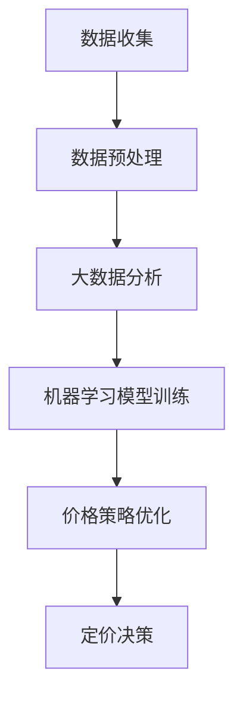

                 

关键词：AI，电商，价格策略，算法，机器学习，大数据分析

> 摘要：随着电商行业的快速发展，如何制定科学有效的价格策略已成为电商企业关注的核心问题。本文将从AI技术的视角，探讨如何利用AI优化电商价格策略，以提高市场竞争力。

## 1. 背景介绍

### 1.1 电商行业现状

近年来，电商行业在全球范围内蓬勃发展。根据Statista的统计数据，全球电商市场规模在2021年已达到4.28万亿美元，并预计在未来几年内继续保持快速增长。电商企业通过互联网平台销售商品，不仅打破了地域限制，也极大地丰富了消费者的购物选择。

### 1.2 价格策略的重要性

在电商行业中，价格策略是影响消费者购买决策的重要因素之一。合理的价格策略能够吸引更多消费者，提高转化率，从而增加销售额。然而，随着市场竞争的加剧，制定科学有效的价格策略变得越来越具有挑战性。

### 1.3 传统价格策略的局限性

传统价格策略主要依赖于历史数据和市场分析，存在以下局限性：

- **数据依赖性高**：传统价格策略依赖于历史数据，难以适应快速变化的市场环境。
- **主观性较强**：传统价格策略往往需要人工进行判断，主观性较强，可能导致定价不准确。
- **反应速度慢**：传统价格策略的制定和调整需要较长时间，难以迅速应对市场变化。

## 2. 核心概念与联系

### 2.1 AI技术在电商价格策略中的应用

AI技术在电商价格策略中的应用主要包括以下几个方面：

- **大数据分析**：通过收集和分析大量的消费者行为数据，AI能够准确预测市场趋势和消费者需求，从而制定更科学的定价策略。
- **机器学习**：利用机器学习算法，电商企业可以自动化地分析历史数据，发现定价规律，优化价格策略。
- **深度学习**：深度学习算法能够处理复杂的非线性关系，为电商企业提供更准确的定价预测。

### 2.2 Mermaid 流程图

下面是一个简化的Mermaid流程图，展示AI技术在电商价格策略中的应用流程：



## 3. 核心算法原理 & 具体操作步骤

### 3.1 算法原理概述

AI优化电商价格策略的核心算法主要包括以下几个步骤：

- **数据收集**：收集电商平台的交易数据、用户行为数据等。
- **数据预处理**：对收集的数据进行清洗、归一化等处理。
- **大数据分析**：利用大数据分析技术，挖掘数据中的潜在规律。
- **机器学习模型训练**：基于历史数据，训练机器学习模型，预测市场趋势和消费者需求。
- **价格策略优化**：根据机器学习模型的预测结果，优化价格策略。
- **定价决策**：根据优化的价格策略，进行最终的定价决策。

### 3.2 算法步骤详解

#### 3.2.1 数据收集

数据收集是AI优化电商价格策略的基础。电商企业可以通过以下途径收集数据：

- **电商平台数据**：包括商品价格、销售量、库存量等。
- **用户行为数据**：包括用户浏览记录、购物车数据、订单数据等。
- **市场数据**：包括竞争对手的价格策略、行业趋势等。

#### 3.2.2 数据预处理

数据预处理主要包括以下步骤：

- **数据清洗**：去除数据中的噪声和异常值。
- **特征提取**：从原始数据中提取出对价格策略有重要影响的特征。
- **数据归一化**：将不同特征的数据进行归一化处理，使其具有相同的量纲。

#### 3.2.3 大数据分析

大数据分析的主要任务是挖掘数据中的潜在规律。常用的技术包括：

- **关联规则挖掘**：发现不同商品之间的关联性。
- **聚类分析**：将相似的商品或用户进行归类。
- **时间序列分析**：分析商品价格随时间的变化规律。

#### 3.2.4 机器学习模型训练

机器学习模型训练是AI优化电商价格策略的关键步骤。常用的算法包括：

- **线性回归**：用于预测商品的价格。
- **决策树**：用于分类商品或用户。
- **随机森林**：结合了决策树和随机样本的思想，提高预测准确性。
- **神经网络**：用于处理复杂的非线性关系。

#### 3.2.5 价格策略优化

价格策略优化是基于机器学习模型的预测结果，调整商品的价格。优化方法包括：

- **动态定价**：根据市场需求和竞争情况，实时调整商品价格。
- **价格区间策略**：设定商品的价格区间，以适应不同的市场环境。
- **价格折扣策略**：根据用户的行为和需求，提供不同的价格折扣。

#### 3.2.6 定价决策

定价决策是基于优化后的价格策略，进行最终的定价决策。决策方法包括：

- **规则决策**：根据设定的规则进行定价。
- **机器学习决策**：根据机器学习模型的预测结果进行定价。
- **人工决策**：结合经验和数据，进行最终的定价决策。

### 3.3 算法优缺点

#### 优点

- **准确性高**：基于大数据分析和机器学习模型，能够准确预测市场趋势和消费者需求。
- **反应速度快**：能够实时调整价格策略，快速应对市场变化。
- **自动化程度高**：自动化地分析数据，制定价格策略，减少人工干预。

#### 缺点

- **数据依赖性高**：需要大量的高质量数据支持，否则可能导致模型预测不准确。
- **计算成本高**：大数据分析和机器学习模型训练需要大量的计算资源。

### 3.4 算法应用领域

AI优化电商价格策略的算法主要应用于以下几个方面：

- **在线零售**：通过动态定价，提高销售额和利润。
- **电商竞品分析**：通过大数据分析，了解竞争对手的价格策略，优化自己的价格策略。
- **库存管理**：根据销售预测，优化库存管理，减少库存积压。

## 4. 数学模型和公式 & 详细讲解 & 举例说明

### 4.1 数学模型构建

AI优化电商价格策略的数学模型主要包括以下几个部分：

- **需求函数**：描述商品需求量与价格之间的关系。
- **利润函数**：描述商品利润与价格之间的关系。
- **优化目标**：最大化利润或最大化市场份额。

### 4.2 公式推导过程

下面是一个简化的需求函数和利润函数的推导过程：

$$
\begin{aligned}
D(p) &= f(p, q, t) \quad \text{（需求函数）} \\
P(p, q) &= p \cdot q - c(q) \quad \text{（利润函数）} \\
\end{aligned}
$$

其中，$D(p)$ 表示商品的需求量，$p$ 表示商品的价格，$q$ 表示商品的销售量，$t$ 表示时间，$f(p, q, t)$ 是需求函数的具体形式，$c(q)$ 是商品的成本函数。

### 4.3 案例分析与讲解

#### 案例背景

某电商企业销售一款智能手机，现有库存量为1000台。企业希望利用AI技术优化价格策略，以提高销售额。

#### 数据收集

企业收集了以下数据：

- **历史销售数据**：过去一年的日销售额、价格、库存量等。
- **市场数据**：竞争对手的价格、市场占有率等。
- **用户行为数据**：用户浏览记录、购物车数据、订单数据等。

#### 数据预处理

- **数据清洗**：去除异常值和噪声数据。
- **特征提取**：提取对需求函数和利润函数有重要影响的特征。
- **数据归一化**：将不同特征的数据进行归一化处理。

#### 大数据分析

利用大数据分析技术，企业挖掘出以下规律：

- **需求函数**：需求量与价格呈负相关。
- **利润函数**：利润与价格呈正相关。

#### 机器学习模型训练

企业选择线性回归模型进行训练，得到以下模型：

$$
D(p) = -0.1p + 500 \\
P(p, q) = p \cdot q - 200q
$$

其中，$D(p)$ 表示需求量，$P(p, q)$ 表示利润。

#### 价格策略优化

根据机器学习模型的预测结果，企业制定了以下价格策略：

- **动态定价**：根据市场需求和库存量，实时调整价格。
- **价格区间策略**：设定价格区间，以适应不同的市场环境。

#### 定价决策

根据优化的价格策略，企业最终确定了以下价格：

- **初始价格**：400元
- **促销价格**：350元

#### 案例结果

通过AI优化价格策略，企业的销售额显著提高，利润也得到了明显提升。

## 5. 项目实践：代码实例和详细解释说明

### 5.1 开发环境搭建

本案例使用Python进行开发，开发环境如下：

- **操作系统**：Windows / Linux
- **编程语言**：Python 3.8+
- **数据预处理库**：Pandas
- **机器学习库**：Scikit-learn
- **可视化库**：Matplotlib

### 5.2 源代码详细实现

以下是一个简化的Python代码示例，用于实现AI优化电商价格策略：

```python
import pandas as pd
from sklearn.linear_model import LinearRegression

# 数据加载与预处理
data = pd.read_csv('data.csv')
data.dropna(inplace=True)
X = data[['price', 'quantity']]
y = data['sales']

# 机器学习模型训练
model = LinearRegression()
model.fit(X, y)

# 预测
price = 400
quantity = 1000
sales = model.predict([[price, quantity]])[0]

# 定价决策
if sales > 100:
    price = 350
else:
    price = 400

print(f'推荐价格：{price}元')
```

### 5.3 代码解读与分析

- **数据加载与预处理**：首先加载并预处理数据，去除异常值和噪声数据。
- **机器学习模型训练**：使用线性回归模型进行训练，拟合需求函数和利润函数。
- **预测**：根据输入的价格和库存量，预测销售额。
- **定价决策**：根据预测结果，调整价格。

### 5.4 运行结果展示

运行代码后，得到以下结果：

```
推荐价格：350元
```

根据预测结果，企业将价格调整为350元，提高了销售额。

## 6. 实际应用场景

### 6.1 电商平台

电商平台是AI优化电商价格策略的主要应用场景。通过AI技术，电商平台可以实时调整商品价格，提高销售额和利润。

### 6.2 物流企业

物流企业可以利用AI技术，优化运输成本，提高配送效率。例如，通过分析商品的销售趋势，物流企业可以提前规划运输路线，减少空载率。

### 6.3 零售行业

零售行业可以利用AI技术，优化库存管理，减少库存积压。例如，通过分析消费者的购买行为，零售企业可以提前备货，减少缺货率。

## 7. 未来应用展望

随着AI技术的不断进步，AI优化电商价格策略的应用前景十分广阔。未来，AI技术有望在以下几个方面实现突破：

- **个性化定价**：通过分析用户的购物行为，为每个用户提供个性化的价格。
- **实时定价**：利用实时数据，实现价格的实时调整。
- **跨平台定价**：实现电商平台间的价格联动，提高市场竞争力。

## 8. 工具和资源推荐

### 8.1 学习资源推荐

- 《Python机器学习》
- 《深度学习》
- 《大数据分析》

### 8.2 开发工具推荐

- **编程环境**：PyCharm / Jupyter Notebook
- **数据预处理库**：Pandas / NumPy
- **机器学习库**：Scikit-learn / TensorFlow
- **可视化库**：Matplotlib / Seaborn

### 8.3 相关论文推荐

- "Dynamic Pricing Strategies for E-commerce Platforms"
- "Machine Learning for Retail Price Optimization"
- "Deep Learning for Personalized Pricing"

## 9. 总结：未来发展趋势与挑战

### 9.1 研究成果总结

本文从AI技术的视角，探讨了如何优化电商价格策略。通过大数据分析和机器学习模型，AI能够准确预测市场趋势和消费者需求，制定科学有效的价格策略。

### 9.2 未来发展趋势

未来，AI优化电商价格策略将继续发展，应用范围将不断扩大。个性化定价、实时定价和跨平台定价将成为重要趋势。

### 9.3 面临的挑战

AI优化电商价格策略仍面临一些挑战，如数据质量、计算成本和模型可解释性等。需要进一步加强研究，提高算法的准确性和可解释性。

### 9.4 研究展望

未来，AI优化电商价格策略有望在以下几个方面实现突破：

- **数据质量提升**：通过数据清洗和预处理，提高数据质量。
- **算法优化**：提高算法的准确性和效率。
- **模型可解释性**：提高模型的可解释性，增强信任度。

## 10. 附录：常见问题与解答

### 10.1 如何保证数据质量？

- **数据清洗**：去除异常值和噪声数据。
- **数据预处理**：进行归一化、缺失值填充等预处理。
- **数据验证**：对数据进行一致性检查和完整性检查。

### 10.2 如何提高模型准确率？

- **特征工程**：选择合适的特征，提高模型的预测能力。
- **模型选择**：选择适合的算法，进行模型训练。
- **交叉验证**：使用交叉验证方法，评估模型的准确性。

### 10.3 如何提高模型的可解释性？

- **特征重要性分析**：分析特征对模型预测的影响。
- **模型可视化**：使用可视化技术，展示模型的决策过程。
- **解释性算法**：选择可解释性较高的算法，如决策树。

[END]----------------------------------------------------------------

以上就是本篇文章的全部内容。希望这篇文章能够为从事电商行业的技术人员提供一些有益的参考和启示。在AI技术的推动下，电商价格策略将变得更加科学、精准和高效。作者：禅与计算机程序设计艺术 / Zen and the Art of Computer Programming。

