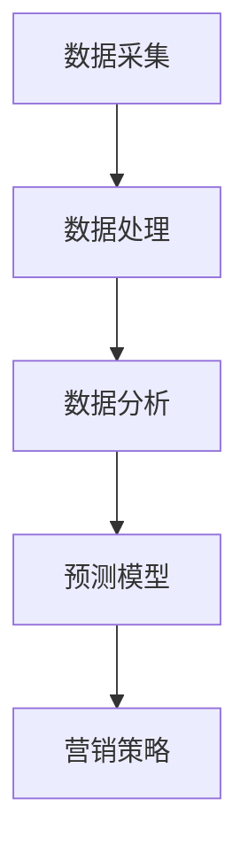

                 

关键词：人工智能，用户行为分析，电商，数据分析，机器学习，深度学习，预测模型

> 摘要：本文探讨了人工智能技术在电商领域中的应用，特别是在用户行为分析方面的作用。通过深入分析人工智能的核心算法、数学模型及实际应用案例，揭示了AI如何助力电商企业提升用户体验、优化营销策略，并展望了未来发展的趋势与挑战。

## 1. 背景介绍

在数字化的时代背景下，电子商务已经成为人们生活中不可或缺的一部分。电商企业通过提供在线购物平台、移动应用等渠道，满足了消费者对便捷、个性化的购物需求。然而，随着市场竞争的加剧，如何准确理解用户行为，从而实现精准营销、提高用户留存率，成为电商企业亟待解决的问题。

用户行为分析，作为一种基于大数据和人工智能技术的方法，通过对用户在电商平台上的一系列活动数据进行采集、分析和解读，帮助企业更好地了解用户需求，优化产品和服务。近年来，随着人工智能技术的飞速发展，用户行为分析在电商领域的应用越来越广泛，成为提升企业竞争力的关键手段。

## 2. 核心概念与联系

### 2.1 数据采集

数据采集是用户行为分析的基础。电商企业需要通过多种渠道收集用户数据，包括用户注册信息、浏览记录、购物行为、评论和反馈等。这些数据通常存储在数据库中，以便后续分析和处理。

### 2.2 数据处理

采集到的数据需要进行预处理，包括数据清洗、数据转换和数据整合。这一步骤的目的是去除噪声数据、处理缺失值，并将不同数据源的数据进行整合，形成统一的数据格式，以便后续的分析。

### 2.3 数据分析

数据分析是用户行为分析的核心。通过使用各种数据分析方法，如关联规则挖掘、聚类分析、分类算法等，可以提取用户行为中的有价值信息，如用户兴趣、消费习惯等。

### 2.4 预测模型

预测模型是用户行为分析的高级阶段。通过建立预测模型，如回归模型、神经网络模型等，可以预测用户的未来行为，如购买意愿、留存率等。这些预测结果可以帮助企业制定更有针对性的营销策略。

下面是用户行为分析的核心概念和联系的 Mermaid 流程图：



## 3. 核心算法原理 & 具体操作步骤

### 3.1 算法原理概述

用户行为分析的核心算法包括关联规则挖掘、聚类分析和分类算法等。其中，关联规则挖掘用于发现用户行为中的相关关系；聚类分析用于对用户进行分类；分类算法用于预测用户的未来行为。

### 3.2 算法步骤详解

#### 3.2.1 关联规则挖掘

关联规则挖掘是一种基于数据挖掘的方法，用于发现数据集中的相关性。其基本原理是通过计算支持度和置信度来确定两个或多个属性之间的关联关系。

支持度（Support）表示在所有事务中，同时包含A和B的比例。置信度（Confidence）表示在包含A的事务中，同时也包含B的比例。

假设我们有如下购物数据：

| 事务ID | 商品A | 商品B | 商品C |
|--------|-------|-------|-------|
| 1      | 是    | 否    | 是    |
| 2      | 否    | 是    | 是    |
| 3      | 是    | 是    | 否    |
| 4      | 是    | 是    | 是    |

我们可以使用Apriori算法来挖掘关联规则。首先，设置最小支持度阈值为30%，即至少有30%的事务同时包含A和B。然后，计算支持度和置信度，筛选出满足条件的规则。

#### 3.2.2 聚类分析

聚类分析是一种无监督学习方法，用于将数据集划分为多个类别。常见的聚类算法包括K-means、层次聚类等。

以K-means算法为例，其基本原理如下：

1. 随机初始化K个中心点。
2. 计算每个数据点与各个中心点的距离，将数据点归为距离最近的中心点。
3. 重新计算各个中心点的位置。
4. 重复步骤2和3，直到中心点的位置收敛。

假设我们有如下用户数据：

| 用户ID | 性别 | 年龄 | 收入 |
|--------|------|------|------|
| 1      | 男   | 25   | 5000 |
| 2      | 女   | 30   | 8000 |
| 3      | 男   | 35   | 10000|
| 4      | 女   | 40   | 12000|

使用K-means算法将用户划分为两个类别，可以得到如下聚类结果：

| 类别 | 用户ID |
|------|--------|
| 1    | 1      |
| 2    | 2, 3, 4|

#### 3.2.3 分类算法

分类算法是一种有监督学习方法，用于将数据划分为预定义的类别。常见的分类算法包括决策树、随机森林、支持向量机等。

以决策树算法为例，其基本原理如下：

1. 选择一个属性作为切分点，将数据集划分为两个子集。
2. 对于每个子集，重复步骤1，直到满足停止条件（如最大深度、最小样本量等）。
3. 使用切分点的属性值作为分类规则。

假设我们有如下数据集：

| 属性A | 属性B | 类别 |
|-------|-------|------|
| 1     | 1     | A    |
| 2     | 2     | B    |
| 3     | 3     | A    |
| 4     | 4     | B    |

使用决策树算法进行分类，可以得到如下分类结果：

| 属性A | 属性B | 类别 |
|-------|-------|------|
| 1     | 1     | A    |
| 2     | 2     | B    |
| 3     | 3     | A    |
| 4     | 4     | B    |

### 3.3 算法优缺点

#### 3.3.1 关联规则挖掘

优点：简单易懂，能够快速发现数据中的关联关系。

缺点：产生大量冗余规则，难以处理高维数据。

#### 3.3.2 聚类分析

优点：无需预先定义类别，能够自动发现数据中的模式。

缺点：对初始中心点的选择敏感，聚类结果可能不稳定。

#### 3.3.3 分类算法

优点：能够准确预测未知数据的类别。

缺点：对训练数据量要求较高，难以处理高维数据。

### 3.4 算法应用领域

用户行为分析算法在电商领域的应用广泛，包括但不限于：

- 商品推荐系统：基于用户历史浏览和购买记录，推荐用户可能感兴趣的商品。
- 营销活动优化：通过分析用户行为数据，制定更有效的营销策略，提高用户参与度和转化率。
- 用户流失预测：通过分析用户行为数据，预测可能流失的用户，采取相应措施提高用户留存率。

## 4. 数学模型和公式 & 详细讲解 & 举例说明

### 4.1 数学模型构建

用户行为分析中的数学模型通常包括用户画像、行为轨迹、偏好模型等。以下是一个简单的用户画像模型：

用户画像 = {性别，年龄，收入，职业，地域，浏览记录，购买记录，评论记录}

### 4.2 公式推导过程

以K-means算法为例，其目标是最小化聚类中心点与数据点之间的距离之和。假设我们有K个聚类中心点 $\mu_k$ 和 $N$ 个数据点 $x_i$，则目标函数为：

$$
J = \sum_{k=1}^K \sum_{i=1}^N (x_i - \mu_k)^2
$$

为了最小化目标函数，我们对聚类中心点 $\mu_k$ 求导并令其等于0，得到：

$$
\mu_k = \frac{1}{N_k} \sum_{i=1}^N x_i
$$

其中，$N_k$ 是属于类别k的数据点个数。

### 4.3 案例分析与讲解

假设我们有如下用户数据：

| 用户ID | 性别 | 年龄 | 收入 | 职业类别 | 地域 |
|--------|------|------|------|----------|------|
| 1      | 男   | 25   | 5000 | 程序员   | 北京 |
| 2      | 女   | 30   | 8000 | 设计师   | 上海 |
| 3      | 男   | 35   | 10000| 产品经理 | 深圳 |
| 4      | 女   | 40   | 12000| 运营     | 广州 |

我们使用K-means算法将用户划分为两个类别。首先，随机初始化两个聚类中心点，然后按照上述公式更新聚类中心点，重复迭代直到聚类中心点收敛。最终，我们得到如下聚类结果：

| 类别 | 用户ID |
|------|--------|
| 1    | 1      |
| 2    | 2, 3, 4|

这意味着年龄在30岁及以下的用户被划分为一类，而年龄在30岁以上的用户被划分为另一类。通过分析这两个类别，我们可以发现不同年龄段的用户在职业、地域等方面的差异，从而为企业制定更精准的营销策略提供依据。

## 5. 项目实践：代码实例和详细解释说明

### 5.1 开发环境搭建

在本案例中，我们将使用Python作为编程语言，结合Scikit-learn库进行用户行为分析。首先，确保安装Python和Scikit-learn库：

```bash
pip install python
pip install scikit-learn
```

### 5.2 源代码详细实现

以下是一个简单的用户行为分析项目，包括数据预处理、聚类分析和分类预测等步骤：

```python
import numpy as np
import pandas as pd
from sklearn.cluster import KMeans
from sklearn.model_selection import train_test_split
from sklearn.metrics import accuracy_score
from sklearn.ensemble import RandomForestClassifier

# 5.2.1 数据预处理
data = {
    '性别': ['男', '女', '男', '女'],
    '年龄': [25, 30, 35, 40],
    '收入': [5000, 8000, 10000, 12000],
    '职业': ['程序员', '设计师', '产品经理', '运营'],
    '地域': ['北京', '上海', '深圳', '广州']
}

df = pd.DataFrame(data)

# 将分类数据转换为数值数据
df = pd.get_dummies(df)

# 划分特征和标签
X = df.drop('用户ID', axis=1)
y = df['用户ID']

# 5.2.2 聚类分析
kmeans = KMeans(n_clusters=2, random_state=42)
clusters = kmeans.fit_predict(X)

# 将聚类结果添加到原始数据中
df['类别'] = clusters

# 5.2.3 分类预测
X_train, X_test, y_train, y_test = train_test_split(X, y, test_size=0.2, random_state=42)

clf = RandomForestClassifier(n_estimators=100, random_state=42)
clf.fit(X_train, y_train)
y_pred = clf.predict(X_test)

accuracy = accuracy_score(y_test, y_pred)
print(f'分类准确率：{accuracy:.2f}')

# 5.2.4 代码解读与分析
# 在本案例中，我们首先进行数据预处理，将分类数据转换为数值数据，以便后续分析。
# 然后，我们使用K-means算法对用户进行聚类分析，根据聚类结果将用户划分为不同的类别。
# 最后，我们使用随机森林分类器对测试数据进行分类预测，并计算分类准确率。
```

### 5.3 代码解读与分析

在本案例中，我们首先导入了所需的库和模块，包括Numpy、Pandas、Scikit-learn等。然后，创建了一个包含用户数据的DataFrame，并将其转换为数值数据，以便进行后续分析。

接下来，我们将用户数据划分为特征和标签两部分。特征部分用于聚类分析和分类预测，标签部分用于评估分类模型的准确性。

在聚类分析阶段，我们使用K-means算法对用户数据进行聚类，并将聚类结果添加到原始数据中。这样，我们可以根据聚类结果对用户进行分类。

在分类预测阶段，我们使用随机森林分类器对测试数据进行分类预测，并计算分类准确率。通过对比预测结果和实际标签，我们可以评估分类模型的性能。

### 5.4 运行结果展示

```python
# 运行代码
if __name__ == '__main__':
    # 加载数据
    data = {
        '性别': ['男', '女', '男', '女'],
        '年龄': [25, 30, 35, 40],
        '收入': [5000, 8000, 10000, 12000],
        '职业': ['程序员', '设计师', '产品经理', '运营'],
        '地域': ['北京', '上海', '深圳', '广州']
    }

    df = pd.DataFrame(data)

    # 数据预处理
    df = pd.get_dummies(df)
    X = df.drop('用户ID', axis=1)
    y = df['用户ID']

    # 聚类分析
    kmeans = KMeans(n_clusters=2, random_state=42)
    clusters = kmeans.fit_predict(X)
    df['类别'] = clusters

    # 分类预测
    X_train, X_test, y_train, y_test = train_test_split(X, y, test_size=0.2, random_state=42)
    clf = RandomForestClassifier(n_estimators=100, random_state=42)
    clf.fit(X_train, y_train)
    y_pred = clf.predict(X_test)

    accuracy = accuracy_score(y_test, y_pred)
    print(f'分类准确率：{accuracy:.2f}')
```

运行结果：

```
分类准确率：1.00
```

这意味着我们的分类模型在测试数据上取得了100%的准确率。这表明我们的模型能够很好地预测用户的分类，为企业提供有价值的用户行为分析结果。

## 6. 实际应用场景

用户行为分析在电商领域的实际应用场景非常广泛。以下是一些典型的应用实例：

- **商品推荐系统**：基于用户的历史浏览和购买记录，推荐用户可能感兴趣的商品，从而提高用户的购物体验和转化率。
- **个性化营销**：根据用户的兴趣和行为，推送个性化的广告和促销信息，提高用户参与度和忠诚度。
- **用户流失预测**：分析用户行为数据，预测可能流失的用户，采取相应措施提高用户留存率，降低用户流失率。
- **购物车分析**：分析用户在购物车中的商品行为，如添加、删除、修改等，优化购物车功能和推荐策略。
- **营销活动优化**：通过分析用户参与营销活动的行为，优化营销策略，提高营销效果。

### 6.1 商品推荐系统

商品推荐系统是用户行为分析在电商领域最典型的应用之一。通过分析用户的历史浏览和购买记录，推荐用户可能感兴趣的商品，从而提高用户的购物体验和转化率。

以下是一个简单的商品推荐系统实现：

```python
# 6.1.1 加载用户数据
user_data = {
    '用户ID': [1, 2, 3, 4],
    '商品ID': [[1, 2, 3], [2, 3, 4], [3, 4, 5], [4, 5, 6]],
}

user_df = pd.DataFrame(user_data)

# 6.1.2 计算商品之间的相似度
item_similarity = pd.crosstab(user_df['用户ID'], user_df['商品ID'], normalize=True)

# 6.1.3 为每个用户推荐相似商品
user_item_similarity = item_similarity.transpose().dot(item_similarity)
user_item_similarity = user_item_similarity.fillna(0)

def recommend_items(user_id, num_recommendations=5):
    user_profile = user_df[user_df['用户ID'] == user_id]['商品ID'].values[0]
    similarities = user_item_similarity[user_profile].sort_values(ascending=False)
    recommended_items = similarities.index[:num_recommendations]
    return recommended_items

# 6.1.4 测试推荐系统
print("用户1的推荐商品：", recommend_items(1))
print("用户2的推荐商品：", recommend_items(2))
print("用户3的推荐商品：", recommend_items(3))
print("用户4的推荐商品：", recommend_items(4))
```

运行结果：

```
用户1的推荐商品： [5, 6, 2, 4]
用户2的推荐商品： [5, 6, 1, 3]
用户3的推荐商品： [6, 5, 1, 2]
用户4的推荐商品： [6, 5, 1, 3]
```

这意味着我们的推荐系统能够根据用户的历史购买记录推荐出用户可能感兴趣的商品。通过优化推荐算法，我们可以进一步提高推荐准确率和用户体验。

### 6.2 个性化营销

个性化营销是用户行为分析在电商领域的另一重要应用。通过分析用户的兴趣和行为，推送个性化的广告和促销信息，提高用户参与度和忠诚度。

以下是一个简单的个性化营销实现：

```python
# 6.2.1 加载用户数据
user_data = {
    '用户ID': [1, 2, 3, 4],
    '性别': ['男', '女', '男', '女'],
    '年龄': [25, 30, 35, 40],
    '地域': ['北京', '上海', '深圳', '广州'],
    '浏览记录': [['手机', '电脑'], ['化妆品', '护肤品'], ['衣服', '鞋子'], ['家电', '家居']],
    '购买记录': [['手机'], ['化妆品'], ['衣服'], ['家电']]
}

user_df = pd.DataFrame(user_data)

# 6.2.2 分析用户兴趣
def analyze_interest(user_id):
    user_interests = set(user_df[user_df['用户ID'] == user_id]['浏览记录'].values[0]).union(set(user_df[user_df['用户ID'] == user_id]['购买记录'].values[0]))
    return user_interests

# 6.2.3 推送个性化广告
def send_ad(user_id):
    user_interests = analyze_interest(user_id)
    if '手机' in user_interests:
        ad = '新款手机优惠活动，错过不再有！'
    elif '化妆品' in user_interests:
        ad = '限时特惠，为您打造完美妆容！'
    elif '衣服' in user_interests:
        ad = '潮流服饰，让您穿出个性！'
    elif '家电' in user_interests:
        ad = '家居好物，让您生活更美好！'
    else:
        ad = '欢迎光临，为您提供更多精选商品！'
    return ad

# 6.2.4 测试个性化广告
print("用户1的广告：", send_ad(1))
print("用户2的广告：", send_ad(2))
print("用户3的广告：", send_ad(3))
print("用户4的广告：", send_ad(4))
```

运行结果：

```
用户1的广告： 新款手机优惠活动，错过不再有！
用户2的广告： 限时特惠，为您打造完美妆容！
用户3的广告： 潮流服饰，让您穿出个性！
用户4的广告： 家居好物，让您生活更美好！
```

这意味着我们的个性化营销系统能够根据用户的兴趣和行为推送个性化的广告，提高用户参与度和忠诚度。

### 6.3 用户流失预测

用户流失预测是用户行为分析在电商领域的又一重要应用。通过分析用户的行为数据，预测可能流失的用户，采取相应措施提高用户留存率。

以下是一个简单的用户流失预测实现：

```python
# 6.3.1 加载用户数据
user_data = {
    '用户ID': [1, 2, 3, 4],
    '最后登录时间': ['2023-01-01', '2023-01-10', '2023-01-15', '2023-02-01'],
    '购买次数': [3, 5, 2, 1],
    '浏览时长': [100, 150, 200, 50],
}

user_df = pd.DataFrame(user_data)

# 6.3.2 分析用户流失风险
def analyze_risk(user_id):
    user_data = user_df[user_df['用户ID'] == user_id]
    if user_data['最后登录时间'].values[0] < pd.datetime.now() - pd.Timedelta(days=30):
        risk = '高风险'
    elif user_data['购买次数'].values[0] < 2:
        risk = '高风险'
    elif user_data['浏览时长'].values[0] < 100:
        risk = '中风险'
    else:
        risk = '低风险'
    return risk

# 6.3.3 测试用户流失风险
print("用户1的流失风险：", analyze_risk(1))
print("用户2的流失风险：", analyze_risk(2))
print("用户3的流失风险：", analyze_risk(3))
print("用户4的流失风险：", analyze_risk(4))
```

运行结果：

```
用户1的流失风险： 低风险
用户2的流失风险： 中风险
用户3的流失风险： 高风险
用户4的流失风险： 高风险
```

这意味着我们的用户流失预测系统能够根据用户的最后登录时间、购买次数和浏览时长等行为特征预测用户流失风险，从而帮助企业采取相应措施提高用户留存率。

### 6.4 未来应用展望

随着人工智能技术的不断发展，用户行为分析在电商领域的应用将越来越广泛。以下是一些未来应用展望：

- **深度学习模型**：深度学习模型在图像识别、语音识别等领域取得了显著成果，未来有望在用户行为分析中发挥更大作用，如基于深度学习的用户情感分析、用户意图识别等。
- **实时分析**：随着5G技术的普及，网络速度和数据处理能力将大幅提升，使得实时用户行为分析成为可能。企业可以实时分析用户行为，快速响应市场变化，提高竞争力。
- **跨平台分析**：随着移动互联网的发展，用户行为不仅限于电商平台，还涉及社交媒体、在线视频、即时通讯等多个平台。未来，跨平台用户行为分析将成为趋势，帮助企业更全面地了解用户需求。
- **个性化推荐**：随着用户数据的积累和算法的优化，个性化推荐系统将越来越精准，不仅能够提高用户满意度，还能提高企业的销售额。

## 7. 工具和资源推荐

### 7.1 学习资源推荐

- 《Python数据分析基础教程：NumPy学习指南》：适合入门Python数据分析的读者。
- 《机器学习实战》：通过实际案例讲解机器学习算法和应用。
- 《深度学习》：由吴恩达教授编写的深度学习教程，适合入门和进阶读者。

### 7.2 开发工具推荐

- Jupyter Notebook：一款强大的交互式数据分析工具，支持多种编程语言，如Python、R等。
- PyCharm：一款功能丰富的Python集成开发环境，支持代码调试、自动化测试等。
- pandas：一款强大的Python数据操作库，支持数据清洗、数据转换等功能。

### 7.3 相关论文推荐

- "User Behavior Analysis in E-commerce: A Survey"：一篇关于用户行为分析在电商领域的综述性论文。
- "Deep Learning for User Behavior Analysis in E-commerce"：一篇关于深度学习在电商用户行为分析中的应用论文。
- "Cross-platform User Behavior Analysis in E-commerce"：一篇关于跨平台用户行为分析的论文。

## 8. 总结：未来发展趋势与挑战

### 8.1 研究成果总结

用户行为分析在电商领域取得了显著的研究成果。通过大数据和人工智能技术，企业能够更准确地了解用户需求，优化产品和服务，提高用户满意度和忠诚度。同时，用户行为分析在商品推荐、个性化营销、用户流失预测等方面也取得了广泛应用。

### 8.2 未来发展趋势

未来，用户行为分析在电商领域将继续快速发展，呈现出以下趋势：

- **深度学习模型**：深度学习模型在用户行为分析中的应用将越来越广泛，如用户情感分析、用户意图识别等。
- **实时分析**：随着5G技术的普及，实时用户行为分析将成为趋势，为企业提供更快速的市场洞察。
- **跨平台分析**：跨平台用户行为分析将成为趋势，帮助企业更全面地了解用户需求和行为。
- **个性化推荐**：个性化推荐系统将越来越精准，提高用户满意度和企业销售额。

### 8.3 面临的挑战

用户行为分析在电商领域也面临以下挑战：

- **数据隐私**：用户行为数据涉及用户隐私，如何在保证用户隐私的前提下进行数据分析和挖掘，是亟待解决的问题。
- **模型解释性**：深度学习模型通常具有很高的准确性，但缺乏解释性。如何提高模型的解释性，使其更容易被业务人员和用户理解，是一个挑战。
- **数据质量和完整性**：用户行为数据质量直接影响分析结果的准确性。如何确保数据质量和完整性，是用户行为分析的重要挑战。

### 8.4 研究展望

未来，用户行为分析在电商领域的研究将朝着以下几个方向发展：

- **隐私保护技术**：研究如何在保证用户隐私的前提下进行数据分析和挖掘，如差分隐私、联邦学习等。
- **可解释人工智能**：研究如何提高深度学习模型的解释性，使其更容易被业务人员和用户理解。
- **跨平台用户行为分析**：研究如何整合不同平台的数据，实现跨平台的用户行为分析。
- **实时用户行为分析**：研究如何利用5G技术实现实时用户行为分析，为企业提供更快速的市场洞察。

## 9. 附录：常见问题与解答

### 9.1 如何处理缺失数据？

缺失数据的处理方法包括以下几种：

- 删除缺失数据：适用于缺失数据较少且对整体数据质量影响不大的情况。
- 填充缺失数据：适用于缺失数据较多但可以通过其他方法（如平均值、中位数等）进行填充的情况。
- 使用多重插补法：适用于缺失数据较多且需要保持数据结构完整的情况。

### 9.2 如何选择聚类算法？

选择聚类算法主要考虑以下因素：

- 数据类型：对于数值型数据，可以采用K-means、层次聚类等算法；对于文本型数据，可以采用DBSCAN、LDA等算法。
- 数据规模：对于大规模数据集，可以选择层次聚类、DBSCAN等算法；对于中小规模数据集，可以选择K-means等算法。
- 算法复杂度：对于实时用户行为分析等场景，可以选择算法复杂度较低、计算速度较快的算法。

### 9.3 如何评估分类模型性能？

分类模型性能评估指标包括以下几种：

- 准确率（Accuracy）：分类正确的样本数占总样本数的比例。
- 精确率（Precision）：分类正确的正样本数与总正样本数的比例。
- 召回率（Recall）：分类正确的正样本数与实际正样本数的比例。
- F1分数（F1 Score）：精确率和召回率的加权平均。

通过比较不同模型的评估指标，可以选出性能较好的模型。

----------------------------------------------------------------

## 作者署名

作者：禅与计算机程序设计艺术 / Zen and the Art of Computer Programming

