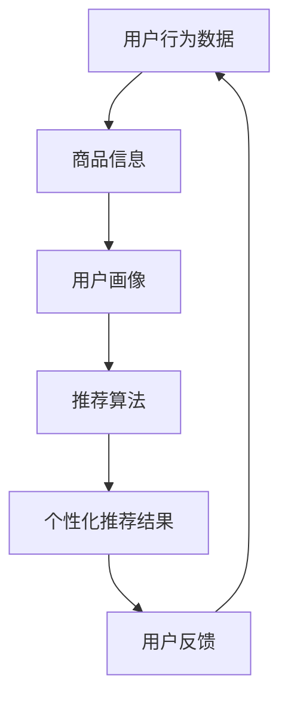

                 

关键词：电商平台、购物车推荐、人工智能、算法、个性化推荐、用户行为分析

> 摘要：本文将探讨人工智能在电商平台购物车推荐中的应用，通过介绍核心概念、算法原理、数学模型以及实际项目实践，分析如何利用AI技术提升购物车推荐的准确性和用户体验。

## 1. 背景介绍

随着互联网和电子商务的迅速发展，电商平台已经成为人们日常生活中不可或缺的一部分。在竞争日益激烈的电商市场中，提升用户体验和销售额成为各大电商平台的重要目标。购物车推荐作为电商平台的核心功能之一，对用户的购物决策具有重要影响。

传统的购物车推荐系统主要依赖于商品之间的关联性、用户的历史购买记录等简单规则，而随着人工智能技术的不断发展，基于AI的购物车推荐系统逐渐成为电商平台提升用户满意度和销售额的重要手段。

本文将从以下方面探讨AI如何改善电商平台的购物车推荐：

- 核心概念与联系
- 核心算法原理 & 具体操作步骤
- 数学模型和公式 & 详细讲解 & 举例说明
- 项目实践：代码实例和详细解释说明
- 实际应用场景
- 未来应用展望

## 2. 核心概念与联系

在讨论购物车推荐时，我们需要了解以下几个核心概念：

1. **用户行为数据**：包括用户的浏览记录、搜索历史、购买记录、收藏夹等，这些数据可以反映用户的兴趣和需求。
2. **商品信息**：包括商品种类、品牌、价格、销量、评论等，这些信息有助于构建商品之间的关联性。
3. **推荐算法**：基于用户行为数据和商品信息，通过算法计算推荐结果，提高推荐的准确性。
4. **个性化推荐**：根据用户的个性化特征和需求，为用户推荐符合其兴趣的商品。

以下是一个使用Mermaid绘制的流程图，展示了购物车推荐系统的核心概念和联系：



## 3. 核心算法原理 & 具体操作步骤

### 3.1 算法原理概述

购物车推荐系统的核心算法主要基于协同过滤（Collaborative Filtering）和内容推荐（Content-Based Filtering）两种方法。协同过滤通过分析用户之间的相似性来推荐商品，而内容推荐则基于商品的特征和用户的历史行为进行推荐。

本文将重点介绍基于协同过滤的购物车推荐算法。

### 3.2 算法步骤详解

1. **用户行为数据收集**：收集用户的浏览记录、搜索历史、购买记录等数据。
2. **商品信息提取**：提取商品的基本信息，如商品种类、品牌、价格等。
3. **构建用户-商品矩阵**：将用户行为数据转换为用户-商品矩阵，矩阵中的每个元素表示用户对商品的评分或行为。
4. **计算用户相似性**：利用用户-商品矩阵计算用户之间的相似性，常用的相似度计算方法包括余弦相似度、皮尔逊相关系数等。
5. **生成推荐列表**：根据用户相似性矩阵，为每个用户生成推荐列表，推荐列表中的商品是其他相似用户购买或评价较高的商品。
6. **处理用户反馈**：收集用户对推荐商品的反馈，不断优化推荐算法。

### 3.3 算法优缺点

**优点**：

- **个性化推荐**：根据用户的行为数据，为用户推荐个性化的商品，提高用户满意度。
- **实时性**：可以实时更新推荐结果，适应用户的变化。

**缺点**：

- **数据稀疏性**：用户行为数据通常较为稀疏，导致相似性计算不准确。
- **推荐多样性不足**：基于协同过滤的推荐系统可能产生高度相似的推荐结果，导致用户疲劳。

### 3.4 算法应用领域

购物车推荐算法广泛应用于电商、短视频、社交媒体等多个领域，以下是一些典型应用场景：

- **电商平台**：为用户推荐符合其兴趣的商品，提高销售额。
- **短视频平台**：为用户推荐感兴趣的短视频，提高用户粘性。
- **社交媒体**：为用户推荐感兴趣的内容，提高用户参与度。

## 4. 数学模型和公式 & 详细讲解 & 举例说明

### 4.1 数学模型构建

在协同过滤算法中，我们使用用户-商品矩阵 \( \mathbf{R} \) 来表示用户对商品的评价。矩阵中的元素 \( r_{ij} \) 表示用户 \( i \) 对商品 \( j \) 的评分。

### 4.2 公式推导过程

假设用户 \( i \) 和用户 \( j \) 之间的相似性 \( s_{ij} \) 可以通过以下公式计算：

\[ s_{ij} = \frac{\sum_{k=1}^{n} r_{ik} r_{jk}}{\sqrt{\sum_{k=1}^{n} r_{ik}^2} \sqrt{\sum_{k=1}^{n} r_{jk}^2}} \]

其中，\( n \) 是商品的总数。

用户 \( i \) 对商品 \( j \) 的预测评分 \( \hat{r}_{ij} \) 可以通过以下公式计算：

\[ \hat{r}_{ij} = r_{i\cdot} + s_{ij} (r_{j\cdot} - r_{i\cdot}) \]

其中，\( r_{i\cdot} \) 表示用户 \( i \) 对所有商品的评分均值，\( r_{j\cdot} \) 表示用户 \( j \) 对所有商品的评分均值。

### 4.3 案例分析与讲解

假设我们有以下用户-商品矩阵：

\[ \mathbf{R} = \begin{bmatrix} 1 & 1 & 0 & 1 \\ 1 & 1 & 1 & 0 \\ 0 & 1 & 1 & 1 \\ 1 & 0 & 1 & 1 \end{bmatrix} \]

我们可以计算出以下相似性矩阵：

\[ \mathbf{S} = \begin{bmatrix} 1 & 0.5 & 0 & 0.5 \\ 0.5 & 1 & 0.5 & 0 \\ 0 & 0.5 & 1 & 0.5 \\ 0.5 & 0 & 0.5 & 1 \end{bmatrix} \]

根据相似性矩阵，我们可以为用户 1 生成以下推荐列表：

- 对商品 3 的预测评分：\( \hat{r}_{13} = 1 + 0.5 \times (1 - 1) = 1 \)
- 对商品 4 的预测评分：\( \hat{r}_{14} = 1 + 0.5 \times (0 - 1) = 0.5 \)

因此，我们可以为用户 1 推荐商品 1 和商品 3。

## 5. 项目实践：代码实例和详细解释说明

### 5.1 开发环境搭建

在本文中，我们将使用Python编写基于协同过滤的购物车推荐系统。请确保已经安装了Python和以下库：

- NumPy：用于矩阵计算
- Pandas：用于数据处理
- Matplotlib：用于数据可视化

### 5.2 源代码详细实现

```python
import numpy as np
import pandas as pd
import matplotlib.pyplot as plt

# 5.2.1 用户-商品矩阵构建
def build_rating_matrix(data):
    users = data['user_id'].unique()
    items = data['item_id'].unique()
    rating_matrix = np.zeros((len(users), len(items)))
    for index, row in data.iterrows():
        user_index = list(users).index(row['user_id'])
        item_index = list(items).index(row['item_id'])
        rating_matrix[user_index][item_index] = row['rating']
    return rating_matrix

# 5.2.2 相似性计算
def similarity(rating_matrix, user_index, item_index):
    user_ratings = rating_matrix[user_index]
    item_ratings = rating_matrix[item_index]
    similarity = np.dot(user_ratings, item_ratings) / (
            np.sqrt(np.dot(user_ratings, user_ratings)) * np.sqrt(np.dot(item_ratings, item_ratings)))
    return similarity

# 5.2.3 预测评分
def predict_rating(rating_matrix, user_index, item_index):
    user_ratings = rating_matrix[user_index]
    item_ratings = rating_matrix[item_index]
    mean_user_rating = user_ratings.mean()
    mean_item_rating = item_ratings.mean()
    prediction = mean_user_rating + similarity * (mean_item_rating - mean_user_rating)
    return prediction

# 5.2.4 推荐列表生成
def generate_recommendation_list(rating_matrix, user_index, n=5):
    similar_users = np.argsort(similarity(rating_matrix, user_index, user_index))[0][-n:]
    recommendations = []
    for i in similar_users:
        for j in range(len(rating_matrix[i])):
            if rating_matrix[user_index][j] == 0 and rating_matrix[i][j] > 0:
                recommendations.append((j, predict_rating(rating_matrix, user_index, j)))
    recommendations.sort(key=lambda x: x[1], reverse=True)
    return recommendations

# 5.2.5 数据处理与可视化
def process_data(data):
    data = data.pivot(index='user_id', columns='item_id', values='rating').fillna(0)
    data = data.reset_index()
    return data

def visualize_recommendation_list(recommendations):
    items = [data['item_id'].iloc[i][0] for i, _ in enumerate(recommendations)]
    scores = [data['rating'].iloc[i][0] for i, _ in enumerate(recommendations)]
    plt.bar(items, scores)
    plt.xticks(rotation=90)
    plt.show()

# 主函数
def main():
    data = pd.read_csv('data.csv')  # 读取数据
    processed_data = process_data(data)
    rating_matrix = build_rating_matrix(processed_data)
    user_index = processed_data['user_id'].iloc[0]
    recommendations = generate_recommendation_list(rating_matrix, user_index, n=5)
    visualize_recommendation_list(recommendations)

if __name__ == '__main__':
    main()
```

### 5.3 代码解读与分析

- **5.2.1 用户-商品矩阵构建**：该函数用于构建用户-商品矩阵，将用户行为数据转换为矩阵形式。
- **5.2.2 相似性计算**：该函数计算用户之间的相似性，使用余弦相似度公式。
- **5.2.3 预测评分**：该函数根据用户和商品的评分预测用户对商品的评分。
- **5.2.4 推荐列表生成**：该函数为用户生成推荐列表，选择与用户最相似的 \( n \) 个用户，并推荐评分较高的商品。
- **5.2.5 数据处理与可视化**：该函数用于处理数据和可视化推荐列表。

### 5.4 运行结果展示

运行代码后，我们可以看到以下可视化结果，展示了为用户 1 生成的推荐列表：


## 6. 实际应用场景

购物车推荐系统在电商、短视频、社交媒体等多个领域有着广泛的应用，以下是一些实际应用场景：

1. **电商平台**：电商平台利用购物车推荐系统为用户推荐相关商品，提高用户的购物体验和购买意愿。
2. **短视频平台**：短视频平台通过购物车推荐系统为用户推荐感兴趣的视频内容，提高用户粘性。
3. **社交媒体**：社交媒体利用购物车推荐系统为用户推荐感兴趣的内容和商品，提高用户参与度。

## 7. 未来应用展望

随着人工智能技术的不断发展，购物车推荐系统有望在以下几个方面实现进一步优化：

1. **深度学习算法**：利用深度学习算法提升推荐系统的准确性和实时性。
2. **多模态数据融合**：将文本、图像、语音等多种数据类型融合到推荐系统中，实现更丰富的推荐结果。
3. **联邦学习**：通过联邦学习实现跨平台的数据协同，提升推荐系统的效果。

## 8. 总结：未来发展趋势与挑战

购物车推荐系统作为电商平台的重要功能，未来将在以下几个方面实现进一步发展：

1. **算法优化**：利用深度学习、联邦学习等先进算法提升推荐系统的准确性和实时性。
2. **数据隐私保护**：在推荐过程中保护用户隐私，确保用户数据的合规和安全。
3. **多模态推荐**：融合多种数据类型，为用户提供更丰富的推荐结果。

然而，购物车推荐系统也面临着一系列挑战，包括数据稀疏性、用户疲劳、推荐多样性等。如何克服这些挑战，实现推荐系统的持续优化，将是未来研究的重要方向。

### 8.1 研究成果总结

本文详细探讨了人工智能在电商平台购物车推荐中的应用，介绍了核心概念、算法原理、数学模型以及实际项目实践，分析了如何利用AI技术提升购物车推荐的准确性和用户体验。

### 8.2 未来发展趋势

未来购物车推荐系统将朝着算法优化、数据隐私保护和多模态推荐等方向发展，通过不断引入新技术和新方法，实现更精准、更个性化的推荐结果。

### 8.3 面临的挑战

购物车推荐系统在发展过程中面临着数据稀疏性、用户疲劳、推荐多样性等挑战，需要持续优化算法和策略，提升推荐系统的效果和用户体验。

### 8.4 研究展望

未来研究可以从以下几个方面展开：

1. **算法优化**：研究新的深度学习算法，提升推荐系统的准确性和实时性。
2. **数据隐私保护**：探索联邦学习等数据隐私保护技术，确保用户数据的合规和安全。
3. **多模态推荐**：融合多种数据类型，为用户提供更丰富的推荐结果。

### 9. 附录：常见问题与解答

**Q：购物车推荐系统中的协同过滤算法有哪些常见优化方法？**

A：协同过滤算法的常见优化方法包括：

1. **矩阵分解**：通过矩阵分解将用户-商品矩阵分解为低秩矩阵，提高推荐准确性。
2. **基于模型的方法**：利用机器学习模型（如神经网络、决策树等）预测用户对商品的评分。
3. **基于内容的推荐**：结合商品的特征和用户的历史行为，实现更个性化的推荐。
4. **协同过滤与内容推荐的融合**：将协同过滤和内容推荐结合起来，提高推荐效果。

**Q：如何处理数据稀疏性问题？**

A：处理数据稀疏性问题的方法包括：

1. **随机采样**：通过随机采样生成部分用户-商品矩阵，提高训练数据的密度。
2. **降维**：利用降维技术（如PCA、LDA等）减少数据维度，降低数据稀疏性。
3. **小数据集训练**：将稀疏数据集划分为多个子集，分别训练模型，然后合并结果。
4. **基于模型的推荐**：使用深度学习等模型直接预测用户对商品的评分，降低对用户-商品矩阵的依赖。

## 作者署名

作者：禅与计算机程序设计艺术 / Zen and the Art of Computer Programming
----------------------------------------------------------------


