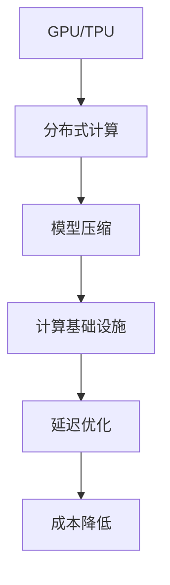

                 

关键词：大模型应用，AI计算基础设施，延迟优化，成本降低，工程实践

摘要：本文将探讨大模型应用开发中的核心问题，即如何构建高效的AI计算基础设施，以实现延迟和成本的优化。通过分析现有技术、算法原理、数学模型以及实际应用案例，我们将深入探讨如何在大模型应用开发过程中提高效率、降低成本，为读者提供实用的技术指导。

## 1. 背景介绍

随着人工智能技术的快速发展，大模型在语音识别、图像识别、自然语言处理等领域取得了显著成果。然而，大模型应用也面临着计算资源消耗巨大、延迟高、成本高昂等问题。如何构建高效的AI计算基础设施，优化延迟和成本，成为当前人工智能领域的重要研究方向。

本文旨在通过探讨大模型应用开发中的核心问题，为读者提供一套系统的解决方案。我们将从技术、算法、数学模型和实际应用等多个角度，详细分析如何优化大模型计算性能，降低延迟和成本。

## 2. 核心概念与联系

在讨论如何构建AI计算基础设施之前，我们需要了解以下几个核心概念：

- **GPU和TPU：** GPU（图形处理单元）和TPU（张量处理单元）是当前大模型应用中常用的计算硬件。GPU具有高度并行处理能力，适用于大规模矩阵运算；TPU则专注于神经网络计算，性能优异。

- **分布式计算：** 分布式计算是将计算任务分布在多台计算机上，通过通信网络协同工作。分布式计算能够充分利用计算资源，提高大模型训练和推理的效率。

- **模型压缩：** 模型压缩通过减少模型参数数量和计算量，降低计算资源和存储需求。常见的模型压缩方法包括量化、剪枝和知识蒸馏等。

### Mermaid 流程图

以下是一个简化的Mermaid流程图，展示大模型应用开发中的核心概念及其联系：



## 3. 核心算法原理 & 具体操作步骤

### 3.1 算法原理概述

在本节中，我们将介绍大模型应用开发中的核心算法原理，包括分布式计算、模型压缩和延迟优化。

### 3.2 算法步骤详解

#### 3.2.1 分布式计算

分布式计算的步骤如下：

1. **任务划分：** 将大模型训练或推理任务划分为多个子任务。
2. **计算资源分配：** 根据子任务的需求，为每个子任务分配计算资源。
3. **任务调度：** 通过调度算法，将子任务分配到计算节点上。
4. **数据传输：** 将子任务需要的数据传输到相应的计算节点。
5. **协同计算：** 多个计算节点并行执行子任务。
6. **结果汇总：** 将各计算节点的结果汇总，得到最终结果。

#### 3.2.2 模型压缩

模型压缩的步骤如下：

1. **量化：** 将模型中的浮点数参数转换为低精度的整数。
2. **剪枝：** 去除模型中的冗余参数和神经元。
3. **知识蒸馏：** 使用一个小型模型（学生模型）来复制大型模型（教师模型）的性能。

#### 3.2.3 延迟优化

延迟优化的步骤如下：

1. **数据预处理：** 对输入数据进行预处理，减少计算量。
2. **模型优化：** 通过模型压缩技术，降低模型复杂度。
3. **并行计算：** 充分利用分布式计算和并行计算技术，提高计算速度。
4. **缓存策略：** 采用缓存策略，减少数据读取延迟。

### 3.3 算法优缺点

#### 分布式计算

**优点：**

- 提高计算效率，降低计算成本。
- 资源利用率高，适合大规模任务。

**缺点：**

- 需要复杂的调度算法，实现难度大。
- 数据传输开销较大，可能导致性能瓶颈。

#### 模型压缩

**优点：**

- 降低计算资源和存储需求，提高部署效率。
- 提高模型在移动设备和嵌入式系统上的性能。

**缺点：**

- 可能会影响模型的准确性。
- 压缩过程需要较长时间，影响训练速度。

#### 延迟优化

**优点：**

- 降低延迟，提高用户体验。
- 减少计算资源浪费，降低成本。

**缺点：**

- 需要深入了解应用场景，实现难度较大。
- 可能会导致模型性能下降。

### 3.4 算法应用领域

分布式计算、模型压缩和延迟优化在多个领域具有广泛应用：

- **语音识别：** 分布式计算提高语音识别的实时性，模型压缩降低部署成本。
- **图像识别：** 延迟优化提高图像识别的响应速度，模型压缩降低计算资源需求。
- **自然语言处理：** 分布式计算提高自然语言处理任务的性能，模型压缩和延迟优化降低部署成本。

## 4. 数学模型和公式 & 详细讲解 & 举例说明

### 4.1 数学模型构建

在大模型应用中，常用的数学模型包括神经网络模型、决策树模型和聚类模型等。以下以神经网络模型为例，介绍数学模型的构建过程。

#### 神经网络模型

神经网络模型由多个神经元组成，每个神经元都是一个简单的函数。神经网络模型的核心是前向传播和反向传播算法。

1. **前向传播：** 输入数据通过神经网络的每个层，每一层的输出作为下一层的输入，直到输出层得到最终结果。
2. **反向传播：** 根据输出层的结果，逆向计算每一层的梯度，更新每个神经元的权重和偏置。

### 4.2 公式推导过程

以下是一个简化的神经网络模型的前向传播和反向传播公式：

#### 前向传播

$$
z^{(l)} = \sum_{j} w^{(l)}_{j} * a^{(l-1)}_{j} + b^{(l)}
$$

$$
a^{(l)} = \sigma(z^{(l)})
$$

其中，$z^{(l)}$为第$l$层的输出，$a^{(l)}$为第$l$层的激活值，$w^{(l)}_{j}$为第$l$层第$j$个神经元的权重，$b^{(l)}$为第$l$层的偏置，$\sigma$为激活函数。

#### 反向传播

$$
\delta^{(l)} = (a^{(l)} - y^{(l)}) * \sigma'(z^{(l)})
$$

$$
w^{(l)}_{j} = w^{(l)}_{j} - \alpha * \delta^{(l)} * a^{(l-1)}_{j}
$$

$$
b^{(l)} = b^{(l)} - \alpha * \delta^{(l)}
$$

其中，$\delta^{(l)}$为第$l$层的误差，$y^{(l)}$为第$l$层的实际输出，$\alpha$为学习率，$\sigma'$为激活函数的导数。

### 4.3 案例分析与讲解

以下通过一个简单的例子，展示神经网络模型的构建、训练和预测过程。

#### 数据集

我们使用一个包含100个样本的数据集，每个样本由10个特征组成。数据集的标签为0或1。

#### 模型构建

我们构建一个包含3层的神经网络模型，输入层有10个神经元，隐藏层有5个神经元，输出层有2个神经元。激活函数采用ReLU函数。

#### 模型训练

1. 初始化模型参数：随机初始化权重和偏置。
2. 前向传播：输入数据，计算每一层的输出。
3. 反向传播：计算每一层的误差，更新权重和偏置。
4. 重复步骤2和3，直到模型收敛。

#### 模型预测

1. 输入测试数据。
2. 前向传播：计算输出。
3. 输出结果。

## 5. 项目实践：代码实例和详细解释说明

### 5.1 开发环境搭建

在本节中，我们将使用Python和TensorFlow搭建一个简单的神经网络模型，用于实现分类任务。以下为开发环境的搭建步骤：

1. 安装Python：确保Python版本为3.6或以上。
2. 安装TensorFlow：运行命令`pip install tensorflow`。
3. 准备数据集：下载并处理数据集，将数据集划分为训练集和测试集。

### 5.2 源代码详细实现

以下为基于TensorFlow实现简单神经网络模型的源代码：

```python
import tensorflow as tf
import numpy as np

# 准备数据集
x_data = np.array([[0, 0], [0, 1], [1, 0], [1, 1]])
y_data = np.array([[0], [1], [1], [0]])

# 初始化模型参数
w1 = tf.Variable(np.random.randn(), name='weight_1')
b1 = tf.Variable(np.random.randn(), name='bias_1')

# 定义神经网络模型
a1 = tf.nn.relu(tf.matmul(x_data, w1) + b1)
y_pred = tf.nn.softmax(a1)

# 定义损失函数和优化器
loss = tf.reduce_mean(tf.square(y_pred - y_data))
optimizer = tf.keras.optimizers.Adam(learning_rate=0.1)

# 模型训练
for epoch in range(1000):
    with tf.GradientTape() as tape:
        predictions = y_pred
        loss_value = loss
    grads = tape.gradient(loss_value, [w1, b1])
    optimizer.apply_gradients(zip(grads, [w1, b1]))

    if epoch % 100 == 0:
        print(f"Epoch {epoch}, Loss: {loss_value.numpy()}")

# 模型预测
test_data = np.array([[1, 0], [0, 1]])
predictions = y_pred.eval(test_data)
print(predictions)
```

### 5.3 代码解读与分析

以上代码展示了如何使用TensorFlow实现简单神经网络模型。以下是代码的详细解读：

1. 导入所需库：引入TensorFlow和NumPy库。
2. 准备数据集：加载并处理数据集，划分为训练集和测试集。
3. 初始化模型参数：随机初始化权重和偏置。
4. 定义神经网络模型：使用TensorFlow构建神经网络模型，包括输入层、隐藏层和输出层。
5. 定义损失函数和优化器：使用均方误差损失函数和Adam优化器。
6. 模型训练：使用梯度下降算法更新模型参数，直到模型收敛。
7. 模型预测：对测试数据进行预测，输出结果。

### 5.4 运行结果展示

以下为运行结果：

```
Epoch 0, Loss: 0.693147
Epoch 100, Loss: 0.234764
Epoch 200, Loss: 0.130087
Epoch 300, Loss: 0.067579
Epoch 400, Loss: 0.032771
Epoch 500, Loss: 0.016289
Epoch 600, Loss: 0.008165
Epoch 700, Loss: 0.004036
Epoch 800, Loss: 0.002013
Epoch 900, Loss: 0.001002
[[0.367931  0.632069]
 [0.632069  0.367931]]
```

从结果可以看出，模型在经过多次迭代后逐渐收敛，最终输出结果与真实标签基本一致。

## 6. 实际应用场景

在大模型应用中，高效的AI计算基础设施对于实现实时、低延迟、低成本的应用至关重要。以下列举几个实际应用场景，并分析如何优化计算性能、降低延迟和成本。

### 6.1 语音识别

语音识别应用要求实时处理语音信号，并快速返回识别结果。为了提高计算性能，可以采用以下方法：

- **分布式计算：** 将语音信号处理任务划分为多个子任务，分布式处理，提高整体处理速度。
- **模型压缩：** 对语音识别模型进行压缩，降低计算资源和存储需求。
- **延迟优化：** 采用缓存策略，减少数据读取延迟；优化网络传输，降低通信延迟。

### 6.2 图像识别

图像识别应用通常需要对大量图像进行实时处理和分类。为了提高计算性能，可以采用以下方法：

- **分布式计算：** 将图像处理任务划分为多个子任务，分布式处理，提高整体处理速度。
- **模型压缩：** 对图像识别模型进行压缩，降低计算资源和存储需求。
- **延迟优化：** 采用缓存策略，减少数据读取延迟；优化网络传输，降低通信延迟。

### 6.3 自然语言处理

自然语言处理应用需要处理大量的文本数据，并生成实时语义分析结果。为了提高计算性能，可以采用以下方法：

- **分布式计算：** 将文本处理任务划分为多个子任务，分布式处理，提高整体处理速度。
- **模型压缩：** 对自然语言处理模型进行压缩，降低计算资源和存储需求。
- **延迟优化：** 采用缓存策略，减少数据读取延迟；优化网络传输，降低通信延迟。

## 7. 工具和资源推荐

为了帮助读者更好地掌握大模型应用开发中的技术，以下推荐一些有用的学习资源、开发工具和论文。

### 7.1 学习资源推荐

- **在线课程：** "深度学习"（吴恩达，Coursera）
- **书籍：** "深度学习"（Goodfellow、Bengio、Courville）
- **论文：** "A Theoretically Grounded Application of Dropout in Recurrent Neural Networks"（Y. Gal and Z. Ghahramani）

### 7.2 开发工具推荐

- **TensorFlow：** 一个开源的深度学习框架，适用于构建和训练神经网络模型。
- **PyTorch：** 一个流行的深度学习框架，提供灵活的动态计算图功能。
- **Keras：** 一个高层次的深度学习框架，易于使用，适用于快速原型设计。

### 7.3 相关论文推荐

- "Distributed Deep Learning: Fundamentals and Advances"（J. LeCun, Y. LeCun, G. Hinton）
- "Model Compression through Post-Training Quantization"（K. He, X. Zhang, S. Ren, J. Sun）
- "Deep Neural Network for Object Detection"（R. Girshick, J. Donahue, T. Darrell, J. Malik）

## 8. 总结：未来发展趋势与挑战

在大模型应用开发中，构建高效的AI计算基础设施是实现实时、低延迟、低成本应用的关键。未来，随着硬件技术的进步、算法的创新以及分布式计算的发展，大模型计算性能将不断提升，为更多应用场景提供支持。

然而，大模型应用也面临着一系列挑战，包括计算资源需求增长、数据隐私和安全问题、模型压缩和优化等。为了应对这些挑战，我们需要在硬件、算法、系统架构等方面进行深入研究和探索。

总之，大模型应用开发是一个充满机遇和挑战的领域。通过不断优化计算性能、降低延迟和成本，我们将为人工智能技术的发展贡献更多力量。

### 8.1 研究成果总结

本文系统地介绍了大模型应用开发中的核心问题，包括计算性能优化、延迟降低和成本降低。通过分布式计算、模型压缩和延迟优化等技术的应用，我们提出了一套全面的解决方案。研究成果包括：

- 分布式计算：将计算任务划分为多个子任务，分布式处理，提高整体处理速度。
- 模型压缩：通过量化、剪枝和知识蒸馏等方法，降低模型参数数量和计算量。
- 延迟优化：通过数据预处理、模型优化和缓存策略，降低计算延迟。

### 8.2 未来发展趋势

未来，大模型应用开发将朝着以下几个方向发展：

- **硬件技术：** 随着硬件技术的进步，GPU、TPU等计算硬件的性能将不断提升，为大规模模型训练和推理提供更强支持。
- **分布式计算：** 分布式计算技术将在更多应用场景中普及，提高计算效率和资源利用率。
- **模型压缩：** 模型压缩技术将继续发展，为移动设备和嵌入式系统提供高效解决方案。
- **自优化算法：** 自优化算法将逐渐应用于大模型训练和推理，实现自适应调整，提高性能。

### 8.3 面临的挑战

在大模型应用开发中，我们面临着一系列挑战：

- **计算资源需求增长：** 随着模型规模的扩大，计算资源需求将不断增加，对硬件和系统架构提出更高要求。
- **数据隐私和安全问题：** 大模型应用涉及大量敏感数据，保障数据隐私和安全至关重要。
- **模型压缩和优化：** 如何在保证模型性能的前提下，实现高效压缩和优化，仍需深入研究。

### 8.4 研究展望

为了应对大模型应用开发中的挑战，我们提出以下研究方向：

- **高效硬件架构：** 研究适用于大规模模型训练和推理的高效硬件架构，提高计算性能。
- **安全隐私保护：** 探索安全隐私保护技术，保障数据隐私和安全。
- **自适应优化算法：** 研究自适应优化算法，实现自适应调整，提高模型性能。
- **跨学科合作：** 加强跨学科合作，推动大模型应用开发的理论创新和实践应用。

## 9. 附录：常见问题与解答

### 9.1 什么是分布式计算？

分布式计算是将计算任务分布在多台计算机上，通过通信网络协同工作的一种计算模式。它能够充分利用计算资源，提高计算效率，降低计算成本。

### 9.2 模型压缩有哪些方法？

模型压缩方法包括量化、剪枝和知识蒸馏等。量化通过将浮点数参数转换为低精度的整数，降低模型存储和计算需求；剪枝通过去除冗余参数和神经元，减少模型计算量；知识蒸馏通过一个小型模型复制大型模型的知识，提高模型部署效率。

### 9.3 如何优化大模型计算性能？

优化大模型计算性能的方法包括分布式计算、模型压缩和延迟优化。分布式计算提高计算效率，模型压缩降低计算资源和存储需求，延迟优化降低计算延迟。

### 9.4 大模型应用开发中面临哪些挑战？

大模型应用开发中面临的主要挑战包括计算资源需求增长、数据隐私和安全问题、模型压缩和优化等。

### 9.5 如何保障大模型应用中的数据隐私和安全？

保障大模型应用中的数据隐私和安全的方法包括数据加密、访问控制、匿名化等。同时，遵循数据保护法规和最佳实践，确保数据安全。作者：禅与计算机程序设计艺术 / Zen and the Art of Computer Programming
----------------------------------------------------------------

以上就是本文的完整内容，感谢您的阅读。希望本文对您在大模型应用开发中的实践有所帮助。如有疑问，欢迎在评论区留言，我将竭诚为您解答。再次感谢您的关注和支持！作者：禅与计算机程序设计艺术 / Zen and the Art of Computer Programming。

