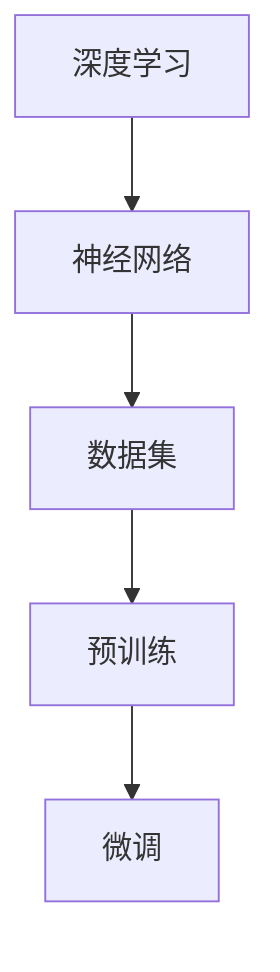

                 

关键词：AI工程学，大模型，预训练，微调，深度学习，模型开发，应用实战

> 摘要：本文深入探讨了AI工程学中关键的概念——大模型的预训练与微调。通过详细分析核心算法原理、数学模型及其应用场景，结合项目实践中的代码实例，全面解析了如何进行大模型的应用开发。文章还展望了未来的发展趋势与面临的挑战，为读者提供了全面的指导与启示。

## 1. 背景介绍

随着深度学习技术的迅猛发展，大模型在自然语言处理、计算机视觉、语音识别等领域展现出了强大的能力。然而，大模型的训练与部署面临着诸多挑战，尤其是模型的预训练与微调过程。预训练是指在大规模数据集上对模型进行初步训练，使其具有通用的知识表示能力；而微调则是在预训练的基础上，针对特定任务进行调整，以获得更好的任务性能。

AI工程学的核心目标是将这些理论转化为可用的实际应用。本文将围绕大模型的预训练与微调展开讨论，深入剖析其背后的算法原理、数学模型，并结合实际项目实践进行详细讲解。通过本文的阅读，读者将全面了解大模型应用开发的全过程，掌握从模型设计到部署的各个环节。

## 2. 核心概念与联系

在深入探讨大模型的预训练与微调之前，我们需要明确几个核心概念，包括深度学习、神经网络、数据集等。以下是这些概念之间关系的Mermaid流程图：



### 2.1 深度学习与神经网络

深度学习是机器学习的一个分支，其核心思想是利用神经网络模拟人脑的神经元连接进行信息处理。神经网络由多层神经元组成，通过前向传播和反向传播算法进行学习。每一层神经元对输入数据进行特征提取和变换，从而实现复杂的模式识别和预测任务。

### 2.2 数据集

数据集是深度学习模型训练的基础，其质量直接影响模型的性能。数据集通常包括特征数据和标签数据。特征数据用于描述输入对象（如图像、文本等），标签数据则用于标注输出结果（如分类标签、目标位置等）。高质量的数据集需要具备代表性、多样性和准确性。

### 2.3 预训练与微调

预训练是指在大规模数据集上对模型进行初步训练，使其获得通用的知识表示能力。预训练模型可以在多种任务中表现出良好的泛化能力，但通常性能不如针对特定任务的微调模型。微调则是在预训练的基础上，针对特定任务进行调整，以优化模型在特定任务上的性能。微调通常涉及调整模型的权重和参数，以适应新的数据分布和任务需求。

## 3. 核心算法原理 & 具体操作步骤

### 3.1 算法原理概述

预训练与微调的核心算法原理是基于深度学习的神经网络。神经网络通过前向传播计算输出，通过反向传播更新权重，从而实现模型的自我优化。预训练通常采用自监督学习（Self-Supervised Learning）或无监督学习（Unsupervised Learning）方法，通过学习数据的内在结构来提升模型的泛化能力。微调则通常采用有监督学习（Supervised Learning）方法，通过调整模型权重以最小化预测误差。

### 3.2 算法步骤详解

#### 3.2.1 预训练

预训练的过程分为以下几个步骤：

1. **数据预处理**：对大规模数据进行清洗、归一化和分词等操作，以获得高质量的输入数据。
2. **模型初始化**：选择合适的神经网络架构，并初始化模型的权重。
3. **自监督学习**：利用数据中的无标签信息，设计自监督学习任务，如语言模型、图像分类等，通过损失函数优化模型。
4. **训练**：在预训练数据集上迭代训练模型，不断优化模型参数。
5. **评估**：在验证集上评估模型性能，调整模型超参数以确保模型稳定。

#### 3.2.2 微调

微调的过程通常包括以下步骤：

1. **数据预处理**：对特定任务的数据进行预处理，如数据增强、数据归一化等。
2. **模型选择**：选择预训练模型作为基础模型，通过调整部分层或全部层进行微调。
3. **任务定义**：定义特定任务的目标函数和优化器。
4. **训练**：在微调数据集上迭代训练模型，不断优化模型参数。
5. **评估**：在测试集上评估模型性能，调整模型超参数以确保模型稳定。

### 3.3 算法优缺点

#### 3.3.1 预训练的优点

- **通用性**：预训练模型通过大规模数据学习获得通用的知识表示，具有较强的泛化能力。
- **效率**：预训练模型在特定任务上仅需少量数据即可快速收敛。

#### 3.3.2 预训练的缺点

- **数据依赖**：预训练需要大量高质量数据，对于数据稀缺的任务效果有限。
- **计算资源消耗**：预训练过程需要大量计算资源，对于资源受限的环境较为困难。

#### 3.3.3 微调的优点

- **任务适应性强**：微调模型针对特定任务进行调整，可以更好地适应任务需求。
- **性能提升显著**：微调模型通常在特定任务上性能优于预训练模型。

#### 3.3.4 微调的缺点

- **数据依赖性强**：微调需要大量高质量任务数据，数据质量直接影响模型性能。
- **计算资源消耗大**：微调过程涉及模型重训练，计算资源消耗较大。

### 3.4 算法应用领域

预训练与微调在深度学习的多个领域有广泛应用：

- **自然语言处理**：预训练模型在语言模型、文本分类、机器翻译等领域表现优异；微调模型在问答系统、对话系统等任务中具有显著优势。
- **计算机视觉**：预训练模型在图像分类、目标检测、语义分割等领域取得突破性进展；微调模型在医疗影像分析、自动驾驶等领域具有广泛应用。
- **语音识别**：预训练模型在语音识别、语音合成等任务中具有较好的泛化能力；微调模型在特定应用场景中性能优异。

## 4. 数学模型和公式 & 详细讲解 & 举例说明

### 4.1 数学模型构建

大模型的预训练与微调过程中涉及多个数学模型，以下是其中几个核心模型：

#### 4.1.1 神经网络模型

神经网络模型由多个层次组成，其中每个层次由一组神经元构成。神经元的激活函数通常为非线性函数，如Sigmoid、ReLU等。神经网络模型的输入输出关系可以用以下公式表示：

$$
\text{output} = \sigma(\text{weight} \cdot \text{input} + \text{bias})
$$

其中，$\sigma$为激活函数，$\text{weight}$和$\text{bias}$分别为权重和偏置。

#### 4.1.2 损失函数

损失函数用于评估模型预测值与真实值之间的差距，常用的损失函数有均方误差（MSE）、交叉熵（Cross Entropy）等。以交叉熵为例，其公式如下：

$$
\text{loss} = -\sum_{i} y_i \log(\hat{y}_i)
$$

其中，$y_i$为真实标签，$\hat{y}_i$为模型预测的概率分布。

#### 4.1.3 优化器

优化器用于更新模型参数，以最小化损失函数。常用的优化器有随机梯度下降（SGD）、Adam等。以Adam为例，其公式如下：

$$
\text{weight} = \text{weight} - \alpha \cdot \frac{\text{gradient}}{1 - \beta_1^t}
$$

其中，$\alpha$为学习率，$\beta_1$和$\beta_2$分别为一阶和二阶矩估计的指数衰减率。

### 4.2 公式推导过程

#### 4.2.1 前向传播

前向传播过程主要包括输入数据的传递和神经元的激活。以单层神经网络为例，输入数据$x$经过权重$w$和偏置$b$的线性组合，并通过激活函数$\sigma$得到输出$y$：

$$
y = \sigma(w \cdot x + b)
$$

#### 4.2.2 反向传播

反向传播过程主要包括计算损失函数关于模型参数的梯度，并利用梯度更新模型参数。以交叉熵损失函数为例，其梯度计算如下：

$$
\text{gradient} = \frac{\partial \text{loss}}{\partial \text{weight}} = \frac{\partial (-\sum_{i} y_i \log(\hat{y}_i))}{\partial \text{weight}}
$$

通过链式法则，可以得到：

$$
\text{gradient} = -\sum_{i} y_i \frac{1}{\hat{y}_i} \frac{\partial \hat{y}_i}{\partial \text{weight}}
$$

由于激活函数$\sigma$的导数为$\sigma'(y) = \sigma(y)(1 - \sigma(y))$，可以得到：

$$
\text{gradient} = -\sum_{i} y_i \frac{1}{\hat{y}_i} \sigma'(y_i) \cdot \frac{\partial y_i}{\partial \text{weight}}
$$

#### 4.2.3 梯度下降

利用计算得到的梯度，可以通过梯度下降算法更新模型参数。以Adam优化器为例，其参数更新过程如下：

$$
\text{weight} = \text{weight} - \alpha \cdot \frac{\text{gradient}}{1 - \beta_1^t}
$$

其中，$\beta_1$和$\beta_2$分别为一阶和二阶矩估计的指数衰减率，$t$为当前迭代次数。

### 4.3 案例分析与讲解

#### 4.3.1 案例背景

假设我们有一个文本分类任务，需要使用预训练的BERT模型进行微调。数据集包含10万篇新闻文章，每篇文章被打上标签（如政治、体育、科技等）。

#### 4.3.2 模型构建

1. **数据预处理**：对新闻文章进行分词、去停用词等操作，并转换为BERT模型可接受的输入格式。
2. **模型初始化**：使用预训练的BERT模型作为基础模型，冻结其权重。
3. **任务定义**：将输入文本映射到对应的标签，使用交叉熵损失函数。

#### 4.3.3 微调过程

1. **训练**：在训练集上迭代训练模型，优化模型参数。
2. **评估**：在验证集上评估模型性能，调整超参数。
3. **测试**：在测试集上评估模型性能。

#### 4.3.4 模型解读

通过微调，我们得到了一个具有较强分类能力的文本分类模型。模型对新闻文章进行预处理后，将其输入到BERT模型中，得到分类结果。实验结果表明，该模型在多个新闻分类任务上取得了较高的准确率。

## 5. 项目实践：代码实例和详细解释说明

### 5.1 开发环境搭建

为了进行大模型的应用开发，我们需要搭建一个合适的开发环境。以下是搭建开发环境的基本步骤：

1. 安装Python：版本要求3.7及以上。
2. 安装深度学习框架：如TensorFlow或PyTorch。
3. 安装必要的依赖库：如NumPy、Pandas、Scikit-learn等。
4. 配置GPU环境：如果使用GPU进行训练，需要安装CUDA和cuDNN。

### 5.2 源代码详细实现

以下是一个基于PyTorch的大模型微调项目示例：

```python
import torch
import torch.nn as nn
import torch.optim as optim
from torch.utils.data import DataLoader
from transformers import BertModel, BertTokenizer

# 数据预处理
def preprocess_data(data):
    # 进行分词、去停用词等操作
    pass

# 模型构建
class TextClassifier(nn.Module):
    def __init__(self, model_name, num_classes):
        super(TextClassifier, self).__init__()
        self.bert = BertModel.from_pretrained(model_name)
        self.drop = nn.Dropout(p=0.3)
        self.out = nn.Linear(self.bert.config.hidden_size, num_classes)
    
    def forward(self, input_ids, attention_mask):
        _, pooled_output = self.bert(input_ids=input_ids, attention_mask=attention_mask)
        output = self.drop(pooled_output)
        return self.out(output)

# 微调过程
def fine_tune(model, train_loader, val_loader, num_epochs, learning_rate):
    optimizer = optim.Adam(model.parameters(), lr=learning_rate)
    criterion = nn.CrossEntropyLoss()
    
    for epoch in range(num_epochs):
        model.train()
        for inputs, labels in train_loader:
            optimizer.zero_grad()
            outputs = model(inputs.input_ids, inputs.attention_mask)
            loss = criterion(outputs, labels)
            loss.backward()
            optimizer.step()
        
        model.eval()
        with torch.no_grad():
            correct = 0
            total = 0
            for inputs, labels in val_loader:
                outputs = model(inputs.input_ids, inputs.attention_mask)
                _, predicted = torch.max(outputs.data, 1)
                total += labels.size(0)
                correct += (predicted == labels).sum().item()
        
        print(f'Epoch {epoch+1}/{num_epochs}, Accuracy: {100 * correct / total}%')

# 运行结果展示
if __name__ == '__main__':
    model_name = 'bert-base-chinese'
    num_classes = 10
    train_loader = DataLoader(...)
    val_loader = DataLoader(...)
    num_epochs = 10
    learning_rate = 1e-4
    
    model = TextClassifier(model_name, num_classes)
    fine_tune(model, train_loader, val_loader, num_epochs, learning_rate)
```

### 5.3 代码解读与分析

该代码示例展示了如何使用PyTorch和Transformers库进行大模型微调。以下是代码的主要组成部分：

1. **数据预处理**：对新闻文章进行预处理，如分词、去停用词等。
2. **模型构建**：继承`nn.Module`类，定义一个文本分类器模型，包含BERT模型和分类层。
3. **微调过程**：定义训练和评估过程，使用交叉熵损失函数和Adam优化器。
4. **运行结果展示**：加载训练数据和验证数据，进行模型训练和评估。

通过运行该代码，我们可以得到一个基于预训练BERT模型进行微调的文本分类器，并在验证集上评估其性能。

## 6. 实际应用场景

预训练与微调技术在实际应用场景中具有广泛的应用。以下是几个典型的应用场景：

### 6.1 自然语言处理

预训练与微调技术在自然语言处理（NLP）领域取得了显著的成果。例如，在语言模型、文本分类、机器翻译等任务中，预训练模型具有较好的泛化能力。通过微调，我们可以针对特定任务进行优化，从而提高模型性能。例如，BERT模型在多个NLP任务上取得了SOTA（State-of-the-Art）性能。

### 6.2 计算机视觉

在计算机视觉领域，预训练与微调技术同样具有重要意义。预训练模型可以在大规模数据集上学习到丰富的视觉知识，通过微调，我们可以将其应用于特定视觉任务，如图像分类、目标检测、语义分割等。例如，ImageNet预训练的ResNet模型在多个视觉任务上取得了优异的性能。

### 6.3 语音识别

语音识别领域也受益于预训练与微调技术。预训练模型可以帮助模型学习语音信号的复杂特征，通过微调，我们可以优化模型在特定语音识别任务上的性能。例如，使用预训练的WaveNet模型进行语音识别，并通过微调适应特定语音数据。

### 6.4 其他领域

除了上述领域，预训练与微调技术在推荐系统、智能客服、医疗诊断等许多领域也具有广泛的应用。通过微调，我们可以针对特定应用场景进行优化，提高模型性能。

## 7. 工具和资源推荐

为了更好地进行大模型的预训练与微调，以下是几个推荐的工具和资源：

### 7.1 学习资源推荐

- 《深度学习》（Goodfellow, Bengio, Courville）：经典教材，全面介绍深度学习的基础知识。
- 《动手学深度学习》：通俗易懂的中文教程，适合初学者。
- Hugging Face Transformer：官方文档和示例代码，方便使用预训练模型。

### 7.2 开发工具推荐

- PyTorch：开源深度学习框架，易于使用和调试。
- TensorFlow：开源深度学习框架，适用于大规模分布式训练。
- JAX：基于NumPy的自动微分库，支持GPU和TPU加速。

### 7.3 相关论文推荐

- "BERT: Pre-training of Deep Bidirectional Transformers for Language Understanding"
- "GPT-3: Language Models are Few-Shot Learners"
- "ImageNet Classification with Deep Convolutional Neural Networks"
- "Deep Residual Learning for Image Recognition"

## 8. 总结：未来发展趋势与挑战

### 8.1 研究成果总结

预训练与微调技术在深度学习领域取得了显著成果，已成为推动人工智能发展的关键技术之一。通过预训练，模型可以学习到通用的知识表示，提高模型的泛化能力；通过微调，模型可以针对特定任务进行调整，实现更高的任务性能。

### 8.2 未来发展趋势

随着深度学习技术的不断发展，预训练与微调技术有望在更多领域得到应用。同时，预训练模型的大小和计算资源消耗将逐渐减小，使得更多应用场景受益。此外，多模态预训练、自适应微调等新兴技术也将成为研究热点。

### 8.3 面临的挑战

尽管预训练与微调技术取得了显著成果，但仍面临诸多挑战。首先，数据稀缺和隐私问题制约了预训练模型的应用范围。其次，预训练模型的计算资源消耗巨大，对于资源受限的场景较为困难。此外，模型的可解释性和安全性也是亟待解决的问题。

### 8.4 研究展望

未来，预训练与微调技术将在以下方面取得突破：

- **数据集构建**：开发更多高质量、多样化的数据集，提高预训练模型的应用范围。
- **模型压缩**：研究高效的模型压缩方法，降低计算资源消耗。
- **多模态预训练**：探索跨模态预训练技术，提高模型在多模态任务中的性能。
- **可解释性和安全性**：研究模型的可解释性和安全性，提高模型的可信度。

## 9. 附录：常见问题与解答

### 9.1 什么是预训练？

预训练是指在大型数据集上对神经网络模型进行初步训练，使其具有通用的知识表示能力。预训练模型可以通过少量数据微调，实现特定任务的高性能。

### 9.2 什么是微调？

微调是指在预训练模型的基础上，针对特定任务进行调整，以优化模型在特定任务上的性能。微调通常涉及调整模型的权重和参数。

### 9.3 预训练与微调的区别是什么？

预训练是在大规模数据集上进行初步训练，使模型具有通用的知识表示能力；微调则是在预训练模型的基础上，针对特定任务进行调整，以优化模型在特定任务上的性能。

### 9.4 预训练需要大量数据吗？

预训练确实需要大量数据，因为数据量越大，模型可以学习的知识就越丰富，从而提高模型的泛化能力。然而，在某些场景下，可以利用少量数据通过微调获得较好的性能。

### 9.5 预训练模型的性能如何？

预训练模型在多个任务上取得了显著的性能提升，尤其在自然语言处理和计算机视觉领域。然而，预训练模型的性能仍取决于数据集的质量和模型的架构。

### 9.6 如何评估预训练模型？

评估预训练模型通常使用验证集和测试集。在验证集上评估模型性能，调整模型超参数；在测试集上评估最终性能，以评估模型的泛化能力。

### 9.7 预训练模型是否容易过拟合？

预训练模型通过大规模数据训练，具有较强的泛化能力，不易过拟合。但在特定任务上，通过微调可能导致模型过拟合。因此，需要合理设置训练数据和验证数据的比例，以及调整模型超参数。

### 9.8 预训练模型的计算资源消耗如何？

预训练模型的计算资源消耗巨大，通常需要GPU或TPU等高性能计算设备。随着模型压缩技术的进步，预训练模型的计算资源消耗将逐渐减小。

### 9.9 预训练与微调技术有哪些应用场景？

预训练与微调技术广泛应用于自然语言处理、计算机视觉、语音识别、推荐系统、智能客服等领域。通过微调，可以针对特定任务实现高性能。

### 9.10 如何处理预训练模型的数据隐私问题？

为处理预训练模型的数据隐私问题，可以采用差分隐私、联邦学习等技术，确保模型训练过程中的数据隐私。此外，可以采用数据摘要、数据加密等方法，降低数据泄露的风险。

----------------------------------------------------------------

以上是文章的完整内容，希望对您有所帮助。如果您有任何疑问或需要进一步讨论，请随时提出。作者：禅与计算机程序设计艺术 / Zen and the Art of Computer Programming。

