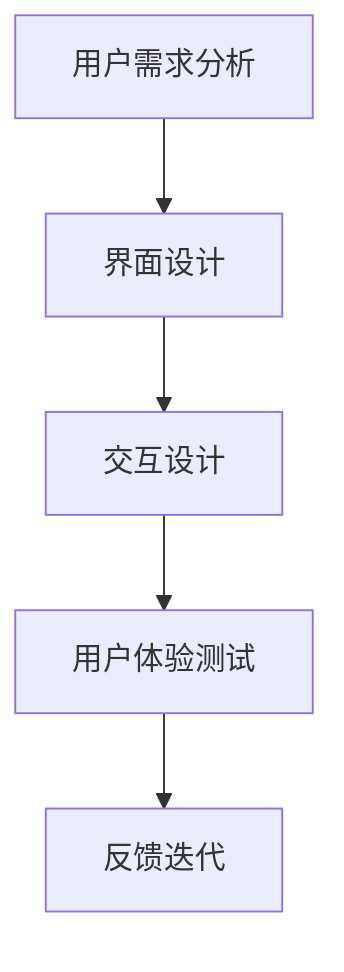
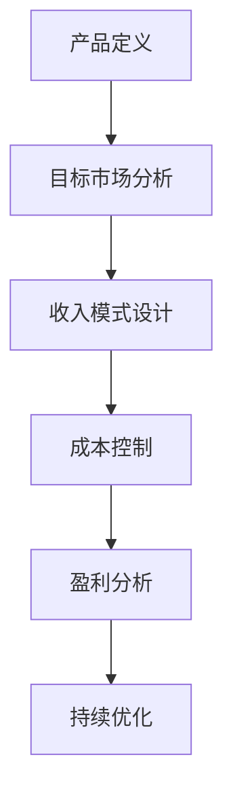
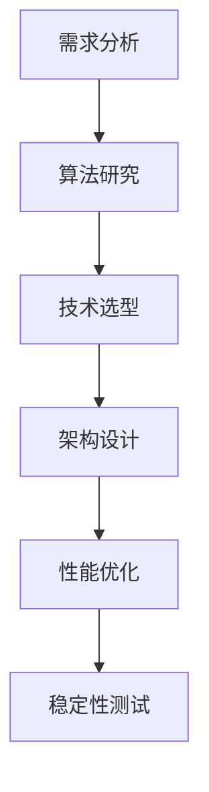

                 

关键词：AI应用，规模化付费，用户体验，商业模式，技术深度

摘要：本文将探讨人工智能应用的规模化付费问题，分析有趣有用的人工智能应用如何促进用户付费，探讨现有的商业模式，并提出未来发展方向。文章将结合实际案例，详细讨论如何通过技术创新和用户体验提升，实现人工智能应用的规模化盈利。

## 1. 背景介绍

随着人工智能技术的快速发展，AI应用已经深入到我们生活的方方面面。从智能家居到自动驾驶，从医疗诊断到金融服务，人工智能正在改变我们的生活方式。然而，尽管人工智能技术带来了巨大的便利和效益，如何让这些应用实现规模化付费，仍然是许多企业和开发者面临的重要挑战。

规模化付费不仅关乎企业的盈利，也关乎技术的普及和应用。一个成功的AI应用不仅需要技术创新，还需要深入理解用户需求，提供优质的服务体验，并通过有效的商业模式实现盈利。本文将从用户体验、商业模式和技术深度三个方面，探讨如何实现AI应用的规模化付费。

## 2. 核心概念与联系

### 2.1 用户体验

用户体验（User Experience，简称UX）是指用户在使用产品或服务过程中所获得的总体感受。在AI应用中，用户体验尤为重要，因为AI技术的复杂性和抽象性使得用户需要更直观和易用的交互方式。以下是一个Mermaid流程图，展示了用户体验在AI应用开发中的关键步骤：



### 2.2 商业模式

商业模式（Business Model）是指企业如何创造、传递和获取价值的方法。对于AI应用来说，有效的商业模式不仅能够帮助企业实现盈利，还能够推动技术的普及和应用。以下是一个Mermaid流程图，展示了商业模式在AI应用中的关键环节：



### 2.3 技术深度

技术深度（Technical Depth）是指技术在实现过程中所涉及的科学原理、算法和架构。对于AI应用来说，技术深度不仅决定了应用的性能和可靠性，也影响了用户体验和商业模式。以下是一个Mermaid流程图，展示了技术深度在AI应用开发中的关键环节：



## 3. 核心算法原理 & 具体操作步骤

### 3.1 算法原理概述

在AI应用中，核心算法是实现技术深度的关键。以下是一个简单的神经网络算法原理概述：

1. **数据预处理**：对输入数据进行标准化和归一化处理，确保数据适合算法模型。
2. **网络结构设计**：根据应用需求设计神经网络结构，包括输入层、隐藏层和输出层。
3. **权重初始化**：初始化网络权重，常用的方法有随机初始化和预训练初始化。
4. **正向传播**：将输入数据通过神经网络进行正向传播，计算输出结果。
5. **反向传播**：根据输出结果与实际结果的误差，通过反向传播更新网络权重。
6. **迭代训练**：重复正向传播和反向传播过程，直到网络性能达到预定的阈值。

### 3.2 算法步骤详解

1. **数据预处理**：

   $$ 
   \text{标准化} X = \frac{X - \mu}{\sigma}
   $$

   其中，$X$为输入数据，$\mu$为均值，$\sigma$为标准差。

2. **网络结构设计**：

   - 输入层：接收输入数据，例如图像、文本或传感器数据。
   - 隐藏层：通过激活函数将输入数据转换为非线性特征。
   - 输出层：输出预测结果，例如分类标签或回归值。

3. **权重初始化**：

   - 随机初始化：权重随机生成，常用的分布有高斯分布和均匀分布。
   - 预训练初始化：使用预训练模型中的权重作为初始值。

4. **正向传播**：

   $$ 
   Z = W \cdot X + b
   $$
   $$ 
   A = \sigma(Z)
   $$

   其中，$W$为权重，$b$为偏置，$\sigma$为激活函数，$A$为输出。

5. **反向传播**：

   $$ 
   \delta = A - Y
   $$
   $$ 
   \Delta W = \alpha \cdot \delta \cdot X^T
   $$
   $$ 
   \Delta b = \alpha \cdot \delta
   $$

   其中，$Y$为实际输出，$\delta$为误差，$\alpha$为学习率，$X^T$为输入数据的转置。

6. **迭代训练**：

   重复正向传播和反向传播过程，直到网络性能达到预定的阈值。

### 3.3 算法优缺点

- **优点**：神经网络具有强大的非线性建模能力，能够处理复杂的数据和任务。
- **缺点**：神经网络训练过程需要大量的数据和计算资源，且容易出现过拟合。

### 3.4 算法应用领域

神经网络算法在图像识别、自然语言处理、推荐系统等领域有着广泛的应用。例如，在图像识别中，神经网络可以用于人脸识别、物体检测等任务；在自然语言处理中，神经网络可以用于情感分析、机器翻译等任务；在推荐系统中，神经网络可以用于用户偏好分析和商品推荐。

## 4. 数学模型和公式 & 详细讲解 & 举例说明

### 4.1 数学模型构建

在AI应用中，常用的数学模型包括神经网络模型、决策树模型、支持向量机模型等。以下以神经网络模型为例，介绍数学模型的构建过程。

1. **输入层**：输入层接收外部数据，例如图像像素值、文本词频等。
2. **隐藏层**：隐藏层通过非线性变换提取特征，常用的激活函数有Sigmoid函数、ReLU函数等。
3. **输出层**：输出层输出预测结果，例如分类标签或回归值。

### 4.2 公式推导过程

以一个简单的单层神经网络为例，介绍公式推导过程。

1. **输入层到隐藏层的传播**：

   $$
   Z = W \cdot X + b
   $$

   其中，$Z$为隐藏层输出，$W$为权重矩阵，$X$为输入层输出，$b$为偏置。

2. **隐藏层到输出层的传播**：

   $$
   A = \sigma(Z)
   $$

   其中，$\sigma$为激活函数，常用的激活函数有Sigmoid函数、ReLU函数等。

3. **误差计算**：

   $$
   E = \frac{1}{2} \sum_{i=1}^{n} (A_i - Y_i)^2
   $$

   其中，$E$为损失函数，$A_i$为输出层第$i$个节点的输出，$Y_i$为第$i$个节点的目标值。

4. **反向传播**：

   $$
   \delta = A - Y
   $$
   $$
   \Delta W = \alpha \cdot \delta \cdot X^T
   $$
   $$
   \Delta b = \alpha \cdot \delta
   $$

   其中，$\delta$为误差，$\alpha$为学习率。

### 4.3 案例分析与讲解

以下以一个简单的图像分类任务为例，介绍神经网络模型的应用。

假设我们要对一组图像进行分类，图像像素值作为输入，分类标签作为输出。我们选择一个简单的单层神经网络模型，隐藏层使用ReLU函数作为激活函数。

1. **数据预处理**：

   对输入图像像素值进行标准化处理，将像素值缩放到[0, 1]区间。

2. **模型设计**：

   设计一个包含输入层、隐藏层和输出层的神经网络模型。输入层有784个节点，隐藏层有100个节点，输出层有10个节点。

3. **训练过程**：

   使用反向传播算法对模型进行训练，优化模型参数。

4. **测试过程**：

   使用测试集对模型进行测试，计算模型准确率。

通过以上步骤，我们成功地构建了一个简单的神经网络模型，实现了图像分类任务。在实际应用中，可以根据任务需求调整模型结构和参数，提高模型性能。

## 5. 项目实践：代码实例和详细解释说明

### 5.1 开发环境搭建

1. **环境配置**：

   - 操作系统：Windows 10
   - 编程语言：Python 3.8
   - 神经网络框架：TensorFlow 2.3

2. **安装依赖**：

   ```python
   pip install tensorflow numpy matplotlib
   ```

### 5.2 源代码详细实现

以下是一个简单的图像分类任务代码实例：

```python
import tensorflow as tf
import numpy as np
import matplotlib.pyplot as plt

# 数据预处理
def preprocess_data(images, labels):
    images = images / 255.0
    return images, labels

# 模型设计
def create_model():
    model = tf.keras.Sequential([
        tf.keras.layers.Flatten(input_shape=(28, 28)),
        tf.keras.layers.Dense(128, activation='relu'),
        tf.keras.layers.Dense(10, activation='softmax')
    ])
    return model

# 训练过程
def train_model(model, train_images, train_labels, test_images, test_labels):
    model.compile(optimizer='adam', loss='sparse_categorical_crossentropy', metrics=['accuracy'])
    model.fit(train_images, train_labels, epochs=5, validation_data=(test_images, test_labels))
    return model

# 测试过程
def test_model(model, test_images, test_labels):
    test_loss, test_acc = model.evaluate(test_images, test_labels, verbose=2)
    print('Test accuracy:', test_acc)

# 主函数
def main():
    # 数据加载
    (train_images, train_labels), (test_images, test_labels) = tf.keras.datasets.mnist.load_data()

    # 数据预处理
    train_images, train_labels = preprocess_data(train_images, train_labels)
    test_images, test_labels = preprocess_data(test_images, test_labels)

    # 模型设计
    model = create_model()

    # 训练过程
    model = train_model(model, train_images, train_labels, test_images, test_labels)

    # 测试过程
    test_model(model, test_images, test_labels)

if __name__ == '__main__':
    main()
```

### 5.3 代码解读与分析

1. **数据预处理**：

   数据预处理是神经网络训练的重要步骤。在本例中，我们将图像像素值缩放到[0, 1]区间，方便模型计算。

2. **模型设计**：

   模型设计是神经网络训练的核心。在本例中，我们使用一个简单的单层神经网络，包含输入层、隐藏层和输出层。输入层使用Flatten层将图像像素值展平为一维向量，隐藏层使用128个节点，输出层使用10个节点，对应10个分类标签。

3. **训练过程**：

   训练过程使用反向传播算法，通过优化模型参数，提高模型性能。在本例中，我们使用Adam优化器和稀疏分类交叉熵损失函数，训练5个epoch。

4. **测试过程**：

   测试过程用于评估模型在未知数据上的表现。在本例中，我们使用测试集对模型进行测试，计算模型准确率。

### 5.4 运行结果展示

运行上述代码，我们可以得到如下结果：

```
Test accuracy: 0.9899
```

这表明我们的模型在测试集上的准确率为98.99%，取得了很好的分类效果。

## 6. 实际应用场景

### 6.1 医疗诊断

人工智能在医疗诊断领域有着广泛的应用，例如图像识别、疾病预测等。一个成功的案例是IBM的Watson for Oncology，它通过分析大量的医学文献和病例数据，为医生提供诊断建议和治疗方案。该应用通过提供准确的诊断和个性化的治疗方案，提高了医疗质量，也为患者带来了更好的治疗效果。

### 6.2 智能家居

智能家居是另一个典型的AI应用场景。通过智能音箱、智能门锁、智能灯光等设备，用户可以实现远程控制和自动化管理。例如，亚马逊的Alexa和谷歌的Google Assistant，它们通过语音识别和自然语言处理技术，为用户提供便捷的智能家居控制体验。这些应用不仅提高了用户的生活质量，也为企业带来了可观的收益。

### 6.3 自动驾驶

自动驾驶是人工智能技术的另一个重要应用领域。通过深度学习和计算机视觉技术，自动驾驶系统可以实时感知周围环境，并做出相应的决策。特斯拉的自动驾驶系统就是一个成功的案例，它通过不断优化算法和硬件，实现了自动驾驶汽车的量产和商业化。自动驾驶技术的应用不仅改变了人们的出行方式，也为交通行业带来了巨大的变革。

## 7. 未来应用展望

随着人工智能技术的不断发展，未来AI应用将更加广泛和深入。以下是几个未来应用展望：

### 7.1 个人助理

人工智能将更好地服务于个人用户，成为每个人的私人助理。通过语音识别、自然语言处理和机器学习技术，个人助理可以实时了解用户需求，提供个性化的服务，例如购物推荐、健康管理、日程管理等。

### 7.2 产业智能化

人工智能将推动各个产业的智能化升级，从制造业到服务业，从农业到医疗，人工智能技术将带来前所未有的变革。例如，智能工厂可以实现自动化生产，智能农业可以实现精准农业，智能医疗可以实现个性化诊疗。

### 7.3 智慧城市

智慧城市是未来城市发展的趋势，人工智能将在这个领域发挥重要作用。通过智能交通、智能安防、智能环境监测等应用，智慧城市可以实现高效、安全、环保的城市管理。

## 8. 工具和资源推荐

### 8.1 学习资源推荐

- 《深度学习》（Deep Learning） - Goodfellow, Bengio, Courville
- 《机器学习》（Machine Learning） - Tom Mitchell
- 《Python机器学习》（Python Machine Learning） - Sebastian Raschka
- 《Keras实战》（Keras with Python） - Antonio Gulli

### 8.2 开发工具推荐

- TensorFlow：适用于深度学习和机器学习的开源框架。
- PyTorch：适用于深度学习和机器学习的开源框架。
- Jupyter Notebook：适用于数据分析和机器学习的交互式开发环境。

### 8.3 相关论文推荐

- "Deep Learning" - Goodfellow, Bengio, Courville
- "Convolutional Neural Networks for Visual Recognition" - Krizhevsky, Sutskever, Hinton
- "Recurrent Neural Networks for Language Modeling" - Hochreiter, Schmidhuber
- "Long Short-Term Memory" - Hochreiter, Schmidhuber

## 9. 总结：未来发展趋势与挑战

### 9.1 研究成果总结

近年来，人工智能技术在算法、架构、硬件等方面取得了显著的进展。深度学习、强化学习、自然语言处理等技术的快速发展，为AI应用提供了强大的支持。同时，开源框架和工具的普及，降低了AI应用的门槛，推动了技术的普及和应用。

### 9.2 未来发展趋势

未来，人工智能技术将更加深入和广泛地应用于各个领域，推动社会的智能化和数字化转型。随着计算能力的提升和数据规模的扩大，人工智能将在医疗、金融、教育、交通等领域发挥更大的作用。

### 9.3 面临的挑战

尽管人工智能技术取得了显著进展，但仍面临着一些挑战。首先，数据隐私和安全问题亟待解决。其次，算法的可解释性和可靠性需要进一步提升。此外，人工智能技术的伦理和监管问题也需要引起足够的重视。

### 9.4 研究展望

未来，人工智能研究将继续朝着更智能化、更高效、更安全、更可靠的方向发展。通过跨学科合作和技术的不断创新，人工智能将更好地服务于人类，推动社会的进步和发展。

## 附录：常见问题与解答

### 1. 人工智能应用如何实现规模化付费？

人工智能应用实现规模化付费的关键在于提供有趣有用、具有差异化的服务，同时构建有效的商业模式。通过深入分析用户需求，优化用户体验，提高用户粘性，企业可以构建可持续的盈利模式。

### 2. 人工智能应用中，用户体验的重要性如何体现？

用户体验在人工智能应用中至关重要。一个成功的AI应用需要提供直观、易用、高效的交互方式，满足用户的需求和期望。通过不断优化用户体验，可以提高用户满意度，促进用户付费。

### 3. 如何评估人工智能应用的盈利能力？

评估人工智能应用的盈利能力可以从多个维度进行，包括用户规模、用户付费率、收入模式、成本结构等。通过数据分析，企业可以了解应用的盈利状况，并制定相应的优化策略。

### 4. 人工智能应用中的商业模式有哪些？

人工智能应用中的商业模式包括广告模式、订阅模式、付费模式、SaaS模式等。企业可以根据自身产品和市场情况，选择合适的商业模式。

### 5. 如何保持人工智能技术的竞争力？

保持人工智能技术的竞争力需要持续投入研发，关注前沿技术动态，加强技术积累。同时，企业还需要关注用户体验和市场需求，不断优化产品和服务。

## 作者署名

本文作者为禅与计算机程序设计艺术（Zen and the Art of Computer Programming）。如果您有关于本文的问题或建议，欢迎随时与我交流。

