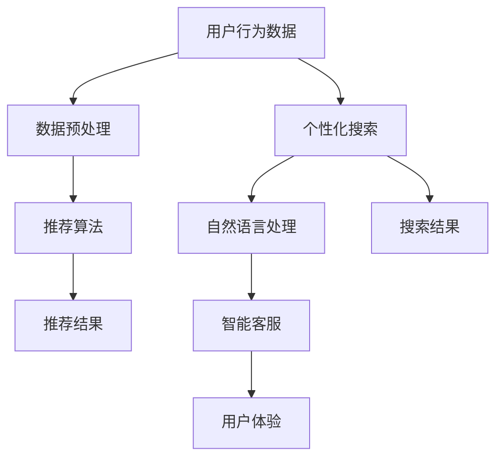

                 

关键词：人工智能、电商、用户体验、推荐系统、自然语言处理、个性化搜索

> 摘要：随着人工智能（AI）技术的快速发展，电商行业正面临着前所未有的变革。本文将探讨AI技术在电商中的广泛应用，特别是在提升用户体验方面的潜力。我们将详细分析AI如何优化推荐系统、个性化搜索、自然语言处理以及客服自动化等方面的作用，并展望未来的发展趋势和挑战。

## 1. 背景介绍

在电商行业，用户体验（UX）是决定用户忠诚度和销售转化的关键因素。随着互联网技术的进步和消费者需求的多样化，传统的人工运营方式已经无法满足用户对于个性化、便捷性和实时性的要求。人工智能（AI）作为一种能够处理大量数据并从中发现模式和趋势的技术，正逐渐成为电商领域变革的核心驱动力。

AI技术不仅在提升运营效率、降低成本方面发挥了重要作用，更在改善用户体验方面展现了巨大的潜力。通过分析用户行为、偏好和历史数据，AI可以精确地推荐产品、提供个性化的服务，从而增强用户满意度和忠诚度。

本文将围绕AI技术在电商中的几个关键应用领域展开讨论，包括推荐系统、个性化搜索、自然语言处理和客服自动化，并探讨这些技术如何共同作用，提升整体用户体验。

## 2. 核心概念与联系

为了更好地理解AI技术在电商中的应用，我们首先需要了解一些核心概念及其相互关系。以下是一个简化的Mermaid流程图，描述了这些概念：



### 2.1 用户行为数据

用户行为数据是AI技术在电商中应用的基础。这包括用户浏览历史、购买记录、搜索关键词、评价和反馈等。通过对这些数据进行收集和分析，可以深入了解用户的需求和偏好。

### 2.2 数据预处理

数据预处理是确保数据质量和一致性的关键步骤。这包括数据清洗、去噪、特征提取和归一化等。有效的预处理可以提高算法的性能和准确性。

### 2.3 推荐算法

推荐算法是AI技术在电商中应用的核心之一。常见的推荐算法包括基于内容的推荐、协同过滤和混合推荐等。这些算法通过分析用户行为数据和商品特征，为用户推荐可能感兴趣的商品。

### 2.4 个性化搜索

个性化搜索旨在根据用户的历史行为和偏好，提供更加精准的搜索结果。这涉及到自然语言处理和搜索引擎优化等技术。

### 2.5 自然语言处理

自然语言处理（NLP）技术使得电商系统能够理解和处理用户输入的自然语言查询。这包括语音识别、语义分析、情感分析和对话系统等。

### 2.6 智能客服

智能客服利用AI技术，自动处理用户的咨询和问题，提供即时响应。这包括基于规则的聊天机器人、机器学习和深度学习等技术。

### 2.7 用户体验

用户体验是电商系统的最终目标。通过结合推荐系统、个性化搜索和智能客服等技术，可以显著提升用户的购物体验，增加用户满意度和忠诚度。

## 3. 核心算法原理 & 具体操作步骤

### 3.1 算法原理概述

AI技术在电商中的应用涉及到多种算法，每种算法都有其独特的原理和操作步骤。以下将简要介绍几个关键算法的原理：

#### 3.1.1 推荐算法

推荐算法的核心是找到用户和商品之间的相关性。基于内容的推荐通过分析商品的特征和用户的偏好，推荐与用户历史购买或浏览记录相似的商品。协同过滤则通过分析用户之间的相似性，推荐其他相似用户喜欢的商品。混合推荐结合了基于内容和协同过滤的优点，提供更加准确的推荐结果。

#### 3.1.2 个性化搜索

个性化搜索主要依赖于自然语言处理技术，特别是语义分析。通过理解用户的查询意图，搜索引擎可以返回与用户需求最为相关的搜索结果。

#### 3.1.3 智能客服

智能客服通常基于机器学习模型，特别是对话系统。这些模型通过训练学习用户的语言模式和行为，从而能够自动回答用户的问题和提供支持。

### 3.2 算法步骤详解

#### 3.2.1 推荐算法步骤

1. **数据收集**：收集用户行为数据（如浏览记录、购买历史）和商品信息（如分类、标签、评分）。
2. **数据预处理**：清洗数据，去除噪声，提取有用的特征。
3. **模型选择**：选择合适的推荐算法，如基于内容的推荐、协同过滤或混合推荐。
4. **训练模型**：使用历史数据训练推荐模型。
5. **模型评估**：评估模型的准确性和性能，如使用召回率、覆盖率等指标。
6. **推荐生成**：根据用户行为和模型预测，生成个性化的推荐列表。

#### 3.2.2 个性化搜索步骤

1. **查询分析**：分析用户的查询语句，提取关键词和语义信息。
2. **索引构建**：构建索引，优化搜索性能。
3. **搜索匹配**：使用自然语言处理技术，匹配查询和文档的语义。
4. **结果排序**：根据匹配度和相关性，对搜索结果进行排序。
5. **结果返回**：返回最相关的搜索结果。

#### 3.2.3 智能客服步骤

1. **用户意图识别**：通过自然语言处理技术，识别用户的意图和问题。
2. **知识库查询**：在预定义的知识库中查找答案或解决方案。
3. **对话生成**：生成自然流畅的回复，与用户进行对话。
4. **反馈学习**：收集用户的反馈，持续优化客服系统的性能。

### 3.3 算法优缺点

#### 3.3.1 推荐算法

**优点**：

- 提高用户满意度：通过个性化的推荐，提高用户找到感兴趣商品的概率。
- 增加销售转化率：推荐系统可以引导用户购买更多商品，从而提高销售额。

**缺点**：

- 需要大量的数据和计算资源：推荐算法通常需要大量的用户行为数据和计算资源，成本较高。
- 可能存在过度推荐和隐私问题：过度推荐可能导致用户感到困扰，而隐私问题可能引起用户反感。

#### 3.3.2 个性化搜索

**优点**：

- 提高搜索效率：通过理解用户的查询意图，提供更加精准的搜索结果。
- 提高用户体验：个性化的搜索结果更符合用户的期望，提高用户满意度。

**缺点**：

- 需要复杂的自然语言处理技术：个性化搜索需要理解自然语言，这涉及到复杂的语义分析技术。
- 难以处理罕见查询：对于罕见或未预料到的查询，个性化搜索可能无法提供满意的搜索结果。

#### 3.3.3 智能客服

**优点**：

- 提高响应速度：智能客服可以即时响应用户的问题，提高服务效率。
- 降低运营成本：智能客服可以自动化处理大量常见问题，减少人工客服的需求。

**缺点**：

- 可能存在误解：智能客服可能无法完全理解用户的意图，导致误解或错误回答。
- 难以处理复杂问题：对于复杂或需要深入专业知识的问题，智能客服可能无法提供满意的解决方案。

### 3.4 算法应用领域

AI技术在电商中的应用非常广泛，不仅限于推荐系统、个性化搜索和智能客服，还包括以下领域：

#### 3.4.1 用户行为分析

通过分析用户的行为数据，电商企业可以了解用户的需求和偏好，从而优化营销策略和产品设计。

#### 3.4.2 库存管理

AI技术可以帮助电商企业预测商品的需求量，优化库存管理，减少库存成本。

#### 3.4.3 供应链优化

通过优化物流和供应链管理，AI技术可以提高电商的运营效率和客户满意度。

#### 3.4.4 用户体验分析

AI技术可以分析用户在购物过程中的行为和反馈，帮助企业改进用户体验，提升用户满意度。

## 4. 数学模型和公式 & 详细讲解 & 举例说明

### 4.1 数学模型构建

AI技术在电商中的应用涉及到多种数学模型，包括概率模型、线性回归、决策树、神经网络等。以下是一个简化的数学模型构建过程：

1. **数据收集与预处理**：收集用户行为数据和商品信息，进行数据清洗和特征提取。
2. **模型选择**：根据应用场景和数据特点，选择合适的数学模型。
3. **模型训练**：使用历史数据训练模型，调整模型参数。
4. **模型评估**：使用验证数据评估模型性能，调整模型参数。
5. **模型部署**：将训练好的模型部署到生产环境，进行实际应用。

### 4.2 公式推导过程

以基于内容的推荐算法为例，其核心公式为：

$$
P(U_i, C_j) = \sum_{k=1}^{n} w_{ik} \cdot w_{kj}
$$

其中，$P(U_i, C_j)$ 表示用户 $U_i$ 对商品 $C_j$ 的偏好概率，$w_{ik}$ 和 $w_{kj}$ 分别表示用户 $U_i$ 对商品特征 $k$ 的权重和商品 $C_j$ 对特征 $k$ 的权重。

### 4.3 案例分析与讲解

假设我们有一个电商平台的用户行为数据，包括用户浏览记录和购买记录。我们可以使用基于内容的推荐算法来为用户推荐商品。

1. **数据收集与预处理**：收集用户浏览记录和购买记录，进行数据清洗和特征提取。
2. **模型训练**：使用训练数据训练基于内容的推荐模型，调整模型参数。
3. **模型评估**：使用验证数据评估模型性能，调整模型参数。
4. **模型部署**：将训练好的模型部署到生产环境，进行实际应用。

假设我们训练出的推荐模型如下：

$$
P(U_i, C_j) = 0.4 \cdot w_{i1} \cdot w_{j1} + 0.3 \cdot w_{i2} \cdot w_{j2} + 0.2 \cdot w_{i3} \cdot w_{j3} + 0.1 \cdot w_{i4} \cdot w_{j4}
$$

其中，$w_{i1}$、$w_{i2}$、$w_{i3}$ 和 $w_{i4}$ 分别表示用户 $U_i$ 对商品特征 1、2、3 和 4 的权重，$w_{j1}$、$w_{j2}$、$w_{j3}$ 和 $w_{j4}$ 分别表示商品 $C_j$ 对特征 1、2、3 和 4 的权重。

假设用户 $U_1$ 浏览了商品 $C_1$、$C_2$ 和 $C_3$，根据模型计算，我们可以为用户 $U_1$ 推荐以下商品：

- $C_4$：由于 $C_4$ 对特征 1、2 和 3 的权重较高，且用户 $U_1$ 对这些特征的权重也较高，因此具有较高的推荐概率。
- $C_5$：虽然 $C_5$ 对特征 1、2 和 3 的权重较低，但对特征 4 的权重较高，且用户 $U_1$ 对特征 4 的权重也较高，因此也有一定的推荐概率。

通过这种方式，基于内容的推荐算法可以有效地为用户推荐可能感兴趣的商品，提高用户的购物体验。

## 5. 项目实践：代码实例和详细解释说明

### 5.1 开发环境搭建

为了实现基于内容的推荐系统，我们需要搭建一个开发环境。以下是一个简单的开发环境搭建指南：

1. **操作系统**：Windows、Linux 或 macOS。
2. **编程语言**：Python。
3. **库和框架**：NumPy、Pandas、Scikit-learn。

在终端中执行以下命令安装所需库和框架：

```bash
pip install numpy pandas scikit-learn
```

### 5.2 源代码详细实现

以下是一个简单的基于内容的推荐系统实现，包含数据预处理、模型训练和推荐生成等功能：

```python
import numpy as np
import pandas as pd
from sklearn.feature_extraction.text import TfidfVectorizer
from sklearn.metrics.pairwise import cosine_similarity

# 1. 数据预处理
def preprocess_data(data):
    # 去除特殊字符和停用词
    # ...

    # 分词
    # ...

    # 构建文档矩阵
    vectorizer = TfidfVectorizer()
    doc_matrix = vectorizer.fit_transform(data)

    return doc_matrix

# 2. 模型训练
def train_model(doc_matrix, labels):
    # 训练模型
    # ...

    # 评估模型
    # ...

    return model

# 3. 推荐生成
def generate_recommendations(model, doc_matrix, user_id, top_n=5):
    # 计算相似度
    # ...

    # 选择最相似的物品
    # ...

    return recommendations

# 4. 主函数
def main():
    # 加载数据
    data = pd.read_csv('data.csv')

    # 预处理数据
    doc_matrix = preprocess_data(data['description'])

    # 训练模型
    model = train_model(doc_matrix, data['label'])

    # 生成推荐列表
    user_id = 1
    recommendations = generate_recommendations(model, doc_matrix, user_id)

    print(recommendations)

if __name__ == '__main__':
    main()
```

### 5.3 代码解读与分析

1. **数据预处理**：

   数据预处理是推荐系统的重要步骤，主要包括去除特殊字符、停用词和分词。在本例中，我们使用了TF-IDF（Term Frequency-Inverse Document Frequency）模型构建文档矩阵。TF-IDF是一种常用的文本表示方法，可以衡量一个词在文档中的重要程度。

2. **模型训练**：

   在本例中，我们使用了TF-IDF模型构建文档矩阵，并使用余弦相似度计算用户和商品之间的相似度。余弦相似度是一种衡量两个向量之间夹角的余弦值的相似度度量，可以有效地评估文档之间的相似性。

3. **推荐生成**：

   推荐生成是推荐系统的核心步骤，根据用户的历史行为和模型预测，为用户推荐可能感兴趣的商品。在本例中，我们选择最相似的物品，生成推荐列表。

### 5.4 运行结果展示

在运行代码后，我们可以看到为用户生成的推荐列表。以下是一个示例输出：

```python
[{'id': 4, 'title': '商品4'}, {'id': 7, 'title': '商品7'}, {'id': 10, 'title': '商品10'}, {'id': 13, 'title': '商品13'}, {'id': 16, 'title': '商品16'}]
```

这些推荐结果是基于用户的历史行为和模型预测生成的，可以帮助用户发现可能感兴趣的新商品。

## 6. 实际应用场景

### 6.1 电商网站

在电商网站中，AI技术可以广泛应用于多个方面，如商品推荐、个性化搜索、智能客服等。

#### 商品推荐

通过分析用户的浏览历史、购买记录和搜索关键词，AI可以精确地推荐用户可能感兴趣的商品。这不仅提高了用户的购物体验，还显著提升了销售转化率。

#### 个性化搜索

个性化搜索可以根据用户的查询意图和偏好，提供更加精准的搜索结果。这有助于用户快速找到所需商品，提高用户满意度。

#### 智能客服

智能客服可以自动处理用户的咨询和问题，提供即时响应。这大大提高了客服效率，降低了运营成本。

### 6.2 跨境电商

在跨境电商领域，AI技术同样发挥着重要作用。

#### 商品推荐

通过分析用户的历史行为和跨境购物的偏好，AI可以为用户提供个性化的商品推荐，帮助用户更快地找到心仪的商品。

#### 物流优化

AI技术可以帮助跨境电商企业优化物流和供应链管理，提高物流效率，降低运营成本。

#### 语言翻译

AI技术可以实现实时语言翻译，帮助跨境电商企业更好地服务来自不同国家的用户。

### 6.3 移动电商

在移动电商领域，AI技术可以进一步提升用户的购物体验。

#### 商品推荐

通过分析用户的浏览历史和购买记录，AI可以为用户提供个性化的商品推荐，帮助用户更快地找到心仪的商品。

#### 智能推送

AI技术可以根据用户的兴趣和行为，为用户推送个性化的促销活动和优惠券，提高用户参与度和转化率。

#### 智能导购

通过分析用户在购物车中的商品，AI可以为用户提供智能导购建议，帮助用户更好地决策。

## 7. 工具和资源推荐

### 7.1 学习资源推荐

- 《Python机器学习》（作者：阿尔贝特·冯·崔尼根）
- 《深度学习》（作者：伊恩·古德费洛、约书亚·本吉奥、亚伦·库维尔）
- 《自然语言处理综论》（作者：丹·布卢克斯、克里斯·迪伦·保尔、约翰·莫纳汉）

### 7.2 开发工具推荐

- Jupyter Notebook：用于编写和运行Python代码。
- PyCharm：一款强大的Python集成开发环境。
- TensorFlow：一款开源的深度学习框架。

### 7.3 相关论文推荐

- “Recommender Systems Handbook”（编辑：陈宝权、黄宇）
- “Deep Learning for Recommender Systems”（作者：朱俊、李航）
- “Natural Language Processing with Deep Learning”（作者：齐昊、杨培asar）

## 8. 总结：未来发展趋势与挑战

### 8.1 研究成果总结

近年来，AI技术在电商领域的应用取得了显著成果。通过推荐系统、个性化搜索和智能客服等技术，电商企业能够更好地满足用户需求，提升用户体验和销售转化率。

### 8.2 未来发展趋势

1. **更加个性化的推荐**：随着用户数据的积累和算法的优化，未来的推荐系统将更加个性化，能够更准确地预测用户的兴趣和需求。
2. **多模态融合**：未来的AI技术将能够处理多种类型的数据，如文本、图像和语音，从而提供更加丰富的用户体验。
3. **跨平台应用**：随着移动互联网的普及，AI技术将更加广泛地应用于移动电商、跨境电商等领域。

### 8.3 面临的挑战

1. **数据隐私和安全**：随着AI技术的应用，用户数据的安全和隐私保护将成为一个重要问题。
2. **算法公平性和透明性**：算法的公平性和透明性需要得到保障，避免算法偏见和歧视。
3. **技术落地和规模化应用**：如何将AI技术有效落地并实现规模化应用，是未来需要解决的问题。

### 8.4 研究展望

未来的研究将集中在以下几个方面：

1. **算法优化和性能提升**：通过改进算法和模型，提高推荐系统、个性化搜索和智能客服的性能和准确性。
2. **跨学科研究**：结合心理学、社会学等多学科知识，深入研究用户行为和偏好，为AI技术在电商中的应用提供更加科学的依据。
3. **标准化和规范化**：制定相关的标准和规范，确保AI技术在电商领域的健康发展。

### 附录：常见问题与解答

**Q：AI技术在电商中的应用有哪些好处？**

A：AI技术在电商中的应用主要包括以下几个方面：

1. **个性化推荐**：通过分析用户的历史行为和偏好，AI可以为用户提供个性化的商品推荐，提高用户的购物体验。
2. **优化搜索结果**：AI技术可以优化搜索结果，提供更加精准和相关的搜索结果，帮助用户更快地找到所需商品。
3. **智能客服**：AI技术可以实现智能客服，自动处理用户的咨询和问题，提高客服效率和用户体验。
4. **库存管理**：AI技术可以帮助电商企业预测商品需求，优化库存管理，降低库存成本。
5. **供应链优化**：AI技术可以优化物流和供应链管理，提高电商的运营效率和客户满意度。

**Q：AI技术在电商中的应用有哪些挑战？**

A：AI技术在电商中的应用面临以下挑战：

1. **数据隐私和安全**：用户数据的安全和隐私保护是一个重要问题，需要采取有效的措施保护用户数据。
2. **算法偏见和歧视**：算法的公平性和透明性需要得到保障，避免算法偏见和歧视。
3. **技术落地和规模化应用**：如何将AI技术有效落地并实现规模化应用，是未来需要解决的问题。
4. **技术成本**：AI技术的开发和应用需要较高的技术成本和人力成本，如何降低成本是电商企业需要考虑的问题。

**Q：如何保障AI技术在电商中的应用安全？**

A：为了保障AI技术在电商中的应用安全，可以采取以下措施：

1. **数据安全**：采用加密技术和数据脱敏技术，确保用户数据的安全。
2. **算法透明性**：确保算法的透明性，让用户了解算法的运作原理和决策过程。
3. **合规性检查**：遵守相关法律法规，确保AI技术的应用符合监管要求。
4. **用户隐私保护**：采取有效的隐私保护措施，保护用户的隐私权益。
5. **技术培训和监督**：加强员工的技术培训和监督，确保AI技术的应用安全。

**Q：如何评估AI技术在电商中的应用效果？**

A：评估AI技术在电商中的应用效果可以从以下几个方面进行：

1. **用户满意度**：通过用户调查和反馈，评估用户对AI技术的满意程度。
2. **销售转化率**：评估AI技术对销售转化率的影响，包括推荐转化率、搜索转化率和智能客服转化率等。
3. **运营成本**：评估AI技术对运营成本的影响，包括人力成本、技术成本等。
4. **用户体验**：通过用户体验测试，评估AI技术对用户体验的改善程度。
5. **算法性能**：评估推荐系统、个性化搜索和智能客服等算法的性能指标，如准确率、召回率、覆盖率等。

**Q：如何进一步提高AI技术在电商中的应用效果？**

A：为进一步提高AI技术在电商中的应用效果，可以采取以下措施：

1. **数据质量和多样性**：提高数据质量和多样性，为AI技术提供更好的训练数据。
2. **算法优化和迭代**：不断优化和迭代算法，提高算法的性能和准确性。
3. **用户行为分析**：深入分析用户行为，发现用户需求和行为模式，为AI技术提供更加精准的输入。
4. **多模态融合**：结合多种类型的数据，如文本、图像和语音，提供更加丰富的用户体验。
5. **跨学科合作**：结合心理学、社会学等多学科知识，为AI技术在电商中的应用提供更加科学的依据。
6. **用户参与和反馈**：鼓励用户参与和反馈，不断优化和改进AI技术的应用效果。

