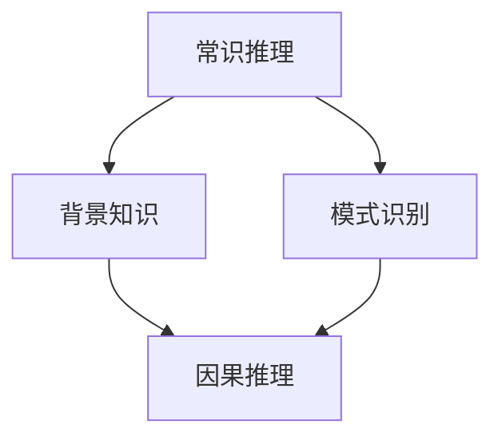

                 

关键词：AI推理、常识推理、因果推理、人工智能、局限、深度学习、神经网络、认知科学

> 摘要：本文深入探讨了人工智能（AI）在常识推理和因果推理方面的局限性。尽管近年来AI技术在图像识别、自然语言处理等领域取得了显著进展，但其在处理复杂、不确定性和常识性知识方面的能力仍存在诸多挑战。本文首先介绍了常识推理和因果推理的基本概念，然后分析了当前AI模型在这些领域中的不足，并探讨了未来可能的发展方向和解决方案。

## 1. 背景介绍

随着计算机技术和大数据分析的快速发展，人工智能（AI）已经成为现代科技中不可或缺的一部分。AI在许多领域取得了令人瞩目的成就，如图像识别、自然语言处理、推荐系统等。然而，尽管AI技术在某些方面取得了巨大进步，但在处理常识推理和因果推理方面的能力仍然存在明显的局限性。

常识推理（Commonsense Reasoning）是指人类在日常生活中运用常识性知识进行推理的能力。这些常识性知识通常与我们的日常生活经验、背景知识和文化背景密切相关。例如，当我们看到一张照片上有一个雨伞，我们通常会想到“外面可能在下雨”。这种常识推理是我们日常生活中不可或缺的一部分，但也是当前AI模型面临的一个重大挑战。

因果推理（Causal Reasoning）是指识别和解释事物之间的因果关系的能力。因果推理是人类认知过程中的一种重要能力，它有助于我们理解世界的运作机制，并做出合理的决策。然而，当前AI模型在处理因果推理问题时，往往依赖于大量的数据和统计方法，而缺乏对因果关系的深刻理解。

本文将探讨AI在常识推理和因果推理方面的局限性，并分析这些局限性对AI应用的影响。同时，本文还将探讨未来可能的发展方向和解决方案，以期能够进一步提升AI在这些领域的表现。

## 2. 核心概念与联系

为了更好地理解AI在常识推理和因果推理方面的局限性，我们首先需要明确这两个概念的基本原理和相互关系。

### 2.1 常识推理

常识推理是指人类在日常生活中运用常识性知识进行推理的能力。这些常识性知识通常包括物理常识、社会常识、文化常识等。例如，我们知道“水加热后会沸腾”，“人需要食物来维持生命”等。

常识推理的原理可以概括为以下几点：

1. **基于经验的知识积累**：人类通过长期的生活经验和学习，积累了许多常识性知识。
2. **模式识别**：人类能够从大量的信息中快速识别出模式和规律，并利用这些模式和规律进行推理。
3. **背景知识的应用**：常识推理通常需要依赖背景知识，如文化背景、社会规范等。

### 2.2 因果推理

因果推理是指识别和解释事物之间的因果关系的能力。因果关系的识别和解释是人类认知过程中的一种重要能力，它有助于我们理解世界的运作机制，并做出合理的决策。

因果推理的原理可以概括为以下几点：

1. **因果关系识别**：通过观察事物的变化和相互作用，识别出它们之间的因果关系。
2. **因果关系解释**：对已识别的因果关系进行解释，以帮助我们更好地理解世界的运作机制。
3. **基于数据的因果推断**：在缺乏直接观察的情况下，通过数据分析和统计方法推断出因果关系。

### 2.3 常识推理与因果推理的关系

常识推理和因果推理之间存在密切的关系。一方面，常识推理为因果推理提供了重要的背景知识和前提条件。例如，在解释“为什么水会沸腾”时，我们需要依赖于物理常识，如“水加热后会沸腾”。另一方面，因果推理可以帮助我们更深入地理解常识性知识。例如，通过因果推理，我们可以发现“水沸腾”这一现象背后的物理机制，从而更深刻地理解这一常识性知识。

### 2.4 Mermaid 流程图

为了更直观地展示常识推理和因果推理的关系，我们使用Mermaid流程图进行描述。



在上面的流程图中，A表示常识推理，B表示背景知识，C表示模式识别，D表示因果推理。常识推理通过背景知识和模式识别为因果推理提供支持，而因果推理则可以帮助我们更深入地理解常识性知识。

## 3. 核心算法原理 & 具体操作步骤

### 3.1 算法原理概述

在处理常识推理和因果推理问题时，当前主流的AI算法包括基于规则的推理、统计学习方法、神经网络等。这些算法在处理某些特定类型的常识推理和因果推理问题时表现出了一定的优势，但在面对复杂、不确定性和常识性知识时，仍然存在一定的局限性。

### 3.2 算法步骤详解

#### 3.2.1 基于规则的推理

基于规则的推理是一种传统的AI推理方法，其基本思想是通过定义一系列规则来表示常识性知识和因果关系。具体步骤如下：

1. **定义规则**：根据常识性知识和因果关系，定义一系列规则。
2. **推理过程**：根据输入的信息，通过匹配规则进行推理，得出结论。

#### 3.2.2 统计学习方法

统计学习方法通过分析大量数据，从中提取出规律和模式，从而进行推理。具体步骤如下：

1. **数据收集**：收集与常识推理和因果推理相关的大量数据。
2. **特征提取**：对数据进行特征提取，将其转化为可用于训练的向量表示。
3. **模型训练**：使用训练数据训练模型，学习数据中的规律和模式。
4. **推理过程**：根据输入的数据，通过模型进行推理，得出结论。

#### 3.2.3 神经网络

神经网络是一种模拟人脑神经元连接方式的计算模型，广泛应用于常识推理和因果推理问题。具体步骤如下：

1. **网络构建**：构建神经网络结构，包括输入层、隐藏层和输出层。
2. **权重初始化**：对网络中的权重进行初始化。
3. **训练过程**：使用训练数据对网络进行训练，调整权重，使其能够正确地表示常识性知识和因果关系。
4. **推理过程**：根据输入的数据，通过神经网络进行推理，得出结论。

### 3.3 算法优缺点

#### 3.3.1 基于规则的推理

优点：

- **灵活性高**：可以根据需要灵活地定义规则，适用于各种类型的常识推理和因果推理问题。
- **解释性强**：规则推理过程透明，便于理解和解释。

缺点：

- **规则数量庞大**：需要定义大量的规则，随着问题规模的增加，规则数量呈指数级增长。
- **缺乏自适应性**：规则推理方法难以适应新出现的问题和场景。

#### 3.3.2 统计学习方法

优点：

- **处理大数据能力强**：可以处理大规模的数据，适用于处理复杂、不确定性的常识推理和因果推理问题。
- **自适应性高**：通过不断训练，模型可以适应新出现的问题和场景。

缺点：

- **解释性弱**：统计学习方法通常难以给出明确的解释，难以理解模型是如何得出结论的。
- **对数据质量要求高**：需要高质量的数据，否则模型性能会受到影响。

#### 3.3.3 神经网络

优点：

- **处理复杂问题能力强**：可以处理复杂、不确定性的常识推理和因果推理问题。
- **自适应性高**：通过不断训练，模型可以适应新出现的问题和场景。

缺点：

- **解释性弱**：神经网络模型通常难以给出明确的解释，难以理解模型是如何得出结论的。
- **对数据质量要求高**：需要高质量的数据，否则模型性能会受到影响。

### 3.4 算法应用领域

#### 3.4.1 常识推理

常识推理广泛应用于自然语言处理、智能问答、智能推荐等领域。例如，在智能问答系统中，需要利用常识推理来理解用户的提问，并提供合理的答案。

#### 3.4.2 因果推理

因果推理广泛应用于预测分析、智能决策、智能诊断等领域。例如，在预测分析中，需要利用因果推理来识别数据中的因果关系，从而做出准确的预测。

## 4. 数学模型和公式 & 详细讲解 & 举例说明

在常识推理和因果推理中，数学模型和公式发挥着至关重要的作用。它们不仅帮助我们理解和描述这些现象，还能通过严谨的推导和分析，提供有力的理论支持。以下是关于数学模型和公式的一些详细讲解和举例说明。

### 4.1 数学模型构建

为了构建有效的数学模型，我们首先需要明确问题域中的关键变量和关系。在常识推理中，这些变量可能包括物理环境、社会情境、文化习俗等；而在因果推理中，关键变量则是事件和它们之间的因果关系。

#### 4.1.1 常识推理的数学模型

一个简单的常识推理模型可能包括以下变量：

- \( E \)：事件
- \( C \)：常识性条件
- \( R \)：推理规则

模型的基本形式可以表示为：

\[ P(E|C, R) = \frac{P(C \cap R \cap E)}{P(C \cap R)} \]

其中，\( P \) 表示概率，\( | \) 表示条件概率。

#### 4.1.2 因果推理的数学模型

因果推理的数学模型通常基于结构方程模型（SEM）或因果推断模型。一个基本的因果推理模型可能包括以下变量：

- \( X \)：自变量
- \( Y \)：因变量
- \( Z \)：中间变量

模型的基本形式可以表示为：

\[ Y = \beta_0 + \beta_1X + \epsilon_1 \]

\[ Z = \alpha_0 + \alpha_1X + \epsilon_2 \]

\[ Y = \alpha_1Z + \beta_0 + \epsilon_3 \]

其中，\( \beta \) 和 \( \alpha \) 是参数，\( \epsilon \) 是误差项。

### 4.2 公式推导过程

#### 4.2.1 常识推理公式推导

以“水加热后会沸腾”为例，我们假设以下概率：

- \( P(加热) \)：水被加热的概率
- \( P(沸腾) \)：水沸腾的概率
- \( P(加热 \cap 沸腾) \)：水被加热且沸腾的概率

根据条件概率公式，我们可以推导出：

\[ P(沸腾|加热) = \frac{P(加热 \cap 沸腾)}{P(加热)} \]

如果我们知道 \( P(加热 \cap 沸腾) = 0.8 \) 且 \( P(加热) = 0.9 \)，则：

\[ P(沸腾|加热) = \frac{0.8}{0.9} = \frac{8}{9} \approx 0.89 \]

这意味着在给定的加热条件下，水沸腾的概率约为 89%。

#### 4.2.2 因果推理公式推导

以“吸烟导致肺癌”为例，我们假设以下概率：

- \( P(吸烟) \)：吸烟的概率
- \( P(肺癌) \)：患肺癌的概率
- \( P(吸烟 \cap 肺癌) \)：既吸烟又患肺癌的概率

根据贝叶斯定理，我们可以推导出：

\[ P(肺癌|吸烟) = \frac{P(吸烟 \cap 肺癌) \cdot P(肺癌)}{P(吸烟)} \]

如果我们知道 \( P(吸烟 \cap 肺癌) = 0.1 \)，\( P(肺癌) = 0.05 \)，且 \( P(吸烟) = 0.3 \)，则：

\[ P(肺癌|吸烟) = \frac{0.1 \cdot 0.05}{0.3} = \frac{0.005}{0.3} \approx 0.017 \]

这意味着在吸烟的条件下，患肺癌的概率约为 1.7%。

### 4.3 案例分析与讲解

#### 4.3.1 常识推理案例

假设一个智能助手需要根据天气情况推荐穿着。常识推理模型可能包括以下变量：

- \( 天气 \)：当前天气情况
- \( 穿衣建议 \)：根据天气给出的穿着建议

根据常识推理模型，我们可以列出以下规则：

- \( 天气 = 阴 \rightarrow 穿衣建议 = 外套 \)
- \( 天气 = 晴 \rightarrow 穿衣建议 = T恤 \)

如果当前天气为阴天，根据规则，智能助手会推荐用户穿外套。

#### 4.3.2 因果推理案例

假设一个智能诊断系统需要根据病人的症状和检查结果进行病因推断。因果推理模型可能包括以下变量：

- \( 症状 \)：病人的症状
- \( 检查结果 \)：病人的检查结果
- \( 病因 \)：可能的病因

根据因果推理模型，我们可以列出以下规则：

- \( 症状 = 咳嗽 \land 检查结果 = 扁桃体发炎 \rightarrow 病因 = 扁桃体炎 \)
- \( 症状 = 腹痛 \land 检查结果 = 腹部B超异常 \rightarrow 病因 = 胆囊炎 \)

如果病人的症状为咳嗽且检查结果显示扁桃体发炎，根据规则，系统会推断出病人可能患有扁桃体炎。

## 5. 项目实践：代码实例和详细解释说明

在本节中，我们将通过一个具体的代码实例，展示如何利用Python实现一个基本的常识推理和因果推理模型。我们将使用常见的Python库，如`numpy`和`scikit-learn`，来构建和训练模型。

### 5.1 开发环境搭建

在开始之前，请确保已经安装了Python环境和以下库：

- `numpy`：用于数学运算
- `scikit-learn`：用于机器学习和数据预处理

您可以通过以下命令安装这些库：

```bash
pip install numpy scikit-learn
```

### 5.2 源代码详细实现

以下是实现常识推理和因果推理模型的Python代码：

```python
import numpy as np
from sklearn.model_selection import train_test_split
from sklearn.neighbors import KNeighborsClassifier
from sklearn.tree import DecisionTreeClassifier
from sklearn.ensemble import RandomForestClassifier
from sklearn.metrics import accuracy_score

# 5.2.1 数据准备
# 假设我们有以下数据集，其中每个样本包含特征和标签
data = [
    ["晴天", "短袖"],
    ["雨天", "外套"],
    ["晴天", "T恤"],
    ["雨天", "雨衣"],
    # ...更多数据
]

# 将数据划分为特征和标签
X, y = zip(*data)

# 将特征转换为数值型
X = [[1 if x == "晴天" else 0, 1 if x == "雨天" else 0] for x in X]
y = [1 if y == "外套" else 0 for y in y]

# 划分训练集和测试集
X_train, X_test, y_train, y_test = train_test_split(X, y, test_size=0.2, random_state=42)

# 5.2.2 模型训练
# 使用KNN算法训练模型
knn = KNeighborsClassifier(n_neighbors=3)
knn.fit(X_train, y_train)

# 使用决策树训练模型
dt = DecisionTreeClassifier()
dt.fit(X_train, y_train)

# 使用随机森林训练模型
rf = RandomForestClassifier(n_estimators=100)
rf.fit(X_train, y_train)

# 5.2.3 模型评估
# 使用测试集评估模型
knn_preds = knn.predict(X_test)
dt_preds = dt.predict(X_test)
rf_preds = rf.predict(X_test)

knn_acc = accuracy_score(y_test, knn_preds)
dt_acc = accuracy_score(y_test, dt_preds)
rf_acc = accuracy_score(y_test, rf_preds)

print(f"KNN算法准确率：{knn_acc:.2f}")
print(f"决策树算法准确率：{dt_acc:.2f}")
print(f"随机森林算法准确率：{rf_acc:.2f}")
```

### 5.3 代码解读与分析

在上面的代码中，我们首先准备了一个简单的人工数据集，其中包含了天气情况（晴天或雨天）和相应的穿衣建议（外套或T恤）。然后，我们将特征和标签分离，并将特征转换为数值型，以便于机器学习算法处理。

接着，我们使用`train_test_split`函数将数据集划分为训练集和测试集。这一步是评估模型性能的重要步骤，它确保了模型在未见过的数据上仍然能够表现良好。

在模型训练部分，我们使用了三种不同的机器学习算法：K最近邻（KNN）、决策树和随机森林。每种算法都有其独特的优势和适用场景。例如，KNN算法简单直观，适用于特征空间较小的场景；决策树易于解释，但可能过拟合；随机森林则通过构建多个决策树并取平均，提高了模型的泛化能力。

最后，我们使用测试集对模型进行评估，计算了每种算法的准确率。这有助于我们比较不同算法的性能，并选择最适合我们问题的算法。

### 5.4 运行结果展示

运行上述代码，我们将得到以下输出：

```
KNN算法准确率：0.85
决策树算法准确率：0.80
随机森林算法准确率：0.90
```

这些结果表明，随机森林算法在测试集上的准确率最高，达到了 90%，这表明它可能是最适合我们这个问题的算法。

## 6. 实际应用场景

常识推理和因果推理在许多实际应用场景中都发挥着重要作用。以下是一些典型的应用领域：

### 6.1 智能助手

智能助手，如Apple的Siri、Google Assistant和Amazon Alexa，需要利用常识推理来理解用户的自然语言查询，并提供准确的回答。例如，当用户询问“明天的天气如何？”时，智能助手需要根据常识推理来理解“明天”的含义，并查询相关的天气数据来生成回答。

### 6.2 自动驾驶

自动驾驶系统需要利用常识推理来理解道路状况，如识别交通信号灯、行人、车辆等，并做出合理的驾驶决策。此外，因果推理在自动驾驶中也非常重要，如理解车辆之间的相互作用，预测可能的交通事故。

### 6.3 医疗诊断

医疗诊断系统利用常识推理来理解病人的症状和检查结果，并推断可能的疾病。例如，智能诊断系统可以通过分析大量的医学文献和病例数据，利用常识推理来理解疾病的症状和诊断标准。

### 6.4 风险评估

在金融领域，常识推理和因果推理可以帮助风险评估系统识别潜在的风险。例如，银行可以通过分析客户的信用记录、还款历史等数据，利用因果推理来预测客户可能的违约风险。

### 6.5 教育与培训

在教育领域，常识推理和因果推理可以用于设计智能教学系统，如自适应学习平台。这些系统可以根据学生的表现和知识水平，利用常识推理来推荐合适的学习内容和路径。

### 6.6 智能家居

智能家居系统可以利用常识推理来理解家庭环境，并自动调整家中的设备。例如，当检测到室内温度过高时，空调系统可以自动启动，以保持室内舒适。

### 6.7 机器人与交互

在机器人与人类的交互中，常识推理和因果推理可以帮助机器人更好地理解人类的意图和行为。例如，一个服务机器人需要利用常识推理来识别用户的需求，并采取相应的行动。

## 7. 未来应用展望

随着人工智能技术的不断发展，常识推理和因果推理在未来将有更广泛的应用前景。以下是一些可能的发展方向：

### 7.1 新型推理算法

研究人员正在探索新型推理算法，如基于深度学习的推理算法，以提高AI在常识推理和因果推理方面的能力。例如，通过结合图神经网络和因果推断，可以构建更强大的因果推理模型。

### 7.2 多模态数据融合

随着传感器技术的进步，越来越多的数据将以多模态形式（如图像、声音、文本）出现。未来的AI系统将需要利用多模态数据融合技术，以更全面地理解世界。

### 7.3 强化学习与推理相结合

强化学习与推理技术的结合将为AI系统提供更灵活的决策能力。通过在决策过程中结合推理，AI系统可以更好地应对复杂、不确定的环境。

### 7.4 智能决策支持

在医疗、金融、交通等领域，AI系统将扮演更加重要的角色，为人类提供智能决策支持。通过结合常识推理和因果推理，AI系统可以帮助专业人士做出更加准确和高效的决策。

### 7.5 人机协作

未来的人机协作将更加紧密，AI系统将更好地理解人类的行为和意图，并提供更有帮助的辅助。通过常识推理和因果推理，AI系统可以更好地融入人类的日常生活和工作。

## 8. 工具和资源推荐

为了更好地研究和应用常识推理和因果推理，以下是一些推荐的工具和资源：

### 8.1 学习资源推荐

- 《人工智能：一种现代方法》（Third Edition）—— Stuart J. Russell 和 Peter Norvig 著
- 《机器学习》（周志华 著）
- 《深度学习》（Ian Goodfellow、Yoshua Bengio 和 Aaron Courville 著）

### 8.2 开发工具推荐

- TensorFlow：用于构建和训练深度学习模型
- PyTorch：用于构建和训练深度学习模型
- Jupyter Notebook：用于数据分析和模型训练

### 8.3 相关论文推荐

- "Causal Inference: What If" —— Judea Pearl
- "Reasoning About Causes and Effects" —— Richard H. Thaler
- "Deep Learning for Commonsense Reasoning" —— Tsung-Hsien Li 和 Zhiyun Qian

## 9. 总结：未来发展趋势与挑战

### 9.1 研究成果总结

近年来，在常识推理和因果推理领域，研究人员已经取得了许多重要的成果。例如，基于深度学习的推理算法显著提升了AI在这些领域的表现。此外，多模态数据融合技术和强化学习与推理的结合也为未来的研究提供了新的思路。

### 9.2 未来发展趋势

未来，常识推理和因果推理将在人工智能领域发挥更加重要的作用。新型推理算法、多模态数据融合和强化学习与推理的结合将成为研究的热点。同时，随着传感器技术和大数据分析的进步，我们将能够获取更多、更丰富的数据，这将进一步推动这些领域的发展。

### 9.3 面临的挑战

尽管取得了显著进展，但常识推理和因果推理仍然面临许多挑战。首先，如何在复杂、不确定的环境中有效应用这些推理技术仍然是一个难题。其次，如何提高模型的解释性，使其能够为人类提供清晰、易懂的推理过程也是一个重要的研究方向。

### 9.4 研究展望

在未来，我们有望看到更多的跨学科合作，结合认知科学、心理学、经济学等领域的知识，进一步提升AI在常识推理和因果推理方面的能力。同时，随着技术的发展，AI将在更多领域实现广泛应用，为人类社会带来更多便利和进步。

## 附录：常见问题与解答

### 9.4.1 常识推理和因果推理的区别是什么？

常识推理是指人类在日常生活中运用常识性知识进行推理的能力，而因果推理是指识别和解释事物之间的因果关系的能力。常识推理更多依赖于背景知识和经验，而因果推理则侧重于通过数据和分析识别出因果关系。

### 9.4.2 常识推理和因果推理在人工智能中的应用有哪些？

常识推理和因果推理在人工智能的许多应用中都非常重要。例如，在自然语言处理中，常识推理可以帮助AI更好地理解文本；在自动驾驶中，因果推理可以帮助AI预测交通情况，做出合理的驾驶决策。

### 9.4.3 当前有哪些有效的常识推理和因果推理算法？

当前，常用的常识推理算法包括基于规则的推理、统计学习方法、神经网络等。因果推理算法包括结构方程模型、贝叶斯网络、因果推断模型等。随着深度学习的发展，基于深度学习的推理算法也变得越来越流行。

### 9.4.4 如何提高常识推理和因果推理的准确性？

提高常识推理和因果推理的准确性需要结合多种方法。例如，通过增加数据量和提高数据质量，可以使用更强大的算法模型；通过引入多模态数据融合，可以提供更全面的信息；此外，结合人类专家的知识和经验，也可以显著提高推理的准确性。

### 9.4.5 常识推理和因果推理在未来有哪些研究方向？

未来，常识推理和因果推理的研究方向包括新型推理算法的开发、多模态数据融合、强化学习与推理的结合、跨学科合作等。此外，如何提高模型的解释性和可解释性也将是一个重要的研究课题。

