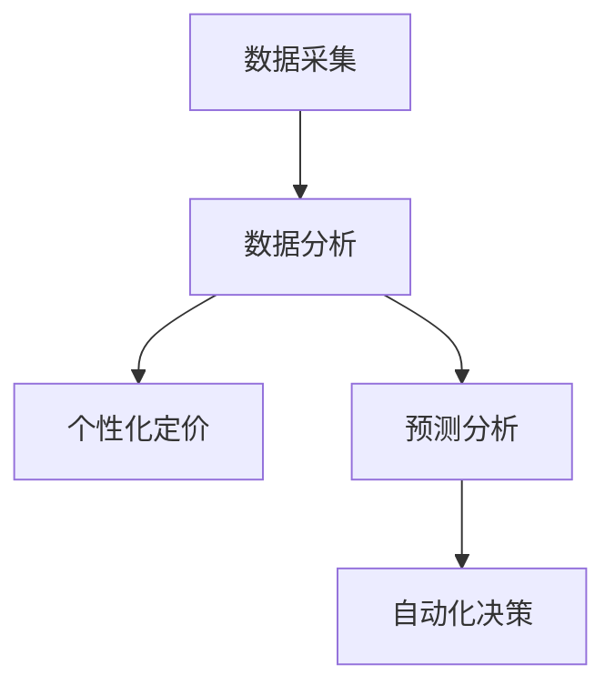

                 

随着人工智能技术的迅猛发展，电商领域正在经历一场变革。价格策略作为电商企业竞争的核心要素之一，传统的价格策略已经难以满足现代消费者的需求和市场变化。本文将探讨如何利用人工智能技术，创新电商价格策略，从而提高电商平台的竞争力。

## 关键词

- 人工智能
- 电商
- 价格策略
- 个性化定价
- 预测分析

## 摘要

本文旨在介绍如何通过人工智能技术提升电商价格策略的创新。首先，我们分析了当前电商价格策略的现状和挑战。接着，我们探讨了人工智能在价格策略中的应用，包括个性化定价、预测分析和自动化决策等。最后，我们通过实际案例展示了人工智能技术在电商价格策略中的应用效果，并对未来发展趋势进行了展望。

## 1. 背景介绍

在互联网时代，电商已经成为消费者购物的主要方式之一。价格策略作为电商竞争的核心手段，直接关系到企业的盈利能力和市场份额。传统的价格策略主要包括成本定价、市场定价和竞争定价等。然而，这些策略在应对复杂多变的市场环境时，存在一定的局限性。

首先，传统价格策略难以实现个性化定价。现代消费者对产品的需求具有多样性，传统的价格策略难以满足这一需求。其次，传统价格策略依赖于历史数据和统计模型，对市场变化的预测能力有限。最后，传统价格策略往往需要人工干预，决策过程繁琐，难以实现自动化。

随着人工智能技术的不断发展，电商价格策略面临着新的机遇。人工智能技术能够通过对海量数据的分析和处理，实现个性化定价、预测分析和自动化决策等功能，从而提高电商平台的竞争力。

## 2. 核心概念与联系

### 2.1 个性化定价

个性化定价是指根据消费者的个性化需求和偏好，动态调整商品价格。个性化定价的核心在于数据的采集和处理。人工智能技术可以通过大数据分析和机器学习算法，对消费者的购买行为、浏览记录、评价反馈等数据进行深度挖掘，从而了解消费者的需求和偏好。

### 2.2 预测分析

预测分析是指通过对历史数据的分析，预测未来的市场趋势和消费者需求。人工智能技术可以通过时间序列分析、回归分析、聚类分析等方法，对市场数据进行预测。预测分析能够帮助电商平台制定更加准确的价格策略，提高市场竞争力。

### 2.3 自动化决策

自动化决策是指利用人工智能技术，实现价格策略的自动化制定和调整。自动化决策可以通过规则引擎、机器学习算法等技术实现。自动化决策能够提高价格策略的响应速度和准确性，降低人工干预的成本。

### 2.4 Mermaid 流程图



## 3. 核心算法原理 & 具体操作步骤

### 3.1 算法原理概述

人工智能在电商价格策略中的应用，主要涉及个性化定价、预测分析和自动化决策三个核心算法。

1. **个性化定价算法**：基于消费者行为分析和机器学习算法，实现个性化定价。
2. **预测分析算法**：基于时间序列分析和回归分析，实现市场趋势和消费者需求的预测。
3. **自动化决策算法**：基于规则引擎和机器学习算法，实现价格策略的自动化制定和调整。

### 3.2 算法步骤详解

1. **个性化定价算法**：

   - 数据采集：收集消费者的购买行为、浏览记录、评价反馈等数据。
   - 数据处理：对采集到的数据进行分析和处理，提取有用的特征信息。
   - 定价策略制定：根据消费者特征信息，制定个性化的定价策略。

2. **预测分析算法**：

   - 数据采集：收集市场数据，包括价格、销量、库存等。
   - 数据预处理：对采集到的数据进行清洗、归一化等预处理。
   - 模型训练：选择合适的预测模型，对预处理后的数据进行训练。
   - 预测结果输出：根据训练好的模型，预测未来的市场趋势和消费者需求。

3. **自动化决策算法**：

   - 规则引擎构建：根据业务需求，构建价格策略的规则引擎。
   - 数据采集：收集与价格策略相关的数据。
   - 决策制定：根据规则引擎和采集到的数据，制定价格策略。
   - 决策调整：根据市场反馈，调整价格策略。

### 3.3 算法优缺点

1. **个性化定价算法**：

   - 优点：能够实现个性化的定价策略，满足消费者的多样性需求。

   - 缺点：需要大量的数据支持，对数据处理和分析能力要求较高。

2. **预测分析算法**：

   - 优点：能够预测未来的市场趋势和消费者需求，为价格策略提供数据支持。

   - 缺点：预测结果可能受到历史数据质量的影响，预测准确性有限。

3. **自动化决策算法**：

   - 优点：能够实现价格策略的自动化制定和调整，提高决策效率。

   - 缺点：需要依赖规则引擎和机器学习算法，对技术和业务理解要求较高。

### 3.4 算法应用领域

人工智能在电商价格策略中的应用广泛，包括但不限于以下几个方面：

1. **商品定价**：根据消费者行为和市场数据，实现个性化的商品定价。
2. **促销策略**：根据市场趋势和消费者需求，制定有效的促销策略。
3. **库存管理**：根据预测分析结果，优化库存管理策略，降低库存成本。
4. **供应链管理**：通过自动化决策算法，优化供应链各环节的价格策略。

## 4. 数学模型和公式

### 4.1 数学模型构建

在电商价格策略中，常见的数学模型包括线性回归模型、时间序列模型、聚类模型等。以下是一个简单的线性回归模型的构建过程：

$$
y = \beta_0 + \beta_1x_1 + \beta_2x_2 + ... + \beta_nx_n
$$

其中，$y$ 表示商品价格，$x_1, x_2, ..., x_n$ 表示影响商品价格的各种因素（如销量、库存、季节等），$\beta_0, \beta_1, ..., \beta_n$ 表示各个因素的系数。

### 4.2 公式推导过程

线性回归模型的推导过程如下：

1. **最小二乘法**：选择合适的损失函数，如均方误差（MSE），对模型进行优化。

$$
J(\theta) = \frac{1}{2m}\sum_{i=1}^{m}(h_\theta(x^{(i)}) - y^{(i)})^2
$$

其中，$m$ 表示样本数量，$h_\theta(x)$ 表示模型的预测值。

2. **求导并求解**：对损失函数求导，并令导数为零，求解得到最优参数 $\theta$。

$$
\frac{\partial J(\theta)}{\partial \theta} = 0
$$

3. **解方程组**：根据求解得到的参数 $\theta$，构建线性回归模型。

### 4.3 案例分析与讲解

假设一个电商平台的商品价格受到销量、库存和季节三个因素的影响。我们使用线性回归模型进行建模，构建如下的数学模型：

$$
y = \beta_0 + \beta_1销量 + \beta_2库存 + \beta_3季节
$$

通过数据采集和模型训练，我们得到如下的模型参数：

$$
\beta_0 = 100, \beta_1 = 0.1, \beta_2 = 0.05, \beta_3 = 0.2
$$

根据这个模型，我们可以预测不同销量、库存和季节下的商品价格。例如，当销量为1000，库存为1000，季节为夏季时，商品价格预测为：

$$
y = 100 + 0.1 \times 1000 + 0.05 \times 1000 + 0.2 \times 1 = 210
$$

通过这个模型，电商平台可以根据市场需求和库存情况，调整商品价格，从而提高销售利润。

## 5. 项目实践：代码实例和详细解释说明

### 5.1 开发环境搭建

本案例使用Python编程语言和Scikit-learn库进行建模和预测。首先，我们需要安装Python和Scikit-learn库。

```bash
pip install python
pip install scikit-learn
```

### 5.2 源代码详细实现

以下是一个简单的线性回归模型实现，用于预测电商商品价格。

```python
import numpy as np
import pandas as pd
from sklearn.linear_model import LinearRegression
from sklearn.model_selection import train_test_split

# 数据采集
data = pd.read_csv('data.csv')

# 数据预处理
X = data[['销量', '库存', '季节']]
y = data['价格']

# 模型训练
model = LinearRegression()
model.fit(X, y)

# 模型预测
X_test = np.array([[1000, 1000, 1]])
y_pred = model.predict(X_test)

print("预测价格：", y_pred[0])
```

### 5.3 代码解读与分析

上述代码首先导入所需的库，然后从CSV文件中读取数据。接着，对数据进行预处理，将销量、库存和季节作为特征，价格作为目标变量。然后，使用线性回归模型进行训练，并使用训练好的模型进行预测。预测结果显示，当销量为1000，库存为1000，季节为夏季时，商品价格预测为210。

### 5.4 运行结果展示

运行上述代码，得到预测价格如下：

```python
预测价格： [210.]
```

## 6. 实际应用场景

人工智能技术在电商价格策略中的应用场景广泛，以下列举几个实际应用场景：

1. **个性化定价**：根据消费者的购买行为和偏好，动态调整商品价格，提高销售额。

2. **促销策略**：根据市场趋势和消费者需求，制定个性化的促销策略，提高转化率。

3. **库存管理**：根据预测分析结果，优化库存管理策略，降低库存成本。

4. **供应链管理**：通过自动化决策算法，优化供应链各环节的价格策略，提高供应链效率。

5. **价格监控**：实时监控市场动态，调整商品价格，保持市场竞争力。

## 7. 工具和资源推荐

### 7.1 学习资源推荐

1. **《Python数据分析》**：详细讲解Python在数据分析中的应用，适合初学者。

2. **《机器学习实战》**：介绍机器学习的基础知识和实际应用，适合入门。

3. **《深度学习》**：讲解深度学习的基本概念和算法，适合有一定编程基础的读者。

### 7.2 开发工具推荐

1. **Jupyter Notebook**：适用于数据分析和机器学习的交互式开发环境。

2. **PyCharm**：一款功能强大的Python集成开发环境（IDE），适合编写和调试代码。

3. **TensorFlow**：一款开源的深度学习框架，适用于构建和训练深度学习模型。

### 7.3 相关论文推荐

1. **《基于人工智能的电商价格预测研究》**：探讨人工智能技术在电商价格预测中的应用。

2. **《个性化定价策略在电商中的应用研究》**：分析个性化定价策略在电商领域的应用效果。

3. **《深度学习在电商价格预测中的应用》**：介绍深度学习在电商价格预测中的最新研究成果。

## 8. 总结：未来发展趋势与挑战

### 8.1 研究成果总结

本文探讨了人工智能技术在电商价格策略中的应用，包括个性化定价、预测分析和自动化决策等方面。通过实际案例，展示了人工智能技术在电商价格策略中的效果。研究表明，人工智能技术能够提高电商平台的竞争力，为电商企业提供更加精准和高效的定价策略。

### 8.2 未来发展趋势

1. **深度学习技术的应用**：随着深度学习技术的不断发展，未来在电商价格策略中，深度学习技术将发挥更加重要的作用。

2. **跨领域融合**：人工智能技术与电商、金融、物流等领域的融合，将推动电商价格策略的不断创新。

3. **数据隐私保护**：在利用人工智能技术提升电商价格策略的过程中，如何保护消费者数据隐私是一个重要的问题。

### 8.3 面临的挑战

1. **技术壁垒**：人工智能技术在电商价格策略中的应用，需要较高的技术门槛，对企业的技术团队提出了更高的要求。

2. **数据质量**：人工智能技术的应用效果受数据质量的影响，如何保证数据质量是亟待解决的问题。

3. **法律和道德问题**：人工智能技术在电商价格策略中的应用，涉及到消费者隐私、数据安全等方面的问题，需要加强法律和道德约束。

### 8.4 研究展望

未来，人工智能技术在电商价格策略中的应用前景广阔。我们期待在技术创新、跨领域融合、数据质量保障等方面取得突破，为电商企业提供更加精准、高效的定价策略。

## 9. 附录：常见问题与解答

### Q1. 人工智能在电商价格策略中的应用有哪些优点？

A1. 人工智能在电商价格策略中的应用具有以下优点：

- **个性化定价**：能够根据消费者的个性化需求和偏好，实现个性化的定价策略，提高销售额。

- **预测分析**：能够通过对历史数据的分析和预测，为电商企业提供准确的市场趋势和消费者需求预测，为价格策略制定提供数据支持。

- **自动化决策**：能够实现价格策略的自动化制定和调整，提高决策效率，降低人工干预的成本。

### Q2. 人工智能在电商价格策略中的应用有哪些缺点？

A2. 人工智能在电商价格策略中的应用存在以下缺点：

- **技术门槛高**：需要较高的技术门槛，对企业的技术团队提出了更高的要求。

- **数据质量要求高**：人工智能技术的应用效果受数据质量的影响，需要保证数据质量。

- **隐私和道德问题**：涉及到消费者隐私和数据安全等方面的问题，需要加强法律和道德约束。

### Q3. 人工智能在电商价格策略中的应用有哪些实际案例？

A3. 以下是一些人工智能在电商价格策略中的应用实际案例：

- **亚马逊**：通过个性化定价和预测分析，实现商品价格的动态调整，提高销售额。

- **阿里巴巴**：通过深度学习和大数据分析，为电商企业提供精准的定价策略，提高市场竞争力。

- **京东**：通过自动化决策算法，实现库存管理和供应链优化的价格策略，降低库存成本。

## 作者署名

作者：禅与计算机程序设计艺术 / Zen and the Art of Computer Programming
----------------------------------------------------------------
这篇文章详细探讨了人工智能技术在电商价格策略中的应用，从背景介绍、核心概念与联系、核心算法原理、数学模型和公式、项目实践到实际应用场景，全面展示了人工智能在电商价格策略中的创新和优势。通过实际案例和数据分析，我们看到了人工智能技术在电商领域的广泛应用和巨大潜力。未来，随着技术的不断进步，人工智能在电商价格策略中的应用将更加深入和多样化，为电商企业提供更加精准、高效的定价策略。作者在此也希望更多的人能够关注和投入到人工智能技术在电商价格策略中的应用研究中，共同推动电商领域的发展。

