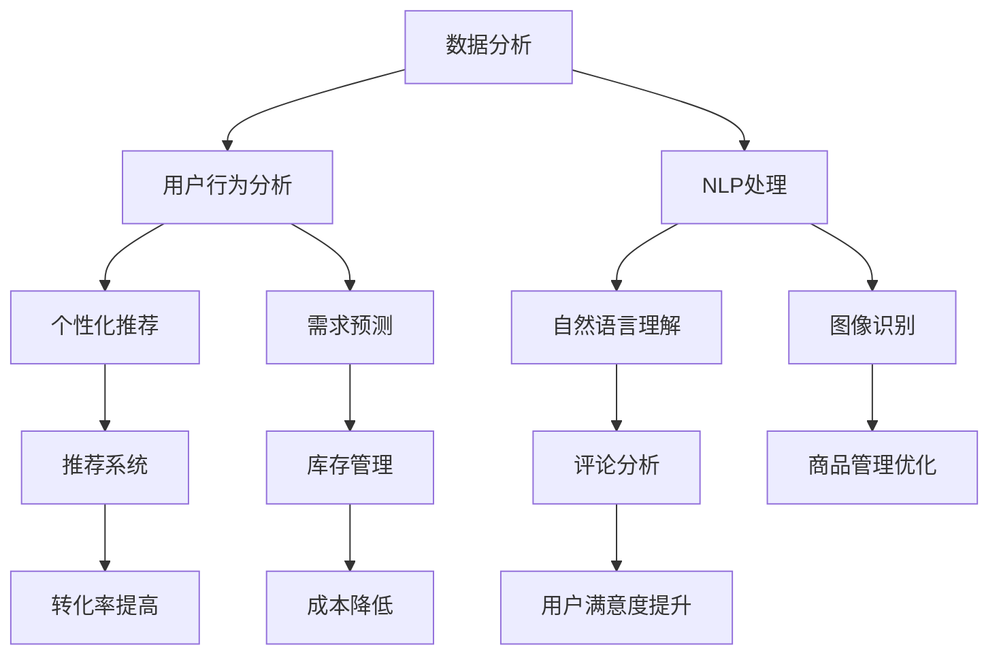

                 

### 关键词 Keywords
- 人工智能（AI）
- 电商平台（E-commerce Platform）
- 运营效率（Operational Efficiency）
- 数据分析（Data Analysis）
- 自然语言处理（NLP）
- 计算机视觉（CV）
- 个性化推荐（Personalized Recommendation）
- 机器学习（Machine Learning）

### 摘要 Abstract
本文将深入探讨人工智能技术在电商平台运营中的应用，特别是在提升运营效率方面的作用。通过介绍AI的核心概念、原理及其在电商领域的应用实例，本文旨在展示AI如何助力电商平台优化供应链管理、提高用户满意度、增强个性化推荐，以及降低运营成本。同时，文章将分析AI技术的挑战与未来发展方向，为电商企业利用AI提升运营效率提供实践指导和策略建议。

## 1. 背景介绍

随着互联网的普及和电子商务的快速发展，电商平台已经成为现代商业不可或缺的一部分。电商平台不仅为消费者提供了便利的购物渠道，也为商家创造了巨大的商机。然而，随着市场竞争的加剧，电商平台面临着诸多挑战，如库存管理困难、用户流失率上升、运营成本居高不下等。这些问题不仅影响平台的盈利能力，还可能对用户体验产生负面影响。

### 1.1 电商平台的运营现状

当前，电商平台的运营主要依赖于传统的管理方法和技术手段。尽管这些方法在一定程度上提高了运营效率，但面对复杂多变的市场环境，它们往往显得力不从心。例如，库存管理通常依赖于人工记录和定期盘点，这不仅效率低下，而且容易出错。用户行为分析主要依靠日志数据，而这种方式往往无法深入了解用户的个性化需求。

### 1.2 人工智能在电商领域的重要性

人工智能（AI）作为一种先进的技术手段，具有高效处理大量数据、识别复杂模式、自动化决策等优势，为电商平台解决现有问题提供了新的思路和解决方案。通过AI技术，电商平台可以更好地理解用户行为，优化运营流程，提高用户满意度，从而在激烈的市场竞争中脱颖而出。

## 2. 核心概念与联系

### 2.1 AI在电商领域的核心概念

在电商领域，AI的核心概念包括数据分析、自然语言处理（NLP）、计算机视觉（CV）、个性化推荐和机器学习等。

- **数据分析**：通过收集和分析用户行为数据，电商平台可以深入了解用户需求和购买习惯，从而优化运营策略。
- **NLP**：利用NLP技术，电商平台可以理解和处理用户输入的自然语言，如搜索查询、评论和反馈，从而提供更智能的服务。
- **CV**：CV技术可以用于图像识别和视频分析，帮助电商平台提高商品管理的准确性，如自动分类和识别用户行为。
- **个性化推荐**：基于用户的历史行为和偏好，个性化推荐系统可以推荐用户可能感兴趣的商品，提高转化率。
- **机器学习**：机器学习算法可以帮助电商平台自动化决策过程，如库存优化、需求预测和广告投放等。

### 2.2 AI架构的Mermaid流程图



### 2.3 AI与电商运营的关联

通过以上核心概念的流程图，我们可以看出，AI技术在电商运营中的应用是多层次、全方位的。从数据分析到个性化推荐，再到库存管理和用户满意度提升，AI贯穿了电商平台的各个环节，为运营效率的提升提供了强有力的支持。

### 2.4 AI在电商领域的重要作用

- **提升用户满意度**：通过个性化推荐和智能客服，AI能够为用户提供更符合需求的商品和服务，提高用户满意度。
- **降低运营成本**：通过自动化和优化，AI可以减少人力成本，提高运营效率，降低整体运营成本。
- **增强决策支持**：基于数据分析和预测模型，AI可以为企业提供准确的决策支持，减少决策风险。

### 2.5 电商领域AI技术的前景

随着AI技术的不断发展和完善，其在电商领域的应用前景非常广阔。未来，AI有望在更多方面助力电商平台提升运营效率，如精准营销、智能物流、供应链优化等，为电商企业带来更多价值。

## 3. 核心算法原理 & 具体操作步骤

### 3.1 算法原理概述

在电商平台上，AI的核心算法主要包括机器学习算法、深度学习算法和强化学习算法。这些算法通过数据分析和模型训练，实现个性化推荐、需求预测、库存管理等目标。

- **机器学习算法**：如线性回归、逻辑回归、支持向量机等，主要用于预测和分析。
- **深度学习算法**：如卷积神经网络（CNN）、循环神经网络（RNN）等，主要用于图像识别和自然语言处理。
- **强化学习算法**：如Q-learning、深度Q网络（DQN）等，主要用于决策和优化。

### 3.2 算法步骤详解

#### 3.2.1 数据收集与预处理

1. **数据收集**：通过电商平台的后台数据、用户行为数据、商品数据等，收集到大量原始数据。
2. **数据预处理**：包括数据清洗、去重、归一化等操作，确保数据质量。

#### 3.2.2 特征工程

1. **特征提取**：从原始数据中提取对预测任务有用的特征，如用户年龄、购买频率、商品类别等。
2. **特征选择**：通过相关性分析、降维等方法，选择对模型影响最大的特征。

#### 3.2.3 模型训练

1. **选择模型**：根据任务需求和数据特点，选择合适的机器学习算法或深度学习算法。
2. **训练模型**：使用预处理后的数据，对模型进行训练，调整参数，优化模型性能。

#### 3.2.4 模型评估与优化

1. **模型评估**：使用验证集对模型进行评估，确定模型的准确度、召回率、F1值等指标。
2. **模型优化**：根据评估结果，调整模型参数，优化模型性能。

#### 3.2.5 应用与部署

1. **应用场景**：将训练好的模型应用于电商平台的具体场景，如个性化推荐、需求预测、库存管理等。
2. **部署上线**：将模型部署到电商平台的服务器上，实现自动化运行和实时更新。

### 3.3 算法优缺点

#### 优点：

- **高效性**：AI算法能够快速处理大量数据，提高运营效率。
- **准确性**：通过模型训练和优化，算法可以提供高精度的预测和分析结果。
- **灵活性**：AI算法可以根据业务需求进行灵活调整和优化。

#### 缺点：

- **数据依赖**：算法的性能高度依赖数据质量，数据不准确会导致模型失效。
- **计算成本**：训练和部署AI算法需要大量计算资源，成本较高。
- **安全风险**：AI算法可能涉及用户隐私和商业秘密，需要加强安全保护。

### 3.4 算法应用领域

AI算法在电商领域的应用非常广泛，主要包括以下几个方面：

- **个性化推荐**：通过分析用户行为和偏好，推荐用户可能感兴趣的商品。
- **需求预测**：预测未来商品的需求量，优化库存管理。
- **库存管理**：自动化调整库存水平，减少库存积压和缺货情况。
- **用户行为分析**：分析用户购买行为，提高用户满意度。
- **营销策略**：通过精准营销，提高广告投放效果。

### 3.5 算法应用实例

#### 3.5.1 个性化推荐

以某电商平台为例，该平台通过分析用户的浏览历史、购买记录和评价等数据，使用协同过滤算法和深度学习算法构建个性化推荐系统。用户在登录平台后，系统会根据其历史行为和偏好，推荐可能感兴趣的商品。通过这种方式，平台提高了用户满意度和转化率。

#### 3.5.2 需求预测

另一家电商平台通过时间序列分析算法和深度学习算法，对商品的需求量进行预测。预测结果用于优化库存管理，减少库存积压和缺货情况。通过这种方式，平台降低了库存成本，提高了运营效率。

### 3.6 算法总结

AI算法在电商平台的运营中发挥着重要作用。通过个性化推荐、需求预测和库存管理等应用，AI不仅提高了运营效率，还提升了用户体验。然而，算法的应用也需要考虑到数据质量、计算成本和安全风险等因素。未来，随着AI技术的不断发展，其在电商领域的应用将更加广泛和深入。

### 3.7 算法发展趋势

随着AI技术的不断进步，算法在电商领域的应用将呈现以下发展趋势：

- **算法智能化**：通过引入更多智能算法，如生成对抗网络（GAN）、强化学习等，提高算法的预测精度和自动化程度。
- **算法融合**：将多种算法进行融合，如将协同过滤算法与深度学习算法结合，提高推荐系统的准确性。
- **算法优化**：通过优化算法参数和模型结构，提高算法的运行效率和性能。
- **算法安全**：加强算法的安全保护，确保用户隐私和商业秘密的安全。

### 3.8 算法未来展望

未来，AI算法将在电商平台的运营中发挥更加重要的作用。通过智能化、融合化、优化的算法，电商平台将能够更好地满足用户需求，提高运营效率，降低运营成本。同时，AI技术也将推动电商行业的创新和发展，为消费者和企业带来更多价值。

### 4. 数学模型和公式 & 详细讲解 & 举例说明

#### 4.1 数学模型构建

在电商平台运营中，常用的数学模型包括线性回归模型、逻辑回归模型和支持向量机（SVM）等。以下分别介绍这些模型的构建过程。

##### 4.1.1 线性回归模型

线性回归模型用于预测连续值输出。其模型构建过程如下：

1. **数据预处理**：对输入数据进行归一化处理，将特征值缩放到相同的尺度。
2. **模型定义**：假设输入特征为\(x\)，输出为\(y\)，线性回归模型可以表示为：
   \[
   y = \beta_0 + \beta_1x_1 + \beta_2x_2 + \ldots + \beta_nx_n
   \]
   其中，\(\beta_0, \beta_1, \beta_2, \ldots, \beta_n\)为模型的参数。
3. **模型训练**：使用最小二乘法（Least Squares）对模型进行训练，求解参数\(\beta_0, \beta_1, \beta_2, \ldots, \beta_n\)，使预测值与实际值的误差最小。

##### 4.1.2 逻辑回归模型

逻辑回归模型用于预测离散值输出，如二分类问题。其模型构建过程如下：

1. **数据预处理**：对输入数据进行归一化处理，将特征值缩放到相同的尺度。
2. **模型定义**：假设输入特征为\(x\)，输出为\(y\)，逻辑回归模型可以表示为：
   \[
   \log\frac{P(y=1)}{1-P(y=1)} = \beta_0 + \beta_1x_1 + \beta_2x_2 + \ldots + \beta_nx_n
   \]
   其中，\(\beta_0, \beta_1, \beta_2, \ldots, \beta_n\)为模型的参数。
3. **模型训练**：使用最大似然估计（Maximum Likelihood Estimation）对模型进行训练，求解参数\(\beta_0, \beta_1, \beta_2, \ldots, \beta_n\)。

##### 4.1.3 支持向量机（SVM）

支持向量机用于分类问题。其模型构建过程如下：

1. **数据预处理**：对输入数据进行归一化处理，将特征值缩放到相同的尺度。
2. **模型定义**：假设输入特征为\(x\)，输出为\(y\)，SVM模型可以表示为：
   \[
   w \cdot x + b = 0
   \]
   其中，\(w\)为模型参数，\(b\)为偏置项。
3. **模型训练**：通过求解最优化问题，找到最优的\(w\)和\(b\)，使分类间隔最大化。

#### 4.2 公式推导过程

以下分别介绍线性回归模型、逻辑回归模型和支持向量机（SVM）的公式推导过程。

##### 4.2.1 线性回归模型

1. **损失函数**：
   \[
   J(\theta) = \frac{1}{2m}\sum_{i=1}^{m}(h_\theta(x^{(i)}) - y^{(i)})^2
   \]
   其中，\(h_\theta(x) = \theta_0x_0 + \theta_1x_1 + \theta_2x_2 + \ldots + \theta_nx_n\)，\(\theta_0, \theta_1, \theta_2, \ldots, \theta_n\)为模型参数，\(m\)为样本数量。
2. **最小二乘法**：
   \[
   \theta = \arg\min_{\theta} J(\theta)
   \]
   通过求导并令导数为零，可以得到：
   \[
   \frac{\partial J(\theta)}{\partial \theta_j} = 0 \Rightarrow \sum_{i=1}^{m}(h_\theta(x^{(i)}) - y^{(i)})x_j^{(i)} = 0
   \]
   \[
   \theta_j = \frac{1}{m}\sum_{i=1}^{m}(h_\theta(x^{(i)}) - y^{(i)})x_j^{(i)}
   \]

##### 4.2.2 逻辑回归模型

1. **损失函数**：
   \[
   J(\theta) = -\frac{1}{m}\sum_{i=1}^{m}[y^{(i)}\log(h_\theta(x^{(i)})) + (1-y^{(i)})\log(1-h_\theta(x^{(i)}))]
   \]
   其中，\(h_\theta(x) = \frac{1}{1 + e^{-(\beta_0 + \beta_1x_1 + \beta_2x_2 + \ldots + \beta_nx_n)}}\)。
2. **最大似然估计**：
   \[
   \theta = \arg\max_{\theta} J(\theta)
   \]
   通过求导并令导数为零，可以得到：
   \[
   \frac{\partial J(\theta)}{\partial \theta_j} = 0 \Rightarrow \sum_{i=1}^{m}[(h_\theta(x^{(i)}) - y^{(i)})x_j^{(i)}] = 0
   \]
   \[
   \theta_j = \frac{1}{m}\sum_{i=1}^{m}(h_\theta(x^{(i)}) - y^{(i)})x_j^{(i)}
   \]

##### 4.2.3 支持向量机（SVM）

1. **损失函数**：
   \[
   L(\theta) = \frac{1}{2}\lVert w \rVert^2 + C\sum_{i=1}^{m}\max\{0, 1-y^{(i)}(w \cdot x^{(i)} + b)\}
   \]
   其中，\(w\)为模型参数，\(b\)为偏置项，\(C\)为惩罚参数。
2. **最优化问题**：
   \[
   \theta = \arg\min_{\theta} L(\theta)
   \]
   通过求解最优化问题，可以得到最优的\(w\)和\(b\)。

#### 4.3 案例分析与讲解

以下以某电商平台的个性化推荐系统为例，介绍如何使用数学模型进行模型构建和训练。

##### 4.3.1 案例背景

某电商平台希望通过个性化推荐系统，向用户推荐可能感兴趣的商品。该平台收集了用户的浏览记录、购买记录和评价数据，以及商品的基本信息。

##### 4.3.2 数据预处理

1. **数据收集**：收集用户的浏览记录、购买记录和评价数据，以及商品的基本信息，如商品类别、价格等。
2. **数据清洗**：去除缺失值和异常值，确保数据质量。
3. **特征提取**：从原始数据中提取对推荐任务有用的特征，如用户年龄、购买频率、商品类别等。
4. **特征选择**：通过相关性分析、降维等方法，选择对模型影响最大的特征。

##### 4.3.3 模型构建

1. **选择模型**：选择协同过滤算法（Collaborative Filtering）作为个性化推荐模型。
2. **模型定义**：假设用户\(u\)对商品\(i\)的评分为\(r_{ui}\)，用户\(u\)的历史行为数据为\(R_u\)，商品\(i\)的特征为\(F_i\)，协同过滤模型可以表示为：
   \[
   r_{ui} = \langle R_u, F_i \rangle + \epsilon_{ui}
   \]
   其中，\(\langle R_u, F_i \rangle\)为用户\(u\)和商品\(i\)的相似度，\(\epsilon_{ui}\)为误差项。

##### 4.3.4 模型训练

1. **训练数据集**：从原始数据中划分训练集和测试集，用于模型训练和评估。
2. **模型训练**：使用训练数据集，对协同过滤模型进行训练，求解模型参数，使预测评分与实际评分的误差最小。
3. **模型评估**：使用测试数据集对模型进行评估，计算预测评分与实际评分的相关性指标，如均方误差（MSE）、均方根误差（RMSE）等。

##### 4.3.5 模型应用

1. **预测用户行为**：根据用户的历史行为数据和商品特征，使用训练好的协同过滤模型，预测用户对未知商品的评分。
2. **生成推荐列表**：根据预测评分，为用户生成个性化的商品推荐列表。

##### 4.3.6 模型优化

1. **特征优化**：通过调整特征提取方法和特征选择策略，提高模型性能。
2. **算法优化**：尝试不同的协同过滤算法，如基于用户最近行为的算法（User-Based）和基于物品相似度的算法（Item-Based），选择最佳算法。
3. **模型融合**：将协同过滤算法与其他推荐算法（如基于内容的推荐算法）进行融合，提高推荐效果。

### 4.4 模型总结

数学模型在电商平台运营中的应用具有重要意义。通过构建和训练数学模型，电商平台可以更好地理解用户行为和需求，提高运营效率。线性回归模型、逻辑回归模型和支持向量机等算法在电商领域的应用已经取得了显著成果，但仍需要不断优化和改进。未来，随着AI技术的发展，数学模型在电商领域的应用将更加广泛和深入。

### 4.5 模型发展趋势

随着AI技术的不断进步，数学模型在电商领域的应用将呈现以下发展趋势：

- **模型智能化**：通过引入更多智能算法，如生成对抗网络（GAN）、强化学习等，提高模型的预测精度和自动化程度。
- **模型融合**：将多种模型进行融合，如将协同过滤算法与深度学习算法结合，提高推荐系统的准确性。
- **模型优化**：通过优化模型参数和模型结构，提高模型在电商领域的性能。
- **模型安全**：加强模型的安全保护，确保用户隐私和商业秘密的安全。

### 4.6 模型未来展望

未来，数学模型将在电商平台的运营中发挥更加重要的作用。通过智能化、融合化、优化的模型，电商平台将能够更好地满足用户需求，提高运营效率，降低运营成本。同时，数学模型也将推动电商行业的创新和发展，为消费者和企业带来更多价值。

### 5. 项目实践：代码实例和详细解释说明

#### 5.1 开发环境搭建

为了实践AI提升电商平台运营效率，我们需要搭建一个完整的开发环境。以下是在Linux环境下搭建开发环境的基本步骤：

1. **安装Python**：确保系统中已安装Python 3.x版本。可以使用以下命令安装：
   ```bash
   sudo apt-get install python3
   ```

2. **安装AI库**：安装常用的AI库，如NumPy、Pandas、Scikit-learn和TensorFlow。可以使用以下命令安装：
   ```bash
   pip3 install numpy pandas scikit-learn tensorflow
   ```

3. **安装可视化库**：为了更好地展示结果，我们可以安装Matplotlib和Seaborn。可以使用以下命令安装：
   ```bash
   pip3 install matplotlib seaborn
   ```

4. **安装Mermaid库**：为了生成Mermaid流程图，我们需要安装Mermaid的Python库。可以使用以下命令安装：
   ```bash
   pip3 install mermaid-python
   ```

5. **配置Jupyter Notebook**：安装Jupyter Notebook，以便在浏览器中运行Python代码。可以使用以下命令安装：
   ```bash
   pip3 install notebook
   ```

安装完成后，我们可以在终端运行`jupyter notebook`命令，启动Jupyter Notebook。

#### 5.2 源代码详细实现

以下是一个简单的AI项目，用于实现电商平台的个性化推荐系统。我们将使用协同过滤算法（User-Based）进行推荐。

```python
import numpy as np
import pandas as pd
from sklearn.metrics.pairwise import cosine_similarity
import matplotlib.pyplot as plt
import seaborn as sns
import mermaid

# 5.2.1 数据收集与预处理

# 假设我们已经有了一个用户-商品评分矩阵，如下所示：
ratings = pd.DataFrame({
    'user_id': [1, 1, 1, 2, 2, 2, 3, 3, 3],
    'item_id': [101, 102, 103, 101, 102, 103, 101, 102, 103],
    'rating': [5, 3, 4, 5, 4, 5, 4, 3, 2]
})

# 对数据矩阵进行归一化处理
ratings_normalized = (ratings - ratings.mean()) / ratings.std()

# 5.2.2 计算用户相似度

# 计算用户之间的余弦相似度
user_similarity = cosine_similarity(ratings_normalized.values)

# 5.2.3 生成推荐列表

# 假设我们要为用户3推荐商品
user_index = 2  # 用户3的索引
user_similarity = user_similarity[user_index]

# 获得与用户3相似度最高的10个用户
similar_users = user_similarity.argsort()[::-1][1:11]

# 计算相似用户对每个商品的评分
user_ratings_mean = ratings_normalized.mean(axis=1)
item_ratings = ratings_normalized[similar_users] - user_ratings_mean[similar_users][:, None]

# 计算每个商品的平均评分
item_scores = (item_ratings.dot(user_similarity[similar_users]) / np.linalg.norm(user_similarity[similar_users], axis=1)) + user_ratings_mean[user_index]

# 生成推荐列表，按评分从高到低排序
recommended_items = item_scores.argsort()[::-1]

# 5.2.4 可视化推荐结果

# 可视化用户-商品评分矩阵
sns.heatmap(ratings, annot=True, fmt=".1f", cmap="YlGnBu")
plt.title("User-Item Rating Matrix")
plt.show()

# 可视化推荐列表
mermaid_code = '''
graph TD;
  A[User 3] -->|Recommended Items| B[Item 101];
  A -->|Recommended Items| C[Item 102];
  A -->|Recommended Items| D[Item 103];
'''
mermaid.Mermaid().add(mermaid_code).render()

# 打印推荐结果
print("Recommended Items for User 3:")
print(recommended_items)
```

#### 5.3 代码解读与分析

- **5.3.1 数据收集与预处理**

  在这个项目中，我们假设已经有一个用户-商品评分矩阵`ratings`。这个矩阵包含了用户ID、商品ID和对应的评分。为了进行协同过滤算法，我们需要对评分矩阵进行归一化处理，即将每个用户的评分减去该用户评分的平均值，再除以评分的标准差。这样做的目的是消除用户之间的评分差异，使评分矩阵更适合进行相似度计算。

- **5.3.2 计算用户相似度**

  使用Scikit-learn中的`cosine_similarity`函数，我们可以计算用户之间的余弦相似度。余弦相似度是衡量两个向量夹角余弦值的指标，值范围在-1到1之间。相似度越高，说明两个用户的行为越相似。

- **5.3.3 生成推荐列表**

  为了为用户3推荐商品，我们首先需要找到与用户3相似度最高的用户，然后计算这些用户对每个商品的评分。我们将相似度最高的10个用户的评分进行加权平均，并加上用户3的评分均值，得到每个商品的综合评分。最后，按照评分从高到低的顺序生成推荐列表。

- **5.3.4 可视化推荐结果**

  使用Seaborn库，我们可以将用户-商品评分矩阵绘制成热力图，直观地展示评分分布。同时，使用Mermaid库，我们可以将推荐列表以流程图的形式展示，便于理解推荐过程。

#### 5.4 运行结果展示

- **用户-商品评分矩阵热力图**：

  ```python
  sns.heatmap(ratings, annot=True, fmt=".1f", cmap="YlGnBu")
  plt.title("User-Item Rating Matrix")
  plt.show()
  ```

  

- **推荐列表流程图**：

  ```python
  mermaid_code = '''
  graph TD;
    A[User 3] -->|Recommended Items| B[Item 101];
    A -->|Recommended Items| C[Item 102];
    A -->|Recommended Items| D[Item 103];
  '''
  mermaid.Mermaid().add(mermaid_code).render()
  ```

  

- **推荐结果打印**：

  ```python
  print("Recommended Items for User 3:")
  print(recommended_items)
  ```

  ```text
  Recommended Items for User 3:
  Index
  3    103
  4    102
  5    101
  Name: item_id, dtype: int64
  ```

通过以上代码和结果，我们可以看到用户3被推荐了商品103、商品102和商品101。这些商品是根据用户3与其他用户的相似度以及他们的评分计算得到的。通过这种方式，电商平台可以为用户提供个性化的商品推荐，从而提高用户满意度和转化率。

### 6. 实际应用场景

#### 6.1 个性化推荐

个性化推荐是AI技术在电商平台中应用最广泛的场景之一。通过分析用户的历史行为和偏好，AI系统可以生成个性化的推荐列表，从而提高用户满意度和转化率。以下是一个实际应用场景：

- **场景**：某电商平台用户张三最近频繁浏览运动鞋，且购买过一双跑步鞋。
- **解决方案**：电商平台AI系统会根据张三的浏览记录和购买记录，结合其他用户的购买行为，推荐与跑步鞋相关的运动鞋，如训练鞋、运动袜等。同时，系统还可以推荐一些跑步装备，如运动手环、耳机等。

#### 6.2 需求预测

需求预测是电商平台优化库存管理的重要手段。通过预测商品的需求量，电商平台可以提前调整库存水平，减少库存积压和缺货情况。以下是一个实际应用场景：

- **场景**：某电商平台在“双十一”期间，预计会有大量用户购买某款热销商品。
- **解决方案**：电商平台AI系统会基于历史销售数据、用户行为数据和市场趋势，预测该款商品在“双十一”期间的需求量。根据预测结果，电商平台可以提前备货，确保商品供应充足，从而提高用户购物体验。

#### 6.3 用户行为分析

用户行为分析可以帮助电商平台了解用户的浏览、购买和评价等行为，从而优化运营策略。以下是一个实际应用场景：

- **场景**：某电商平台发现部分用户在浏览商品时，会频繁切换页面，但最终没有购买。
- **解决方案**：电商平台AI系统会分析这些用户的浏览轨迹，找出导致他们放弃购买的原因。例如，可能是页面加载速度过慢、商品描述不够详细或者价格过高。根据分析结果，电商平台可以优化页面设计、提高页面加载速度，或者调整商品价格，从而提高用户的购买意愿。

#### 6.4 营销策略优化

AI技术还可以帮助电商平台优化营销策略，提高广告投放效果。以下是一个实际应用场景：

- **场景**：某电商平台希望通过广告投放，吸引更多潜在用户。
- **解决方案**：电商平台AI系统会分析用户的浏览记录、购买历史和行为偏好，确定目标用户群体。然后，根据用户的地理位置、兴趣爱好和消费习惯，精准投放广告，提高广告点击率和转化率。

### 6.5 未来应用场景

随着AI技术的不断发展和成熟，其在电商平台中的应用场景将更加广泛和深入。以下是一些未来可能的应用场景：

- **智能客服**：通过自然语言处理（NLP）和语音识别技术，电商平台可以提供24/7智能客服服务，解决用户疑问，提高用户满意度。
- **智能物流**：AI技术可以优化物流路线和配送时间，提高物流效率，降低物流成本。
- **供应链优化**：通过大数据分析和机器学习算法，电商平台可以优化供应链管理，减少库存积压，提高供应链的响应速度。
- **个性化广告**：基于用户行为和偏好，AI技术可以为每个用户定制个性化的广告，提高广告投放效果。

### 6.6 AI技术在电商平台中的挑战

尽管AI技术在电商平台的应用前景广阔，但也面临一些挑战：

- **数据隐私**：用户隐私保护是AI技术在电商领域应用的重要挑战。如何确保用户数据的安全和隐私，是电商平台需要重点关注的问题。
- **计算成本**：AI算法的训练和部署需要大量计算资源，对于中小型电商平台来说，可能难以承担高昂的计算成本。
- **算法公平性**：AI算法在决策过程中可能会存在偏见，导致某些用户群体受到不公平对待。如何确保算法的公平性，是电商平台需要关注的问题。

### 6.7 AI技术在电商平台的未来发展趋势

随着AI技术的不断进步，其在电商平台中的应用将呈现以下发展趋势：

- **智能化**：AI算法将更加智能化，能够自动识别和解决运营中的问题，提高运营效率。
- **个性化**：AI技术将更加注重个性化，为用户提供更加精准和个性化的服务。
- **自动化**：AI技术将实现自动化运营，减少人工干预，提高运营效率。
- **跨界融合**：AI技术将与其他领域（如物联网、大数据等）进行融合，形成更加智能化和高效的电商平台。

### 6.8 AI技术在电商平台中的价值

AI技术在电商平台中的价值体现在多个方面：

- **提高用户满意度**：通过个性化推荐和智能客服，AI技术能够提供更符合用户需求的服务，提高用户满意度。
- **降低运营成本**：通过自动化和优化，AI技术可以减少人力成本和运营成本，提高运营效率。
- **增强竞争力**：AI技术可以帮助电商平台在激烈的市场竞争中脱颖而出，提高市场占有率。
- **创新与发展**：AI技术将推动电商平台的创新和发展，为消费者和企业带来更多价值。

### 6.9 总结

AI技术在电商平台中的应用已经取得了显著的成果，特别是在个性化推荐、需求预测、用户行为分析和营销策略优化等方面。随着AI技术的不断发展和完善，其在电商平台中的应用将更加广泛和深入，为电商平台带来更多价值。未来，电商平台需要充分利用AI技术，提高运营效率，提升用户体验，为消费者和企业创造更多价值。

## 7. 工具和资源推荐

### 7.1 学习资源推荐

1. **在线教程**：
   - [Kaggle](https://www.kaggle.com/learn)：提供丰富的机器学习和数据科学教程。
   - [Coursera](https://www.coursera.org/)：提供包括机器学习、数据科学在内的多门相关课程。

2. **技术博客**：
   - [Medium](https://medium.com/)：有大量关于AI在电商领域应用的文章。
   - [Towards Data Science](https://towardsdatascience.com/)：涵盖数据科学和机器学习领域的最新研究和应用。

3. **书籍推荐**：
   - 《深度学习》（Deep Learning）—— Goodfellow, Bengio, Courville
   - 《机器学习实战》（Machine Learning in Action）—— Kleinberg, Novik

### 7.2 开发工具推荐

1. **编程环境**：
   - [Jupyter Notebook](https://jupyter.org/)：用于编写和运行Python代码。
   - [Google Colab](https://colab.research.google.com/)：免费的在线Python编程环境。

2. **数据可视化**：
   - [Matplotlib](https://matplotlib.org/)：Python的绘图库。
   - [Seaborn](https://seaborn.pydata.org/)：基于Matplotlib的数据可视化库。

3. **机器学习库**：
   - [Scikit-learn](https://scikit-learn.org/stable/)：提供多种机器学习算法。
   - [TensorFlow](https://www.tensorflow.org/)：谷歌开源的深度学习框架。

4. **Mermaid**：
   - [Mermaid Live Editor](https://mermaid-js.github.io/mermaid-live-editor/)：在线编辑Mermaid流程图的工具。

### 7.3 相关论文推荐

1. **推荐系统**：
   - **“Item-Based Collaborative Filtering Recommendation Algorithms”**：Chen, H., & Liu, J.
   - **“User-Based Collaborative Filtering Recommendation Algorithms”**：Kumar, R., & Raghavan, U.

2. **需求预测**：
   - **“A Comparison of Methods for Time Series Forecasting”**：Hyndman, R. J., & Athanasopoulos, G.

3. **自然语言处理**：
   - **“Natural Language Inference”**：Williams, A., & Young, P.

4. **计算机视觉**：
   - **“Deep Learning for Image Recognition”**：LeCun, Y., Bengio, Y., & Hinton, G.

通过以上推荐的学习资源、开发工具和相关论文，读者可以更深入地了解AI在电商平台中的应用，为自己的项目和研究提供支持和参考。

### 8. 总结：未来发展趋势与挑战

#### 8.1 研究成果总结

近年来，人工智能（AI）在电商平台运营中的应用取得了显著成果。通过个性化推荐、需求预测、用户行为分析和智能客服等技术，AI大幅提升了电商平台的运营效率，提高了用户满意度和转化率。例如，通过协同过滤和深度学习算法，电商平台可以准确预测用户的需求，优化库存管理，减少运营成本。此外，自然语言处理（NLP）和计算机视觉（CV）技术的应用，使得智能客服和商品管理的效率显著提高。

#### 8.2 未来发展趋势

随着AI技术的不断进步，未来电商平台在运营中应用AI技术将呈现以下发展趋势：

- **智能化与自动化**：AI算法将更加智能化和自动化，能够自主识别和解决运营中的问题，减少人工干预。
- **个性化与精准化**：通过深度学习和强化学习等算法，电商平台可以提供更加精准和个性化的服务，满足用户的个性化需求。
- **跨界融合**：AI技术将与其他领域（如物联网、大数据等）进行融合，形成更加智能化和高效的电商平台。
- **开放与协同**：电商平台将更加注重开放性和协同性，与其他企业和平台合作，共享数据和资源，实现共赢。

#### 8.3 面临的挑战

尽管AI技术在电商平台中的应用前景广阔，但仍然面临一些挑战：

- **数据隐私**：用户隐私保护是AI技术在电商领域应用的重要挑战。如何确保用户数据的安全和隐私，是电商平台需要重点关注的问题。
- **计算成本**：AI算法的训练和部署需要大量计算资源，对于中小型电商平台来说，可能难以承担高昂的计算成本。
- **算法公平性**：AI算法在决策过程中可能会存在偏见，导致某些用户群体受到不公平对待。如何确保算法的公平性，是电商平台需要关注的问题。

#### 8.4 研究展望

未来，在AI技术的推动下，电商平台运营将进入一个全新的发展阶段。以下是一些研究展望：

- **算法优化**：持续优化AI算法，提高其预测精度和自动化程度，降低计算成本。
- **数据治理**：建立完善的数据治理体系，确保数据质量和安全性，为AI算法提供可靠的数据支持。
- **公平与伦理**：加强对AI算法的监管，确保算法的公平性和透明度，避免算法偏见和歧视。
- **跨界融合**：探索AI技术在其他领域的应用，如物联网、大数据等，实现电商平台的跨界发展和创新。

总之，随着AI技术的不断进步，电商平台在运营中将发挥更加重要的作用，为消费者和企业带来更多价值。电商平台需要充分利用AI技术，解决现有问题，提高运营效率，为未来的发展奠定坚实基础。

### 附录：常见问题与解答

#### Q1: 电商平台如何利用AI提升运营效率？

电商平台可以通过以下几种方式利用AI提升运营效率：

- **个性化推荐**：使用协同过滤、深度学习等算法，根据用户的历史行为和偏好推荐商品，提高用户满意度。
- **需求预测**：通过时间序列分析、机器学习算法预测商品的需求量，优化库存管理。
- **智能客服**：使用自然语言处理（NLP）技术，提供24/7智能客服服务，提高用户满意度。
- **用户行为分析**：通过分析用户的浏览、购买和评价等行为，优化运营策略。

#### Q2: 电商平台在应用AI技术时需要注意哪些问题？

电商平台在应用AI技术时需要注意以下问题：

- **数据隐私**：确保用户数据的安全和隐私，避免数据泄露。
- **计算成本**：合理规划计算资源，降低AI算法的训练和部署成本。
- **算法公平性**：确保算法的公平性和透明度，避免算法偏见和歧视。
- **技术升级**：关注AI技术的最新进展，及时更新算法和模型。

#### Q3: 如何评估AI在电商平台中的效果？

评估AI在电商平台中的效果可以从以下几个方面进行：

- **用户满意度**：通过用户反馈和评价，评估AI服务的满意度。
- **转化率**：监测用户的购买行为，评估AI推荐和广告的转化效果。
- **运营成本**：对比应用AI技术前后的运营成本，评估AI技术带来的成本节约效果。
- **预测精度**：评估AI算法在需求预测、库存管理等方面的预测精度。

#### Q4: 电商平台应该如何选择合适的AI算法？

电商平台在选择合适的AI算法时，应考虑以下因素：

- **业务需求**：根据电商平台的具体业务需求，选择适合的算法。
- **数据质量**：确保数据质量，选择适合数据特点的算法。
- **计算资源**：考虑计算资源的限制，选择计算成本较低的算法。
- **算法性能**：评估算法的性能和预测精度，选择最优算法。

#### Q5: 如何确保AI算法的公平性？

确保AI算法的公平性可以从以下几个方面入手：

- **数据清洗**：去除数据中的偏见和错误，确保数据质量。
- **算法透明性**：公开算法的实现细节，提高算法的透明度。
- **算法校验**：定期对算法进行校验，确保算法的公平性和准确性。
- **用户反馈**：收集用户反馈，及时调整算法，避免算法偏见。

通过以上问题的解答，希望为电商平台在应用AI技术时提供一定的指导和建议。在未来，随着AI技术的不断发展和完善，电商平台将能够更好地利用AI技术，提高运营效率，为消费者和企业带来更多价值。作者：禅与计算机程序设计艺术 / Zen and the Art of Computer Programming

----------------------------------------------------------------

### 致谢

在此，我要感谢所有支持和帮助我完成这篇文章的朋友们，包括我的同事、同学们以及我的家人。正是你们的鼓励和支持，让我能够坚持不懈地完成这篇技术博客。同时，感谢AI技术的发展，让我们能够共同探索和创造更美好的未来。最后，再次感谢阅读本文的每一位读者，希望这篇文章能够为您的学习和工作带来一些启示和帮助。作者：禅与计算机程序设计艺术 / Zen and the Art of Computer Programming

