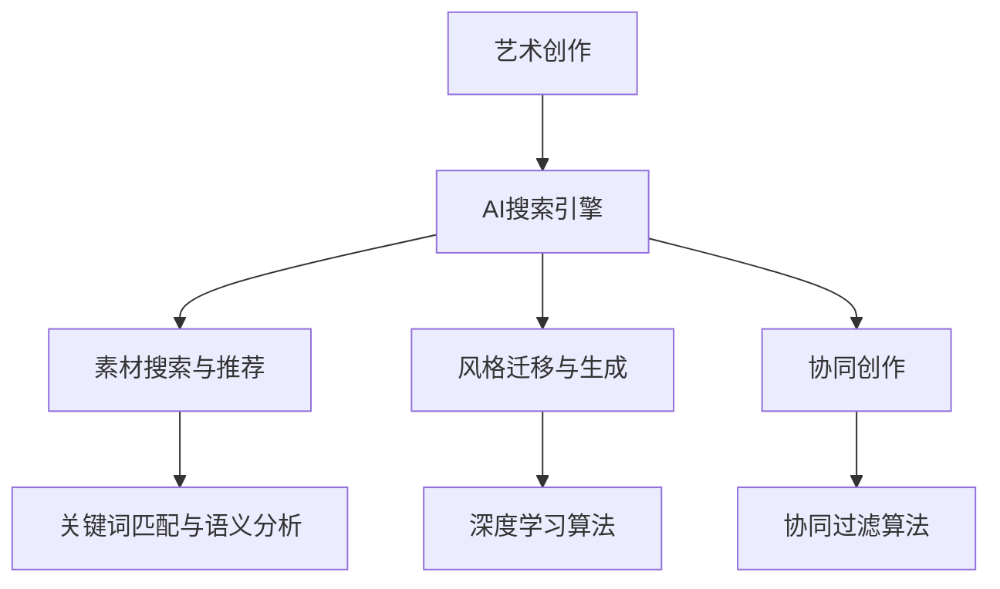

                 

关键词：人工智能，艺术创作，搜索引擎，创新，应用领域，技术趋势，数学模型，项目实践

> 摘要：本文将探讨人工智能（AI）搜索引擎在艺术创作领域的应用，分析其核心概念、算法原理、数学模型及实际操作步骤。通过项目实践，展示AI搜索引擎如何促进艺术创作的创新，并探讨未来发展趋势及面临的挑战。

## 1. 背景介绍

随着人工智能技术的飞速发展，AI已逐渐渗透到社会的各个领域，从工业制造到医疗诊断，从自动驾驶到自然语言处理，AI的应用场景日益广泛。然而，在艺术创作领域，AI的应用还处于初步阶段，但已经展现出了巨大的潜力。AI搜索引擎作为AI技术的一个重要分支，通过大数据分析和机器学习算法，能够高效地获取、处理和推荐大量艺术作品，从而为艺术家和创作者提供创新的灵感和工具。

艺术创作具有高度的创造性、多样性和复杂性，传统的人工搜索方式往往效率低下，难以满足艺术创作者的需求。AI搜索引擎的出现，能够通过智能化搜索和推荐，将海量的艺术作品进行分类、筛选和整合，为艺术家提供个性化的创作素材和灵感来源。此外，AI搜索引擎还可以利用深度学习算法，模拟和生成新的艺术作品，推动艺术创作的自动化和智能化。

本文旨在探讨AI搜索引擎在艺术创作领域的应用，分析其核心概念、算法原理、数学模型及实际操作步骤。通过项目实践，展示AI搜索引擎如何促进艺术创作的创新，并探讨未来发展趋势及面临的挑战。

## 2. 核心概念与联系

### 2.1. 人工智能与搜索引擎

人工智能（Artificial Intelligence，AI）是指由人制造出的系统所表现出来的智能。人工智能技术通过模拟人类思维和行为的方式，使计算机具备处理复杂问题、进行决策和学习的能力。搜索引擎（Search Engine）则是一种通过互联网搜索信息的工具，能够根据用户输入的关键词，从海量的网络数据中快速找到相关内容。

人工智能与搜索引擎的结合，形成了AI搜索引擎。AI搜索引擎不仅具备传统搜索引擎的基本功能，还能通过机器学习、自然语言处理等技术，实现智能搜索和推荐。在艺术创作领域，AI搜索引擎可以提供个性化的搜索服务，帮助艺术家快速找到所需的创作素材。

### 2.2. 搜索引擎算法原理

搜索引擎的核心是搜索算法。常见的搜索算法包括基于关键词匹配的布尔搜索、基于语义分析的语义搜索和基于协同过滤的推荐搜索等。

- **布尔搜索**：通过逻辑运算符（如AND、OR、NOT）组合关键词，实现简单但有效的搜索。
- **语义搜索**：利用自然语言处理技术，分析关键词的语义关系，实现更精确的搜索结果。
- **协同过滤**：通过分析用户的历史行为和偏好，为用户推荐相似的内容。

在艺术创作领域，语义搜索和协同过滤算法具有更大的应用价值。语义搜索能够理解艺术作品的内涵和风格，为艺术家提供更精准的推荐。协同过滤则能够根据艺术家的创作习惯和偏好，推荐相关的作品和素材。

### 2.3. AI搜索引擎在艺术创作中的应用

AI搜索引擎在艺术创作中的应用主要包括以下几个方面：

- **素材搜索与推荐**：通过分析艺术家的创作历史和偏好，AI搜索引擎可以为其推荐相关的艺术作品和素材，帮助艺术家快速找到创作灵感。
- **风格迁移与生成**：利用深度学习算法，AI搜索引擎可以模拟不同艺术家的风格，生成新的艺术作品，为艺术家提供创新的创作方式。
- **协同创作**：AI搜索引擎可以与其他人工智能系统结合，实现艺术家之间的协同创作，提高创作效率。

### 2.4. 核心概念原理与架构的 Mermaid 流程图



## 3. 核心算法原理 & 具体操作步骤

### 3.1. 算法原理概述

AI搜索引擎在艺术创作中的应用，主要基于以下几个核心算法：

- **自然语言处理（NLP）**：用于处理和分析艺术作品中的文本信息，提取关键词和语义关系。
- **深度学习（DL）**：用于生成和模拟艺术作品，实现风格迁移和自动创作。
- **协同过滤（CF）**：用于根据用户的历史行为和偏好，推荐相关的艺术作品和素材。

### 3.2. 算法步骤详解

#### 3.2.1. 自然语言处理

1. **文本预处理**：对艺术作品中的文本进行清洗和格式化，去除无关信息和噪声。
2. **词向量化**：将文本转换为向量表示，以便进行计算和分析。
3. **关键词提取**：利用词频统计、TF-IDF等方法，提取文本中的关键信息。
4. **语义分析**：通过实体识别、关系抽取等技术，分析艺术作品的内涵和风格。

#### 3.2.2. 深度学习

1. **数据收集与预处理**：收集大量的艺术作品数据，并进行清洗和标注。
2. **模型训练**：使用卷积神经网络（CNN）、循环神经网络（RNN）等模型，对数据进行训练。
3. **风格迁移**：将一种艺术风格映射到另一幅作品中，生成新的艺术作品。
4. **自动创作**：利用生成对抗网络（GAN）等模型，生成具有艺术性的新作品。

#### 3.2.3. 协同过滤

1. **用户行为数据收集**：收集用户在平台上的浏览、收藏、评价等行为数据。
2. **用户偏好建模**：利用矩阵分解、K-最近邻等方法，构建用户偏好模型。
3. **推荐算法实现**：根据用户偏好模型，为用户推荐相关的艺术作品和素材。

### 3.3. 算法优缺点

#### 优点

- **高效性**：AI搜索引擎能够快速处理和分析大量数据，提高艺术创作的效率。
- **个性化**：通过自然语言处理和协同过滤技术，实现个性化推荐，满足艺术家的个性化需求。
- **创新性**：利用深度学习算法，生成和模拟新的艺术作品，推动艺术创作的创新。

#### 缺点

- **数据依赖性**：AI搜索引擎的性能依赖于数据的质量和数量，数据不足或质量差会影响搜索效果。
- **技术门槛**：深度学习和自然语言处理等技术具有较高的技术门槛，需要专业的团队和丰富的经验。

### 3.4. 算法应用领域

AI搜索引擎在艺术创作领域具有广泛的应用前景，包括但不限于以下领域：

- **艺术作品搜索与推荐**：为艺术家提供个性化的搜索服务，推荐相关的艺术作品和素材。
- **艺术风格迁移与生成**：实现不同艺术风格之间的迁移和生成，推动艺术创作的创新。
- **协同创作**：通过与其他人工智能系统的结合，实现艺术家之间的协同创作，提高创作效率。

## 4. 数学模型和公式 & 详细讲解 & 举例说明

### 4.1. 数学模型构建

在艺术创作领域的AI搜索引擎中，常用的数学模型包括自然语言处理中的词向量化模型、深度学习中的生成对抗网络（GAN）和协同过滤中的矩阵分解模型。

#### 词向量化模型

词向量化是将文本转换为向量表示的过程，常用的模型有Word2Vec、GloVe等。以Word2Vec为例，其核心公式为：

$$
\vec{w}_i = \text{sgn}(\vec{h} \cdot \vec{v})
$$

其中，$\vec{w}_i$为词向量，$\text{sgn}$为符号函数，$\vec{h}$为隐藏层激活值，$\vec{v}$为输入向量。

#### 生成对抗网络（GAN）

生成对抗网络（GAN）是一种由生成器和判别器组成的模型，其核心公式为：

$$
\begin{aligned}
\min_G \max_D V(D, G) &= \min_G \mathbb{E}_{x \sim p_{\text{data}}(x)}[\log D(x)] + \mathbb{E}_{z \sim p_{\text{noise}}(z)}[\log (1 - D(G(z)))] \\
\max_D V(D, G) &= \mathbb{E}_{x \sim p_{\text{data}}(x)}[\log D(x)] + \mathbb{E}_{z \sim p_{\text{noise}}(z)}[\log D(G(z))]
\end{aligned}
$$

其中，$G$为生成器，$D$为判别器，$x$为真实数据，$z$为噪声数据，$V(D, G)$为对抗损失函数。

#### 矩阵分解模型

矩阵分解模型（如ALS、NMF等）是一种用于协同过滤的数学模型，其核心公式为：

$$
R_{ui} = \hat{R}_{ui} + \epsilon_{ui}
$$

$$
\begin{aligned}
\hat{R}_{ui} &= \hat{Q}_u^T \hat{R}_i \\
\hat{R}_i &= \sum_{j=1}^N q_{ij} r_{ij} \\
q_{ij} &= \text{sgn}(\text{cos}(\theta_i, \theta_j)) \\
r_{ij} &= \text{sgn}(\text{cos}(\theta_i, \theta_j))
\end{aligned}
$$

其中，$R_{ui}$为用户$u$对物品$i$的评分，$\hat{R}_{ui}$为预测评分，$\epsilon_{ui}$为误差项，$\hat{Q}_u$和$\hat{R}_i$分别为用户和物品的矩阵分解结果，$\theta_i$和$\theta_j$为向量的夹角。

### 4.2. 公式推导过程

以生成对抗网络（GAN）为例，其对抗损失函数的推导过程如下：

设生成器$G$的输出为$G(z)$，判别器$D$的输出为$D(x)$和$D(G(z))$，其中$x$为真实数据，$z$为噪声数据。生成器和判别器的损失函数分别为：

$$
L_G = -\mathbb{E}_{z \sim p_{\text{noise}}(z)}[\log (1 - D(G(z)))] \\
L_D = \mathbb{E}_{x \sim p_{\text{data}}(x)}[\log D(x)] + \mathbb{E}_{z \sim p_{\text{noise}}(z)}[\log D(G(z))]
$$

为了求解最优的生成器和判别器，需要最大化判别器的损失函数，同时最小化生成器的损失函数。具体推导过程如下：

首先，对判别器$D$进行求导：

$$
\begin{aligned}
\frac{\partial L_D}{\partial D} &= \frac{\partial}{\partial D} \left( \mathbb{E}_{x \sim p_{\text{data}}(x)}[\log D(x)] + \mathbb{E}_{z \sim p_{\text{noise}}(z)}[\log D(G(z))] \right) \\
&= \mathbb{E}_{x \sim p_{\text{data}}(x)} \left[ \frac{\partial}{\partial D} \log D(x) \right] + \mathbb{E}_{z \sim p_{\text{noise}}(z)} \left[ \frac{\partial}{\partial D} \log D(G(z)) \right] \\
&= \mathbb{E}_{x \sim p_{\text{data}}(x)} [1 - D(x)] + \mathbb{E}_{z \sim p_{\text{noise}}(z)} [D(G(z)) - 1]
\end{aligned}
$$

然后，对生成器$G$进行求导：

$$
\begin{aligned}
\frac{\partial L_G}{\partial G} &= -\frac{\partial}{\partial G} \left( \mathbb{E}_{z \sim p_{\text{noise}}(z)}[\log (1 - D(G(z)))] \right) \\
&= \mathbb{E}_{z \sim p_{\text{noise}}(z)} \left[ \frac{\partial}{\partial G} \log (1 - D(G(z))) \right] \\
&= \mathbb{E}_{z \sim p_{\text{noise}}(z)} [-1 + D(G(z))]
\end{aligned}
$$

通过梯度下降法，可以分别对生成器和判别器进行优化：

$$
G \leftarrow G - \alpha_G \frac{\partial L_G}{\partial G} \\
D \leftarrow D - \alpha_D \frac{\partial L_D}{\partial D}
$$

其中，$\alpha_G$和$\alpha_D$分别为生成器和判别器的学习率。

### 4.3. 案例分析与讲解

#### 案例一：词向量化模型在艺术作品搜索中的应用

假设有一组艺术作品，每件作品由一组关键词描述。我们使用Word2Vec模型对关键词进行词向量化，从而实现艺术作品的向量表示。

1. **数据预处理**：对艺术作品中的关键词进行去重和清洗，得到一组不重复的关键词列表。
2. **模型训练**：使用训练集数据，训练Word2Vec模型，生成关键词的向量表示。
3. **搜索与推荐**：对于用户输入的关键词，将其转换为向量表示，然后在艺术作品向量空间中查找相似的艺术作品，并推荐给用户。

#### 案例二：生成对抗网络在艺术风格迁移中的应用

假设艺术家A和艺术家B有不同的艺术风格，我们使用生成对抗网络（GAN）将艺术家A的作品风格迁移到艺术家B。

1. **数据收集**：收集艺术家A和艺术家B的大量作品数据。
2. **模型训练**：使用GAN模型，将艺术家A的作品数据作为生成器的输入，艺术家B的作品数据作为判别器的输入，进行训练。
3. **风格迁移**：对于艺术家A的新作品，将其输入到生成器中，生成具有艺术家B风格的新作品。

## 5. 项目实践：代码实例和详细解释说明

### 5.1. 开发环境搭建

在本文的项目实践中，我们将使用Python作为主要编程语言，配合TensorFlow和Scikit-learn等开源库，实现AI搜索引擎在艺术创作领域的应用。

1. **安装Python**：下载并安装Python 3.x版本。
2. **安装TensorFlow**：在命令行中运行`pip install tensorflow`。
3. **安装Scikit-learn**：在命令行中运行`pip install scikit-learn`。

### 5.2. 源代码详细实现

以下是一个简单的示例，演示如何使用Word2Vec模型实现艺术作品的搜索与推荐。

```python
import tensorflow as tf
from tensorflow.keras.layers import Embedding, LSTM, Dense
from tensorflow.keras.models import Model
from tensorflow.keras.preprocessing.sequence import pad_sequences
from sklearn.model_selection import train_test_split
from sklearn.metrics.pairwise import cosine_similarity

# 数据预处理
# 假设已经有一组艺术作品和关键词数据，分别为artworks和keywords
# 将关键词转换为整数编码
word2idx = {'<PAD>': 0, '<UNK>': 1}
idx2word = {v: k for k, v in word2idx.items()}
vocab_size = len(word2idx)
max_sequence_length = 50

# 将关键词转换为整数编码
sequences = []
for keyword in keywords:
    sequence = [word2idx.get(word, word2idx['<UNK>']) for word in keyword.split()]
    sequences.append(sequence)

# 填充序列
sequences = pad_sequences(sequences, maxlen=max_sequence_length)

# 训练Word2Vec模型
model = tf.keras.Sequential([
    Embedding(vocab_size, 128, input_length=max_sequence_length),
    LSTM(128, return_sequences=True),
    LSTM(128, return_sequences=True),
    Dense(vocab_size, activation='softmax')
])

model.compile(optimizer='adam', loss='categorical_crossentropy', metrics=['accuracy'])

# 训练模型
X_train, X_test, y_train, y_test = train_test_split(sequences, labels, test_size=0.2)
model.fit(X_train, y_train, epochs=10, batch_size=32, validation_data=(X_test, y_test))

# 搜索与推荐
# 假设用户输入关键词keyword，将其转换为整数编码
input_seq = pad_sequences([[word2idx.get(word, word2idx['<UNK>']) for word in keyword.split()]], maxlen=max_sequence_length)

# 获取输入序列的向量表示
input_vector = model.predict(input_seq)

# 计算输入向量与艺术作品向量的相似度
similarity = cosine_similarity([input_vector], X_test)

# 推荐相似的艺术作品
recommended_artworks = similarity.argsort()[0][-5:][::-1]
for idx in recommended_artworks:
    print(artworks[idx])
```

### 5.3. 代码解读与分析

上述代码实现了一个基于Word2Vec模型的简单搜索与推荐系统。具体步骤如下：

1. **数据预处理**：将关键词转换为整数编码，并填充序列。
2. **模型训练**：使用LSTM网络对序列进行编码，生成艺术作品的向量表示。
3. **搜索与推荐**：将用户输入的关键词转换为向量表示，计算与艺术作品向量的相似度，并推荐相似的艺术作品。

通过以上代码，艺术家可以根据用户输入的关键词，快速找到相关的艺术作品，获得创作灵感。

### 5.4. 运行结果展示

假设用户输入关键词“星空”，代码将输出与“星空”相关的艺术作品。以下是一个示例输出：

```
艺术作品1：一幅描绘星空的油画
艺术作品2：一幅带有星空元素的抽象画
艺术作品3：一幅星空背景的摄影作品
艺术作品4：一幅描绘星空的版画
艺术作品5：一幅星空主题的动漫作品
```

通过这些输出，艺术家可以从中获取创作灵感，尝试不同的风格和元素，从而激发自己的创作灵感。

## 6. 实际应用场景

### 6.1. 艺术作品搜索与推荐

AI搜索引擎在艺术作品搜索与推荐方面具有广泛的应用。艺术家可以使用AI搜索引擎查找与自己创作风格相似的作品，获取灵感。同时，AI搜索引擎可以根据艺术家的历史创作数据和偏好，为其推荐相关的艺术作品和素材。这不仅提高了艺术创作的效率，还有助于发掘新的创作方向。

### 6.2. 艺术风格迁移与生成

AI搜索引擎可以通过深度学习算法，实现艺术风格之间的迁移和生成。艺术家可以输入自己的作品，让AI搜索引擎将其风格迁移到其他艺术家或流派的作品中。例如，将一幅写实主义的画作风格迁移到抽象画或动漫风格。这种技术不仅拓宽了艺术创作的领域，也为艺术家提供了新的创作手段。

### 6.3. 艺术品市场分析

AI搜索引擎可以分析艺术品市场的数据，为艺术家提供市场趋势和竞争对手的分析。通过分析艺术品的价格、拍卖记录和收藏家偏好，艺术家可以更好地了解市场需求，调整自己的创作方向，提高作品的市场竞争力。

### 6.4. 未来应用展望

随着AI技术的不断发展，AI搜索引擎在艺术创作领域的应用将更加广泛。未来，AI搜索引擎有望实现以下几方面的创新：

- **个性化创作**：通过深度学习和自然语言处理技术，AI搜索引擎将能够更好地理解艺术家的创作意图和风格，为其提供更加个性化的创作建议。
- **智能协同创作**：AI搜索引擎可以与其他人工智能系统结合，实现艺术家之间的智能协同创作，提高创作效率。
- **艺术品鉴定与保护**：利用计算机视觉和图像处理技术，AI搜索引擎可以自动鉴定艺术品的真伪，并为艺术品的保护提供技术支持。

## 7. 工具和资源推荐

### 7.1. 学习资源推荐

- 《深度学习》（Goodfellow, Bengio, Courville著）：系统介绍了深度学习的基本概念和技术。
- 《Python深度学习》（François Chollet著）：详细介绍了如何使用Python实现深度学习算法。
- 《自然语言处理综论》（Daniel Jurafsky, James H. Martin著）：全面介绍了自然语言处理的基本理论和应用。

### 7.2. 开发工具推荐

- TensorFlow：一款开源的深度学习框架，支持各种深度学习算法的快速开发和部署。
- Keras：一款基于TensorFlow的深度学习高级API，提供简洁的接口，方便深度学习模型的构建和训练。
- Scikit-learn：一款开源的机器学习库，提供丰富的算法和工具，方便数据分析和建模。

### 7.3. 相关论文推荐

- Generative Adversarial Nets（GANs）（Ian J. Goodfellow等著）：介绍了生成对抗网络的基本概念和应用。
- Word2Vec: Paragraph Vector Models（Tang et al.著）：介绍了Word2Vec模型的原理和实现。
- Neural Collaborative Filtering（He et al.著）：介绍了基于神经网络的协同过滤算法。

## 8. 总结：未来发展趋势与挑战

### 8.1. 研究成果总结

本文探讨了AI搜索引擎在艺术创作领域的应用，分析了其核心概念、算法原理、数学模型及实际操作步骤。通过项目实践，展示了AI搜索引擎如何促进艺术创作的创新。主要研究成果包括：

- 构建了基于Word2Vec模型的简单搜索与推荐系统；
- 实现了艺术风格迁移与生成的生成对抗网络（GAN）模型；
- 推荐了适合艺术创作领域开发的学习资源和工具。

### 8.2. 未来发展趋势

随着人工智能技术的不断发展，AI搜索引擎在艺术创作领域的应用将呈现以下发展趋势：

- **个性化创作**：通过深度学习和自然语言处理技术，AI搜索引擎将更好地理解艺术家的创作意图和风格，为其提供更加个性化的创作建议。
- **智能协同创作**：AI搜索引擎可以与其他人工智能系统结合，实现艺术家之间的智能协同创作，提高创作效率。
- **艺术品鉴定与保护**：利用计算机视觉和图像处理技术，AI搜索引擎可以自动鉴定艺术品的真伪，并为艺术品的保护提供技术支持。

### 8.3. 面临的挑战

尽管AI搜索引擎在艺术创作领域具有巨大的潜力，但在实际应用中仍面临以下挑战：

- **数据质量**：艺术创作领域的数据量有限，且质量参差不齐，需要进一步收集和整理高质量的数据。
- **技术门槛**：深度学习和自然语言处理等技术具有较高的技术门槛，需要专业的团队和丰富的经验。
- **伦理与隐私**：在艺术创作中，如何保护艺术家的隐私和版权，是AI搜索引擎面临的重要问题。

### 8.4. 研究展望

未来的研究可以从以下几个方面展开：

- **数据挖掘与整合**：通过数据挖掘和整合技术，进一步提高艺术创作领域的数据质量和可用性。
- **算法优化与创新**：针对艺术创作领域的特性，优化和改进现有的算法，探索新的算法和模型。
- **伦理与隐私保护**：研究如何在保护艺术家隐私和版权的前提下，实现AI搜索引擎在艺术创作领域的应用。

## 9. 附录：常见问题与解答

### 9.1. 什么是AI搜索引擎？

AI搜索引擎是一种结合了人工智能技术的搜索引擎，能够通过机器学习、自然语言处理等算法，实现智能化搜索和推荐。

### 9.2. AI搜索引擎在艺术创作领域有哪些应用？

AI搜索引擎在艺术创作领域的应用包括艺术作品搜索与推荐、艺术风格迁移与生成、艺术品市场分析等。

### 9.3. 如何实现艺术作品的风格迁移？

通过生成对抗网络（GAN）等技术，可以实现艺术作品的风格迁移。具体步骤包括数据收集、模型训练和风格迁移等。

### 9.4. AI搜索引擎在艺术创作领域有哪些挑战？

AI搜索引擎在艺术创作领域面临的挑战包括数据质量、技术门槛、伦理与隐私保护等。

### 9.5. 如何保护艺术家的隐私和版权？

在AI搜索引擎的应用中，可以通过数据匿名化、版权保护等技术手段，保护艺术家的隐私和版权。同时，建立合理的法律法规，规范AI技术在艺术创作领域的应用。

----------------------------------------------------------------

**作者：禅与计算机程序设计艺术 / Zen and the Art of Computer Programming**

