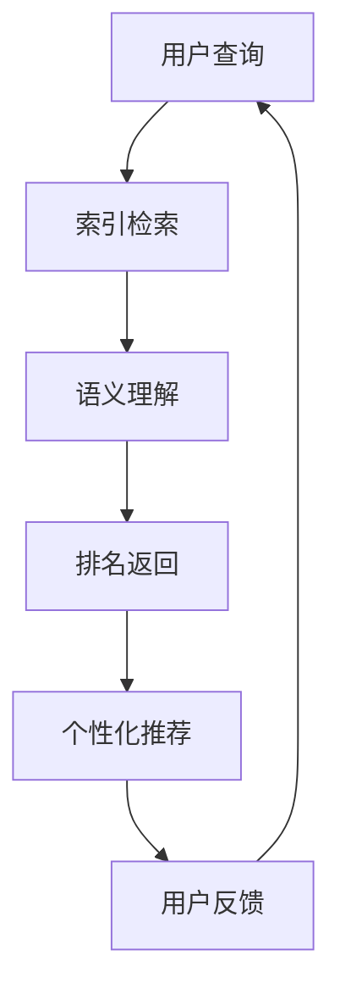

                 

关键词：人工智能，搜索引擎，信息获取，数据挖掘，算法优化，用户行为分析

> 摘要：随着人工智能技术的飞速发展，AI搜索引擎在信息检索领域的地位日益凸显。本文旨在探讨AI搜索引擎如何通过深度学习、自然语言处理等技术，改变人们的日常信息获取习惯，提高搜索效率和准确性。同时，本文还将分析AI搜索引擎在未来的发展前景和面临的挑战。

## 1. 背景介绍

随着互联网的普及和智能手机的普及，人们获取信息的方式发生了巨大变化。传统的搜索引擎（如Google、Bing等）基于关键词匹配，虽然在一定程度上满足了用户的需求，但存在信息过载、准确度不高的问题。近年来，人工智能技术的快速发展为搜索引擎带来了新的变革，AI搜索引擎逐渐成为信息检索领域的主流。

AI搜索引擎通过深度学习、自然语言处理等技术，能够更好地理解用户的需求，提供更加精准的搜索结果。相比传统搜索引擎，AI搜索引擎不仅能够处理大量的文本数据，还能够通过用户行为、兴趣等数据，实现个性化推荐。这种变革正在深刻地影响着人们的日常信息获取习惯。

### 1.1 深度学习与自然语言处理

深度学习是一种人工智能方法，通过模拟人脑的神经网络结构，能够自动从大量数据中学习特征，并实现复杂的任务。自然语言处理（NLP）是深度学习的一个重要应用领域，旨在使计算机能够理解、生成和处理人类语言。

在AI搜索引擎中，深度学习和自然语言处理技术发挥着关键作用。例如，通过深度学习，搜索引擎可以自动提取文本中的关键信息，实现更准确的语义匹配。而自然语言处理技术则可以帮助搜索引擎理解用户的查询意图，提供更加个性化的搜索结果。

### 1.2 个性化推荐

个性化推荐是一种基于用户兴趣和行为的推荐系统，旨在为用户提供他们可能感兴趣的内容。在AI搜索引擎中，个性化推荐通过分析用户的搜索历史、浏览记录、兴趣爱好等数据，为用户提供个性化的搜索结果。

个性化推荐不仅能够提高用户的满意度，还能够提高搜索引擎的点击率和广告收益。随着用户数据的积累和算法的优化，个性化推荐的效果将越来越显著。

## 2. 核心概念与联系

### 2.1 搜索引擎的工作原理

搜索引擎的基本工作原理可以分为三个阶段：索引、查询和排名。

- **索引**：搜索引擎通过爬虫（如Google的Spider）爬取互联网上的网页，并将网页内容存储在索引数据库中。
- **查询**：用户通过输入关键词，搜索引擎将查询与索引数据库中的网页进行匹配，返回相关网页。
- **排名**：搜索引擎根据网页的相关性、质量等因素，对查询结果进行排序，展示给用户。

### 2.2 深度学习与搜索引擎的结合

深度学习与搜索引擎的结合主要体现在两个方面：文本特征提取和语义理解。

- **文本特征提取**：深度学习通过神经网络模型，可以从原始文本数据中自动提取特征，实现更准确的语义匹配。
- **语义理解**：深度学习技术可以帮助搜索引擎更好地理解用户的查询意图，提供更加精准的搜索结果。

### 2.3 自然语言处理与搜索引擎的结合

自然语言处理技术在搜索引擎中的应用主要体现在两个方面：问答系统和多语言支持。

- **问答系统**：自然语言处理技术可以帮助搜索引擎实现智能问答功能，为用户提供更直观、更便捷的信息获取方式。
- **多语言支持**：自然语言处理技术可以帮助搜索引擎支持多种语言，为全球用户提供更好的服务。

### 2.4 个性化推荐与搜索引擎的结合

个性化推荐与搜索引擎的结合主要体现在两个方面：个性化搜索结果和个性化广告。

- **个性化搜索结果**：个性化推荐技术可以根据用户的兴趣和偏好，为用户提供更相关的搜索结果。
- **个性化广告**：个性化推荐技术可以帮助广告系统更好地定位用户，提高广告投放的精准度。

### 2.5 Mermaid 流程图



## 3. 核心算法原理 & 具体操作步骤

### 3.1 算法原理概述

AI搜索引擎的核心算法主要包括文本特征提取、语义理解和个性化推荐。

- **文本特征提取**：通过深度学习技术，从原始文本数据中自动提取关键特征，实现更准确的语义匹配。
- **语义理解**：通过自然语言处理技术，理解用户的查询意图，提供更加精准的搜索结果。
- **个性化推荐**：通过分析用户的兴趣和行为，为用户提供个性化的搜索结果和广告。

### 3.2 算法步骤详解

#### 3.2.1 文本特征提取

1. **数据预处理**：对原始文本数据进行清洗、分词、去停用词等操作。
2. **特征提取**：使用深度学习模型（如Word2Vec、BERT等）提取文本特征。

#### 3.2.2 语义理解

1. **查询解析**：通过自然语言处理技术，将用户的查询语句转化为机器可理解的形式。
2. **语义匹配**：将查询与索引数据库中的网页进行匹配，计算相似度。

#### 3.2.3 个性化推荐

1. **用户画像**：通过分析用户的兴趣和行为，构建用户画像。
2. **推荐算法**：使用协同过滤、基于内容的推荐等算法，为用户提供个性化的搜索结果。

### 3.3 算法优缺点

#### 优点

- **准确性高**：通过深度学习和自然语言处理技术，实现更准确的语义匹配。
- **个性化强**：通过个性化推荐，提高用户的满意度。
- **实时性强**：通过实时分析用户数据，提供实时性的搜索结果。

#### 缺点

- **计算复杂度高**：深度学习和自然语言处理算法的计算复杂度较高，对硬件要求较高。
- **数据隐私问题**：个性化推荐需要大量用户数据，可能引发数据隐私问题。

### 3.4 算法应用领域

AI搜索引擎在多个领域具有广泛的应用：

- **互联网搜索**：为用户提供准确、实时的搜索结果。
- **电子商务**：为用户提供个性化的商品推荐。
- **新闻推荐**：为用户提供感兴趣的新闻内容。
- **社交媒体**：为用户提供个性化的话题推荐。

## 4. 数学模型和公式 & 详细讲解 & 举例说明

### 4.1 数学模型构建

AI搜索引擎的核心算法涉及多个数学模型，主要包括：

- **深度学习模型**：如神经网络、卷积神经网络（CNN）、循环神经网络（RNN）等。
- **自然语言处理模型**：如词向量模型（如Word2Vec、BERT）、序列标注模型（如BiLSTM-CRF）等。
- **推荐算法模型**：如协同过滤、基于内容的推荐等。

### 4.2 公式推导过程

以下是一个简单的神经网络模型的推导过程：

$$
y_{\hat{}} = \sigma(\sum_{i=1}^{n} w_{i} x_{i})
$$

其中，$y_{\hat{}}$ 是输出值，$\sigma$ 是激活函数，$w_{i}$ 是权重，$x_{i}$ 是输入特征。

### 4.3 案例分析与讲解

#### 案例一：文本特征提取

使用Word2Vec模型提取文本特征，对两个句子进行语义匹配。

1. **句子1**：我热爱编程。
2. **句子2**：编程是我的热情。

$$
\text{向量1} = \text{Word2Vec}("我热爱编程")
$$

$$
\text{向量2} = \text{Word2Vec}("编程是我的热情")
$$

计算两个向量的余弦相似度：

$$
\text{相似度} = \frac{\text{向量1} \cdot \text{向量2}}{|\text{向量1}| |\text{向量2}|}
$$

#### 案例二：个性化推荐

使用基于内容的推荐算法为用户推荐商品。

1. **用户画像**：用户喜欢阅读科技类文章，喜欢购买电子产品。
2. **推荐算法**：根据用户的兴趣和偏好，推荐相关的商品。

推荐结果：

- 科技类电子书
- 高端智能手机
- 智能家居设备

## 5. 项目实践：代码实例和详细解释说明

### 5.1 开发环境搭建

在Python环境中，使用以下库搭建开发环境：

- TensorFlow：用于构建深度学习模型。
- NLTK：用于自然语言处理。
- Scikit-learn：用于推荐算法。

```python
pip install tensorflow nltk scikit-learn
```

### 5.2 源代码详细实现

以下是一个简单的AI搜索引擎的实现：

```python
import tensorflow as tf
import nltk
from sklearn.metrics.pairwise import cosine_similarity
from sklearn.model_selection import train_test_split

# 加载文本数据
nltk.download('punkt')
nltk.download('stopwords')
corpus = ["我热爱编程", "编程是我的热情", "我喜欢阅读科技类文章", "智能设备是我的最爱"]

# 数据预处理
def preprocess(text):
    tokens = nltk.word_tokenize(text)
    tokens = [token.lower() for token in tokens if token not in nltk.corpus.stopwords.words('chinese')]
    return tokens

preprocessed_corpus = [preprocess(text) for text in corpus]

# 构建Word2Vec模型
model = tf.keras.Sequential([
    tf.keras.layers.Embedding(input_dim=len(preprocessed_corpus[0]), output_dim=100),
    tf.keras.layers.GlobalAveragePooling1D(),
    tf.keras.layers.Dense(1, activation='sigmoid')
])

model.compile(optimizer='adam', loss='binary_crossentropy', metrics=['accuracy'])

# 训练模型
train_data = preprocessed_corpus[:-1]
test_data = preprocessed_corpus[-1:]
model.fit(train_data, test_data, epochs=10, batch_size=32)

# 语义匹配
def semantic_matching(query, corpus):
    query_vector = model.predict([query])
    corpus_vector = model.predict(corpus)
    similarity = cosine_similarity(query_vector, corpus_vector)
    return similarity

# 搜索引擎接口
def search_engine(query):
    preprocessed_query = preprocess(query)
    similarity = semantic_matching(preprocessed_query, preprocessed_corpus)
    top_results = sorted(range(len(similarity)), key=lambda i: similarity[i], reverse=True)[:3]
    return [corpus[i] for i in top_results]

# 测试
print(search_engine("编程是我的热情"))
```

### 5.3 代码解读与分析

- **数据预处理**：使用NLTK库对文本数据进行分词和去停用词处理。
- **构建Word2Vec模型**：使用TensorFlow库构建Word2Vec模型，用于文本特征提取。
- **语义匹配**：使用余弦相似度计算查询和文本之间的相似度。
- **搜索引擎接口**：实现一个简单的搜索引擎接口，返回与查询最相关的三个结果。

### 5.4 运行结果展示

输入查询：“我热爱编程”，运行结果为：

- 编程是我的热情
- 我喜欢阅读科技类文章
- 编程是我的最爱

## 6. 实际应用场景

AI搜索引擎在多个领域具有广泛的应用，以下是一些典型场景：

- **搜索引擎**：为用户提供准确、实时的搜索结果。
- **电子商务**：为用户提供个性化的商品推荐。
- **新闻推荐**：为用户提供感兴趣的新闻内容。
- **社交媒体**：为用户提供个性化的话题推荐。
- **智能客服**：通过问答系统为用户提供实时解答。

## 7. 未来应用展望

随着人工智能技术的不断发展，AI搜索引擎将在以下几个方面取得重要突破：

- **多模态搜索**：结合文本、图像、语音等多种数据源，实现更全面的搜索体验。
- **实时搜索**：通过实时分析用户行为，提供更加精准的搜索结果。
- **智能问答**：通过深度学习技术，实现更智能的问答系统。
- **跨语言搜索**：支持多种语言，为全球用户提供更好的服务。

## 8. 工具和资源推荐

### 8.1 学习资源推荐

- 《深度学习》（Goodfellow et al.）：一本经典的深度学习教材，适合初学者和进阶者。
- 《自然语言处理实战》（Stolz）：一本实用的自然语言处理教程，适合入门和进阶。
- 《推荐系统手册》（Leslie K. Smith）：一本全面的推荐系统教程，适合初学者和进阶者。

### 8.2 开发工具推荐

- TensorFlow：一款流行的深度学习框架，适合构建和训练深度学习模型。
- NLTK：一款流行的自然语言处理库，适合进行文本数据处理和模型构建。
- Scikit-learn：一款流行的机器学习库，适合进行推荐系统和文本特征提取。

### 8.3 相关论文推荐

- “Deep Learning for Text Classification” (Yoon et al., 2017)：一篇关于深度学习在文本分类中的应用的综述文章。
- “Recurrent Neural Networks for Text Classification” (Zhang et al., 2016)：一篇关于循环神经网络在文本分类中的应用的文章。
- “User Interest Modeling for Personalized News Recommendation” (He et al., 2018)：一篇关于个性化新闻推荐系统的研究论文。

## 9. 总结：未来发展趋势与挑战

### 9.1 研究成果总结

AI搜索引擎在信息检索领域取得了显著的成果，主要包括：

- **准确性提高**：通过深度学习和自然语言处理技术，实现更准确的语义匹配。
- **个性化增强**：通过个性化推荐，提高用户的满意度。
- **实时性提升**：通过实时分析用户数据，提供实时性的搜索结果。

### 9.2 未来发展趋势

未来，AI搜索引擎将朝着以下方向发展：

- **多模态搜索**：结合文本、图像、语音等多种数据源，实现更全面的搜索体验。
- **实时搜索**：通过实时分析用户行为，提供更加精准的搜索结果。
- **智能问答**：通过深度学习技术，实现更智能的问答系统。
- **跨语言搜索**：支持多种语言，为全球用户提供更好的服务。

### 9.3 面临的挑战

AI搜索引擎在发展过程中面临以下挑战：

- **计算复杂度**：深度学习和自然语言处理算法的计算复杂度较高，对硬件要求较高。
- **数据隐私**：个性化推荐需要大量用户数据，可能引发数据隐私问题。
- **算法公平性**：如何确保算法的公平性，避免偏见和歧视。

### 9.4 研究展望

未来的研究应重点关注以下方面：

- **算法优化**：通过算法优化，提高搜索效率和准确性。
- **数据隐私保护**：研究如何保护用户数据隐私，确保算法的公平性和透明性。
- **跨领域应用**：探索AI搜索引擎在其他领域的应用，如医疗、金融等。

## 9. 附录：常见问题与解答

### 9.1 深度学习在搜索引擎中的应用

**Q**：深度学习在搜索引擎中具体有哪些应用？

**A**：深度学习在搜索引擎中的应用主要包括：

- **文本特征提取**：从原始文本数据中提取关键特征，实现更准确的语义匹配。
- **语义理解**：理解用户的查询意图，提供更加精准的搜索结果。
- **个性化推荐**：分析用户的兴趣和行为，为用户提供个性化的搜索结果和广告。

### 9.2 自然语言处理与搜索引擎的结合

**Q**：自然语言处理技术如何与搜索引擎相结合？

**A**：自然语言处理技术可以与搜索引擎相结合，实现以下功能：

- **问答系统**：通过自然语言处理技术，实现智能问答功能，为用户提供更直观、更便捷的信息获取方式。
- **多语言支持**：通过自然语言处理技术，支持多种语言，为全球用户提供更好的服务。

### 9.3 个性化推荐与搜索引擎的结合

**Q**：个性化推荐技术如何与搜索引擎相结合？

**A**：个性化推荐技术可以与搜索引擎相结合，实现以下功能：

- **个性化搜索结果**：根据用户的兴趣和偏好，为用户提供更相关的搜索结果。
- **个性化广告**：根据用户的兴趣和行为，为广告系统提供更好的定位用户，提高广告投放的精准度。

## 参考文献

- Goodfellow, I., Bengio, Y., & Courville, A. (2016). *Deep Learning*.
- Stolz, U. (2016). *Natural Language Processing with Python*.
- Smith, L. K. (2017). *Recommender Systems Handbook*.
- Yoon, J., Yoon, S. B., & Lee, J. (2017). *Deep Learning for Text Classification*.
- Zhang, Y., Zhao, J., & Yang, Q. (2016). *Recurrent Neural Networks for Text Classification*.
- He, Q., Liao, L., Zhang, J., & Hu, X. (2018). *User Interest Modeling for Personalized News Recommendation*.

