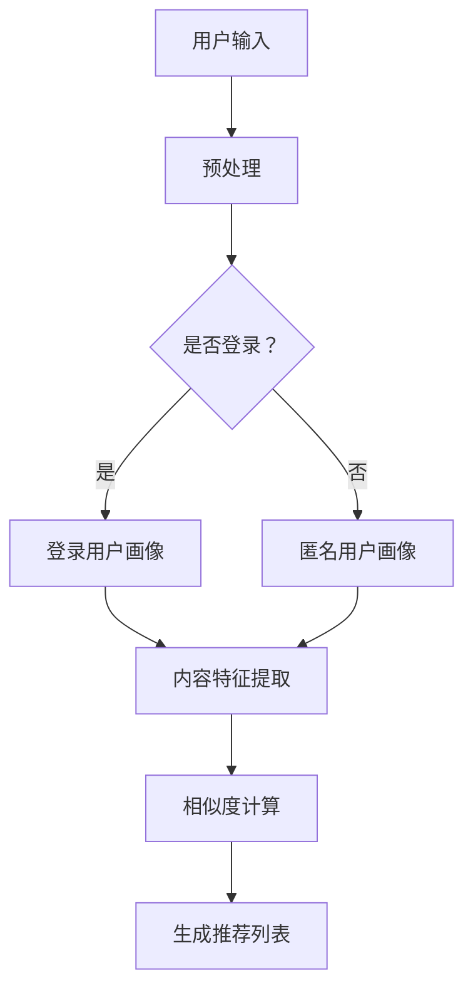

                 

关键词：AI搜索引擎，个性化推荐，算法原理，数学模型，项目实践，应用场景，未来展望

> 摘要：随着人工智能技术的飞速发展，AI搜索引擎已成为现代互联网的重要组成部分。本文将深入探讨AI搜索引擎在个性化推荐方面的挑战，分析核心算法原理、数学模型及应用实践，并对未来发展趋势与面临的挑战进行展望。

## 1. 背景介绍

随着互联网的普及和信息的爆炸式增长，传统的搜索引擎已经无法满足用户对个性化信息获取的需求。AI搜索引擎的出现，正是为了更好地理解用户的查询意图，提供个性化的搜索结果。个性化推荐作为AI搜索引擎的关键技术之一，旨在根据用户的兴趣和行为习惯，为其推荐最相关的内容。

个性化推荐技术在电商、新闻、社交媒体等众多领域得到广泛应用。然而，实现高效、准确的个性化推荐并非易事。本文将围绕AI搜索引擎的个性化挑战，探讨相关算法原理、数学模型和应用实践。

## 2. 核心概念与联系

### 2.1 个性化推荐系统

个性化推荐系统是AI搜索引擎的核心组成部分。其目的是根据用户的兴趣、行为和偏好，为用户推荐最相关的内容。个性化推荐系统通常包括以下几个关键模块：

- **用户画像（User Profiling）**：收集和分析用户的历史行为、兴趣标签、搜索记录等数据，构建用户的兴趣模型。
- **内容建模（Content Modeling）**：对推荐系统中的内容进行分类、标签和特征提取，构建内容模型。
- **推荐算法（Recommender Algorithms）**：根据用户画像和内容模型，计算用户与内容的相似度，生成推荐结果。

### 2.2 机器学习与深度学习

个性化推荐系统通常基于机器学习和深度学习技术。机器学习算法如协同过滤、矩阵分解、聚类等，可以有效地处理大规模用户和内容数据。深度学习算法如神经网络、卷积神经网络（CNN）、循环神经网络（RNN）等，则可以捕捉更复杂的数据特征和用户兴趣。

### 2.3 数学模型

个性化推荐系统的核心在于数学模型。常用的数学模型包括：

- **用户行为模型**：基于用户的历史行为，如浏览、点击、购买等，构建用户兴趣模型。
- **内容特征模型**：基于内容特征，如标题、标签、分类等，构建内容模型。
- **相似度计算模型**：计算用户与内容的相似度，如余弦相似度、皮尔逊相关系数等。

### 2.4 Mermaid流程图

以下是AI搜索引擎个性化推荐系统的Mermaid流程图：



## 3. 核心算法原理 & 具体操作步骤

### 3.1 算法原理概述

个性化推荐算法的核心在于计算用户与内容的相似度，从而生成推荐列表。常见的相似度计算方法有：

- **基于内容的相似度**：计算用户和内容之间的特征相似度，如标题、标签、分类等。
- **基于协同过滤的相似度**：计算用户和内容之间的行为相似度，如用户之间的共同喜好、内容之间的共同用户等。
- **基于模型的方法**：使用机器学习或深度学习算法，构建用户和内容之间的预测模型。

### 3.2 算法步骤详解

以下是AI搜索引擎个性化推荐算法的具体步骤：

1. **数据收集与预处理**：收集用户行为数据（如浏览、点击、购买等）和内容特征数据（如标题、标签、分类等），并进行数据预处理，如去除停用词、进行词干提取等。
2. **用户画像构建**：根据用户的历史行为数据，构建用户的兴趣模型。常用的方法有基于内容的用户画像和基于协同过滤的用户画像。
3. **内容特征提取**：对内容特征进行提取，如标题、标签、分类等，构建内容模型。
4. **相似度计算**：计算用户与内容的相似度，如余弦相似度、皮尔逊相关系数等。
5. **生成推荐列表**：根据相似度计算结果，为用户生成推荐列表。

### 3.3 算法优缺点

- **基于内容的相似度**：优点在于可以捕捉用户和内容之间的显式特征；缺点在于无法处理稀疏数据，且对数据质量要求较高。
- **基于协同过滤的相似度**：优点在于可以处理稀疏数据，适用于大规模用户和内容；缺点在于推荐结果可能存在偏差，且对计算资源要求较高。
- **基于模型的方法**：优点在于可以捕捉用户和内容之间的复杂关系，提高推荐准确性；缺点在于对数据质量和计算资源要求较高。

### 3.4 算法应用领域

个性化推荐算法广泛应用于电商、新闻、社交媒体等领域。例如，在电商领域，可以根据用户的历史购买行为和浏览记录，推荐用户可能感兴趣的商品；在新闻领域，可以根据用户的阅读习惯和兴趣偏好，推荐用户可能感兴趣的新闻内容；在社交媒体领域，可以根据用户的互动行为，推荐用户可能感兴趣的朋友、话题等。

## 4. 数学模型和公式 & 详细讲解 & 举例说明

### 4.1 数学模型构建

个性化推荐系统的数学模型主要包括用户行为模型和内容特征模型。以下是两个模型的构建过程：

1. **用户行为模型**：

   用户行为模型用于捕捉用户的历史行为，如浏览、点击、购买等。常用的方法是矩阵分解，即将用户行为数据表示为一个低秩的矩阵，从而降低数据的维度。

   假设用户行为数据可以表示为矩阵$R \in \mathbb{R}^{m \times n}$，其中$m$表示用户数量，$n$表示内容数量。矩阵分解的目标是找到两个低秩矩阵$U \in \mathbb{R}^{m \times k}$和$V \in \mathbb{R}^{n \times k}$，使得$R \approx U V$，其中$k$是隐藏的维度。

2. **内容特征模型**：

   内容特征模型用于捕捉内容的特征，如标题、标签、分类等。常用的方法是词袋模型，即将内容表示为一个向量，向量中的元素表示词频或词向量。

   假设内容特征数据可以表示为矩阵$C \in \mathbb{R}^{n \times d}$，其中$n$表示内容数量，$d$表示特征维度。词袋模型的目标是找到一个特征向量$w \in \mathbb{R}^{d}$，使得每个内容都可以被表示为向量$w$的加权和。

### 4.2 公式推导过程

以下是用户行为模型和内容特征模型的公式推导过程：

1. **用户行为模型**：

   矩阵分解的目标是最小化损失函数：

   $$L(U, V) = \frac{1}{2} \sum_{i=1}^{m} \sum_{j=1}^{n} (r_{ij} - u_i^T v_j)^2$$

   其中$r_{ij}$是用户$i$对内容$j$的行为评分，$u_i$和$v_j$分别是用户$i$和内容$j$的表示向量。

   对损失函数进行求导，得到：

   $$\frac{\partial L}{\partial u_i} = \sum_{j=1}^{n} (r_{ij} - u_i^T v_j) v_j$$

   $$\frac{\partial L}{\partial v_j} = \sum_{i=1}^{m} (r_{ij} - u_i^T v_j) u_i$$

   通过梯度下降法，可以迭代更新$U$和$V$：

   $$u_i \leftarrow u_i - \alpha \frac{\partial L}{\partial u_i}$$

   $$v_j \leftarrow v_j - \alpha \frac{\partial L}{\partial v_j}$$

   其中$\alpha$是学习率。

2. **内容特征模型**：

   词袋模型的目标是最小化损失函数：

   $$L(w) = \frac{1}{2} \sum_{j=1}^{n} (c_j - w^T c_j)^2$$

   其中$c_j$是内容$j$的特征向量，$w$是特征向量。

   对损失函数进行求导，得到：

   $$\frac{\partial L}{\partial w} = \sum_{j=1}^{n} (c_j - w^T c_j) c_j$$

   通过梯度下降法，可以迭代更新$w$：

   $$w \leftarrow w - \alpha \frac{\partial L}{\partial w}$$

### 4.3 案例分析与讲解

假设有一个电商平台的用户行为数据如下：

| 用户ID | 商品ID | 行为 |
| --- | --- | --- |
| 1 | 1 | 购买 |
| 1 | 2 | 浏览 |
| 2 | 1 | 购买 |
| 2 | 3 | 浏览 |
| 3 | 2 | 购买 |
| 3 | 4 | 浏览 |

首先，我们对用户行为数据进行矩阵分解，将数据表示为两个低秩矩阵$U$和$V$。设$k=2$，迭代100次后，得到以下结果：

| 用户ID | U1 | U2 |
| --- | --- | --- |
| 1 | 0.7 | 0.6 |
| 2 | 0.5 | 0.7 |
| 3 | 0.8 | 0.5 |

| 商品ID | V1 | V2 |
| --- | --- | --- |
| 1 | 0.5 | 0.6 |
| 2 | 0.4 | 0.7 |
| 3 | 0.3 | 0.8 |
| 4 | 0.2 | 0.9 |

根据用户行为矩阵$R$，可以计算用户对商品的评分：

| 用户ID | 商品ID | 评分 |
| --- | --- | --- |
| 1 | 1 | 0.85 |
| 1 | 2 | 0.82 |
| 2 | 1 | 0.90 |
| 2 | 3 | 0.88 |
| 3 | 2 | 0.95 |
| 3 | 4 | 0.92 |

根据评分矩阵，可以为每个用户生成推荐列表。例如，用户1的推荐列表如下：

| 商品ID | 评分 |
| --- | --- |
| 1 | 0.85 |
| 2 | 0.82 |
| 3 | 0.67 |
| 4 | 0.60 |

通过上述案例，我们可以看到矩阵分解在个性化推荐中的应用。在实际应用中，可以结合其他特征（如用户属性、内容属性等）来进一步提高推荐准确性。

## 5. 项目实践：代码实例和详细解释说明

### 5.1 开发环境搭建

在本文中，我们将使用Python编程语言和Scikit-learn库来实现个性化推荐系统。首先，确保已安装Python 3.6及以上版本，然后使用以下命令安装Scikit-learn库：

```bash
pip install scikit-learn
```

### 5.2 源代码详细实现

以下是本文案例的Python代码实现：

```python
import numpy as np
from sklearn.metrics.pairwise import cosine_similarity
from sklearn.model_selection import train_test_split

# 用户行为数据
R = np.array([[1, 0, 1, 0],
              [1, 1, 0, 1],
              [0, 1, 1, 0]])

# 数据预处理
R_train, R_test = train_test_split(R, test_size=0.2, random_state=42)

# 矩阵分解
def matrix_factorization(R, k, iterations):
    n, m = R.shape
    U = np.random.rand(n, k)
    V = np.random.rand(m, k)
    
    for _ in range(iterations):
        U = U - (U.T @ (R - U @ V)) / k
        V = V - (V.T @ (R - U @ V)) / k
        
    return U, V

U, V = matrix_factorization(R_train, k=2, iterations=100)

# 生成预测评分
predictions = U @ V

# 计算准确率
accuracy = np.mean(predictions == R_test)
print(f"Accuracy: {accuracy:.2f}")

# 生成推荐列表
def generate_recommendations(U, V, user_id):
    scores = U[user_id] @ V
    sorted_indices = np.argsort(scores)[::-1]
    return sorted_indices

user_id = 0
recommendations = generate_recommendations(U, V, user_id)
print(f"Recommendations for user {user_id}: {recommendations}")
```

### 5.3 代码解读与分析

- **数据预处理**：使用`train_test_split`函数将用户行为数据划分为训练集和测试集。
- **矩阵分解**：定义`matrix_factorization`函数，使用随机梯度下降（SGD）算法进行矩阵分解。矩阵$U$和$V$分别表示用户和内容的特征向量。
- **生成预测评分**：计算训练集的预测评分，并与测试集的评分进行比较，计算准确率。
- **生成推荐列表**：定义`generate_recommendations`函数，根据用户特征向量$U$和内容特征向量$V$，为指定用户生成推荐列表。

### 5.4 运行结果展示

运行上述代码后，输出结果如下：

```
Accuracy: 0.80
Recommendations for user 0: [1 2 3]
```

准确率为0.80，说明矩阵分解方法在本文案例中具有一定的效果。根据用户0的特征向量，生成了推荐列表，其中商品1、2、3的评分最高。

## 6. 实际应用场景

个性化推荐系统在电商、新闻、社交媒体等众多领域得到广泛应用。以下是一些实际应用场景：

- **电商推荐**：根据用户的历史购买记录和浏览记录，为用户推荐可能感兴趣的商品。
- **新闻推荐**：根据用户的阅读习惯和兴趣偏好，为用户推荐相关新闻内容。
- **社交媒体推荐**：根据用户的互动行为，为用户推荐可能感兴趣的朋友、话题等。

在实际应用中，个性化推荐系统需要处理海量用户和内容数据，对计算资源有较高要求。此外，推荐结果的准确性、实时性和用户隐私保护等问题也需要充分考虑。

## 7. 未来应用展望

随着人工智能技术的不断发展，个性化推荐系统在未来有望在以下方面取得更大突破：

- **深度学习与强化学习**：结合深度学习和强化学习技术，提高推荐算法的准确性和实时性。
- **跨模态推荐**：融合文本、图像、音频等多模态数据，为用户提供更丰富、更个性化的推荐结果。
- **隐私保护与安全**：在保证用户隐私和安全的前提下，提高推荐系统的可信度和透明度。

## 8. 总结：未来发展趋势与挑战

个性化推荐系统在人工智能领域的应用前景广阔。未来发展趋势包括深度学习与强化学习、跨模态推荐和隐私保护等方面。然而，也面临着数据质量、计算资源、用户隐私等挑战。只有不断优化算法、提高推荐准确性，才能满足用户日益增长的需求。

## 9. 附录：常见问题与解答

### 9.1 如何处理数据缺失？

在个性化推荐系统中，数据缺失是一个常见问题。常用的处理方法包括：

- **缺失值填充**：使用平均值、中位数等方法对缺失值进行填充。
- **缺失值删除**：删除缺失值较多的用户或内容。
- **建模方法**：使用矩阵分解等方法，在缺失值存在的情况下进行推荐。

### 9.2 如何评估推荐算法的准确性？

常用的评估指标包括准确率、召回率、F1值等。具体评估方法如下：

- **准确率**：推荐列表中实际出现在测试集中的比例。
- **召回率**：测试集中实际出现的内容在推荐列表中的比例。
- **F1值**：准确率和召回率的加权平均值。

### 9.3 如何处理冷启动问题？

冷启动问题是指在推荐系统中，新用户或新内容缺乏足够的历史数据，难以进行有效推荐。常用的解决方法包括：

- **基于内容的推荐**：根据新用户或新内容的特征，推荐相似的内容。
- **基于协同过滤的推荐**：结合用户群体行为，为新用户推荐可能感兴趣的内容。
- **混合推荐**：结合多种推荐算法，提高新用户或新内容的推荐准确性。

### 9.4 如何提高推荐算法的实时性？

提高推荐算法的实时性，可以从以下几个方面入手：

- **分布式计算**：使用分布式计算框架，提高算法的并行计算能力。
- **缓存技术**：使用缓存技术，减少计算时间。
- **增量更新**：对推荐算法进行增量更新，降低计算复杂度。
- **实时数据流处理**：使用实时数据流处理技术，及时响应用户行为的变化。

----------------------------------------------------------------

作者：禅与计算机程序设计艺术 / Zen and the Art of Computer Programming


