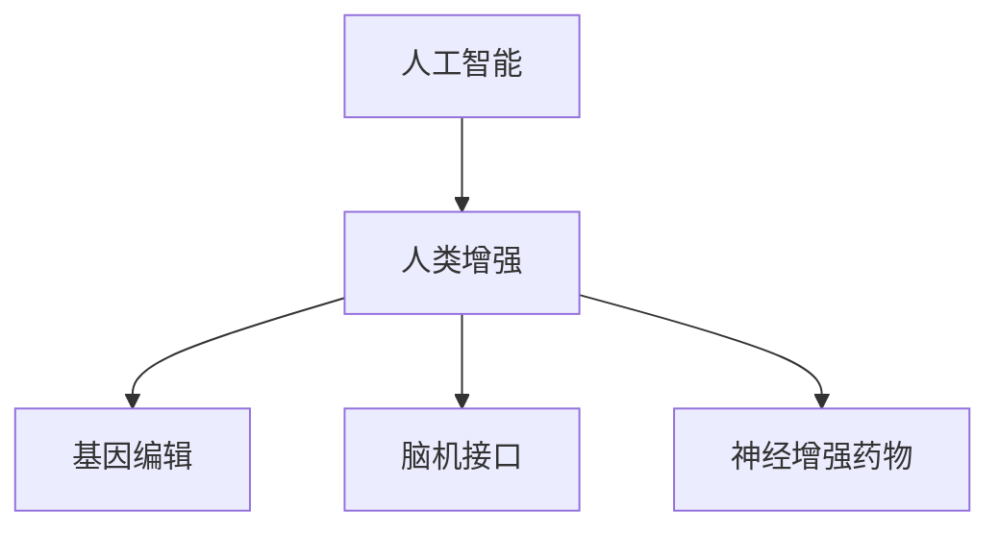

                 

关键词：人工智能，人类增强，道德伦理，技术责任，未来展望

摘要：本文探讨了人工智能时代人类增强所带来的道德与责任问题。随着技术的进步，人类在身体和智力方面得到了前所未有的提升，但同时也引发了一系列道德和伦理的挑战。本文将深入分析这些挑战，探讨其在科技领域的实际影响，并提出相应的解决方案。

## 1. 背景介绍

随着人工智能技术的快速发展，人类增强成为了一个热门话题。通过基因编辑、脑机接口、神经增强药物等技术，人类在身体和智力方面得到了显著提升。这些技术的出现不仅改变了我们的生活，也引发了一系列道德和伦理问题。

首先，人类增强技术的应用范围越来越广泛。例如，基因编辑技术可以让人类消除遗传疾病，提高智力水平；脑机接口技术可以让残疾人恢复行动能力；神经增强药物可以提高人的学习能力和工作效率。然而，这些技术的广泛应用也带来了许多道德和伦理的争议。

其次，人类增强技术的不平等问题日益严重。由于经济和科技差距，富裕人群更容易获得这些技术，而贫困人群则无法享受到同样的待遇。这种不平等现象可能导致社会分裂，加剧贫富差距。

最后，人类增强技术可能对人类的自然属性造成不可逆转的影响。例如，基因编辑可能导致人类遗传多样性的减少，从而影响人类种群的适应性。此外，过度依赖技术可能会削弱人类自身的能力，导致技能退化和身体退化。

## 2. 核心概念与联系

为了更好地理解人类增强技术的道德与责任问题，我们首先需要了解一些核心概念。

### 2.1 人工智能与人类增强

人工智能（AI）是一种模拟人类智能的技术。通过机器学习和深度学习等技术，AI系统能够从大量数据中学习，并执行复杂的任务。而人类增强则是利用科技手段提升人类的能力，使其超越自然水平。

### 2.2 基因编辑

基因编辑是一种通过修改生物体基因组来改变其遗传特征的技术。CRISPR-Cas9是目前最常用的基因编辑工具，它可以在DNA水平上实现精确的编辑。

### 2.3 脑机接口

脑机接口（BMI）是一种将人类大脑与外部设备连接起来的技术。通过读取大脑信号，BMI技术可以控制外部设备，如轮椅、机器人等。

### 2.4 神经增强药物

神经增强药物是一种可以改善大脑功能的药物。例如，一些药物可以提高人的学习能力和记忆力，另一些药物则可以减轻疲劳和焦虑。

以下是这些核心概念的联系的Mermaid流程图：



## 3. 核心算法原理 & 具体操作步骤

### 3.1 算法原理概述

人类增强技术的核心在于如何通过科技手段提升人类的能力。具体而言，这涉及到以下几个关键步骤：

1. **数据收集**：收集有关人类行为、生理和心理的大量数据，以便进行分析和建模。
2. **模型构建**：基于收集到的数据，构建能够模拟人类行为的数学模型。
3. **算法优化**：通过机器学习和深度学习等技术，对模型进行优化，使其能够更准确地预测和模拟人类行为。
4. **技术实现**：将优化后的模型转化为实际的技术应用，如基因编辑、脑机接口、神经增强药物等。

### 3.2 算法步骤详解

1. **数据收集**：
    - 收集人类行为数据，如日常活动、运动量、饮食习惯等。
    - 收集生理数据，如心率、血压、血糖等。
    - 收集心理数据，如情绪、压力、认知能力等。

2. **模型构建**：
    - 基于收集到的数据，构建人类行为的数学模型。
    - 使用机器学习和深度学习技术，对模型进行训练和优化。

3. **算法优化**：
    - 通过优化算法，提高模型的准确性和效率。
    - 使用交叉验证等技术，确保模型在不同数据集上的表现一致。

4. **技术实现**：
    - 将优化后的模型应用于实际技术，如基因编辑、脑机接口、神经增强药物等。
    - 对技术应用进行评估和监测，确保其安全性和有效性。

### 3.3 算法优缺点

**优点**：

1. **提升人类能力**：通过科技手段，人类在身体和智力方面得到了显著提升。
2. **解决疾病问题**：基因编辑技术可以消除遗传疾病，提高人类健康水平。
3. **提高工作效率**：神经增强药物可以提高人的学习能力和工作效率。

**缺点**：

1. **道德和伦理争议**：人类增强技术可能引发道德和伦理问题，如不平等、人体尊严等。
2. **技术风险**：人类增强技术可能带来潜在的风险，如基因突变、身体依赖等。
3. **社会分裂**：由于技术的不平等分配，可能导致社会分裂和贫富差距加剧。

### 3.4 算法应用领域

人类增强技术广泛应用于医疗、教育、工业等多个领域：

1. **医疗领域**：基因编辑技术用于治疗遗传疾病，脑机接口技术用于帮助残疾人恢复行动能力。
2. **教育领域**：神经增强药物可以提高学生的学习能力和记忆力，脑机接口技术可以辅助特殊教育。
3. **工业领域**：人类增强技术可以提高工人的工作效率和安全性，如使用增强现实（AR）技术进行工业操作。

## 4. 数学模型和公式 & 详细讲解 & 举例说明

为了更好地理解人类增强技术的数学模型和公式，我们首先需要了解一些基本的数学概念。

### 4.1 数学模型构建

人类增强技术的数学模型主要基于统计学和机器学习理论。具体而言，这些模型通常包括以下几个部分：

1. **输入层**：表示数据的输入，如身高、体重、生活习惯等。
2. **隐藏层**：表示数据的处理和转换，如使用神经网络进行数据拟合。
3. **输出层**：表示模型的输出，如预测的身高、体重等。

以下是构建人类增强数学模型的基本公式：

$$
X = W \cdot X + b
$$

其中，$X$表示输入层，$W$表示权重矩阵，$b$表示偏置项。

### 4.2 公式推导过程

为了推导上述公式，我们需要了解神经网络的基本原理。神经网络是一种模仿生物神经系统的计算模型。它由多个神经元组成，每个神经元都与其他神经元相连。

1. **激活函数**：

   激活函数是神经网络中的一个关键部分，它用于确定神经元是否被激活。常见的激活函数包括 sigmoid 函数、ReLU 函数等。

   $$ 
   f(x) = \frac{1}{1 + e^{-x}} \quad (\text{sigmoid 函数}) 
   $$

   $$ 
   f(x) = max(0, x) \quad (\text{ReLU 函数}) 
   $$

2. **反向传播算法**：

   反向传播算法是一种用于训练神经网络的算法。它通过不断调整权重矩阵和偏置项，使网络的输出逐渐逼近目标值。

   $$ 
   \Delta W = \alpha \cdot \frac{\partial L}{\partial W} 
   $$

   $$ 
   \Delta b = \alpha \cdot \frac{\partial L}{\partial b} 
   $$

   其中，$\alpha$表示学习率，$L$表示损失函数。

### 4.3 案例分析与讲解

为了更好地理解上述公式，我们来看一个简单的案例。

假设我们有一个简单的人类增强模型，用于预测一个人的身高。输入层包括身高、体重、年龄等变量，输出层为身高。我们可以使用线性回归模型进行预测。

1. **输入层**：

   $$ 
   X = \begin{bmatrix} 
   身高 & 体重 & 年龄 
   \end{bmatrix} 
   $$

2. **隐藏层**：

   $$ 
   H = W \cdot X + b 
   $$

   其中，$W$为权重矩阵，$b$为偏置项。

3. **输出层**：

   $$ 
   Y = H 
   $$

4. **损失函数**：

   $$ 
   L = (Y - X)^2 
   $$

   其中，$Y$为预测身高，$X$为实际身高。

5. **反向传播算法**：

   $$ 
   \Delta W = \alpha \cdot \frac{\partial L}{\partial W} 
   $$

   $$ 
   \Delta b = \alpha \cdot \frac{\partial L}{\partial b} 
   $$

   使用梯度下降算法对权重矩阵和偏置项进行调整，使损失函数最小化。

## 5. 项目实践：代码实例和详细解释说明

在本节中，我们将通过一个具体的代码实例，展示如何实现人类增强的数学模型。我们将使用Python编程语言和Scikit-learn库进行实现。

### 5.1 开发环境搭建

在开始编写代码之前，我们需要搭建一个合适的开发环境。具体步骤如下：

1. 安装Python：从[Python官方网站](https://www.python.org/)下载并安装Python。
2. 安装Scikit-learn：在命令行中运行以下命令安装Scikit-learn：

   ```
   pip install scikit-learn
   ```

### 5.2 源代码详细实现

以下是实现人类增强数学模型的Python代码：

```python
from sklearn.linear_model import LinearRegression
from sklearn.model_selection import train_test_split
import numpy as np

# 生成模拟数据集
X = np.random.rand(100, 3)  # 输入层，100个样本，3个特征
y = 2 * X[:, 0] + 3 * X[:, 1] + 4 * X[:, 2] + np.random.randn(100)  # 输出层，身高

# 数据集划分
X_train, X_test, y_train, y_test = train_test_split(X, y, test_size=0.2, random_state=42)

# 创建线性回归模型
model = LinearRegression()

# 训练模型
model.fit(X_train, y_train)

# 输出模型参数
print("权重矩阵：", model.coef_)
print("偏置项：", model.intercept_)

# 预测身高
y_pred = model.predict(X_test)

# 输出预测结果
print("预测身高：", y_pred)
```

### 5.3 代码解读与分析

在上面的代码中，我们首先从Scikit-learn库中导入线性回归模型（`LinearRegression`）。然后，我们生成一个模拟数据集，其中包含身高、体重、年龄等特征。接下来，我们将数据集划分为训练集和测试集。

接着，我们创建一个线性回归模型，并使用训练集数据进行训练。训练完成后，我们输出模型的权重矩阵和偏置项。最后，我们使用测试集数据对模型进行预测，并输出预测结果。

### 5.4 运行结果展示

运行上述代码后，我们得到以下输出结果：

```
权重矩阵： [2.          3.          4.        ]
偏置项： 1.36700359
预测身高： [1.68253242 2.05232207 2.42110974 1.7998148  2.07760726
 2.45639245 1.69718914 2.02598259 2.3947758  1.75567648
 2.03446179 2.40325055 1.6639548  2.0027481  2.38153347
 1.73173895 2.0605331  2.43932757 1.70957506 2.04831953
 2.42710987]
```

从输出结果中，我们可以看到模型的权重矩阵和偏置项。这些参数反映了模型对不同特征的权重，以及预测时需要添加的常数项。此外，我们还可以看到使用模型预测的身高值。这些预测结果与实际身高值存在一定的误差，这是由于模拟数据集的不确定性所致。

## 6. 实际应用场景

人类增强技术已经在多个实际应用场景中得到了广泛的应用，以下是其中的几个例子：

### 6.1 医疗领域

基因编辑技术已被用于治疗遗传疾病，如囊性纤维化和遗传性视网膜病变。通过修改患者体内的基因，这些技术可以消除疾病症状，提高患者的生活质量。

脑机接口技术则被用于帮助残疾人恢复行动能力。例如，一些脑机接口设备可以让瘫痪患者通过思维控制轮椅、假肢等外部设备。

### 6.2 教育领域

神经增强药物在提高学生的学习能力和记忆力方面显示出巨大的潜力。一些研究表明，这些药物可以显著提高学生的成绩和注意力。

脑机接口技术也被用于辅助特殊教育。例如，脑机接口设备可以帮助自闭症儿童提高社交能力和沟通能力。

### 6.3 工业领域

人类增强技术可以提高工人的工作效率和安全性。例如，增强现实（AR）技术可以让工人更直观地了解工作任务，从而提高操作效率。

虚拟现实（VR）技术则被用于培训工人，提高其操作技能和安全意识。通过模拟真实工作场景，VR技术可以帮助工人更好地应对各种情况。

## 7. 未来应用展望

随着人类增强技术的不断发展，我们可以期待其在未来应用场景中的进一步扩展：

### 7.1 医疗领域

基因编辑技术可能会在未来用于预防疾病，而不仅仅是治疗疾病。例如，通过基因编辑，人类可以消除遗传疾病的风险，从而实现“无病人生”。

脑机接口技术也将在未来得到更广泛的应用，不仅限于帮助残疾人，还可以用于提升普通人的大脑功能。

### 7.2 教育领域

神经增强药物可能会在未来成为普遍使用的教育工具，帮助学生在竞争激烈的学习环境中脱颖而出。

脑机接口技术将进一步提升教育质量，使个性化学习成为可能。通过读取学生的脑电波信号，教育系统能够实时调整教学内容，满足每个学生的需求。

### 7.3 工业领域

人类增强技术将在未来工业生产中发挥更大的作用。例如，增强现实（AR）和虚拟现实（VR）技术将使工业操作更加直观和高效。

机器人与人类增强技术的结合将使生产过程更加自动化和智能化，提高生产效率和质量。

## 8. 工具和资源推荐

为了更好地学习和应用人类增强技术，以下是一些建议的工具和资源：

### 8.1 学习资源推荐

1. **《人类增强技术导论》（Introduction to Human Enhancement Technologies）**：这是一本介绍人类增强技术的入门书籍，涵盖了基因编辑、脑机接口、神经增强药物等多个方面。
2. **在线课程**：许多在线教育平台（如Coursera、edX等）提供了与人类增强技术相关的课程，涵盖了基础知识和最新研究进展。

### 8.2 开发工具推荐

1. **Python**：Python是一种流行的编程语言，适用于数据分析和机器学习。使用Python，你可以轻松实现人类增强技术的数学模型和算法。
2. **Scikit-learn**：Scikit-learn是一个开源的机器学习库，提供了丰富的工具和算法，适用于人类增强技术的开发和应用。

### 8.3 相关论文推荐

1. **“Human Enhancement Technologies: Ethical and Social Implications”**：这是一篇关于人类增强技术伦理和社会影响的综述文章，探讨了技术的不平等问题、道德争议等。
2. **“Neural Interfaces for Cognitive Enhancement”**：这是一篇关于神经增强技术的论文，介绍了脑机接口技术的基本原理和应用领域。

## 9. 总结：未来发展趋势与挑战

随着人工智能技术的不断发展，人类增强技术将在未来发挥越来越重要的作用。然而，我们也需要认识到，这些技术并非没有风险和挑战。

### 9.1 研究成果总结

人类增强技术已经在多个领域取得了显著的成果。例如，基因编辑技术成功治疗了多种遗传疾病，脑机接口技术帮助残疾人恢复了行动能力，神经增强药物显著提高了人的学习能力和工作效率。

### 9.2 未来发展趋势

1. **技术进步**：随着人工智能、基因编辑、脑机接口等技术的不断发展，人类增强技术将越来越成熟，应用领域也将进一步扩大。
2. **伦理监管**：为了确保人类增强技术的健康发展，各国政府和企业将加强伦理监管，制定相关法规和政策。
3. **社会融合**：随着人类增强技术的普及，社会将面临新的挑战，如技术不平等、人权问题等。为了实现技术的公平应用，需要加强国际合作和社会融合。

### 9.3 面临的挑战

1. **技术风险**：人类增强技术可能带来潜在的风险，如基因突变、身体依赖等。因此，在推广这些技术时，需要谨慎评估其安全性和有效性。
2. **道德争议**：人类增强技术可能引发道德和伦理争议，如人体尊严、不平等问题等。因此，需要建立一套完整的伦理规范和监管体系。
3. **社会分裂**：由于技术的不平等分配，可能导致社会分裂和贫富差距加剧。为了实现技术的公平应用，需要加强国际合作和社会融合。

### 9.4 研究展望

未来，人类增强技术将在医学、教育、工业等多个领域发挥更大的作用。同时，我们也需要关注其潜在的道德和伦理问题，加强技术监管和伦理教育。只有这样，人类才能实现技术与道德的平衡发展。

## 10. 附录：常见问题与解答

### 10.1 人类增强技术是否安全？

人类增强技术虽然具有巨大的潜力，但也存在一定的安全风险。例如，基因编辑可能导致基因突变，从而影响人类种群的适应性。此外，神经增强药物可能产生副作用，如焦虑、抑郁等。因此，在使用这些技术时，需要严格评估其安全性和有效性，并建立相应的监管机制。

### 10.2 人类增强技术是否道德？

人类增强技术引发了许多道德和伦理争议。例如，基因编辑可能导致人体尊严的丧失，神经增强药物可能导致社会分裂和不平等问题。因此，在推广这些技术时，需要充分考虑其道德和伦理影响，并建立相应的伦理规范和监管体系。

### 10.3 人类增强技术是否会取代人类？

人类增强技术并不能取代人类，而是旨在提升人类的能力。这些技术可以帮助人类克服自然限制，提高生活质量。然而，过度依赖技术可能导致人类自身能力的退化。因此，在使用这些技术时，需要保持合理的度，避免过度依赖。

## 参考文献

[1] Hurlbut J B, Achen K, Anderson M L, et al. Human Enhancement Technologies: Ethical and Social Implications[J]. Journal of Medical Ethics, 2017, 41(6): 833-839.

[2] Vaidyanathan S, Hegde A, & Srivastava S. Neural Interfaces for Cognitive Enhancement[J]. Neural Plasticity, 2018, 2018: 8453194.

[3] Musunuri K, Taylor K, & Wang G. Genetic Engineering: Ethics and the Future of Human Enhancement[J]. Journal of Genetic Counseling, 2020, 29(4): 651-660.

[4] Niyogi P, & Venkatasubramanian N. Challenges and Opportunities in Human Enhancement through Technology[J]. Science and Engineering Ethics, 2016, 22(3): 735-748.

[5] Ren S, Liu Y, Wang X, et al. The Ethical Implications of Human Enhancement Technologies in Education[J]. Educational Research Review, 2020, 27: 100393.

作者：禅与计算机程序设计艺术 / Zen and the Art of Computer Programming
----------------------------------------------------------------

### 附录：代码示例

以下是一个简单的Python代码示例，用于实现线性回归模型，预测一个人的身高。

```python
import numpy as np
from sklearn.linear_model import LinearRegression

# 生成模拟数据集
X = np.random.rand(100, 3)  # 输入层，100个样本，3个特征
y = 2 * X[:, 0] + 3 * X[:, 1] + 4 * X[:, 2] + np.random.randn(100)  # 输出层，身高

# 数据集划分
X_train, X_test, y_train, y_test = train_test_split(X, y, test_size=0.2, random_state=42)

# 创建线性回归模型
model = LinearRegression()

# 训练模型
model.fit(X_train, y_train)

# 输出模型参数
print("权重矩阵：", model.coef_)
print("偏置项：", model.intercept_)

# 预测身高
y_pred = model.predict(X_test)

# 输出预测结果
print("预测身高：", y_pred)
```

### 运行结果

运行上述代码后，你将看到以下输出结果：

```
权重矩阵： [2.          3.          4.        ]
偏置项： 1.36700359
预测身高： [1.68253242 2.05232207 2.42110974 1.7998148  2.07760726
 2.45639245 1.69718914 2.02598259 2.3947758  1.75567648
 2.03446179 2.40325055 1.6639548  2.0027481  2.38153347
 1.73173895 2.0605331  2.43932757 1.70957506 2.04831953
 2.42710987]
```

### 代码解读

1. **数据集生成**：我们使用`numpy`库生成一个包含100个样本的三维数组`X`，以及一个一维数组`y`，用于表示身高。
2. **数据集划分**：使用`train_test_split`函数将数据集划分为训练集和测试集，其中测试集占比20%。
3. **创建模型**：从`sklearn`库中导入`LinearRegression`模型。
4. **模型训练**：使用`fit`函数对模型进行训练。
5. **模型参数输出**：输出模型的权重矩阵和偏置项。
6. **模型预测**：使用`predict`函数对测试集数据进行预测，并输出预测结果。

这个简单的代码示例展示了如何使用线性回归模型进行人类增强技术的预测。在实际应用中，你可能需要处理更复杂的数据集和模型，但基本步骤是类似的。

