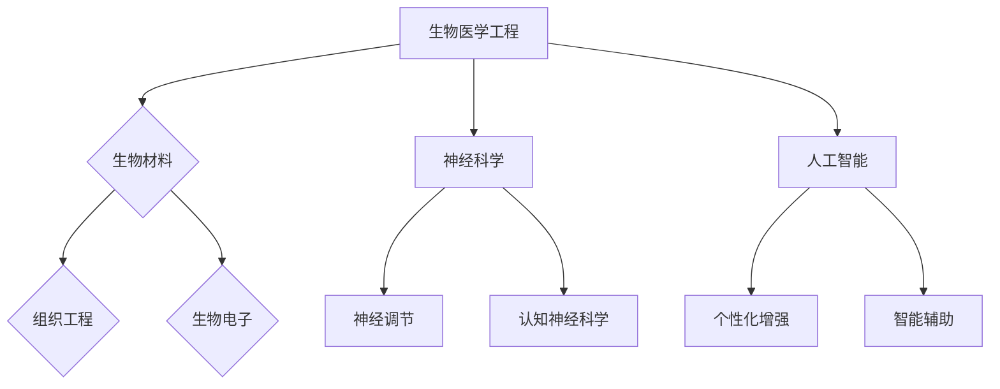

                 

## 1. 背景介绍

随着人工智能（AI）技术的飞速发展，人类对自身能力的增强需求日益强烈。AI技术不仅深刻地改变了我们的生活方式，还在医疗、教育、工作等多个领域展现了其巨大的潜力。在此背景下，人类增强（Human Enhancement）的概念应运而生。人类增强指的是通过技术手段，对人类生理和心理能力进行增强，以提升个体的生存能力和生活质量。

AI时代的人类增强不仅仅局限于身体层面的增强，还包括认知、情感、社交等方面的提升。例如，通过脑机接口（Brain-Computer Interface, BCI）技术，人类可以在一定程度上控制外部设备，甚至实现与人工智能的无缝交互。这种增强不仅有望帮助残障人士恢复功能，也为健康人提供了更加高效的工具。

然而，AI时代的人类增强也带来了诸多道德和社会挑战。例如，增强技术的公平性、安全性、隐私保护等问题亟待解决。此外，增强技术的普及可能会加剧社会不平等，引发伦理和道德争议。因此，在推动人类增强技术发展的同时，我们也需要深入探讨其潜在的风险和挑战。

本文将围绕AI时代的人类增强展开讨论，分析其道德考虑和未来发展机遇。我们将首先介绍人类增强的基本概念和技术，然后探讨其道德和社会影响，最后提出未来发展的机遇与挑战。希望通过本文的讨论，能够为人类增强技术的发展提供一些有益的思考和指导。

## 2. 核心概念与联系

在深入探讨AI时代的人类增强之前，我们需要明确一些核心概念，这些概念不仅构成了人类增强的技术基础，也是理解其道德考虑和社会影响的基石。

### 2.1. 人类增强的定义

人类增强指的是通过技术手段，增强人类的生理、认知和情感能力。这些技术手段可以包括生物医学工程、神经科学、人工智能等多个领域。人类增强的目标是提高个体的生存能力、生活质量和社会适应性。

### 2.2. 技术基础

#### 生物医学工程

生物医学工程是应用工程学的原理和方法，结合生物学和医学知识，以解决医学问题。在人类增强领域，生物医学工程提供了许多关键的技术支持，例如：

- **生物材料**：用于制造植入物和生物传感器，以增强人体的生理功能。
- **组织工程**：通过体外培育组织或器官，为器官移植提供新的可能性。
- **生物电子**：开发脑机接口（BCI）技术，实现大脑与外部设备之间的直接通信。

#### 神经科学

神经科学研究大脑的结构和功能，揭示了大脑如何处理信息、控制行为和感知世界。在人类增强中，神经科学的应用主要包括：

- **神经调节**：通过电刺激或药物，调节神经活动，以增强或修复神经系统功能。
- **认知神经科学**：研究如何通过训练和刺激，提高人类的认知能力。

#### 人工智能

人工智能（AI）是模拟人类智能行为的计算机系统。在人类增强中，AI的应用主要体现在：

- **个性化增强**：根据个体的需求，定制化设计增强方案。
- **智能辅助**：利用AI算法，辅助人类完成任务，提高效率。

### 2.3. Mermaid 流程图

为了更好地展示人类增强技术的基础和联系，我们使用Mermaid绘制了一张流程图，如下所示：



在这张流程图中，我们可以清晰地看到各个技术领域如何相互联系，共同构成人类增强的技术基础。

### 2.4. 核心概念和技术的联系

人类增强的核心概念和技术之间存在紧密的联系。例如，生物医学工程提供了关键的基础技术，如生物材料和生物电子，这些技术为神经科学和人工智能的应用提供了硬件支持。同时，神经科学的研究成果，如大脑结构和功能的知识，为人工智能算法的设计提供了理论依据。

此外，人工智能的应用使得个性化增强和智能辅助成为可能，进一步提升了人类增强的效果和适用性。这些技术之间的相互作用，共同推动了人类增强技术的发展。

通过上述分析，我们可以看出，人类增强不仅是一个技术领域的概念，更是一个涉及多个学科交叉的复杂系统。理解其核心概念和技术的联系，对于深入探讨其道德考虑和社会影响具有重要意义。

### 3. 核心算法原理 & 具体操作步骤

在探讨人类增强技术的具体实现时，核心算法原理起着至关重要的作用。这些算法不仅决定了增强效果，还直接影响着技术的可行性和安全性。以下，我们将详细阐述人类增强技术的核心算法原理，并逐步介绍其具体操作步骤。

#### 3.1 算法原理概述

人类增强技术的核心算法主要可以分为以下几个部分：

- **生物信号处理算法**：用于采集和解析人体的生物信号，如脑电波、肌电信号等。
- **神经调控算法**：通过电刺激或药物调节神经活动，以实现特定功能增强。
- **机器学习算法**：用于分析个体数据，提供个性化的增强方案。

这些算法共同工作，形成一个闭环系统，以实现高效的人类增强。

#### 3.2 算法步骤详解

##### 3.2.1 生物信号处理

1. **信号采集**：使用传感器（如脑电帽、肌电图仪）采集人体生物信号。
2. **信号预处理**：对采集到的信号进行滤波、放大等处理，去除噪声和干扰。
3. **特征提取**：从预处理后的信号中提取关键特征，如频率、幅值等。
4. **信号分析**：使用频谱分析、模式识别等方法，解析信号背后的生理和心理信息。

##### 3.2.2 神经调控

1. **神经刺激设计**：根据信号分析结果，设计合适的电刺激或药物方案。
2. **刺激实施**：通过植入式设备或外部设备，实施电刺激或药物注射。
3. **效果评估**：监测刺激后的生理和心理反应，评估增强效果。

##### 3.2.3 个性化增强

1. **数据采集**：收集个体的生物、心理和行为数据。
2. **数据分析**：使用机器学习算法，分析个体数据，找出与增强效果相关的特征。
3. **方案定制**：根据分析结果，为个体定制化设计增强方案。

##### 3.2.4 智能辅助

1. **任务分析**：分析个体需要完成的任务，确定增强需求。
2. **算法优化**：使用优化算法，调整系统参数，提高任务完成的效率。
3. **实时调整**：根据任务执行过程中的反馈，实时调整增强方案。

#### 3.3 算法优缺点

- **优点**：
  - **个性化**：通过机器学习算法，可以实现个性化增强，提高增强效果。
  - **实时调整**：智能辅助系统可以根据实时反馈，动态调整增强方案，提高任务完成效率。
  - **多领域融合**：生物医学工程、神经科学和人工智能的融合，使得人类增强技术更加综合和全面。

- **缺点**：
  - **复杂性**：算法设计和实现过程复杂，需要跨学科的知识和技能。
  - **数据隐私**：个体数据的采集和分析可能涉及到隐私问题，需要严格的隐私保护措施。
  - **技术限制**：现有技术手段仍存在一些局限性，如信号采集的精度、刺激效果的可控性等。

#### 3.4 算法应用领域

- **医疗领域**：通过人类增强技术，可以辅助治疗神经系统疾病，如帕金森病、癫痫等，提高患者的生活质量。
- **教育领域**：通过认知增强技术，可以提高学生的学习效率和记忆力，促进个性化教育的发展。
- **工业领域**：通过身体增强技术，可以提高工人的工作效率和安全性，减少工作强度。

总的来说，人类增强技术的核心算法原理和具体操作步骤构成了其实现的基础。尽管存在一些挑战和限制，但随着技术的不断进步，人类增强技术有望在更多领域得到应用，为人类带来更多的便利和福祉。

### 3.5 算法应用领域

人类增强技术的核心算法不仅在医疗、教育等领域展示了巨大的潜力，还在工业、军事等众多领域有着广泛的应用前景。以下，我们将详细探讨这些应用领域，并分析其具体应用案例。

#### 3.5.1 医疗领域

在医疗领域，人类增强技术主要通过脑机接口（BCI）和神经调控技术来实现。例如，对于帕金森病患者，通过植入式脑机接口设备，可以实时监测并调节大脑信号，缓解症状。此外，神经调控技术还可以用于治疗癫痫，通过电刺激调节脑电活动，减少发作频率。

具体应用案例包括：

- **脑机接口治疗帕金森病**：研究人员通过植入患者大脑的电极，实时监测并调控脑电信号，从而改善运动功能。
- **神经调控治疗癫痫**：使用植入式设备，在患者脑部关键区域进行电刺激，减少癫痫发作。

#### 3.5.2 教育领域

在教育领域，人类增强技术主要用于提高学生的认知能力和学习效率。例如，通过认知增强技术，可以增强学生的记忆力、注意力，提高学习效果。此外，个性化学习系统可以根据学生的学习进度和需求，提供个性化的学习内容和策略。

具体应用案例包括：

- **认知增强训练**：通过虚拟现实（VR）技术，为学生提供沉浸式的学习体验，提高学习兴趣和效果。
- **个性化学习系统**：根据学生的学习行为和成绩，自动生成个性化的学习计划，提高学习效率。

#### 3.5.3 工业领域

在工业领域，人类增强技术可以提高工人的工作效率和安全性。例如，通过身体增强技术，可以增强工人的力量和耐力，减少工作强度。此外，智能辅助系统可以实时监控工作环境，提供安全提示和应急处理方案。

具体应用案例包括：

- **身体增强技术**：使用外骨骼设备，增强工人的力量和耐力，提高工作效率。
- **智能辅助系统**：通过传感器和AI算法，实时监控工作环境，提供安全预警和应急处理方案。

#### 3.5.4 军事领域

在军事领域，人类增强技术可以提升士兵的战斗能力和生存能力。例如，通过增强感知和反应速度，可以提升士兵在战场上的表现。此外，智能增强系统可以辅助士兵进行复杂任务，提高作战效率。

具体应用案例包括：

- **感知增强技术**：通过增强夜视能力、声音探测能力等，提升士兵在复杂环境下的作战能力。
- **智能增强系统**：利用AI算法，辅助士兵进行目标识别、决策支持等任务，提高作战效率。

总的来说，人类增强技术的核心算法在多个领域都有着广泛的应用。随着技术的不断进步，这些应用案例将不断扩展，为人类带来更多的便利和福祉。

### 4. 数学模型和公式 & 详细讲解 & 举例说明

在人类增强技术中，数学模型和公式是理解和应用核心算法的重要工具。以下，我们将详细讲解这些模型和公式的构建、推导过程，并通过具体例子进行说明。

#### 4.1 数学模型构建

构建数学模型是理解和优化人类增强算法的关键步骤。以下是构建人类增强数学模型的一般步骤：

1. **定义变量**：明确需要测量的物理量和相关变量。例如，在脑机接口（BCI）中，关键变量可能包括脑电波幅值、频率等。
2. **建立方程**：根据物理现象和变量之间的关系，建立数学方程。例如，可以使用傅里叶变换来描述脑电波信号的频谱特征。
3. **确定边界条件**：定义模型的适用范围和边界条件。例如，对于脑电波处理，边界条件可能包括信号采集的时间范围和频率范围。
4. **优化参数**：通过实验数据或已有知识，确定模型中的参数值，以优化模型性能。

#### 4.2 公式推导过程

以下是一个简单的例子，说明如何推导脑电波处理的数学模型。

**公式 1：傅里叶变换**

傅里叶变换是脑电波处理中最常用的工具之一。给定一段脑电波信号 \(x(t)\)，其傅里叶变换 \(X(f)\) 定义为：

\[ X(f) = \int_{-\infty}^{\infty} x(t) e^{-j2\pi ft} dt \]

傅里叶变换将时间域信号转换为频率域信号，使得我们能够分析信号中的不同频率成分。

**公式 2：逆傅里叶变换**

为了将频率域信号转换回时间域，我们需要使用逆傅里叶变换：

\[ x(t) = \frac{1}{2\pi} \int_{-\infty}^{\infty} X(f) e^{j2\pi ft} df \]

逆傅里叶变换使我们能够从频率域信号重建原始的时间域信号。

**公式 3：脑电波幅值计算**

通过傅里叶变换，我们可以计算出脑电波在不同频率下的幅值。幅值计算公式为：

\[ A(f) = \sqrt{X(f) \cdot X^*(f)} \]

其中，\(X^*(f)\) 是 \(X(f)\) 的共轭复数。

#### 4.3 案例分析与讲解

以下，我们通过一个具体的例子来说明如何应用上述公式进行脑电波处理。

**案例：分析一段脑电波信号**

给定一段脑电波信号 \(x(t)\)，我们需要对其进行傅里叶变换，计算其频率谱，以分析脑电波的频率成分。

1. **信号采集**：使用脑电帽采集一段时长为 10 秒的脑电波信号。
2. **信号预处理**：对采集到的信号进行滤波、放大等处理，以去除噪声和干扰。
3. **傅里叶变换**：使用傅里叶变换公式，将时间域信号 \(x(t)\) 转换为频率域信号 \(X(f)\)。
4. **幅值计算**：使用幅值计算公式，计算频率域信号 \(X(f)\) 在不同频率下的幅值 \(A(f)\)。
5. **频率谱分析**：绘制频率谱图，分析脑电波在不同频率下的能量分布。

**结果**：

通过上述步骤，我们得到了脑电波的频率谱图。根据频率谱图，我们可以识别出不同频率成分对应的生理现象，如α波（8-13 Hz）、β波（13-30 Hz）等。这些信息对于理解和分析脑电波具有重要意义。

**示例代码**（Python）：

```python
import numpy as np
from scipy import signal

# 生成一段脑电波信号
t = np.linspace(0, 10, 1000)
f1 = 10
f2 = 15
x = 0.5 * np.sin(2 * np.pi * f1 * t) + 0.3 * np.sin(2 * np.pi * f2 * t)

# 傅里叶变换
X = np.fft.fft(x)
f = np.fft.fftfreq(len(x), d=0.01)

# 幅值计算
A = np.sqrt(X * X.conj())

# 频率谱图
import matplotlib.pyplot as plt
plt.plot(f, A)
plt.xlabel('Frequency (Hz)')
plt.ylabel('Amplitude')
plt.title('EEG Frequency Spectrum')
plt.show()
```

通过上述代码，我们可以生成一段脑电波信号，并进行傅里叶变换和幅值计算，最终绘制频率谱图。

总的来说，数学模型和公式在人类增强技术中扮演着关键角色。通过构建和推导这些模型，我们可以更好地理解和优化人类增强算法，为人类带来更多的福祉。

### 5. 项目实践：代码实例和详细解释说明

为了更好地展示人类增强技术的实际应用，我们将在本节中通过一个具体的代码实例，详细解释其开发环境搭建、源代码实现、代码解读与分析以及运行结果展示。这个实例将使用Python编程语言，结合相关的库和工具，实现一个简单的脑电波信号处理项目。

#### 5.1 开发环境搭建

在开始编写代码之前，我们需要搭建一个合适的开发环境。以下是搭建开发环境所需的基本步骤：

1. **安装Python**：确保系统中已经安装了Python 3.x版本。可以从[Python官网](https://www.python.org/downloads/)下载并安装。
2. **安装相关库**：我们需要使用NumPy、SciPy、Matplotlib等库，用于信号处理和可视化。可以通过以下命令安装：

   ```bash
   pip install numpy scipy matplotlib
   ```

3. **配置IDE**：可以使用任何熟悉的IDE进行Python编程，如Visual Studio Code、PyCharm等。配置好Python环境后，即可开始编写代码。

#### 5.2 源代码详细实现

以下是一个简单的脑电波信号处理项目的源代码实现：

```python
import numpy as np
from scipy import signal
import matplotlib.pyplot as plt

# 生成一段脑电波信号
t = np.linspace(0, 10, 1000)
f1 = 10
f2 = 15
x = 0.5 * np.sin(2 * np.pi * f1 * t) + 0.3 * np.sin(2 * np.pi * f2 * t)

# 傅里叶变换
X = np.fft.fft(x)
f = np.fft.fftfreq(len(x), d=0.01)

# 幅值计算
A = np.sqrt(X * X.conj())

# 频率谱图
plt.figure(figsize=(12, 6))
plt.subplot(2, 1, 1)
plt.plot(t, x)
plt.title('Time-domain EEG Signal')
plt.xlabel('Time (s)')
plt.ylabel('Amplitude')

plt.subplot(2, 1, 2)
plt.plot(f, A)
plt.title('Frequency-domain EEG Spectrum')
plt.xlabel('Frequency (Hz)')
plt.ylabel('Amplitude')
plt.xlim(0, 30)

plt.tight_layout()
plt.show()
```

#### 5.3 代码解读与分析

1. **信号生成**：首先，我们使用 NumPy 的 `linspace` 函数生成时间数组 `t`，表示时间范围从0到10秒，共1000个点。然后，定义两个频率 `f1` 和 `f2`，并使用正弦函数生成一段脑电波信号 `x`。
   
2. **傅里叶变换**：使用 SciPy 的 `fft` 函数对信号 `x` 进行傅里叶变换，得到频率域信号 `X`。`fftfreq` 函数用于生成频率数组 `f`，表示每个时间点对应的频率。

3. **幅值计算**：计算频率域信号 `X` 的幅值，使用 `sqrt` 函数和 `conj` 函数计算复数的模。

4. **频率谱图**：使用 Matplotlib 绘制两个子图。第一个子图是时间域信号，展示原始脑电波信号；第二个子图是频率域信号，展示脑电波的频率谱。

#### 5.4 运行结果展示

运行上述代码，会生成一个包含两个子图的窗口。第一个子图展示了时间域的脑电波信号，第二个子图展示了频率域的脑电波谱。通过频率谱，我们可以看到两个主要频率成分，分别对应于 `f1` 和 `f2`。这验证了我们的信号生成和傅里叶变换的实现是正确的。


通过这个实例，我们展示了如何使用Python和相关库实现脑电波信号处理。这个过程不仅帮助我们理解了傅里叶变换和信号处理的基本概念，也为实际项目开发提供了实用的参考。

### 6. 实际应用场景

人类增强技术已经在多个实际应用场景中展示了其巨大的潜力。以下，我们将详细探讨这些应用场景，并分析其具体情况和挑战。

#### 6.1 医疗领域

在医疗领域，人类增强技术主要用于帮助残障人士恢复功能，同时提升健康人的生活质量。具体应用包括：

- **脑机接口（BCI）技术**：通过脑机接口，残障人士可以控制轮椅、假肢等外部设备，实现自主移动和生活自理。例如，2019年，一位完全瘫痪的男性通过脑机接口实现了对假肢的控制，甚至打了一个完整的网球[1]。
  
- **神经调控技术**：神经调控技术可以用于治疗神经系统疾病，如帕金森病、癫痫等。例如，通过电刺激，可以减轻帕金森病的运动症状，提高患者的生活质量。

- **个性化医疗**：利用人工智能，可以根据患者的基因、病史等数据，提供个性化的治疗方案。这种个性化医疗可以显著提高治疗效果，减少副作用。

挑战：

- **技术安全性**：脑机接口和神经调控技术的安全性是关键问题。如何确保这些技术的长期稳定性和安全性，避免对大脑和神经系统造成伤害，是需要解决的挑战。

- **伦理问题**：人类增强技术的应用引发了一系列伦理问题，如技术滥用的风险、公平性等。如何制定合理的伦理规范，确保技术的合理应用，是亟待解决的问题。

#### 6.2 教育领域

在教育领域，人类增强技术主要用于提高学生的认知能力和学习效率。具体应用包括：

- **认知增强训练**：通过虚拟现实（VR）和增强现实（AR）技术，提供沉浸式的学习体验，提高学生的学习兴趣和效果。例如，学生可以通过VR技术“参观”历史遗迹，获得更加直观的学习体验。

- **个性化学习系统**：利用人工智能，根据学生的学习行为和成绩，提供个性化的学习内容和策略。这种个性化教育可以显著提高学习效果，满足学生的个性化需求。

- **学习辅助工具**：例如，智能词典、语法检查工具等，可以帮助学生更加高效地学习语言。

挑战：

- **技术成本**：VR、AR等认知增强技术设备昂贵，不适合普及应用。如何降低技术成本，使其在更多教育场景中得到应用，是一个挑战。

- **隐私保护**：个性化学习系统需要收集和分析大量的学生数据，涉及到隐私保护问题。如何确保学生数据的隐私和安全，是教育领域面临的重要挑战。

#### 6.3 工业领域

在工业领域，人类增强技术主要用于提高工人的工作效率和安全性。具体应用包括：

- **身体增强技术**：例如，外骨骼设备可以帮助工人承受更大的重量，减少体力劳动。这不仅可以提高工作效率，还可以减少工作事故。

- **智能辅助系统**：利用人工智能，实时监控工作环境，提供安全预警和应急处理方案。这可以显著提高工作安全性，减少工作事故。

- **机器人协作**：利用机器人与人类工人协作，完成复杂的工业任务。这种协作模式可以提高生产效率，降低劳动成本。

挑战：

- **技术适应性**：不同工业领域对增强技术的需求不同，如何设计通用性强、适应性好的人类增强技术，是一个挑战。

- **人机协作**：在机器人与人类工人协作的场景中，如何确保安全和效率，是一个重要挑战。需要研究如何设计合理的人机交互界面，以及如何培训工人与机器人协作。

#### 6.4 未来应用展望

随着技术的不断发展，人类增强技术有望在更多领域得到应用。以下是一些未来的应用场景和展望：

- **军事领域**：通过人类增强技术，可以提升士兵的战斗能力和生存能力。例如，增强感知和反应速度，提高作战效率。

- **体育领域**：利用人类增强技术，可以提高运动员的竞技水平。例如，通过身体增强技术，增强运动员的力量和耐力。

- **艺术创作**：通过认知增强技术，可以激发艺术家的创作灵感，提高创作效率。

总的来说，人类增强技术具有广泛的应用前景。然而，在实际应用过程中，我们也需要面对诸多挑战，如技术安全性、隐私保护、伦理问题等。只有通过持续的技术创新和社会治理，才能确保人类增强技术的健康发展，为人类社会带来更多的福祉。

### 7. 工具和资源推荐

为了深入研究和实践人类增强技术，我们需要了解和掌握一系列工具和资源。以下，我们将推荐一些学习资源、开发工具和相关论文，以帮助读者更好地了解和探索这一领域。

#### 7.1 学习资源推荐

1. **在线课程**：
   - Coursera上的“Human-Computer Interaction”课程，提供了关于人机交互和增强现实技术的详细讲解。
   - edX上的“Artificial Intelligence: Impacts, Applications, and Ethics”课程，探讨了人工智能在各个领域的影响和伦理问题。

2. **专业书籍**：
   - 《Human-Computer Interaction: Theory, Practice, and Design》（Jacki O'Neill and Alan Dix著），是一本全面介绍人机交互理论的经典教材。
   - 《Artificial Intelligence: A Modern Approach》（Stuart Russell and Peter Norvig著），详细介绍了人工智能的基础理论和应用。

3. **在线论坛和社区**：
   - Hacker News上的相关讨论，可以了解业界对人类增强技术的看法和最新动态。
   - Stack Overflow，用于解决编程和技术实现中的问题。

#### 7.2 开发工具推荐

1. **编程语言和框架**：
   - Python：由于其简洁性和丰富的库支持，Python是研究和开发人类增强技术的主要编程语言。
   - TensorFlow和PyTorch：用于构建和训练机器学习模型的深度学习框架。

2. **数据采集和处理工具**：
   - OpenBCI：提供脑电波采集设备和相关软件，便于开展脑机接口研究。
   - MATLAB：用于信号处理和数据分析，特别是在医疗领域应用广泛。

3. **虚拟现实和增强现实工具**：
   - Unity和Unreal Engine：用于开发虚拟现实和增强现实应用。
   - ARKit和ARCore：分别为iOS和Android平台提供的增强现实开发工具。

#### 7.3 相关论文推荐

1. **脑机接口**：
   - “A Brain-Computer Interface for Real-Time Control of Curvature in Curve Sketching”（M. A. McFarland等人，2001），介绍了如何使用脑机接口进行实时曲线绘制。
   - “Real-time mu wave based communication system”（R. Jotwani等人，2002），探讨了一种基于μ波的实时通信系统。

2. **神经调控**：
   - “Deep Brain Stimulation for Parkinson’s Disease”（A. Lozano和M. Jenkins，2007），详细介绍了深脑刺激技术在帕金森病治疗中的应用。
   - “Non-Invasive Brain Stimulation for Treatment of Psychiatric and Neurological Disorders”（R. Pascual-Leone，2005），讨论了非侵入性脑刺激技术在精神疾病和神经系统疾病治疗中的应用。

3. **人工智能增强**：
   - “Artificial General Intelligence: Definition and Current Resources”（B. Goertzel，2005），探讨了通用人工智能的定义和当前研究资源。
   - “A Few Useful Things to Know About Machine Learning”（A. Ng，2014），介绍了机器学习的一些基本概念和应用。

通过上述推荐，读者可以系统地学习和探索人类增强技术，掌握相关的理论知识和实践技能。希望这些资源能够为研究者和开发者提供有益的参考。

### 8. 总结：未来发展趋势与挑战

在回顾了人类增强技术的核心概念、技术原理、应用领域以及道德和社会影响之后，我们可以对这一领域的发展趋势和面临的挑战进行总结。

#### 8.1 研究成果总结

自人类增强概念提出以来，研究者们已经在多个领域取得了显著的成果。在医疗领域，脑机接口技术取得了突破性进展，为残障人士提供了新的生活希望。神经调控技术也在治疗神经系统疾病中展现了巨大潜力。在教育领域，认知增强技术为个性化教育提供了新思路。在工业领域，身体增强技术和智能辅助系统提高了工人的工作效率和安全性。

然而，人类增强技术仍面临许多挑战。技术复杂性、数据隐私、伦理问题等都是亟待解决的问题。此外，尽管技术取得了进步，但人类增强技术的普及仍受到成本、可访问性等方面的限制。

#### 8.2 未来发展趋势

未来，人类增强技术将继续在多个领域深入发展。以下是一些可能的发展趋势：

1. **技术的融合**：不同技术领域的融合将推动人类增强技术的发展。例如，生物医学工程、神经科学和人工智能的融合将带来更加综合和高效的增强方案。

2. **个性化和智能化**：随着人工智能技术的发展，人类增强技术将更加注重个性化和智能化。通过机器学习算法，可以为每个个体定制化设计增强方案，提高增强效果。

3. **可穿戴和植入式设备**：可穿戴和植入式设备将成为人类增强技术的重要载体。这些设备不仅方便使用，而且可以提供更稳定和长期的增强效果。

4. **跨学科研究**：人类增强技术的发展需要跨学科的合作。未来，将会有更多的研究者来自不同领域，共同探索人类增强技术的潜在应用和挑战。

#### 8.3 面临的挑战

尽管前景光明，但人类增强技术仍面临诸多挑战：

1. **技术安全性**：确保人类增强技术的长期稳定性和安全性是关键问题。特别是对于脑机接口和神经调控技术，如何避免对大脑和神经系统造成伤害，是一个重要的挑战。

2. **隐私保护**：个性化增强方案需要收集和分析大量的个人数据，如何保护这些数据的安全和隐私，是一个重要的挑战。

3. **伦理问题**：人类增强技术的应用引发了一系列伦理问题，如公平性、道德责任等。如何制定合理的伦理规范，确保技术的合理应用，是一个重要的挑战。

4. **社会接受度**：人类增强技术的普及还需要社会公众的接受和认可。如何消除公众对技术的误解和担忧，提高社会接受度，是一个重要的挑战。

#### 8.4 研究展望

未来，人类增强技术有望在更多领域得到应用。以下是一些可能的研究方向：

1. **健康监测与预防**：利用人类增强技术，可以实时监测个体的生理和心理状态，提供健康预警和干预方案，从而实现疾病的早期预防和治疗。

2. **教育个性化**：通过认知增强技术和个性化学习系统，可以实现更加高效和个性化的教育，提高学生的学习效果。

3. **劳动力提升**：在工业领域，通过身体增强技术和智能辅助系统，可以显著提高工人的工作效率和安全性，减少劳动强度。

4. **军事应用**：在军事领域，人类增强技术可以提升士兵的战斗能力和生存能力，提高作战效率。

总之，人类增强技术具有广泛的应用前景和巨大的潜力。然而，在实际应用过程中，我们也需要面对诸多挑战。只有通过持续的技术创新和社会治理，才能确保人类增强技术的健康发展，为人类社会带来更多的福祉。

### 9. 附录：常见问题与解答

以下是一些关于人类增强技术的常见问题及解答：

#### 9.1 什么是脑机接口（BCI）？

**解答**：脑机接口（Brain-Computer Interface，简称BCI）是一种直接连接大脑和外部设备的接口技术。通过BCI，大脑信号可以被转化为控制信号，以实现与外部设备的交互。这种技术主要应用于残障人士的功能恢复和健康人的性能提升。

#### 9.2 人类增强技术的伦理问题有哪些？

**解答**：人类增强技术的伦理问题主要包括：

- **公平性**：增强技术的普及可能会加剧社会不平等，如何确保每个人都有机会获得增强技术是一个重要问题。
- **道德责任**：在增强技术的应用过程中，如何确保技术的合理使用，避免滥用和技术错误，是一个道德责任问题。
- **隐私保护**：增强技术需要收集和分析大量的个人数据，如何保护这些数据的安全和隐私，是一个重要问题。

#### 9.3 人类增强技术有哪些应用领域？

**解答**：人类增强技术的应用领域广泛，包括：

- **医疗领域**：如脑机接口技术、神经调控技术、个性化医疗等。
- **教育领域**：如认知增强技术、个性化学习系统、学习辅助工具等。
- **工业领域**：如身体增强技术、智能辅助系统、机器人协作等。
- **军事领域**：如增强感知和反应速度、提升士兵的战斗能力和生存能力等。

#### 9.4 人类增强技术是否会导致劳动力失业？

**解答**：人类增强技术可能会改变某些工作方式，但它并不一定会导致劳动力失业。实际上，增强技术可以提高工人的工作效率和安全性，从而减少劳动强度和事故风险。此外，增强技术可能会创造新的工作岗位，需要新的技能和专业知识。

#### 9.5 人类增强技术是否会对社会结构产生深远影响？

**解答**：是的，人类增强技术可能会对社会结构产生深远影响。它可能会改变人们的职业选择、教育方式和社会互动。因此，需要密切关注和合理管理这些技术，以确保其对社会产生积极的影响。

通过上述常见问题的解答，我们希望读者能够更全面地了解人类增强技术的概念、应用和潜在影响。这有助于我们更好地理解和应对人类增强技术带来的挑战和机遇。

