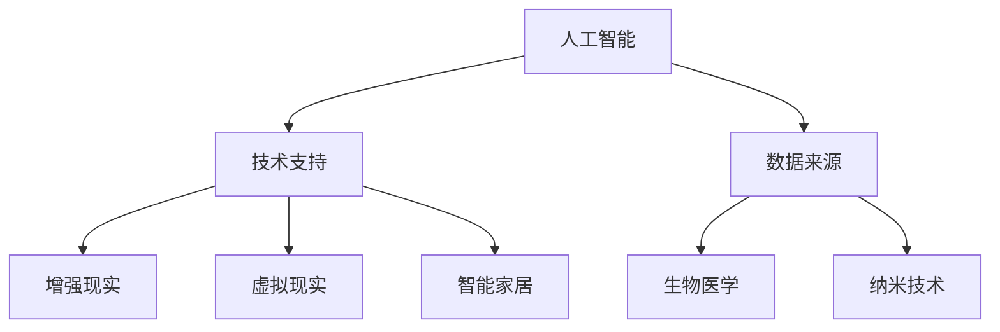

                 

关键词：人工智能，人类增强，道德伦理，身体增强，未来发展，挑战趋势

摘要：随着人工智能技术的快速发展，人类增强逐渐成为热门话题。本文将探讨AI时代人类增强的概念、道德考虑、身体增强的未来发展机遇、挑战与趋势，为人类在科技发展的道路上提供有益的思考和指导。

## 1. 背景介绍

### 1.1 人工智能的发展

人工智能（Artificial Intelligence，简称AI）是计算机科学的一个分支，旨在使计算机具有人类的智能能力，包括学习、推理、感知、理解和决策等。自20世纪50年代诞生以来，人工智能技术经历了数个发展阶段，如今已取得了显著的成果。

### 1.2 人类增强的概念

人类增强（Human Enhancement）是指通过技术手段，如生物医学、信息技术、纳米技术等，增强人类的能力，提高生活质量。随着人工智能技术的进步，人类增强逐渐成为一种可能。

### 1.3 道德考虑

随着人类增强技术的发展，我们不得不面对一系列道德和伦理问题，如基因编辑、身体改造、隐私保护等。如何在科技发展的同时，确保道德伦理的底线，成为我们需要深思的问题。

## 2. 核心概念与联系

### 2.1 人工智能与人类增强的关系

人工智能和人类增强之间存在密切的联系。人工智能技术可以为人类增强提供技术支持，如智能医疗器械、虚拟现实、增强现实等。而人类增强的实践又可以为人工智能提供大量的数据，促进人工智能的发展。

### 2.2 人类增强的技术架构

人类增强的技术架构主要包括以下几个方面：

1. 生物医学技术：如基因编辑、细胞治疗、器官移植等。
2. 信息技术：如虚拟现实、增强现实、智能家居等。
3. 纳米技术：如纳米机器人、纳米药物等。

<|markdown|

|>

