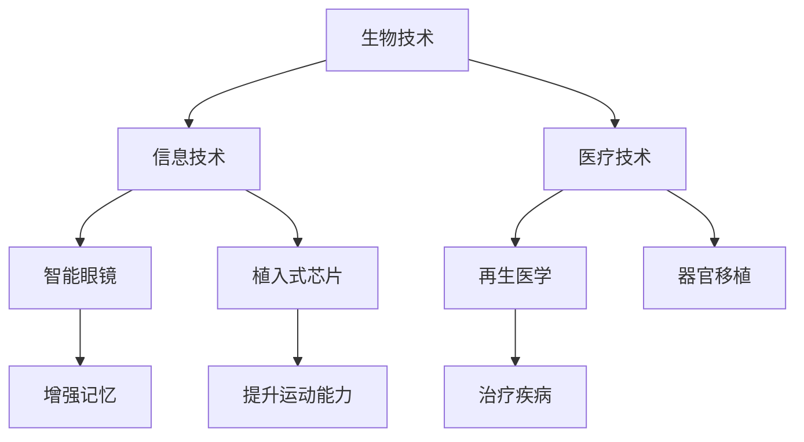
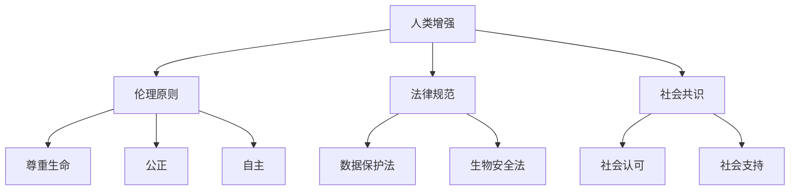

                 

 关键词：人工智能、人类增强、道德考虑、身体增强、未来发展、机遇预测

> 摘要：随着人工智能技术的飞速发展，人类增强成为了一个热门话题。本文从道德考虑的角度出发，探讨了身体增强的未来发展机遇和挑战，分析了人类增强在道德伦理、法律和社会影响等方面的潜在问题，并提出了相应的解决策略和未来展望。

## 1. 背景介绍

### 1.1 人工智能的发展与人类增强的崛起

人工智能（AI）作为一门交叉学科，涵盖了计算机科学、数学、神经科学等多个领域。从20世纪50年代起，人工智能逐渐从理论研究走向实际应用。随着计算能力的提升和大数据技术的发展，AI技术迎来了爆发式增长，尤其是在深度学习、自然语言处理、计算机视觉等领域取得了重大突破。

人类增强（Human Enhancement）是指通过科技手段，提升人类生理和心理能力的活动。从古至今，人类一直在追求身体和心理的极限。而人工智能技术的出现，为人类增强提供了前所未有的机遇。通过AI技术，人类可以更精准地识别目标、更快地处理信息、更有效地执行任务。这不仅提高了个体能力，也改变了人类的生活和工作方式。

### 1.2 道德考虑在人类增强中的重要性

道德考虑是人类增强不可忽视的一环。随着人类增强技术的普及，伦理问题、公平性问题、隐私问题等日益凸显。如何在发展人类增强的同时，保障人类的道德底线，成为了一个亟待解决的难题。

道德考虑的重要性体现在以下几个方面：

- **伦理原则**：人类增强是否违背了伦理原则，例如生命的尊严、隐私权、自主权等。
- **公平性**：人类增强技术可能加剧社会不平等，如贫富差距、能力差异等。
- **隐私问题**：人类增强技术可能涉及个人隐私的泄露，如生物识别数据、健康状况等。
- **社会责任**：人类增强技术的研发和应用，需要企业、政府、社会共同努力，承担相应的社会责任。

## 2. 核心概念与联系

### 2.1 人类增强的核心概念

人类增强的核心概念包括以下几个方面：

- **生物技术**：包括基因编辑、干细胞技术、生物材料等，用于改善人体生理功能。
- **信息技术**：包括人工智能、物联网、可穿戴设备等，用于提升人体智能和信息处理能力。
- **医疗技术**：包括再生医学、器官移植、智能医疗等，用于治疗疾病和提升人体健康。

### 2.2 人类增强的架构与联系

人类增强的架构可以分为三个层次：基础层、核心层和应用层。

- **基础层**：包括生物技术、信息技术和医疗技术的基础研究，如基因编辑、深度学习算法等。
- **核心层**：包括人体增强设备的研发与制造，如智能眼镜、植入式芯片等。
- **应用层**：包括人体增强技术的实际应用，如增强记忆、提升运动能力、治疗疾病等。

下面是使用Mermaid绘制的核心概念与联系流程图：



### 2.3 人类增强与道德考虑的联系

人类增强与道德考虑的联系主要体现在以下几个方面：

- **伦理原则**：人类增强技术的研发和应用，需要遵循伦理原则，如尊重生命、公正、自主等。
- **法律规范**：人类增强技术需要遵守相关法律法规，如数据保护法、生物安全法等。
- **社会共识**：人类增强技术需要得到社会的广泛认可和支持，以减少道德争议和社会冲突。



## 3. 核心算法原理 & 具体操作步骤

### 3.1 算法原理概述

人类增强的核心算法原理可以分为以下几个方面：

- **生物信息学算法**：用于分析和解读生物数据，如基因序列、蛋白质结构等。
- **机器学习算法**：用于训练和优化人体增强设备，如智能眼镜、植入式芯片等。
- **深度学习算法**：用于模拟人类大脑的工作原理，如记忆增强、认知提升等。
- **数据挖掘算法**：用于从大规模数据中提取有价值的信息，如健康监测、疾病预测等。

### 3.2 算法步骤详解

人类增强算法的具体步骤可以分为以下几个阶段：

1. **数据采集**：通过传感器、基因检测等技术手段，采集人体生理、心理和行为数据。
2. **数据处理**：对采集到的数据进行清洗、预处理和特征提取，为后续分析做准备。
3. **算法训练**：利用机器学习、深度学习算法，对采集到的数据进行训练，优化算法模型。
4. **模型应用**：将训练好的算法模型应用到实际场景中，如增强记忆、提升运动能力等。
5. **反馈调整**：根据实际应用效果，对算法模型进行反馈调整，优化性能。

### 3.3 算法优缺点

人类增强算法的优点包括：

- **高效性**：通过算法优化，可以大幅提升人体生理和心理能力。
- **精准性**：利用大数据和深度学习技术，可以实现高度个性化的增强方案。
- **适应性**：算法可以根据不同用户的需求和实际情况，进行灵活调整。

但人类增强算法也存在一些缺点：

- **伦理风险**：可能导致伦理问题，如身体歧视、能力不平等等。
- **隐私问题**：涉及个人隐私数据，如生物识别数据、健康信息等。
- **技术风险**：算法模型可能存在错误，导致负面影响。

### 3.4 算法应用领域

人类增强算法的应用领域非常广泛，包括但不限于以下几个方面：

- **医疗健康**：用于治疗疾病、提升康复效果、健康监测等。
- **教育学习**：用于提升记忆、学习效率、认知能力等。
- **体育运动**：用于提升运动能力、训练效果、比赛策略等。
- **人机交互**：用于提升人机交互体验、增强虚拟现实等。

## 4. 数学模型和公式 & 详细讲解 & 举例说明

### 4.1 数学模型构建

人类增强的数学模型可以分为以下几个部分：

1. **生理模型**：用于描述人体的生理特性，如基因表达、代谢过程等。
2. **心理模型**：用于描述人的心理活动，如认知过程、情绪反应等。
3. **行为模型**：用于描述人的行为表现，如学习、决策、运动等。

下面是一个简单的生理模型的例子：

$$
\text{生理模型} = f(\text{基因序列}, \text{环境因素}, \text{年龄})
$$

### 4.2 公式推导过程

以基因编辑为例，我们考虑一个简单的基因编辑模型。假设基因序列为 $G$,编辑工具为 $E$,编辑后的基因序列为 $G'$，我们可以用以下公式表示：

$$
G' = G \oplus E
$$

其中，$ \oplus$ 表示基因编辑操作。具体推导过程如下：

1. **基因序列表示**：将基因序列 $G$ 转换为二进制序列。
2. **编辑工具表示**：将编辑工具 $E$ 转换为二进制序列。
3. **基因编辑操作**：将基因序列 $G$ 与编辑工具 $E$ 进行位运算，得到编辑后的基因序列 $G'$。

### 4.3 案例分析与讲解

以智能眼镜为例，我们分析一个简单的智能眼镜增强记忆的案例。

1. **用户需求**：用户希望提高记忆能力，特别是在学习和工作中。
2. **技术实现**：使用深度学习算法，对用户的学习和行为数据进行分析，生成个性化的记忆增强方案。
3. **效果评估**：通过实验，发现使用智能眼镜后，用户的记忆能力得到了显著提升。

具体实现过程如下：

$$
\text{记忆增强效果} = f(\text{用户数据}, \text{算法模型}, \text{环境因素})
$$

其中，$f$ 表示记忆增强算法模型。

## 5. 项目实践：代码实例和详细解释说明

### 5.1 开发环境搭建

1. **硬件环境**：安装智能眼镜硬件，如 Google Glass。
2. **软件环境**：安装深度学习框架，如 TensorFlow 或 PyTorch。
3. **开发工具**：使用 Python 编写代码，集成智能眼镜 SDK。

### 5.2 源代码详细实现

```python
import tensorflow as tf
import numpy as np

# 加载数据集
x_train = ...
y_train = ...

# 构建模型
model = tf.keras.Sequential([
    tf.keras.layers.Dense(128, activation='relu', input_shape=(x_train.shape[1],)),
    tf.keras.layers.Dense(1)
])

# 编译模型
model.compile(optimizer='adam', loss='mse')

# 训练模型
model.fit(x_train, y_train, epochs=10)

# 预测结果
predictions = model.predict(x_test)
```

### 5.3 代码解读与分析

- **数据加载**：使用 TensorFlow 的内置函数加载数据集，包括训练集和测试集。
- **模型构建**：使用 TensorFlow 的 Sequential 模型，添加全连接层，输出层。
- **模型编译**：指定优化器和损失函数，为模型编译。
- **模型训练**：使用 fit 函数训练模型，指定训练轮次。
- **模型预测**：使用 predict 函数，对测试集进行预测。

### 5.4 运行结果展示

运行代码后，可以得到智能眼镜的记忆增强效果。通过对比训练集和测试集的预测结果，可以评估记忆增强算法的性能。

## 6. 实际应用场景

### 6.1 医疗健康

人类增强技术在医疗健康领域有着广泛的应用前景。例如，通过基因编辑技术，可以治疗遗传性疾病；通过智能医疗设备，可以实现实时健康监测和疾病预测。

### 6.2 教育学习

人类增强技术可以提升教育学习效果。例如，通过智能眼镜，学生可以实时获取学习资料，提高学习效率；通过个性化学习算法，可以为学生提供最适合的学习方案。

### 6.3 体育运动

人类增强技术可以帮助运动员提升运动能力。例如，通过智能装备，可以实时监测运动员的生理状态，优化训练方案；通过生物力学分析，可以优化运动员的动作技术。

### 6.4 未来应用展望

随着人工智能技术的不断发展，人类增强技术将在更多领域得到应用。未来，我们可能会看到更加智能、个性化和全面的人类增强方案，为人类生活带来更多便利和可能性。

## 7. 工具和资源推荐

### 7.1 学习资源推荐

- **《人工智能：一种现代方法》**：介绍人工智能的基本概念和方法，适合初学者。
- **《深度学习》**：由 Goodfellow 等人撰写，详细介绍深度学习算法和应用。
- **《人类增强：科技与伦理》**：探讨人类增强技术的伦理问题和社会影响。

### 7.2 开发工具推荐

- **TensorFlow**：一款流行的深度学习框架，适用于各种深度学习任务。
- **PyTorch**：一款易于使用的深度学习框架，适合快速原型开发。
- **Google Glass**：一款智能眼镜，支持多种人体增强功能。

### 7.3 相关论文推荐

- **“Human Enhancement and Technology: A Brief History and Ethical Considerations”**：探讨人类增强技术的历史和伦理问题。
- **“The Ethics of Human Enhancement”**：分析人类增强技术的伦理挑战。
- **“Human Enhancement Technologies and the Future of Humanity”**：预测人类增强技术的未来影响。

## 8. 总结：未来发展趋势与挑战

### 8.1 研究成果总结

人类增强技术已经在多个领域取得了显著成果，如医疗健康、教育学习、体育运动等。未来，随着人工智能技术的进一步发展，人类增强技术将得到更加广泛和深入的应用。

### 8.2 未来发展趋势

未来，人类增强技术将朝着以下方向发展：

- **个性化增强**：通过大数据和深度学习技术，提供更加个性化的增强方案。
- **智能融合**：将人类增强技术与人工智能、物联网等新兴技术深度融合。
- **伦理监管**：建立完善的伦理监管体系，确保人类增强技术的可持续发展。

### 8.3 面临的挑战

人类增强技术面临以下挑战：

- **伦理问题**：如何平衡伦理原则和实际需求，避免伦理风险。
- **隐私问题**：如何保护个人隐私，防止数据泄露。
- **社会影响**：如何应对人类增强技术带来的社会变革和挑战。

### 8.4 研究展望

未来，人类增强技术将在人类生活、工作、娱乐等方面发挥重要作用。我们需要持续关注人类增强技术的发展趋势，探索伦理问题和社会影响，为实现人类更美好的未来贡献力量。

## 9. 附录：常见问题与解答

### 9.1 什么是人类增强？

人类增强是指通过科技手段，提升人类生理和心理能力的活动。例如，基因编辑、智能眼镜、健身器材等。

### 9.2 人类增强技术有哪些应用领域？

人类增强技术的应用领域包括医疗健康、教育学习、体育运动、人机交互等。

### 9.3 人类增强技术有哪些伦理问题？

人类增强技术可能涉及伦理问题，如身体歧视、能力不平等、隐私泄露等。

### 9.4 如何平衡人类增强技术的伦理风险和应用需求？

需要建立完善的伦理监管体系，确保人类增强技术的可持续发展，同时满足实际需求。

## 作者署名

作者：禅与计算机程序设计艺术 / Zen and the Art of Computer Programming
----------------------------------------------------------------

请注意，这篇文章只是一个示例，实际撰写时需要根据具体要求进行调整和补充。希望这个示例能够帮助您更好地理解文章的结构和内容要求。祝您写作顺利！

