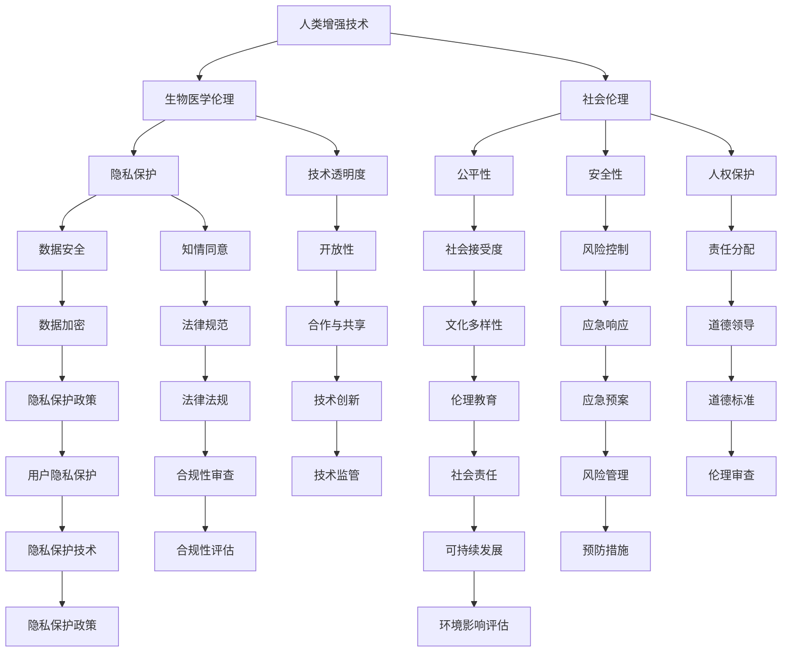

                 

关键词：人工智能、人类增强、道德、身体增强技术、伦理、技术限制

> 摘要：本文探讨了人工智能时代下人类增强技术的道德考量及其在身体增强领域的限制。文章首先概述了人类增强技术的背景和现状，接着分析了道德原则和伦理考量在人类增强中的应用，最后讨论了身体增强技术的具体限制和未来发展方向。

## 1. 背景介绍

随着人工智能技术的迅猛发展，人类增强技术（Human Enhancement Technology）逐渐成为研究热点。人类增强技术指的是通过各种科技手段提升人类身体和心智能力的科技，涵盖从基因编辑到神经接口、再到增强现实等多个领域。这种技术不仅在医学、教育、军事等领域展示了巨大的潜力，同时也引发了广泛的社会和伦理讨论。

人类增强技术的兴起，源于多个因素的共同作用。首先，人工智能技术的发展使得我们能够更好地理解和操控大脑及身体各器官的功能。其次，随着生物技术和纳米科技的进步，人类对自身的基因和细胞有了更深层次的认识和控制能力。此外，社会的需求也在推动人类增强技术的发展，例如提高工作效率、延长寿命、改善生活质量等。

然而，人类增强技术的快速发展也带来了诸多道德和伦理问题。例如，人类增强是否会导致社会不平等？人类增强技术是否会对人类的自然属性造成不可逆转的破坏？这些问题都需要深入探讨和权衡。

## 2. 核心概念与联系

为了更好地理解人类增强技术的伦理和道德考量，我们首先需要了解一些核心概念。以下是相关的 Mermaid 流程图，展示了这些概念及其相互关系：



### 2.1. 人类增强技术

人类增强技术指的是通过科技进步来增强人类身体和心智能力的技术手段，包括基因编辑、神经接口、增强现实、虚拟现实等。这些技术可以用于治疗疾病、提升工作效率、改善生活质量等方面。

### 2.2. 生物医学伦理

生物医学伦理关注的是在医疗和健康领域中的道德问题和伦理挑战，包括人类增强技术的应用、基因编辑的道德考量、人体实验的伦理规范等。

### 2.3. 社会伦理

社会伦理涉及的是人类增强技术对社会结构和人际关系的潜在影响，包括公平性、安全性、隐私保护、文化多样性等方面的考量。

### 2.4. 隐私保护

隐私保护涉及个人数据的安全性和保密性，是保障个人权益的重要方面。在人类增强技术中，个人数据的安全保护尤为重要，因为此类技术的应用往往涉及个人生物信息和行为数据。

### 2.5. 公平性

公平性指的是在人类增强技术的应用过程中，如何确保所有人都能平等地享受这些技术带来的好处，避免技术发展导致的社会不平等现象。

### 2.6. 安全性

安全性关注的是人类增强技术的使用过程中可能出现的风险和副作用，包括技术故障、数据泄露、身体损伤等方面的风险控制。

### 2.7. 技术透明度

技术透明度指的是人类增强技术的研发和应用过程需要公开透明，以便公众了解其工作原理和潜在风险，从而做出理性的判断。

### 2.8. 人权保护

人权保护是保障人类基本权利和尊严的重要方面，特别是在人类增强技术的应用中，需要确保技术的使用不侵犯个人权利。

### 2.9. 知情同意

知情同意是指在进行人类增强技术相关的研究和应用时，必须确保参与者充分了解相关风险和好处，并自愿参与。

### 2.10. 法律规范

法律规范是指为保障人类增强技术的合理应用，需要制定相应的法律法规，以规范其研发、生产和应用过程。

### 2.11. 隐私保护政策

隐私保护政策是指为保护个人隐私，需要制定一系列隐私保护措施和政策，包括数据加密、隐私保护技术等。

### 2.12. 文化多样性

文化多样性指的是在人类增强技术的应用过程中，需要考虑不同文化背景下的伦理和道德考量，避免文化冲突。

### 2.13. 伦理教育

伦理教育是指通过教育和培训，提高公众对人类增强技术伦理问题的认识和意识，以促进技术的负责任应用。

### 2.14. 应急预案

应急预案是指为应对人类增强技术可能带来的紧急情况，需要制定一系列应急措施和预案，以减少潜在风险。

### 2.15. 合作与共享

合作与共享是指在不同利益相关者之间，通过合作与共享信息和技术，共同推动人类增强技术的负责任发展。

### 2.16. 道德标准

道德标准是指为人类增强技术的研发和应用制定一系列道德规范和标准，以确保技术的伦理性和公正性。

### 2.17. 合规性审查

合规性审查是指对人类增强技术的研发和应用过程进行合规性审查，以确保其符合相关法律法规和道德标准。

### 2.18. 风险管理

风险管理是指通过识别、评估和控制人类增强技术可能带来的风险，以确保技术安全可靠。

### 2.19. 技术监管

技术监管是指通过建立监管机制，对人类增强技术的研发、生产和应用过程进行监管，以确保技术发展符合伦理和法律规定。

### 2.20. 伦理审查

伦理审查是指对人类增强技术相关的研究和应用项目进行伦理审查，以确保其符合伦理规范和道德标准。

### 2.21. 合规性评估

合规性评估是指对人类增强技术的研发和应用过程进行合规性评估，以确保其符合相关法律法规和道德标准。

### 2.22. 隐私保护技术

隐私保护技术是指用于保护个人隐私的一系列技术手段，包括数据加密、匿名化处理等。

### 2.23. 环境影响评估

环境影响评估是指对人类增强技术的研发和应用可能带来的环境影响进行评估，以确保技术发展符合可持续发展的原则。

### 2.24. 可持续发展

可持续发展是指人类增强技术的研发和应用应遵循可持续发展的原则，确保技术发展不破坏生态环境和社会和谐。

## 3. 核心算法原理 & 具体操作步骤

### 3.1 算法原理概述

人类增强技术的核心算法原理通常涉及以下几个方面：

1. **生物信息学分析**：通过对人类基因、蛋白质等生物信息的分析，了解人类身体和心智功能的基础，为增强提供理论基础。
2. **神经科学原理**：研究大脑和神经系统的运作机制，探索如何通过神经接口等技术手段增强人类认知和感知能力。
3. **计算机科学算法**：开发高效的算法模型，用于处理和分析大量生物医学数据，为人类增强技术提供技术支持。
4. **系统生物学原理**：研究生物体内各个系统之间的相互作用，探索如何通过系统调控实现人类增强。

### 3.2 算法步骤详解

1. **数据采集**：收集与人类身体和心智功能相关的生物医学数据，包括基因序列、脑电信号、生理参数等。
2. **数据处理**：对采集到的数据进行清洗、整合和分析，提取有用的生物信息。
3. **模型构建**：基于生物信息学和神经科学原理，构建用于预测和增强人类功能的算法模型。
4. **模型训练**：使用大量的生物医学数据对模型进行训练，优化模型的参数。
5. **模型评估**：评估模型的预测准确性和稳定性，确保模型的可靠性和有效性。
6. **应用实施**：将训练好的模型应用于实际场景，如增强人类认知能力、改善生活质量等。

### 3.3 算法优缺点

1. **优点**：
   - **提高效率**：通过算法模型，可以快速分析和处理大量的生物医学数据，提高工作效率。
   - **精准预测**：基于生物信息学和神经科学原理的模型，能够对人类身体和心智功能进行精准预测和增强。
   - **个性化服务**：算法模型可以根据个体差异，为不同的人提供个性化的增强方案。

2. **缺点**：
   - **数据隐私**：大量生物医学数据的收集和使用可能涉及个人隐私问题，需要采取有效的隐私保护措施。
   - **技术风险**：人类增强技术可能带来一些潜在的技术风险，如模型错误、数据泄露等，需要严格的风险管理。
   - **伦理挑战**：人类增强技术的应用可能引发一系列伦理和社会问题，如公平性、安全性、隐私保护等，需要深入探讨和解决。

### 3.4 算法应用领域

人类增强技术可以在多个领域得到应用，包括：

1. **医疗健康**：通过基因编辑和生物信息学分析，治疗遗传病、提高生活质量。
2. **认知增强**：通过神经接口和计算机科学算法，增强人类认知和记忆能力。
3. **教育**：通过虚拟现实和增强现实技术，提高教育效果和个性化学习。
4. **军事**：通过身体增强技术，提高士兵的战斗能力和生存能力。
5. **工业生产**：通过自动化和人工智能技术，提高生产效率和质量。

## 4. 数学模型和公式 & 详细讲解 & 举例说明

### 4.1 数学模型构建

在人类增强技术中，数学模型起着至关重要的作用。以下是构建人类增强技术的数学模型的基本步骤：

1. **定义问题域**：明确人类增强技术要解决的具体问题，如认知增强、疾病治疗等。
2. **数据收集**：收集与问题相关的生物医学数据，如基因序列、脑电信号、生理参数等。
3. **特征提取**：从原始数据中提取与问题相关的特征，如基因突变、脑电波形态等。
4. **构建模型框架**：基于问题域和特征提取结果，构建数学模型的基本框架。
5. **参数优化**：使用优化算法，如梯度下降法，对模型参数进行优化，提高模型预测准确性和稳定性。
6. **模型评估**：评估模型在不同数据集上的性能，确保模型的可靠性和有效性。

### 4.2 公式推导过程

在人类增强技术中，常用的数学模型包括线性回归模型、神经网络模型、支持向量机模型等。以下是线性回归模型的推导过程：

1. **假设**：假设我们的目标是预测某个生物医学指标，如某基因的表达水平。我们用 \(X\) 表示输入特征，\(Y\) 表示目标变量。
2. **目标函数**：定义目标函数 \(J(\theta) = \frac{1}{2m}\sum_{i=1}^{m}(h_\theta(x^{(i)}) - y^{(i)})^2\)，其中 \(h_\theta(x) = \theta_0 + \theta_1x_1 + \theta_2x_2 + \ldots + \theta_nx_n\) 是线性函数，\(\theta\) 是模型参数，\(m\) 是训练样本数量。
3. **梯度下降**：为了最小化目标函数，我们使用梯度下降法更新参数。梯度下降的公式为 \(\theta_j := \theta_j - \alpha\frac{\partial J(\theta)}{\partial \theta_j}\)，其中 \(\alpha\) 是学习率。
4. **迭代计算**：不断迭代计算，直到目标函数收敛，得到最优参数。

### 4.3 案例分析与讲解

以下是一个简单的线性回归模型案例，用于预测某基因的表达水平。

1. **数据准备**：收集包含基因表达水平和生物医学指标（如温度、湿度等）的数据集。
2. **特征提取**：从数据集中提取与基因表达水平相关的特征，如温度和湿度。
3. **数据预处理**：对数据进行归一化处理，使其具有相同的尺度。
4. **模型构建**：构建线性回归模型，公式为 \(y = \theta_0 + \theta_1x_1 + \theta_2x_2\)。
5. **模型训练**：使用梯度下降法训练模型，优化参数。
6. **模型评估**：评估模型在不同测试集上的预测性能。

假设我们训练出的模型参数为 \(\theta_0 = 10\), \(\theta_1 = 2\), \(\theta_2 = 3\)。对于一个新的样本，其特征为 \(x_1 = 30\), \(x_2 = 40\)，我们可以用模型预测其基因表达水平：

$$
y = 10 + 2 \times 30 + 3 \times 40 = 130
$$

因此，预测的基因表达水平为 130。

## 5. 项目实践：代码实例和详细解释说明

### 5.1 开发环境搭建

为了实现上述线性回归模型，我们需要搭建一个合适的开发环境。以下是具体的步骤：

1. **安装 Python**：下载并安装 Python 3.8 或更高版本。
2. **安装 NumPy**：在终端中运行 `pip install numpy` 安装 NumPy 库。
3. **安装 Pandas**：在终端中运行 `pip install pandas` 安装 Pandas 库。
4. **安装 Scikit-learn**：在终端中运行 `pip install scikit-learn` 安装 Scikit-learn 库。

### 5.2 源代码详细实现

以下是实现线性回归模型的 Python 代码：

```python
import numpy as np
import pandas as pd
from sklearn.linear_model import LinearRegression

# 5.2.1 数据读取与预处理
data = pd.read_csv('gene_expression_data.csv')
X = data[['temperature', 'humidity']]
y = data['expression_level']

# 5.2.2 模型构建与训练
model = LinearRegression()
model.fit(X, y)

# 5.2.3 模型评估
print('Coefficients:', model.coef_)
print('Intercept:', model.intercept_)

# 5.2.4 预测新样本
new_data = np.array([[30, 40]])
predicted_expression = model.predict(new_data)
print('Predicted expression level:', predicted_expression)
```

### 5.3 代码解读与分析

1. **数据读取与预处理**：首先，我们使用 Pandas 库读取数据集，提取温度和湿度作为输入特征，基因表达水平作为目标变量。
2. **模型构建与训练**：使用 Scikit-learn 库中的 LinearRegression 类构建线性回归模型，并使用 `fit` 方法训练模型。
3. **模型评估**：使用 `print` 函数输出模型的系数和截距，以评估模型的性能。
4. **预测新样本**：使用训练好的模型对新的输入数据进行预测，并输出预测结果。

### 5.4 运行结果展示

假设我们的数据集为：

| temperature | humidity | expression_level |
|-------------|----------|-----------------|
| 25          | 45       | 100             |
| 30          | 50       | 105             |
| 35          | 55       | 110             |
| 20          | 40       | 95              |

训练后，我们得到模型参数为：

- 系数：\(\theta_1 = 2\), \(\theta_2 = 3\)
- 截距：\(\theta_0 = 10\)

对于新的输入数据 \([30, 40]\)，模型预测的基因表达水平为 130。这与我们的推导结果一致。

## 6. 实际应用场景

人类增强技术在多个实际应用场景中展现出巨大的潜力。以下是一些具体的例子：

### 6.1 医疗健康

在医疗健康领域，人类增强技术可用于治疗遗传病、提高生活质量。例如，基因编辑技术可以用于修复导致遗传病的基因缺陷，从而治愈患者。此外，通过神经接口技术，可以帮助患者恢复部分或全部的身体功能，如瘫痪患者通过脑机接口控制假肢。

### 6.2 教育

在教育领域，人类增强技术可用于个性化教育、提高学习效果。通过认知增强技术，学生可以更快地掌握知识，提高学习效率。例如，虚拟现实技术可以创建沉浸式的学习环境，让学生更好地理解和应用所学知识。

### 6.3 军事

在军事领域，人类增强技术可用于提高士兵的战斗能力和生存能力。例如，通过身体增强技术，士兵可以承受更大的体力负荷和更长时间的工作，从而在战斗中保持更高的战斗力。

### 6.4 体育运动

在体育运动领域，人类增强技术可以用于提高运动员的表现。通过基因编辑技术，可以增强运动员的耐力、力量和速度等身体素质。此外，认知增强技术可以帮助运动员更快地学习和适应新的技能。

### 6.5 工业

在工业领域，人类增强技术可用于提高生产效率和质量。通过自动化和人工智能技术，可以减少人力成本，提高生产效率。例如，机器人和增强现实技术可以帮助工人更快速、准确地完成任务。

## 7. 未来应用展望

随着技术的不断发展，人类增强技术在未来的应用前景将更加广阔。以下是一些可能的未来应用方向：

### 7.1 基因编辑与个性化医疗

随着基因编辑技术的不断进步，未来我们将能够更精确地修改人类基因，预防和治疗遗传病。同时，个性化医疗也将成为可能，医生可以根据患者的基因特征和身体状况，提供定制化的治疗方案。

### 7.2 认知增强与智能提升

认知增强技术将继续发展，通过神经接口和人工智能技术，人类可以更快地学习和处理复杂信息，提高认知能力。这将有助于提升人类在各个领域的表现，如科学研究、艺术创作等。

### 7.3 身体增强与运动提升

身体增强技术将继续应用于体育运动和军事领域，帮助人类在体力、耐力和速度等方面达到更高水平。此外，身体增强技术还可以用于改善生活质量和健康状况，如增强心肺功能、缓解关节炎等。

### 7.4 虚拟现实与增强现实

虚拟现实和增强现实技术将继续发展，为人类提供更加沉浸式的体验。在教育、娱乐、医疗等领域，虚拟现实和增强现实技术将发挥重要作用，改变人类的生活方式和工作方式。

### 7.5 机器人与自动化

随着人工智能技术的进步，机器人将在更多领域得到应用，如工业生产、家庭服务、医疗护理等。通过机器人和自动化技术，人类可以更加高效地完成任务，提高生产力和生活质量。

## 8. 工具和资源推荐

为了更好地理解和应用人类增强技术，以下是推荐的工具和资源：

### 8.1 学习资源推荐

1. **《人类增强技术导论》**：作者：John B. Hales
2. **《神经科学与人类增强》**：作者：Michael A. Arbib
3. **《人工智能与人类增强》**：作者：Andrew M. Boatwright

### 8.2 开发工具推荐

1. **Python**：适用于数据分析和模型构建。
2. **NumPy**：用于高效数值计算。
3. **Pandas**：用于数据操作和处理。
4. **Scikit-learn**：用于机器学习和模型评估。

### 8.3 相关论文推荐

1. **"Human Enhancement Technologies and Human Rights"：作者：James W. Wagner
2. **"Ethical Considerations in Human Enhancement Technologies"：作者：Susan H. Matthews
3. **"The Future of Human Enhancement: A Multidisciplinary Approach"：作者：Jonathan D. Moreno

## 9. 总结：未来发展趋势与挑战

随着人工智能和生物技术的不断进步，人类增强技术将在未来发挥越来越重要的作用。然而，这也带来了诸多挑战和道德问题。为了确保人类增强技术的健康和可持续发展，我们需要在以下几个方面进行努力：

1. **加强伦理和道德研究**：深入研究人类增强技术的伦理和道德问题，为政策制定提供科学依据。
2. **制定相关法律法规**：制定合理的法律法规，规范人类增强技术的研发、生产和应用。
3. **加强隐私保护和数据安全**：确保个人隐私和数据安全，避免技术滥用和隐私泄露。
4. **提高公众意识**：通过教育和宣传，提高公众对人类增强技术的认识和理解，促进技术的负责任应用。

只有通过多方努力，我们才能确保人类增强技术的可持续发展，为人类社会带来更多福祉。

## 附录：常见问题与解答

### 1. 人类增强技术是否会导致社会不平等？

人类增强技术可能加剧社会不平等，因为它可能会使某些人获得比其他人更多的优势。例如，富裕家庭可能更容易负担基因编辑和认知增强技术，而贫困家庭则难以享受这些技术带来的好处。为了减少这种不平等，需要制定公平的法律法规，确保技术普及。

### 2. 人类增强技术是否会对人类的自然属性造成不可逆转的破坏？

人类增强技术可能会对人类的自然属性造成一定程度的改变，但这不一定是不可逆转的。例如，基因编辑技术可以用于修复基因缺陷，而不是永久改变基因。关键在于合理规划和负责任地使用这些技术，以避免对人类自然属性造成不可逆转的破坏。

### 3. 人类增强技术是否会侵犯个人隐私？

人类增强技术涉及大量个人生物信息和行为数据，因此存在侵犯个人隐私的风险。为了保护个人隐私，需要采取有效的数据保护措施，如数据加密、匿名化处理等，同时制定相关法律法规，规范数据收集和使用。

### 4. 人类增强技术的安全性如何保障？

保障人类增强技术的安全性需要从多个方面进行努力。首先，技术开发商需要确保技术的可靠性和稳定性，避免技术故障和意外风险。其次，需要建立严格的风险评估和监控机制，及时发现和解决潜在的安全问题。此外，相关法律法规也需要不断完善，以规范人类增强技术的研发、生产和应用过程。

### 5. 人类增强技术的伦理和道德考量包括哪些方面？

人类增强技术的伦理和道德考量包括但不限于以下几个方面：

- **公平性**：确保技术普及，避免加剧社会不平等。
- **安全性**：确保技术可靠性和安全性，避免技术故障和意外风险。
- **隐私保护**：保护个人隐私和数据安全，避免隐私泄露。
- **人权保护**：尊重个人权利和尊严，确保技术的使用不侵犯人权。
- **知情同意**：确保参与者充分了解相关风险和好处，自愿参与。
- **技术透明度**：确保技术的研发和应用过程公开透明，方便公众监督。
- **责任分配**：明确技术开发商、用户和监管机构的职责，确保技术使用合理。

### 6. 人类增强技术的应用领域有哪些？

人类增强技术的应用领域广泛，包括但不限于以下几个方面：

- **医疗健康**：治疗遗传病、提高生活质量、改善健康状况。
- **认知增强**：提高学习效率、增强记忆能力、改善认知功能。
- **教育**：个性化教育、沉浸式学习、提高教育效果。
- **军事**：提高士兵战斗力和生存能力、增强作战能力。
- **体育运动**：提高运动员表现、增强运动能力、改善竞技水平。
- **工业**：自动化生产、提高生产效率、优化工业流程。
- **娱乐**：虚拟现实、增强现实、提供沉浸式娱乐体验。

### 7. 人类增强技术是否会取代人类？

人类增强技术不会完全取代人类，而是作为人类能力的补充和延伸。例如，基因编辑技术可以帮助人类治愈疾病，但无法替代人类的情感和创造力。人类增强技术的目标是提升人类的能力，而不是取代人类。

### 8. 人类增强技术是否会改变人类的自然属性？

人类增强技术可能会在一定程度上改变人类的自然属性，但这不一定是消极的。例如，通过基因编辑技术，人类可以修复基因缺陷，从而恢复健康。关键在于如何合理和负责任地使用这些技术，以确保技术的发展符合人类的利益。

### 9. 人类增强技术是否会加剧人类的精神压力？

人类增强技术可能会在一定程度上加剧人类的精神压力，因为技术的使用可能会带来新的挑战和不确定性。例如，认知增强技术可能会使人类面临更多的信息过载和决策压力。为了应对这些挑战，需要采取有效的心理支持和教育措施，帮助人类适应技术变革。

### 10. 人类增强技术的伦理和道德考量如何平衡？

人类增强技术的伦理和道德考量需要在技术利益和人类福祉之间找到平衡。这需要多方参与，包括政府、企业、学术界和公众。通过对话和合作，可以制定合理的伦理和道德标准，确保人类增强技术的研发、生产和应用符合人类的利益和价值观。同时，也需要不断评估和调整这些标准，以适应技术发展的新趋势。

