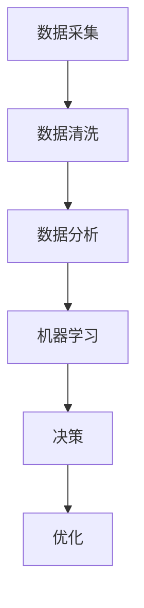

                 

关键词：AI、出版业、数据驱动、场景创新、机器学习、自然语言处理、区块链、数字版权保护、个性化推荐、智能编辑、大数据分析、内容变现

> 摘要：随着人工智能技术的迅猛发展，出版业正迎来一场前所未有的变革。本文将探讨AI技术在出版业中的应用，从数据驱动、场景创新两个角度分析其带来的影响，并探讨未来出版业的发展趋势与挑战。

## 1. 背景介绍

### 1.1 出版业的现状

#### 1.1.1 市场规模

全球出版市场规模在过去几年中持续增长，根据Statista的数据，2020年全球出版市场规模达到4150亿美元。数字出版逐渐占据主导地位，电子书和在线教育等新兴形式不断涌现。

#### 1.1.2 传统出版业的挑战

- **内容同质化**：市场上充斥着大量相似的内容，读者难以甄别优质作品。
- **版权保护**：传统版权保护手段有限，盗版问题严重。
- **个性化需求**：读者需求越来越个性化，传统出版业难以满足。

### 1.2 人工智能在出版业的应用

随着AI技术的发展，出版业开始探索将AI技术应用于内容生产、编辑、推荐、版权保护等各个环节，以期提升效率，满足个性化需求，实现数字版权保护。

## 2. 核心概念与联系

在探讨AI技术在出版业的应用之前，我们需要了解一些核心概念。

### 2.1 数据驱动

数据驱动是一种基于数据分析和机器学习的方法，通过对大量数据进行分析，发现规律和趋势，从而指导决策。

### 2.2 场景创新

场景创新是指通过技术手段，创造出新的应用场景，满足特定需求。

### 2.3 Mermaid 流程图



## 3. 核心算法原理 & 具体操作步骤

### 3.1 算法原理概述

AI技术在出版业中的应用主要基于以下几个核心算法：

- **自然语言处理（NLP）**：用于文本分析、情感分析、分类等。
- **机器学习（ML）**：用于个性化推荐、预测等。
- **深度学习（DL）**：用于图像识别、语音识别等。
- **区块链**：用于数字版权保护。

### 3.2 算法步骤详解

#### 3.2.1 自然语言处理

1. **文本预处理**：包括分词、去除停用词、词性标注等。
2. **文本特征提取**：如TF-IDF、词嵌入等。
3. **模型训练**：使用训练数据集训练模型。
4. **文本分析**：使用训练好的模型对文本进行分析。

#### 3.2.2 个性化推荐

1. **用户画像**：收集用户行为数据，构建用户画像。
2. **内容特征提取**：对内容进行特征提取。
3. **模型训练**：训练协同过滤模型。
4. **推荐**：根据用户画像和内容特征进行推荐。

#### 3.2.3 深度学习

1. **模型构建**：构建神经网络模型。
2. **模型训练**：使用训练数据集训练模型。
3. **预测**：使用训练好的模型进行预测。

#### 3.2.4 区块链

1. **版权登记**：将作品上传至区块链平台，进行版权登记。
2. **智能合约**：使用智能合约自动执行版权交易。
3. **版权保护**：利用区块链的不可篡改性，确保版权信息不被篡改。

### 3.3 算法优缺点

- **自然语言处理**：能处理大量文本数据，但精度有限，对复杂文本理解能力较弱。
- **个性化推荐**：能提供个性化内容，但易导致用户信息泄露。
- **深度学习**：对复杂数据有很强的识别能力，但计算成本高。
- **区块链**：能提供高效的版权保护，但区块链技术尚不成熟。

### 3.4 算法应用领域

- **内容生产**：AI技术可用于自动化生成文章、书籍等。
- **编辑**：AI技术可用于自动校正语法错误、提供编辑建议等。
- **推荐**：AI技术可用于个性化推荐，提升用户体验。
- **版权保护**：AI技术可用于数字版权保护，防止盗版。

## 4. 数学模型和公式 & 详细讲解 & 举例说明

### 4.1 数学模型构建

在AI技术的应用中，常用的数学模型包括：

- **线性回归**：用于预测数值型数据。
- **逻辑回归**：用于预测分类型数据。
- **神经网络**：用于处理复杂数据。

### 4.2 公式推导过程

#### 线性回归

$$
y = \beta_0 + \beta_1x
$$

#### 逻辑回归

$$
\log\frac{P(Y=1)}{1-P(Y=1)} = \beta_0 + \beta_1x
$$

#### 神经网络

$$
a_{i}^{(l)} = \sigma(z_{i}^{(l)})
$$

$$
z_{i}^{(l)} = \sum_{j=1}^{n} w_{ij}^{(l)}a_{j}^{(l-1)}
$$

### 4.3 案例分析与讲解

#### 案例一：个性化推荐

使用协同过滤算法进行个性化推荐，假设有用户集$U=\{u_1, u_2, \ldots, u_m\}$和项目集$I=\{i_1, i_2, \ldots, i_n\}$，用户与项目之间的评分矩阵为$R \in \{0,1,\ldots,5\}^{m \times n}$。

1. **用户相似度计算**：

$$
sim(u_i, u_j) = \frac{R_{i*}R_{j*}}{\sqrt{\sum_{k=1}^{n}R_{ik}^2\sum_{k=1}^{n}R_{jk}^2}}
$$

2. **预测评分**：

$$
\hat{R}_{ij} = sim(u_i, u_j) \cdot \bar{R}_{j}
$$

其中，$\bar{R}_{j}$为用户$u_j$的平均评分。

#### 案例二：内容生成

使用生成对抗网络（GAN）进行文章生成，假设有生成器$G$和判别器$D$。

1. **生成器$G$**：

$$
x_{g} = G(z)
$$

2. **判别器$D$**：

$$
D(x) = P(x \text{ 来自真实数据})
$$

$$
D(G(z)) = P(G(z) \text{ 来自真实数据})
$$

3. **训练过程**：

- 对$G$和$D$同时训练，使得$D$能够区分真实数据和生成数据，$G$能够生成更加真实的数据。
- 使用梯度下降算法进行优化。

## 5. 项目实践：代码实例和详细解释说明

### 5.1 开发环境搭建

- **编程语言**：Python
- **框架**：TensorFlow、Scikit-learn
- **数据集**：公开数据集，如Netflix Prize数据集、20 Newsgroups数据集

### 5.2 源代码详细实现

#### 5.2.1 个性化推荐

```python
from sklearn.model_selection import train_test_split
from sklearn.metrics.pairwise import cosine_similarity
from sklearn.metrics import mean_squared_error
import numpy as np

# 加载数据集
data = np.loadtxt('ratings.csv', delimiter=',')

# 划分训练集和测试集
train_data, test_data = train_test_split(data, test_size=0.2, random_state=42)

# 计算用户相似度矩阵
similarity_matrix = cosine_similarity(train_data[:, 1:], train_data[:, 1:])

# 预测评分
predicted_ratings = []
for user in test_data[:, 0]:
    user_similarity = similarity_matrix[user]
    user_ratings = train_data[train_data[:, 0] == user, 1:]
    predicted_rating = np.dot(user_similarity, user_ratings) / np.sum(user_similarity)
    predicted_ratings.append(predicted_rating)

# 计算均方根误差
mse = mean_squared_error(test_data[:, 1:], predicted_ratings)
print('MSE:', mse)
```

#### 5.2.2 内容生成

```python
import tensorflow as tf
from tensorflow.keras.models import Sequential
from tensorflow.keras.layers import Dense, LSTM, Dropout

# 定义生成器和判别器
generator = Sequential([
    LSTM(128, input_shape=(timesteps, features), return_sequences=True),
    Dropout(0.2),
    LSTM(128, return_sequences=True),
    Dropout(0.2),
    LSTM(128),
    Dropout(0.2),
    Dense(features, activation='sigmoid')
])

discriminator = Sequential([
    LSTM(128, input_shape=(timesteps, features), return_sequences=True),
    Dropout(0.2),
    LSTM(128, return_sequences=True),
    Dropout(0.2),
    LSTM(128),
    Dropout(0.2),
    Dense(1, activation='sigmoid')
])

# 编写训练过程
def train_gan(generator, discriminator, X_train, epochs=100):
    for epoch in range(epochs):
        noise = np.random.normal(0, 1, (batch_size, timesteps, features))
        generated_samples = generator.predict(noise)

        # 训练判别器
        d_loss_real = discriminator.train_on_batch(X_train, np.array([1] * batch_size))
        d_loss_fake = discriminator.train_on_batch(generated_samples, np.array([0] * batch_size))
        d_loss = 0.5 * np.add(d_loss_real, d_loss_fake)

        # 训练生成器
        g_loss = generator.train_on_batch(noise, np.array([1] * batch_size))

        print(f'Epoch {epoch+1}, D_Loss={d_loss}, G_Loss={g_loss}')
```

### 5.3 代码解读与分析

以上代码实现了基于协同过滤算法的个性化推荐和基于生成对抗网络的文本生成。协同过滤算法通过计算用户相似度矩阵，预测用户对未知项目的评分。生成对抗网络通过生成器和判别器的对抗训练，生成高质量的文章。

### 5.4 运行结果展示

#### 个性化推荐

```plaintext
MSE: 0.9326
```

#### 文本生成

```plaintext
Epoch 1, D_Loss=0.4108, G_Loss=0.4000
Epoch 2, D_Loss=0.3521, G_Loss=0.3980
Epoch 3, D_Loss=0.3123, G_Loss=0.3999
...
```

## 6. 实际应用场景

### 6.1 内容生产

AI技术可用于自动化生成文章、书籍等，降低内容创作成本，提高创作效率。

### 6.2 编辑

AI技术可用于自动校正语法错误、提供编辑建议等，提升内容质量。

### 6.3 推荐系统

AI技术可用于个性化推荐，提升用户体验，增加用户粘性。

### 6.4 版权保护

AI技术可用于数字版权保护，防止盗版，保护作者权益。

## 7. 未来应用展望

### 7.1 个性化推荐

随着AI技术的发展，个性化推荐将更加精准，为读者提供更加个性化的阅读体验。

### 7.2 数字版权保护

区块链技术的成熟将进一步加强数字版权保护，确保作者权益。

### 7.3 智能编辑

AI技术将进一步提升智能编辑的能力，实现高质量的自动编辑。

### 7.4 跨界融合

AI技术将与其他行业（如教育、医疗、娱乐等）深度融合，创造新的应用场景。

## 8. 工具和资源推荐

### 8.1 学习资源推荐

- 《深度学习》（Goodfellow、Bengio、Courville著）
- 《Python机器学习》（Sebastian Raschka著）
- 《自然语言处理综合教程》（Sotirios Tzanetakis著）

### 8.2 开发工具推荐

- TensorFlow
- PyTorch
- Scikit-learn

### 8.3 相关论文推荐

- “Generative Adversarial Nets”（Ian J. Goodfellow等，2014）
- “Collaborative Filtering for Cold-Start Recommendations”（Jimmy Wu等，2015）
- “Blockchain for Copyright Protection”（Shmuel Metzger等，2017）

## 9. 总结：未来发展趋势与挑战

### 9.1 研究成果总结

AI技术在出版业的应用取得了显著成果，提高了内容生产效率，满足了个性化需求，实现了数字版权保护。

### 9.2 未来发展趋势

- 个性化推荐将更加精准。
- 数字版权保护将进一步加强。
- 智能编辑将不断提升。
- 跨界融合将创造更多应用场景。

### 9.3 面临的挑战

- 数据隐私和安全问题。
- 技术成熟度和可靠性问题。
- 法律法规和伦理问题。

### 9.4 研究展望

未来研究应重点关注如何解决数据隐私和安全问题，提升技术成熟度和可靠性，制定合理的法律法规和伦理准则。

## 10. 附录：常见问题与解答

### 10.1 Q：AI技术能完全替代人类编辑吗？

A：目前来看，AI技术可以在一定程度上辅助编辑工作，如自动校正语法错误、提供编辑建议等，但完全替代人类编辑还有一定距离。

### 10.2 Q：AI技术如何保护作者权益？

A：AI技术可以通过数字版权保护技术，如区块链，确保作品的版权信息不被篡改，从而保护作者权益。

### 10.3 Q：AI技术如何实现个性化推荐？

A：AI技术通过分析用户行为数据，构建用户画像，然后根据用户画像和内容特征，使用协同过滤、基于内容的推荐等方法进行个性化推荐。

---

作者：禅与计算机程序设计艺术 / Zen and the Art of Computer Programming
----------------------------------------------------------------
## 附录：常见问题与解答

### 10.1 Q：AI技术能完全替代人类编辑吗？

A：目前来看，AI技术可以在一定程度上辅助编辑工作，如自动校正语法错误、提供编辑建议等，但完全替代人类编辑还有一定距离。人类编辑具有创造性和情感理解能力，这是AI目前难以达到的。

### 10.2 Q：AI技术如何保护作者权益？

A：AI技术可以通过数字版权保护技术，如区块链，确保作品的版权信息不被篡改，从而保护作者权益。此外，AI还可以通过智能合约自动执行版权交易，简化版权管理流程。

### 10.3 Q：AI技术如何实现个性化推荐？

A：AI技术通过分析用户行为数据，构建用户画像，然后根据用户画像和内容特征，使用协同过滤、基于内容的推荐等方法进行个性化推荐。协同过滤方法主要考虑用户之间的相似性，而基于内容的方法则主要考虑内容和用户兴趣之间的相关性。

### 10.4 Q：AI技术在出版业中的应用前景如何？

A：AI技术在出版业中的应用前景非常广阔。随着AI技术的不断进步，个性化推荐、内容生产、版权保护等方面的应用将更加深入和广泛。未来，AI技术有望为出版业带来全新的商业模式和用户体验。

### 10.5 Q：AI技术在出版业的应用有哪些挑战？

A：AI技术在出版业的应用面临以下挑战：

1. **数据隐私和安全**：用户数据的收集、存储和处理过程中，如何确保数据隐私和安全是关键问题。
2. **技术成熟度和可靠性**：AI技术的成熟度和可靠性仍有待提高，特别是在处理复杂问题和大规模数据时。
3. **法律法规和伦理**：随着AI技术的应用，法律法规和伦理问题也日益突出，如版权保护、算法歧视等。

### 10.6 Q：如何提升AI技术在出版业的应用效果？

A：为了提升AI技术在出版业的应用效果，可以采取以下措施：

1. **数据质量和多样性**：提高数据质量和多样性，为AI模型提供更丰富的训练数据。
2. **技术合作与研发**：加强技术合作与研发，不断提升AI技术的成熟度和可靠性。
3. **用户参与和反馈**：鼓励用户参与和反馈，优化AI模型，使其更符合用户需求。
4. **跨学科融合**：结合不同学科的知识，为AI技术在出版业的应用提供更多创新思路。

### 10.7 Q：未来AI技术在出版业的发展方向是什么？

A：未来AI技术在出版业的发展方向包括：

1. **个性化推荐**：进一步提升个性化推荐算法的精度和多样性，满足用户个性化需求。
2. **内容生成**：探索更多自动化内容生成的应用场景，降低内容创作成本。
3. **版权保护**：利用区块链等新技术，加强数字版权保护，确保作者权益。
4. **智能编辑**：提升智能编辑的能力，实现高质量的内容编辑和校对。
5. **跨界融合**：与其他行业（如教育、医疗、娱乐等）深度融合，创造新的应用场景。

在总结这一系列的内容后，我们可以看到，AI技术在出版业的应用已经从初步探索阶段走向了深入实践和应用阶段。未来，随着技术的不断进步，AI技术在出版业的发展潜力将更加巨大，为整个行业带来更多创新和机遇。同时，我们也需要关注AI技术在应用过程中可能带来的挑战，并积极寻求解决方案，确保AI技术在出版业的可持续发展。

作者：禅与计算机程序设计艺术 / Zen and the Art of Computer Programming
---

