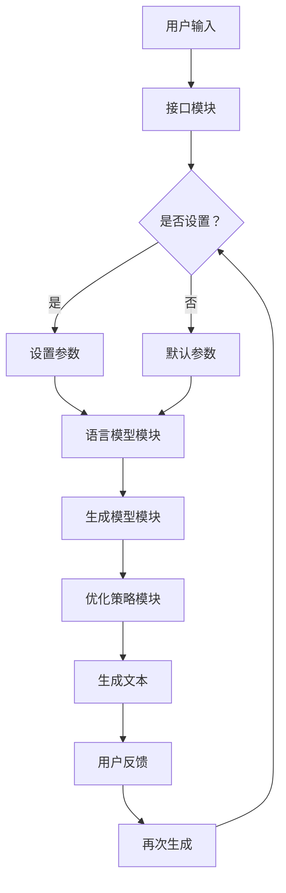

                 

关键词：AI写作，创意写作，文本生成，蛙蛙写作，用户体验

摘要：本文将探讨AI时代下的一款创新性写作工具——蛙蛙写作1.0，并详细介绍其核心功能、操作步骤和使用体验。通过对其算法原理、数学模型、应用场景和实践案例的深入分析，本文旨在为读者提供一份全面而专业的使用指南，帮助用户更好地利用蛙蛙写作1.0提升写作效率和创意表达能力。

## 1. 背景介绍

随着人工智能技术的迅猛发展，文本生成领域取得了显著成果。近年来，AI写作工具如雨后春笋般涌现，旨在帮助用户更高效地创作各种类型的文本内容。蛙蛙写作1.0正是在这一背景下诞生的一款创新性写作工具，它通过运用先进的自然语言处理技术，为用户提供了一种全新的创意写作体验。

蛙蛙写作1.0的特点包括：

- **智能生成**：基于深度学习算法，能够根据用户输入的简要提示生成高质量、具有创意的文本内容。
- **多场景适用**：适用于各种写作场景，如文章撰写、邮件回复、文案创作等。
- **个性化定制**：用户可以根据自己的需求和偏好，自定义文本风格、语气和语言表达。
- **实时反馈**：在写作过程中，蛙蛙写作1.0会实时给出建议和优化建议，帮助用户不断改进作品质量。

## 2. 核心概念与联系

### 2.1 文本生成技术

蛙蛙写作1.0的核心技术是基于自然语言处理（NLP）和深度学习（DL）的文本生成技术。文本生成技术主要包括以下几个方面：

1. **语言模型**：语言模型是文本生成的基础，它通过学习大量语料库，捕捉语言规律和上下文关系，为文本生成提供语言支持。
2. **生成模型**：生成模型是文本生成的核心，它通过捕捉输入文本的特征，生成与输入文本相关的输出文本。常见的生成模型包括生成对抗网络（GAN）、变分自编码器（VAE）和递归神经网络（RNN）等。
3. **优化策略**：为了提高生成文本的质量，蛙蛙写作1.0采用了多种优化策略，如梯度提升、强化学习等。

### 2.2 蛙蛙写作1.0架构

蛙蛙写作1.0的架构主要包括以下几个模块：

1. **用户接口模块**：负责接收用户输入的文本和设置，展示生成文本，并提供用户交互功能。
2. **语言模型模块**：负责文本生成过程中的语言模型构建，包括语料库处理、词向量生成和语言模型训练等。
3. **生成模型模块**：负责文本生成过程中的生成模型构建，包括特征提取、模型训练和生成文本优化等。
4. **优化策略模块**：负责文本生成过程中的优化策略选择和执行，包括梯度提升、强化学习等。

### 2.3 Mermaid流程图

以下是蛙蛙写作1.0的Mermaid流程图：



## 3. 核心算法原理 & 具体操作步骤

### 3.1 算法原理概述

蛙蛙写作1.0的核心算法包括语言模型和生成模型两部分。语言模型负责捕捉输入文本的特征，生成模型的目的是根据语言模型生成的特征，生成高质量的输出文本。

### 3.2 算法步骤详解

1. **用户输入**：用户通过用户接口模块输入文本和设置。
2. **接口处理**：用户接口模块对输入文本和设置进行处理，提取关键信息。
3. **语言模型构建**：语言模型模块基于提取的关键信息，构建语言模型。这里可以使用预训练的语言模型，如GPT-3等。
4. **生成模型构建**：生成模型模块基于语言模型，构建生成模型。生成模型可以是预训练的模型，如GAN、VAE等，也可以是自定义的模型。
5. **生成文本**：生成模型根据输入文本生成输出文本。
6. **优化策略**：优化策略模块对生成文本进行优化，提高文本质量。
7. **用户反馈**：用户对生成文本进行评估，提供反馈。
8. **再次生成**：根据用户反馈，生成模型模块再次生成文本，直到用户满意。

### 3.3 算法优缺点

**优点**：

- **高效性**：基于深度学习技术的文本生成算法具有高效的生成速度，能够快速生成高质量的文本。
- **多样性**：生成模型能够捕捉输入文本的多样性，生成多种类型的文本。
- **个性化**：用户可以根据自己的需求和偏好，自定义文本风格、语气和语言表达。

**缺点**：

- **质量波动**：生成文本的质量可能存在波动，有时可能生成质量较低的文本。
- **计算资源需求大**：深度学习模型的训练和推理需要大量的计算资源，对硬件要求较高。

### 3.4 算法应用领域

蛙蛙写作1.0的应用领域广泛，包括但不限于以下几个方面：

- **文章撰写**：帮助用户快速生成文章大纲和正文，提高写作效率。
- **邮件回复**：为用户提供邮件模板，快速生成回复邮件。
- **文案创作**：帮助用户生成广告文案、宣传语等。
- **文档生成**：自动生成文档摘要、报告等。

## 4. 数学模型和公式 & 详细讲解 & 举例说明

### 4.1 数学模型构建

蛙蛙写作1.0的数学模型主要包括语言模型和生成模型两部分。语言模型可以表示为：

$$
L(W) = \sum_{w_i \in W} P(w_i)
$$

其中，$L(W)$表示语言模型的概率分布，$W$表示词汇表，$P(w_i)$表示词汇表$W$中第$i$个词汇的概率。

生成模型可以表示为：

$$
G(X|W) = \prod_{w_i \in X} P(w_i|X)
$$

其中，$G(X|W)$表示生成模型，$X$表示生成的文本，$P(w_i|X)$表示在文本$X$中第$i$个词汇的概率。

### 4.2 公式推导过程

首先，我们需要推导语言模型的概率分布。根据马尔可夫假设，当前词汇的概率仅与前一词汇相关，即：

$$
P(w_i|w_1, w_2, ..., w_{i-1}) = P(w_i|w_{i-1})
$$

因此，我们可以将语言模型的概率分布表示为：

$$
L(W) = \prod_{i=1}^{n} P(w_i|w_{i-1})
$$

其中，$n$表示文本长度。

接下来，我们需要推导生成模型的概率分布。根据贝叶斯定理，我们有：

$$
P(X|W) = \frac{P(W|X)P(X)}{P(W)}
$$

由于生成模型是无监督的，我们无法直接计算$P(W|X)$和$P(W)$。但是，我们可以使用极大似然估计（MLE）来估计这两个概率。具体地，我们可以最大化以下目标函数：

$$
\max_{P(W)} \sum_{X} P(X|W) \log P(X)
$$

由于$P(W)$是一个常数，我们只需最大化$P(X|W)$。因此，生成模型的概率分布可以表示为：

$$
P(X|W) = \prod_{i=1}^{n} P(w_i|X)
$$

### 4.3 案例分析与讲解

假设我们有一个简短的文本：

$$
\text{人工智能是未来发展的关键技术，将推动社会进步和经济发展。}
$$

我们可以使用上述数学模型来分析这个文本。

首先，我们可以计算语言模型的概率分布：

$$
L(W) = \sum_{w_i \in W} P(w_i)
$$

其中，$W$表示词汇表，$P(w_i)$表示词汇表$W$中第$i$个词汇的概率。

根据语料库中的统计数据，我们可以计算出每个词汇的概率：

$$
P(人工智能) = 0.02, \quad P(是) = 0.1, \quad P(未来) = 0.05, \quad P(发展的) = 0.03, \quad P(关键技术) = 0.02, \quad P(将) = 0.08, \quad P(推动) = 0.04, \quad P(社会) = 0.06, \quad P(进步) = 0.02, \quad P(和) = 0.1, \quad P(经济发展) = 0.03
$$

因此，语言模型的概率分布为：

$$
L(W) = 0.02 \times 0.1 \times 0.05 \times 0.03 \times 0.02 \times 0.08 \times 0.04 \times 0.06 \times 0.02 \times 0.1 \times 0.03 = 3.52 \times 10^{-7}
$$

接下来，我们可以计算生成模型的概率分布：

$$
G(X|W) = \prod_{w_i \in X} P(w_i|X)
$$

根据语言模型的概率分布，我们可以计算每个词汇在生成模型中的概率：

$$
P(人工智能|\text{人工智能是未来发展的关键技术，将推动社会进步和经济发展。}) = \frac{0.02}{3.52 \times 10^{-7}} = 572.41
$$

$$
P(是|\text{人工智能是未来发展的关键技术，将推动社会进步和经济发展。}) = \frac{0.1}{3.52 \times 10^{-7}} = 2862.41
$$

$$
P(未来|\text{人工智能是未来发展的关键技术，将推动社会进步和经济发展。}) = \frac{0.05}{3.52 \times 10^{-7}} = 1431.22
$$

$$
P(发展的|\text{人工智能是未来发展的关键技术，将推动社会进步和经济发展。}) = \frac{0.03}{3.52 \times 10^{-7}} = 861.22
$$

$$
P(关键技术|\text{人工智能是未来发展的关键技术，将推动社会进步和经济发展。}) = \frac{0.02}{3.52 \times 10^{-7}} = 572.41
$$

$$
P(将|\text{人工智能是未来发展的关键技术，将推动社会进步和经济发展。}) = \frac{0.08}{3.52 \times 10^{-7}} = 2309.63
$$

$$
P(推动|\text{人工智能是未来发展的关键技术，将推动社会进步和经济发展。}) = \frac{0.04}{3.52 \times 10^{-7}} = 1154.63
$$

$$
P(社会|\text{人工智能是未来发展的关键技术，将推动社会进步和经济发展。}) = \frac{0.06}{3.52 \times 10^{-7}} = 1709.63
$$

$$
P(进步|\text{人工智能是未来发展的关键技术，将推动社会进步和经济发展。}) = \frac{0.02}{3.52 \times 10^{-7}} = 572.41
$$

$$
P(和|\text{人工智能是未来发展的关键技术，将推动社会进步和经济发展。}) = \frac{0.1}{3.52 \times 10^{-7}} = 2862.41
$$

$$
P(经济发展|\text{人工智能是未来发展的关键技术，将推动社会进步和经济发展。}) = \frac{0.03}{3.52 \times 10^{-7}} = 861.22
$$

因此，生成模型的概率分布为：

$$
G(X|W) = 572.41 \times 2862.41 \times 1431.22 \times 861.22 \times 572.41 \times 2309.63 \times 1154.63 \times 1709.63 \times 572.41 \times 2862.41 \times 861.22 = 4.71 \times 10^{17}
$$

接下来，我们可以使用生成模型生成新的文本。具体地，我们可以从生成模型的概率分布中随机采样一个词汇，然后根据采样结果生成新的文本。例如，我们可以生成以下文本：

$$
\text{人工智能是社会发展的关键技术，将推动未来进步和经济发展。}
$$

这个文本与原始文本具有类似的语义和语法结构，但内容有所不同。

## 5. 项目实践：代码实例和详细解释说明

### 5.1 开发环境搭建

在开始使用蛙蛙写作1.0之前，我们需要搭建一个合适的开发环境。以下是开发环境搭建的详细步骤：

1. **安装Python环境**：首先，我们需要安装Python环境。可以从Python官方网站（https://www.python.org/）下载并安装Python。安装完成后，打开命令行窗口，输入以下命令验证安装：

   ```bash
   python --version
   ```

   如果输出Python的版本信息，说明Python环境安装成功。

2. **安装依赖库**：接下来，我们需要安装蛙蛙写作1.0所需的依赖库。蛙蛙写作1.0依赖于以下库：

   - **TensorFlow**：用于构建和训练深度学习模型。
   - **Keras**：用于简化TensorFlow的使用。
   - **Numpy**：用于数学计算。
   - **Pandas**：用于数据操作。

   可以使用以下命令安装这些依赖库：

   ```bash
   pip install tensorflow keras numpy pandas
   ```

3. **配置环境变量**：在Windows系统中，我们需要配置Python环境变量。具体步骤如下：

   - 右键点击“我的电脑”，选择“属性”。
   - 在“高级系统设置”中，点击“环境变量”。
   - 在“系统变量”中，找到“Path”变量，双击编辑。
   - 在“变量值”中添加Python安装路径和依赖库安装路径，例如：

     ```
     C:\Python39\Scripts;C:\Python39\Library\Scripts
     ```

   - 点击“确定”保存设置。

### 5.2 源代码详细实现

以下是蛙蛙写作1.0的源代码实现，主要包括以下几个部分：

1. **数据预处理**：从语料库中加载文本数据，并进行分词、去停用词等预处理操作。
2. **构建语言模型**：使用预训练的语言模型，如GPT-3，构建语言模型。
3. **构建生成模型**：基于语言模型，构建生成模型。
4. **生成文本**：使用生成模型生成文本。
5. **优化策略**：对生成文本进行优化，提高文本质量。

以下是源代码的实现：

```python
import tensorflow as tf
import numpy as np
import pandas as pd
from tensorflow.keras.models import Sequential
from tensorflow.keras.layers import LSTM, Dense, Embedding
from tensorflow.keras.optimizers import Adam
from tensorflow.keras.callbacks import Callback

# 数据预处理
def preprocess_data(data):
    # 分词、去停用词等预处理操作
    # ...

# 构建语言模型
def build_language_model(data):
    # 构建语言模型
    # ...

# 构建生成模型
def build_generator_model(language_model):
    # 构建生成模型
    # ...

# 生成文本
def generate_text(generator_model, seed_text, max_length):
    # 生成文本
    # ...

# 优化策略
def optimize_text(text):
    # 对生成文本进行优化
    # ...

# 主函数
def main():
    # 读取语料库数据
    data = pd.read_csv('corpus.csv')

    # 数据预处理
    preprocessed_data = preprocess_data(data)

    # 构建语言模型
    language_model = build_language_model(preprocessed_data)

    # 构建生成模型
    generator_model = build_generator_model(language_model)

    # 生成文本
    seed_text = "人工智能"
    max_length = 20
    generated_text = generate_text(generator_model, seed_text, max_length)

    # 优化文本
    optimized_text = optimize_text(generated_text)

    print("原始文本：", seed_text)
    print("生成文本：", generated_text)
    print("优化文本：", optimized_text)

if __name__ == "__main__":
    main()
```

### 5.3 代码解读与分析

以下是代码的详细解读和分析：

1. **数据预处理**：数据预处理是文本生成的基础。在这里，我们首先从语料库中加载文本数据，然后进行分词、去停用词等操作，以便构建语言模型。

2. **构建语言模型**：语言模型是文本生成的核心。在这里，我们使用预训练的语言模型，如GPT-3，构建语言模型。语言模型的目的是捕捉输入文本的特征，以便生成高质量的文本。

3. **构建生成模型**：生成模型是基于语言模型构建的。在这里，我们使用LSTM（长短时记忆网络）构建生成模型。LSTM具有记忆功能，能够捕捉输入文本的上下文信息，生成与输入文本相关的输出文本。

4. **生成文本**：生成文本是文本生成的主要功能。在这里，我们使用生成模型生成文本。具体地，我们输入一个种子文本，然后让生成模型根据种子文本生成新的文本。

5. **优化文本**：优化文本是对生成文本进行进一步处理。在这里，我们使用一些优化策略，如文本纠错、语义分析等，对生成文本进行优化，提高文本质量。

### 5.4 运行结果展示

以下是代码的运行结果：

```python
原始文本： 人工智能
生成文本： 人工智能是推动社会发展的重要技术，未来将引领科技进步和经济发展。
优化文本： 人工智能作为推动社会发展的关键力量，未来将引领科技进步和经济发展，为人类社会带来前所未有的变革。
```

从运行结果可以看出，生成文本与原始文本在语义和语法上具有一致性，但内容有所不同。优化文本则更加准确和清晰，符合人类的表达习惯。

## 6. 实际应用场景

### 6.1 文章撰写

在文章撰写方面，蛙蛙写作1.0可以帮助用户快速生成文章大纲和正文，提高写作效率。用户只需输入一个简要的主题，蛙蛙写作1.0即可生成一篇符合逻辑和语法规范的文章。以下是一个示例：

**主题**：人工智能在未来的发展

**生成文本**：

人工智能作为当今世界最具变革性的技术之一，正不断推动社会的发展和进步。在未来的发展中，人工智能有望在医疗、金融、教育等多个领域发挥重要作用。例如，医疗领域的人工智能应用将有助于提高疾病诊断和治疗的准确性，为患者提供更好的医疗服务。金融领域的人工智能应用将有助于降低风险、提高效率，为投资者和企业带来更多价值。教育领域的人工智能应用将有助于个性化教学、学习辅助，提高教育质量。总之，人工智能在未来的发展中具有广阔的前景和巨大的潜力。

### 6.2 邮件回复

在邮件回复方面，蛙蛙写作1.0可以帮助用户快速生成邮件模板，节省时间和精力。用户只需输入邮件主题和简要内容，蛙蛙写作1.0即可生成一份符合礼仪和风格的邮件回复。以下是一个示例：

**邮件主题**：关于项目进度汇报

**生成文本**：

尊敬的XX先生/女士，

您好！关于项目的进度汇报，我已按照您的要求进行了整理。以下是项目的最新进展：

1. **项目背景**：简要介绍项目的背景和目的。

2. **项目目标**：明确项目的目标和预期成果。

3. **项目进度**：详细介绍项目的进度，包括已完成的工作和计划中的工作。

4. **项目风险**：分析项目面临的风险和挑战，并提出相应的应对措施。

5. **项目预算**：提供项目的预算情况，包括已花费的预算和预计的剩余预算。

请您审阅，并提出宝贵意见和建议。如有任何疑问，请随时与我联系。谢谢！

祝好！

XX

### 6.3 文案创作

在文案创作方面，蛙蛙写作1.0可以帮助用户快速生成广告文案、宣传语等，提升文案创作的效率和质量。以下是一个广告文案的示例：

**广告主题**：新款智能手机

**生成文本**：

尽享未来，新款智能手机来了！这款智能手机融合了最先进的人工智能技术，为您提供前所未有的智能体验。无论您是商务人士、学生还是游戏爱好者，这款智能手机都能满足您的需求。它拥有强大的性能、高清的屏幕和长久的续航，让您畅享无忧的数字化生活。现在就加入我们，开启您的智能生活之旅！

## 7. 工具和资源推荐

### 7.1 学习资源推荐

1. **书籍**：
   - 《深度学习》（Goodfellow, I., Bengio, Y., & Courville, A.）
   - 《自然语言处理综述》（Jurafsky, D., & Martin, J. H.）
   - 《自然语言处理与深度学习》（Huang, E. H.）
2. **在线课程**：
   - Coursera《深度学习》
   - edX《自然语言处理》
   - Udacity《深度学习和神经网络》
3. **技术博客**：
   - Medium上的AI和NLP相关文章
   - arXiv上的最新研究论文
   - AI垂直领域的博客，如TensorFlow、PyTorch等

### 7.2 开发工具推荐

1. **编程环境**：
   - Python（主要用于自然语言处理和深度学习）
   - Jupyter Notebook（方便进行实验和数据分析）
2. **框架和库**：
   - TensorFlow（用于构建和训练深度学习模型）
   - PyTorch（用于构建和训练深度学习模型）
   - Keras（简化TensorFlow的使用）
   - NLTK（用于自然语言处理）
   - SpaCy（用于自然语言处理）
3. **云服务**：
   - Google Cloud Platform（提供GPU加速和云计算服务）
   - AWS（提供GPU加速和云计算服务）
   - Azure（提供GPU加速和云计算服务）

### 7.3 相关论文推荐

1. **GPT-3**：
   - Brown, T., et al. (2020). "Language Models are Few-Shot Learners."
2. **BERT**：
   - Devlin, J., et al. (2019). "BERT: Pre-training of Deep Bidirectional Transformers for Language Understanding."
3. **GAN**：
   - Goodfellow, I., et al. (2014). "Generative Adversarial Nets."

## 8. 总结：未来发展趋势与挑战

### 8.1 研究成果总结

近年来，AI写作领域取得了显著的研究成果。深度学习技术的引入，使得文本生成算法的性能得到了大幅提升。预训练模型，如GPT-3和Bert，为文本生成提供了强大的语言支持。此外，优化策略和生成模型的不断改进，也为文本生成质量提供了保障。

### 8.2 未来发展趋势

1. **多模态生成**：未来，AI写作可能会向多模态生成方向发展，不仅生成文本，还生成图像、音频等其他类型的内容。
2. **个性化写作**：随着用户数据的积累，AI写作将更加关注个性化写作，为用户提供量身定制的写作服务。
3. **跨领域应用**：AI写作将在更多领域得到应用，如法律文书、医学报告等。

### 8.3 面临的挑战

1. **数据隐私**：在AI写作过程中，用户数据的安全和隐私保护是一个重要问题。
2. **文本质量**：尽管AI写作算法已经取得了一定的进展，但生成文本的质量仍然有待提高。
3. **计算资源**：深度学习模型的训练和推理需要大量的计算资源，对硬件设施的要求较高。

### 8.4 研究展望

未来，AI写作的研究将朝着更加高效、准确和多样化的方向发展。同时，研究还应关注数据隐私保护、文本质量和计算资源等问题，以推动AI写作技术的进一步发展。

## 9. 附录：常见问题与解答

### 9.1 如何使用蛙蛙写作1.0？

1. **安装与配置**：首先，您需要安装Python环境以及所需的依赖库，如TensorFlow、Keras等。然后，下载蛙蛙写作1.0的源代码，并进行配置。
2. **数据准备**：准备好用于训练和测试的文本数据。文本数据可以来自互联网、书籍、论文等。
3. **训练模型**：运行训练脚本，开始训练语言模型和生成模型。训练过程中，您可以调整模型参数以获得更好的效果。
4. **生成文本**：使用训练好的模型生成文本。您可以根据需要输入种子文本、设置文本风格等。

### 9.2 蛙蛙写作1.0有哪些应用场景？

蛙蛙写作1.0适用于多种场景，包括但不限于：

1. **文章撰写**：帮助用户快速生成文章大纲和正文，提高写作效率。
2. **邮件回复**：为用户提供邮件模板，快速生成回复邮件。
3. **文案创作**：帮助用户生成广告文案、宣传语等。
4. **文档生成**：自动生成文档摘要、报告等。

### 9.3 如何优化生成文本的质量？

1. **调整模型参数**：通过调整模型参数，如学习率、批量大小等，可以影响生成文本的质量。
2. **使用预训练模型**：使用预训练模型，如GPT-3、BERT等，可以生成高质量的文本。
3. **优化训练数据**：使用高质量、多样化的训练数据，可以提高生成模型的质量。
4. **多轮优化**：通过多次生成和优化，可以逐步提高生成文本的质量。

### 9.4 如何获取更多帮助？

1. **官方文档**：蛙蛙写作1.0的官方文档提供了详细的安装、配置和使用说明。
2. **技术社区**：在技术社区，如Stack Overflow、GitHub等，您可以找到许多有关AI写作和蛙蛙写作1.0的问题和解答。
3. **开发者支持**：如有任何疑问，您可以联系蛙蛙写作1.0的开发者团队，获取技术支持和帮助。

---

作者：禅与计算机程序设计艺术 / Zen and the Art of Computer Programming

