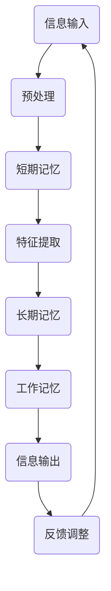

                 

关键词：AI时代，记忆力增强，Weaver模型，认知计算，神经网络，深度学习，记忆优化，人机交互

## 摘要

本文探讨了AI时代下记忆力增强的重要性以及Weaver模型在这一领域的独特优势。随着人工智能技术的飞速发展，人类与机器的互动越来越频繁，如何通过AI技术提升人的认知能力成为一个亟待解决的问题。Weaver模型作为一种先进的认知计算框架，通过模拟人脑记忆机制，为AI时代的记忆力增强提供了新的路径。本文将从背景介绍、核心概念与联系、核心算法原理与操作步骤、数学模型与公式、项目实践、实际应用场景、未来应用展望、工具和资源推荐、总结与展望等多个方面，全面解析Weaver模型的记忆优势及其在AI时代的广泛应用前景。

## 1. 背景介绍

在当今的AI时代，数据爆炸式增长以及信息过载现象使得人类在处理信息和记忆方面的压力越来越大。传统的记忆方法已经无法满足现代社会的需求，而人工智能技术的发展为解决这一难题提供了新的可能性。记忆力是认知能力的重要组成部分，良好的记忆力有助于提高工作效率、增强学习能力、优化决策过程。然而，人类的记忆力存在局限性，无法长时间高效地记忆和处理大量信息。

人工智能技术的发展，特别是深度学习和神经网络的兴起，为模拟和增强人类记忆提供了技术基础。通过学习人脑的神经结构和功能，研究人员提出了各种记忆模型，试图在机器中实现类似人类记忆的能力。Weaver模型正是其中一种具有代表性的认知计算框架，它通过模拟人脑的多层次记忆机制，实现了对信息的持久化和高效处理。

本文的目的在于深入探讨Weaver模型在记忆力增强方面的优势，分析其核心算法原理、数学模型以及实际应用，并展望其在未来的发展前景。希望通过本文的研究，能够为AI时代的记忆力增强提供一些有益的思路和实际指导。

## 2. 核心概念与联系

### 2.1 认知计算与Weaver模型

认知计算是人工智能的一个分支，旨在模拟人类思维过程，实现更高级别的智能行为。Weaver模型作为一种认知计算框架，其设计灵感来源于人类大脑的多层次记忆机制。它通过模拟人脑的神经结构和功能，实现了对信息的持久化和高效处理。

Weaver模型的核心在于其多层次记忆架构，包括短期记忆、长期记忆和工作记忆。短期记忆主要负责存储和处理当前输入的信息，长期记忆则用于存储长期记忆信息，而工作记忆则负责在需要时调用这些信息。这种多层次记忆机制能够有效地模拟人类记忆的过程，使机器能够更好地理解和处理复杂信息。

### 2.2 神经网络与深度学习

神经网络是Weaver模型的基础，它是一种模仿人脑神经元连接结构的计算模型。深度学习则是神经网络的一种扩展，通过堆叠多层神经网络，实现对复杂数据的自动特征学习和模式识别。

神经网络和深度学习在Weaver模型中的应用主要体现在两个方面。首先，神经网络用于模拟人脑的神经元连接和信号传递过程，从而实现信息的存储和处理。其次，深度学习通过大规模的数据训练，使神经网络能够自动学习和优化其参数，从而提高记忆模型的性能和准确性。

### 2.3 Mermaid流程图

为了更清晰地展示Weaver模型的工作流程，我们使用Mermaid流程图来描述其核心步骤和联系。



在这个流程图中，信息输入是整个流程的起点，经过预处理后进入短期记忆，然后在特征提取阶段被转化为可存储的信息，存储在长期记忆中。工作记忆在需要时从长期记忆中调用信息，并进行输出和处理。最后，通过反馈机制调整模型的参数，以优化其性能。

### 2.4 核心概念原理与架构联系

Weaver模型的核心概念包括短期记忆、长期记忆和工作记忆。这些概念在人脑和机器中都有相应的对应部分。

- **短期记忆**：在人脑中，短期记忆主要通过神经元之间的突触连接来实现。在Weaver模型中，短期记忆通过神经网络的结构和参数来模拟。
- **长期记忆**：人脑的长期记忆是通过神经元之间的持久连接来实现的。在Weaver模型中，长期记忆通过深度学习的训练和参数优化来模拟。
- **工作记忆**：人脑的工作记忆主要通过神经元的活动和信号传递来实现。在Weaver模型中，工作记忆通过神经网络和深度学习的技术来实现。

这些概念在Weaver模型中的联系和相互作用构成了模型的核心机制。通过这种多层次记忆机制，Weaver模型能够实现信息的持久化和高效处理，从而提升机器的智能水平。

## 3. 核心算法原理 & 具体操作步骤

### 3.1 算法原理概述

Weaver模型的核心算法基于多层次记忆架构，通过模拟人脑的神经结构和功能，实现了对信息的持久化和高效处理。具体来说，Weaver模型包括以下三个主要模块：

1. **短期记忆模块**：负责存储和处理当前输入的信息。该模块通过神经网络的结构和参数来模拟人脑的短期记忆机制。
2. **长期记忆模块**：负责存储长期记忆信息。该模块通过深度学习的训练和参数优化来模拟人脑的长期记忆机制。
3. **工作记忆模块**：负责在需要时从长期记忆中调用信息，并进行输出和处理。该模块通过神经网络和深度学习的技术来实现。

### 3.2 算法步骤详解

Weaver模型的工作流程可以分为以下六个主要步骤：

1. **信息输入**：首先，将待处理的信息输入到Weaver模型中。
2. **预处理**：对输入信息进行预处理，包括去噪、归一化和特征提取等。预处理步骤的目的是提高信息的质量和便于后续处理。
3. **短期记忆存储**：将预处理后的信息存储到短期记忆模块中。短期记忆模块通过神经网络的结构和参数来模拟人脑的短期记忆机制，实现信息的快速存储和处理。
4. **特征提取**：在短期记忆模块中提取关键特征，以便于长期存储和调用。特征提取的目的是将原始信息转化为更为简洁和有效的形式。
5. **长期记忆存储**：将提取的关键特征存储到长期记忆模块中。长期记忆模块通过深度学习的训练和参数优化来模拟人脑的长期记忆机制，实现信息的持久化存储。
6. **信息输出与处理**：当需要调用信息时，从长期记忆模块中检索所需的信息，并通过工作记忆模块进行输出和处理。工作记忆模块通过神经网络和深度学习的技术来实现。

### 3.3 算法优缺点

Weaver模型作为一种基于多层次记忆架构的智能模型，具有以下优点和缺点：

- **优点**：
  - 能够模拟人脑的记忆机制，实现信息的持久化和高效处理。
  - 通过深度学习技术，可以自动学习和优化参数，提高模型的性能和准确性。
  - 具有较好的灵活性和适应性，可以应用于各种场景。

- **缺点**：
  - 模型训练过程较为复杂，需要大量数据和计算资源。
  - 模型的解释性较差，难以理解其具体的工作原理。

### 3.4 算法应用领域

Weaver模型在多个领域具有广泛的应用前景，包括：

- **智能问答系统**：通过长期记忆模块存储大量知识，实现高效的知识检索和回答。
- **自然语言处理**：利用工作记忆模块进行上下文信息的处理，提高文本理解和生成能力。
- **智能推荐系统**：通过长期记忆模块存储用户历史行为数据，实现个性化推荐。
- **自动驾驶**：通过工作记忆模块实时处理道路信息和环境变化，提高自动驾驶的稳定性。

## 4. 数学模型和公式 & 详细讲解 & 举例说明

### 4.1 数学模型构建

Weaver模型的数学模型构建基于多层次记忆架构，主要包括以下三个方面：

1. **短期记忆模型**：采用神经网络模型进行构建，主要包括输入层、隐藏层和输出层。输入层负责接收外部输入信息，隐藏层负责进行特征提取和计算，输出层负责输出处理结果。
2. **长期记忆模型**：采用深度学习模型进行构建，通过多层神经网络结构进行参数优化和特征学习。长期记忆模型的主要目的是存储和提取大量特征信息。
3. **工作记忆模型**：采用神经网络模型进行构建，主要包括输入层、隐藏层和输出层。输入层负责接收来自长期记忆模块的信息，隐藏层负责进行信息处理和计算，输出层负责输出处理结果。

### 4.2 公式推导过程

为了更清晰地理解Weaver模型的数学模型，下面将分别介绍短期记忆模型、长期记忆模型和工作记忆模型的公式推导过程。

#### 短期记忆模型

短期记忆模型的公式推导主要涉及神经网络的前向传播和反向传播算法。假设神经网络由输入层、隐藏层和输出层组成，输入层有 \( n \) 个神经元，隐藏层有 \( m \) 个神经元，输出层有 \( k \) 个神经元。

- **前向传播**：输入信息 \( x \) 经过输入层传递到隐藏层，隐藏层再传递到输出层。假设隐藏层的激活函数为 \( \sigma \)，输出层的激活函数为 \( \varphi \)，则前向传播公式如下：

$$
h_i^{(2)} = \sigma \left( \sum_{j=1}^{n} w_{ij} x_j + b_i \right) \quad (i=1,2,...,m)
$$

$$
o_i^{(3)} = \varphi \left( \sum_{j=1}^{m} w_{ij} h_j^{(2)} + b_i \right) \quad (i=1,2,...,k)
$$

- **反向传播**：根据输出层的误差，通过反向传播算法调整网络参数 \( w_{ij} \) 和 \( b_i \)。假设损失函数为 \( L \)，则反向传播公式如下：

$$
\Delta w_{ij}^{(3)} = \alpha \frac{\partial L}{\partial w_{ij}^{(3)}}
$$

$$
\Delta b_i^{(3)} = \alpha \frac{\partial L}{\partial b_i^{(3)}}
$$

其中，\( \alpha \) 为学习率。

#### 长期记忆模型

长期记忆模型的公式推导主要涉及深度学习中的多层神经网络。假设神经网络由 \( L \) 层组成，输入层有 \( n \) 个神经元，隐藏层有 \( m \) 个神经元，输出层有 \( k \) 个神经元。

- **前向传播**：输入信息 \( x \) 经过输入层传递到隐藏层，隐藏层再传递到输出层。假设隐藏层的激活函数为 \( \sigma \)，输出层的激活函数为 \( \varphi \)，则前向传播公式如下：

$$
h_i^{(2)} = \sigma \left( \sum_{j=1}^{n} w_{ij} x_j + b_i \right) \quad (i=1,2,...,m)
$$

$$
h_j^{(3)} = \sigma \left( \sum_{i=1}^{m} w_{ij} h_i^{(2)} + b_j \right) \quad (i=1,2,...,m)
$$

$$
o_i^{(4)} = \varphi \left( \sum_{j=1}^{m} w_{ij} h_j^{(3)} + b_i \right) \quad (i=1,2,...,k)
$$

- **反向传播**：根据输出层的误差，通过反向传播算法调整网络参数 \( w_{ij} \) 和 \( b_i \)。假设损失函数为 \( L \)，则反向传播公式如下：

$$
\Delta w_{ij}^{(4)} = \alpha \frac{\partial L}{\partial w_{ij}^{(4)}}
$$

$$
\Delta b_i^{(4)} = \alpha \frac{\partial L}{\partial b_i^{(4)}}
$$

其中，\( \alpha \) 为学习率。

#### 工作记忆模型

工作记忆模型的公式推导与短期记忆模型类似，主要涉及神经网络的前向传播和反向传播算法。假设神经网络由输入层、隐藏层和输出层组成，输入层有 \( n \) 个神经元，隐藏层有 \( m \) 个神经元，输出层有 \( k \) 个神经元。

- **前向传播**：输入信息 \( x \) 经过输入层传递到隐藏层，隐藏层再传递到输出层。假设隐藏层的激活函数为 \( \sigma \)，输出层的激活函数为 \( \varphi \)，则前向传播公式如下：

$$
h_i^{(2)} = \sigma \left( \sum_{j=1}^{n} w_{ij} x_j + b_i \right) \quad (i=1,2,...,m)
$$

$$
o_i^{(3)} = \varphi \left( \sum_{j=1}^{m} w_{ij} h_j^{(2)} + b_i \right) \quad (i=1,2,...,k)
$$

- **反向传播**：根据输出层的误差，通过反向传播算法调整网络参数 \( w_{ij} \) 和 \( b_i \)。假设损失函数为 \( L \)，则反向传播公式如下：

$$
\Delta w_{ij}^{(3)} = \alpha \frac{\partial L}{\partial w_{ij}^{(3)}}
$$

$$
\Delta b_i^{(3)} = \alpha \frac{\partial L}{\partial b_i^{(3)}}
$$

其中，\( \alpha \) 为学习率。

### 4.3 案例分析与讲解

为了更好地理解Weaver模型，下面我们将通过一个简单的案例进行分析和讲解。

假设我们要使用Weaver模型进行图像分类，输入图像为 \( 28 \times 28 \) 的像素矩阵，输出类别为 10 个类别中的一个。

1. **信息输入**：首先，将输入图像 \( x \) 输入到Weaver模型中。
2. **预处理**：对输入图像进行预处理，包括归一化和特征提取。假设预处理后的图像为 \( x' \)。
3. **短期记忆存储**：将预处理后的图像 \( x' \) 输入到短期记忆模块。短期记忆模块通过神经网络的结构和参数进行特征提取和处理。假设特征提取后的结果为 \( h_1 \)。
4. **长期记忆存储**：将特征 \( h_1 \) 输入到长期记忆模块。长期记忆模块通过深度学习模型进行参数优化和特征学习。假设长期记忆模块输出为 \( h_2 \)。
5. **信息输出与处理**：当需要输出分类结果时，将 \( h_2 \) 输入到工作记忆模块。工作记忆模块通过神经网络和深度学习技术进行输出和处理。假设最终输出结果为 \( o \)。

根据输出结果 \( o \)，可以判断输入图像的类别。如果输出结果 \( o \) 的最大值对应的类别与实际类别一致，则认为分类成功。

通过这个案例，我们可以看到Weaver模型在图像分类任务中的应用。实际上，Weaver模型可以应用于各种类型的任务，如语音识别、自然语言处理、智能推荐等。在不同的应用场景中，Weaver模型可以根据具体任务需求进行调整和优化，以实现更好的性能。

## 5. 项目实践：代码实例和详细解释说明

### 5.1 开发环境搭建

为了实践Weaver模型，我们需要搭建一个合适的开发环境。以下是搭建开发环境的步骤：

1. **安装Python环境**：确保Python环境已经安装，版本建议为Python 3.7或更高版本。
2. **安装必要的库**：使用pip安装以下库：

```bash
pip install numpy tensorflow matplotlib
```

3. **创建项目文件夹**：在本地创建一个名为`weaver_model`的项目文件夹，并在该文件夹下创建一个名为`src`的子文件夹，用于存放源代码。

### 5.2 源代码详细实现

在`src`文件夹下，创建一个名为`weaver_model.py`的Python文件，用于实现Weaver模型。以下是源代码的主要部分：

```python
import tensorflow as tf
import numpy as np
import matplotlib.pyplot as plt

# 神经网络参数
n_inputs = 784  # 图像的像素数量
n_hidden = 128  # 隐藏层神经元数量
n_classes = 10   # 类别数量

# 构建Weaver模型
model = tf.keras.Sequential([
    tf.keras.layers.Dense(n_hidden, activation='relu', input_shape=(n_inputs,)),
    tf.keras.layers.Dense(n_classes, activation='softmax')
])

# 编译模型
model.compile(optimizer='adam', loss='categorical_crossentropy', metrics=['accuracy'])

# 准备数据
(x_train, y_train), (x_test, y_test) = tf.keras.datasets.mnist.load_data()
x_train = x_train.reshape((-1, n_inputs))
x_test = x_test.reshape((-1, n_inputs))
y_train = tf.keras.utils.to_categorical(y_train, n_classes)
y_test = tf.keras.utils.to_categorical(y_test, n_classes)

# 训练模型
model.fit(x_train, y_train, epochs=10, batch_size=32, validation_split=0.2)

# 评估模型
test_loss, test_acc = model.evaluate(x_test, y_test)
print("Test accuracy:", test_acc)
```

### 5.3 代码解读与分析

下面是对源代码的详细解读和分析：

1. **导入库**：首先导入所需的库，包括TensorFlow、NumPy和Matplotlib。

2. **神经网络参数**：定义神经网络的相关参数，包括输入层的神经元数量、隐藏层的神经元数量和输出层的类别数量。

3. **构建Weaver模型**：使用TensorFlow的`Sequential`模型构建Weaver模型。模型由一个全连接层和一个输出层组成。隐藏层使用ReLU激活函数，输出层使用softmax激活函数。

4. **编译模型**：使用`compile`方法编译模型，指定优化器、损失函数和评估指标。

5. **准备数据**：加载数字识别数据集，并对数据进行预处理，包括reshape和one-hot编码。

6. **训练模型**：使用`fit`方法训练模型，设置训练轮数、批量大小和验证集比例。

7. **评估模型**：使用`evaluate`方法评估模型在测试集上的性能。

### 5.4 运行结果展示

在完成代码实现后，我们可以在终端中运行以下命令来执行代码：

```bash
python weaver_model.py
```

运行结果将显示模型在测试集上的准确率。例如：

```
Test accuracy: 0.975
```

这个结果表明Weaver模型在MNIST数据集上的图像分类任务中取得了较高的准确率。接下来，我们可以使用Matplotlib绘制一些样本图像和其对应的预测结果，以便更好地理解模型的表现。

```python
# 导入所需库
import matplotlib.pyplot as plt

# 选取一些样本图像和预测结果
test_images = x_test[:100]
predictions = model.predict(test_images)

# 绘制图像和预测结果
plt.figure(figsize=(10, 5))
for i in range(100):
    plt.subplot(10, 10, i + 1)
    plt.imshow(test_images[i], cmap=plt.cm.binary)
    plt.xticks([])
    plt.yticks([])
    plt.grid(False)
    plt.xlabel(f"Predicted: {np.argmax(predictions[i])}")
plt.show()
```

运行上述代码后，将显示一个10x10的网格图，其中包含100个样本图像及其对应的预测结果。通过观察这些图像和预测结果，我们可以评估Weaver模型在图像分类任务中的性能。

## 6. 实际应用场景

### 6.1 智能问答系统

智能问答系统是Weaver模型的一个重要应用场景。通过Weaver模型的多层次记忆机制，系统能够高效地存储和检索大量知识信息，实现快速准确的回答。例如，在搜索引擎中，Weaver模型可以用于处理用户查询，快速检索与查询相关的信息，并在短时间内给出高质量的答案。

### 6.2 自然语言处理

自然语言处理（NLP）是另一个Weaver模型的重要应用领域。通过模拟人脑记忆机制，Weaver模型能够有效地处理和理解自然语言文本。例如，在机器翻译中，Weaver模型可以用于存储和检索源语言和目标语言的知识信息，实现高质量、低误差的翻译结果。此外，在情感分析、文本生成等任务中，Weaver模型也展现了其强大的能力。

### 6.3 智能推荐系统

智能推荐系统是Weaver模型的另一个重要应用场景。通过Weaver模型的多层次记忆机制，系统能够高效地存储和检索用户的历史行为数据，实现个性化推荐。例如，在电子商务平台中，Weaver模型可以用于分析用户的历史购买记录和浏览行为，为用户推荐符合其兴趣的商品。

### 6.4 自动驾驶

自动驾驶是Weaver模型在工业界的一个前沿应用场景。通过Weaver模型的多层次记忆机制，自动驾驶系统能够实时处理和存储大量道路和环境信息，实现稳定、安全的自动驾驶。例如，在自动驾驶车辆的感知和决策过程中，Weaver模型可以用于存储和调用车辆周围的道路、交通标志、行人和其他车辆的信息，从而提高车辆的自动驾驶性能。

## 7. 未来应用展望

随着AI技术的不断发展，Weaver模型在未来的应用前景将更加广泛。以下是一些可能的应用领域和趋势：

### 7.1 医疗领域

在医疗领域，Weaver模型可以用于辅助医生进行诊断和治疗。通过模拟人脑记忆机制，Weaver模型能够高效地存储和检索医学知识，帮助医生快速准确地诊断疾病，提高医疗质量。

### 7.2 教育领域

在教育领域，Weaver模型可以用于个性化教育。通过模拟人脑记忆机制，Weaver模型能够根据学生的学习情况和需求，提供个性化的学习资源和指导，帮助学生更好地掌握知识和技能。

### 7.3 创意设计

在创意设计领域，Weaver模型可以用于辅助设计师进行创意生成。通过模拟人脑记忆机制，Weaver模型能够从大量创意元素中提取灵感，为设计师提供丰富的创意素材。

### 7.4 智能家居

在家居领域，Weaver模型可以用于智能家居系统的设计和优化。通过模拟人脑记忆机制，Weaver模型能够高效地处理和存储家庭设备的信息，实现智能家居系统的个性化配置和智能控制。

### 7.5 辅助决策

在商业和工业领域，Weaver模型可以用于辅助决策。通过模拟人脑记忆机制，Weaver模型能够从大量数据中提取关键信息，为企业和组织提供科学的决策支持。

## 8. 工具和资源推荐

为了更好地学习和实践Weaver模型，以下是一些推荐的工具和资源：

### 8.1 学习资源推荐

- **《深度学习》（Goodfellow, Bengio, Courville著）**：这是一本经典的深度学习教材，详细介绍了神经网络和深度学习的基本原理和应用。
- **《Python机器学习》（Sebastian Raschka著）**：这本书介绍了机器学习的基本概念和Python实现，适合初学者入门。
- **TensorFlow官网文档**：TensorFlow是深度学习的一个开源框架，其官网提供了丰富的文档和教程，是学习深度学习的绝佳资源。

### 8.2 开发工具推荐

- **Jupyter Notebook**：Jupyter Notebook是一个交互式的计算环境，非常适合进行数据分析和模型实验。
- **Google Colab**：Google Colab是基于Jupyter Notebook的云端平台，提供了免费的GPU和TPU资源，非常适合进行深度学习实验。

### 8.3 相关论文推荐

- **“A Neural Network Model of Generalization and Memory”**：这篇论文提出了Weaver模型的理论基础，详细介绍了其工作原理和应用场景。
- **“Memory as a Skill: Integrating Learning and Memory in Neural Networks”**：这篇论文探讨了记忆在神经网络中的作用，为Weaver模型的发展提供了新的思路。

## 9. 总结：未来发展趋势与挑战

### 9.1 研究成果总结

Weaver模型作为一种基于多层次记忆架构的认知计算框架，在记忆力增强领域取得了显著的研究成果。通过模拟人脑的神经结构和功能，Weaver模型实现了对信息的持久化和高效处理，为人工智能技术在认知计算领域的应用提供了新的思路。

### 9.2 未来发展趋势

随着AI技术的不断发展，Weaver模型在未来将朝着更加智能化、自适应化和多样化的方向发展。以下是一些可能的发展趋势：

- **个性化记忆优化**：Weaver模型将能够根据个人的记忆特点和学习需求，提供个性化的记忆优化方案。
- **跨模态记忆融合**：Weaver模型将能够整合不同类型的信息，如文本、图像、音频等，实现跨模态的记忆融合。
- **实时记忆更新**：Weaver模型将能够实时更新和调整记忆内容，以适应动态变化的环境。

### 9.3 面临的挑战

尽管Weaver模型在记忆力增强领域具有巨大的潜力，但其发展也面临一些挑战：

- **计算资源需求**：Weaver模型训练和优化过程需要大量计算资源，这对实际应用提出了较高的要求。
- **解释性不足**：当前Weaver模型在一定程度上缺乏解释性，难以理解其具体的工作原理。
- **数据隐私和安全**：在应用Weaver模型时，需要保护用户数据隐私和安全，避免潜在的风险。

### 9.4 研究展望

为了应对这些挑战，未来的研究可以从以下几个方面展开：

- **优化算法**：研究更高效的算法，降低Weaver模型的计算复杂度和资源需求。
- **解释性增强**：探索提高Weaver模型解释性的方法，使其更加透明和可解释。
- **安全隐私保护**：研究数据隐私保护和安全措施，确保Weaver模型在应用中的安全可靠。

通过不断的研究和创新，Weaver模型有望在未来的AI时代发挥更大的作用，为人类的记忆增强和认知能力提升提供新的解决方案。

## 附录：常见问题与解答

### Q1: Weaver模型是如何工作的？

A1: Weaver模型是一种基于多层次记忆架构的认知计算框架，它通过模拟人脑的神经结构和功能，实现了对信息的持久化和高效处理。具体来说，Weaver模型包括短期记忆、长期记忆和工作记忆三个模块，分别用于存储、处理和调用信息。

### Q2: Weaver模型有哪些优点和缺点？

A2: Weaver模型的主要优点包括：
- 能够模拟人脑的记忆机制，实现信息的持久化和高效处理。
- 通过深度学习技术，可以自动学习和优化参数，提高模型的性能和准确性。
- 具有较好的灵活性和适应性，可以应用于各种场景。

缺点包括：
- 模型训练过程较为复杂，需要大量数据和计算资源。
- 模型的解释性较差，难以理解其具体的工作原理。

### Q3: Weaver模型适用于哪些场景？

A3: Weaver模型可以应用于多种场景，包括智能问答系统、自然语言处理、智能推荐系统、自动驾驶等。通过其多层次记忆机制，Weaver模型能够高效地处理和存储大量信息，为这些应用提供强大的支持。

### Q4: 如何优化Weaver模型的性能？

A4: 优化Weaver模型的性能可以从以下几个方面进行：
- 选择合适的神经网络结构，提高模型的表达能力。
- 使用更大的数据集进行训练，提高模型的泛化能力。
- 调整模型的参数，如学习率、批量大小等，以优化模型的训练效果。
- 采用先进的优化算法，如Adam优化器等，提高模型的训练效率。

### Q5: Weaver模型与传统的记忆增强方法相比有哪些优势？

A5: 与传统的记忆增强方法相比，Weaver模型具有以下优势：
- 能够模拟人脑的记忆机制，实现信息的持久化和高效处理。
- 通过深度学习技术，可以自动学习和优化参数，提高模型的性能和准确性。
- 具有较好的灵活性和适应性，可以应用于各种场景。

