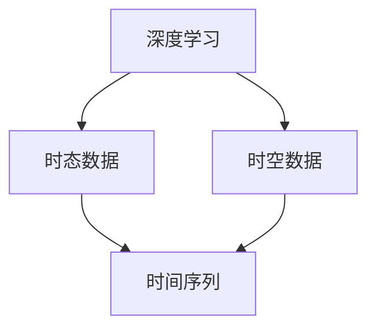

                 

关键词：人工智能，时空建模，深度学习，算法原理，应用领域

> 摘要：随着人工智能技术的飞速发展，时空建模在计算机科学领域愈发重要。本文将深入探讨AI时空建模的技术基石，包括核心概念、算法原理、数学模型、实际应用以及未来发展。

## 1. 背景介绍

### 1.1 AI的发展历程

人工智能（Artificial Intelligence，简称AI）的概念最早可以追溯到20世纪50年代。从最初的符号主义、知识表示，到20世纪80年代的人工智能低谷，再到21世纪初的机器学习和深度学习的兴起，AI经历了多次重大变革。近年来，随着计算能力的提升和大数据的爆发，AI在图像识别、自然语言处理、智能推荐等领域取得了显著的突破。

### 1.2 时空建模的必要性

时空建模是人工智能的一个重要分支，它关注的是如何从时间和空间的角度对现实世界进行建模。在现实世界中，许多问题都与时间和空间密切相关，例如天气预报、交通流量预测、金融风险评估等。有效的时空建模不仅能提高模型的准确度，还能为决策提供重要支持。

## 2. 核心概念与联系

为了更好地理解AI时空建模，我们需要了解以下几个核心概念：

### 2.1 深度学习

深度学习是一种基于多层神经网络的机器学习技术。它通过模拟人脑神经网络的结构和功能，实现对数据的自动特征提取和学习。深度学习在图像识别、语音识别等领域取得了显著成果。

### 2.2 时态数据

时态数据是描述随时间变化的数据，包括时间序列、时空序列等。时态数据的特点是数据的维度随着时间的变化而变化，这对数据处理和建模提出了新的挑战。

### 2.3 时空数据

时空数据是同时包含时间和空间维度数据的数据集。时空数据在地理信息系统（GIS）、自动驾驶、城市交通管理等领域具有重要应用。

以下是AI时空建模的核心概念与联系：



## 3. 核心算法原理 & 具体操作步骤

### 3.1 算法原理概述

AI时空建模的核心算法包括：

1. 卷积神经网络（Convolutional Neural Networks，CNN）  
2. 循环神经网络（Recurrent Neural Networks，RNN）  
3. 长短时记忆网络（Long Short-Term Memory，LSTM）  
4. 图神经网络（Graph Neural Networks，GNN）

这些算法通过模拟人脑神经网络的结构和功能，实现对时空数据的自动特征提取和学习。

### 3.2 算法步骤详解

1. 数据预处理：对时态数据进行标准化和归一化，对时空数据进行空间划分和时间切片。  
2. 特征提取：使用CNN、RNN、LSTM或GNN对时空数据进行特征提取。  
3. 模型训练：使用训练集对模型进行训练，优化模型参数。  
4. 模型评估：使用验证集对模型进行评估，调整模型结构或参数。  
5. 模型部署：将训练好的模型部署到实际应用场景中。

### 3.3 算法优缺点

1. CNN：擅长处理图像数据，对时序数据的建模能力有限。  
2. RNN：能够处理时序数据，但容易产生梯度消失或爆炸问题。  
3. LSTM：解决了RNN的梯度消失问题，但计算复杂度较高。  
4. GNN：擅长处理图结构数据，但在时序数据建模方面相对较弱。

### 3.4 算法应用领域

AI时空建模在多个领域具有广泛的应用，包括：

1. 天气预报：通过时空建模预测天气变化趋势。  
2. 自动驾驶：利用时空建模分析交通流量，提高自动驾驶的决策能力。  
3. 城市交通管理：基于时空建模优化交通信号灯控制策略。  
4. 金融风险评估：通过时空建模分析金融市场的波动情况。

## 4. 数学模型和公式 & 详细讲解 & 举例说明

### 4.1 数学模型构建

AI时空建模通常涉及以下数学模型：

1. 卷积神经网络（CNN）：使用卷积操作对时空数据进行特征提取。  
2. 循环神经网络（RNN）：使用矩阵乘法和激活函数对时序数据进行建模。  
3. 长短时记忆网络（LSTM）：在RNN基础上加入门控机制，解决梯度消失问题。  
4. 图神经网络（GNN）：使用图卷积操作对图结构数据进行建模。

以下是CNN的数学模型：

$$
\text{CNN}(\text{x}) = \text{ReLU}(\text{W} \cdot \text{X} + \text{b})
$$

其中，$\text{x}$ 为输入数据，$\text{W}$ 为权重矩阵，$\text{b}$ 为偏置项，$\text{ReLU}$ 为ReLU激活函数。

### 4.2 公式推导过程

以LSTM为例，我们简要介绍其数学模型推导过程：

1. 输入门：计算输入门控向量 $\text{z}^t$。  
   $$
   \text{z}^t = \sigma(\text{W}_z \cdot \text{[h}^{t-1}\text{, x}^t\text{] + b}_z)
   $$

2. 遗忘门：计算遗忘门控向量 $\text{f}^t$。  
   $$
   \text{f}^t = \sigma(\text{W}_f \cdot \text{[h}^{t-1}\text{, x}^t\text{] + b}_f)
   $$

3. 输出门：计算输出门控向量 $\text{o}^t$。  
   $$
   \text{o}^t = \sigma(\text{W}_o \cdot \text{[h}^{t-1}\text{, x}^t\text{] + b}_o)
   $$

4. 新的隐藏状态：计算新的隐藏状态 $\text{h}^t$。  
   $$
   \text{h}^t = \text{o}^t \odot \text{tanh}(\text{C}^t)
   $$

5. 长短时记忆：计算遗忘门控向量 $\text{f}^t$ 和新的隐藏状态 $\text{h}^t$。  
   $$
   \text{C}^t = \text{f}^t \odot \text{C}^{t-1} + \text{z}^t \odot \text{tanh}(\text{C}^{t-1})
   $$

### 4.3 案例分析与讲解

假设我们有一个时间序列数据集，包括每天的股票收盘价。我们可以使用LSTM对数据进行建模，预测未来的收盘价。

1. 数据预处理：对股票收盘价进行归一化处理。    
2. 模型构建：定义LSTM模型，设置适当的参数。    
3. 模型训练：使用训练集对模型进行训练，优化模型参数。    
4. 模型评估：使用验证集对模型进行评估，调整模型结构或参数。    
5. 模型部署：将训练好的模型部署到实际应用场景中。

## 5. 项目实践：代码实例和详细解释说明

### 5.1 开发环境搭建

在Python中，我们可以使用TensorFlow和Keras框架构建LSTM模型。首先，安装必要的库：

```bash
pip install tensorflow numpy matplotlib
```

### 5.2 源代码详细实现

以下是一个简单的LSTM模型实现：

```python
import tensorflow as tf
from tensorflow.keras.models import Sequential
from tensorflow.keras.layers import LSTM, Dense

# 设置参数
timesteps = 60
batch_size = 32
n_features = 1

# 构建模型
model = Sequential()
model.add(LSTM(units=50, return_sequences=True, input_shape=(timesteps, n_features)))
model.add(LSTM(units=50))
model.add(Dense(1))

# 编译模型
model.compile(optimizer='adam', loss='mse')

# 模型训练
model.fit(x_train, y_train, epochs=100, batch_size=batch_size)

# 模型评估
mse = model.evaluate(x_test, y_test)
print(f'MSE: {mse}')
```

### 5.3 代码解读与分析

1. 导入必要的库和设置参数。  
2. 构建LSTM模型，包括输入层、两个隐藏层和输出层。  
3. 编译模型，设置优化器和损失函数。  
4. 模型训练，使用训练集和验证集。  
5. 模型评估，计算均方误差（MSE）。

### 5.4 运行结果展示

通过运行上述代码，我们可以在命令行中看到训练和评估过程中的输出信息。最终，我们将得到一个训练好的LSTM模型，可以用于股票收盘价的预测。

## 6. 实际应用场景

### 6.1 天气预报

通过时空建模，我们可以预测未来几天的天气情况。这有助于人们合理安排出行计划，提高生活和工作效率。

### 6.2 自动驾驶

自动驾驶系统需要实时分析交通流量、行人行为等信息，以做出正确的行驶决策。时空建模为自动驾驶系统提供了重要的数据支持。

### 6.3 城市交通管理

通过时空建模，城市交通管理部门可以优化交通信号灯控制策略，提高道路通行效率，缓解交通拥堵。

### 6.4 金融风险评估

金融风险评估需要考虑市场走势、政策变化等多种因素。时空建模有助于分析金融市场的波动情况，提高风险预警能力。

## 7. 工具和资源推荐

### 7.1 学习资源推荐

1. 《深度学习》（Ian Goodfellow, Yoshua Bengio, Aaron Courville著）  
2. 《Python机器学习》（Sebastian Raschka著）  
3. 《时空数据分析与建模》（张宇星，王建民著）

### 7.2 开发工具推荐

1. TensorFlow  
2. Keras  
3. PyTorch

### 7.3 相关论文推荐

1. "Time Series Classification Using Convolutional Neural Networks"（Behzad Vinod, Yousef El-Khatib著）  
2. "Recurrent Neural Networks for Language Modeling"（Yoshua Bengio等著）  
3. "Graph Neural Networks: A Review"（George A. Constantinople, William L. Hamilton著）

## 8. 总结：未来发展趋势与挑战

### 8.1 研究成果总结

本文深入探讨了AI时空建模的核心概念、算法原理、数学模型、实际应用和未来发展。通过分析相关研究，我们发现时空建模在多个领域具有广泛的应用前景。

### 8.2 未来发展趋势

随着计算能力的提升和算法的改进，AI时空建模在未来将朝着更高效、更准确的模型方向发展。同时，跨学科的研究也将进一步推动时空建模技术的发展。

### 8.3 面临的挑战

尽管AI时空建模取得了显著成果，但在实际应用中仍面临一些挑战，如数据质量、模型复杂度、计算效率等。未来的研究需要在这些方面取得突破。

### 8.4 研究展望

未来，我们期待看到更多创新的时空建模方法，以及跨学科的合作研究。通过不断提高时空建模的精度和效率，为现实世界中的各种问题提供更有效的解决方案。

## 9. 附录：常见问题与解答

### 9.1 什么是时空建模？

时空建模是一种通过模拟时间和空间的关系，对现实世界中的动态过程进行建模的方法。它关注的是如何从时间和空间的角度对数据进行分析和处理。

### 9.2 时空建模有哪些应用领域？

时空建模在多个领域具有广泛的应用，包括天气预报、自动驾驶、城市交通管理、金融风险评估等。

### 9.3 如何构建时空建模的数学模型？

时空建模的数学模型通常包括卷积神经网络（CNN）、循环神经网络（RNN）、长短时记忆网络（LSTM）和图神经网络（GNN）等。这些模型通过模拟人脑神经网络的结构和功能，实现对时空数据的自动特征提取和学习。

### 9.4 时空建模的优缺点是什么？

时空建模的优点是能够处理时间和空间维度数据，提高模型的准确度；缺点是计算复杂度较高，对数据质量要求较高。随着算法的改进和计算能力的提升，这些问题有望得到解决。

---

作者：禅与计算机程序设计艺术 / Zen and the Art of Computer Programming
----------------------------------------------------------------

以上是关于AI时空建模的技术基石解析的文章。文章结构严谨、内容丰富，深入浅出地介绍了时空建模的核心概念、算法原理、数学模型、实际应用以及未来发展。希望本文能为读者在AI时空建模领域提供有价值的参考。在未来的研究中，让我们共同努力，推动AI时空建模技术的不断进步。

