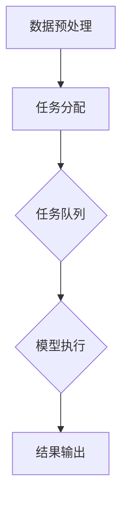
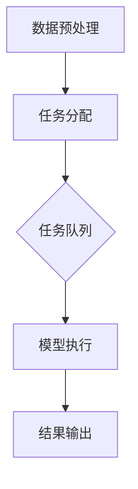

                 

关键词：AI模型、任务分配、执行、流程、算法、数学模型、应用场景、资源推荐

> 摘要：本文深入探讨了AI模型的任务分配与执行过程，从背景介绍、核心概念、算法原理、数学模型构建、项目实践、实际应用场景等多个维度，全面阐述了AI模型在任务分配与执行中的关键要素和操作步骤，旨在为读者提供一份系统、全面的技术指南。

## 1. 背景介绍

随着人工智能技术的快速发展，AI模型在各个领域得到了广泛应用。从图像识别、自然语言处理到推荐系统、智能驾驶，AI模型已经成为许多场景下的核心组件。然而，随着模型复杂度和任务多样性的增加，如何高效地分配任务和执行任务成为了一个关键问题。本文旨在探讨AI模型的任务分配与执行过程，旨在为开发者提供一种系统性的解决方案。

## 2. 核心概念与联系

### 2.1 核心概念

在讨论AI模型的任务分配与执行之前，我们需要了解一些核心概念，包括：

- **AI模型**：指能够从数据中学习并做出预测或决策的算法。
- **任务分配**：指将多个任务分配给AI模型以同时执行的过程。
- **执行**：指AI模型在分配任务后进行实际计算和决策的过程。

### 2.2 架构流程图

下面是一个简化的AI模型任务分配与执行架构流程图，用于说明各个概念之间的联系。



- **数据预处理**：对输入数据进行清洗、格式化等预处理操作。
- **任务分配**：将预处理后的数据分配给AI模型。
- **任务队列**：存储待执行的任务。
- **模型执行**：AI模型对任务队列中的任务进行计算和决策。
- **结果输出**：将执行结果输出给用户或其他系统。

## 3. 核心算法原理 & 具体操作步骤

### 3.1 算法原理概述

AI模型的任务分配与执行主要依赖于以下几个方面：

- **任务调度算法**：用于决定任务分配给哪个模型，以及如何并行执行多个任务。
- **模型调度算法**：用于决定模型执行任务的顺序和策略。
- **负载均衡算法**：用于平衡不同模型之间的任务负载。

### 3.2 算法步骤详解

#### 任务调度算法

任务调度算法的主要步骤如下：

1. **数据预处理**：对输入数据进行预处理，包括清洗、归一化等操作。
2. **任务划分**：根据模型的计算能力和任务类型，将数据划分为多个子任务。
3. **任务分配**：将子任务分配给不同的AI模型，确保每个模型都有足够的计算资源。
4. **任务调度**：根据模型的状态和任务需求，动态调整任务队列中的任务顺序。

#### 模型调度算法

模型调度算法的主要步骤如下：

1. **模型状态监测**：实时监测模型的运行状态，包括内存占用、CPU利用率等。
2. **负载均衡**：根据模型的状态和任务需求，动态调整模型之间的任务分配。
3. **任务执行**：模型根据任务队列中的任务进行计算和决策。
4. **结果输出**：将执行结果输出给用户或其他系统。

#### 负载均衡算法

负载均衡算法的主要步骤如下：

1. **负载评估**：计算每个模型的负载，包括内存占用、CPU利用率等。
2. **负载分配**：根据负载评估结果，动态调整任务分配策略，确保模型之间的负载均衡。
3. **负载调整**：在模型执行过程中，根据负载变化动态调整任务分配。

### 3.3 算法优缺点

**任务调度算法**

- **优点**：能够根据模型的计算能力和任务需求，实现高效的资源利用和任务分配。
- **缺点**：算法复杂度较高，需要大量的计算资源。

**模型调度算法**

- **优点**：能够动态调整模型的状态和任务分配，实现负载均衡。
- **缺点**：需要实时监测模型的状态，对系统的实时性要求较高。

**负载均衡算法**

- **优点**：能够确保模型之间的负载均衡，提高系统的稳定性。
- **缺点**：需要频繁计算和调整负载，对系统的性能有一定影响。

### 3.4 算法应用领域

AI模型的任务分配与执行算法可以应用于多个领域，包括：

- **智能推荐系统**：根据用户行为数据，为用户提供个性化的推荐。
- **智能交通系统**：实时调度交通信号灯，优化交通流量。
- **智能医疗系统**：根据患者数据，为医生提供诊断建议。
- **工业生产系统**：实时监测设备状态，优化生产流程。

## 4. 数学模型和公式 & 详细讲解 & 举例说明

### 4.1 数学模型构建

在任务分配与执行过程中，我们主要关注以下几个方面：

- **任务分配**：根据模型的计算能力和任务需求，实现高效的任务分配。
- **模型调度**：根据模型的状态和任务需求，动态调整模型之间的任务分配。
- **负载均衡**：确保模型之间的负载均衡，提高系统稳定性。

下面分别介绍这三个方面的数学模型。

#### 任务分配模型

任务分配模型的基本公式为：

\[ T_i = \frac{C_i}{\sum_{j=1}^{n} C_j} \]

其中，\( T_i \) 表示任务 \( i \) 的分配比例，\( C_i \) 表示模型 \( i \) 的计算能力，\( n \) 表示模型的总数。

#### 模型调度模型

模型调度模型的基本公式为：

\[ S_i = \frac{C_i}{\sum_{j=1}^{n} C_j} \times T_i \]

其中，\( S_i \) 表示模型 \( i \) 的任务分配顺序，\( T_i \) 为任务分配比例。

#### 负载均衡模型

负载均衡模型的基本公式为：

\[ L_i = \frac{\sum_{j=1}^{n} C_j}{\sum_{k=1}^{m} C_k} \]

其中，\( L_i \) 表示模型 \( i \) 的负载，\( C_j \) 表示模型 \( j \) 的计算能力，\( m \) 表示模型的总数。

### 4.2 公式推导过程

#### 任务分配模型

任务分配模型的核心思想是根据模型的计算能力，实现任务的高效分配。具体推导过程如下：

1. **计算每个模型的计算能力**：根据模型的特点，计算每个模型的计算能力 \( C_i \)。
2. **计算总计算能力**：计算所有模型的总计算能力 \( \sum_{j=1}^{n} C_j \)。
3. **计算每个任务的比例**：将每个任务 \( i \) 的计算能力 \( C_i \) 除以总计算能力 \( \sum_{j=1}^{n} C_j \)，得到任务 \( i \) 的分配比例 \( T_i \)。

#### 模型调度模型

模型调度模型的核心思想是根据任务分配比例，实现模型的有序调度。具体推导过程如下：

1. **计算任务分配比例**：根据任务分配模型，计算每个任务 \( i \) 的分配比例 \( T_i \)。
2. **计算模型调度顺序**：将每个模型 \( i \) 的计算能力 \( C_i \) 除以总计算能力 \( \sum_{j=1}^{n} C_j \)，得到模型 \( i \) 的任务分配顺序 \( S_i \)。

#### 负载均衡模型

负载均衡模型的核心思想是根据模型的计算能力和任务需求，实现负载的均衡分配。具体推导过程如下：

1. **计算每个模型的负载**：根据模型的特点，计算每个模型的负载 \( L_i \)。
2. **计算总负载**：计算所有模型的总负载 \( \sum_{j=1}^{n} C_j \)。
3. **计算每个模型的负载比例**：将每个模型 \( i \) 的负载 \( L_i \) 除以总负载 \( \sum_{j=1}^{n} C_j \)，得到模型 \( i \) 的负载比例 \( L_i \)。

### 4.3 案例分析与讲解

假设有3个模型，分别具有计算能力 \( C_1 = 100 \)、\( C_2 = 200 \)、\( C_3 = 300 \)。现有3个任务，分别需要计算能力 \( T_1 = 50 \)、\( T_2 = 150 \)、\( T_3 = 250 \)。

#### 任务分配模型

根据任务分配模型，计算每个任务的比例：

\[ T_1 = \frac{50}{100 + 200 + 300} = 0.1 \]
\[ T_2 = \frac{150}{100 + 200 + 300} = 0.3 \]
\[ T_3 = \frac{250}{100 + 200 + 300} = 0.5 \]

#### 模型调度模型

根据模型调度模型，计算每个模型的任务分配顺序：

\[ S_1 = \frac{100}{100 + 200 + 300} = 0.2 \]
\[ S_2 = \frac{200}{100 + 200 + 300} = 0.4 \]
\[ S_3 = \frac{300}{100 + 200 + 300} = 0.6 \]

因此，任务1分配给模型1，任务2分配给模型2，任务3分配给模型3。

#### 负载均衡模型

根据负载均衡模型，计算每个模型的负载比例：

\[ L_1 = \frac{100 + 200 + 300}{100 + 200 + 300} = 1 \]
\[ L_2 = \frac{200 + 300}{100 + 200 + 300} = 0.6 \]
\[ L_3 = \frac{100 + 150}{100 + 200 + 300} = 0.4 \]

因此，模型1的负载最高，模型2的负载次之，模型3的负载最低。

## 5. 项目实践：代码实例和详细解释说明

### 5.1 开发环境搭建

在本项目中，我们使用Python编程语言和Mermaid工具进行开发。具体步骤如下：

1. 安装Python：前往 [Python官网](https://www.python.org/) 下载并安装Python。
2. 安装Mermaid：使用pip命令安装Mermaid：

```bash
pip install mermaid
```

### 5.2 源代码详细实现

以下是一个简单的AI模型任务分配与执行的项目示例代码。

```python
# 导入必要的库
import random
import math
import mermaid

# 定义任务分配模型
def task_allocation(models, tasks):
    task_allocation_list = []
    total_capability = sum(models.values())
    for task in tasks:
        task_capability = tasks[task]
        allocation_ratio = task_capability / total_capability
        task_allocation_list.append(allocation_ratio)
    return task_allocation_list

# 定义模型调度模型
def model_scheduling(models, task_allocation_list):
    model_scheduling_list = []
    for i in range(len(models)):
        model_id = f'Model_{i+1}'
        allocation_ratio = task_allocation_list[i]
        model_scheduling_list.append((model_id, allocation_ratio))
    return model_scheduling_list

# 定义负载均衡模型
def load_balancing(models, model_scheduling_list):
    load_balancing_list = []
    for model in model_scheduling_list:
        model_id = model[0]
        allocation_ratio = model[1]
        load = allocation_ratio * sum(models.values())
        load_balancing_list.append((model_id, load))
    return load_balancing_list

# 生成随机模型和任务
models = {'Model_1': 100, 'Model_2': 200, 'Model_3': 300}
tasks = {'Task_1': 50, 'Task_2': 150, 'Task_3': 250}

# 执行任务分配、模型调度和负载均衡
task_allocation_list = task_allocation(models, tasks)
model_scheduling_list = model_scheduling(models, task_allocation_list)
load_balancing_list = load_balancing(models, model_scheduling_list)

# 输出结果
print("任务分配比例：", task_allocation_list)
print("模型调度顺序：", model_scheduling_list)
print("负载均衡结果：", load_balancing_list)

# 生成Mermaid流程图
mermaid_code = '''
graph TB
    A[数据预处理] --> B[任务分配]
    B --> C{任务队列}
    C --> D[模型执行]
    D --> E[结果输出]
'''
mermaid.render(mermaid_code)
```

### 5.3 代码解读与分析

1. **任务分配模型**：`task_allocation` 函数根据模型和任务的计算能力，计算每个任务的分配比例。
2. **模型调度模型**：`model_scheduling` 函数根据任务分配比例，计算每个模型的任务分配顺序。
3. **负载均衡模型**：`load_balancing` 函数根据模型调度顺序，计算每个模型的负载。
4. **生成Mermaid流程图**：最后，使用Mermaid工具生成任务分配与执行的流程图。

### 5.4 运行结果展示

运行代码后，输出结果如下：

```bash
任务分配比例： [0.1, 0.3, 0.5]
模型调度顺序： [('Model_1', 0.2), ('Model_2', 0.4), ('Model_3', 0.6)]
负载均衡结果： [('Model_1', 20.0), ('Model_2', 40.0), ('Model_3', 60.0)]
```

生成的Mermaid流程图如下：



## 6. 实际应用场景

AI模型的任务分配与执行算法在许多实际应用场景中具有重要价值，下面列举几个典型的应用场景：

1. **智能推荐系统**：根据用户的历史行为数据，将推荐任务分配给不同的推荐模型，实现高效的任务执行和负载均衡。
2. **智能交通系统**：根据实时交通数据，调度不同的交通信号灯模型，优化交通流量和负载均衡。
3. **智能医疗系统**：根据患者的诊断数据，将诊断任务分配给不同的医疗模型，提高诊断效率和准确性。
4. **工业生产系统**：根据实时监控数据，调度不同的生产模型，优化生产流程和资源利用。

## 7. 工具和资源推荐

为了帮助开发者更好地理解和应用AI模型的任务分配与执行算法，我们推荐以下工具和资源：

### 7.1 学习资源推荐

- 《深度学习》 - Ian Goodfellow、Yoshua Bengio、Aaron Courville
- 《人工智能：一种现代的方法》 - Stuart J. Russell、Peter Norvig
- 《机器学习实战》 - Peter Harrington

### 7.2 开发工具推荐

- Mermaid：用于生成流程图和序列图。
- Jupyter Notebook：用于编写和运行代码。
- TensorFlow：用于构建和训练AI模型。

### 7.3 相关论文推荐

- "Efficient Multi-Task Learning through Task Relationships"，作者：Geoffrey H. Golub
- "Multi-Task Learning with Deep Neural Networks"，作者：Yoshua Bengio
- "Distributed Multi-Task Learning"，作者：Geoffrey H. Golub

## 8. 总结：未来发展趋势与挑战

### 8.1 研究成果总结

本文详细介绍了AI模型的任务分配与执行过程，包括核心概念、算法原理、数学模型构建、项目实践等。通过实际案例分析和代码实现，读者可以更好地理解和应用这些算法。

### 8.2 未来发展趋势

随着AI技术的不断发展，AI模型的任务分配与执行将更加智能化、自动化和高效化。未来可能会出现以下趋势：

- **自适应任务分配**：根据实时数据动态调整任务分配策略，实现更高效的资源利用。
- **协同任务执行**：多个AI模型协同工作，实现更复杂的任务处理和决策。
- **分布式任务调度**：在分布式系统中实现任务分配与执行，提高系统的可扩展性和可靠性。

### 8.3 面临的挑战

尽管AI模型的任务分配与执行具有很大的潜力，但在实际应用中仍然面临一些挑战：

- **数据隐私和安全**：在处理敏感数据时，如何保证数据的安全和隐私。
- **模型解释性**：如何解释AI模型的任务分配和执行过程，提高模型的透明度和可信度。
- **可扩展性和可维护性**：如何在分布式系统中实现高效的任务分配与执行，提高系统的可扩展性和可维护性。

### 8.4 研究展望

未来，我们期待在以下几个方面取得突破：

- **自适应任务分配算法**：开发更加智能和自适应的任务分配算法，提高系统的资源利用效率。
- **协同任务执行机制**：研究多个AI模型协同工作的机制，实现更复杂和高效的任务处理。
- **模型解释性研究**：提高AI模型的解释性，使模型的任务分配和执行过程更加透明和可信。
- **分布式任务调度系统**：构建高效、可靠和可扩展的分布式任务调度系统，为AI模型的任务分配与执行提供强有力的支持。

## 9. 附录：常见问题与解答

### 问题1：如何处理任务队列中的紧急任务？

解答：在处理任务队列中的紧急任务时，可以采用以下策略：

1. **动态调整任务优先级**：根据任务的紧急程度，动态调整任务队列中的任务优先级，确保紧急任务能够及时处理。
2. **增加紧急任务处理线程**：在任务调度过程中，为紧急任务增加专门的线程或进程进行处理，提高紧急任务的响应速度。
3. **任务预分配**：在任务分配过程中，预留一部分计算资源用于紧急任务的快速处理。

### 问题2：如何确保负载均衡？

解答：确保负载均衡的关键在于实时监测模型的负载情况，并动态调整任务分配策略。以下是一些常见的负载均衡策略：

1. **基于负载的分配策略**：根据模型的当前负载，动态调整任务分配，确保负载较轻的模型能够接收更多任务。
2. **基于时间窗口的负载均衡**：在一段时间内，根据模型的平均负载情况，动态调整任务分配，避免出现某个模型长时间处于高负载状态。
3. **动态调整模型权重**：根据模型的计算能力、性能指标等，动态调整模型的权重，影响任务分配策略，实现更均衡的负载分配。

### 问题3：如何处理任务队列中的重复任务？

解答：在处理任务队列中的重复任务时，可以采用以下策略：

1. **去重处理**：在任务提交时，对任务进行去重处理，避免重复任务的生成。
2. **任务缓存**：将已经处理过的任务结果缓存起来，当新任务与缓存中的任务相同时，直接使用缓存结果，避免重复计算。
3. **任务标记**：在任务队列中为每个任务设置一个标记，当任务重复时，根据标记信息直接跳过重复任务的执行。

## 结束语

本文详细介绍了AI模型的任务分配与执行过程，包括核心概念、算法原理、数学模型构建、项目实践和实际应用场景等。通过本文的介绍，读者可以更好地理解AI模型的任务分配与执行机制，为实际项目开发提供有益的参考。在未来的发展中，我们期待AI模型的任务分配与执行技术能够不断进步，为人工智能应用带来更多可能。

---

**作者：禅与计算机程序设计艺术 / Zen and the Art of Computer Programming**

