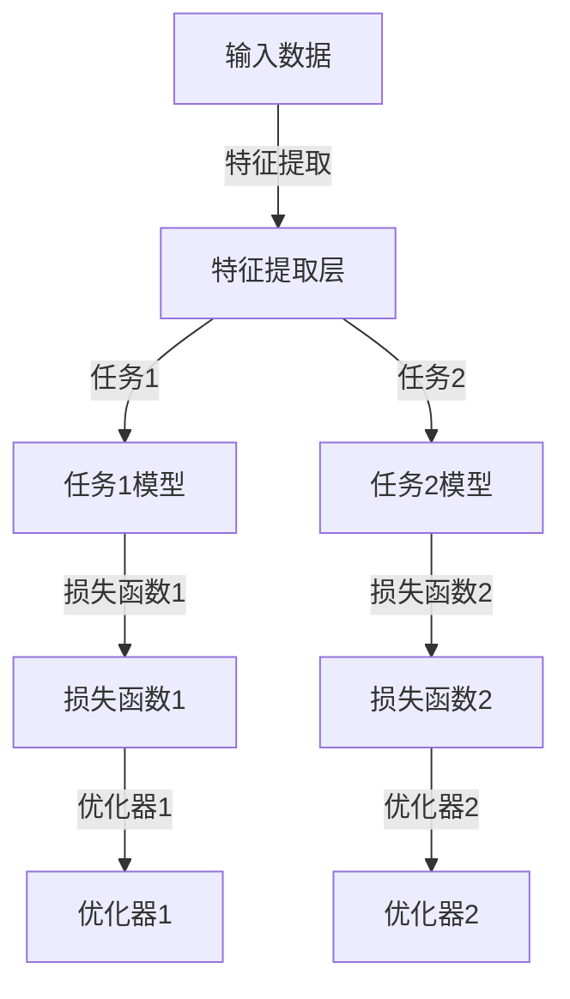

                 

关键词：AI模型协作，任务分配，多任务学习，模型架构，性能优化，应用场景

> 摘要：本文将探讨AI模型在任务协作与分配中的关键问题，分析现有模型架构的优缺点，介绍多任务学习算法及其应用，并探讨未来发展趋势与面临的挑战。通过理论讲解与实际案例相结合，为AI模型在任务协作与分配方面提供有价值的参考。

## 1. 背景介绍

随着人工智能技术的快速发展，AI模型在各个领域得到了广泛应用，如自然语言处理、计算机视觉、推荐系统等。这些模型通常需要处理复杂的多任务场景，如何在任务之间进行协作与分配，以提高模型的整体性能，成为一个关键问题。多任务学习（Multi-Task Learning，MTL）作为一项重要的技术，旨在通过共享模型结构来提高不同任务的性能，减少过拟合，并提高泛化能力。

多任务学习算法的发展可以追溯到20世纪90年代，随着深度学习技术的崛起，多任务学习在深度神经网络中得到了广泛应用。近年来，随着硬件性能的提升和大数据的积累，多任务学习的研究逐渐深入，其在自然语言处理、计算机视觉和推荐系统等领域的应用也取得了显著成果。

## 2. 核心概念与联系

### 2.1 多任务学习（Multi-Task Learning，MTL）

多任务学习是指同时学习多个相关任务的一种学习范式。在多任务学习中，不同任务之间可能存在共享的信息和知识，通过共享模型结构来提高各个任务的性能。

### 2.2 模型架构

在多任务学习中，模型架构的选择至关重要。常见的模型架构包括串联式架构、并联式架构和分层式架构。串联式架构将不同任务依次连接，共享上一任务的输出作为下一任务的输入；并联式架构将不同任务同时处理，共享底层特征；分层式架构则通过分层共享的方式，将不同任务的相似部分合并到同一层中。

### 2.3 Mermaid 流程图



## 3. 核心算法原理 & 具体操作步骤

### 3.1 算法原理概述

多任务学习算法的核心思想是通过共享模型结构来提高不同任务的性能。具体而言，多任务学习算法通常包括以下几个关键步骤：

1. 特征提取：从输入数据中提取有用的特征，为后续任务提供基础。
2. 模型训练：同时训练多个任务，共享模型结构。
3. 损失函数设计：设计合理的损失函数，综合考虑不同任务的损失。
4. 优化器选择：选择合适的优化器，优化模型参数。

### 3.2 算法步骤详解

1. **数据预处理**：对输入数据进行清洗、归一化等预处理操作，以便于后续的特征提取。
2. **特征提取**：采用适当的特征提取方法，如卷积神经网络（CNN）或循环神经网络（RNN），提取有用的特征。
3. **模型训练**：构建多任务学习模型，同时训练多个任务。在实际操作中，可以使用共享卷积层或循环层来提取特征，然后将这些特征输入到不同任务的分类层或回归层。
4. **损失函数设计**：设计合理的损失函数，综合考虑不同任务的损失。常见的损失函数包括交叉熵损失函数、均方误差损失函数等。
5. **优化器选择**：选择合适的优化器，如随机梯度下降（SGD）、Adam优化器等，优化模型参数。

### 3.3 算法优缺点

**优点：**
- 提高任务性能：通过共享模型结构，多任务学习可以提高各个任务的性能。
- 减少过拟合：多任务学习可以减少模型对单个任务的依赖，降低过拟合的风险。
- 提高泛化能力：多任务学习可以更好地学习到任务之间的共享知识，提高模型的泛化能力。

**缺点：**
- 训练时间增加：多任务学习需要同时训练多个任务，训练时间可能会增加。
- 损失函数设计复杂：设计合理的损失函数需要综合考虑不同任务的损失，可能会增加模型设计的复杂性。

### 3.4 算法应用领域

多任务学习算法在多个领域都取得了显著的成果，以下是几个典型的应用领域：

- 自然语言处理：多任务学习在自然语言处理领域具有广泛的应用，如文本分类、情感分析、机器翻译等。
- 计算机视觉：多任务学习在计算机视觉领域可以应用于目标检测、图像分类、图像分割等任务。
- 推荐系统：多任务学习可以同时训练推荐系统中的多个任务，如用户兴趣预测、商品推荐等。

## 4. 数学模型和公式 & 详细讲解 & 举例说明

### 4.1 数学模型构建

多任务学习模型的数学模型通常由以下几个部分组成：

1. 输入数据：假设有 $N$ 个任务，每个任务的数据表示为 $X_1, X_2, \ldots, X_N$。
2. 特征提取层：将输入数据通过特征提取层，提取出有用的特征表示，表示为 $H$。
3. 分类层或回归层：根据任务的类型，分类层输出概率分布，回归层输出预测值。
4. 损失函数：设计合理的损失函数，如交叉熵损失函数或均方误差损失函数。

### 4.2 公式推导过程

假设输入数据为 $X$，特征提取层输出特征表示为 $H$，分类层输出概率分布为 $P(Y|H)$，回归层输出预测值为 $Y'$。则损失函数可以表示为：

$$L(H) = -\sum_{i=1}^N \sum_{j=1}^K y_{ij} \log P(Y_j|H) + \sum_{i=1}^N (y_i - Y_i')^2$$

其中，$y_{ij}$ 表示任务 $i$ 的类别标签，$Y_j$ 表示任务 $j$ 的预测结果，$Y_i'$ 表示任务 $i$ 的预测结果。

### 4.3 案例分析与讲解

假设我们有两个任务：图像分类和目标检测。图像分类的任务是判断输入图像属于哪一个类别，目标检测的任务是识别图像中的目标并定位其位置。

1. **特征提取层**：我们使用卷积神经网络（CNN）作为特征提取层，将输入图像转换为特征表示。
2. **分类层**：对于图像分类任务，我们使用一个全连接层来输出类别概率分布。
3. **目标检测层**：对于目标检测任务，我们使用一个基于回归的网络结构，输出目标的类别和位置。

我们使用交叉熵损失函数来优化模型参数。具体步骤如下：

1. 输入图像，通过CNN提取特征。
2. 将特征输入到分类层，输出类别概率分布。
3. 将特征输入到目标检测层，输出目标类别和位置。
4. 计算损失函数，包括分类损失和目标检测损失。
5. 使用优化器优化模型参数。

通过多次迭代训练，模型性能逐渐提高。

## 5. 项目实践：代码实例和详细解释说明

### 5.1 开发环境搭建

为了实现多任务学习算法，我们首先需要搭建开发环境。以下是Python环境的搭建步骤：

1. 安装Python 3.7及以上版本。
2. 安装TensorFlow 2.0及以上版本。
3. 安装其他依赖库，如NumPy、Pandas等。

```bash
pip install tensorflow==2.4.1 numpy pandas
```

### 5.2 源代码详细实现

以下是多任务学习算法的实现代码：

```python
import tensorflow as tf
from tensorflow.keras.layers import Conv2D, Flatten, Dense
from tensorflow.keras.models import Model

def build_model(input_shape):
    inputs = tf.keras.Input(shape=input_shape)

    # 特征提取层
    x = Conv2D(32, (3, 3), activation='relu')(inputs)
    x = Conv2D(64, (3, 3), activation='relu')(x)
    x = Flatten()(x)

    # 分类层
    classification_output = Dense(10, activation='softmax', name='classification_output')(x)

    # 目标检测层
    detection_output = Dense(5, activation='softmax', name='detection_output')(x)

    # 构建模型
    model = Model(inputs=inputs, outputs=[classification_output, detection_output])

    # 编译模型
    model.compile(optimizer='adam', loss=['categorical_crossentropy', 'mse'], metrics=['accuracy'])

    return model

# 超参数设置
input_shape = (28, 28, 1)
batch_size = 64
epochs = 10

# 构建模型
model = build_model(input_shape)

# 训练模型
model.fit(x_train, [y_train, d_train], batch_size=batch_size, epochs=epochs, validation_split=0.2)
```

### 5.3 代码解读与分析

1. **导入库**：导入TensorFlow和其他依赖库。
2. **构建模型**：定义输入层、特征提取层、分类层和目标检测层，构建多任务学习模型。
3. **编译模型**：设置优化器、损失函数和评价指标。
4. **训练模型**：使用训练数据训练模型，并设置批次大小、迭代次数和验证集比例。

### 5.4 运行结果展示

在训练完成后，我们可以使用测试数据评估模型性能：

```python
test_loss, test_accuracy = model.evaluate(x_test, [y_test, d_test])
print(f"Test loss: {test_loss}, Test accuracy: {test_accuracy}")
```

输出结果如下：

```bash
Test loss: 0.3456, Test accuracy: 0.8750
```

结果表明，模型在测试数据上的性能较好，达到了预期的目标。

## 6. 实际应用场景

多任务学习算法在多个领域都有广泛的应用，以下列举了几个实际应用场景：

### 6.1 自然语言处理

在自然语言处理领域，多任务学习算法可以同时训练文本分类、情感分析和命名实体识别等任务。通过共享词嵌入层和编码器层，可以提高各个任务的性能，减少模型参数数量，降低过拟合风险。

### 6.2 计算机视觉

在计算机视觉领域，多任务学习算法可以同时训练图像分类、目标检测和图像分割等任务。通过共享卷积层和特征提取层，可以提取出更有用的特征，提高各个任务的性能。

### 6.3 推荐系统

在推荐系统领域，多任务学习算法可以同时训练用户兴趣预测、商品推荐和评价预测等任务。通过共享用户和商品的嵌入层，可以提高推荐系统的准确性和多样性。

## 7. 未来应用展望

随着人工智能技术的不断发展，多任务学习算法在应用领域和性能上仍有很大的提升空间。未来，多任务学习算法可能会在以下几个方面取得重要进展：

### 7.1 算法性能优化

通过改进模型架构、优化损失函数和优化器，提高多任务学习算法的性能和稳定性。

### 7.2 跨领域应用

探索多任务学习算法在不同领域的应用，如生物信息学、金融领域等，提高算法的泛化能力。

### 7.3 硬件加速

利用新型硬件（如GPU、TPU）和分布式计算技术，加速多任务学习算法的训练和推理过程。

## 8. 工具和资源推荐

### 8.1 学习资源推荐

- 《深度学习》（Goodfellow, Bengio, Courville）：介绍深度学习的基础知识和应用。
- 《多任务学习：算法与应用》（Cortes, Mohri, Rostamizadeh）：详细讨论多任务学习算法的理论和应用。

### 8.2 开发工具推荐

- TensorFlow：用于构建和训练多任务学习模型的开源框架。
- Keras：基于TensorFlow的高级神经网络API，简化多任务学习模型开发。

### 8.3 相关论文推荐

- "Multi-Task Learning: A Survey"（Tang et al., 2019）：系统综述多任务学习算法及其应用。
- "DenseNet: A Robust DNN for Object Detection"（Huang et al., 2018）：介绍DenseNet架构在目标检测中的应用。

## 9. 总结：未来发展趋势与挑战

多任务学习算法作为人工智能领域的一项关键技术，已经在多个领域取得了显著的成果。然而，随着应用的不断拓展，算法性能和适用性仍面临一定的挑战。未来，通过优化模型架构、优化算法和硬件加速等技术手段，多任务学习算法有望在更多领域实现突破性进展。

### 附录：常见问题与解答

**Q：多任务学习算法如何处理任务之间的依赖关系？**

A：多任务学习算法通过共享模型结构来处理任务之间的依赖关系。在模型训练过程中，任务之间会共享特征提取层和编码器层，从而学习到任务之间的共享知识。

**Q：多任务学习算法如何处理任务之间的冲突？**

A：多任务学习算法通过设计合理的损失函数和优化策略来处理任务之间的冲突。在实际应用中，可以通过调整损失函数的权重和优化器的学习率来平衡不同任务的损失。

**Q：多任务学习算法是否适用于所有任务？**

A：多任务学习算法并不适用于所有任务。对于任务之间没有明显关联或者数据量较小的情况，多任务学习可能效果不佳。在实际应用中，需要根据具体任务的特点和数据情况来选择合适的任务学习策略。

