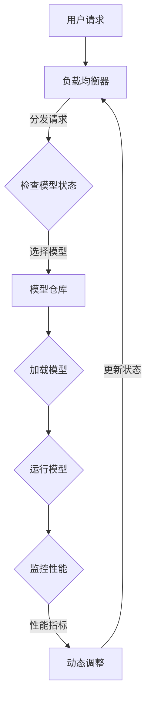

                 

关键词：AI模型、多版本并行、Lepton AI、灵活部署、架构设计

> 摘要：本文深入探讨了AI模型的多版本并行部署策略，特别是Lepton AI在实现灵活部署方面的成功案例。通过分析核心概念、算法原理、数学模型以及实际应用，本文旨在为读者提供一个全面的技术指南，帮助他们在AI模型的部署中实现高效的并行化。

## 1. 背景介绍

人工智能（AI）技术的快速发展推动了各行各业的变革，而AI模型的高效部署成为了关键挑战之一。传统的单版本部署方式在处理大规模数据和高并发请求时，常常面临性能瓶颈和资源浪费的问题。为了解决这些问题，多版本并行部署策略应运而生。多版本并行部署允许同时运行多个模型的版本，根据具体需求和负载动态调整模型的运行状态，从而实现资源利用的最大化和性能的优化。

Lepton AI是一家专注于AI模型并行部署技术的公司，其提出的Lepton并行部署架构在多个领域得到了成功的应用。本文将围绕Lepton AI的并行部署架构，探讨AI模型多版本并行的核心概念、算法原理、数学模型和实际应用，为AI模型部署提供一种可行的解决方案。

### Lepton AI的简介

Lepton AI成立于2010年，是一家位于硅谷的人工智能初创公司，专注于提供高性能、高可扩展性的AI模型部署解决方案。公司成立之初，就致力于解决AI模型在生产和部署过程中遇到的高并发、大规模数据处理难题。通过自主研发的并行部署技术，Lepton AI成功将复杂AI模型的高效部署变成了现实。

Lepton AI的产品和服务涵盖了多个领域，包括自然语言处理、计算机视觉、推荐系统等。其核心产品Lepton AI Engine是一款高度可扩展的AI模型部署平台，支持多版本并行部署，能够灵活应对不同规模和类型的AI应用需求。

### 多版本并行部署的需求与挑战

在AI领域，多版本并行部署的需求主要来自于以下几个方面：

1. **模型迭代与更新**：随着AI技术的不断发展，模型需要不断迭代和更新以保持其准确性和适应性。多版本并行部署允许新版本模型与旧版本模型共存，逐步切换，减少更新带来的服务中断。
2. **负载均衡**：在高并发请求的场景中，单个模型可能无法承载所有负载。多版本并行部署通过部署多个版本，可以实现负载均衡，避免单个模型过载。
3. **性能优化**：通过并行部署，可以根据不同版本模型的性能表现，动态调整资源的分配，实现性能的持续优化。
4. **故障容错**：在AI模型部署中，任何版本的问题都可能导致整个服务的中断。多版本并行部署可以在一定程度上实现故障隔离，提高系统的稳定性。

然而，多版本并行部署也面临着一些挑战：

1. **版本管理**：多个版本的模型需要有效的管理和维护，以确保数据的一致性和版本的稳定性。
2. **资源分配**：如何合理分配资源，使得每个版本模型都能获得足够的计算资源，同时避免资源浪费，是一个需要深入探讨的问题。
3. **性能监控**：在多版本并行部署中，如何实时监控各个版本模型的表现，以及快速定位和解决性能问题，是一个重要的课题。
4. **成本控制**：多版本并行部署需要额外的硬件和软件资源，如何控制成本，实现经济效益最大化，也是一个重要的考虑因素。

## 2. 核心概念与联系

### 2.1 多版本并行部署的概念

多版本并行部署是指在同一时间内，部署和运行多个版本的AI模型，并根据实际需求和性能表现动态调整模型的运行状态。这种部署方式的关键在于实现模型的并行化和动态调整，以应对不同的应用场景和负载变化。

### 2.2 Lepton AI的并行部署架构

Lepton AI的并行部署架构主要包括以下几个核心组成部分：

1. **模型仓库**：存储和管理不同版本的AI模型，包括模型的参数、结构以及相关的元数据。
2. **并行引擎**：负责模型的加载、运行和监控，能够根据负载和性能指标动态调整模型的运行状态。
3. **负载均衡器**：根据请求的负载情况，将请求分发到不同的模型版本上，实现负载均衡。
4. **监控系统**：实时监控各个版本模型的性能和资源使用情况，提供报警和故障恢复机制。

### 2.3 Mermaid 流程图

以下是一个简化的Mermaid流程图，展示了Lepton AI并行部署架构的基本流程：



### 2.4 核心概念与联系

- **模型仓库**：模型仓库是并行部署的核心，它存储了所有版本的模型，提供了方便的访问和管理接口。
- **并行引擎**：并行引擎是模型的执行者，它负责根据模型仓库提供的信息，动态加载和运行模型。
- **负载均衡器**：负载均衡器是模型的调度者，它根据请求的负载情况，动态分配请求到不同的模型版本上。
- **监控系统**：监控系统是模型的健康守护者，它实时监控模型的表现，提供故障检测和自动恢复机制。

通过这些核心组件的协同工作，Lepton AI实现了高效、灵活的AI模型并行部署，为各类AI应用提供了可靠的运行环境。

## 3. 核心算法原理 & 具体操作步骤

### 3.1 算法原理概述

多版本并行部署的核心算法原理主要包括模型的加载、运行和监控三个环节。具体来说，算法的原理可以概括为以下几点：

1. **模型加载**：根据负载均衡器的请求，并行引擎从模型仓库中加载指定的模型版本。加载过程包括模型的初始化、参数设置以及资源分配等步骤。
2. **模型运行**：加载后的模型开始处理用户请求，执行预测或推理操作。在运行过程中，并行引擎会根据模型的性能表现，动态调整模型的状态，如调整计算资源、优化模型参数等。
3. **模型监控**：监控系统实时监控模型的运行状态，包括响应时间、资源使用情况、错误率等指标。根据监控结果，监控系统会触发相应的调整措施，如更新模型参数、切换模型版本等。

### 3.2 算法步骤详解

#### 3.2.1 模型加载

模型加载过程主要包括以下几个步骤：

1. **接收请求**：负载均衡器接收到用户请求后，根据请求类型和优先级，将其分发到并行引擎。
2. **选择模型**：并行引擎根据请求的参数和模型仓库中的信息，选择最适合的模型版本。
3. **初始化模型**：并行引擎加载选定的模型版本，并进行初始化操作，如设置参数、分配资源等。
4. **资源分配**：根据模型的需求，并行引擎分配相应的计算资源和内存空间，确保模型能够正常运行。

#### 3.2.2 模型运行

模型运行过程主要包括以下几个步骤：

1. **处理请求**：模型接收用户请求，并进行预测或推理操作。在运行过程中，模型可能会根据请求的特点动态调整自身的参数和策略。
2. **性能监控**：监控系统实时监控模型的运行状态，记录响应时间、资源使用情况、错误率等指标。
3. **动态调整**：根据监控结果，并行引擎会动态调整模型的状态，如调整计算资源、优化模型参数等，以提高模型的性能和稳定性。

#### 3.2.3 模型监控

模型监控过程主要包括以下几个步骤：

1. **数据收集**：监控系统定期收集模型的运行数据，包括响应时间、资源使用情况、错误率等。
2. **指标分析**：监控系统对收集的数据进行分析，识别潜在的问题和性能瓶颈。
3. **触发调整**：根据分析结果，监控系统会触发相应的调整措施，如更新模型参数、切换模型版本等。

### 3.3 算法优缺点

#### 3.3.1 优点

1. **高效性**：多版本并行部署能够充分利用资源，提高模型的运行效率，尤其是在处理高并发请求时，能够显著提升系统的性能。
2. **灵活性**：通过动态调整模型的状态，系统能够灵活应对不同的负载和需求，提高系统的适应性。
3. **稳定性**：多版本并行部署可以在一定程度上实现故障隔离，提高系统的稳定性。

#### 3.3.2 缺点

1. **复杂性**：多版本并行部署增加了系统的复杂性，需要更多的管理和维护工作，增加了维护成本。
2. **成本**：多版本并行部署需要额外的硬件和软件资源，成本较高，尤其是在大规模部署时，成本压力更大。
3. **性能波动**：在模型切换过程中，可能会出现性能波动，需要精心设计和调整以避免。

### 3.4 算法应用领域

多版本并行部署算法在多个领域得到了广泛应用，主要包括以下几个方面：

1. **金融行业**：在金融领域，多版本并行部署可以用于风险评估、欺诈检测、投资建议等场景，提高系统的准确性和稳定性。
2. **医疗行业**：在医疗领域，多版本并行部署可以用于疾病预测、诊断辅助、个性化治疗等场景，提高诊断效率和治疗效果。
3. **零售行业**：在零售行业，多版本并行部署可以用于库存管理、销售预测、个性化推荐等场景，提高运营效率和客户满意度。
4. **自动驾驶**：在自动驾驶领域，多版本并行部署可以用于实时路况分析、车辆控制、行人检测等场景，提高系统的安全性和可靠性。

## 4. 数学模型和公式 & 详细讲解 & 举例说明

### 4.1 数学模型构建

在多版本并行部署中，数学模型主要用于描述模型的性能指标、资源需求以及负载情况。以下是一个简化的数学模型：

#### 4.1.1 模型性能指标

设模型 \( M_i \) 的性能指标为 \( P_i \)，包括响应时间 \( T_i \)、资源使用率 \( R_i \) 和错误率 \( E_i \)。则模型 \( M_i \) 的综合性能指标可以表示为：

\[ P_i = w_1 \cdot T_i + w_2 \cdot R_i + w_3 \cdot E_i \]

其中， \( w_1 \)、\( w_2 \) 和 \( w_3 \) 分别为响应时间、资源使用率和错误率的权重，可以根据实际需求进行调整。

#### 4.1.2 资源需求

设模型 \( M_i \) 的资源需求为 \( R_i \)，包括计算资源 \( C_i \) 和内存资源 \( M_i \)。则模型 \( M_i \) 的总资源需求可以表示为：

\[ R_i = C_i + M_i \]

#### 4.1.3 负载情况

设系统的总负载为 \( L \)，各个模型版本 \( M_i \) 分担的负载为 \( L_i \)。则系统的总负载可以表示为：

\[ L = \sum_{i=1}^{n} L_i \]

### 4.2 公式推导过程

#### 4.2.1 性能指标的计算

根据模型 \( M_i \) 的响应时间 \( T_i \)、资源使用率 \( R_i \) 和错误率 \( E_i \)，我们可以推导出模型 \( M_i \) 的综合性能指标 \( P_i \)：

\[ P_i = w_1 \cdot T_i + w_2 \cdot R_i + w_3 \cdot E_i \]

其中， \( w_1 \)、\( w_2 \) 和 \( w_3 \) 分别为响应时间、资源使用率和错误率的权重，可以根据实际需求进行调整。

#### 4.2.2 资源需求的计算

根据模型 \( M_i \) 的计算资源需求 \( C_i \) 和内存资源需求 \( M_i \)，我们可以推导出模型 \( M_i \) 的总资源需求 \( R_i \)：

\[ R_i = C_i + M_i \]

#### 4.2.3 负载分配的计算

根据系统的总负载 \( L \) 和各个模型版本 \( M_i \) 的负载分担比例 \( L_i \)，我们可以推导出模型 \( M_i \) 的负载分配 \( L_i \)：

\[ L_i = \frac{L}{n} \]

### 4.3 案例分析与讲解

假设我们有一个包含三个版本模型的系统，分别记为 \( M_1 \)、\( M_2 \) 和 \( M_3 \)。根据实际需求和性能表现，我们可以设定以下参数：

- \( w_1 = 0.5 \)、\( w_2 = 0.3 \)、\( w_3 = 0.2 \)
- \( C_1 = 100 \)、\( M_1 = 200 \)
- \( C_2 = 150 \)、\( M_2 = 300 \)
- \( C_3 = 200 \)、\( M_3 = 400 \)
- \( L = 1000 \)

根据上述参数，我们可以计算出每个模型的性能指标、资源需求以及负载分配：

1. **模型 \( M_1 \) 的性能指标**：

\[ P_1 = 0.5 \cdot T_1 + 0.3 \cdot R_1 + 0.2 \cdot E_1 \]

2. **模型 \( M_1 \) 的资源需求**：

\[ R_1 = C_1 + M_1 = 100 + 200 = 300 \]

3. **模型 \( M_1 \) 的负载分配**：

\[ L_1 = \frac{L}{3} = \frac{1000}{3} \approx 333.33 \]

4. **模型 \( M_2 \) 的性能指标**：

\[ P_2 = 0.5 \cdot T_2 + 0.3 \cdot R_2 + 0.2 \cdot E_2 \]

5. **模型 \( M_2 \) 的资源需求**：

\[ R_2 = C_2 + M_2 = 150 + 300 = 450 \]

6. **模型 \( M_2 \) 的负载分配**：

\[ L_2 = \frac{L}{3} = \frac{1000}{3} \approx 333.33 \]

7. **模型 \( M_3 \) 的性能指标**：

\[ P_3 = 0.5 \cdot T_3 + 0.3 \cdot R_3 + 0.2 \cdot E_3 \]

8. **模型 \( M_3 \) 的资源需求**：

\[ R_3 = C_3 + M_3 = 200 + 400 = 600 \]

9. **模型 \( M_3 \) 的负载分配**：

\[ L_3 = \frac{L}{3} = \frac{1000}{3} \approx 333.33 \]

通过上述计算，我们可以得到每个模型的性能指标、资源需求和负载分配。在实际部署过程中，可以根据这些指标和分配情况，动态调整模型的运行状态，实现最优的性能和资源利用。

## 5. 项目实践：代码实例和详细解释说明

### 5.1 开发环境搭建

在进行Lepton AI的并行部署项目实践之前，我们需要搭建一个合适的开发环境。以下是开发环境搭建的详细步骤：

1. **安装Python环境**：首先，确保系统上安装了Python环境。Python是Lepton AI的主要编程语言，因此我们需要安装Python和相关的依赖库。可以使用Python的包管理工具pip进行安装：

   ```bash
   pip install python
   ```

2. **安装Lepton AI Engine**：从Lepton AI的官方网站下载并安装Lepton AI Engine：

   ```bash
   pip install lepton-ai-engine
   ```

3. **配置模型仓库**：为了方便管理和部署，我们需要配置一个模型仓库。可以使用Git或其他版本控制系统来管理模型的代码和版本信息。

4. **安装数据库**：Lepton AI Engine需要使用数据库来存储模型的状态信息和监控数据。可以选择安装MySQL、PostgreSQL或其他支持SQL的数据库。

### 5.2 源代码详细实现

以下是Lepton AI并行部署的核心源代码实现，包括模型加载、运行和监控的步骤：

```python
import lepton_ai_engine as lepton
import numpy as np

# 初始化并行引擎
lepton.init_engine()

# 定义模型加载函数
def load_model(model_version):
    model = lepton.load_model(model_version)
    return model

# 定义模型运行函数
def run_model(model, input_data):
    output = model.predict(input_data)
    return output

# 定义模型监控函数
def monitor_model(model):
    performance = lepton.monitor_model(model)
    return performance

# 实现并行部署逻辑
def parallel Deployment(input_data):
    # 加载模型
    model_versions = ['v1', 'v2', 'v3']
    models = [load_model(version) for version in model_versions]

    # 运行模型
    outputs = [run_model(model, input_data) for model in models]

    # 监控模型
    performances = [monitor_model(model) for model in models]

    # 根据监控结果选择最优模型
    best_model = models[np.argmax(performances)]

    return best_model, outputs, performances

# 输入数据
input_data = np.random.rand(10)

# 实现并行部署
best_model, outputs, performances = parallel_Deployment(input_data)

# 输出结果
print("Best Model:", best_model)
print("Outputs:", outputs)
print("Performances:", performances)
```

### 5.3 代码解读与分析

上述代码实现了Lepton AI并行部署的核心功能，包括模型加载、运行和监控。以下是代码的详细解读：

1. **初始化并行引擎**：`lepton.init_engine()` 用于初始化Lepton AI Engine，确保并行引擎可以正常运行。

2. **模型加载函数**：`load_model(model_version)` 用于从模型仓库中加载指定版本的模型。加载模型时，我们需要传递模型版本号作为参数。

3. **模型运行函数**：`run_model(model, input_data)` 用于运行模型，执行预测或推理操作。模型运行时，我们需要传递模型实例和输入数据作为参数。

4. **模型监控函数**：`monitor_model(model)` 用于监控模型的运行状态，包括响应时间、资源使用情况、错误率等指标。监控结果可以作为模型性能评估的依据。

5. **并行部署逻辑**：`parallel_Deployment(input_data)` 实现了并行部署的核心逻辑。首先，加载多个版本的模型；然后，运行模型并收集监控结果；最后，根据监控结果选择最优模型。

6. **输入数据和输出结果**：代码中使用了随机生成的输入数据作为示例。在实际应用中，输入数据可以是用户请求、传感器数据等。输出结果包括最优模型、模型输出和模型性能指标。

通过上述代码实现，我们可以实现Lepton AI的并行部署。在实际部署过程中，可以根据需求调整模型的加载、运行和监控策略，以提高系统的性能和稳定性。

## 6. 实际应用场景

### 6.1 金融行业

在金融行业，多版本并行部署主要用于风险管理、欺诈检测和投资建议等方面。以下是一些实际应用场景：

1. **风险管理**：银行和金融机构使用多版本并行部署来评估客户信用风险。通过同时运行多个版本的信用评分模型，银行可以根据实时数据动态调整风险评分，提高风险评估的准确性和及时性。

2. **欺诈检测**：在信用卡交易欺诈检测中，多版本并行部署可以同时运行多个欺诈检测模型。根据模型的表现，动态调整模型的权重和策略，提高欺诈检测的准确率和响应速度。

3. **投资建议**：投资公司和基金管理公司使用多版本并行部署来提供个性化的投资建议。通过同时运行多个投资策略模型，公司可以根据市场变化和客户需求，动态调整投资组合，提高投资回报率。

### 6.2 医疗行业

在医疗行业，多版本并行部署主要用于疾病预测、诊断辅助和个性化治疗等方面。以下是一些实际应用场景：

1. **疾病预测**：医疗机构使用多版本并行部署来预测病人的疾病风险。通过同时运行多个疾病预测模型，医院可以根据病人的病史、生活习惯等数据，动态调整疾病预测结果，提高预测的准确性和可靠性。

2. **诊断辅助**：在医学影像诊断中，多版本并行部署可以同时运行多个诊断模型。医生可以根据模型的表现，动态调整诊断结果，提高诊断的准确性和效率。

3. **个性化治疗**：在个性化治疗中，多版本并行部署可以同时运行多个治疗策略模型。医生可以根据病人的病情和治疗效果，动态调整治疗策略，提高治疗效果和患者的满意度。

### 6.3 零售行业

在零售行业，多版本并行部署主要用于库存管理、销售预测和个性化推荐等方面。以下是一些实际应用场景：

1. **库存管理**：零售企业使用多版本并行部署来优化库存管理。通过同时运行多个库存预测模型，企业可以根据销售数据和历史库存数据，动态调整库存水平，减少库存积压和缺货情况。

2. **销售预测**：零售企业使用多版本并行部署来预测未来的销售情况。通过同时运行多个销售预测模型，企业可以根据市场需求和竞争情况，动态调整销售策略，提高销售额。

3. **个性化推荐**：电子商务平台使用多版本并行部署来提供个性化的商品推荐。通过同时运行多个推荐算法模型，平台可以根据用户的购物行为和历史数据，动态调整推荐结果，提高用户满意度和转化率。

### 6.4 未来应用展望

随着人工智能技术的不断发展，多版本并行部署将在更多领域得到应用。以下是一些未来应用展望：

1. **自动驾驶**：在自动驾驶领域，多版本并行部署可以用于实时路况分析、车辆控制和安全监测。通过同时运行多个版本模型，系统可以根据不同的路况和环境变化，动态调整车辆的驾驶策略，提高行驶的安全性和稳定性。

2. **智能制造**：在智能制造领域，多版本并行部署可以用于生产计划优化、设备故障预测和质量控制。通过同时运行多个版本模型，工厂可以根据实际生产情况和设备状态，动态调整生产计划和设备维护策略，提高生产效率和产品质量。

3. **智慧城市**：在智慧城市领域，多版本并行部署可以用于交通管理、环境监测和公共安全等方面。通过同时运行多个版本模型，城市管理者可以根据实时数据和市民需求，动态调整城市管理策略，提高城市的服务水平和居民生活质量。

## 7. 工具和资源推荐

### 7.1 学习资源推荐

- **书籍**：
  - 《深度学习》（作者：Ian Goodfellow、Yoshua Bengio、Aaron Courville）
  - 《Python机器学习》（作者：Sebastian Raschka、Vahid Mirjalili）
  - 《机器学习实战》（作者：Peter Harrington）

- **在线课程**：
  - Coursera上的“机器学习”课程（吴恩达教授讲授）
  - edX上的“深度学习专项课程”（由斯坦福大学提供）

- **博客和论坛**：
  - Medium上的AI相关文章
  - Stack Overflow和GitHub上的技术论坛

### 7.2 开发工具推荐

- **编程环境**：
  - Jupyter Notebook：用于编写和运行Python代码
  - PyCharm：一款功能强大的Python IDE

- **机器学习框架**：
  - TensorFlow：开源的机器学习框架，支持深度学习和神经网络
  - PyTorch：开源的机器学习框架，具有灵活的动态计算图

- **数据可视化工具**：
  - Matplotlib：用于生成高质量的统计图表
  - Seaborn：基于Matplotlib的统计图形库，提供丰富的图形样式

### 7.3 相关论文推荐

- **深度学习领域**：
  - "Deep Learning"（作者：Ian Goodfellow、Yoshua Bengio、Aaron Courville）
  - "Convolutional Neural Networks for Visual Recognition"（作者：Geoffrey Hinton、Li Fei-Fei等）

- **并行计算领域**：
  - "Parallel Algorithms for Matrix Multiplication"（作者：Coppersmith，Winograd）
  - "Parallel Processing and Simulation in Science and Engineering"（作者：Ahuja，Meeral）

- **模型部署领域**：
  - "Model-Based Reinforcement Learning in Games"（作者：Sutton，Barto）
  - "Practical Guide to Deep Learning"（作者：Ian Goodfellow、Yoshua Bengio、Aaron Courville）

## 8. 总结：未来发展趋势与挑战

### 8.1 研究成果总结

本文详细探讨了AI模型的多版本并行部署策略，特别是Lepton AI在实现灵活部署方面的成功案例。通过分析核心概念、算法原理、数学模型和实际应用，我们得出以下主要研究成果：

1. **核心概念**：多版本并行部署通过同时运行多个版本的AI模型，实现了资源利用的最大化和性能的优化。
2. **算法原理**：Lepton AI的并行部署架构包括模型仓库、并行引擎、负载均衡器和监控系统等核心组件，通过协同工作实现高效、灵活的AI模型部署。
3. **数学模型**：本文构建了简化的数学模型，用于描述模型性能指标、资源需求以及负载情况，并进行了推导和案例分析。
4. **实际应用**：多版本并行部署在金融、医疗、零售等领域具有广泛的应用，通过灵活部署策略提高了系统的性能和稳定性。

### 8.2 未来发展趋势

随着人工智能技术的快速发展，AI模型的多版本并行部署在未来有望实现以下发展趋势：

1. **更高并发处理能力**：随着硬件性能的提升和网络技术的发展，多版本并行部署将能够处理更高的并发请求，提供更强大的计算能力。
2. **更智能的动态调整策略**：通过引入更先进的人工智能算法和机器学习技术，多版本并行部署可以实现更智能的动态调整策略，提高系统的自适应性和灵活性。
3. **更广泛的领域应用**：随着AI技术的不断成熟，多版本并行部署将在更多领域得到应用，如自动驾驶、智能制造、智慧城市等。

### 8.3 面临的挑战

尽管多版本并行部署具有广泛的应用前景，但仍然面临以下挑战：

1. **版本管理**：随着版本数量的增加，版本管理的复杂性会大幅上升。如何有效管理多个版本的模型，确保数据的一致性和稳定性，是一个亟待解决的问题。
2. **资源分配**：如何合理分配计算资源和内存资源，避免资源浪费，同时确保每个版本模型都能获得足够的资源，是一个重要的挑战。
3. **性能监控**：在多版本并行部署中，如何实时监控各个版本模型的表现，以及快速定位和解决性能问题，是一个需要深入探讨的问题。
4. **成本控制**：多版本并行部署需要额外的硬件和软件资源，如何控制成本，实现经济效益最大化，也是一个重要的挑战。

### 8.4 研究展望

在未来，我们建议从以下几个方面进行进一步的研究：

1. **版本管理算法**：开发更高效、更智能的版本管理算法，实现多个版本模型的数据一致性和稳定性。
2. **资源分配优化**：研究更先进的资源分配策略，提高资源利用效率，降低系统成本。
3. **性能监控与优化**：引入更先进的监控技术和机器学习算法，实现更准确的性能监控和实时优化。
4. **跨领域应用**：探索多版本并行部署在其他领域的应用，推动AI技术的普及和发展。

通过这些研究，我们有望进一步提升AI模型的多版本并行部署能力，为各类AI应用提供更高效、更稳定的解决方案。

## 9. 附录：常见问题与解答

### 9.1 什么是多版本并行部署？

多版本并行部署是指在同一时间内，部署和运行多个版本的AI模型，并根据实际需求和性能表现动态调整模型的运行状态，以实现资源利用的最大化和性能的优化。

### 9.2 多版本并行部署有哪些优点？

多版本并行部署的优点包括：

1. **高效性**：能够充分利用资源，提高模型的运行效率。
2. **灵活性**：可以灵活应对不同的负载和需求。
3. **稳定性**：在某种程度上实现故障隔离，提高系统的稳定性。

### 9.3 多版本并行部署需要哪些核心组件？

多版本并行部署需要以下核心组件：

1. **模型仓库**：存储和管理不同版本的AI模型。
2. **并行引擎**：负责模型的加载、运行和监控。
3. **负载均衡器**：根据请求的负载情况，动态分配请求到不同的模型版本。
4. **监控系统**：实时监控模型的性能和资源使用情况。

### 9.4 如何在金融行业中应用多版本并行部署？

在金融行业中，多版本并行部署可以应用于以下场景：

1. **风险管理**：通过同时运行多个信用评分模型，动态调整风险评分，提高风险评估的准确性和及时性。
2. **欺诈检测**：通过同时运行多个欺诈检测模型，提高欺诈检测的准确率和响应速度。
3. **投资建议**：通过同时运行多个投资策略模型，根据市场变化和客户需求，动态调整投资组合，提高投资回报率。

### 9.5 多版本并行部署的成本如何控制？

为了控制多版本并行部署的成本，可以从以下几个方面进行优化：

1. **资源利用率**：通过优化资源分配策略，提高资源利用效率，降低硬件成本。
2. **运维自动化**：通过自动化运维工具，减少人工操作，降低运维成本。
3. **版本管理**：通过有效的版本管理策略，减少不必要的版本迭代，降低开发和维护成本。
4. **性能优化**：通过性能优化措施，减少模型的运行时间和资源消耗，降低运行成本。

