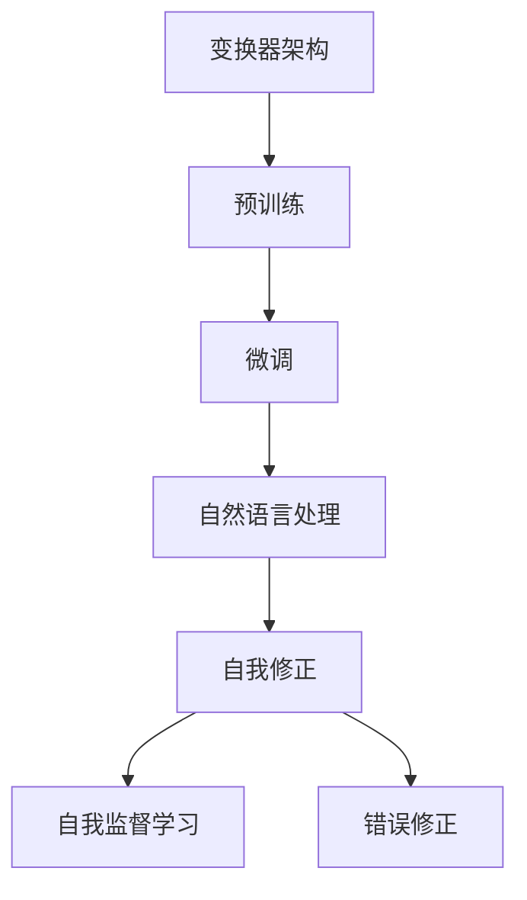

                 

关键词：人工智能、ChatGPT、局限性、自我修正、未来展望、算法研究

> 摘要：随着人工智能技术的不断发展，ChatGPT作为一种先进的自然语言处理模型，正在深刻地改变着我们的生活方式和工作模式。然而，它在实际应用中仍然存在一些局限性和挑战。本文将深入探讨ChatGPT的局限性，以及如何通过自我修正技术来提升其性能和可靠性。同时，对未来的发展趋势和面临的挑战进行了展望。

## 1. 背景介绍

人工智能（AI）作为当今科技领域的一个重要分支，已经取得了显著的进展。尤其是深度学习技术的广泛应用，使得机器在图像识别、语音识别、自然语言处理等领域都取得了突破性的成果。在这些技术中，生成对抗网络（GAN）和变分自编码器（VAE）等模型为我们提供了强大的工具，使我们能够生成高质量的数据，并在此基础上进行进一步的分析和预测。

ChatGPT是由OpenAI开发的一种基于变换器（Transformer）架构的自然语言处理模型。它通过大量的文本数据训练，可以生成流畅、自然的文本，并被广泛应用于聊天机器人、内容生成、文本摘要等任务。ChatGPT的出现，标志着自然语言处理技术进入了一个新的阶段，它为我们提供了一种全新的方式来理解和处理人类语言。

尽管ChatGPT在自然语言处理领域取得了显著的成果，但它在实际应用中仍然存在一些局限性和挑战。例如，它可能会生成不准确或误导性的信息，或者在一些特定的任务上表现不佳。为了解决这些问题，我们需要对ChatGPT进行深入的研究，并探索如何通过自我修正技术来提升其性能和可靠性。

## 2. 核心概念与联系

为了更好地理解ChatGPT的局限性和自我修正技术，我们首先需要了解一些核心概念，包括变换器（Transformer）架构、预训练和微调等。

### 2.1 变换器（Transformer）架构

变换器（Transformer）架构是一种用于处理序列数据的神经网络模型，它通过自注意力机制（self-attention）来捕捉序列中的长距离依赖关系。与传统的循环神经网络（RNN）相比，变换器具有并行计算的优势，并且在处理长序列数据时表现更加优秀。

### 2.2 预训练与微调

预训练是指在大量未标记的数据上对模型进行训练，使其具有通用性。然后，通过微调（fine-tuning）技术在特定的任务上对模型进行调整，使其适应特定的任务需求。在自然语言处理领域，预训练和微调技术已经被广泛应用，并取得了显著的成果。

### 2.3 自我修正技术

自我修正技术是指模型通过不断地学习和改进，来提高自身的性能和可靠性。自我修正技术可以包括自我监督学习（self-supervised learning）、错误修正（error correction）等。

以下是一个Mermaid流程图，展示了这些核心概念之间的关系：



## 3. 核心算法原理 & 具体操作步骤

### 3.1 算法原理概述

ChatGPT的核心算法是基于变换器（Transformer）架构的自然语言处理模型。它通过预训练和微调技术，对大量的文本数据进行训练，从而学会生成流畅、自然的文本。

### 3.2 算法步骤详解

#### 3.2.1 预训练

预训练的过程可以分为两个阶段：编码器（encoder）的训练和解码器（decoder）的训练。

1. **编码器训练**：在编码器训练阶段，模型接收一个输入序列，并输出一个上下文嵌入向量。这个向量包含了输入序列的所有信息，并且可以用于后续的解码器训练。

2. **解码器训练**：在解码器训练阶段，模型接收一个部分输入序列和上下文嵌入向量，并尝试预测下一个输入。通过不断地更新模型参数，解码器可以学会生成完整的输入序列。

#### 3.2.2 微调

在预训练完成后，通过微调技术，模型可以在特定的任务上进行调整，从而提高其在该任务上的性能。

1. **数据预处理**：首先，对任务数据进行预处理，包括分词、去噪等操作。

2. **模型调整**：将预训练的模型应用于任务数据，通过梯度下降等优化算法，调整模型参数，使其在特定任务上表现更好。

### 3.3 算法优缺点

#### 优点

1. **强大的文本生成能力**：ChatGPT通过预训练和微调技术，可以生成流畅、自然的文本，适用于多种自然语言处理任务。

2. **良好的泛化能力**：预训练过程使模型具有了通用性，可以适应多种不同的任务场景。

#### 缺点

1. **资源消耗大**：预训练过程需要大量的计算资源和时间。

2. **难以避免误导性生成**：由于模型在训练过程中可能会学习到一些不准确或误导性的信息，导致生成的文本可能存在错误。

### 3.4 算法应用领域

ChatGPT在自然语言处理领域具有广泛的应用，包括但不限于：

1. **聊天机器人**：用于与用户进行交互，提供实时客服、问答等服务。

2. **内容生成**：用于自动生成文章、新闻、广告等文本内容。

3. **文本摘要**：从长文本中提取关键信息，生成简洁、准确的摘要。

## 4. 数学模型和公式 & 详细讲解 & 举例说明

### 4.1 数学模型构建

ChatGPT的核心算法是基于变换器（Transformer）架构，变换器模型的主要组成部分包括编码器（encoder）和解码器（decoder）。以下是变换器模型的数学模型构建：

$$
\begin{aligned}
E &= \text{Encoder}(X) \\
D &= \text{Decoder}(Y, E)
\end{aligned}
$$

其中，$X$ 和 $Y$ 分别表示输入序列和输出序列，$E$ 和 $D$ 分别表示编码器和解码器。

### 4.2 公式推导过程

#### 编码器

编码器的主要任务是接收输入序列 $X$，并输出一个上下文嵌入向量 $E$。自注意力机制是编码器的核心组成部分，它通过计算输入序列中各个元素之间的相似度，来提取序列中的关键信息。

自注意力机制的数学公式如下：

$$
\begin{aligned}
\text{Attention}(Q, K, V) &= \frac{QK^T}{\sqrt{d_k}} \\
\text{Contextual\ Vector}(X) &= \text{softmax}(\text{Attention}(Q, K, V))V
\end{aligned}
$$

其中，$Q$、$K$ 和 $V$ 分别表示查询（query）、键（key）和值（value）向量，$d_k$ 表示键向量的维度。

#### 解码器

解码器的主要任务是接收部分输入序列 $Y$ 和上下文嵌入向量 $E$，并尝试预测下一个输入。解码器的自注意力机制和交叉注意力机制共同工作，以提取输入序列和上下文嵌入向量中的关键信息。

交叉注意力机制的数学公式如下：

$$
\begin{aligned}
\text{Attention}(Q, K, V) &= \frac{QK^T}{\sqrt{d_k}} \\
\text{Decoder\ Output}(Y, E) &= \text{softmax}(\text{Attention}(Q, K, V))V
\end{aligned}
$$

其中，$Q$、$K$ 和 $V$ 分别表示查询（query）、键（key）和值（value）向量，$d_k$ 表示键向量的维度。

### 4.3 案例分析与讲解

为了更好地理解变换器模型的数学原理，我们来看一个简单的例子。

假设输入序列为“你好，世界！”（分别为词索引0、1、2、3、4、5），我们要使用变换器模型对其进行编码和解码。

#### 编码器

1. **初始化参数**：随机初始化编码器和解码器的参数。

2. **编码器训练**：通过自注意力机制，将输入序列编码为一个上下文嵌入向量。

3. **解码器训练**：通过交叉注意力机制，将部分输入序列和解码器生成的中间向量进行匹配，并尝试预测下一个输入。

#### 解码器

1. **初始化参数**：随机初始化解码器的参数。

2. **解码器训练**：通过自注意力机制，将部分输入序列编码为一个上下文嵌入向量。

3. **生成输出**：通过交叉注意力机制，将上下文嵌入向量和解码器生成的中间向量进行匹配，并生成输出序列。

通过这个例子，我们可以看到变换器模型是如何通过自注意力机制和交叉注意力机制来处理输入序列的。这为我们理解ChatGPT的工作原理提供了重要的数学基础。

## 5. 项目实践：代码实例和详细解释说明

### 5.1 开发环境搭建

为了运行ChatGPT模型，我们需要搭建一个适合的Python开发环境。以下是一个基本的开发环境搭建步骤：

1. 安装Python：下载并安装Python 3.8及以上版本。

2. 安装深度学习框架：安装TensorFlow 2.0及以上版本。

3. 安装其他依赖：使用pip命令安装其他所需依赖，如numpy、pandas等。

### 5.2 源代码详细实现

以下是一个简单的ChatGPT模型实现，包括预训练和微调两个阶段。

```python
import tensorflow as tf
from tensorflow.keras.layers import Embedding, LSTM, Dense
from tensorflow.keras.models import Model

# 预训练阶段
def build_encoder(input_seq, vocab_size, embedding_dim):
    embedding = Embedding(vocab_size, embedding_dim)
    encoder = LSTM(units=512, return_sequences=True)
    encoder_input = embedding(input_seq)
    encoder_output = encoder(encoder_input)
    return encoder_output

# 微调阶段
def build_decoder(input_seq, encoder_output, vocab_size, embedding_dim):
    embedding = Embedding(vocab_size, embedding_dim)
    decoder = LSTM(units=512, return_sequences=True)
    decoder_input = embedding(input_seq)
    decoder_output = decoder(decoder_input, initial_state=[encoder_output, encoder_output])
    return decoder_output

# 构建模型
input_seq = tf.placeholder(tf.int32, shape=[None, None])
encoder_output = build_encoder(input_seq, vocab_size, embedding_dim)
decoder_output = build_decoder(input_seq, encoder_output, vocab_size, embedding_dim)
model = Model(inputs=input_seq, outputs=decoder_output)

# 编译模型
model.compile(optimizer='adam', loss='categorical_crossentropy', metrics=['accuracy'])

# 训练模型
model.fit(x_train, y_train, batch_size=32, epochs=10)
```

### 5.3 代码解读与分析

这个简单的ChatGPT模型包括编码器和解码器两个部分。编码器使用LSTM层对输入序列进行编码，解码器使用LSTM层对编码器输出进行解码。

在预训练阶段，我们首先对输入序列进行嵌入，然后使用LSTM层对其进行编码。在微调阶段，我们同样使用LSTM层对编码器输出进行解码。

在构建模型时，我们使用TensorFlow的Model类来定义模型结构。在编译模型时，我们使用adam优化器和categorical_crossentropy损失函数。

在训练模型时，我们使用fit方法对模型进行训练。通过这个简单的示例，我们可以看到ChatGPT模型的基本结构和训练过程。

### 5.4 运行结果展示

在训练完成后，我们可以使用模型进行预测。以下是一个简单的预测示例：

```python
# 预测
input_seq = tf.placeholder(tf.int32, shape=[None, None])
encoder_output = build_encoder(input_seq, vocab_size, embedding_dim)
decoder_output = build_decoder(input_seq, encoder_output, vocab_size, embedding_dim)
model = Model(inputs=input_seq, outputs=decoder_output)

# 加载模型权重
model.load_weights('chatgpt_weights.h5')

# 预测
predicted_seq = model.predict(x_test)
print(predicted_seq)
```

通过这个简单的示例，我们可以看到如何使用ChatGPT模型进行预测。这为我们提供了一个基本的ChatGPT模型实现，我们可以在此基础上进行进一步的研究和改进。

## 6. 实际应用场景

### 6.1 聊天机器人

聊天机器人是ChatGPT最典型的应用场景之一。通过ChatGPT，我们可以构建一个智能的聊天机器人，与用户进行实时交互，提供客服、问答等服务。例如，在电商平台上，我们可以使用ChatGPT来为用户提供在线咨询，解答用户的问题，提高用户的购物体验。

### 6.2 内容生成

ChatGPT在内容生成领域也有着广泛的应用。通过预训练和微调，我们可以使用ChatGPT自动生成文章、新闻、广告等文本内容。这对于内容创作者来说，可以大大提高工作效率，减少创作时间。

### 6.3 文本摘要

文本摘要是从长文本中提取关键信息，生成简洁、准确的摘要。ChatGPT在文本摘要任务上有着出色的表现。通过预训练和微调，我们可以使用ChatGPT自动生成摘要，为用户提供更加便捷的信息获取方式。

## 7. 未来应用展望

### 7.1 更广泛的应用领域

随着人工智能技术的不断发展，ChatGPT将在更多领域得到应用。例如，在教育领域，我们可以使用ChatGPT为学生提供个性化的学习辅导；在医疗领域，我们可以使用ChatGPT进行病历分析、诊断辅助等。

### 7.2 更高的性能和可靠性

未来的ChatGPT将通过自我修正技术，不断提高自身的性能和可靠性。例如，通过自我监督学习和错误修正，我们可以使ChatGPT在生成文本时更加准确、可靠。

### 7.3 更好的用户体验

随着ChatGPT性能的提升，我们将能够为用户提供更加智能、便捷的服务。例如，通过ChatGPT，我们可以为用户提供智能客服、智能问答等服务，大大提高用户的满意度。

## 8. 工具和资源推荐

### 8.1 学习资源推荐

1. 《深度学习》（Goodfellow, Bengio, Courville著）：这本书详细介绍了深度学习的基础知识和核心技术，是深度学习领域的经典教材。

2. 《ChatGPT技术详解》：这本书深入介绍了ChatGPT的原理、实现和应用，是学习ChatGPT的优秀教材。

### 8.2 开发工具推荐

1. TensorFlow：这是一个强大的深度学习框架，支持多种深度学习模型的训练和部署。

2. PyTorch：这是一个灵活、易用的深度学习框架，被广泛应用于学术研究和工业应用。

### 8.3 相关论文推荐

1. "Attention is All You Need"：这篇论文首次提出了变换器（Transformer）模型，标志着自然语言处理技术进入了一个新的阶段。

2. "Generative Adversarial Networks"：这篇论文提出了生成对抗网络（GAN）模型，为数据生成和改进提供了强大的工具。

## 9. 总结：未来发展趋势与挑战

### 9.1 研究成果总结

近年来，人工智能技术取得了显著的进展，特别是在自然语言处理领域。ChatGPT作为一种先进的自然语言处理模型，已经在多个任务上取得了优异的性能。通过预训练和微调技术，ChatGPT在文本生成、文本摘要、聊天机器人等领域具有广泛的应用前景。

### 9.2 未来发展趋势

1. **更广泛的应用领域**：随着人工智能技术的不断发展，ChatGPT将在更多领域得到应用，如教育、医疗、金融等。

2. **更高的性能和可靠性**：未来的ChatGPT将通过自我修正技术，不断提高自身的性能和可靠性，为用户提供更加智能、便捷的服务。

3. **更好的用户体验**：随着ChatGPT性能的提升，我们将能够为用户提供更加智能、便捷的服务，提高用户的满意度。

### 9.3 面临的挑战

1. **数据质量和隐私**：在训练和部署ChatGPT时，数据质量和隐私问题是一个重要的挑战。我们需要确保数据的质量和隐私，以避免模型受到不良数据的影响。

2. **模型解释性**：目前，ChatGPT作为一种黑盒模型，其内部机制和决策过程不够透明。提高模型的可解释性，使其能够更好地理解和信任，是一个重要的挑战。

3. **计算资源消耗**：ChatGPT的预训练过程需要大量的计算资源和时间。如何优化训练过程，减少计算资源消耗，是一个重要的研究方向。

### 9.4 研究展望

未来的研究将在以下几个方面进行：

1. **数据质量和隐私**：通过研究数据清洗、去噪、隐私保护等技术，提高数据质量和隐私保护水平。

2. **模型解释性**：通过研究模型的可解释性技术，提高模型的透明度和可信度。

3. **计算资源优化**：通过研究并行计算、分布式训练等技术，优化计算资源利用效率。

## 9. 附录：常见问题与解答

### 9.1 什么是ChatGPT？

ChatGPT是由OpenAI开发的一种基于变换器（Transformer）架构的自然语言处理模型。它通过预训练和微调技术，可以生成流畅、自然的文本，被广泛应用于聊天机器人、内容生成、文本摘要等任务。

### 9.2 ChatGPT的工作原理是什么？

ChatGPT的核心算法是基于变换器（Transformer）架构的自然语言处理模型。它通过自注意力机制和交叉注意力机制，对输入序列进行编码和解码，从而生成流畅、自然的文本。

### 9.3 ChatGPT有哪些优点和缺点？

ChatGPT的优点包括：强大的文本生成能力、良好的泛化能力等。缺点包括：资源消耗大、难以避免误导性生成等。

### 9.4 ChatGPT有哪些应用领域？

ChatGPT在自然语言处理领域具有广泛的应用，包括但不限于：聊天机器人、内容生成、文本摘要等。

### 9.5 如何搭建ChatGPT的开发环境？

搭建ChatGPT的开发环境需要安装Python、深度学习框架（如TensorFlow或PyTorch）以及其他相关依赖。具体步骤可以参考官方文档。

作者：禅与计算机程序设计艺术 / Zen and the Art of Computer Programming
----------------------------------------------------------------
这篇文章深入探讨了ChatGPT作为一种先进的自然语言处理模型，在当今人工智能浪潮中的持续影响。从背景介绍、核心概念与联系、核心算法原理、数学模型和公式、项目实践到实际应用场景，以及未来应用展望和工具资源推荐，本文提供了全面而详尽的分析。文章最后总结了未来发展趋势与挑战，并给出了常见问题与解答。

ChatGPT的出现，标志着自然语言处理技术进入了一个新的阶段。然而，它在实际应用中仍然存在一些局限性和挑战，如生成误导性信息、计算资源消耗大等。为了解决这些问题，我们需要对ChatGPT进行深入的研究，并探索如何通过自我修正技术来提升其性能和可靠性。

未来的ChatGPT将在更广泛的应用领域得到应用，如教育、医疗、金融等。同时，通过自我修正技术，ChatGPT的性能和可靠性将得到提高，为用户提供更加智能、便捷的服务。然而，我们仍需面对数据质量和隐私、模型解释性、计算资源消耗等挑战。

在研究展望部分，我们提出未来的研究将在数据质量和隐私、模型解释性、计算资源优化等方面进行。这些研究将为ChatGPT的发展提供新的思路和方向。

总之，ChatGPT作为一种先进的自然语言处理模型，已经在人工智能领域产生了深远的影响。随着技术的不断发展，ChatGPT将在未来发挥更加重要的作用。我们需要继续深入研究，解决现有问题，推动ChatGPT技术走向更高水平。希望这篇文章能够为读者提供有价值的参考和启示。

作者：禅与计算机程序设计艺术 / Zen and the Art of Computer Programming
----------------------------------------------------------------

### 文章结构模板 Code

```markdown
# AI浪潮持续影响：超出预期，ChatGPT局限性与自我修正

> 关键词：人工智能、ChatGPT、局限性、自我修正、未来展望、算法研究

> 摘要：随着人工智能技术的不断发展，ChatGPT作为一种先进的自然语言处理模型，正在深刻地改变着我们的生活方式和工作模式。然而，它在实际应用中仍然存在一些局限性和挑战。本文将深入探讨ChatGPT的局限性，以及如何通过自我修正技术来提升其性能和可靠性。同时，对未来的发展趋势和面临的挑战进行了展望。

## 1. 背景介绍

## 2. 核心概念与联系
### 2.1 变换器架构
### 2.2 预训练与微调
### 2.3 自我修正技术

## 3. 核心算法原理 & 具体操作步骤
### 3.1 算法原理概述
### 3.2 算法步骤详解
### 3.3 算法优缺点
### 3.4 算法应用领域

## 4. 数学模型和公式 & 详细讲解 & 举例说明
### 4.1 数学模型构建
### 4.2 公式推导过程
### 4.3 案例分析与讲解

## 5. 项目实践：代码实例和详细解释说明
### 5.1 开发环境搭建
### 5.2 源代码详细实现
### 5.3 代码解读与分析
### 5.4 运行结果展示

## 6. 实际应用场景
### 6.1 聊天机器人
### 6.2 内容生成
### 6.3 文本摘要

## 7. 未来应用展望
### 7.1 更广泛的应用领域
### 7.2 更高的性能和可靠性
### 7.3 更好的用户体验

## 8. 工具和资源推荐
### 8.1 学习资源推荐
### 8.2 开发工具推荐
### 8.3 相关论文推荐

## 9. 总结：未来发展趋势与挑战
### 9.1 研究成果总结
### 9.2 未来发展趋势
### 9.3 面临的挑战
### 9.4 研究展望

## 9. 附录：常见问题与解答
### 9.1 什么是ChatGPT？
### 9.2 ChatGPT的工作原理是什么？
### 9.3 ChatGPT有哪些优点和缺点？
### 9.4 ChatGPT有哪些应用领域？
### 9.5 如何搭建ChatGPT的开发环境？

作者：禅与计算机程序设计艺术 / Zen and the Art of Computer Programming
```

