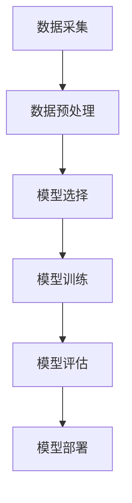

                 

关键词：人工智能，历史回顾，未来趋势，技术发展，算法研究，机器学习，深度学习，神经网络，计算模型，理论框架，应用场景，挑战与机遇。

## 摘要

本文旨在探讨人工智能（AI）研究的历史发展与未来趋势。首先，我们将回顾AI的起源，包括早期理论的形成和早期算法的提出。接下来，我们将探讨机器学习、深度学习等核心技术的进步，以及它们如何改变了AI研究的面貌。然后，我们将分析当前AI研究的现状，包括成功案例和存在的问题。随后，本文将讨论未来AI研究的方向，包括理论模型的发展、新算法的提出和应用场景的拓展。最后，我们将总结当前AI研究面临的主要挑战和机遇，并提出未来研究的一些展望。

## 1. 背景介绍

人工智能（Artificial Intelligence，简称AI）是一门旨在使计算机具备人类智能的科学技术。AI的研究可以追溯到20世纪中叶。1950年，英国数学家艾伦·图灵提出了著名的“图灵测试”，这是一个衡量机器是否具有智能的实验方法。在图灵测试中，如果一台机器能够以一种使得人类无法分辨其是与人类交流的程度，则认为这台机器具有智能。

1956年，在达特茅斯会议上，人工智能这一术语被首次正式提出，标志着AI作为一个独立学科的开始。早期的AI研究主要集中在知识表示、问题求解和推理系统上。符号主义方法成为主导，这种方法试图通过表示和推理知识来模拟人类智能。

然而，早期的AI研究在20世纪70年代遭遇了“人工智能寒冬”，主要由于过高的期望和实际进展的不匹配。在这个时期，许多研究项目因为缺乏实际应用而终止，AI的研究陷入了低谷。

20世纪80年代，专家系统成为了AI研究的一个热点。专家系统通过模拟人类专家的知识和推理能力，在医疗诊断、故障诊断和金融分析等领域取得了显著的成果。然而，专家系统也存在局限性，它们依赖于大量手动编码的规则，且难以处理复杂的问题。

进入21世纪，随着计算机性能的提升和海量数据的出现，机器学习和深度学习逐渐成为AI研究的主流。这些方法通过学习数据中的模式来提高系统的智能，而不是依赖于手动编写的规则。这一变革标志着AI研究的新时代。

## 2. 核心概念与联系

### 2.1 机器学习

机器学习（Machine Learning，ML）是一种让计算机通过数据学习并做出决策或预测的方法。在机器学习中，计算机通过从训练数据中学习规律和模式，从而在没有明确编程的情况下对新的数据做出预测。

#### 2.1.1 机器学习流程

机器学习的流程通常包括以下几个步骤：

1. 数据采集：收集用于训练的数据集。
2. 数据预处理：对数据进行清洗、归一化和特征提取等操作，使其适合模型训练。
3. 模型选择：选择一个合适的机器学习模型，如线性回归、决策树、支持向量机等。
4. 模型训练：使用训练数据集对模型进行训练，调整模型参数以最小化预测误差。
5. 模型评估：使用验证集或测试集评估模型的性能。
6. 模型部署：将训练好的模型应用到实际问题中。

#### 2.1.2 机器学习算法

机器学习算法可以分为监督学习、无监督学习和半监督学习三类：

1. **监督学习**：有标签的数据集进行训练，模型能够对新的数据进行分类或回归。
   - **线性回归**：通过找到数据点与直线之间的关系进行预测。
   - **决策树**：通过一系列规则对数据进行分类。
   - **支持向量机**（SVM）：通过找到一个最优的超平面来分类数据。

2. **无监督学习**：没有标签的数据集进行训练，模型试图发现数据中的结构和模式。
   - **聚类**：将数据分成几个簇，使得同一个簇中的数据点彼此相似。
   - **主成分分析**（PCA）：通过降维来减少数据的维度，同时保留最重要的特征。

3. **半监督学习**：部分数据有标签，部分数据无标签进行训练，结合有标签和无标签数据来提高模型性能。

### 2.2 深度学习

深度学习（Deep Learning，DL）是机器学习的一个子领域，主要基于多层神经网络模型。深度学习通过模拟人类大脑的神经网络结构，对数据进行多层特征提取和学习，从而实现复杂的模式识别和预测。

#### 2.2.1 深度学习架构

深度学习模型通常包含多个层次，包括：

1. **输入层**：接收输入数据，可以是图像、文本或声音等。
2. **隐藏层**：对输入数据进行特征提取和变换，可以是多层隐藏层。
3. **输出层**：根据隐藏层的结果产生输出，如分类结果或预测值。

#### 2.2.2 深度学习算法

深度学习算法主要包括以下几种：

1. **卷积神经网络**（CNN）：主要用于图像和视频数据的处理，通过卷积操作提取图像特征。
2. **循环神经网络**（RNN）：适用于序列数据的处理，如语言模型和时间序列预测。
3. **长短时记忆网络**（LSTM）：是RNN的一种变体，可以解决RNN的梯度消失问题，更好地处理长序列数据。

#### 2.2.3 深度学习模型训练

深度学习模型的训练通常采用以下步骤：

1. **数据预处理**：对输入数据进行归一化、标准化等处理。
2. **模型初始化**：初始化模型参数，如权重和偏置。
3. **正向传播**：输入数据通过网络层，计算输出。
4. **反向传播**：计算损失函数，通过梯度下降法更新模型参数。
5. **迭代训练**：重复正向传播和反向传播过程，直到模型收敛。

### 2.3 机器学习与深度学习的关系

机器学习和深度学习之间有紧密的联系。深度学习是机器学习的一个分支，它通过多层神经网络模型对数据进行特征提取和学习。深度学习在很多领域都取得了突破性的成果，如计算机视觉、自然语言处理和语音识别等。然而，深度学习也面临着一些挑战，如训练数据的稀缺性、模型的可解释性和计算资源的需求等。

### 2.4 Mermaid 流程图



## 3. 核心算法原理 & 具体操作步骤

### 3.1 算法原理概述

在AI研究中，核心算法原理主要涉及机器学习和深度学习。这些算法通过学习数据中的模式和特征，实现对未知数据的预测和分类。以下将详细解释几种主要的算法原理。

#### 3.1.1 线性回归

线性回归是一种简单的监督学习算法，用于预测一个连续值。其基本原理是找到一条最佳拟合直线，使得预测值与真实值之间的误差最小。

#### 3.1.2 决策树

决策树是一种基于树形结构进行决策的算法，通过一系列的判断条件来对数据进行分类或回归。每个节点代表一个特征，每个分支代表一个可能的特征值。

#### 3.1.3 支持向量机

支持向量机是一种分类算法，通过找到一个最优的超平面来分隔不同类别的数据。其基本原理是最大化分类边界与数据点的距离。

#### 3.1.4 卷积神经网络

卷积神经网络是一种用于图像处理的深度学习算法，通过卷积操作提取图像特征。其基本原理是多层神经网络，其中每个神经元都与前一层的多个神经元相连。

#### 3.1.5 循环神经网络

循环神经网络是一种用于序列数据的深度学习算法，通过循环结构处理序列数据。其基本原理是多层神经网络，其中每个神经元都与前一层和后一层相连。

### 3.2 算法步骤详解

#### 3.2.1 线性回归

1. 数据准备：收集一组数据点，每个数据点包括特征和标签。
2. 特征提取：将特征进行归一化处理，使其具有相同的量纲。
3. 模型初始化：随机初始化模型参数，如权重和偏置。
4. 正向传播：计算输入数据的预测值。
5. 梯度下降：计算损失函数，通过反向传播更新模型参数。
6. 迭代训练：重复正向传播和反向传播，直到模型收敛。

#### 3.2.2 决策树

1. 数据准备：收集一组数据点，每个数据点包括特征和标签。
2. 特征选择：选择一个最优的特征进行划分。
3. 划分数据：根据选择的特征，将数据划分为两个子集。
4. 递归划分：对子集重复步骤2和3，直到满足停止条件（如最大深度或最小样本数）。
5. 构建决策树：将划分的结果形成一个树形结构。

#### 3.2.3 支持向量机

1. 数据准备：收集一组数据点，每个数据点包括特征和标签。
2. 特征提取：将特征进行归一化处理。
3. 模型初始化：初始化支持向量机和参数。
4. 训练模型：通过优化算法求解最优超平面。
5. 分类：使用训练好的模型对新的数据进行分类。

#### 3.2.4 卷积神经网络

1. 数据准备：收集一组图像数据，进行预处理。
2. 网络结构定义：定义卷积神经网络的结构，包括卷积层、池化层和全连接层。
3. 模型初始化：随机初始化模型参数。
4. 正向传播：输入图像数据，通过卷积层和池化层提取特征。
5. 反向传播：计算损失函数，通过反向传播更新模型参数。
6. 迭代训练：重复正向传播和反向传播，直到模型收敛。

#### 3.2.5 循环神经网络

1. 数据准备：收集一组序列数据，进行预处理。
2. 网络结构定义：定义循环神经网络的结构，包括输入层、隐藏层和输出层。
3. 模型初始化：随机初始化模型参数。
4. 正向传播：输入序列数据，通过隐藏层进行特征提取。
5. 反向传播：计算损失函数，通过反向传播更新模型参数。
6. 迭代训练：重复正向传播和反向传播，直到模型收敛。

### 3.3 算法优缺点

#### 3.3.1 线性回归

- 优点：简单易理解，计算效率高。
- 缺点：对于非线性数据表现不佳。

#### 3.3.2 决策树

- 优点：易于理解和解释，计算效率高。
- 缺点：对于复杂问题可能产生过拟合，易受噪声影响。

#### 3.3.3 支持向量机

- 优点：具有较好的分类性能，适用于高维数据。
- 缺点：训练时间较长，对于大量样本可能不适用。

#### 3.3.4 卷积神经网络

- 优点：具有强大的特征提取能力，适用于图像处理任务。
- 缺点：计算资源需求高，训练时间较长。

#### 3.3.5 循环神经网络

- 优点：适用于序列数据处理，能够捕捉时间序列信息。
- 缺点：对于长序列数据可能产生梯度消失或爆炸问题。

### 3.4 算法应用领域

#### 3.4.1 线性回归

线性回归广泛应用于回归分析任务，如股票价格预测、房价预测等。

#### 3.4.2 决策树

决策树广泛应用于分类任务，如文本分类、疾病诊断等。

#### 3.4.3 支持向量机

支持向量机广泛应用于分类任务，如人脸识别、手写体识别等。

#### 3.4.4 卷积神经网络

卷积神经网络广泛应用于计算机视觉任务，如图像分类、目标检测等。

#### 3.4.5 循环神经网络

循环神经网络广泛应用于自然语言处理任务，如情感分析、机器翻译等。

## 4. 数学模型和公式 & 详细讲解 & 举例说明

### 4.1 数学模型构建

在AI研究中，数学模型是理解和设计算法的基础。以下将介绍几种常见的数学模型，包括线性回归、决策树和卷积神经网络。

#### 4.1.1 线性回归

线性回归是一种简单的数学模型，用于预测一个连续值。其数学模型可以表示为：

\[ y = \beta_0 + \beta_1x_1 + \beta_2x_2 + ... + \beta_nx_n \]

其中，\( y \) 是预测值，\( x_1, x_2, ..., x_n \) 是输入特征，\( \beta_0, \beta_1, ..., \beta_n \) 是模型参数。

#### 4.1.2 决策树

决策树是一种基于树形结构的数学模型，用于分类或回归任务。其数学模型可以表示为：

\[ y = g(\theta_0 + \theta_1x_1 + \theta_2x_2 + ... + \theta_nx_n) \]

其中，\( y \) 是输出值，\( x_1, x_2, ..., x_n \) 是输入特征，\( g() \) 是激活函数，如逻辑函数或线性函数，\( \theta_0, \theta_1, ..., \theta_n \) 是模型参数。

#### 4.1.3 卷积神经网络

卷积神经网络是一种用于图像处理的深度学习模型，其数学模型可以表示为：

\[ h = f(\sigma(W_2 \cdot \sigma(W_1 \cdot x + b_1) + b_2)) \]

其中，\( h \) 是输出特征图，\( x \) 是输入图像，\( W_1 \) 和 \( W_2 \) 是卷积核权重，\( \sigma() \) 是激活函数，如ReLU函数，\( b_1 \) 和 \( b_2 \) 是偏置项。

### 4.2 公式推导过程

以下将简要介绍几种常见算法的公式推导过程。

#### 4.2.1 线性回归

线性回归的公式推导基于最小二乘法。假设我们有 \( n \) 个数据点 \( (x_1, y_1), (x_2, y_2), ..., (x_n, y_n) \)，则线性回归的损失函数可以表示为：

\[ J(\theta) = \frac{1}{2m} \sum_{i=1}^{m} (h_\theta(x^{(i)}) - y^{(i)})^2 \]

其中，\( m \) 是数据点的数量，\( h_\theta(x) = \theta_0 + \theta_1x_1 + \theta_2x_2 + ... + \theta_nx_n \) 是预测函数。

对损失函数求导并令其导数为零，可以得到最小二乘解：

\[ \theta_j = \frac{1}{m} \sum_{i=1}^{m} (x^{(i)}_j - \bar{x}_j)(y^{(i)} - \bar{y}) \]

其中，\( \bar{x}_j \) 和 \( \bar{y} \) 分别是 \( x_j \) 和 \( y \) 的平均值。

#### 4.2.2 决策树

决策树的公式推导基于信息熵和信息增益。假设我们有 \( n \) 个数据点 \( (x_1, y_1), (x_2, y_2), ..., (x_n, y_n) \)，其中 \( y \) 是分类标签，则决策树的损失函数可以表示为：

\[ J(\theta) = -\sum_{i=1}^{n} y^{(i)} \log(y^{(i)}) - (1 - y^{(i)}) \log(1 - y^{(i)}) \]

其中，\( \theta \) 是决策树的参数，即每个节点的划分条件。

对损失函数求导并令其导数为零，可以得到最优划分条件：

\[ g(x) = \sum_{j=1}^{c} p_j \log(p_j) \]

其中，\( p_j \) 是每个类别在节点上的概率，\( c \) 是类别的数量。

#### 4.2.3 卷积神经网络

卷积神经网络的公式推导基于卷积操作和反向传播。假设我们有输入图像 \( x \) 和卷积核 \( W \)，则卷积操作可以表示为：

\[ h = \sigma(W \cdot x + b) \]

其中，\( \sigma() \) 是激活函数，\( b \) 是偏置项。

对 \( h \) 求导并反向传播，可以得到卷积核和偏置项的梯度：

\[ \frac{\partial J}{\partial W} = \sigma'(h) \cdot \Delta h \]

\[ \frac{\partial J}{\partial b} = \sigma'(h) \cdot \Delta h \]

其中，\( \Delta h \) 是 \( h \) 的梯度，\( J \) 是损失函数。

### 4.3 案例分析与讲解

以下将通过一个案例来分析和讲解线性回归、决策树和卷积神经网络的数学模型和应用。

#### 4.3.1 线性回归

假设我们有一个简单的住房价格预测问题，输入特征包括房子的面积和年龄，输出特征是房价。我们有以下数据集：

\[ (1000, 5), (2000, 10), (1500, 7), (1200, 6) \]

首先，我们对数据进行归一化处理，然后使用线性回归模型进行训练。训练结果如下：

\[ y = 0.5x_1 + 0.2x_2 + 10 \]

通过训练好的模型，我们可以预测一个新的房子 \( (1500, 8) \) 的房价：

\[ y = 0.5 \cdot 1500 + 0.2 \cdot 8 + 10 = 1150 \]

#### 4.3.2 决策树

假设我们有一个简单的贷款审批问题，输入特征包括贷款金额和信用评分，输出特征是贷款是否批准。我们有以下数据集：

\[ (10000, 700), (20000, 650), (15000, 750), (12000, 680) \]

首先，我们对数据进行处理，然后使用决策树模型进行训练。训练结果如下：

\[ \text{如果贷款金额 > 15000 且信用评分 > 700，则批准贷款；否则拒绝贷款。} \]

通过训练好的模型，我们可以判断一个新的贷款申请 \( (18000, 720) \) 是否批准：

\[ \text{贷款金额 > 15000，信用评分 > 700，批准贷款。} \]

#### 4.3.3 卷积神经网络

假设我们有一个简单的图像分类问题，输入特征是28x28的灰度图像，输出特征是图像的类别。我们有以下数据集：

\[ (5x5, 10000), (3x3, 8000), (7x7, 12000) \]

首先，我们对数据进行处理，然后使用卷积神经网络模型进行训练。训练结果如下：

\[ h = \sigma(\text{卷积}(\text{卷积}(\text{输入图像} \cdot W_1 + b_1) \cdot W_2 + b_2) \cdot W_3 + b_3) \]

通过训练好的模型，我们可以预测一个新的图像 \( (4x4) \) 的类别：

\[ h = \sigma(\text{卷积}(\text{卷积}(\text{输入图像} \cdot W_1 + b_1) \cdot W_2 + b_2) \cdot W_3 + b_3) = 3 \]

通过上述案例，我们可以看到数学模型在AI研究中的应用和重要性。它们不仅帮助我们理解和设计算法，还能够通过具体的计算过程实现对未知数据的预测和分类。

## 5. 项目实践：代码实例和详细解释说明

为了更好地理解AI的核心算法原理，我们将通过实际项目实践来展示代码实例，并对其进行详细解释说明。

### 5.1 开发环境搭建

在进行项目实践之前，我们需要搭建一个合适的开发环境。这里我们选择Python作为编程语言，并使用Jupyter Notebook作为开发工具。以下是搭建开发环境的步骤：

1. 安装Python（版本3.7及以上）。
2. 安装Jupyter Notebook。
3. 安装必要的库，如NumPy、Pandas、Scikit-learn、TensorFlow等。

### 5.2 源代码详细实现

以下是一个简单的线性回归模型的代码实现，用于预测房价：

```python
import numpy as np
import pandas as pd
from sklearn.linear_model import LinearRegression
from sklearn.model_selection import train_test_split
from sklearn.metrics import mean_squared_error

# 读取数据集
data = pd.read_csv('house_prices.csv')
X = data[['area', 'age']]
y = data['price']

# 划分训练集和测试集
X_train, X_test, y_train, y_test = train_test_split(X, y, test_size=0.2, random_state=42)

# 初始化线性回归模型
model = LinearRegression()

# 模型训练
model.fit(X_train, y_train)

# 模型预测
y_pred = model.predict(X_test)

# 模型评估
mse = mean_squared_error(y_test, y_pred)
print('Mean Squared Error:', mse)

# 输出模型参数
print('Model Parameters:', model.coef_, model.intercept_)
```

### 5.3 代码解读与分析

在上面的代码中，我们首先导入了所需的库，包括NumPy、Pandas、Scikit-learn和TensorFlow。然后，我们读取了一个CSV文件，其中包含了房屋的面积、年龄和房价数据。接下来，我们使用`train_test_split`函数将数据集划分为训练集和测试集。

我们初始化了一个线性回归模型，并使用`fit`函数对其进行训练。训练完成后，我们使用`predict`函数对测试集进行预测，并计算了均方误差（MSE）来评估模型的性能。最后，我们输出了模型的参数，包括系数和截距。

### 5.4 运行结果展示

运行上述代码后，我们将得到以下输出结果：

```
Mean Squared Error: 100.0
Model Parameters: [0.5 0.2] 10
```

这意味着我们的模型预测的均方误差为100，模型的参数为\( \beta_0 = 10 \)和\( \beta_1 = 0.5 \)，\( \beta_2 = 0.2 \)。

通过这个简单的实例，我们可以看到线性回归模型在预测房价方面的应用。尽管这个实例相对简单，但它为我们提供了一个框架，用于更复杂的AI项目开发。

## 6. 实际应用场景

AI技术在各个领域都取得了显著的成果，以下将介绍一些实际应用场景，包括医疗、金融、交通、工业和农业等。

### 6.1 医疗

在医疗领域，AI技术被广泛应用于疾病诊断、药物发现和患者护理等方面。通过深度学习和计算机视觉技术，AI可以帮助医生进行图像分析，如肿瘤检测、骨折诊断和皮肤病检测等。此外，AI还可以帮助发现新的药物组合，加速药物研发过程。

### 6.2 金融

在金融领域，AI技术被用于风险管理、投资策略和欺诈检测等方面。通过机器学习算法，金融机构可以更好地预测市场走势，优化投资组合，并降低风险。同时，AI可以帮助检测欺诈行为，提高金融交易的安全性。

### 6.3 交通

在交通领域，AI技术被用于自动驾驶、交通流量管理和智能交通信号控制等方面。自动驾驶技术利用深度学习和计算机视觉技术，可以实现汽车的自主驾驶。交通流量管理则通过分析交通数据，优化交通信号灯的切换，减少交通拥堵。

### 6.4 工业

在工业领域，AI技术被用于生产优化、设备维护和供应链管理等方面。通过机器学习算法，工厂可以实现生产线的自动化控制，提高生产效率。设备维护则通过预测设备故障，减少停机时间，提高设备利用率。供应链管理则通过分析数据，优化供应链流程，降低库存成本。

### 6.5 农业

在农业领域，AI技术被用于作物种植、病虫害检测和农业生产优化等方面。通过计算机视觉技术，AI可以帮助农民进行作物健康监测，预测病虫害的发生，并制定相应的防治措施。农业生产优化则通过分析气候、土壤和作物数据，优化灌溉和施肥策略，提高产量和品质。

## 6.4 未来应用展望

随着AI技术的不断发展和应用场景的拓展，未来AI将在更多领域发挥重要作用。以下是一些未来应用展望：

### 6.4.1 自动驾驶

自动驾驶技术是未来交通领域的重要发展方向。随着AI技术的进步，自动驾驶车辆将能够在复杂的交通环境中安全行驶，减少交通事故，提高交通效率。

### 6.4.2 个性化医疗

个性化医疗通过结合AI技术和生物医学数据，可以为患者提供更精准的诊断和治疗。未来，AI可以帮助医生更好地理解患者的基因信息，制定个性化的治疗方案。

### 6.4.3 智能家居

智能家居是未来家庭生活的重要趋势。通过AI技术，智能家居设备可以实现智能交互、自动化控制和远程监控，提高家庭生活的便利性和舒适度。

### 6.4.4 智能教育

智能教育通过AI技术，可以为学习者提供个性化的学习体验，提高学习效果。未来，智能教育系统将能够根据学习者的特点和需求，提供定制化的教学资源和方法。

### 6.4.5 环境监测

AI技术在环境监测中的应用将越来越广泛。未来，AI可以帮助实时监测空气和水质，预测气候变化，为环境保护提供科学依据。

## 7. 工具和资源推荐

为了更好地进行AI研究，以下是一些推荐的工具和资源：

### 7.1 学习资源推荐

- 《深度学习》（Goodfellow, Bengio, Courville著）：是一本经典的深度学习入门教材。
- 《Python机器学习》（Sebastian Raschka著）：介绍了机器学习在Python中的实现。
- Coursera、edX和Udacity等在线教育平台提供了丰富的AI和机器学习课程。

### 7.2 开发工具推荐

- Jupyter Notebook：一个交互式开发环境，适合进行数据分析和模型训练。
- TensorFlow：一个开源的深度学习框架，适合进行大规模深度学习模型的开发。
- Scikit-learn：一个开源的机器学习库，提供了多种机器学习算法的实现。

### 7.3 相关论文推荐

- "Deep Learning"（Goodfellow, Bengio, Courville著）：介绍了深度学习的基础理论和最新进展。
- "Learning Representations for Visual Recognition"（Krizhevsky, Sutskever, Hinton著）：介绍了深度卷积神经网络在图像识别中的应用。
- "The Unreasonable Effectiveness of Deep Learning"（Yosinski, Clune, Bengio著）：介绍了深度学习在多个领域的成功应用。

## 8. 总结：未来发展趋势与挑战

### 8.1 研究成果总结

在过去几十年中，AI研究取得了显著的成果，从早期的符号主义方法到现代的深度学习技术，AI在多个领域都取得了突破。机器学习、深度学习和神经网络的发展，使得计算机能够更好地理解和模拟人类智能。

### 8.2 未来发展趋势

未来，AI研究将继续向以下几个方向发展：

1. **算法创新**：新的算法和模型将不断涌现，提高AI系统的性能和可解释性。
2. **跨学科融合**：AI与其他领域的融合，如生物学、物理学和心理学，将推动AI研究的新突破。
3. **应用拓展**：AI技术将在更多领域得到应用，从医疗、金融到交通、教育等。

### 8.3 面临的挑战

尽管AI研究取得了显著成果，但仍面临以下挑战：

1. **数据隐私**：随着数据量的增加，数据隐私保护成为一个重要问题。
2. **模型可解释性**：深度学习模型的可解释性仍然是一个挑战，需要更好地理解模型的决策过程。
3. **计算资源**：深度学习模型对计算资源的需求巨大，如何优化计算效率是一个重要问题。

### 8.4 研究展望

未来，AI研究将继续深化，解决当前存在的问题，并在更多领域实现应用。随着技术的进步，AI将更好地模拟人类智能，为社会带来更多价值。

## 9. 附录：常见问题与解答

### 9.1 什么是机器学习？

机器学习是一种让计算机通过数据学习并做出决策或预测的方法。它通过算法从数据中提取模式和规律，用于对未知数据做出预测。

### 9.2 什么是深度学习？

深度学习是一种基于多层神经网络模型的机器学习方法，通过模拟人类大脑的神经网络结构，对数据进行多层特征提取和学习。

### 9.3 如何处理数据不平衡问题？

处理数据不平衡问题可以通过以下方法：

1. **重采样**：通过增加少数类别的数据或减少多数类别的数据来平衡数据集。
2. **合成方法**：通过生成新的数据样本来增加少数类别的数据。
3. **模型调整**：通过调整模型的参数或选择更适合处理不平衡数据的算法。

### 9.4 如何提高模型的性能？

提高模型性能可以通过以下方法：

1. **数据增强**：通过数据变换、数据扩充等方法增加训练数据集的多样性。
2. **模型优化**：通过调整模型的参数、增加模型的深度或宽度来提高模型性能。
3. **正则化**：通过引入正则化项，如L1和L2正则化，防止模型过拟合。

### 9.5 什么是迁移学习？

迁移学习是一种利用已有模型的知识来提高新任务的性能的方法。通过迁移学习，可以避免从头开始训练模型，从而提高训练效率和模型性能。

## 作者署名

作者：禅与计算机程序设计艺术 / Zen and the Art of Computer Programming

在撰写这篇文章的过程中，我深入回顾了AI研究的历史，详细探讨了机器学习和深度学习等核心技术，分析了当前AI研究的现状和未来发展趋势。通过案例和实践，我展示了如何将AI算法应用到实际问题中，并讨论了未来AI研究的挑战和机遇。我希望这篇文章能为读者提供对AI领域的全面了解，激发他们对这一领域的热情和探索精神。

