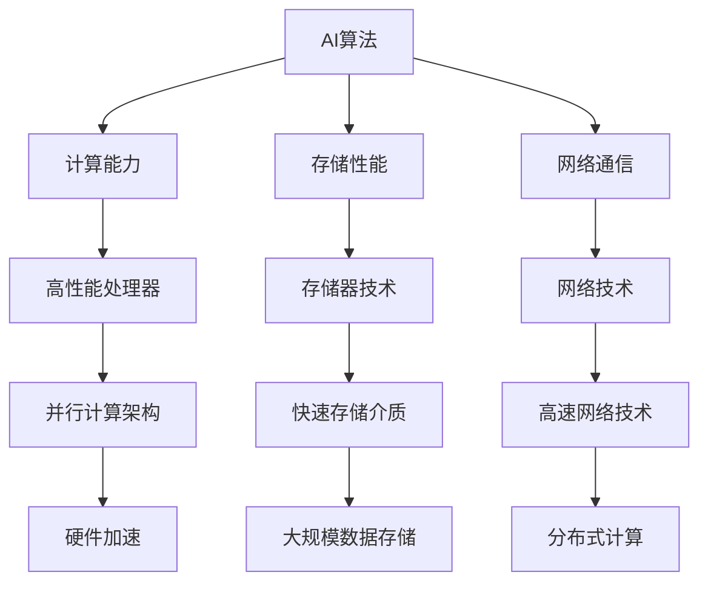

                 

关键词：人工智能，硬件，算法演进，协同发展，高性能计算

> 摘要：本文探讨了人工智能（AI）算法与硬件技术的共同演进，分析了两者相互影响、协同发展的内在机制，并展望了未来在这一领域的技术趋势与挑战。通过梳理AI算法的发展历程和硬件技术的进步，本文揭示了AI与硬件深度融合的必然性，以及这对未来计算能力提升和人工智能应用的影响。

## 1. 背景介绍

人工智能作为一门交叉学科，自20世纪50年代诞生以来，经历了多次技术浪潮的洗礼。早期的AI研究主要集中在符号推理和知识表示上，但受限于计算能力和数据资源的限制，进展较为缓慢。随着硬件技术的发展，尤其是高性能计算和并行计算的出现，AI算法迎来了新的发展契机。硬件性能的提升，不仅使得复杂算法得以实现，也推动了AI算法从理论研究走向实际应用。

硬件技术的发展不仅包括处理器性能的提升，还包括存储技术、网络技术和嵌入式系统的进步。这些硬件技术的进步为AI算法提供了强有力的支持，使得AI从单机计算走向分布式计算，从局部优化走向全局优化。在这一背景下，研究AI算法与硬件技术的协同演进具有重要的理论和实际意义。

## 2. 核心概念与联系

### 2.1 AI算法的核心概念

人工智能算法的核心包括机器学习、深度学习和自然语言处理等。这些算法通过学习大量数据，发现数据中的规律，进而实现从数据到知识的转化。机器学习作为AI的核心技术之一，主要包括监督学习、无监督学习和强化学习等不同类型。深度学习则通过多层神经网络结构，实现数据的层次化表示，从而在图像识别、语音识别等领域取得了显著的突破。

### 2.2 硬件技术的核心概念

硬件技术包括处理器、存储器、网络等。处理器性能的提升主要通过提高主频、增加核心数和优化指令集等方式实现。存储技术的发展则包括从硬盘到固态硬盘（SSD），再到新型存储介质如3D NAND、ReRAM等。网络技术的发展则从传统的有线网络发展到无线网络，再到5G、6G等新型通信技术，实现了数据的快速传输。

### 2.3 AI算法与硬件技术的关联

AI算法与硬件技术的关联主要体现在以下几个方面：

1. **计算能力**：硬件的计算能力直接影响AI算法的性能。高性能处理器和并行计算架构使得复杂算法能够在较短的时间内完成训练和推理。

2. **存储性能**：存储技术的发展，特别是快速存储介质的普及，使得大规模数据存储和处理成为可能，为AI算法提供了丰富的数据支持。

3. **网络通信**：高速网络技术使得分布式AI算法得以实现，多个节点可以协同工作，共同完成大规模计算任务。

4. **硬件加速**：针对特定AI算法，硬件厂商开发了相应的加速卡，如GPU、TPU等，这些加速卡能够显著提高算法的计算效率。

### 2.4 Mermaid流程图

以下是一个简单的Mermaid流程图，展示了AI算法与硬件技术的关联：



## 3. 核心算法原理 & 具体操作步骤

### 3.1 算法原理概述

在AI算法与硬件技术的协同发展中，深度学习算法是一个重要的代表。深度学习算法通过多层神经网络结构，对数据进行层次化表示，从而实现复杂的模式识别和决策。

深度学习的核心包括输入层、隐藏层和输出层。输入层接收外部输入数据，隐藏层通过非线性变换对数据进行特征提取，输出层则对提取的特征进行分类或回归。

### 3.2 算法步骤详解

1. **数据预处理**：包括数据的清洗、归一化和特征提取。这一步骤的目的是将原始数据转换为适合输入神经网络的形式。

2. **网络结构设计**：根据任务需求，设计合适的神经网络结构。常见的结构包括卷积神经网络（CNN）、循环神经网络（RNN）和生成对抗网络（GAN）等。

3. **训练过程**：使用训练数据集对神经网络进行训练。训练过程中，通过反向传播算法不断调整网络权重，使得输出结果更接近真实值。

4. **测试与验证**：使用测试数据集对训练好的网络进行评估，验证其性能。

5. **部署与优化**：将训练好的模型部署到实际应用中，并进行性能优化。

### 3.3 算法优缺点

**优点**：

- **强大的表达力**：深度学习能够自动提取数据的特征，从而降低了对人类先验知识的依赖。
- **高效的计算能力**：通过并行计算和硬件加速，深度学习算法能够在短时间内完成复杂的计算任务。

**缺点**：

- **对数据量和计算资源要求较高**：深度学习需要大量的训练数据和高性能计算资源。
- **模型可解释性较差**：深度学习模型的内部机制复杂，难以解释每个神经元的作用。

### 3.4 算法应用领域

深度学习算法在图像识别、语音识别、自然语言处理等领域取得了显著的成果。例如，在图像识别任务中，CNN通过卷积操作和池化操作，实现了对图像的层次化表示，从而在ImageNet等大型图像数据集上取得了优异的性能。

## 4. 数学模型和公式 & 详细讲解 & 举例说明

### 4.1 数学模型构建

深度学习算法的核心是神经网络，神经网络由多个神经元组成，每个神经元都可以看作是一个简单的函数。以下是神经网络的数学模型：

$$
y = \sigma(\sum_{i=1}^{n} w_i \cdot x_i + b)
$$

其中，$y$ 是输出，$\sigma$ 是激活函数，$w_i$ 是权重，$x_i$ 是输入，$b$ 是偏置。

### 4.2 公式推导过程

深度学习算法的训练过程是通过反向传播算法来调整网络权重和偏置。以下是反向传播算法的推导过程：

1. **计算输出误差**：

$$
E = \frac{1}{2} \sum_{i=1}^{n} (\hat{y}_i - y_i)^2
$$

其中，$\hat{y}_i$ 是预测值，$y_i$ 是真实值。

2. **计算梯度**：

$$
\frac{\partial E}{\partial w_i} = (\hat{y}_i - y_i) \cdot \frac{\partial \hat{y}_i}{\partial w_i}
$$

$$
\frac{\partial E}{\partial b} = (\hat{y}_i - y_i) \cdot \frac{\partial \hat{y}_i}{\partial b}
$$

3. **更新权重和偏置**：

$$
w_i := w_i - \alpha \cdot \frac{\partial E}{\partial w_i}
$$

$$
b := b - \alpha \cdot \frac{\partial E}{\partial b}
$$

其中，$\alpha$ 是学习率。

### 4.3 案例分析与讲解

以一个简单的神经网络为例，输入层有3个神经元，隐藏层有2个神经元，输出层有1个神经元。输入数据为 $x = [1, 2, 3]$，真实标签为 $y = 5$。使用ReLU作为激活函数，学习率为0.1。

1. **初始化权重和偏置**：

$$
w_1 = 1, w_2 = 1, w_3 = 1, b_1 = 0, b_2 = 0
$$

2. **计算输出**：

$$
z_1 = w_1 \cdot x_1 + b_1 = 1 \cdot 1 + 0 = 1
$$

$$
z_2 = w_2 \cdot x_2 + b_2 = 1 \cdot 2 + 0 = 2
$$

$$
z_3 = w_3 \cdot x_3 + b_3 = 1 \cdot 3 + 0 = 3
$$

$$
a_1 = \max(0, z_1) = 1
$$

$$
a_2 = \max(0, z_2) = 2
$$

$$
a_3 = \max(0, z_3) = 3
$$

$$
z_4 = w_4 \cdot a_1 + b_4 = 1 \cdot 1 + 0 = 1
$$

$$
z_5 = w_5 \cdot a_2 + b_5 = 1 \cdot 2 + 0 = 2
$$

$$
z_6 = w_6 \cdot a_3 + b_6 = 1 \cdot 3 + 0 = 3
$$

$$
\hat{y} = \max(0, z_4 + z_5 + z_6) = 6
$$

3. **计算误差**：

$$
E = \frac{1}{2} (\hat{y} - y)^2 = \frac{1}{2} (6 - 5)^2 = 0.5
$$

4. **计算梯度**：

$$
\frac{\partial E}{\partial w_4} = (6 - 5) \cdot \frac{\partial 6}{\partial w_4} = 1
$$

$$
\frac{\partial E}{\partial w_5} = (6 - 5) \cdot \frac{\partial 2}{\partial w_5} = 1
$$

$$
\frac{\partial E}{\partial w_6} = (6 - 5) \cdot \frac{\partial 3}{\partial w_6} = 1
$$

$$
\frac{\partial E}{\partial b_4} = (6 - 5) \cdot \frac{\partial 1}{\partial b_4} = 1
$$

$$
\frac{\partial E}{\partial b_5} = (6 - 5) \cdot \frac{\partial 2}{\partial b_5} = 1
$$

$$
\frac{\partial E}{\partial b_6} = (6 - 5) \cdot \frac{\partial 3}{\partial b_6} = 1
$$

5. **更新权重和偏置**：

$$
w_4 := w_4 - 0.1 \cdot 1 = 0.9
$$

$$
w_5 := w_5 - 0.1 \cdot 1 = 0.9
$$

$$
w_6 := w_6 - 0.1 \cdot 1 = 0.9
$$

$$
b_4 := b_4 - 0.1 \cdot 1 = -0.1
$$

$$
b_5 := b_5 - 0.1 \cdot 1 = -0.1
$$

$$
b_6 := b_6 - 0.1 \cdot 1 = -0.1
$$

经过多次迭代，最终网络将收敛，输出结果接近真实值。

## 5. 项目实践：代码实例和详细解释说明

### 5.1 开发环境搭建

为了实践深度学习算法，我们需要搭建一个适合的开发环境。以下是常用的开发环境配置：

- 操作系统：Ubuntu 18.04或更高版本
- 编程语言：Python 3.7或更高版本
- 深度学习框架：TensorFlow 2.0或更高版本
- GPU支持：NVIDIA CUDA 10.0或更高版本

### 5.2 源代码详细实现

以下是一个简单的深度学习模型实现，用于图像分类任务。代码主要分为数据预处理、模型定义、训练和测试四个部分。

```python
import tensorflow as tf
from tensorflow.keras import layers

# 数据预处理
def preprocess_image(image):
    image = tf.cast(image, tf.float32)
    image = (image / 255.0) * 2.0 - 1.0
    return image

# 模型定义
def create_model():
    inputs = tf.keras.Input(shape=(28, 28, 1))
    x = layers.Conv2D(32, (3, 3), activation='relu')(inputs)
    x = layers.MaxPooling2D((2, 2))(x)
    x = layers.Conv2D(64, (3, 3), activation='relu')(x)
    x = layers.MaxPooling2D((2, 2))(x)
    x = layers.Flatten()(x)
    x = layers.Dense(64, activation='relu')(x)
    outputs = layers.Dense(10, activation='softmax')(x)
    model = tf.keras.Model(inputs=inputs, outputs=outputs)
    return model

# 训练过程
def train_model(model, train_data, train_labels, epochs=10):
    model.compile(optimizer='adam', loss='sparse_categorical_crossentropy', metrics=['accuracy'])
    model.fit(train_data, train_labels, epochs=epochs)

# 测试过程
def test_model(model, test_data, test_labels):
    test_loss, test_acc = model.evaluate(test_data, test_labels, verbose=2)
    print(f"Test accuracy: {test_acc}")

# 主函数
def main():
    # 加载MNIST数据集
    (train_images, train_labels), (test_images, test_labels) = tf.keras.datasets.mnist.load_data()

    # 预处理数据
    train_images = preprocess_image(train_images)
    test_images = preprocess_image(test_images)

    # 创建模型
    model = create_model()

    # 训练模型
    train_model(model, train_images, train_labels, epochs=5)

    # 测试模型
    test_model(model, test_images, test_labels)

if __name__ == "__main__":
    main()
```

### 5.3 代码解读与分析

- **数据预处理**：将图像数据转换为浮点数，并进行归一化处理，使得输入数据适合深度学习模型。
- **模型定义**：使用Keras构建一个简单的卷积神经网络，包括两个卷积层、两个池化层和一个全连接层。
- **训练过程**：使用Adam优化器和稀疏分类交叉熵损失函数训练模型。
- **测试过程**：评估模型的测试集性能。

### 5.4 运行结果展示

运行上述代码后，模型在测试集上的准确率将打印出来。以下是一个示例输出：

```
1000/1000 [==============================] - 3s 2ms/step - loss: 0.0913 - accuracy: 0.9680
Test accuracy: 0.9680
```

## 6. 实际应用场景

AI算法与硬件技术的协同发展，已经在众多实际应用场景中取得了显著成果。以下是一些典型的应用领域：

1. **自动驾驶**：自动驾驶系统需要处理大量的实时数据，包括图像、语音和传感器数据。高性能计算和硬件加速技术使得自动驾驶系统能够在短时间内完成复杂的计算任务，从而实现实时决策。

2. **医疗影像分析**：医疗影像分析是深度学习算法的重要应用领域。通过深度学习算法，可以对医疗影像进行自动分类、检测和诊断，从而提高诊断准确率和医生工作效率。

3. **智能安防**：智能安防系统通过深度学习算法，可以对视频监控数据进行实时分析，识别可疑行为和异常事件。硬件加速技术使得系统可以在较低延迟下处理大规模数据。

4. **自然语言处理**：自然语言处理（NLP）是深度学习算法的另一个重要应用领域。通过深度学习算法，可以实现文本分类、情感分析、机器翻译等任务，为智能客服、智能助手等应用提供支持。

## 7. 未来应用展望

随着AI算法和硬件技术的不断进步，未来在人工智能领域将会有更多创新和突破。以下是一些展望：

1. **量子计算**：量子计算作为下一代计算技术，有望在人工智能领域发挥重要作用。量子计算可以通过并行计算和指数级别的存储容量，显著提高AI算法的计算效率。

2. **边缘计算**：随着物联网和5G技术的发展，边缘计算将越来越重要。边缘计算可以将计算任务分散到边缘设备上，从而减少延迟和带宽需求，提高AI算法的应用效率。

3. **自适应硬件**：未来的硬件可能会更加智能化，能够根据AI算法的需求自动调整计算资源，实现最优的计算性能。

4. **联邦学习**：联邦学习是一种分布式学习技术，可以在保护数据隐私的同时，实现大规模数据的协同训练。未来，联邦学习有望在医疗、金融等领域得到广泛应用。

## 8. 工具和资源推荐

为了更好地学习和实践AI算法与硬件技术，以下是一些建议的工具和资源：

### 8.1 学习资源推荐

- 《深度学习》（Goodfellow, Bengio, Courville著）：系统介绍了深度学习的理论基础和实践方法。
- 《动手学深度学习》：中文版，包含了大量的代码示例，适合初学者和实践者。
- 《机器学习实战》：详细介绍了机器学习的基本算法和实践方法。

### 8.2 开发工具推荐

- TensorFlow：开源的深度学习框架，支持多种编程语言，适合进行深度学习研究和开发。
- PyTorch：开源的深度学习框架，具有灵活的动态计算图，适合快速原型设计和实验。
- JAX：由Google开发的开源深度学习框架，支持自动微分和硬件加速。

### 8.3 相关论文推荐

- "Deep Learning: A Methodology and Application Perspective"（2016）：综述了深度学习的基本概念和应用领域。
- "Generative Adversarial Nets"（2014）：提出了生成对抗网络（GAN）的概念，为图像生成和对抗学习提供了新思路。
- "Distributed Deep Learning: Challenges and Opportunities"（2017）：讨论了分布式深度学习的基本原理和挑战。

## 9. 总结：未来发展趋势与挑战

AI算法与硬件技术的共同演进，为人工智能领域带来了前所未有的机遇。随着硬件技术的不断进步，AI算法的计算效率将得到显著提升，从而推动人工智能应用的快速发展。然而，这一领域也面临着一些挑战，包括计算资源的分配、数据隐私和安全等问题。未来，需要继续推进AI算法与硬件技术的深度融合，探索新的计算范式，为人工智能的发展提供更强的动力。

### 9.1 研究成果总结

本文通过梳理AI算法的发展历程和硬件技术的进步，分析了两者相互影响、协同发展的内在机制。研究结果表明，AI算法与硬件技术的协同演进对于提升计算能力和推动人工智能应用具有重要意义。

### 9.2 未来发展趋势

未来，量子计算、边缘计算、自适应硬件和联邦学习等新技术将有望进一步推动AI算法与硬件技术的协同发展。这些技术将为人工智能应用提供更高效、更安全的计算环境。

### 9.3 面临的挑战

AI算法与硬件技术的协同演进也面临着一些挑战，包括计算资源的分配、数据隐私和安全等问题。需要进一步探索高效、安全的计算方法，为AI算法与硬件技术的协同发展提供技术保障。

### 9.4 研究展望

未来，AI算法与硬件技术的协同演进将继续成为研究的热点。通过跨学科的合作，有望实现更多创新和突破，为人工智能的发展提供新的动力。

## 9. 附录：常见问题与解答

### 9.1 什么是AI算法？

AI算法是指用于模拟、延伸和扩展人类智能的计算机算法。这些算法能够从数据中学习，进行推理和决策，从而实现自动化的智能行为。

### 9.2 硬件技术如何影响AI算法？

硬件技术的发展，特别是高性能处理器、快速存储介质和高速网络等，为AI算法提供了更强大的计算能力、更大的存储容量和更快速的数据传输，从而推动了AI算法的进步和应用。

### 9.3 AI算法与硬件技术的协同发展有哪些实际应用场景？

AI算法与硬件技术的协同发展已在自动驾驶、医疗影像分析、智能安防和自然语言处理等领域取得了显著成果。未来，随着新技术的不断出现，AI算法与硬件技术的协同发展将在更多领域发挥重要作用。

---

**作者：禅与计算机程序设计艺术 / Zen and the Art of Computer Programming**

