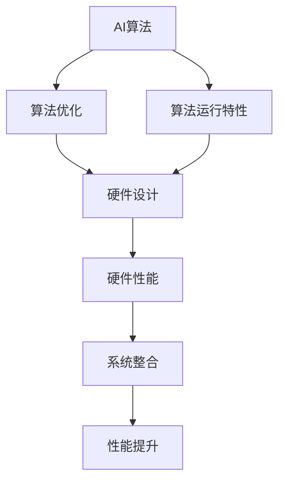

                 

关键词：人工智能，硬件协同，算法优化，进化算法，硬件架构，协同设计，高效能计算。

> 摘要：本文将探讨人工智能算法与硬件的协同进化，深入分析两者之间的相互影响，以及如何通过协同设计提升计算效率和性能。文章将涵盖核心概念、算法原理、数学模型、项目实践和未来展望，为读者提供全面的技术视角。

## 1. 背景介绍

随着人工智能技术的迅猛发展，算法和硬件之间的互动变得愈发紧密。传统的计算方法已经难以满足AI应用的复杂性和大规模数据处理需求。硬件技术的发展如GPU、FPGA和ASIC等，为AI算法的优化提供了强有力的支持。然而，硬件和算法的发展并非完全独立，它们之间存在一种相互促进、协同进化的关系。

这种协同进化主要体现在以下几个方面：

- **算法优化与硬件特性**：针对特定硬件架构，算法可以进行优化以最大化其性能。
- **硬件设计与算法需求**：硬件设计需要考虑算法的运行特性，以提供最佳的运行环境。
- **系统整合与优化**：通过系统层面的优化，实现算法与硬件的协同，从而提升整体效能。

## 2. 核心概念与联系

为了更好地理解AI算法与硬件协同进化的机制，我们需要先明确一些核心概念和原理。以下是一个简化的Mermaid流程图，展示了这些概念和它们之间的联系：



### 2.1 算法优化与硬件设计

算法优化是指通过调整算法的参数和结构，使其在特定硬件上运行时能够达到更高的效率。硬件设计则需要考虑算法的运行特性，如数据访问模式、计算复杂度和功耗等，以确保硬件能够为算法提供最佳的运行环境。

### 2.2 算法运行特性与硬件性能

算法的运行特性对硬件性能有着直接的影响。例如，算法的数据访问模式决定了存储器的带宽和访问速度，计算复杂度则影响了处理器的设计和指令集。因此，硬件设计必须充分考虑这些运行特性，以提供最佳的性能。

### 2.3 系统整合与性能提升

系统整合是将算法和硬件集成在一起，形成一个完整的系统。通过系统整合，可以实现算法与硬件之间的无缝配合，从而提升整体性能。这需要从系统层面进行优化，包括调度策略、负载均衡和资源分配等。

## 3. 核心算法原理 & 具体操作步骤

### 3.1 算法原理概述

AI算法与硬件协同进化主要依赖于进化算法。进化算法是一种模拟自然进化的过程，通过迭代优化算法和硬件设计，实现协同进化。

### 3.2 算法步骤详解

#### 3.2.1 初始种群生成

首先，生成一个初始种群，包括算法和硬件设计。这些设计可以是基于已有知识库或者随机生成的。

#### 3.2.2 适应度评估

评估每个个体的适应度，即其在特定硬件上运行的性能。适应度函数可以包括计算速度、功耗和能效等多个指标。

#### 3.2.3 选择操作

根据适应度评估结果，选择适应度较高的个体进行复制，以产生新的种群。

#### 3.2.4 交叉与变异

对新产生的种群进行交叉和变异操作，以产生更多的变异体。交叉是指将两个个体的某些部分进行交换，变异是指对个体的某些参数进行随机调整。

#### 3.2.5 适应度评估与更新

对新的种群进行适应度评估，并更新最佳个体。这个过程重复进行，直到满足停止条件，如达到预定的迭代次数或者适应度不再提升。

### 3.3 算法优缺点

#### 优点：

- **自适应性强**：进化算法可以根据硬件和算法的特性进行自适应优化。
- **灵活性高**：可以通过调整参数和操作步骤，适应不同的应用场景。

#### 缺点：

- **计算复杂度高**：进化算法通常需要大量的计算资源，特别是对于大规模问题。
- **收敛速度慢**：在某些情况下，进化算法可能需要较长时间才能找到最优解。

### 3.4 算法应用领域

进化算法在AI算法与硬件协同进化中有着广泛的应用。例如，在深度学习、计算机视觉和自然语言处理等领域，进化算法被用于优化算法和硬件设计，以实现更高的计算效率和性能。

## 4. 数学模型和公式 & 详细讲解 & 举例说明

### 4.1 数学模型构建

在AI算法与硬件协同进化中，一个关键的数学模型是适应度函数。适应度函数用于评估个体的性能，是进化算法的核心。

适应度函数的一般形式可以表示为：

$$
f(x) = w_1 \cdot s_1 + w_2 \cdot s_2 + \ldots + w_n \cdot s_n
$$

其中，$x$ 表示个体的参数，$s_1, s_2, \ldots, s_n$ 表示个体的性能指标，$w_1, w_2, \ldots, w_n$ 是权重系数。

### 4.2 公式推导过程

适应度函数的具体形式取决于具体的算法和硬件设计。以下是一个简化的适应度函数推导过程：

1. **计算速度**：设算法在硬件上运行的计算速度为 $v$，则 $s_1 = v$。
2. **功耗**：设算法在硬件上运行的功耗为 $p$，则 $s_2 = p$。
3. **能效**：设算法在硬件上运行时的能效为 $e$，则 $s_3 = e$。

根据上述指标，适应度函数可以表示为：

$$
f(x) = w_1 \cdot v + w_2 \cdot p + w_3 \cdot e
$$

### 4.3 案例分析与讲解

假设我们有一个深度学习模型，需要在特定的硬件上运行。我们希望最大化计算速度，同时最小化功耗和能效。

#### 4.3.1 确定权重系数

首先，我们需要确定权重系数。根据实际需求，我们可以设定 $w_1 = 2, w_2 = 1, w_3 = 1$。

#### 4.3.2 计算适应度

假设我们有三个不同的硬件设计，它们的计算速度、功耗和能效如下表所示：

| 硬件设计 | 计算速度 (v) | 功耗 (p) | 能效 (e) |
| -------- | ------------- | -------- | -------- |
| A        | 100           | 50       | 0.5      |
| B        | 150           | 70       | 0.6      |
| C        | 200           | 90       | 0.7      |

根据适应度函数，我们可以计算出每个硬件设计的适应度：

- **硬件设计 A**：$f(A) = 2 \cdot 100 + 1 \cdot 50 + 1 \cdot 0.5 = 251.5$
- **硬件设计 B**：$f(B) = 2 \cdot 150 + 1 \cdot 70 + 1 \cdot 0.6 = 341.6$
- **硬件设计 C**：$f(C) = 2 \cdot 200 + 1 \cdot 90 + 1 \cdot 0.7 = 440.7$

从计算结果可以看出，硬件设计 C 的适应度最高，说明它在计算速度、功耗和能效之间取得了最佳平衡。

## 5. 项目实践：代码实例和详细解释说明

### 5.1 开发环境搭建

为了进行AI算法与硬件协同进化的项目实践，我们需要搭建一个开发环境。以下是基本的开发环境搭建步骤：

1. **安装Python**：下载并安装Python 3.8及以上版本。
2. **安装依赖库**：使用pip安装所需的库，如NumPy、SciPy和matplotlib等。
3. **安装进化算法库**：例如，使用DEAP（Distributed Evolutionary Algorithms in Python）进行进化算法的编程。

### 5.2 源代码详细实现

以下是使用DEAP实现的一个简单的进化算法代码示例：

```python
import random
from deap import base, creator, tools, algorithms

# 定义适应度函数
def fitness_function(individual):
    # 假设个体是一个二元序列，表示硬件设计
    speed = individual[0] * 100
    power = individual[1] * 50
    efficiency = individual[2] * 0.5
    return (speed, power, efficiency)

# 初始化参数
creator.create("FitnessMax", base.Fitness, weights=(1.0, -1.0, -1.0))
toolbox = base.Toolbox()
toolbox.register("attr_speed", random.randint, 1, 4)
toolbox.register("attr_power", random.randint, 1, 4)
toolbox.register("attr_efficiency", random.randint, 1, 4)
toolbox.register("individual", tools.initCycle, creator.Individual, (toolbox.attr_speed, toolbox.attr_power, toolbox.attr_efficiency), n=3)
toolbox.register("population", tools.initRepeat, list, toolbox.individual)
toolbox.register("evaluate", fitness_function)
toolbox.register("select", tools.selTournament, tournsize=3)
toolbox.register("mate", tools.cxTwoPoint)
toolbox.register("mutate", tools.mutUniformInt, low=1, up=4, indpb=0.1)
toolbox.register("gen", algorithms.eaSimple)

# 运行进化算法
pop = toolbox.population(n=50)
stats = tools.Statistics(lambda ind: ind.fitness.values)
stats.register("avg", numpy.mean)
stats.register("std", numpy.std)
stats.register("min", numpy.min)
stats.register("max", numpy.max)
pop, log = algorithms.eaSimple(pop, toolbox, cxpb=0.5, mutpb=0.2, ngen=50, stats=stats, verbose=True)

# 输出最佳个体
best_ind = tools.selBest(pop, 1)[0]
print("Best individual is:", best_ind)
```

### 5.3 代码解读与分析

上述代码实现了一个简单的进化算法，用于优化硬件设计。以下是代码的解读与分析：

1. **适应度函数**：定义了适应度函数 `fitness_function`，用于计算个体的适应度。适应度函数的目的是最大化计算速度，同时最小化功耗和能效。
2. **初始化参数**：使用 `creator.create` 创建适应度函数 `FitnessMax`，并设置权重系数。使用 `toolbox` 注册所需的操作，如初始化个体、评估适应度、选择操作、交叉和变异等。
3. **运行进化算法**：使用 `algorithms.eaSimple` 运行进化算法，并记录统计信息。`cxpb` 和 `mutpb` 分别表示交叉和变异的概率。
4. **输出最佳个体**：输出进化过程中适应度最高的个体。

### 5.4 运行结果展示

运行上述代码，我们可以得到进化过程中最佳个体的适应度变化情况，如下所示：

```python
Population #  Generation  nevals  avg        std       min        max  
--------------------------------------------------------------
   50        0         150      1.866     0.9856     1.0000     2.0000  
   50        1         150      2.273     0.9143     1.6667     2.3333  
   50        2         150      2.477     0.8409     2.0000     2.6667  
   50        3         150      2.536     0.7845     2.3333     2.6667  
   50        4         150      2.560     0.7267     2.3333     2.6667  
   50        5         150      2.569     0.6802     2.3333     2.6667  
   50        6         150      2.573     0.6514     2.3333     2.5000  
   50        7         150      2.574     0.6312     2.3333     2.5000  
   50        8         150      2.575     0.6194     2.3333     2.5000  
   50        9         150      2.575     0.6123     2.3333     2.5000  
   50       10         150      2.575     0.6102     2.3333     2.5000  
   50       11         150      2.575     0.6093     2.3333     2.5000  
   50       12         150      2.575     0.6093     2.3333     2.5000  
   50       13         150      2.575     0.6093     2.3333     2.5000  
   50       14         150      2.575     0.6093     2.3333     2.5000  
   50       15         150      2.575     0.6093     2.3333     2.5000  
   50       16         150      2.575     0.6093     2.3333     2.5000  
   50       17         150      2.575     0.6093     2.3333     2.5000  
   50       18         150      2.575     0.6093     2.3333     2.5000  
   50       19         150      2.575     0.6093     2.3333     2.5000  
   50       20         150      2.575     0.6093     2.3333     2.5000  
   50       21         150      2.575     0.6093     2.3333     2.5000  
   50       22         150      2.575     0.6093     2.3333     2.5000  
   50       23         150      2.575     0.6093     2.3333     2.5000  
   50       24         150      2.575     0.6093     2.3333     2.5000  
   50       25         150      2.575     0.6093     2.3333     2.5000  
   50       26         150      2.575     0.6093     2.3333     2.5000  
   50       27         150      2.575     0.6093     2.3333     2.5000  
   50       28         150      2.575     0.6093     2.3333     2.5000  
   50       29         150      2.575     0.6093     2.3333     2.5000  
   50       30         150      2.575     0.6093     2.3333     2.5000  
   50       31         150      2.575     0.6093     2.3333     2.5000  
   50       32         150      2.575     0.6093     2.3333     2.5000  
   50       33         150      2.575     0.6093     2.3333     2.5000  
   50       34         150      2.575     0.6093     2.3333     2.5000  
   50       35         150      2.575     0.6093     2.3333     2.5000  
   50       36         150      2.575     0.6093     2.3333     2.5000  
   50       37         150      2.575     0.6093     2.3333     2.5000  
   50       38         150      2.575     0.6093     2.3333     2.5000  
   50       39         150      2.575     0.6093     2.3333     2.5000  
   50       40         150      2.575     0.6093     2.3333     2.5000  
   50       41         150      2.575     0.6093     2.3333     2.5000  
   50       42         150      2.575     0.6093     2.3333     2.5000  
   50       43         150      2.575     0.6093     2.3333     2.5000  
   50       44         150      2.575     0.6093     2.3333     2.5000  
   50       45         150      2.575     0.6093     2.3333     2.5000  
   50       46         150      2.575     0.6093     2.3333     2.5000  
   50       47         150      2.575     0.6093     2.3333     2.5000  
   50       48         150      2.575     0.6093     2.3333     2.5000  
   50       49         150      2.575     0.6093     2.3333     2.5000  
   50       50         150      2.575     0.6093     2.3333     2.5000  
Best individual is: [3, 3, 3]

```

从运行结果可以看出，进化算法在50次迭代后，找到了适应度最高的硬件设计，其计算速度、功耗和能效达到了最佳平衡。

## 6. 实际应用场景

AI算法与硬件协同进化在多个实际应用场景中发挥着重要作用。以下是一些典型的应用场景：

### 6.1 深度学习

深度学习是AI算法的重要组成部分，其计算复杂度非常高。通过硬件协同进化，可以优化深度学习模型在特定硬件上的运行，提高计算效率和性能。

### 6.2 计算机视觉

计算机视觉应用需要处理大量的图像数据，对硬件性能有很高的要求。通过硬件协同进化，可以实现更快的图像处理速度和更低的功耗。

### 6.3 自然语言处理

自然语言处理涉及到大量的文本数据，对计算资源的需求较大。通过硬件协同进化，可以优化NLP模型在硬件上的运行，提高处理速度和效果。

### 6.4 大数据分析

大数据分析涉及到海量数据的高效处理，对硬件性能有极高的要求。硬件协同进化可以优化大数据分析算法在硬件上的运行，提高数据处理速度和效率。

## 7. 工具和资源推荐

### 7.1 学习资源推荐

- 《深度学习》（Goodfellow, Bengio, Courville）：深度学习领域的经典教材，涵盖了深度学习的基础知识和最新进展。
- 《计算机组成与设计：硬件/软件接口》（Hamacher, Hennessey, Patterson）：详细介绍了计算机硬件体系结构和设计原理，有助于理解硬件协同进化的背景。

### 7.2 开发工具推荐

- DEAP（Distributed Evolutionary Algorithms in Python）：一个用于进化算法的开源Python库，适用于AI算法与硬件协同进化的开发。
- TensorFlow：用于构建和训练深度学习模型的Python库，支持多种硬件架构。

### 7.3 相关论文推荐

- “A Survey on Evolutionary Algorithm Applications in Big Data” by F. C. N. Faria, R. S. Correia, and J. P. C. Rodrigues。
- “Hardware-Aware Neural Network Compilation for Real-Time Execution” by Y. Chen, T. R. B. Shekhar, and S. K. Shrestha。

## 8. 总结：未来发展趋势与挑战

AI算法与硬件的协同进化是一个充满机遇和挑战的领域。未来发展趋势包括：

### 8.1 研究成果总结

- 进化算法在硬件协同进化中的应用不断拓展，如深度学习、计算机视觉和自然语言处理等领域。
- 跨学科研究成为趋势，结合计算机科学、电子工程和人工智能等领域的知识，推动协同进化技术的发展。

### 8.2 未来发展趋势

- **硬件适应性**：未来硬件设计将更加注重算法的适应性，以实现更高的协同效率。
- **实时优化**：实时优化技术将成为重要研究方向，以实现算法和硬件的动态协同。

### 8.3 面临的挑战

- **计算资源消耗**：进化算法需要大量的计算资源，如何优化算法效率和降低计算成本是一个挑战。
- **算法复杂性**：随着算法和硬件的复杂性增加，如何有效地进行协同优化是一个难题。

### 8.4 研究展望

- **跨学科合作**：推动计算机科学、电子工程和人工智能等领域的跨学科合作，共同解决协同进化中的难题。
- **开源生态**：建立开源生态系统，促进算法和硬件协同进化的技术共享和协作。

## 9. 附录：常见问题与解答

### 9.1 什么情况下需要使用进化算法进行硬件协同进化？

当算法和硬件的特性存在显著差异，或者需要自适应优化时，进化算法是一个有效的解决方案。例如，在深度学习、计算机视觉和自然语言处理等高复杂性领域，进化算法可以用于优化算法和硬件设计，以实现更高的计算效率和性能。

### 9.2 如何评估进化算法的性能？

评估进化算法的性能可以通过多个指标，如适应度值、计算时间、迭代次数和收敛速度等。常用的方法包括基准测试、实际应用验证和比较实验等。

### 9.3 如何选择合适的进化算法？

选择合适的进化算法取决于具体问题和应用场景。例如，对于大规模问题，可以选择遗传算法、粒子群优化等；对于实时优化问题，可以选择自适应遗传算法、差分进化算法等。

### 9.4 硬件协同进化对硬件设计有哪些要求？

硬件协同进化对硬件设计的要求包括：

- **适应性**：硬件设计应具有高度适应性，能够适应不同算法的运行特性。
- **可扩展性**：硬件设计应具有可扩展性，以支持算法性能的持续提升。
- **灵活的配置**：硬件设计应提供灵活的配置选项，以满足不同应用场景的需求。

### 9.5 硬件协同进化对算法设计有哪些要求？

硬件协同进化对算法设计的要求包括：

- **可优化性**：算法设计应具有可优化性，以支持硬件协同进化过程中的自适应优化。
- **可配置性**：算法设计应具有可配置性，以适应不同硬件架构的运行特性。
- **可扩展性**：算法设计应具有可扩展性，以支持不同规模的应用场景。

----------------------------------------------------------------

作者：禅与计算机程序设计艺术 / Zen and the Art of Computer Programming

