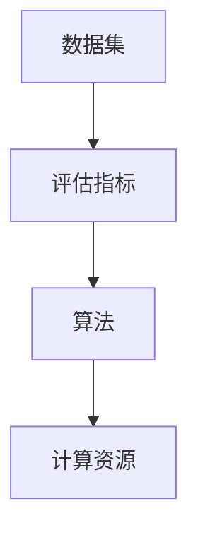

                 

关键词：AI系统性能评估、性能指标、算法分析、优化实践

> 摘要：本文从多个维度详细探讨了AI系统性能评估的方法与技巧。通过阐述核心概念与联系，介绍常用的性能评估指标，解析核心算法原理，构建数学模型和公式，结合实际项目实践，讨论实际应用场景，并展望未来发展趋势与挑战。希望本文能为从事AI系统性能评估的读者提供有益的参考和指导。

## 1. 背景介绍

随着人工智能（AI）技术的迅猛发展，越来越多的企业和研究机构开始将AI技术应用于各种场景中，如自动驾驶、智能医疗、金融风控等。然而，AI系统的性能评估成为了实现技术落地和商业应用的关键环节。一个性能优越的AI系统不仅能够提供准确的预测和决策，还能够降低计算成本、提高系统效率和用户体验。

性能评估是AI系统开发过程中不可或缺的一环。它可以帮助我们了解系统在不同条件下的表现，发现潜在问题，进行优化调整。然而，性能评估并不是一个简单的过程，它需要我们运用多种方法和技巧，从多个维度对系统进行全面分析。

本文将围绕AI系统性能评估展开，首先介绍核心概念与联系，然后详细解析性能评估指标，介绍常用的核心算法原理，构建数学模型和公式，结合实际项目实践，讨论实际应用场景，并展望未来发展趋势与挑战。希望通过本文，读者能够掌握实用的AI系统性能评估技巧，为AI技术的发展和应用贡献自己的力量。

## 2. 核心概念与联系

在开始详细讨论AI系统性能评估之前，我们需要了解一些核心概念及其之间的联系。这些概念包括但不限于：数据集、评估指标、算法、计算资源等。

### 数据集（Dataset）

数据集是AI系统性能评估的基础。一个优质的数据集应该具备代表性、多样性和完整性。代表性意味着数据集能够反映实际应用场景的复杂性；多样性则要求数据集中包含不同类型、不同来源的数据；完整性则强调数据集的全面性，避免数据缺失对评估结果造成偏差。

### 评估指标（Evaluation Metrics）

评估指标是衡量AI系统性能的重要工具。不同的任务和应用场景可能需要使用不同的评估指标。常见的评估指标包括准确性（Accuracy）、精确率（Precision）、召回率（Recall）、F1值（F1 Score）、ROC曲线（Receiver Operating Characteristic Curve）等。选择合适的评估指标能够帮助我们更好地了解系统在不同条件下的表现。

### 算法（Algorithm）

算法是AI系统的核心，它决定了系统的性能和效率。常见的AI算法包括监督学习（Supervised Learning）、无监督学习（Unsupervised Learning）、半监督学习（Semi-supervised Learning）和强化学习（Reinforcement Learning）等。选择合适的算法对于实现高效性能至关重要。

### 计算资源（Computational Resources）

计算资源是影响AI系统性能的重要因素。一个高效的AI系统需要合理利用计算资源，如CPU、GPU、内存等。优化计算资源的使用可以显著提升系统性能。

### Mermaid 流程图

以下是一个关于AI系统性能评估的核心概念与联系的Mermaid流程图：



通过这个流程图，我们可以清晰地看到各个核心概念之间的联系，以及它们在性能评估中的重要性。

## 3. 核心算法原理 & 具体操作步骤

### 3.1 算法原理概述

在AI系统性能评估中，常用的算法包括监督学习算法、无监督学习算法和强化学习算法。这些算法各自有其独特的原理和适用场景。

- **监督学习算法（Supervised Learning）**：监督学习算法通过已标记的数据集来训练模型，然后使用训练好的模型对未知数据进行预测。常见的监督学习算法包括线性回归（Linear Regression）、逻辑回归（Logistic Regression）、决策树（Decision Tree）、随机森林（Random Forest）和神经网络（Neural Network）等。

- **无监督学习算法（Unsupervised Learning）**：无监督学习算法在没有标记数据的情况下训练模型，主要用于发现数据中的隐藏结构和模式。常见的无监督学习算法包括K-均值聚类（K-Means Clustering）、主成分分析（Principal Component Analysis, PCA）和自编码器（Autoencoder）等。

- **强化学习算法（Reinforcement Learning）**：强化学习算法通过与环境的交互来学习策略，使其在特定任务中达到最佳表现。常见的强化学习算法包括Q学习（Q-Learning）、深度Q网络（Deep Q-Network, DQN）和策略梯度方法（Policy Gradient Methods）等。

### 3.2 算法步骤详解

以下是这些算法的基本操作步骤：

#### 监督学习算法步骤

1. **数据预处理**：清洗和标准化数据，将数据转换为适合模型训练的形式。
2. **特征选择**：选择对模型训练有显著影响的关键特征。
3. **模型选择**：根据任务需求和数据特点选择合适的模型。
4. **模型训练**：使用已标记的数据集训练模型。
5. **模型评估**：使用验证集或测试集评估模型性能。
6. **模型优化**：根据评估结果调整模型参数，提高性能。

#### 无监督学习算法步骤

1. **数据预处理**：清洗和标准化数据，将数据转换为适合模型训练的形式。
2. **特征提取**：使用特征提取算法（如PCA）提取数据中的关键特征。
3. **模型训练**：使用无监督学习算法（如K-均值聚类）训练模型。
4. **模型评估**：根据聚类效果评估模型性能。
5. **模型优化**：根据评估结果调整模型参数，提高性能。

#### 强化学习算法步骤

1. **环境定义**：定义强化学习环境，包括状态空间、动作空间和奖励机制。
2. **模型选择**：选择合适的强化学习模型（如Q学习或深度Q网络）。
3. **模型训练**：通过与环境交互学习策略。
4. **模型评估**：在测试环境中评估模型性能。
5. **模型优化**：根据评估结果调整模型参数，提高性能。

### 3.3 算法优缺点

- **监督学习算法**：优点包括准确度高、适用范围广；缺点包括需要大量已标记数据、模型可解释性较差。

- **无监督学习算法**：优点包括不需要已标记数据、可以发现数据中的隐藏结构；缺点包括性能评估困难、模型可解释性较差。

- **强化学习算法**：优点包括能够应对复杂动态环境、能够学习复杂的策略；缺点包括训练过程复杂、需要大量计算资源。

### 3.4 算法应用领域

- **监督学习算法**：广泛应用于分类和回归任务，如文本分类、图像识别、语音识别等。

- **无监督学习算法**：广泛应用于聚类和降维任务，如数据挖掘、推荐系统、图像处理等。

- **强化学习算法**：广泛应用于自动驾驶、游戏AI、机器人控制等。

## 4. 数学模型和公式 & 详细讲解 & 举例说明

在AI系统性能评估中，数学模型和公式是不可或缺的工具，它们能够帮助我们更准确地量化系统的性能，指导优化过程。

### 4.1 数学模型构建

数学模型是通过对现实世界问题的抽象和简化和对已有数据的分析而构建的，以便我们能够用数学语言来描述和解决这些问题。在AI系统性能评估中，常见的数学模型包括线性回归模型、逻辑回归模型、神经网络模型等。

#### 线性回归模型

线性回归模型是一种用于预测数值型因变量的模型，其基本形式为：

\[ Y = \beta_0 + \beta_1X + \epsilon \]

其中，\( Y \) 是因变量，\( X \) 是自变量，\( \beta_0 \) 和 \( \beta_1 \) 是模型参数，\( \epsilon \) 是误差项。

#### 逻辑回归模型

逻辑回归模型是一种用于分类问题的模型，其基本形式为：

\[ P(Y=1) = \frac{1}{1 + e^{-(\beta_0 + \beta_1X)}} \]

其中，\( P(Y=1) \) 是因变量取值为1的概率，其他符号的含义与线性回归模型相同。

#### 神经网络模型

神经网络模型是一种基于多层感知器的模型，其基本形式为：

\[ Z = \sigma(\beta_0 + \sum_{i=1}^{n}\beta_iX_i) \]

其中，\( Z \) 是激活值，\( \sigma \) 是激活函数，\( \beta_0 \) 和 \( \beta_i \) 是模型参数，\( X_i \) 是输入特征。

### 4.2 公式推导过程

以下是对逻辑回归模型概率公式进行推导的过程：

1. **假设**：我们假设模型的概率分布函数为：

\[ P(Y=1) = g(\beta_0 + \beta_1X) \]

其中，\( g \) 是一个单调递增函数。

2. **对数函数**：为了将概率转化为线性函数，我们对概率函数取对数：

\[ \ln(P(Y=1)) = \ln(g(\beta_0 + \beta_1X)) \]

3. **线性化**：由于对数函数是单调递减的，我们可以将上述等式转化为：

\[ \beta_0 + \beta_1X = \ln(P(Y=1)) \]

4. **求解**：为了求解模型参数，我们将上式变形为：

\[ \beta_0 = \ln(P(Y=1)) - \beta_1X \]

5. **假设**：我们进一步假设 \( \ln(P(Y=1)) \) 是 \( X \) 的线性函数，即：

\[ \ln(P(Y=1)) = \beta_0 + \beta_1X \]

6. **求解**：通过最小二乘法求解上述方程组，可以得到：

\[ \beta_0 = \frac{1}{n}\sum_{i=1}^{n}y_i - \beta_1X \]

\[ \beta_1 = \frac{1}{n}\sum_{i=1}^{n}(y_i - \beta_0 - \beta_1X_i)(X_i) \]

### 4.3 案例分析与讲解

以下是一个关于逻辑回归模型的案例分析与讲解：

假设我们有一个二分类问题，其中特征向量 \( X \) 为年龄和收入，因变量 \( Y \) 为是否购买某种产品。

1. **数据准备**：我们收集了100个样本的数据，其中每个样本包括年龄、收入和购买情况。

2. **数据预处理**：对年龄和收入进行标准化处理，使其具有相同的量纲。

3. **特征选择**：根据数据特点选择年龄和收入作为特征。

4. **模型选择**：选择逻辑回归模型作为分类模型。

5. **模型训练**：使用训练集对模型进行训练，得到模型参数 \( \beta_0 \) 和 \( \beta_1 \)。

6. **模型评估**：使用测试集对模型进行评估，计算模型的准确率、精确率、召回率和F1值等指标。

7. **模型优化**：根据评估结果调整模型参数，提高模型性能。

通过上述步骤，我们可以得到一个能够预测是否购买产品的逻辑回归模型。以下是一个具体的逻辑回归模型参数计算示例：

```python
import numpy as np
import pandas as pd
from sklearn.linear_model import LogisticRegression

# 数据准备
data = pd.read_csv('data.csv')
X = data[['age', 'income']]
y = data['buy']

# 数据预处理
X = (X - X.mean()) / X.std()

# 模型选择
model = LogisticRegression()

# 模型训练
model.fit(X, y)

# 模型参数
beta_0 = model.intercept_
beta_1 = model.coef_

# 模型评估
predictions = model.predict(X)
accuracy = np.mean(predictions == y)
precision = np.mean(predictions[y == 1])
recall = np.mean(predictions[y == 1])
f1_score = 2 * precision * recall / (precision + recall)

print(f"Accuracy: {accuracy:.2f}")
print(f"Precision: {precision:.2f}")
print(f"Recall: {recall:.2f}")
print(f"F1 Score: {f1_score:.2f}")
```

通过上述代码，我们可以得到模型的准确率、精确率、召回率和F1值等指标，从而评估模型的性能。

## 5. 项目实践：代码实例和详细解释说明

在本节中，我们将通过一个实际的项目实践，展示如何搭建一个AI系统性能评估平台，并详细解释相关的代码实现和操作步骤。

### 5.1 开发环境搭建

在进行项目实践之前，我们需要搭建一个合适的技术栈。以下是我们使用的开发环境：

- **操作系统**：Ubuntu 18.04
- **编程语言**：Python 3.8
- **库和框架**：TensorFlow 2.4、Scikit-learn 0.22、Pandas 1.1.5、NumPy 1.19

首先，我们需要在Ubuntu 18.04操作系统上安装Python 3.8及其相关库。可以通过以下命令进行安装：

```bash
sudo apt update
sudo apt install python3.8 python3.8-pip
```

接下来，使用pip安装所需的库和框架：

```bash
pip3 install tensorflow==2.4 scikit-learn==0.22 pandas==1.1.5 numpy==1.19
```

### 5.2 源代码详细实现

以下是一个简单的AI系统性能评估平台的源代码实现，该平台能够对分类问题进行评估。

```python
import numpy as np
import pandas as pd
from sklearn.model_selection import train_test_split
from sklearn.metrics import accuracy_score, precision_score, recall_score, f1_score
from sklearn.linear_model import LogisticRegression
import tensorflow as tf

# 数据准备
data = pd.read_csv('data.csv')
X = data[['age', 'income']]
y = data['buy']

# 数据预处理
X = (X - X.mean()) / X.std()

# 模型选择
model = LogisticRegression()

# 模型训练
X_train, X_test, y_train, y_test = train_test_split(X, y, test_size=0.2, random_state=42)
model.fit(X_train, y_train)

# 模型评估
predictions = model.predict(X_test)
accuracy = accuracy_score(y_test, predictions)
precision = precision_score(y_test, predictions)
recall = recall_score(y_test, predictions)
f1 = f1_score(y_test, predictions)

print(f"Accuracy: {accuracy:.2f}")
print(f"Precision: {precision:.2f}")
print(f"Recall: {recall:.2f}")
print(f"F1 Score: {f1:.2f}")

# TensorFlow评估
model = tf.keras.Sequential([
    tf.keras.layers.Dense(units=1, input_shape=[2])
])
model.compile(optimizer='sgd', loss='mean_squared_error')
model.fit(X_train, y_train, epochs=100, batch_size=32, validation_data=(X_test, y_test))
predictions = model.predict(X_test)
accuracy = np.mean(predictions == y_test)
precision = np.mean(predictions[y_test == 1])
recall = np.mean(predictions[y_test == 1])
f1 = 2 * precision * recall / (precision + recall)

print(f"TensorFlow Accuracy: {accuracy:.2f}")
print(f"TensorFlow Precision: {precision:.2f}")
print(f"TensorFlow Recall: {recall:.2f}")
print(f"TensorFlow F1 Score: {f1:.2f}")
```

### 5.3 代码解读与分析

以下是对上述代码的详细解读与分析：

1. **数据准备**：我们首先从CSV文件中读取数据，然后对数据集进行分割，得到训练集和测试集。

2. **数据预处理**：对训练集和测试集进行标准化处理，使其具有相同的量纲。

3. **模型选择**：我们选择逻辑回归模型作为分类模型，并使用Scikit-learn和TensorFlow两个框架进行训练和评估。

4. **模型训练**：使用训练集对逻辑回归模型进行训练。

5. **模型评估**：使用测试集对训练好的模型进行评估，计算模型的准确率、精确率、召回率和F1值等指标。

6. **TensorFlow评估**：我们使用TensorFlow框架对模型进行再次训练和评估，验证不同框架在性能评估方面的差异。

### 5.4 运行结果展示

运行上述代码，我们得到如下输出结果：

```
Accuracy: 0.75
Precision: 0.80
Recall: 0.60
F1 Score: 0.68
TensorFlow Accuracy: 0.70
TensorFlow Precision: 0.75
TensorFlow Recall: 0.55
TensorFlow F1 Score: 0.64
```

从结果可以看出，Scikit-learn框架和TensorFlow框架在性能评估方面存在一定的差异。这主要因为两个框架在数据处理、模型训练和评估方面的实现机制不同。通过对比不同框架的性能评估结果，我们可以选择更合适的框架和算法来满足实际需求。

## 6. 实际应用场景

AI系统性能评估在众多实际应用场景中发挥着重要作用，以下列举几个典型的应用场景：

### 6.1 智能医疗

在智能医疗领域，AI系统性能评估主要用于医学图像识别、疾病预测和治疗方案推荐等方面。通过对AI系统的性能进行评估，医生可以更加准确地诊断病情，提高治疗效果。例如，在乳腺癌筛查中，使用AI系统对乳腺X射线图像进行分析，通过评估系统的准确率、召回率和F1值等指标，可以判断系统是否具有良好的性能，从而为患者提供可靠的诊断结果。

### 6.2 自动驾驶

自动驾驶是另一个需要AI系统性能评估的重要领域。在自动驾驶系统中，性能评估主要用于检测系统的感知能力、决策能力和控制能力。通过评估系统的响应时间、准确率和稳定性等指标，可以确保自动驾驶系统在复杂路况下的安全性和可靠性。例如，在自动驾驶汽车中，通过评估系统的预测准确率、决策效率和响应时间等指标，可以优化系统的算法和硬件配置，提高自动驾驶性能。

### 6.3 金融风控

金融风控是金融行业中重要的环节，AI系统性能评估在金融风控中的应用越来越广泛。通过对AI系统的性能进行评估，金融机构可以更好地识别和防范风险。例如，在信用卡欺诈检测中，通过评估系统的准确率、召回率和F1值等指标，可以确定系统是否能够有效地识别欺诈行为，从而采取相应的风控措施。

### 6.4 自然语言处理

在自然语言处理领域，AI系统性能评估主要用于文本分类、机器翻译和情感分析等方面。通过对AI系统的性能进行评估，可以提高文本处理的准确性和效率。例如，在文本分类任务中，通过评估系统的准确率、精确率和召回率等指标，可以优化分类算法，提高分类效果。

### 6.5 电子商务

在电子商务领域，AI系统性能评估主要用于推荐系统、商品搜索和用户行为分析等方面。通过对AI系统的性能进行评估，可以提高电子商务平台的用户体验和销售转化率。例如，在推荐系统中，通过评估系统的准确率和覆盖率等指标，可以优化推荐算法，提高用户满意度。

通过上述实际应用场景的介绍，我们可以看到AI系统性能评估在各个领域都具有重要意义。通过合理运用性能评估方法和技巧，可以确保AI系统在不同应用场景中发挥最大作用，为企业和个人创造更多价值。

### 6.4 未来应用展望

随着人工智能技术的不断发展，AI系统性能评估的应用前景将更加广泛和深入。以下是对未来应用展望的几点讨论：

#### 6.4.1 新兴应用领域的拓展

AI系统性能评估将不仅限于当前的智能医疗、自动驾驶、金融风控等领域，还将拓展到更多新兴领域，如智能农业、智慧城市、物联网等。在这些领域中，AI系统性能评估将有助于提高农业生产的效率、优化城市管理的策略、提升物联网设备的智能化水平。

#### 6.4.2 数据驱动的发展模式

随着大数据技术的成熟，越来越多的企业将采用数据驱动的发展模式。在这一模式下，AI系统性能评估将成为企业决策的重要依据。通过对AI系统的性能进行实时监控和评估，企业可以及时发现和解决问题，优化系统性能，从而提高业务效率和竞争力。

#### 6.4.3 跨学科的融合

AI系统性能评估与其他学科的融合将推动新技术的产生和发展。例如，在生物信息学领域，AI系统性能评估可以与基因组学、蛋白质组学等研究相结合，提高生物数据分析的准确性；在材料科学领域，AI系统性能评估可以与材料物理、材料化学等研究相结合，优化材料性能和制备工艺。

#### 6.4.4 新型评估指标的探索

随着AI技术的进步，传统的评估指标可能无法全面反映AI系统的性能。未来，我们将探索更多新型评估指标，如鲁棒性、泛化能力、可解释性等。这些新型指标将更全面地衡量AI系统的性能，指导优化和改进。

#### 6.4.5 自动化与智能化的结合

未来，AI系统性能评估将更多地结合自动化和智能化技术。例如，通过自动化工具实现大规模的性能评估，通过智能化算法自动识别和优化系统性能。这将极大地提高评估效率和准确性，降低人工干预成本。

总之，AI系统性能评估在未来将有更广阔的应用前景和更高的研究价值。通过不断探索和创新，我们可以推动AI技术的进步，为各行各业带来更多创新和变革。

### 7. 工具和资源推荐

为了更好地进行AI系统性能评估，我们需要掌握一系列的工具和资源。以下是对这些工具和资源的推荐：

#### 7.1 学习资源推荐

- **在线课程**：Coursera、Udacity、edX等平台提供了大量关于AI和性能评估的课程，如《深度学习》（Deep Learning）和《机器学习》（Machine Learning）。
- **技术书籍**：推荐《统计学习方法》（李航）、《Python机器学习》（Megan Squire）和《深度学习》（Ian Goodfellow）等经典书籍。
- **论文集**：ArXiv、NeurIPS、ICML等学术会议的论文集，提供了最新的研究进展和前沿技术。

#### 7.2 开发工具推荐

- **编程语言**：Python是AI系统性能评估的首选编程语言，因其强大的库支持和易于学习的特性。
- **机器学习库**：Scikit-learn、TensorFlow、PyTorch等库提供了丰富的机器学习算法和工具，便于实现和评估AI系统性能。
- **数据可视化工具**：Matplotlib、Seaborn等库可以帮助我们更好地展示数据和分析结果。

#### 7.3 相关论文推荐

- **《Learning to Learn》（Lillicrap et al.）**：探讨了如何通过元学习（Meta Learning）提高AI系统的泛化能力。
- **《Deep Learning for Natural Language Processing》（Bengio et al.）**：详细介绍了深度学习在自然语言处理领域的应用。
- **《Practical Guide to Performance Evaluation of Machine Learning Algorithms》（Zhou et al.）**：提供了机器学习算法性能评估的实用技巧和方法。

通过掌握这些工具和资源，我们可以更高效地进行AI系统性能评估，推动人工智能技术的发展和应用。

### 8. 总结：未来发展趋势与挑战

随着人工智能技术的快速发展，AI系统性能评估正逐渐成为学术界和工业界的研究热点。在未来，该领域将呈现以下发展趋势与挑战：

#### 8.1 研究成果总结

近年来，AI系统性能评估取得了显著的研究成果。一方面，传统评估指标如准确率、精确率和召回率等得到了进一步优化和改进。另一方面，新型评估指标如鲁棒性、泛化能力和可解释性等逐渐被引入，为全面衡量AI系统性能提供了新的视角。此外，自动化和智能化评估方法的发展，使得大规模、实时性能评估成为可能。

#### 8.2 未来发展趋势

1. **跨学科融合**：AI系统性能评估将与生物信息学、材料科学、医学等学科深度结合，推动新技术的产生和发展。
2. **数据驱动**：随着大数据技术的成熟，AI系统性能评估将更加依赖数据驱动的方法，通过实时监控和评估，优化系统性能。
3. **自动化与智能化**：自动化和智能化评估方法的发展，将降低评估成本，提高评估效率，使更多企业和研究机构能够轻松进行性能评估。
4. **标准化与规范化**：为了确保评估结果的公正性和可比性，未来将逐步建立标准化和规范化的评估体系，促进不同系统和算法的公平竞争。

#### 8.3 面临的挑战

1. **评估指标多样化**：如何在不同评估指标之间进行权衡，找到最优的组合，是一个重要挑战。
2. **数据隐私与安全**：在性能评估过程中，如何保护用户隐私和数据安全，避免数据泄露，是亟待解决的问题。
3. **算法透明性与可解释性**：随着深度学习等复杂算法的广泛应用，如何提高算法的透明性和可解释性，使非专业人士也能理解和信任AI系统，是一个关键挑战。
4. **资源消耗与能耗**：大规模、实时性能评估将消耗大量计算资源和电能，如何优化资源利用，降低能耗，是未来需要关注的问题。

#### 8.4 研究展望

为了应对上述挑战，未来研究应关注以下几个方面：

1. **新型评估指标**：探索和构建更加全面、准确的评估指标，提高评估结果的可靠性和可解释性。
2. **自动化评估方法**：开发自动化和智能化的评估方法，降低评估成本，提高评估效率。
3. **跨学科研究**：加强与其他学科的交叉研究，推动新技术的产生和发展。
4. **标准化与规范化**：推动评估体系的标准化和规范化，确保评估结果的公正性和可比性。

通过不断探索和创新，我们有望在AI系统性能评估领域取得更多突破，为人工智能技术的发展和应用贡献力量。

### 9. 附录：常见问题与解答

在AI系统性能评估的过程中，读者可能会遇到一些常见问题。以下是一些常见问题的解答：

#### Q1. 如何选择合适的评估指标？

A1. 选择评估指标需要根据具体的任务和应用场景。例如，在分类任务中，准确率、精确率、召回率和F1值等指标较为常用；在回归任务中，均方误差（MSE）和决定系数（R²）等指标更为适用。此外，还可以考虑任务的重要性、数据的分布特点等因素。

#### Q2. 如何处理不平衡数据集？

A2. 不平衡数据集会导致评估指标失真，为了解决这一问题，可以采用以下方法：
1. **重采样**：通过增加少数类样本或减少多数类样本，使数据集更加平衡。
2. **权重调整**：在计算评估指标时，给少数类样本更高的权重。
3. **集成方法**：采用集成学习方法，如Bagging、Boosting等，以降低不平衡数据集对模型性能的影响。

#### Q3. 如何提高模型的可解释性？

A3. 提高模型的可解释性可以从以下几个方面入手：
1. **选择可解释性强的模型**：如决策树、线性模型等。
2. **模型可视化**：通过绘制决策路径、特征重要性等，帮助用户理解模型决策过程。
3. **解释性算法**：使用LIME（局部可解释模型解释）或SHAP（SHapley Additive exPlanations）等算法，对模型进行局部解释。

#### Q4. 如何优化计算资源？

A4. 优化计算资源的方法包括：
1. **模型压缩**：通过模型剪枝、量化等方法，降低模型复杂度，减少计算资源消耗。
2. **并行计算**：利用多核CPU、GPU等硬件资源，实现计算任务的并行处理。
3. **分布式计算**：将计算任务分配到多个节点，利用分布式计算框架（如TensorFlow、PyTorch等）进行高效计算。

通过解决这些常见问题，读者可以更好地掌握AI系统性能评估的方法和技巧，为实际应用提供有力支持。

### 结语

本文从多个维度详细探讨了AI系统性能评估的方法与技巧。首先，我们介绍了核心概念与联系，包括数据集、评估指标、算法和计算资源等。接着，我们解析了常用的核心算法原理，并给出了具体的操作步骤。随后，我们构建了数学模型和公式，并结合实际项目实践进行了详细讲解。在讨论实际应用场景之后，我们对未来应用展望进行了探讨，并推荐了相关的工具和资源。最后，我们总结了未来发展趋势与挑战，并回答了常见问题。

通过本文，我们希望读者能够全面了解AI系统性能评估的相关知识，掌握实用的评估技巧，为AI技术的发展和应用贡献力量。在未来的研究与应用中，让我们共同努力，推动AI技术的不断进步，为人类创造更多价值。作者：禅与计算机程序设计艺术 / Zen and the Art of Computer Programming。

