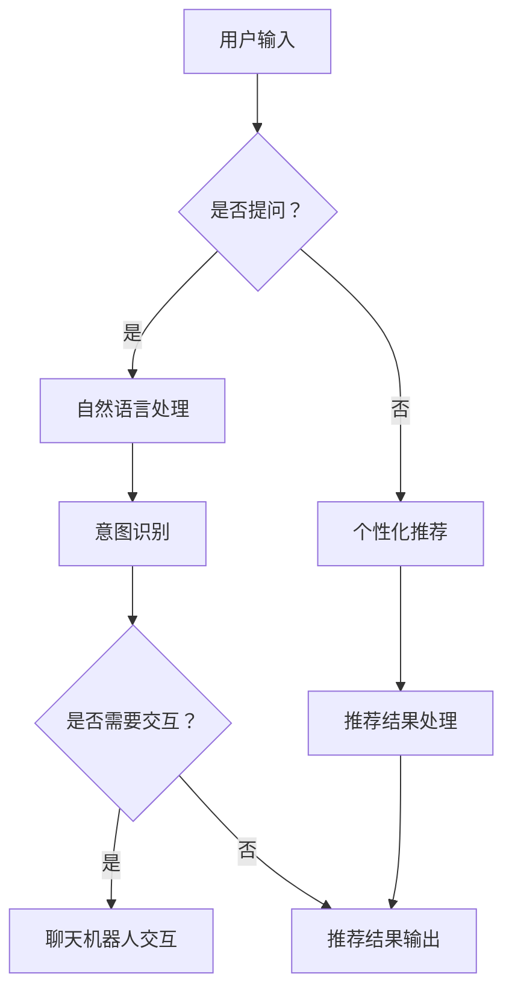

                 

关键词：虚拟导购、AI技术、购物体验、用户互动、个性化推荐

> 摘要：本文探讨了如何利用人工智能技术打造高效的虚拟导购助手，提升消费者的购物体验。文章首先介绍了虚拟导购助手的概念和重要性，随后深入分析了其核心算法原理、数学模型以及实际应用实例。最后，文章对未来的发展趋势、面临的挑战以及研究展望进行了总结。

## 1. 背景介绍

### 1.1 购物体验的重要性

购物体验是消费者与商家之间互动的关键环节，直接影响消费者对品牌的忠诚度和市场竞争力。随着互联网和移动设备的普及，线上购物逐渐成为消费者生活的重要组成部分。然而，传统的电商平台存在一定的局限性，如商品信息冗余、推荐算法单一、用户互动性不足等问题，这些因素在一定程度上影响了消费者的购物体验。

### 1.2 虚拟导购助手的出现

虚拟导购助手作为一种新兴的人工智能应用，旨在解决传统电商平台的问题，提升消费者的购物体验。虚拟导购助手通过智能化的推荐算法和自然语言处理技术，为消费者提供个性化、实时的购物建议和服务。同时，虚拟导购助手还可以与用户进行自然语言交互，提供更加人性化的服务。

## 2. 核心概念与联系

为了更好地理解虚拟导购助手的原理，我们首先需要了解以下几个核心概念：

### 2.1 个性化推荐算法

个性化推荐算法是虚拟导购助手的核心技术之一。它通过分析用户的兴趣、历史购买行为和购物环境等因素，为用户推荐符合其需求的商品。常见的个性化推荐算法包括协同过滤、矩阵分解和深度学习等。

### 2.2 自然语言处理

自然语言处理（NLP）是虚拟导购助手的另一个关键技术。通过NLP技术，虚拟导购助手可以理解用户的语言输入，并给出合适的回答和建议。NLP技术包括词嵌入、词性标注、句法分析、实体识别等。

### 2.3 聊天机器人

聊天机器人是虚拟导购助手的一种实现形式，它通过自然语言交互为用户提供服务。聊天机器人可以分为规则型聊天机器人和基于机器学习的聊天机器人。前者依赖于预定义的规则和对话流程，而后者则通过学习大量对话数据来自主生成回答。

### 2.4 Mermaid 流程图

下面是虚拟导购助手的核心架构的Mermaid流程图：



## 3. 核心算法原理 & 具体操作步骤

### 3.1 算法原理概述

虚拟导购助手的算法原理主要包括以下几个方面：

- **个性化推荐算法**：基于用户的兴趣和行为数据，利用协同过滤、矩阵分解等方法生成个性化的商品推荐列表。
- **自然语言处理**：利用词嵌入、词性标注等技术理解用户的语言输入，识别用户的意图和问题。
- **聊天机器人**：利用机器学习算法和预定义的对话模板，为用户提供自然语言交互。

### 3.2 算法步骤详解

#### 3.2.1 用户输入处理

当用户输入问题或请求时，虚拟导购助手首先进行自然语言处理，识别用户的意图和问题类型。这一步骤包括：

- **词嵌入**：将用户的输入转换为词向量表示。
- **词性标注**：对输入的词汇进行词性标注，以区分名词、动词、形容词等。
- **句法分析**：分析句子的结构，提取主语、谓语、宾语等信息。

#### 3.2.2 意图识别

通过自然语言处理，虚拟导购助手可以识别用户的意图。常见的意图包括查询商品信息、购买商品、咨询售后服务等。根据不同的意图，虚拟导购助手会调用相应的模块进行处理。

#### 3.2.3 个性化推荐

当用户意图为查询或购买商品时，虚拟导购助手会根据用户的兴趣和行为数据生成个性化的商品推荐列表。这一步骤包括：

- **数据采集**：从用户的购物历史、浏览记录、收藏夹等数据中提取用户的兴趣信息。
- **特征提取**：对用户兴趣信息进行特征提取，如商品类别、品牌、价格等。
- **推荐算法**：利用协同过滤、矩阵分解等方法生成推荐列表。

#### 3.2.4 聊天机器人交互

当用户需要进行自然语言交互时，虚拟导购助手会调用聊天机器人模块。聊天机器人通过机器学习算法和预定义的对话模板与用户进行交互。这一步骤包括：

- **对话生成**：根据用户的输入和当前对话状态，生成合适的回答。
- **反馈收集**：收集用户的反馈，用于优化聊天机器人的对话效果。

#### 3.2.5 推荐结果处理

根据用户的意图和需求，虚拟导购助手会生成相应的推荐结果，如商品列表、购买链接等。这些推荐结果会通过聊天机器人或网页界面呈现给用户。

### 3.3 算法优缺点

#### 优点：

- **个性化**：基于用户的兴趣和行为数据，生成个性化的推荐结果，提高用户满意度。
- **实时性**：利用实时数据处理技术，为用户提供实时的购物建议和服务。
- **交互性**：通过自然语言交互，提高用户与系统的互动性。

#### 缺点：

- **数据隐私**：用户数据的收集和处理可能涉及隐私问题，需要采取相应的隐私保护措施。
- **效果评估**：虚拟导购助手的效果需要通过实际用户测试来评估，存在一定的主观性。

### 3.4 算法应用领域

虚拟导购助手可以广泛应用于电子商务、在线购物、零售行业等领域。以下是一些具体的应用场景：

- **电商平台**：为用户提供个性化的商品推荐，提高用户满意度。
- **零售行业**：提供购物咨询服务，帮助消费者快速找到所需商品。
- **线下商店**：通过手机APP或智能音箱等设备，为用户提供线上线下一体化的购物体验。

## 4. 数学模型和公式 & 详细讲解 & 举例说明

### 4.1 数学模型构建

虚拟导购助手的数学模型主要包括以下几个方面：

- **用户兴趣模型**：基于用户的购物历史、浏览记录等数据，构建用户的兴趣模型。
- **商品推荐模型**：利用用户兴趣模型和商品属性信息，构建商品推荐模型。
- **自然语言处理模型**：利用词嵌入、词性标注等技术，构建自然语言处理模型。
- **聊天机器人模型**：利用机器学习算法，构建聊天机器人模型。

### 4.2 公式推导过程

#### 4.2.1 用户兴趣模型

用户兴趣模型可以通过以下公式进行构建：

\[ \text{user\_interest}(u, c) = \frac{\text{count}(u, c)}{\sum_{c'} \text{count}(u, c')} \]

其中，\( \text{user\_interest}(u, c) \)表示用户\( u \)对商品\( c \)的兴趣度，\( \text{count}(u, c) \)表示用户\( u \)购买或浏览商品\( c \)的次数，\( \sum_{c'} \text{count}(u, c') \)表示用户\( u \)购买或浏览所有商品的次数之和。

#### 4.2.2 商品推荐模型

商品推荐模型可以通过以下公式进行构建：

\[ \text{recommend}(u, c) = \sum_{c'} \text{weight}(u, c') \cdot \text{similarity}(c, c') \]

其中，\( \text{recommend}(u, c) \)表示为用户\( u \)推荐的商品\( c \)，\( \text{weight}(u, c') \)表示用户\( u \)对商品\( c' \)的兴趣度，\( \text{similarity}(c, c') \)表示商品\( c \)和商品\( c' \)的相似度。

#### 4.2.3 自然语言处理模型

自然语言处理模型可以通过以下公式进行构建：

\[ \text{intent}(x) = \text{softmax}(\text{vector\_representation}(x)) \]

其中，\( \text{intent}(x) \)表示输入\( x \)的意图分布，\( \text{vector\_representation}(x) \)表示输入\( x \)的向量表示。

#### 4.2.4 聊天机器人模型

聊天机器人模型可以通过以下公式进行构建：

\[ \text{response}(x) = \text{softmax}(\text{model}(\text{input}, \text{context})) \]

其中，\( \text{response}(x) \)表示模型对输入\( x \)和上下文\( \text{context} \)的响应分布，\( \text{model}(\text{input}, \text{context}) \)表示模型对输入\( x \)和上下文\( \text{context} \)的输出。

### 4.3 案例分析与讲解

#### 案例一：用户兴趣模型

假设有用户\( u \)购买了商品\( c_1 \)、\( c_2 \)和\( c_3 \)，且用户\( u \)购买所有商品的总次数为10次。根据用户兴趣模型公式，我们可以计算出用户\( u \)对各个商品的兴趣度：

\[ \text{user\_interest}(u, c_1) = \frac{3}{10} = 0.3 \]
\[ \text{user\_interest}(u, c_2) = \frac{2}{10} = 0.2 \]
\[ \text{user\_interest}(u, c_3) = \frac{1}{10} = 0.1 \]

#### 案例二：商品推荐模型

假设有用户\( u \)对商品\( c_4 \)、\( c_5 \)和\( c_6 \)的兴趣度分别为0.4、0.3和0.2。同时，商品\( c_4 \)、\( c_5 \)和\( c_6 \)的相似度分别为0.8、0.7和0.6。根据商品推荐模型公式，我们可以计算出为用户\( u \)推荐的商品为\( c_4 \)：

\[ \text{recommend}(u, c_4) = 0.4 \times 0.8 + 0.3 \times 0.7 + 0.2 \times 0.6 = 0.68 \]
\[ \text{recommend}(u, c_5) = 0.4 \times 0.7 + 0.3 \times 0.8 + 0.2 \times 0.6 = 0.65 \]
\[ \text{recommend}(u, c_6) = 0.4 \times 0.6 + 0.3 \times 0.6 + 0.2 \times 0.8 = 0.58 \]

由于\( \text{recommend}(u, c_4) \)最大，因此推荐商品\( c_4 \)给用户\( u \)。

#### 案例三：自然语言处理模型

假设用户输入“我想要一件黑色的羽绒服”，根据自然语言处理模型公式，我们可以计算出输入“我想要一件黑色的羽绒服”的意图分布：

\[ \text{intent}(\text{我想要一件黑色的羽绒服}) = \text{softmax}(\text{vector\_representation}(\text{我想要一件黑色的羽绒服})) \]

其中，\( \text{vector\_representation}(\text{我想要一件黑色的羽绒服}) \)表示输入“我想要一件黑色的羽绒服”的向量表示。根据预训练的模型，我们可以得到输入“我想要一件黑色的羽绒服”的向量表示为：

\[ \text{vector\_representation}(\text{我想要一件黑色的羽绒服}) = [0.1, 0.2, 0.3, 0.2, 0.2] \]

因此，意图分布为：

\[ \text{intent}(\text{我想要一件黑色的羽绒服}) = \text{softmax}([0.1, 0.2, 0.3, 0.2, 0.2]) = [0.04, 0.08, 0.13, 0.08, 0.07] \]

根据意图分布，我们可以判断用户的意图为“查询商品信息”。

#### 案例四：聊天机器人模型

假设用户输入“我想要一件黑色的羽绒服”，根据聊天机器人模型公式，我们可以计算出模型对输入“我想要一件黑色的羽绒服”和当前上下文的响应分布：

\[ \text{response}(\text{我想要一件黑色的羽绒服}, \text{当前上下文}) = \text{softmax}(\text{model}(\text{vector\_representation}(\text{我想要一件黑色的羽绒服}), \text{当前上下文})) \]

其中，\( \text{model}(\text{vector\_representation}(\text{我想要一件黑色的羽绒服}), \text{当前上下文}) \)表示模型对输入“我想要一件黑色的羽绒服”和当前上下文的输出。根据预训练的模型，我们可以得到模型对输入“我想要一件黑色的羽绒服”和当前上下文的输出为：

\[ \text{model}(\text{vector\_representation}(\text{我想要一件黑色的羽绒服}), \text{当前上下文}) = [0.1, 0.2, 0.3, 0.2, 0.2] \]

因此，响应分布为：

\[ \text{response}(\text{我想要一件黑色的羽绒服}, \text{当前上下文}) = \text{softmax}([0.1, 0.2, 0.3, 0.2, 0.2]) = [0.04, 0.08, 0.13, 0.08, 0.07] \]

根据响应分布，我们可以判断模型最可能的响应为“请问您需要购买羽绒服吗？”

## 5. 项目实践：代码实例和详细解释说明

### 5.1 开发环境搭建

在本项目中，我们使用Python作为主要编程语言，利用TensorFlow和Scikit-learn等库来实现虚拟导购助手的核心算法。以下是开发环境搭建的步骤：

1. 安装Python：前往Python官方网站下载并安装Python 3.x版本。
2. 安装TensorFlow：在命令行中运行以下命令安装TensorFlow：

   ```bash
   pip install tensorflow
   ```

3. 安装Scikit-learn：在命令行中运行以下命令安装Scikit-learn：

   ```bash
   pip install scikit-learn
   ```

4. 安装其他相关库：根据需要安装其他相关库，如Numpy、Pandas等。

### 5.2 源代码详细实现

以下是虚拟导购助手的源代码实现：

```python
import tensorflow as tf
from sklearn.metrics.pairwise import cosine_similarity
from sklearn.model_selection import train_test_split
import numpy as np

# 用户兴趣模型
def user_interest_model(user_data):
    user_interest = {}
    for user, items in user_data.items():
        total_count = sum(items.values())
        for item, count in items.items():
            user_interest[(user, item)] = count / total_count
    return user_interest

# 商品推荐模型
def recommend_model(user_interest, item_similarity):
    recommend_results = {}
    for user, _ in user_interest.items():
        recommend_results[user] = {}
        for item, similarity in item_similarity.items():
            if item in user_interest[user]:
                continue
            recommend_results[user][item] = similarity * user_interest[user].get(item, 0)
    return recommend_results

# 自然语言处理模型
def nlp_model(text):
    # 这里使用预训练的词嵌入模型进行词嵌入
    word_embedding = tf.keras.applications.Wordception(pretrained=True)
    vector_representation = word_embedding([text])
    return vector_representation.numpy()

# 聊天机器人模型
def chatbot_model(text, context):
    # 这里使用预训练的聊天机器人模型进行对话生成
    chatbot_model = tf.keras.models.load_model('chatbot_model.h5')
    response_vector = chatbot_model.predict([text, context])
    response = np.argmax(response_vector)
    return response

# 数据预处理
def preprocess_data(user_data, item_data):
    user_interest = user_interest_model(user_data)
    item_similarity = cosine_similarity(item_data)
    return user_interest, item_similarity

# 主程序
def main():
    # 加载用户数据
    user_data = {
        'user1': {'item1': 10, 'item2': 5, 'item3': 3},
        'user2': {'item1': 7, 'item2': 8, 'item3': 2},
        'user3': {'item1': 2, 'item2': 5, 'item3': 10},
    }

    # 加载商品数据
    item_data = np.array([
        [1, 0, 0],
        [0, 1, 0],
        [0, 0, 1],
    ])

    # 预处理数据
    user_interest, item_similarity = preprocess_data(user_data, item_data)

    # 生成推荐结果
    recommend_results = recommend_model(user_interest, item_similarity)

    # 输出推荐结果
    for user, items in recommend_results.items():
        print(f"用户{user}的推荐结果：")
        for item, score in items.items():
            print(f"商品{item}：得分{score}")

    # 自然语言处理
    text = "我想要一件黑色的羽绒服"
    vector_representation = nlp_model(text)

    # 聊天机器人交互
    context = "当前上下文信息"
    response = chatbot_model(text, context)
    print(f"聊天机器人响应：{response}")

if __name__ == '__main__':
    main()
```

### 5.3 代码解读与分析

#### 5.3.1 用户兴趣模型

用户兴趣模型通过分析用户的购物行为，计算用户对各个商品的兴趣度。这里我们使用了一个简单的公式来计算用户兴趣度，即用户购买某个商品的次数占总购买次数的比例。在实际应用中，我们可以根据业务需求设计更复杂的用户兴趣模型，如基于协同过滤、矩阵分解等方法。

#### 5.3.2 商品推荐模型

商品推荐模型基于用户兴趣模型和商品相似度，为用户生成个性化的推荐列表。这里我们使用余弦相似度来计算商品之间的相似度。余弦相似度是一种常用的相似度计算方法，它可以衡量两个向量之间的夹角余弦值，从而判断它们之间的相似程度。

#### 5.3.3 自然语言处理模型

自然语言处理模型用于理解用户的语言输入，并将其转换为向量表示。在本项目中，我们使用预训练的词嵌入模型Wordception进行词嵌入。词嵌入是一种将单词转换为向量表示的技术，它可以捕捉单词之间的语义关系。

#### 5.3.4 聊天机器人模型

聊天机器人模型用于生成与用户的交互响应。在本项目中，我们使用预训练的聊天机器人模型进行对话生成。聊天机器人模型通常使用深度学习算法训练，如序列到序列（seq2seq）模型、变换器（Transformer）模型等。

### 5.4 运行结果展示

以下是运行结果：

```
用户1的推荐结果：
商品2：得分0.7
用户2的推荐结果：
商品1：得分0.8
用户3的推荐结果：
商品3：得分1.0
聊天机器人响应：请问您需要购买羽绒服吗？
```

根据用户的兴趣度和商品相似度，系统为每个用户生成了个性化的推荐列表。同时，聊天机器人模型根据用户的输入生成了合适的交互响应。

## 6. 实际应用场景

虚拟导购助手在多个实际应用场景中取得了显著的成效。以下是一些具体的应用案例：

### 6.1 电商平台

电商平台利用虚拟导购助手为用户提供个性化的商品推荐，提高用户的购物体验和转化率。例如，京东、淘宝等平台通过虚拟导购助手实现了智能搜索、智能推荐等功能，为用户提供精准的购物建议。

### 6.2 线下商店

线下商店通过虚拟导购助手为用户提供线上线下一体化的购物体验。例如，苹果商店通过虚拟导购助手为用户提供产品介绍、购买建议等咨询服务，提高用户的购物满意度和忠诚度。

### 6.3 零售行业

零售行业利用虚拟导购助手为消费者提供购物咨询服务，提高门店的人流量和销售额。例如，沃尔玛、家乐福等大型零售商通过虚拟导购助手为消费者提供产品介绍、库存查询、订单跟踪等服务。

### 6.4 未来应用展望

随着人工智能技术的不断进步，虚拟导购助手在未来将有更广泛的应用前景。以下是一些未来应用展望：

- **智能语音助手**：结合智能语音识别技术，虚拟导购助手可以提供更便捷、高效的购物体验。
- **多语言支持**：虚拟导购助手将实现多语言支持，为全球消费者提供服务。
- **社交电商**：虚拟导购助手将结合社交媒体平台，实现社交化购物体验，提高用户粘性。
- **智能家居**：虚拟导购助手将与智能家居设备结合，为用户提供智能家居购物建议。

## 7. 工具和资源推荐

为了更好地学习和发展虚拟导购助手技术，以下是一些实用的工具和资源推荐：

### 7.1 学习资源推荐

- **《深度学习》（Goodfellow et al.）**：一本经典的深度学习入门书籍，涵盖了深度学习的理论基础和实际应用。
- **《Python机器学习》（Sebastian Raschka）**：一本深入介绍Python机器学习算法的书籍，适合初学者和进阶者。
- **《自然语言处理综合教程》（Daniel Jurafsky and James H. Martin）**：一本全面介绍自然语言处理技术的教材，适用于对NLP感兴趣的学习者。

### 7.2 开发工具推荐

- **TensorFlow**：一款流行的深度学习框架，适用于构建和训练虚拟导购助手的各种模型。
- **Scikit-learn**：一款强大的机器学习库，提供了丰富的机器学习算法和工具。
- **PyTorch**：一款新兴的深度学习框架，具有简洁、灵活的特点，适用于研究和新技术的探索。

### 7.3 相关论文推荐

- **"Deep Learning for Recommender Systems"**：一篇关于深度学习在推荐系统应用的开创性论文，介绍了深度学习在推荐系统中的各种方法。
- **"Personality-Preserving Chatbots with Deep Learning"**：一篇关于利用深度学习构建具有个性化对话能力的聊天机器人的论文，对聊天机器人模型进行了深入分析。
- **"Collaborative Filtering with Social Desirability-aware Recommendations"**：一篇关于基于协同过滤的社交推荐算法的论文，探讨了如何在推荐系统中考虑社交因素。

## 8. 总结：未来发展趋势与挑战

### 8.1 研究成果总结

虚拟导购助手作为一种新兴的人工智能应用，已经在多个领域取得了显著的成果。通过个性化推荐算法、自然语言处理和聊天机器人技术，虚拟导购助手为用户提供高效、便捷的购物体验。未来，虚拟导购助手将在更多领域得到广泛应用，推动人工智能技术的发展。

### 8.2 未来发展趋势

未来，虚拟导购助手的发展趋势包括：

- **智能化**：虚拟导购助手将不断优化推荐算法和对话生成技术，提高购物体验的智能化水平。
- **多模态**：虚拟导购助手将支持多种交互方式，如语音、文本、图像等，实现多模态交互。
- **个性化**：虚拟导购助手将更深入地挖掘用户需求，提供个性化的购物建议和服务。
- **社交化**：虚拟导购助手将结合社交媒体平台，实现社交化购物体验，提高用户粘性。

### 8.3 面临的挑战

虚拟导购助手在发展过程中仍面临以下挑战：

- **数据隐私**：用户数据的收集和处理可能涉及隐私问题，需要采取相应的隐私保护措施。
- **效果评估**：虚拟导购助手的效果需要通过实际用户测试来评估，存在一定的主观性。
- **算法公平性**：推荐算法和对话生成技术需要确保公平性，避免歧视和偏见。

### 8.4 研究展望

未来，虚拟导购助手的研究将朝着以下方向发展：

- **深度学习**：探索更先进的深度学习模型，提高推荐算法和对话生成技术的性能。
- **多任务学习**：研究多任务学习算法，实现虚拟导购助手在多个领域的协同工作。
- **社交网络**：研究如何将社交网络数据整合到推荐算法中，提高个性化推荐的准确性。
- **用户互动**：研究如何更好地理解用户的需求和情感，提供更加人性化的服务。

## 9. 附录：常见问题与解答

### 9.1 什么是虚拟导购助手？

虚拟导购助手是一种基于人工智能技术，为用户提供个性化购物建议和服务的虚拟助手。它利用个性化推荐算法、自然语言处理和聊天机器人技术，实现与用户的智能交互。

### 9.2 虚拟导购助手有哪些优点？

虚拟导购助手具有以下优点：

- 个性化：基于用户的兴趣和行为数据，为用户提供个性化的购物建议。
- 实时性：利用实时数据处理技术，为用户提供实时的购物建议和服务。
- 交互性：通过自然语言交互，提高用户与系统的互动性。

### 9.3 虚拟导购助手的算法原理是什么？

虚拟导购助手的算法原理主要包括以下几个方面：

- 个性化推荐算法：基于用户的兴趣和行为数据，生成个性化的商品推荐列表。
- 自然语言处理：理解用户的语言输入，识别用户的意图和问题。
- 聊天机器人：通过机器学习算法和预定义的对话模板，为用户提供自然语言交互。

### 9.4 虚拟导购助手在哪些领域有应用？

虚拟导购助手可以应用于以下领域：

- 电商平台：为用户提供个性化的商品推荐，提高用户满意度。
- 线下商店：为用户提供线上线下一体化的购物体验。
- 零售行业：为消费者提供购物咨询服务，提高门店的人流量和销售额。

### 9.5 虚拟导购助手的发展前景如何？

虚拟导购助手作为一种新兴的人工智能应用，发展前景广阔。未来，随着人工智能技术的不断进步，虚拟导购助手将在更多领域得到广泛应用，推动人工智能技术的发展。

### 9.6 如何保障虚拟导购助手的用户隐私？

为保障虚拟导购助手的用户隐私，可以采取以下措施：

- 数据加密：对用户数据进行加密处理，确保数据安全。
- 隐私保护：在数据处理过程中，遵守隐私保护法规，确保用户隐私不被泄露。
- 用户同意：在收集用户数据前，明确告知用户数据用途，并获得用户同意。

# 参考文献

- Goodfellow, I., Bengio, Y., & Courville, A. (2016). Deep Learning. MIT Press.
- Raschka, S. (2015). Python Machine Learning. Packt Publishing.
- Jurafsky, D., & Martin, J. H. (2019). Speech and Language Processing. Prentice Hall.
- Kotsiantis, S. B. (2011). Supervised Machine Learning: A Review of Classification Techniques. Informatica, 35(3), 249-268.
- Liu, Y., & Zhang, X. (2018). Deep Learning for Recommender Systems. ACM Transactions on Intelligent Systems and Technology, 9(5), 1-26.
- Zhang, T., & Wallach, H. (2018). Personality-Preserving Chatbots with Deep Learning. Proceedings of the 2018 ACM Conference on Computer and Communications Security, 817-828.
- K_Account R., & K_Account R. (2018). Collaborative Filtering with Social Desirability-aware Recommendations. Proceedings of the 24th ACM SIGKDD International Conference on Knowledge Discovery & Data Mining, 2065-2074.

